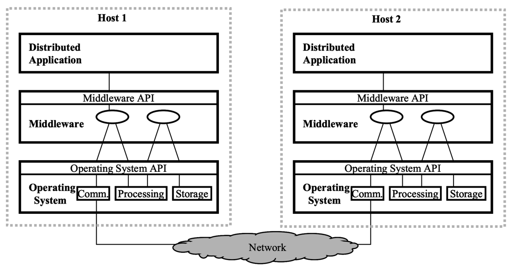

## Introduction

Middleware is a class of software technologies designed to help manage the complexity and heterogeneity inherent in distributed systems.
It is defined as a layer of software above the operating system but below the application program that provides a common programming abstraction across a distributed system, as shown in Figure 1.
In doing so, it provides a higher-level building block for programmers than Application Programming Interfaces (APIs) such as sockets that are provided by the operating system.
This significantly reduces the burden on application programmers by relieving them of this kind of tedious and error-prone programming.
Middleware is sometimes informally called “plumbing” because it connects parts of a distributed application with data pipes and then passes data between them.

Fig.1. Middleware Layer in Context.

Middleware frameworks are designed to mask some of the kinds of heterogeneity that programmers of distributed systems must deal with. They always mask heterogeneity of networks and hardware.
Most middleware frameworks also mask heterogeneity of operating systems or programming languages, or both.
A few such as CORBA also mask heterogeneity among vendor implementations of the same middleware standard.
Finally, programming abstractions offered by middleware can provide transparency with respect to distribution in one or more of the following dimensions: location, concurrency, replication, failures, and mobility.

The classical definition of an operating system is “the software that makes the hardware useable.”
Similarly, middleware can be considered to be the software that makes a distributed system programmable.
Just as a bare computer without an operating system could be programmed with great difficulty, programming a distributed system is in general much more difficult without middleware, especially when heterogeneous operation is required.
Likewise, it is possible to program an application with an assembler language or even machine code, but most programmers find it far more productive to use high-level languages for this purpose, and the resulting code is of course also portable.

## Categories of Middleware

There are a small number of different kinds of middleware that have been developed.
These vary in terms of the programming abstractions they provide and the kinds of heterogeneity they provide beyond network and hardware.

Distributed Tuples

A distributed relational databases (see Distributed Databases) offers the abstraction of distributed tuples, and are the most widely deployed kind of middleware today.
Its Structured Query Language (SQL) allows programmers to manipulate sets of these tuples (a database) in an English-like language yet with intuitive semantics and rigorous mathematical foundations based on set theory and predicate calculus.
Distributed relational databases also offer the abstraction of a transaction.
Distributed relational database products typically offer heterogeneity across programming languages, but most do not offer much, if any, heterogeneity across vendor implementations.
Transaction Processing Monitors (TPMs) are commonly used for end-to-end resource management of client queries, especially server-side process management and managing multi-database transactions.

Linda (see Linda) is a framework offering a distributed tuple abstraction called Tuple Space (TS). 
Linda’s API provides associative access to TS, but without any relational semantics. 
Linda offers spatial decoupling by allowing depositing and withdrawing processes to be unaware of each other’s identities. 
It offers temporal decoupling by allowing them to have non-overlapping lifetimes.
Jini is a Java framework for intelligent devices, especially in the home. Jini is built on top of JavaSpaces, which is very closely related to Linda’s TS.

Remote Procedure Call
Remote procedure call (RPC; see Remote Procedure Calls) middleware extends the procedure call interface familiar to
virtually all programmers to offer the abstraction of being able to invoke a procedure whose body is across a network.
RPC systems are usually synchronous, and thus offer no potential for parallelism without using multiple threads, and
they typically have limited exception handling facilities.

Message-Oriented Middleware

Message-Oriented Middleware (MOM) provides the abstraction of a message queue that can be accessed across a network. It is a generalization of the well-known operating system construct: the mailbox.
It is very flexible in how it can be configured with the topology of programs that deposit and withdraw messages from a given queue.
Many MOM products offer queues with persistence, replication, or real-time performance. MOM offers the same kind of spatial and temporal decoupling that Linda does.

Distributed Object Middleware
Distributed object middleware provides the abstraction of an object that is remote yet whose methods can be invoked just like those of an object in the same address space as the caller.
Distributed objects make all the software engineering benefits of object-oriented techniques  encapsulation, inheritance, and polymorphism  available to the distributed application developer.

The Common Object Request Broker Architecture (CORBA; see Common Object Request Broker Architecture) is a standard for distributed object computing.
It is part of the Object Management Architecture (OMA), developed by the Object Management Group (OMG), and is the broadest distributed object middleware available in terms of scope.
It encompasses not only CORBA’s distributed object abstraction but also other elements of the OMA which address general purpose and vertical market components helpful for distributed application developers.
CORBA offers heterogeneity across programming language and vendor implementations.
CORBA (and the OMA) is considered by most experts to be the most advanced kind of middleware commercially available and the most faithful to classical object oriented programming principles. Its standards are publicly available and well defined.

DCOM is a distributed object technology from Microsoft that evolved from its Object Linking and Embedding (OLE) and Component Object Model (COM).
DCOM’s distributed object abstraction is augmented by other Microsoft technologies, including Microsoft Transaction Server and Active Directory.
DCOM provides heterogeneity across language but not across operating system or tool vendor. COM+ is the next-generation DCOM that greatly simplifies the programming of DCOM.
SOAP is a distributed object framework from Microsoft that is based on XML and HyperText Transfer Protocols (HTTP).
Its specification is public, and it provides heterogeneity across both language and vendor.
Microsoft’s distributed object framework .NET also has heterogeneity across language and vendor among its stated goals.

Java has a facility called Remote Method Invocation (RMI) that is similar to the distributed object abstraction of CORBA and DCOM.
RMI provides heterogeneity across operating system and Java vendor, but not across language.
However, supporting only Java allows closer integration with some of its features, which can ease programming and provide greater functionality.

Marketplace Convergence of the Concepts
The categories of middleware above are blurred in the marketplace in a number of ways.
Starting in the late 1990s, many products began to offer APIs for multiple abstractions, for example distributed objects and message queues, managed in part by a TPM.
TPMs in turn often use RPC or MOM as an underlying transport while adding management and control facilities.
Relational database vendors have been breaking the relational model and the strict separation of data and code by many extensions, including RPC-like stored procedures. To complicate matters further,
Java is being used to program these stored procedures.
Additionally, some MOM products offer transactions over multiple operations on a message queue.
Finally, distributed object systems typically offer event services or channels which are similar to MOM in term of architecture, namely topology and data flow.

Middleware and Legacy Systems
Middleware is sometimes called a “glue” technology because it is often used to integrate legacy components.
It is essential for migrating mainframe applications that were never designed to interoperate or be networked to service remote requests.
Middleware is also very useful for wrapping network devices such as routers and mobile base stations to offer network integrators and maintainers a control API that provides interoperability at the highest level.
Distributed object middleware is particularly well-suited for legacy integration, due to its generality (described below).
In short, it provides a very high lowest common denominator of interoperability.
CORBA, in particular, is typically used for this because it supports the most kinds of heterogeneity and thus allows the legacy components to be used as widely as possible.

## Programming with Middleware

Programmers do not have to learn a new programming language to program middleware.
Rather, they use an existing one they are familiar with, such as C++ or Java.
There are three main ways in which middleware can be programmed with existing languages.
The first is where the middleware system provides a library of functions to be called to utilize the middleware; distributed database systems and Linda do this.
The second is through an external interface definition language (IDL; see Interface Definition Language).
In this approach, the IDL file describes the interface to the remote component, and a mapping from the IDL to the programming language is used for the programmer to code to.
The third way is for the language and runtime system to support distribution natively; for example, Java’s Remote Method Invocation (RMI).

Middleware and Layering
There may be multiple layers of middleware present in a given system configuration.
For example, lower-level middleware such as a virtually synchronous atomic broadcast service (see Virtual Synchrony) can be used directly by application programmers.
However, sometimes it is used as a building block by higher-level middleware such as CORBA or Message-Oriented Middleware to provide fault tolerance or load balancing or both.

Note that most of the implementation of a middleware system is at the “Application” Layer 7 in the OSI network reference architecture, though parts of it is also at the “Presentation” Layer 6 (see Network Protocols).
Thus, the middleware is an “application” to the network protocols, which are in the operating system. The “application” from the middleware’s perspective is above it.

Middleware and Resource Management
The abstractions offered by various middleware frameworks can be used to provide resource management in a distributed system at a higher level than is otherwise possible.
This is because these abstractions can be designed to be rich enough to subsume the three kinds of low-level physical resources an operating system manages: communications, processing, and storage (memory and disks).
Middleware’s abstractions also are from an end-to-end perspective, not just that of a single host, which allows for a more global and complete view to a resource management system.
All middleware programming abstractions by definition subsume communications resources, but others vary in how well they incorporate processing and storage.
Table 1 depicts how well each category of middleware encapsulates and integrates these resources. Distributed tuples offer only a limited form of processing to the client.
RPC does not integrate storage, while MOM does not include processing. Distributed objects, however, not only encapsulate but cleanly integrate all three kinds of resource into a coherent package.
This completeness helps distributed resource management but also makes it easier to provide different kinds of distributed transparencies such as mobility transparency.

| Mideleware Category         | Communication | Processing | Storage |
| ----------------------------- | --------------- | ------------ | --------- |
| Distributed Tuples          | Yes           | Limited    | Yes     |
| Remote Procedure Call       | Yes           | Yes        | No      |
| Message-Oriented Middleware | Yes           | No         | Limited |
| Distributed Objects         | Yes           | Yes        | Yes     |

## Middleware and Quality of Service Management

Distributed systems are inherently very dynamic, which can make them difficult to program. Resource management is helpful, but is generally not enough for most distributed applications.
Starting in the late 1990s, distributed systems research has begun to focus on providing comprehensive quality of service (QoS), an organizing concept referring to the behavioral properties of an object or system, to help manage the dynamic nature of distributed systems.
The goal of this research is to capture the application’s high-level QoS requirements and then translate them down to low-level resource managers.
QoS can help runtime adaptivity, something in the domain of classical distributed systems research.
But it can also help the applications evolve over their lifetime to handle new requirements or to operate in new environments, issues more in the domain of software engineering but of crucial importance to users and maintainers of distributed systems (see Quality of Service).

Middleware is particularly well-suited to provide QoS at an application program’s level of abstraction.
Also, the abstractions middleware systems offer can often be extended to include a QoS abstraction while still being a coherent abstraction understandable by and useful to the programmer.
Distributed object middleware is particularly well-suited for this due to its generality in the resources it encapsulates and integrates.

Providing QoS to applications can help them operate acceptably when usage patterns or available resources vary over a wide spectrum and with little predictability.
This can help make the environment appear more predictable to the distributed application layer, and help the applications to adapt when this predictability is impossible to achive.
QoS can also help applications be modifiable in a reasonable amount of time, because their assumptions about the environment are not hard-coded into their application logic, and thus make them less expensive to maintain.
Middleware that includes QoS abstractions can enable these things by making an application’s assumptions about QoS, such as usage patterns and required resources, explicit while still providing a high-level building block for programmers.
Further, QoS-enabled middleware is a high-level building block which shields distributed applications from the low-level protocols and APIs that ultimately provide QoS.
This shielding can be very helpful because these APIs and protocols are very complicated and usually change rapidly compared to the lifetime of many distributed applications.
This decoupling of application from lower-level details is thus helpful much in the way that TCP/IP historically has allowed applications and devices to evolve separately.
Yet QoS-enabled middleware allows decoupling while providing not only a message stream but with QoS and a high-level abstraction.

## History of Middleware

The term middleware first appeared in the late 1980s to describe network connection management software, but did not come into widespread use until the mid 1990s, when network technology had achieved sufficient penetration and visibility.
By that time middleware had evolved into a much richer set of paradigms and services offered to help make it easier and more manageable to build distributed applications.
The term was associated mainly with relational databases for many practitioners in the business world through the early 1990s, but by the mid-1990s this was no longer the case.
Concepts similar to today's middleware previously went under the names of network operating systems, distributed operating systems and distributed computing environments.

Cronus was the major first distributed object middleware system (see Cronus), and Clouds (See Clouds) and Eden were contemporaries. RPC was first developed circa 1982 by Birrell and Nelson.
Early RPC systems that achieved wide use include those by Sun in its Open Network Computing (ONC) and in Apollo’s Network Computing System (NCS).
The Open Software Foundation’s Distributed Computing Environment (DCE) included an RPC that was an adaptation of Apollo’s that was provided by Hewlett Packard (which acquired Apollo).
Quality Objects (QuO) was the first middleware framework to provide general-purpose and extensible quality of service for distributed objects.
TAO was the first major CORBA system to provide quality of service, namely real-time performance, directly in the ORB.

The OMG was formed in 1989, and is presently the largest industry consortium of any kind.
The Message Oriented Middleware Association (MOMA) was formed in 1993, and MOM became a widely-used kind of middleware by the late 1990s.
In the late 1990s HTTP became a major building block for various kinds of middleware, due to its pervasive deployment and its ability to get through most firewalls.
Further information on technologies related to middleware and on the history of middleware research projects can be found in.

## Links

## References

1. [Middleware](https://www.ics.uci.edu/~cs237/reading/files/Middleware.pdf)
2. [Managing Complexity: Middleware Explained](https://www.ics.uci.edu/~cs237/reading/files/Middleware%20a%20model%20for%20distributed%20system%20services.pdf)
3. [Middleware a model for distributed system services](https://www.ics.uci.edu/~cs237/reading/files/Managing_Complexity_Middleware_Explained.pdf)
