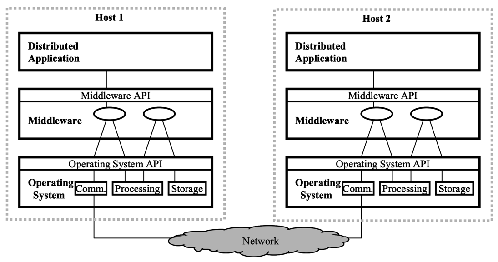

## Introduction

Middleware 是一类软件技术，旨在帮助管理分布式系统中固有的复杂性和异构性。
它被定义为位于操作系统之上、应用程序之下的一层软件，为整个分布式系统提供通用的编程抽象，如图 1 所示。
通过这样做，它为程序员提供了比操作系统提供的 API（如 socket）更高级的构建块。
这显著减轻了应用程序程序员的负担，使他们摆脱了这类繁琐且易出错的工作。
Middleware 有时被非正式地称为"管道"，因为它用数据管道连接分布式应用的各个部分，并在它们之间传递数据。

Fig.1. Middleware 在体系中的层次位置。

Middleware 框架旨在屏蔽分布式系统程序员必须处理的部分异构性。它们总是屏蔽网络和硬件的异构性。
大多数 middleware 框架还屏蔽操作系统或编程语言的异构性，或两者兼有。
少数框架（如 CORBA）还屏蔽同一种 middleware 标准的不同厂商实现的异构性。
最后，middleware 提供的编程抽象可以在以下一个或多个维度上提供分布透明性：位置、并发、复制、故障和移动性。

操作系统的经典定义是"使硬件可用的软件"。
类似地，middleware 可以被视为使分布式系统可编程的软件。
正如没有操作系统的裸机编程极其困难一样，没有 middleware 的情况下编程分布式系统通常更加困难，尤其是在需要异构操作时。
同样，用汇编语言甚至机器码也能编写应用程序，但大多数程序员发现使用高级语言进行开发效率更高，而且生成的代码也更具可移植性。

## Categories of Middleware

已开发的 middleware 有几种不同类型。
它们在提供的编程抽象以及除网络和硬件之外提供的异构性种类方面各不相同。

**Distributed Tuples**

分布式关系数据库提供分布式元组的抽象，是当今部署最广泛的 middleware 类型。
其 SQL 允许程序员以类似英语的语言操作这些元组集合（数据库），同时具有直观的语义和基于集合论与谓词演算的严谨数学基础。
分布式关系数据库还提供事务抽象。
分布式关系数据库产品通常提供跨编程语言的异构性，但大多数在跨厂商实现方面基本不提供异构性。
Transaction Processing Monitor (TPM) 常用于客户端查询的端到端资源管理，特别是服务端进程管理和多数据库事务管理。

Linda 是一个提供名为 Tuple Space (TS) 的分布式元组抽象的框架。
Linda 的 API 提供对 TS 的关联访问，但不具有任何关系语义。
Linda 通过允许存放和提取进程彼此不知道对方身份来提供空间解耦。
它通过允许它们具有不重叠的生命周期来提供时间解耦。
Jini 是一个面向智能设备（尤其是家庭设备）的 Java 框架。Jini 构建在 JavaSpaces 之上，后者与 Linda 的 TS 密切相关。

**Remote Procedure Call**

Remote procedure call (RPC) middleware 扩展了几乎所有程序员都熟悉的过程调用接口，提供调用远程过程体的抽象。
RPC 系统通常是同步的，因此如果不使用多线程就没有并行的可能性，并且它们的异常处理能力通常有限。

**Message-Oriented Middleware**

Message-Oriented Middleware (MOM) 提供可在网络上访问的消息队列抽象。它是众所周知的操作系统构造——邮箱的泛化。
它在如何配置从给定队列存入和取出消息的程序的拓扑结构方面非常灵活。
许多 MOM 产品提供具有持久性、复制或实时性能的队列。MOM 提供与 Linda 相同的空间和时间解耦。

**Distributed Object Middleware**

分布式对象 middleware 提供远程对象的抽象，这些对象的方法可以像调用调用者同一地址空间中的对象方法一样被调用。
分布式对象将面向对象技术的所有软件工程优势——封装、继承和多态——提供给分布式应用开发者。

Common Object Request Broker Architecture (CORBA) 是分布式对象计算的标准。
它是对象管理组织 (OMG) 开发的对象管理体系结构 (OMA) 的一部分，在范围上是可用的最广泛的分布式对象 middleware。
它不仅包含 CORBA 的分布式对象抽象，还包含 OMA 的其他元素，这些元素针对通用和垂直市场组件，对分布式应用开发者很有帮助。
CORBA 提供跨编程语言和厂商实现的异构性。
CORBA（和 OMA）被大多数专家认为是商业上可用的最先进的 middleware 类型，也是最忠实于经典面向对象编程原则的。其标准是公开可用且定义良好的。

DCOM 是 Microsoft 的分布式对象技术，从其对象链接和嵌入 (OLE) 和组件对象模型 (COM) 演变而来。
DCOM 的分布式对象抽象由其他 Microsoft 技术增强，包括 Microsoft Transaction Server 和 Active Directory。
DCOM 提供跨语言的异构性，但不提供跨操作系统或工具厂商的异构性。COM+ 是下一代 DCOM，大大简化了 DCOM 的编程。
SOAP 是 Microsoft 基于 XML 和 HTTP 的分布式对象框架。
其规范是公开的，并提供跨语言和厂商的异构性。
Microsoft 的分布式对象框架 .NET 也将跨语言和厂商的异构性列为其既定目标。

Java 有一个名为 Remote Method Invocation (RMI) 的工具，类似于 CORBA 和 DCOM 的分布式对象抽象。
RMI 提供跨操作系统和 Java 厂商的异构性，但不跨语言。
然而，只支持 Java 使其能够与 Java 的某些特性更紧密地集成，从而简化编程并提供更多功能。

**市场概念的融合**

上述 middleware 类别在市场上以多种方式模糊化。
从 1990 年代末开始，许多产品开始为多种抽象提供 API，例如分布式对象和消息队列，部分由 TPM 管理。
TPM 通常使用 RPC 或 MOM 作为底层传输，同时添加管理和控制功能。
关系数据库厂商正在通过许多扩展（包括类似 RPC 的存储过程）打破关系模型以及数据和代码的严格分离。更复杂的是，
Java 正被用于编写这些存储过程。
此外，一些 MOM 产品在消息队列上提供跨多个操作的事务。
最后，分布式对象系统通常提供事件服务或通道，在体系结构和数据流方面与 MOM 类似。

**Middleware 与遗留系统**

Middleware 有时被称为"胶水"技术，因为它常用于集成遗留组件。
它对于迁移从未设计为互操作或联网的 mainframe 应用程序以服务远程请求至关重要。
Middleware 也非常适合封装网络设备，如路由器和移动基站，为网络集成商和维护人员提供控制 API，以实现最高级别的互操作性。
分布式对象 middleware 由于其通用性尤其适合遗留系统集成。
简而言之，它提供了非常高的最低公共互操作性标准。
CORBA 尤其常被用于此目的，因为它支持最多的异构性类型，从而使遗留组件能够尽可能广泛地使用。

## Programming with Middleware

程序员不必学习新的编程语言来编写 middleware。
相反，他们使用已有的熟悉语言，如 C++ 或 Java。
使用现有语言编写 middleware 主要有三种方式。
第一种是 middleware 系统提供可供调用的函数库来使用 middleware；分布式数据库系统和 Linda 采用这种方式。
第二种是通过外部接口定义语言 (IDL)。
在这种方法中，IDL 文件描述远程组件的接口，并使用从 IDL 到编程语言的映射供程序员编写代码。
第三种方式是语言和运行时系统原生支持分布性；例如，Java 的 Remote Method Invocation (RMI)。

**Middleware 与分层**

给定的系统配置中可能存在多层 middleware。
例如，较低层的 middleware（如虚拟同步原子广播服务）可以直接被应用程序程序员使用。
然而，有时它被用作高层 middleware（如 CORBA 或 Message-Oriented Middleware）的构建块，以提供容错或负载均衡，或两者兼有。

注意，middleware 系统的大部分实现在 OSI 网络参考架构的"应用"层 7，尽管部分也在"表示"层 6。
因此，对于操作系统中的网络协议而言，middleware 是一个"应用程序"。从 middleware 的角度看，"应用程序"在其之上。

**Middleware 与资源管理**

各种 middleware 框架提供的抽象可以用于在比原本可能更高的层次上提供分布式系统中的资源管理。
这是因为这些抽象可以设计得足够丰富，以涵盖操作系统管理的三种低级物理资源：通信、处理和存储（内存和磁盘）。
Middleware 的抽象也是从端到端视角出发的，不仅仅是单个主机的视角，这使得资源管理系统能够拥有更全局和完整的视图。
所有 middleware 编程抽象按定义都涵盖了通信资源，但其他方面在处理和存储的整合程度上有所不同。
表 1 展示了每种 middleware 类别封装和集成这些资源的程度。分布式元组仅向客户端提供有限形式的处理。
RPC 不集成存储，而 MOM 不包含处理。然而，分布式对象不仅封装了所有三种资源，还将其干净地集成到一个统一的包中。
这种完整性有助于分布式资源管理，同时也使得更容易提供不同类型的分布式透明性，如移动透明性。

| Middleware 类别       | 通信 | 处理   | 存储   |
| ---------------------- | ------ | ------ | ------ |
| Distributed Tuples   | 是     | 有限   | 是     |
| Remote Procedure Call | 是     | 是     | 否     |
| Message-Oriented Middleware | 是     | 否     | 有限   |
| Distributed Objects  | 是     | 是     | 是     |

## Middleware and Quality of Service Management

分布式系统本质上是高度动态的，这使得它们难以编程。资源管理很有帮助，但对于大多数分布式应用程序来说通常还不够。
从 1990 年代末开始，分布式系统研究开始专注于提供全面的服务质量 (QoS)，这是一个涉及对象或系统行为属性的组织概念，以帮助管理分布式系统的动态特性。
这项研究的目标是捕获应用的高层 QoS 需求，然后将其向下转化为低层资源管理器。
QoS 可以帮助运行时适应性，这属于经典分布式系统研究领域。
但它也可以帮助应用程序在其生命周期内演进来处理新需求或在新的环境中运行，这些问题更多属于软件工程领域，但对分布式系统的用户和维护者至关重要。

Middleware 特别适合在应用程序编程的抽象层次上提供 QoS。
此外，middleware 系统提供的抽象通常可以扩展到包含 QoS 抽象，同时仍然保持程序员能够理解和有用的连贯抽象。
分布式对象 middleware 由于其封装和整合的资源的通用性，特别适合于此。

向应用程序提供 QoS 可以帮助它们在使用模式或可用资源在大范围内变化且几乎不可预测时仍能可接受地运行。
这有助于使环境对分布式应用层来说显得更可预测，并帮助应用程序在无法实现这种可预测性时进行适应。
QoS 还可以帮助应用程序在合理时间内进行修改，因为它们对环境所做的假设没有硬编码到应用逻辑中，从而使维护成本更低。
包含 QoS 抽象的 middleware 可以通过使应用程序对 QoS 的假设（如使用模式和所需资源）显式化，同时仍然为程序员提供高层构建块来实现这些目标。
此外，支持 QoS 的 middleware 是一个高层构建块，它屏蔽了分布式应用程序与底层提供 QoS 的低层协议和 API。
这种屏蔽非常有帮助，因为这些 API 和协议非常复杂，并且通常比许多分布式应用程序的生命周期变化更快。
这种将应用程序与低层细节解耦的方式，类似于 TCP/IP 历史上允许应用程序和设备独立演进的方式。
然而，支持 QoS 的 middleware 在解耦的同时，不仅提供消息流，还提供 QoS 和高层抽象。

## History of Middleware

Middleware 一词最早出现在 1980 年代末，用于描述网络连接管理软件，但直到 1990 年代中期网络技术达到足够的渗透率和知名度后才得到广泛使用。
那时 middleware 已经演变为提供更丰富的范式和服务，以帮助更轻松、更可管理地构建分布式应用程序。
对于商界的许多从业者来说，直到 1990 年代初，该词主要与关系数据库相关联，但到 1990 年代中期已不再如此。
类似于当今 middleware 的概念以前被称为网络操作系统、分布式操作系统和分布式计算环境。

Cronus 是第一个主要的分布式对象 middleware 系统，Clouds 和 Eden 是其同时代产品。RPC 大约在 1982 年由 Birrell 和 Nelson 首次开发。
早期广泛使用的 RPC 系统包括 Sun 在其 Open Network Computing (ONC) 中的 RPC 以及 Apollo 的 Network Computing System (NCS) 中的 RPC。
开放软件基金会的分布式计算环境 (DCE) 包含一个 RPC，它是 Hewlett Packard（收购了 Apollo）提供的 Apollo RPC 的改编版。
Quality Objects (QuO) 是第一个为分布式对象提供通用和可扩展服务质量 middleware 框架。
TAO 是第一个直接在 ORB 中提供服务质量（实时性能）的主要 CORBA 系统。

OMG 成立于 1989 年，目前是最大的行业联盟，无论类型如何。
Message Oriented Middleware Association (MOMA) 成立于 1993 年，MOM 到 1990 年代末已成为一种广泛使用的 middleware 类型。
在 1990 年代末，HTTP 成为各种 middleware 的主要构建块，因为它部署广泛且能够穿透大多数防火墙。
关于 middleware 相关技术以及 middleware 研究项目历史的更多信息可以在参考文献中找到。

## Links

## References

1. [Middleware](https://www.ics.uci.edu/~cs237/reading/files/Middleware.pdf)
2. [Managing Complexity: Middleware Explained](https://www.ics.uci.edu/~cs237/reading/files/Middleware%20a%20model%20for%20distributed%20system%20services.pdf)
3. [Middleware a model for distributed system services](https://www.ics.uci.edu/~cs237/reading/files/Managing_Complexity_Middleware_Explained.pdf)
