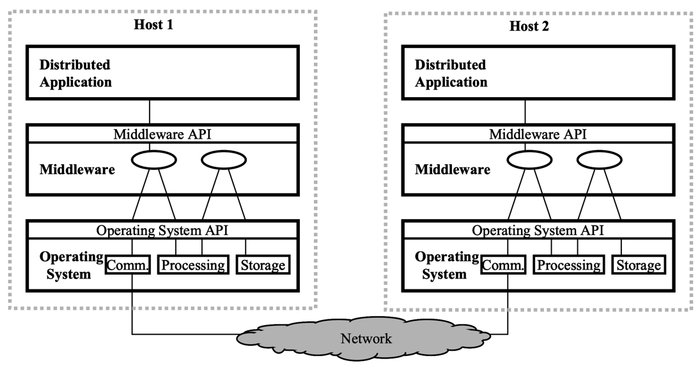

## Introduction

Middleware（中间件）是一类软件技术，旨在帮助管理分布式系统中固有的复杂性与异构性。它被定义为位于操作系统之上、应用程序之下的软件层，为整个分布式系统提供通用的编程抽象，如图 1 所示。借此，它为程序员提供了比操作系统提供的套接字（socket）之类应用编程接口（API）更高层的构建模块，从而显著减轻了应用程序员的负担，使他们不必编写这类繁琐且易错的代码。Middleware 有时被非正式地称为“管道（plumbing）”，因为它用数据管道把分布式应用的各个部分连接起来，并在它们之间传递数据。

Fig.1. Middleware Layer in Context.

Middleware 框架的设计目标是屏蔽分布式系统程序员必须应对的某些异构性，它们总是会屏蔽网络与硬件的异构性。大多数 Middleware 框架还会屏蔽操作系统或编程语言（或两者）的异构性。少数框架（如 CORBA）还能屏蔽同一 Middleware 标准在不同厂商实现之间的异构性。最后，Middleware 所提供的编程抽象可以在以下一个或多个维度上，就分布（distribution）提供透明性：位置、并发、复制、故障与移动性。

操作系统的经典定义是“让硬件变得可用的软件”。类似地，Middleware 可以被视为“让分布式系统变得可编程的软件”。正如没有操作系统的裸机极难编程，在没有 Middleware 的情况下为分布式系统编程通常要困难得多，尤其是在需要异构运行的时候。同样，用汇编语言甚至机器码来编写应用程序也是可行的，但大多数程序员发现使用高级语言效率要高得多，由此产生的代码当然也具备可移植性。

## 中间件的分类

目前已经发展出少量几种不同的 Middleware。它们在所提供的编程抽象，以及除网络与硬件之外所能屏蔽的异构性种类上各有差异。

**分布式元组（Distributed Tuples）**

分布式关系型数据库提供了分布式元组的抽象，是当今部署最广泛的 Middleware。其结构化查询语言（SQL）允许程序员用一种类英语、语义直观、且以集合论与谓词演算为数学基础的语言来操纵这些元组（即数据库）。分布式关系型数据库还提供了事务（transaction）这一抽象。这类产品通常能屏蔽编程语言层面的异构性，但大多数在厂商实现层面提供的异构性支持很少（即便有也有限）。事务处理监视器（TPM，Transaction Processing Monitor）常用于对客户端查询做端到端的资源管理，尤其是服务端进程管理以及多数据库事务的管理。

Linda（见 Linda）是一个提供称为元组空间（TS，Tuple Space）的分布式元组抽象的框架。Linda 的 API 提供对 TS 的关联访问，但不具备任何关系语义。Linda 通过让存入与取出数据的进程互不感知对方身份，提供了空间解耦（spatial decoupling）；又通过允许它们拥有不重叠的生命周期，提供了时间解耦（temporal decoupling）。Jini 是一个面向智能设备（尤其是家用设备）的 Java 框架，构建在 JavaSpaces 之上，而 JavaSpaces 与 Linda 的 TS 关系极为密切。

**远程过程调用（Remote Procedure Call）**

远程过程调用（RPC，见 Remote Procedure Calls）Middleware 把几乎所有程序员都熟悉的“过程调用”接口加以扩展，提供“调用一个过程体位于网络另一端的过程”这一抽象。RPC 系统通常是同步的，因此在不用多线程的情况下无法获得并行能力，而且其异常处理能力通常也比较有限。

**面向消息的中间件（Message-Oriented Middleware）**

面向消息的中间件（MOM，Message-Oriented Middleware）提供了可通过网络访问的消息队列抽象，是对著名操作系统构件——邮箱——的一般化。它在如何配置“向给定队列存入/取出消息的程序拓扑”上非常灵活。许多 MOM 产品提供具备持久化、复制或实时性能的消息队列。MOM 与 Linda 一样，提供空间与时间上的解耦。

**分布式对象中间件（Distributed Object Middleware）**

分布式对象中间件提供“远程对象”的抽象：对象虽在远端，但其方法可以像调用者地址空间内的本地对象方法一样被调用。分布式对象把面向对象技术带来的全部软件工程收益——封装、继承与多态——带给分布式应用的开发者。

公共对象请求代理体系结构（CORBA，Common Object Request Broker Architecture，见 Common Object Request Broker Architecture）是分布式对象计算的一个标准，属于对象管理组织（OMG，Object Management Group）所制定的对象管理体系结构（OMA，Object Management Architecture）的一部分，是适用范围最广的分布式对象 Middleware。它不但包含 CORBA 的分布式对象抽象，还包含 OMA 中用于通用与垂直市场组件、对分布式应用开发者有帮助的其他要素。CORBA 能屏蔽编程语言与厂商实现层面的异构性。CORBA（以及 OMA）被多数专家视为商业上最先进、也最忠实于经典面向对象编程原则的 Middleware，其标准公开且定义良好。

DCOM 是微软的分布式对象技术，由对象链接与嵌入（OLE，Object Linking and Embedding）与组件对象模型（COM，Component Object Model）演进而来。DCOM 的分布式对象抽象被微软事务服务器（Microsoft Transaction Server）与活动目录（Active Directory）等其它技术所增强。DCOM 能屏蔽语言层面的异构性，但不能屏蔽操作系统或工具厂商层面的异构性。COM+ 是下一代 DCOM，极大地简化了 DCOM 的编程。SOAP 是微软基于 XML 与超文本传输协议（HTTP，HyperText Transfer Protocol）的分布式对象框架，规范公开，能同时屏蔽语言与厂商层面的异构性。微软的分布式对象框架 .NET 也把“跨越语言与厂商”列为既定目标之一。

Java 提供一种称为远程方法调用（RMI，Remote Method Invocation）的机制，与 CORBA、DCOM 的分布式对象抽象相似。RMI 能屏蔽操作系统与 Java 厂商层面的异构性，但不能屏蔽语言层面。不过，只支持 Java 也让它能与 Java 的某些特性更紧密地集成，从而简化编程并提供更强的功能。

**概念在市场上的融合（Marketplace Convergence of the Concepts）**

上述几类 Middleware 在市场中有多种方式的融合。从 20 世纪 90 年代末开始，许多产品开始为多种抽象提供 API，例如由 TPM 部分管理的分布式对象与消息队列。反过来，TPM 常把 RPC 或 MOM 用作底层传输，同时叠加管理与控制能力。关系型数据库厂商则通过大量扩展（包括类 RPC 的存储过程）不断突破关系模型以及数据/代码的严格分离。更复杂的是，Java 正被用于编写这些存储过程。此外，一些 MOM 产品提供跨消息队列多次操作的事务支持。最后，分布式对象系统通常提供事件服务或通道，在架构（即拓扑与数据流）上与 MOM 相似。

**Middleware 与遗留系统（Middleware and Legacy Systems）**

Middleware 有时被称为“胶水（glue）”技术，因为它常被用来集成遗留组件。对于把那些从未被设计成可互操作或联网、却要对外提供远程请求服务的大型机应用做迁移时，它不可或缺。Middleware 也非常适合封装路由器、移动基站等网络设备，从而为网络集成商和维护者提供一个最高层次、可互操作的管控 API。分布式对象中间件因其通用性（见下文），特别适合做遗留系统集成，简而言之，它提供了一个极高的互操作性“最低公约数”。其中 CORBA 尤其常用于此，因为它支持的异构性种类最多，从而能让遗留组件被尽可能广泛地使用。

## 使用中间件编程

程序员无需学习新的编程语言来编写 Middleware，而是使用自己熟悉的语言，例如 C++ 或 Java。Middleware 用现有语言编程主要有三种方式。第一种是 Middleware 系统提供一组可供调用的函数库，分布式数据库系统与 Linda 就是如此。第二种是通过外部接口定义语言（IDL，Interface Definition Language）：IDL 文件描述远端组件的接口，并被映射成某种编程语言供程序员编码。第三种是语言与运行时系统原生支持分布，例如 Java 的远程方法调用（RMI）。

**Middleware 与分层（Middleware and Layering）**

某个系统配置中可能存在多层 Middleware。例如，底层的 Middleware（如虚拟同步的原子广播服务，见 Virtual Synchrony）可直接被应用程序员使用；但有时它也被更高层的 Middleware（如 CORBA 或 MOM）当作构建模块，以提供容错或负载均衡（或两者兼具）。

注意，Middleware 系统的大部分实现位于 OSI 网络参考架构的“应用”第 7 层，尽管其中一部分也处于“表示”第 6 层（见 Network Protocols）。因此，Middleware 对网络协议（位于操作系统内）而言是一种“应用”；而从 Middleware 的视角看，“应用”则在它之上。

**Middleware 与资源管理（Middleware and Resource Management）**

各类 Middleware 框架所提供的抽象，能在比以往更高的层次上为分布式系统提供资源管理，因为这些抽象可以被设计得足够丰富，从而把操作系统所管理的三类底层物理资源——通信、处理与存储（内存与磁盘）——一并涵盖。Middleware 的抽象还是端到端视角的，而非单一主机的视角，这给资源管理系统带来更全局、更完整的视图。按定义，所有 Middleware 编程抽象都涵盖通信资源，但其它抽象在整合处理与存储资源上的程度各有不同。表 1 展示了每一类 Middleware 对这些资源的封装与集成程度：分布式元组只向客户端提供有限的处理能力；RPC 不集成存储，MOM 不包含处理能力；而分布式对象不仅封装，还把三类资源干净地整合成一个内聚的包。这种完整性既有助于分布式资源管理，也让提供包括移动透明性在内的各类分布透明性变得更容易。

| 中间件类别                       | 通信 | 处理   | 存储   |
| -------------------------------- | :--: | :----: | :----: |
| 分布式元组（Distributed Tuples） |  是  |  有限  |  是   |
| 远程过程调用（Remote Procedure Call） | 是 | 是 | 否 |
| 面向消息的中间件（Message-Oriented Middleware） | 是 | 否 | 有限 |
| 分布式对象（Distributed Objects） | 是 | 是 | 是 |

## 中间件与 QoS 管理

分布式系统本质上极具动态性，这使其难以编程。资源管理虽有助益，但对大多数分布式应用而言通常还不够。从 20 世纪 90 年代末起，分布式系统研究开始聚焦于提供全面的服务质量（QoS，Quality of Service）——一个指代对象或系统行为属性的组织性概念——以帮助应对分布式系统的动态本质。这项研究的目标是捕获应用的高层 QoS 需求，再将其下达到底层资源管理器。QoS 既能帮助运行时自适应（这是经典分布式系统研究的范畴），也能帮助应用在生命周期内演化以应对新需求或新环境——后者更偏软件工程领域，但对分布式系统的用户与维护者至关重要（见 Quality of Service）。

Middleware 特别适合在应用程序的抽象层次上提供 QoS。而且 Middleware 系统所提供的抽象常被扩展以纳入 QoS 抽象，同时仍是一个程序员可理解、可用的内聚抽象。分布式对象中间件因其所封装与整合资源的通用性，在这方面尤为合适。

提供 QoS 能帮助应用在用量模式或可用资源在很宽范围内、且几乎不可预测地变化时仍可接受地运行；它能让环境对分布式应用层显得更具可预测性，并在可预测性无法达成时帮助应用自适应。QoS 还能让应用在合理时间内可被修改，因为其对环境的假设没有被硬编码进应用逻辑，从而降低维护成本。内置 QoS 抽象的 Middleware 通过把应用关于 QoS 的假设（如用量模式与所需资源）显式化，同时仍为程序员提供高层构建模块，来实现上述能力。此外，支持 QoS 的 Middleware 是一个高层构建模块，把分布式应用与最终提供 QoS 的底层协议和 API 隔离开来。这种隔离很有价值，因为这些 API 与协议非常复杂，且相较于许多分布式应用的寿命往往变化很快。因此，这种把应用与底层细节解耦的做法，与历史上 TCP/IP 让应用与设备各自独立演化的作用如出一辙；而支持 QoS 的 Middleware 在解耦的同时，不仅提供消息流，还提供带 QoS 的高层抽象。

## 中间件的历史

Middleware 一词最早出现在 20 世纪 80 年代末，用于描述网络连接管理软件，但直到 90 年代中期网络技术充分普及与凸显后才被广泛使用。到那时，Middleware 已演进为一套更丰富的范式与服务，让构建分布式应用变得更容易、更可管理。在 90 年代初，许多商业从业者主要把它与关系型数据库联系在一起，但到 90 年代中期已不再如此。与当今 Middleware 相似的概念此前曾以网络操作系统、分布式操作系统与分布式计算环境的名义出现。

Cronus 是第一个主要的分布式对象 Middleware 系统（见 Cronus），Clouds（见 Clouds）与 Eden 与之同期。RPC 最早由 Birrell 与 Nelson 于约 1982 年提出。早期获得广泛使用的 RPC 系统包括 Sun 的开放网络计算（ONC，Open Network Computing）与 Apollo 的网络计算系统（NCS，Network Computing System）。开放软件基金会的分布式计算环境（DCE，Distributed Computing Environment）所包含的 RPC，是 Apollo 版本（由收购了 Apollo 的惠普提供）的改造版。质量对象（QuO，Quality Objects）是第一个为分布式对象提供通用、可扩展服务质量支持的 Middleware 框架。TAO 是第一个在 ORB 内直接提供服务质量（即实时性能）的主要 CORBA 系统。

OMG 成立于 1989 年，是目前规模最大的行业联盟。面向消息的中间件协会（MOMA，Message Oriented Middleware Association）成立于 1993 年，到 90 年代末 MOM 已成为广泛使用的 Middleware 类别。90 年代末，HTTP 因其无处不在的部署以及能穿透大多数防火墙的能力，成为各类 Middleware 的主要构建模块。关于 Middleware 相关技术及其研究项目历史的更多信息可参见。

## Links

- [Distributed Systems](/docs/CS/Distributed/Distributed.md)
- [Architecture](/docs/CS/Distributed/Architecture.md)
- [Consensus](/docs/CS/Distributed/Consensus/Consensus.md)
- [CAP](/docs/CS/Distributed/CAP.md)
- [Time](/docs/CS/Distributed/Time.md)
- [Service](/docs/CS/Distributed/Service.md)

## References

1. [Middleware](https://www.ics.uci.edu/~cs237/reading/files/Middleware.pdf)
2. [Managing Complexity: Middleware Explained](https://www.ics.uci.edu/~cs237/reading/files/Middleware%20a%20model%20for%20distributed%20system%20services.pdf)
3. [Middleware a model for distributed system services](https://www.ics.uci.edu/~cs237/reading/files/Managing_Complexity_Middleware_Explained.pdf)
