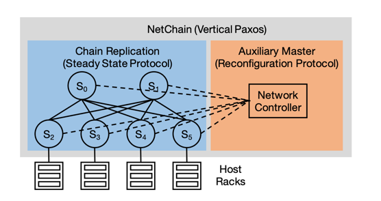
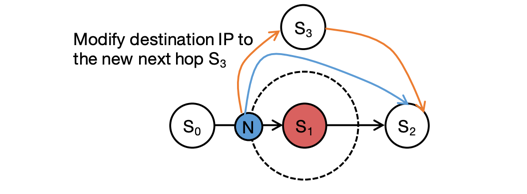

## Introduction

NetChain 是一种新方法，利用新一代可编程交换机的强大能力和灵活性，提供无规模限制的 sub-RTT 协调。
与基于服务器的解决方案不同，NetChain 是一种网内解决方案，完全在网络数据平面内存储数据和处理查询。

## Architecture

### Network-Based

基于网络数据平面的方法在延迟和吞吐量方面相比传统的基于服务器的解决方案具有显著优势。
此外，新兴的可编程交换机（如 Barefoot Tofino 和 Cavium XPliant）使这种方法成为可能。

由于网络时间相对于主机延迟可以忽略不计，基于网络的解决方案能够将查询延迟降低到一个消息延迟或 sub-RTT，这优于基于服务器解决方案的下界。
注意，sub-RTT 延迟并非对共识问题的新理论答案，而是一种消除协调服务器开销的系统解决方案。

协调系统的工作负载是通信密集型，而非计算密集型。
尽管细节各异，共识协议通常涉及多轮消息交换，每轮中各节点检查消息并执行简单的数据比较和更新。
吞吐量取决于节点处理消息的速度。
交换机专门设计并深度优化用于数据包处理和交换。
它们比高度优化的服务器提供数量级更高的吞吐量。

### Chain Replication

我们选择在网络中实现 [Vertical Paxos](/docs/CS/Distributed/Consensus/Paxos.md?id=Vertical-Paxos) 来应对这一挑战。
分工使其非常适合网络实现，因为两部分可以自然地映射到网络数据平面和控制平面。

- 稳态协议通常是主-备（PB）协议，处理读写查询并确保强一致性。它足够简单，可以在网络数据平面中实现。
  此外，由于存在重配置协议，它只需要 f +1 个节点来容忍 f 个节点故障，低于普通 Paxos 所需的 2f +1 个节点。
  这一点很重要，因为交换机的片上内存有限，用于键值存储。
  因此，在相同数量的交换机下，系统可以使用 Vertical Paxos 存储更多条目。
- 容错的繁重工作被卸载到重配置协议，该协议使用辅助 master 来处理重配置操作，如加入（新节点）和离开（故障节点）。
  辅助 master 可以映射到网络控制平面，因为现代数据中心网络已经拥有在多个服务器上复制的逻辑集中控制器。

我们设计了一种链式复制（CR）的变体来实现 Vertical Paxos 的稳态协议。CR 是 PB 协议的一种形式。
在经典 PB 协议中，所有查询都发送到主节点。
主节点需要维护一些状态来追踪对每个备份节点的每次写入查询，并在未收到所有备份节点确认时重试或中止查询。
使用交换机 ASIC 提供的有限资源和操作来维护状态并与所有备份节点确认是昂贵的。
在 CR 中，节点按链结构组织。读取查询由 tail 处理；写入查询发送到 head，沿链逐个节点处理，并由 tail 回复。
CR 中的写入查询比 PB 使用更少的消息（n+1 而不是 2n，其中 n 是节点数）。
CR 仅要求每个节点在本地应用写入查询，然后转发查询。
从 tail 收到回复直接表示查询完成。
因此，CR 比 PB 更易于在交换机中实现。

## Data Plane

数据平面提供复制的网内键值存储，并直接处理读写查询。
我们实现 CR 来保证强一致性，这涉及三个具体问题：

1. 如何在每个交换机中存储和提供键值条目；
2. 如何根据链结构通过交换机路由查询；
3. 如何应对尽力而为的网络传输（即链交换机之间的数据包重排序和丢失）。

### Key-Value Storage

NetChain 在片上内存中分离存储键和值。
每个键作为条目存储在匹配表中，每个值存储在寄存器数组的槽中。
匹配表的输出是匹配键的索引（位置）。
NetChain 使用与 NetCache 相同的机制，通过多阶段支持可变长度值。

我们利用可编程交换机的能力定义自定义数据包头格式，并构建基于 UDP 的查询机制。

NetChain 使用一致性哈希在多个交换机上分区键值存储。
键被映射到哈希环上，每个交换机负责环上的若干连续段。
使用虚拟节点来帮助均匀分布负载。
给定 n 个交换机，NetChain 将 m 个虚拟节点映射到环上，并为每个交换机分配 m/n 个虚拟节点。
环上每个段的键被分配给后续的 f +1 个虚拟节点。
如果某个段分配的两个虚拟节点物理上位于同一交换机上，NetChain 会沿着环搜索后续虚拟节点，直到找到属于不同交换机的 f +1 个虚拟节点。

## NetChain Routing

## Control Plane

NetChain 控制器作为网络控制器中的组件运行，仅管理与 NetChain 相关的交换机表和寄存器。

我们假设网络控制器是可靠的。
主要考虑由交换机故障引起的系统重配置，这些故障由网络控制器使用现有技术检测。
我们假设故障模型是 fail-stop，并且控制器能够正确检测交换机故障。
为了优雅地处理交换机故障，我们将过程分为两步：快速故障转移和故障恢复。

1. 在快速故障转移中，控制器快速重配置网络，以使用每个受影响的链中剩余的 f 个节点继续服务查询。
   这将受影响的链降级为容忍 f-1 个节点故障。
2. 在故障恢复中，控制器将其他交换机作为新的复制节点添加到受影响的链中，将链恢复到 f +1 个节点。
   由于故障恢复需要将状态复制到新副本，因此比快速故障转移花费更长时间。

其他类型的链重配置，（临时）从网络中移除交换机（如交换机固件升级）的处理方式类似于快速故障转移；（临时）向网络中添加交换机（如新交换机接入）的处理方式类似于故障恢复。

### Fast Failover

快速故障转移快速移除故障交换机，并将由交换机故障引起的服务中断时间降至最低。

### Failure Recovery

故障恢复将所有链恢复到 $f+1$ 个交换机。
假设故障交换机 $S_i$ 映射到虚拟节点 $V_1,V_2,...,V_k$。
这些虚拟节点在快速故障转移中从其链中移除。
为了恢复它们，我们首先将它们随机分配给 k 个存活交换机。
这有助于将故障恢复的负载分散到多个交换机而非单个交换机。
假设 $V_x$ 被重新分配给交换机 $S_y$。
由于 $V_x$ 属于 $f+1$ 条链，我们需要将 $S_y$ 添加到每条链中。

1. 预同步。
2. 两阶段原子切换。
   1. 停止和同步。
   2. 激活。

## References

1. [NetChain: Scale-Free Sub-RTT Coordination](https://www.usenix.org/system/files/conference/nsdi18/nsdi18-jin.pdf)
