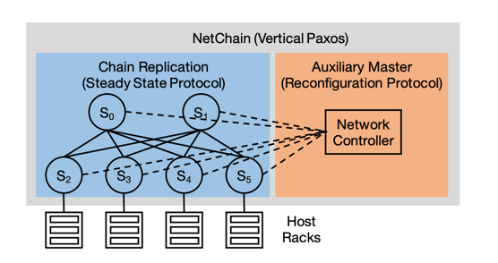
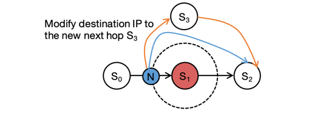

## Introduction

NetChain 是一种新方法，它利用新一代可编程交换机（programmable switch）的能力与灵活性，提供无尺度（scale-free）、亚 RTT（sub-RTT）的协调（coordination）。与基于服务器的方案不同，NetChain 是一种网络内（in-network）方案，它在网络数据面（data plane）内部存储数据并处理查询。

## 架构

### 基于网络

基于网络数据面的方案，在延迟与吞吐上相比传统基于服务器的方案有显著优势。此外，得益于 Barefoot Tofino、Cavium XPliant 等新兴可编程交换机，这种方案才得以实现。

由于网络耗时相比主机延迟可忽略不计，基于网络的方案能把查询延迟压缩到一次消息延迟或亚 RTT，优于基于服务器的方案的下界。注意，亚 RTT 延迟并不是共识（consensus）问题在理论上的新答案，而是一种消除协调服务器开销的系统方案。

协调系统的工作负载是通信密集而非计算密集的。尽管细节各有不同，共识协议通常涉及多轮消息交换，每一轮中节点检查消息并执行简单的数据比较与更新。吞吐取决于节点处理消息的速度。交换机专为报文处理与交换而设计并深度优化，它们能提供比高度优化的服务器高几个数量级的吞吐。

### Chain Replication

我们选择在网络内实现 [Vertical Paxos](/docs/CS/Distributed/Consensus/Paxos.md?id=vertical-paxos) 来应对这一挑战。这种职责划分使之非常契合网络实现，因为两部分可以很自然地被映射到网络的数据面与控制面。

- 稳态（steady state）协议通常是一种主备（PB，primary-backup）协议，负责处理读写查询并保证强一致性。它足够简单，可在网络数据面内实现。此外，由于存在重新配置（reconfiguration）协议，它只需 f+1 个节点即可容忍 f 个节点故障，少于普通 Paxos 所需的 2f+1 个节点。这一点很重要，因为交换机用于键值存储的片上（on-chip）内存有限。因此，在给定相同数量交换机的情况下，系统用 Vertical Paxos 能存储更多条目。
- 容错的繁重工作被卸载（offload）到重新配置协议上，后者使用一个辅助 master 来处理加入（针对新节点）与离开（针对故障节点）等重新配置操作。这个辅助 master 可以映射到网络控制面，因为现代数据中心网络已经有一个逻辑上集中、在多台服务器上复制的控制器。

我们设计了 Chain Replication（链复制，CR）的一个变体，来实现 Vertical Paxos 的稳态协议。CR 是 PB 协议的一种形式。在经典 PB 协议中，所有查询都发往主节点（primary node）。主节点需要维护一些状态来跟踪发往每个备份节点的每个写查询，并在没有收到所有备份节点确认时重试或中止查询。用交换机 ASIC 所提供的有限资源与操作来维护状态、并与所有备份节点确认，代价高昂。在 CR 中，节点以链式结构组织：读查询由链尾（tail）处理；写查询发往链头（head），沿链被每个节点处理，并由链尾回复。CR 中的写查询比 PB 用的消息更少（n+1 而非 2n，其中 n 为节点数）。CR 只要求每个节点在本地应用一次写查询，然后转发该查询。收到链尾的回复即直接表明查询完成。因此 CR 比 PB 更容易在交换机中实现。

## 数据平面

数据面提供一个复制的、网络内的键值存储，并直接处理读写查询。我们用 CR 来保证强一致性，这涉及三个具体问题：

1. 如何在每个交换机内存储并服务键值条目；
2. 如何依据链式结构让查询在交换机间路由；
3. 如何应对链交换机之间尽力而为（best-effort）的网络传输（即报文乱序与丢失）。

### 键值存储

NetChain 在片上内存中把键（key）与值（value）分开存储。每个键作为匹配表（match table）中的一个表项（entry）存储，每个值作为寄存器数组（register array）中某个槽位（slot）存储。匹配表的输出是匹配键的索引（位置）。NetChain 使用与 NetCache 相同的机制，通过多个阶段支持变长值。

我们利用可编程交换机定义自定义报文头格式、并构建基于 UDP 的查询机制的能力。

NetChain 使用 consistent hashing（一致性哈希）把键值存储划分到多个交换机上。键被映射到一个哈希环（hash ring），每个交换机负责环上的若干连续段（segment）。使用虚拟节点（virtual node）来帮助均匀分摊负载。给定 n 个交换机，NetChain 把 m 个虚拟节点映射到环上，并为每个交换机分配 m/n 个虚拟节点。环上每个段的键被分配给 f+1 个后续虚拟节点。若某个段被分配到两个位于同一物理交换机上的虚拟节点，NetChain 会沿环查找后续虚拟节点，直到找到 f+1 个全部属于不同交换机的虚拟节点。

## NetChain 路由

## 控制平面

NetChain 控制器作为网络控制器中的一个组件运行，只管理 NetChain 相关的交换机表与寄存器。

我们假设网络控制器是可靠的。我们主要考虑由交换机故障引起的系统重新配置，这些故障由网络控制器用既有技术检测。我们假设故障模型是 fail-stop（停机失败），且交换机故障能被控制器正确检测。为优雅地处理交换机故障，我们把过程分为两步：快速故障转移（fast failover）与故障恢复（failure recovery）。

1. 在快速故障转移中，控制器迅速重新配置网络，用每个受影响链中剩余的 f 个节点恢复服务查询。这会把受影响链降级为只能容忍 f−1 个节点故障。
2. 在故障恢复中，控制器把其它交换机作为新的复制节点加入受影响链中，使这些链恢复为 f+1 个节点。由于故障恢复需要把状态拷贝到新副本，耗时比快速故障转移更长。

其它类型的链重新配置——（临时）把交换机从网络移除（例如交换机固件升级）——处理方式与快速故障转移类似；而那些把交换机加入网络（例如新交换机上线）的，则与故障恢复类似。

### 快速故障转移

快速故障转移迅速移除故障交换机，并最小化交换机故障导致的服务中断时长。

### 故障恢复

故障恢复把所有链恢复到 $f+1$ 个交换机。假设故障交换机 $S_i$ 被映射到虚拟节点 $V_1,V_2,...,V_k$。在快速故障转移中，这些虚拟节点已从各自链中移除。为恢复它们，我们先把其随机分配到 k 台存活交换机上。这有助于把故障恢复的负载分摊到多台交换机，而非集中到一台。

令 $V_x$ 被重新分配到交换机 $S_y$。由于 $V_x$ 属于 $f+1$ 条链，我们需要把它加入这 $f+1$ 条链中的每一条。

1. 预同步（Pre-synchronization）。
2. 两阶段原子切换（Two-phase atomic switching）。
   1. 停止与同步（Stop and synchronization）。
   2. 激活（Activation）。

## Links

- [Architecture](/docs/CS/Distributed/Architecture.md)
- [Azure](/docs/CS/Distributed/Azure.md)
- [Bigtable](/docs/CS/Distributed/Bigtable.md)
- [Borg](/docs/CS/Distributed/Borg.md)
- [Byzantine](/docs/CS/Distributed/Byzantine.md)
- [CAP](/docs/CS/Distributed/CAP.md)

## References

1. [NetChain: Scale-Free Sub-RTT Coordination](https://www.usenix.org/system/files/conference/nsdi18/nsdi18-jin.pdf)
