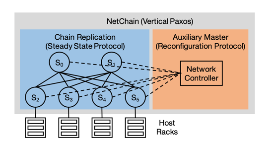

## Introduction

NetChain, a new approach that leverages the power and flexibility of new-generation programmable switches to provide scale-free sub-RTT coordination.
In contrast to server-based solutions, NetChain is an in-network solution that stores data and processes queries entirely within the network data plane.

## Architecture

### Network-Based

A network data-plane-based approach offers significant advantages on latency and throughput over traditional server-based solutions.
Moreover, such an approach is made possible by the emerging programmable switches such as Barefoot Tofino and Cavium XPliant.

Because the network time is negligible compared to host delay, a network-based solution is able to cut the query latency to one message delay or sub-RTT, which is better than the lower-bound of server-based solutions.
Note that the sub-RTT latency is not a new theoretical answer to the consensus problem, but rather a systems solution that eliminates the overhead on coordination servers.

The workload of coordination systems is communication-heavy, rather than computation-heavy.
While varying in their details, consensus protocols typically involve multiple rounds of message exchanges, and in each round the nodes examine their messages and perform simple data comparisons and updates.
The throughput is determined by how fast the nodes can process messages.
Switches are specifically designed and deeply optimized for packet processing and switching.
They provide orders of magnitude higher throughput than highly-optimized servers.

### Chain Replication

We choose to realize [Vertical Paxos](/docs/CS/Distributed/Paxos.md?id=Vertical-Paxos) in the network to address this challenge.
The division of labor makes it a perfect fit for a network implementation, because the two parts can be naturally mapped to the network data and control planes.

- The steady state protocol is typically a primary-backup (PB) protocol, which handles read and write queries and ensures strong consistency. It is simple enough to be implemented in the network data plane.
  In addition, it only requires f +1 nodes to tolerate f node failures, which is lower than 2 f +1 nodes required by the ordinary Paxos, due to the existence of the reconfiguration protocol.
  This is important as switches have limited on-chip memory for key-value storage.
  Hence, given the same number of switches, the system can store more items with Vertical Paxos.
- The heavy lifting for fault-tolerance is offloaded to the reconfiguration protocol, which uses an auxiliary master to handle reconfiguration operations like joining (for new nodes) and leaving (for failed nodes).
  The auxiliary master can be mapped to the network control plane, as modern datacenter networks already have a logically centralized controller replicated on multiple servers.

We design a variant of chain replication (CR) to implement the steady state protocol of Vertical Paxos. CR is a form of PB protocols.
In the classical PB protocol, all queries are sent to a primary node.
The primary node needs to keep some state to track each write query to each backup node, and to retry or abort a query if it does not receive acknowledgments from all backup nodes.
Keeping the state and confirming with all backup nodes are costly to implement with the limited resources and operations provided by switch ASICs.
In CR, nodes are organized in a chain structure. Read queries are handled by the tail; write queries are sent to the head, processed by each node along the chain, and replied by the tail.
Write queries in CR use fewer messages than PB (n+1 instead of 2n where n is the number of nodes).
CR only requires each node to apply a write query locally and then forward the query.
Receiving a reply from the tail is a direct indication of query completion.
Thus CR is simpler than PB to be implemented in switches.

## Data Plane

The data plane provides a replicated, in-network key-value store, and handles read and write queries directly.
We implement CR to guarantee strong consistency, which involves three specific problems:

1. how to store and serve key-value items in each switch;
2. how to route queries through the switches according to the chain structure;
3. how to cope with best-effort network transport (i.e., packet reordering and loss) between chain switches.

### Key-Value Storage

NetChain separates the storage of key and value in the on-chip memory.
Each key is stored as an entry in a match table, and each value is stored in a slot of a register array.
The match table’s output is the index (location) of the matched key.
NetChain uses the same mechanism as NetCache to support variable-length values with multiple stages.

We leverage the capability of programmable switches to define a custom packet header format and build a UDP-based query mechanism.

NetChain uses consistent hashing to partition the key-value store over multiple switches.
Keys are mapped to a hash ring, and each switch is responsible for several continuous segments on the ring.
Virtual nodes are used to help evenly spread the load.
Given n switches, NetChain maps m virtual nodes to the ring and assign m/n virtual nodes to each switch.
Keys of each segment on the ring are assigned to f +1 subsequent virtual nodes.
In cases where a segment is assigned to two virtual nodes that are physically located on the same switch, NetChain searches for the following virtual nodes along the ring until we find f +1 virtual nodes that all belong to different switches.

## NetChain Routing

## Control Plane

The NetChain controller runs as a component in the network controller and only manages switch tables and registers related to NetChain.

We assume the network controller is reliable.
We mainly consider system reconfigurations caused by switch failures, which are detected by the network controller using existing techniques.
We assume the failure model is failstop, and the switch failures can be correctly detected by the controller.
To gracefully handle switch failures, we divide the process into two steps: fast failover and failure recovery.

1. In fast failover, the controller quickly reconfigures the network to resume serving queries with the remaining f nodes in each affected chain.
   This degrades an affected chain to tolerate f−1 node failures.
2. In failure recovery, the controller adds other switches as new replication nodes to the affected chains, which restores these chains to f +1 nodes.
   Since failure recovery needs to copy state to the new replicas, it takes longer than fast failover.

Other types of chain reconfigurations that (temporarily) remove switches from the network (e.g., switch firmware upgrade) are handled similarly to fast failover; those that add switches to the network (e.g., new switch onboarding) are handled similarly to failure recovery.

### Fast Failover

Fast failover quickly removes failed switches and minimizes the durations of service disruptions caused by switch failures.

### Failure Recovery

Failure recovery restores all chains to $f+1$ switches.
Suppose a failed switch $S_i$ is mapped to virtual nodes $V_1,V_2,...,V_k$.
These virtual nodes are removed from their chains in fast failover.
To restore them, we first randomly assign them to k live switches.
This helps spread the load of failure recovery to multiple switches rather than a single switch.
Let $V_x$ be reassigned to switch $S_y$.
Since $V_x$ belongs to $f+1$ chains, we need to add Sy to each of them.

1. Pre-synchronization.
2. Two-phase atomic switching.
   1. Stop and synchronization.
   2. Activation.

## References

1. [NetChain: Scale-Free Sub-RTT Coordination](https://www.usenix.org/system/files/conference/nsdi18/nsdi18-jin.pdf)