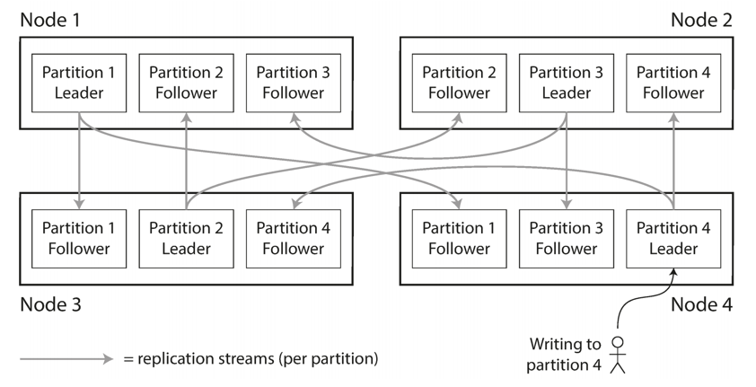

## Introduction

We discussed [replication](/docs/CS/Distributed/Replica.md)—that is, having multiple copies of the same data on different nodes. 
For very large datasets, or very high query throughput, that is not sufficient: we need to break the data up into *partitions*, also known as *sharding*.

Normally, partitions are defined in such a way that each piece of data (each record, row, or document) belongs to exactly one partition.
In effect, each partition is a small database of its own, although the database may support operations that touch multiple partitions at the same time.

The main reason for wanting to partition data is scalability. 
Different partitions can be placed on different nodes in a shared-nothing cluster.
Thus, a large dataset can be distributed across many disks, and the query load can be distributed across many processors.
For queries that operate on a single partition, each node can independently execute the queries for its own partition, so query throughput can be scaled by adding more nodes.
Large, complex queries can potentially be parallelized across many nodes, although this gets significantly harder.

Partitioning is usually combined with replication so that copies of each partition are stored on multiple nodes.
This means that, even though each record belongs to exactly one partition, it may still be stored on several different nodes for fault tolerance.
A node may store more than one partition. 
If a leader–follower replication model is used, the combination of partitioning and replication can look like Figure 1. 
Each partition’s leader is assigned to one node, and its followers are assigned to other nodes.
Each node may be the leader for some partitions and a follower for other partitions.

Everything we discussed in Chapter 5 about replication of databases applies equally to replication of partitions.
The choice of partitioning scheme is mostly independent of the choice of replication scheme, so we will keep things simple and ignore replication in this chapter.

Fig.1. Combining replication and partitioning: each node acts as leader for some partitions and follower for other partitions.

## Links

- [Replica](/docs/CS/Distributed/Replica.md)