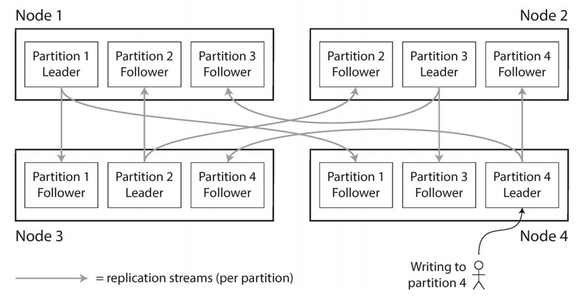
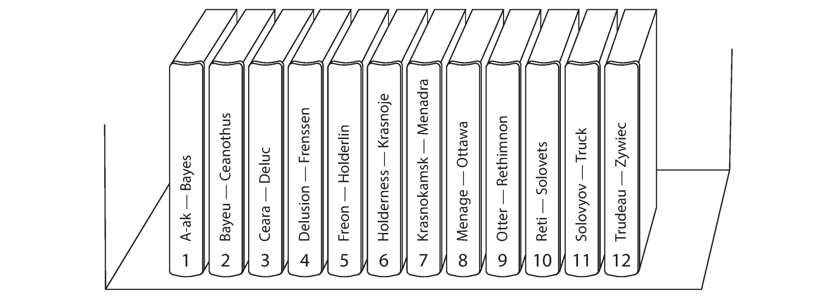
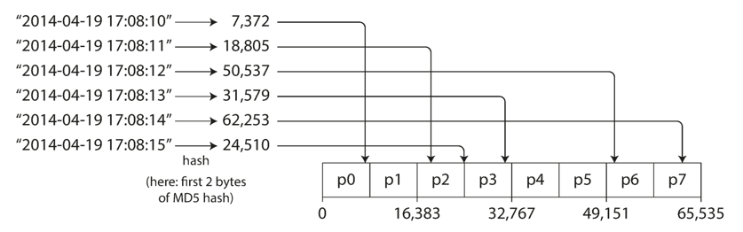
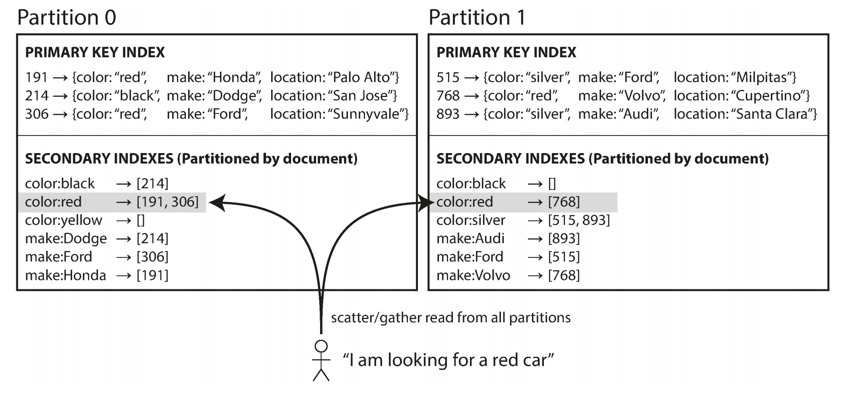
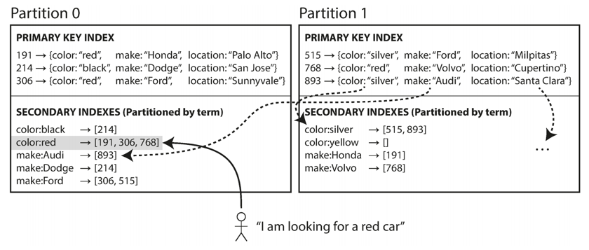
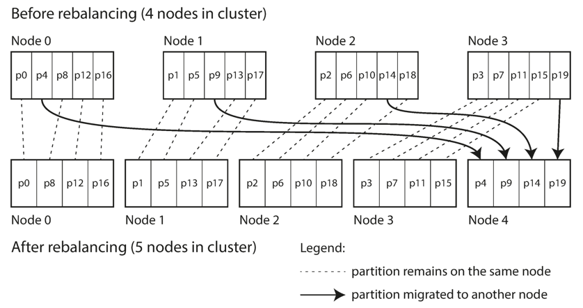
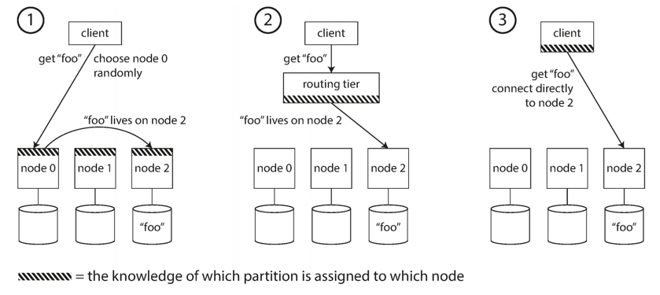
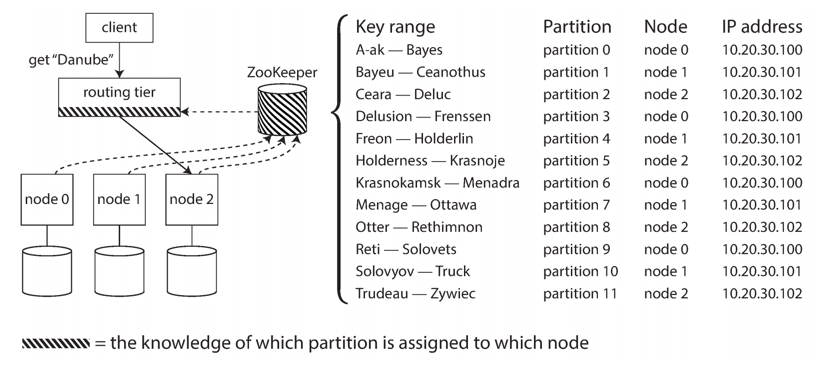

## Introduction

我们讨论过[复制](/docs/CS/Distributed/Replica.md)，即在不同节点上保存同一数据的多个副本。
对于非常大的数据集或非常高的查询吞吐量，这还不够：我们需要将数据分成多个*分区*，也称为*分片*。

通常，分区定义为每份数据（每条记录、行或文档）恰好属于一个分区。
实际上，每个分区本身就是一个小型数据库，尽管数据库可能支持同时涉及多个分区的操作。

分区数据的主要原因是可扩展性。
不同分区可以放置在无共享集群的不同节点上。
因此，大型数据集可以分布在多个磁盘上，查询负载可以分布在多个处理器上。
对于在单个分区上操作的查询，每个节点可以独立地为其自己的分区执行查询，因此可以通过添加更多节点来扩展查询吞吐量。
大型复杂查询可以在多个节点上并行化，尽管这要困难得多。

分区通常与复制结合使用，以便每个分区的副本存储在多个节点上。
这意味着，尽管每条记录恰好属于一个分区，但它可能为了容错而存储在多个不同节点上。
一个节点可能存储多个分区。
如果使用主从复制模型，分区和复制的组合可能如图 1 所示。
每个分区的领导器（leader）分配给一个节点，其跟随器（follower）分配给其他节点。
每个节点可能是某些分区的 leader 和其他分区的 follower。

我们在第 5 章中讨论的关于数据库复制的一切同样适用于分区复制。
分区方案的选择与复制方案的选择基本无关，因此本章我们将保持简单，忽略复制。

Fig.1. 结合复制和分区：每个节点担任某些分区的 leader 和其他分区的 follower。

我们的分区目标是使数据和查询负载均匀分布在各个节点上。
如果每个节点承担公平的份额，那么理论上 10 个节点应该能够处理 10 倍的数据以及 10 倍的读写吞吐量（暂时忽略复制）。

如果分区不公平，导致某些分区的数据或查询多于其他分区，我们称之为*倾斜*。
倾斜的存在会大大降低分区的效率。
在极端情况下，所有负载可能集中在一个分区上，导致 9/10 的节点空闲，而瓶颈是那个繁忙的节点。
负载异常高的分区称为*热点*。

避免热点的最简单方法是将记录随机分配给节点。
这样可以将数据相当均匀地分布在各个节点上，但它有一个很大的缺点：当你要读取特定条目时，你无法知道它在哪个节点上，因此必须并行查询所有节点。

我们可以做得更好。
现在暂时假设我们有一个简单的键值数据模型，你总是通过主键访问记录。
例如，在传统的纸质百科全书中，你可以通过标题查找条目；由于所有条目按标题字母顺序排序，你可以快速找到你要找的内容。

### 基于范围的分区

一种分区方法是为每个分区分配一个连续的键范围（从某个最小值到某个最大值），就像纸质百科全书的分卷一样。
如果你知道范围之间的边界，就可以轻松确定给定键属于哪个分区。
如果你还知道哪个分区分配给了哪个节点，就可以直接将请求发送到适当的节点（或者在百科全书的情况下，从书架上取下正确的书籍）。

Fig.2. 纸质百科全书按键范围分区。

键的范围不一定均匀间隔，因为你的数据可能分布不均匀。
例如，在图 2 中，第 1 卷包含以 A 和 B 开头的单词，但第 12 卷包含以 T、U、V、X、Y 和 Z 开头的单词。
简单地按字母每两卷一卷会导致某些卷比其他卷大得多。
为了均匀分布数据，分区边界需要适应数据。

分区边界可以由管理员手动选择，也可以由数据库自动选择。

在每个分区内，我们可以按排序顺序保存键。
这样做的好处是范围扫描很容易，并且你可以将键视为连接索引，以便在一次查询中获取多个相关记录。
例如，考虑一个存储传感器网络数据的应用程序，其中键是测量的时间戳（年-月-日-时-分-秒）。
范围扫描在这种情况下非常有用，因为它们可以让你轻松获取某个特定月份的所有读数。

**然而，键范围分区的缺点是某些访问模式会导致热点。**
如果键是时间戳，那么分区对应的是时间范围，例如每天一个分区。
不幸的是，由于我们在测量发生时将数据从传感器写入数据库，所有写入最终都会进入同一个分区（当天的分区），因此该分区可能因写入而过载，而其他分区则处于空闲状态。
为了避免传感器数据库中的这个问题，需要使用时间戳以外的其他东西作为键的第一个元素。
例如，你可以在每个时间戳前加上传感器名称，以便先按传感器名称分区，再按时间分区。
假设你同时有许多活跃的传感器，写入负载将更均匀地分布在各个分区上。
现在，当你想获取某个时间范围内多个传感器的值时，需要为每个传感器名称执行单独的范围查询。

### 基于哈希的分区

由于存在倾斜和热点的风险，许多分布式数据存储使用哈希函数来确定给定键的分区。

一个好的哈希函数可以处理倾斜数据并使其均匀分布。
假设你有一个接受字符串的 32 位哈希函数。每当你给它一个新字符串时，它返回一个介于 0 和 $2^{32} − 1$ 之间的看似随机的数字。
即使输入字符串非常相似，它们的哈希值也均匀分布在该数字范围内。
出于分区目的，哈希函数不需要在加密上很强：例如，Cassandra 和 MongoDB 使用 MD5，Voldemort 使用 Fowler–Noll–Vo 函数。
许多编程语言都内置了简单的哈希函数（用于哈希表），但它们可能不适合分区：例如，在 Java 的 `Object.hashCode()` 和 Ruby 的 `Object#hash` 中，相同的键在不同进程中可能具有不同的哈希值。

一旦你有合适的键哈希函数，就可以为每个分区分配一个哈希范围（而不是键范围），并且每个哈希值落在分区范围内的键都将存储在该分区中。
如图 3 所示。

Fig.3. 按键的哈希值分区。

这种技术擅长在分区之间公平地分布键。
分区边界可以是均匀间隔的，也可以是伪随机选择的（后一种技术有时称为*一致性哈希*）。

然而，通过使用键的哈希值进行分区，我们失去了键范围分区的一个好特性：执行高效范围查询的能力。
曾经相邻的键现在分散在所有分区中，因此它们的排序顺序丢失了。
在 MongoDB 中，如果你启用了基于哈希的分片模式，任何范围查询都必须发送到所有分区。
Riak、Couchbase 或 Voldemort 不支持主键的范围查询。

Cassandra 在两种分区策略之间实现了折衷。
Cassandra 中的表可以用复合主键声明，由多个列组成。
只有该键的第一部分被哈希以确定分区，但其他列用作连接索引，用于对 Cassandra 的 SSTable 中的数据进行排序。
因此，查询无法搜索复合键第一列中的值范围，但如果它为第一列指定了固定值，则可以对键的其他列执行高效的范围扫描。

连接索引方法为了一对多关系提供了优雅的数据模型。
例如，在社交媒体网站上，一个用户可能发布许多更新。
如果更新的主键选择为 (user_id, update_timestamp)，那么你可以高效地检索特定用户在某个时间间隔内按时间戳排序的所有更新。
不同用户可能存储在不同的分区上，但在每个用户内，更新按时间戳顺序存储在单个分区上。

### 倾斜工作负载与热点缓解

如前所述，对键进行哈希以确定其分区有助于减少热点。
然而，它无法完全避免：在极端情况下，所有读写都针对同一个键，所有请求仍然会路由到同一个分区。

这类工作负载可能不常见，但并非闻所未闻：例如，在社交媒体网站上，拥有数百万粉丝的名人用户在某事发生时可能会引发活动风暴。
此事件可能导致大量写入到同一个键（该键可能是名人的用户 ID，或人们正在评论的操作的 ID）。
对键进行哈希无济于事，因为两个相同 ID 的哈希值仍然相同。

如今，大多数数据系统无法自动补偿如此高度倾斜的工作负载，因此减少倾斜是应用程序的责任。
例如，如果已知某个键非常热，一种简单的技术是在键的开头或结尾添加一个随机数。
仅两位数的十进制随机数就可以将对该键的写入均匀地分散到 100 个不同的键上，从而使这些键可以分布到不同的分区。

然而，将写入分散到不同的键后，任何读取现在都必须做额外的工作，因为它们必须从所有 100 个键读取数据并进行合并。
这种技术还需要额外的簿记工作：仅对少数热键附加随机数才有意义；对于绝大多数写入吞吐量低的键，这将是不必要的开销。
因此，你还需要某种方法来跟踪哪些键被拆分。
也许将来，数据系统将能够自动检测和补偿倾斜的工作负载；但目前，你需要考虑自己应用程序的权衡。

## 二级索引

到目前为止我们讨论的分区方案依赖于键值数据模型。
如果记录仅通过主键访问，我们可以从该键确定分区，并使用它将读写请求路由到负责该键的分区。
如果涉及二级索引，情况会变得更加复杂。
二级索引通常不唯一标识一条记录，而是一种搜索特定值出现位置的方法：查找用户 123 的所有操作，查找包含单词 hogwash 的所有文章，查找所有颜色为红色的汽车，等等。

二级索引是关系数据库的命脉，在文档数据库中也很常见。
许多键值存储（如 HBase 和 Voldemort）由于实现复杂性而避免使用二级索引，但有些（如 Riak）已开始添加它们，因为它们对数据建模非常有用。
最后，二级索引是 Solr 和 Elasticsearch 等搜索服务器存在的根本原因。
二级索引的问题在于它们不能很好地映射到分区。
使用二级索引对数据库进行分区有两种主要方法：基于文档的分区和基于词条的分区。

### 基于文档的二级索引

例如，假设你运营一个二手车销售网站（如图 4 所示）。
每个列表都有一个唯一 ID，称为文档 ID，你按文档 ID 对数据库进行分区（例如，ID 0 到 499 在分区 0 中，ID 500 到 999 在分区 1 中，等等）。

你希望允许用户搜索汽车，允许他们按颜色和品牌筛选，因此你需要对颜色和品牌建立二级索引（在文档数据库中，这些是字段；在关系数据库中，这些是列）。
如果你声明了索引，数据库可以自动执行索引编制。
例如，每当将一辆红色汽车添加到数据库时，数据库分区会自动将其添加到索引条目 color:red 的文档 ID 列表中。

Fig.4. 基于文档的二级索引分区。

在这种索引方法中，每个分区完全独立：每个分区维护自己的二级索引，仅覆盖该分区中的文档。
它不关心其他分区中存储了什么数据。
每当需要写入数据库（添加、删除或更新文档）时，你只需要处理包含你正在写入的文档 ID 的分区。
因此，文档分区索引也称为*局部索引*（与下节描述的*全局索引*相对）。

然而，从文档分区索引读取时需要小心：除非你对文档 ID 做了特殊处理，否则没有理由使所有具有特定颜色或特定品牌的汽车都在同一个分区中。
在图 4 中，红色汽车出现在分区 0 和分区 1 中。
因此，如果你想搜索红色汽车，你需要将查询发送到所有分区，并合并返回的所有结果。

这种查询分区数据库的方法有时称为散布/收集，它可能使二级索引上的读取查询非常昂贵。
即使你并行查询分区，散布/收集也容易出现尾部延迟放大。
尽管如此，它仍被广泛使用：MongoDB、Riak、Cassandra、Elasticsearch、SolrCloud 和 VoltDB 都使用文档分区的二级索引。
大多数数据库供应商建议你设计分区方案，以便二级索引查询可以从单个分区提供服务，但这并非总是可行，尤其是当你在单个查询中使用多个二级索引时（例如同时按颜色和品牌筛选汽车）。

### 基于词条的二级索引

我们可以构建一个覆盖所有分区数据的全局索引，而不是每个分区拥有自己的二级索引（局部索引）。
然而，我们不能仅仅将该索引存储在一个节点上，因为它很可能成为瓶颈并违背分区的目的。
全局索引也必须分区，但它的分区方式可以与主键索引不同。

图 5 说明了这一点：所有分区中的红色汽车出现在 color:red 索引条目下，但索引被分区，使得以字母 a 到 r 开头的颜色出现在分区 0 中，以字母 s 到 z 开头的颜色出现在分区 1 中。
汽车的品牌索引也类似地分区（分区边界在 f 和 h 之间）。

Fig.5. 基于词条的二级索引分区。

我们称这种索引为词条分区索引，因为我们要查找的词条决定了索引的分区。这里，词条例如 color:red。
名称词条来源于全文索引（一种特殊的二级索引），其中词条是文档中出现的所有单词。
如前所述，我们可以按词条本身或词条的哈希值对索引进行分区。
按词条本身分区可用于范围扫描（例如，在数字属性上，如汽车的售价），而按词条的哈希值分区则能更均匀地分布负载。

全局（词条分区）索引相对于文档分区索引的优势在于，它可以使读取更高效：客户端无需在所有分区上进行散布/收集，只需向包含所需词条的分区发出请求。
然而，全局索引的缺点是写入更慢、更复杂，因为对单个文档的写入现在可能影响索引的多个分区（文档中的每个词条可能位于不同节点上的不同分区）。

在理想情况下，索引应该始终是最新的，并且写入数据库的每个文档都应该立即反映在索引中。
然而，在词条分区索引中，这需要跨写入所影响的所有分区的分布式事务，而这并非所有数据库都支持。

在实践中，全局二级索引的更新通常是异步的（也就是说，如果你在写入后不久读取索引，你刚刚所做的更改可能尚未反映在索引中）。
例如，Amazon DynamoDB 声明其全局二级索引在正常情况下会在不到一秒的时间内更新，但在基础设施故障的情况下可能会出现更长的传播延迟。
全局词条分区索引的其他用途包括 Riak 的搜索功能和 Oracle 数据仓库，后者允许你在局部索引和全局索引之间进行选择。

## 重新平衡分区

随着时间的推移，数据库中的情况会发生变化：

- 查询吞吐量增加，因此你想添加更多 CPU 来处理负载。
- 数据集大小增加，因此你想添加更多磁盘和 RAM 来存储它。
- 机器发生故障，其他机器需要接管故障机器的职责。

所有这些变化都要求将数据和请求从一台节点移动到另一台节点。
将负载从一个节点移动到集群中另一个节点的过程称为*重新平衡*。
无论使用哪种分区方案，重新平衡通常应满足一些最低要求：

- 重新平衡后，负载（数据存储、读写请求）应在集群中的节点之间公平共享。
- 在重新平衡期间，数据库应继续接受读写操作。
- 节点之间移动的数据不应超过必要量，以使重新平衡快速进行并最小化网络和磁盘 I/O 负载。

### 重新平衡策略

有几种不同的方法可以将分区分配给节点。让我们逐一简要讨论。

#### 不推荐的方法：hash mod N

当通过键的哈希值分区时，我们之前说过（图 3），最好将可能的哈希值划分为范围，并将每个范围分配给一个分区（例如，如果 0 ≤ hash(key) < b0，将键分配给分区 0；如果 b0 ≤ hash(key) < b1，分配给分区 1，等等）。
也许你想知道为什么我们不直接使用 mod（许多编程语言中的 % 运算符）。
例如，hash(key) mod 10 将返回一个 0 到 9 之间的数字（如果我们将哈希值写成十进制数，hash mod 10 将是最后一位数字）。
如果我们有 10 个节点，编号为 0 到 9，这似乎是将每个键分配给一个节点的简单方法。

mod N 方法的问题在于，如果节点数 N 发生变化，大多数键都需要从一个节点移动到另一个节点。
例如，假设 hash(key) = 123456。如果你最初有 10 个节点，该键从节点 6 开始（因为 123456 mod 10 = 6）。
当你增长到 11 个节点时，该键需要移动到节点 3（123456 mod 11 = 3），当你增长到 12 个节点时，它需要移动到节点 0（123456 mod 12 = 0）。如此频繁的移动使得重新平衡过于昂贵。
我们需要一种不会比必要更频繁地移动数据的方法。

#### 固定数量的分区

幸运的是，有一个相当简单的解决方案：创建比节点多得多的分区，并将多个分区分配给每个节点。
例如，在 10 个节点的集群上运行的数据库可能从一开始就分成 1,000 个分区，这样大约 100 个分区分配给每个节点。

现在，如果向集群添加一个节点，新节点可以从每个现有节点窃取几个分区，直到分区再次公平分配。
此过程如图 6 所示。如果从集群中移除一个节点，则反向进行相同的过程。

Fig.6. 向具有多分区节点的数据库集群添加新节点。

只有整个分区在节点之间移动。分区的数量不变，键到分区的分配也不变。
唯一改变的是分区到节点的分配。
这种分配的更改不是即时的——通过网络传输大量数据需要一些时间——因此在传输进行期间，任何读写操作都使用旧的分区分配。

原则上，你甚至可以考虑集群中硬件不匹配的情况：通过将更多分区分配给更强大的节点，你可以强制这些节点承担更大的负载份额。
这种重新平衡方法用于 Riak、Elasticsearch、Couchbase 和 Voldemort。

在这种配置中，分区的数量通常在数据库首次设置时固定，之后不再更改。
虽然原则上可以拆分和合并分区（见下节），但固定数量的分区在操作上更简单，因此许多固定分区数据库选择不实现分区拆分。
因此，最初配置的分区数量是你可以拥有的最大节点数，因此你需要选择足够高的数量以适应未来的增长。
然而，每个分区也有管理开销，因此选择过高的数量会适得其反。

如果数据集的总大小变化很大（例如，如果它开始很小但随着时间的推移可能增长很多），则选择正确的分区数量很困难。
由于每个分区包含总数据的固定比例，每个分区的大小与集群中的数据总量成正比增长。
如果分区非常大，重新平衡和从节点故障中恢复的成本会很高。
但如果分区太小，它们会产生过多的开销。当分区大小"恰到好处"时性能最佳，既不太大也不太小，但如果分区数量固定而数据集大小变化，则很难实现这一点。

#### 动态分区

对于使用键范围分区的数据库，固定数量且固定边界的分区会非常不方便：如果你弄错了边界，可能会将所有数据集中在一个分区中，而所有其他分区为空。
手动重新配置分区边界将非常繁琐。

因此，HBase 和 RethinkDB 等键范围分区数据库会动态创建分区。
当分区增长到超过配置的大小时（在 HBase 中，默认为 10 GB），它会拆分为两个分区，以便大约一半的数据落在拆分的每一侧。
相反，如果大量数据被删除并且分区缩小到低于某个阈值，它可以与相邻分区合并。
这个过程类似于 B-tree 顶层发生的情况。
每个分区分配给一个节点，每个节点可以处理多个分区，就像固定分区数量的情况一样。
在大型分区被拆分后，它的两个半区之一可以转移到另一个节点以平衡负载。
在 HBase 的情况下，分区文件的传输通过底层分布式文件系统 HDFS 进行。

**动态分区的一个优点是分区数量会适应总数据量。**
如果只有少量数据，足够少量的分区就足够了，因此开销很小；如果有大量数据，每个单独分区的大小限制为可配置的最大值。

然而，一个注意事项是，空数据库从单个分区开始，因为没有关于在哪里划分分区边界的先验信息。
在数据集很小的时候（直到达到第一个分区被拆分的点），所有写入都必须由单个节点处理，而其他节点处于空闲状态。
为了缓解这个问题，HBase 和 MongoDB 允许在空数据库上配置初始分区集（这称为预拆分）。
对于键范围分区，预拆分需要你已经知道键分布会是什么样子。

动态分区不仅适用于键范围分区的数据，也同样适用于哈希分区的数据。

#### 与节点成比例的分区

使用动态分区，分区数量与数据集大小成比例，因为拆分和合并过程使每个分区的大小保持在某个固定最小值和最大值之间。
另一方面，使用固定数量的分区，每个分区的大小与数据集大小成比例。
在这两种情况下，分区数量都与节点数量无关。

Cassandra 和 Ketama 使用的第三种选项是使分区数量与节点数量成比例，即每个节点具有固定数量的分区。
在这种情况下，当节点数量保持不变时，每个分区的大小与数据集大小成比例增长，但是当你增加节点数量时，分区再次变小。
由于更大的数据量通常需要更多的节点来存储，这种方法也使每个分区的大小保持相当稳定。

当新节点加入集群时，它会随机选择固定数量的现有分区进行拆分，然后获取每个拆分分区的一半所有权，同时将另一半保留在原位。
随机化可能导致不公平的拆分，但在大量分区的情况下（在 Cassandra 中，默认每个节点 256 个分区），新节点最终会从现有节点获取公平的负载份额。
Cassandra 3.0 引入了一种替代的重新平衡算法，避免了不公平的拆分。

随机选择分区边界要求使用基于哈希的分区（因此可以从哈希函数产生的数字范围中选择边界）。
实际上，这种方法最符合一致性哈希的原始定义。
较新的哈希函数可以以更低的元数据开销实现类似的效果。

### 自动或手动重新平衡

关于重新平衡，我们忽略了一个重要问题：重新平衡是自动发生还是手动进行？

在全自动重新平衡（系统自动决定何时将分区从一个节点移动到另一个节点，无需任何管理员交互）和
全手动（分区到节点的分配由管理员明确配置，并且仅在管理员明确重新配置时更改）之间有一个梯度。
例如，Couchbase、Riak 和 Voldemort 会自动生成建议的分区分配，但需要管理员在生效之前提交它。

全自动重新平衡可能很方便，因为正常维护所需的操作工作更少。然而，它可能不可预测。
重新平衡是一项昂贵的操作，因为它需要重新路由请求并从一个节点向另一个节点移动大量数据。
如果处理不当，此过程可能使网络或节点过载，并在重新平衡进行时损害其他请求的性能。

这种自动化与自动故障检测结合使用时可能很危险。
例如，假设一个节点过载并暂时响应请求缓慢。
其他节点断定过载节点已死，并自动重新平衡集群以将负载从它移开。
这给过载节点、其他节点和网络带来了额外负载，使情况变得更糟，并可能导致级联故障。

因此，在重新平衡中让人类参与循环可能是一件好事。
它比全自动过程慢，但有助于防止操作上的意外。

## 请求路由

我们现在已经将数据集分区到分布在多台机器上的多个节点上。
但仍然有一个未解决的问题：当客户端想要发出请求时，它如何知道要连接到哪个节点？
随着分区的重新平衡，分区到节点的分配会发生变化。
需要有人跟踪这些变化来回答这个问题：如果我想读取或写入键"foo"，我需要连接到哪个 IP 地址和端口号？

这是一个称为服务发现的更通用问题的实例，并不仅限于数据库。
任何通过网络可访问的软件都有这个问题，特别是如果它旨在实现高可用性（在多台机器上以冗余配置运行）。
许多公司编写了自己的内部服务发现工具，其中许多已作为开源软件发布。

在高层面上，有几种不同的方法来解决这个问题（如图 7 所示）：

1. 允许客户端联系任何节点（例如，通过轮询负载均衡器）。
   如果该节点恰好拥有请求所涉及的分区，它可以直接处理请求；否则，它将请求转发到适当的节点，接收回复，并将回复传递给客户端。
2. 首先将所有来自客户端的请求发送到路由层，由路由层确定处理每个请求的节点并相应地转发。
   该路由层本身不处理任何请求；它仅充当分区感知的负载均衡器。
3. 要求客户端了解分区分区和分区到节点的分配。在这种情况下，客户端可以直接连接到适当的节点，无需任何中介。
   在所有情况下，关键问题是：做出路由决策的组件（可能是节点之一、路由层或客户端）如何了解分区到节点分配的变化？

Fig.7. 将请求路由到正确节点的三种不同方式。

这是一个具有挑战性的问题，因为所有参与者达成一致很重要，否则请求将被发送到错误的节点而无法正确处理。
有在分布式系统中达成共识的协议，但它们很难正确实现。

许多分布式数据系统依赖单独的协调服务（如 ZooKeeper）来跟踪集群元数据，如图 8 所示。
每个节点在 ZooKeeper 中注册自己，ZooKeeper 维护分区到节点的权威映射。
其他参与者（如路由层或分区感知客户端）可以在 ZooKeeper 中订阅此信息。
每当分区所有权发生变化，或添加或移除节点时，ZooKeeper 通知路由层，使其路由信息保持最新。

Fig.8. 使用 ZooKeeper 跟踪分区到节点的分配。

例如，LinkedIn 的 Espresso 使用 Helix 进行集群管理（Helix 又依赖 ZooKeeper），实现了如图 8 所示的路由层。
HBase、SolrCloud 和 Kafka 也使用 ZooKeeper 来跟踪分区分配。
MongoDB 有类似的架构，但它依赖自己的配置服务器实现和 mongos 守护进程作为路由层。

Cassandra 和 Riak 采用了不同的方法：它们在节点之间使用 gossip 协议来传播集群状态的任何变化。
请求可以发送到任何节点，该节点将它们转发到请求分区的适当节点。

这种模型将更多复杂性放在数据库节点中，但避免了对 ZooKeeper 等外部协调服务的依赖。
Couchbase 不会自动重新平衡，这简化了设计。
通常它配置一个名为 moxi 的路由层，后者从集群节点了解路由变化。

当使用路由层或将请求发送到随机节点时，客户端仍然需要找到要连接的 IP 地址。
这些地址不像分区到节点的分配那样变化频繁，因此使用 DNS 通常就足够了。

## 并行查询执行

到目前为止，我们专注于读取或写入单个键的非常简单的查询（以及在文档分区二级索引情况下的散布/收集查询）。
这是大多数 NoSQL 分布式数据存储支持的访问级别。

然而，通常用于分析的*大规模并行处理*关系数据库产品在其支持的查询类型上要复杂得多。
典型的数据仓库查询包含多个连接、过滤、分组和聚合操作。
MPP 查询优化器将这个复杂的查询分解为多个执行阶段和分区，其中许多可以在数据库集群的不同节点上并行执行。
涉及扫描数据集大部分内容的查询尤其受益于这种并行执行。
数据仓库查询的快速并行执行是一个专门的课题，鉴于分析对商业的重要性，它受到了广泛的商业关注。

## Summary

## Links

- [Replica](/docs/CS/Distributed/Replica.md)
