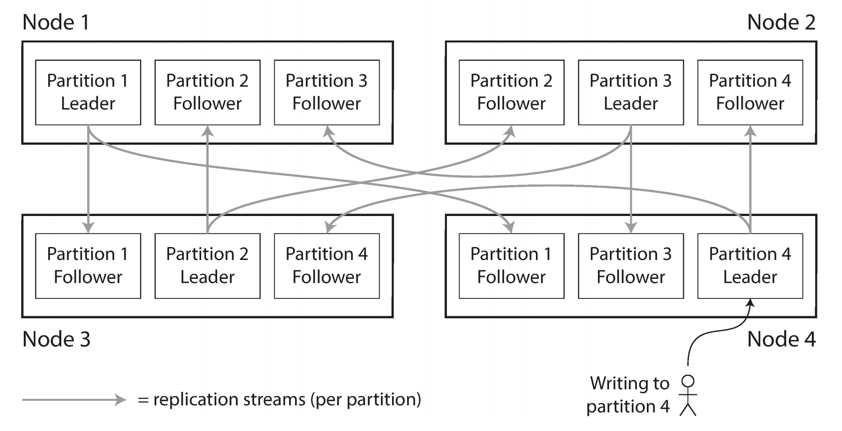
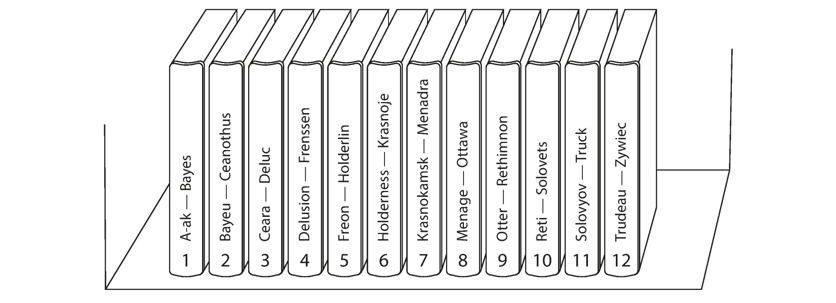
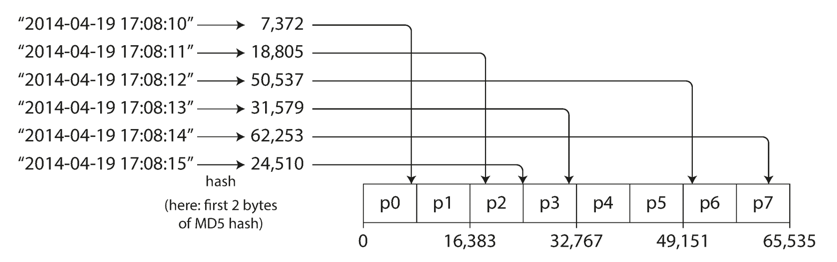
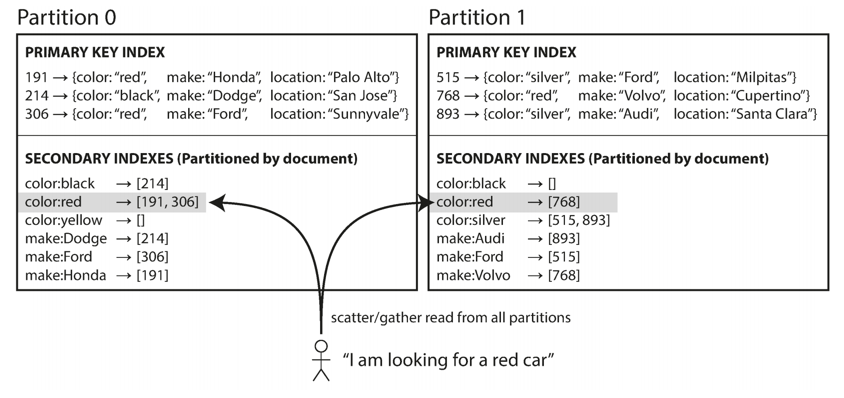
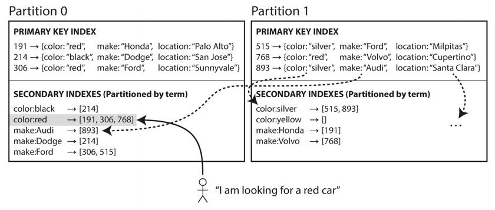
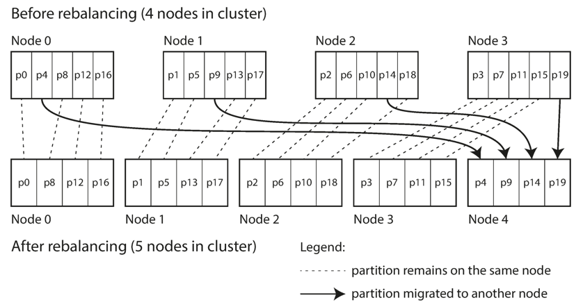
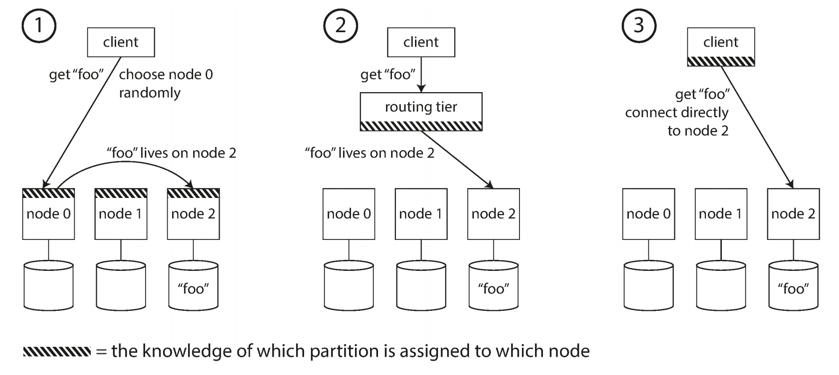
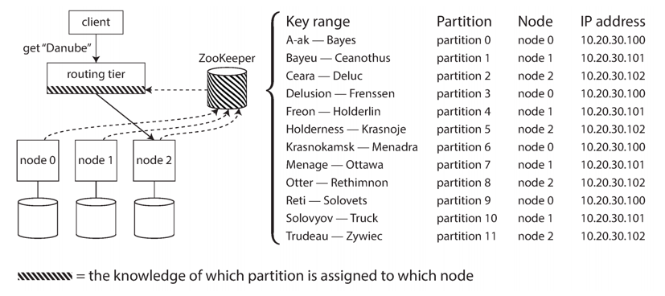

## Introduction

我们讨论过 [replication](/docs/CS/Distributed/Replica.md)（复制）——即在不同的节点上保存同一份数据的多个副本。对于超大数据集或极高的查询吞吐，这还不够：我们需要把数据切分成*分区（partitions）*，也称为*分片（sharding）*。

通常，分区的定义方式使得每条数据（每条记录、行或文档）恰好属于一个分区。实际上，每个分区自身就是一个小型数据库，尽管数据库可能支持同时涉及多个分区的操作。

对数据进行分区的主要理由是 scalability（可扩展性）。不同的分区可以放在无共享（shared-nothing）集群的不同节点上。因此，一个大的数据集可以分布到多块磁盘上，查询负载也可以分布到多个处理器上。对于只操作单个分区的查询，每个节点可以独立执行其自身分区的查询，因此可以通过增加节点来扩展查询吞吐。大型、复杂的查询有可能跨多个节点并行化，尽管这会显著更难。

分区通常与复制（Replication）结合使用，使得每个分区的副本保存在多个节点上。这意味着，尽管每条记录恰好属于一个分区，它仍可能因容错而保存在若干不同的节点上。一个节点可能存储多个分区。如果使用领导者—跟随者（leader–follower）复制模型，分区与复制的结合看起来就像图 1。每个分区的领导者（leader）被分配到某个节点，其跟随者（follower）被分配到其他节点。每个节点可能既是某些分区的领导者，又是其他分区的跟随者。

关于第 5 章数据库复制的讨论，同样适用于分区的复制。分区方案的选择在很大程度上独立于复制方案的选择，因此本章为简洁起见忽略复制。

Fig.1. Combining replication and partitioning: each node acts as leader for some partitions and follower for other partitions.

我们进行分区的目标是将数据与查询负载均匀地分散到各个节点上。如果每个节点都承担公平的份额，那么理论上——10 个节点应当能处理单节点 10 倍的数据量以及 10 倍的读写吞吐（暂时忽略复制）。

如果分区不公平，某些分区拥有比其它分区更多的数据或查询，我们称之为*倾斜（skewed）*。倾斜的存在会大大降低分区的有效性。在极端情况下，所有负载可能都落在一个分区上，于是 10 个节点中有 9 个闲置，瓶颈就是那一个繁忙的节点。负载不成比例地高的分区被称为*热点（hot spot）*。

避免热点最简单的做法是把记录随机分配给节点。这会把数据相当均匀地分布到节点上，但有个大缺点：当你想读取某条特定记录时，你无法知道它在哪个节点上，因此必须并行查询所有节点。

我们可以做得更好。暂时假设你的数据模型是简单的键值（key-value）模型，总是通过主键访问记录。例如，在老式纸质百科全书中，你按标题查找条目；由于所有条目按标题字母排序，你可以快速找到想要的那个。

### Partitioning by Range

一种分区方式是给每个分区分配一段连续的键范围（从某个最小值到某个最大值），就像纸质百科全书的卷册。如果你知道范围之间的边界，就能轻易确定某个键属于哪个分区。如果你还知道哪个分区分配给哪个节点，就可以直接向相应节点发起请求（或者在百科全书的情形下，从书架上取正确的那本）。

Fig.2. A print encyclopedia is partitioned by key range.

键的范围不一定均匀间隔，因为你的数据可能分布不均。例如，在图 2 中，第 1 卷包含以 A 和 B 开头的单词，而第 12 卷包含以 T、U、V、X、Y、Z 开头的单词。简单地每两个字母分配一卷会导致某些卷比其他的厚得多。为了均匀分布数据，分区边界需要适应数据。

分区边界可以由管理员手动选择，也可以由数据库自动选择。

在每个分区内部，我们可以让键保持有序。这样做的好处是范围扫描（range scan）很容易，并且你可以把键当作拼接索引（concatenated index）来一次性获取若干相关记录。例如，考虑一个存储传感器网络数据的应用，其键是测量的时间戳（年-月-日-时-分-秒）。范围扫描在这种情形下非常有用，因为它让你可以轻松获取比如某个月的所有读数。

**然而，按键范围分区（key range partitioning）的缺点是某些访问模式会导致热点。** 如果键是时间戳，那么分区就对应时间范围——例如每天一个分区。不幸的是，因为我们是在传感器测量发生时把数据写入数据库，所有写入最终都落到同一个分区（今天的那个），于是该分区可能因写入而过载，而其它分区却闲置。为了避免传感器数据库中的这个问题，你需要用时间戳以外的东西作为键的第一个元素。例如，你可以在每个时间戳前加上传感器名称，这样分区先按传感器名称、再按时间进行。假设你同时有许多传感器在活动，写入负载就会更均匀地分散到各个分区。现在，当你想获取某个时间范围内多个传感器的值时，你需要为每个传感器名称分别执行一次范围查询。

### Partitioning by Hash

由于存在倾斜和热点风险，许多分布式数据存储使用哈希函数来确定给定键所属的分区。

一个好的哈希函数会把倾斜的数据变得均匀分布。假设你有一个 32 位哈希函数处理字符串。每当你给它一个新字符串，它返回一个看似介于 0 和 $2^{32} − 1$ 之间的随机数。即使输入字符串非常相似，它们的哈希值也均匀分布在这个数字范围内。出于分区目的，哈希函数无需具有密码学强度：例如 Cassandra 和 MongoDB 使用 MD5，Voldemort 使用 Fowler–Noll–Vo 函数。许多编程语言内置了简单的哈希函数（因为它们用于哈希表），但它们可能不适合分区：例如，Java 的 `Object.hashCode()` 和 Ruby 的 `Object#hash`，相同的键在不同进程中可能有不同的哈希值。

一旦有了合适的键哈希函数，你就可以给每个分区分配一段哈希范围（而不是键范围），凡是哈希落在该分区范围内的键都会被存入该分区。这一点如图 3 所示。

Fig.3. Partitioning by hash of key.

这种技术在把键公平地分配到各分区方面表现良好。分区边界可以均匀分布，也可以伪随机地选择（这种情况下该技术有时被称为*一致性哈希（consistent hashing）*）。

然而，由于使用键的哈希来分区，我们失去了键范围分区的一个好特性：高效范围查询的能力。原本相邻的键现在散布在所有分区中，它们的排序信息丢失了。在 MongoDB 中，如果启用了基于哈希的分片模式，任何范围查询都必须发往所有分区。主键上的范围查询在 Riak、Couchbase、Voldemort 中不被支持。

Cassandra 在两种分区策略之间取得了折中。Cassandra 中的表可以用由若干列组成的复合主键声明。只有该键的第一部分被哈希以确定分区，但其它列被用作拼接索引，用于在 Cassandra 的 SSTable 中对数据排序。因此查询无法在复合键的第一列内搜索值范围，但如果为第一列指定了固定值，它就能对键的其它列执行高效的范围扫描。

拼接索引方法为一对多关系提供了一种优雅的数据模型。例如，在社交媒体网站上，一个用户可能发布许多更新。如果更新的主键选为 (user_id, update_timestamp)，那么你就可以高效地检索某个用户在某段时间内的所有更新，并按时间戳排序。不同的用户可能存储在不同的分区上，但在每个用户内部，更新在单个分区上按时间戳有序存储。

### Skewed Workloads and Relieving Hot Spots

如前所述，对键做哈希以确定其分区有助于减少热点。然而，它无法完全避免：在极端情况下，如果所有读写都针对同一个键，你仍然会把所有请求路由到同一个分区。

这种负载或许不常见，但并非闻所未闻：例如，在社交媒体网站上，拥有数百万粉丝的名人用户一旦有所动作，就可能引发一阵活动风暴。这个事件会导致大量写入落到同一个键（键可能是该名人的用户 ID，或是人们评论的动作的 ID）。对键做哈希无济于事，因为两个相同 ID 的哈希仍然是相同的。

如今，大多数数据系统无法自动补偿如此高度倾斜的负载，因此减少倾斜是应用层的责任。例如，如果已知某个键非常热，一个简单的技巧是在键的开头或结尾加上一个随机数。仅仅一个两位十进制随机数就能把该键的写入均匀拆分到 100 个不同的键上，让这些键分布到不同的分区。

然而，把写入拆分到不同的键之后，任何读取现在都要做额外的工作，因为它们必须从全部 100 个键读取数据并合并。这一技巧还需要额外的簿记：只对少数热键追加随机数是合理的；对于绝大多数写吞吐很低的键而言，这将是多余的开销。因此，你还需要某种方式来记录哪些键正在被拆分。也许将来数据系统能够自动检测并补偿倾斜负载；但就目前而言，你需要为自己应用的权衡深思熟虑。

## Secondary Indexes

我们迄今讨论的分区方案依赖于键值数据模型。如果记录永远只通过主键访问，我们可以由主键确定分区，并用它将读写请求路由到负责该键的分区。如果涉及二级索引，情况就变得更复杂了（另见第 85 页“Other Indexing Structures”）。二级索引通常不能唯一标识一条记录，而是搜索某个特定值出现之处的一种方式：找出用户 123 的所有动作、找出包含“hogwash”一词的所有文章、找出所有红色汽车，等等。

二级索引是关系型数据库的面包与黄油，在文档数据库中也很常见。许多键值存储（如 HBase 和 Voldemort）为避免增加的实现复杂度而回避二级索引，但有些（如 Riak）因为对数据建模太有用而开始添加它们。最后，二级索引是 Solr、Elasticsearch 等搜索服务器的存在理由（raison d'être）。二级索引的问题在于它们不能整齐地映射到分区。对带二级索引的数据库进行分区主要有两种方法：基于文档（document-based）的分区和基于词（term-based）的分区。

### Document-based Secondary Indexes

例如，设想你运营一个二手车销售网站（如图 4 所示）。每个列表有一个唯一 ID——称为文档 ID——你按文档 ID 对数据库分区（例如分区 0 中 ID 0~499，分区 1 中 ID 500~999，等等）。

你想让用户搜索汽车，允许他们按颜色和品牌过滤，因此你需要在 color 和 make 上建立二级索引（在文档数据库中这些是字段；在关系型数据库中这些是列）。如果你已声明索引，数据库可以自动执行索引。例如，每当一辆红色汽车被加入数据库，数据库分区就会自动把它加入索引项 color:red 的文档 ID 列表中。

Fig.4. Partitioning secondary indexes by document.

在这种索引方式下，每个分区完全独立：每个分区维护自己的二级索引，只覆盖该分区中的文档。它不关心其他分区中存了什么数据。每当你需要写入数据库——添加、删除或更新文档——你只需处理包含你所写文档 ID 的那个分区。因此，按文档分区的索引也称为*局部索引（local index）*（与下一节描述的*全局索引（global index）*相对）。

然而，从按文档分区的索引读取需要小心：除非你对文档 ID 做了特殊处理，否则没有理由让所有同色或同品牌的汽车在同一个分区中。在图 4 中，红色汽车同时出现在分区 0 和分区 1。因此，如果你想搜索红色汽车，需要把查询发往所有分区，并合并返回的所有结果。

这种查询分区数据库的方法有时被称为 scatter/gather（分散/收集），它可能使基于二级索引的读查询相当昂贵。即使你并行查询各分区，scatter/gather 也容易出现长尾延迟放大（tail latency amplification，见第 16 页“Percentiles in Practice”）。尽管如此，它仍被广泛使用：MongoDB、Riak、Cassandra、Elasticsearch、SolrCloud、VoltDB 都使用按文档分区的二级索引。大多数数据库厂商建议你组织分区方案，使二级索引查询能由单个分区服务，但这并非总能做到，尤其是当你在单个查询中使用多个二级索引时（例如同时按颜色和品牌过滤汽车）。

### Term-based Secondary Indexes

与其让每个分区拥有自己的二级索引（局部索引），我们可以构建一个覆盖所有分区数据的全局索引。然而，我们不能把这个索引只存在一个节点上，因为那很可能成为瓶颈，违背分区的初衷。全局索引也必须被分区，但它可以与主键索引以不同方式分区。

图 5 展示了可能的样子：所有分区中的红色汽车都出现在索引的 color:red 下，但索引本身被分区，使得以 a~r 字母开头的颜色在分区 0，以 s~z 开头的颜色在分区 1。按汽车品牌建的索引也类似分区（分区边界在 f 和 h 之间）。

Fig.5. Partitioning secondary indexes by term.

我们称这类索引为按词分区（term-partitioned），因为我们寻找的词决定了索引所在的分区。这里，词可以是 color:red。词（term）这个名字来自全文索引（一种特殊的二级索引），其中词是文档中出现的所有单词。如前所述，我们可以按词本身对索引分区，也可以使用词的哈希。按词本身分区对范围扫描很有用（例如对数值属性，如汽车的要价），而按词的哈希分区则能更均匀地分布负载。

全局（按词分区）索引相对于按文档分区索引的优势在于读取更高效：不必对所有分区做 scatter/gather，客户端只需向包含目标词的分区发起请求。然而，全局索引的缺点是写入更慢、更复杂，因为对单个文档的写入现在可能影响索引的多个分区（文档中的每个词可能在不同的分区、不同的节点上）。

在理想世界中，索引总是最新的，写入数据库的每条文档都立即反映到索引中。然而，在按词分区的索引中，那需要跨所有受写入影响的分区执行分布式事务，而这并非所有数据库都支持。

实践中，全局二级索引的更新通常是异步的（也就是说，如果你在写入后不久读取索引，你刚做的改动可能尚未反映到索引中）。例如，Amazon DynamoDB 表示其全局二级索引在正常情况下于一秒内更新，但在基础设施故障时可能经历更长的传播延迟。全局按词分区索引的其它用途包括 Riak 的搜索功能，以及 Oracle 数据仓库（让你在局部与全局索引之间选择）。

## Partition Rebalancing

随着时间推移，数据库中的情况会变化：

- 查询吞吐增加，你想添加更多 CPU 来处理负载。
- 数据集大小增加，你想添加更多磁盘和 RAM 来存储它。
- 一台机器故障，其它机器需要接管故障机器的职责。

所有这些变化都要求把数据和请求从一个节点迁移到另一个节点。把负载从集群中的一个节点迁移到另一个节点的过程称为*再平衡（rebalancing）*。无论使用哪种分区方案，再平衡通常期望满足一些最低要求：

- 再平衡之后，负载（数据存储、读写请求）应在集群中的节点间公平共享。
- 再平衡进行期间，数据库应继续接受读写。
- 节点之间移动的数据不应超过必要，以使再平衡快速，并最小化网络与磁盘 I/O 负载。

### Rebalancing Strategies

把分区分配给节点有几种不同方式。我们依次简要讨论每种。

#### Counter-example: Hash Modulo N

当按键的哈希分区时，我们前面（图 3）说过，最好把可能的哈希值分成若干范围，每个范围分配给一个分区（例如，若 0 ≤ hash(key) < b0 则分配给分区 0，若 b0 ≤ hash(key) < b1 则分配给分区 1，等等）。你也许会疑惑我们为何不直接用取模（mod，许多编程语言中的 % 运算符）。例如，hash(key) mod 10 会返回 0 到 9 之间的一个数（如果把哈希写成十进制数，hash mod 10 就是最后一位）。如果我们有 10 个编号为 0~9 的节点，这看似是给每个键分配节点的简便方法。

mod N 方法的问题在于：如果节点数 N 改变，大多数键都需要从一个节点迁移到另一个。例如，设 hash(key) = 123456。如果你最初有 10 个节点，该键起始在节点 6（因为 123456 mod 10 = 6）。当你扩展到 11 个节点时，该键需要移到节点 3（123456 mod 11 = 3）；当你扩展到 12 个节点时，它需要移到节点 0（123456 mod 12 = 0）。如此频繁的迁移使再平衡代价过高。我们需要一种不会不必要地搬移数据的方法。

#### Fixed Number of Partitions

幸运的是，有一个相当简单的方案：创建比节点数多得多的分区，给每个节点分配若干个分区。例如，运行在 10 节点集群上的数据库一开始可以拆成 1000 个分区，这样每个节点大约分配 100 个分区。

现在，如果向集群添加一个节点，新节点可以从每个现有节点“偷”几个分区，直到分区再次公平分布。图 6 展示了这一过程。如果移除一个节点，情况相反。

Fig.6. Adding a new node to a database cluster with multiple partitions per node.

只有整个分区在节点间移动。分区的数量不变，键到分区的分配也不变。唯一改变的是分区到节点的分配。这个分配的改变不是立即生效——在网络上传输大量数据需要一些时间——因此在传输进行期间发生的任何读写仍使用旧的分区分配。

原则上，你甚至可以在集群中考虑到硬件不匹配：通过给更强大的节点分配更多分区，你可以迫使这些节点承担更大的负载份额。Riak、Elasticsearch、Couchbase、Voldemort 都使用了这种再平衡方法。

在这种配置中，分区的数量通常在数据库初次建立时固定，之后不再改变。尽管原则上可以拆分和合并分区（见下一节），但固定数量的分区在运维上更简单，因此许多固定分区的数据库选择不实现分区拆分。因此，初始配置的分区数就是你能拥有的最大节点数，你需要把它设得足够高以容纳未来的增长。然而，每个分区也有管理开销，所以设得太高会适得其反。

在数据集总大小高度可变时（例如一开始很小但随时间可能大幅增长），选择正确的分区数是困难的。由于每个分区包含总数据的固定比例，每个分区的大小随集群数据总量成比例增长。如果分区非常大，再平衡和从节点故障中恢复就会很昂贵。但如果分区太小，它们又会产生过多开销。当分区大小“恰到好处”、既不太大也不太小时性能最佳，而在分区数固定但数据集大小变化时这很难实现。

#### Dynamic Partitioning

对于使用键范围分区的数据库，固定数量且边界固定的分区会非常不便：如果你把边界搞错了，可能所有数据都在一个分区，其它分区全空。手动重新配置分区边界会非常繁琐。

因此，基于键范围分区的数据库（如 HBase 和 RethinkDB）会动态创建分区。当一个分区增长到超过配置的大小（HBase 默认 10 GB）时，它被拆成两个分区，使得大约一半数据落在拆分的两侧。反之，如果删除大量数据导致某分区缩小到某个阈值以下，它可以与相邻分区合并。这个过程类似于 B 树顶层发生的情况。每个分区分配给一个节点，每个节点可以处理多个分区，就像固定数量分区的情况。一个大的分区被拆分后，它的两半之一可以被转移到另一个节点以平衡负载。在 HBase 中，分区文件的传输通过底层分布式文件系统 HDFS 完成。

**动态分区的一个优势是分区数能适应数据总量。** 如果数据量很小，少量分区就足够，开销也小；如果数据量巨大，每个单独分区的大小被限制在可配置的最大值。

然而，一个告诫是：空数据库开始时只有一个分区，因为没有先验信息来确定分区边界画在哪里。在数据集很小——直到第一次分区被拆分之前——所有写入都必须由单个节点处理，而其它节点闲置。为缓解这个问题，HBase 和 MongoDB 允许在空数据库上配置一组初始分区（这称为预拆分，pre-splitting）。在键范围分区的情况下，预拆分要求你已经知道键分布会是什么样子。

动态分区不仅适用于键范围分区的数据，同样也适用于哈希分区的数据。

#### Partitioning Proportionally to Nodes

在动态分区中，分区数与数据集大小成正比，因为拆分与合并过程把每个分区的大小保持在某个固定的最小与最大之间。另一方面，在固定数量分区中，每个分区的大小与数据集大小成正比。在这两种情况下，分区数都与节点数无关。

第三种选项，由 Cassandra 和 Ketama 使用，是让分区数与节点数成正比——换言之，每个节点有固定数量的分区。在这种情况下，当节点数不变时，每个分区的大小随数据集大小成比例增长；但当你增加节点数时，分区又变小了。由于更大的数据量通常需要更多节点来存储，这种方法也使每个分区的大小相当稳定。

当新节点加入集群时，它随机选择固定数量的现有分区进行拆分，然后占有每个被拆分分区的一半，而另一半留在原位。随机化可能产生不公平的拆分，但在更多分区上平均后（Cassandra 默认每个节点 256 个分区），新节点最终会从现有节点拿走公平的负载份额。Cassandra 3.0 引入了一种替代的再平衡算法，避免了不公平的拆分。

随机选取分区边界要求使用基于哈希的分区（这样边界才能从哈希函数产生的数字范围中选取）。实际上，这种方法与一致性哈希（consistent hashing）的原始定义最为接近。更新的哈希函数可以用更低的元数据开销达到类似效果。

### Automatic or Manual Rebalancing

关于再平衡有一个重要问题我们一直回避：再平衡是自动发生还是手动发生？

在完全自动再平衡（系统自动决定何时把分区从一个节点迁移到另一个，无需任何管理员介入）与完全手动（分区到节点的分配由管理员显式配置，且只有管理员显式重新配置时才会改变）之间存在一个连续谱。例如，Couchbase、Riak、Voldemort 会自动生成建议的分区分配，但需要管理员提交后才能生效。

全自动再平衡可能很方便，因为日常运维的工作更少。然而，它可能不可预测。再平衡是一个昂贵的操作，因为它需要重新路由请求，并在节点间搬移大量数据。如果做得不仔细，这个过程可能使网络或节点过载，并在再平衡进行期间损害其它请求的性能。

这种自动化与自动故障检测结合可能很危险。例如，假设一个节点过载并暂时响应缓慢。其它节点断定该过载节点已死，并自动再平衡集群以把负载从它身上移开。这给过载节点、其它节点和网络都增加了负载——使情况更糟，并可能导致级联故障。

因此，在再平衡中让人类参与可能是件好事。它比全自动过程慢，但有助于防止运维上的意外。

## Request Routing

现在我们已经把数据集分区到运行在多台机器上的多个节点。但还有一个悬而未决的问题：当客户端想发起请求时，它如何知道该连接哪个节点？随着分区被再平衡，分区到节点的分配会变化。有人需要掌握这些变化以回答这个问题：如果我想读写键“foo”，需要连接哪个 IP 地址和端口号？

这是更一般问题——服务发现（service discovery）的一个实例，它不限于数据库。任何可通过网络访问的软件都有这个问题，尤其是当它追求高可用性（在多台机器上以冗余配置运行）时。许多公司编写了自己的内部服务发现工具，其中许多已作为开源发布。

高层上，这个问题有几种不同的方法（如图 7 所示）：

1. 允许客户端联系任意节点（例如通过轮询负载均衡器）。如果该节点碰巧拥有请求所属的分区，它可以直接处理请求；否则，它把请求转发给相应节点，收到回复后再转给客户端。
2. 先把来自客户端的所有请求发往一个路由层，由它确定应由哪个节点处理每个请求并相应转发。这个路由层本身不处理任何请求；它只充当分区感知的负载均衡器。
3. 要求客户端感知分区以及分区到节点的分配。这种情况下，客户端可以直接连到相应节点，无需任何中介。在所有情况下，关键问题是：做出路由决策的组件（可能是某个节点、路由层或客户端）如何得知分区到节点分配的变化？

Fig.7. Three different ways of routing a request to the right node.

这是一个具有挑战性的问题，因为重要的是所有参与者都达成一致，否则请求会被发往错误的节点而得不到正确处理。分布式系统中有达成一致的协议，但很难正确实现。

许多分布式数据系统依赖单独的协调服务（如 ZooKeeper）来跟踪这类集群元数据，如图 8 所示。每个节点在 ZooKeeper 中注册自己，ZooKeeper 维护分区到节点的权威映射。其它角色（如路由层或分区感知的客户端）可以订阅 ZooKeeper 中的这些信息。每当分区变更所有权，或添加、移除节点时，ZooKeeper 都会通知路由层，使它保持路由信息最新。

Fig.8. Using ZooKeeper to keep track of assignment of partitions to nodes.

例如，LinkedIn 的 Espresso 使用 Helix 做集群管理（后者又依赖 ZooKeeper），实现了如图 8 所示的路由层。HBase、SolrCloud、Kafka 也使用 ZooKeeper 跟踪分区分配。MongoDB 有类似的架构，但它依赖自己的配置服务器实现和 mongos 守护进程作为路由层。

Cassandra 和 Riak 采取不同的方法：它们在节点间使用 gossip 协议（Gossip）来传播集群状态的任何变化。请求可以发往任意节点，该节点再把它转发给请求所属分区的相应节点。

这种模型把更多复杂性放在数据库节点中，但避免了对 ZooKeeper 等外部协调服务的依赖。Couchbase 不自动再平衡，这简化了设计。通常它配置一个称为 moxi 的路由层，从集群节点学习路由变化。

当使用路由层或把请求发往随机节点时，客户端仍需要找到要连接的 IP 地址。这些地址不像分区到节点的分配那样变化频繁，因此通常只需用 DNS 即可。

## Parallel Query Execution

到目前为止，我们聚焦于读写单个键（以及按文档分区二级索引情形下的 scatter/gather 查询）这类非常简单的查询。这大致是大多数 NoSQL 分布式数据存储支持的访问层级。

然而，*大规模并行处理（MPP，massively parallel processing）*关系型数据库产品（常用于分析）在支持的查询类型上成熟得多。一个典型的数据仓库查询包含若干连接、过滤、分组和聚合操作。MPP 查询优化器把这个复杂查询拆成若干执行阶段和分区，其中许多可以在数据库集群的不同节点上并行执行。涉及扫描数据集很大一部分的查询尤其受益于这种并行执行。数据仓库查询的快速并行执行是一个专门的主题，鉴于分析的业务重要性，它受到大量商业关注。

## Summary

## Links

- [Replica](/docs/CS/Distributed/Replica.md)
