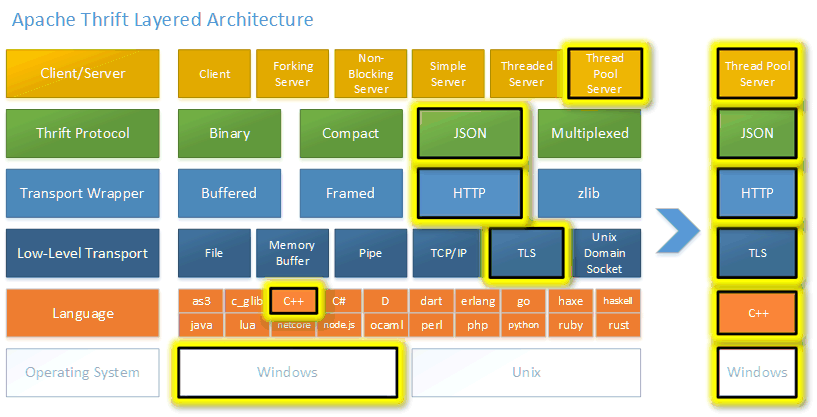

## Introduction

[Thrift](https://github.com/apache/thrift) 是一套轻量、语言无关的软件栈，用于实现点对点 RPC。Thrift 为数据传输、数据序列化与应用层处理提供了清晰的抽象与实现。其代码生成系统以一种简单的定义语言作为输入，跨多种编程语言生成代码，利用这套抽象栈构建可互操作的 RPC 客户端与服务端。

Fig.1. Thrift Layered Architecture

## Links

- [RPC](/docs/CS/Distributed/RPC/RPC.md)
- [Protocol Buffers](/docs/CS/Distributed/RPC/ProtoBuf.md)
- [Fury](/docs/CS/Distributed/RPC/Fury.md)
- [gRPC](/docs/CS/Framework/gRPC/gRPC.md)
