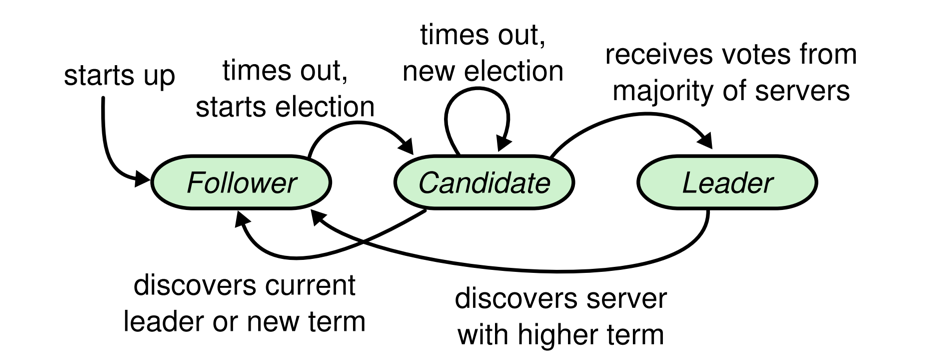
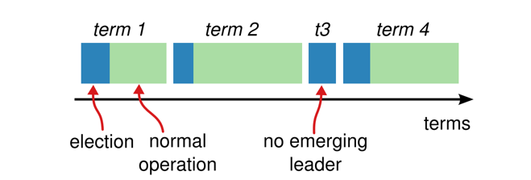
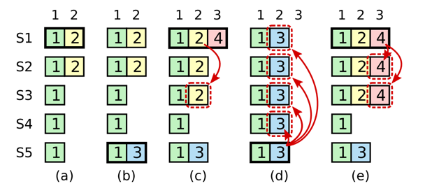

## Introduction

[Raft](https://raft.github.io/) is a consensus algorithm that is designed to be easy to understand.
It's equivalent to [Paxos](/docs/CS/Distributed/Paxos.md) in fault-tolerance and performance.
The difference is that it's decomposed into relatively independent subproblems, and it cleanly addresses all major pieces needed for practical systems.

In contrast to Paxos, which is leaderless, Raft is a leader-based log replication protocol.
In simplified terms, a Raft implementation elects a leader once, and then the leader is responsible for making all the decisions about the state of the database.
This helps avoid extra communication between replicas during individual reads and writes. Each node tracks the current leader and forwards requests to that leader.
Raft is built around the concept of a replicated log. When the leader receives a request, it first stores an entry for it in its durable local log.
This local log is then replicated to all of the followers, or replicas.
Once the majority of replicas confirm they have persisted with the log, the leader applies the entry and instructs the replicas to do the same.
In the event of leader failure, a replica with the most up-to-date log becomes the leader.

Raft defines not only how the group makes a decision, but also the protocol for adding new members and removing members from the group.
This feature makes Raft a natural fit for managing topology changes in distributed systems.

Raft decomposes the consensus problem into three relatively independent sub-problems:

- Leader election
- Log replication
- Safety

**Raft Visualization**:

- [RaftScope](https://github.com/ongardie/raftscope)
- [The Secret Lives of Data](http://thesecretlivesofdata.com/raft/)

## Basics

Raft implements consensus by first electing a distinguished leader, then giving the leader complete responsibility for managing the replicated log.
The leader accepts log entries from clients, replicates them on other servers, and tells servers when it is safe to apply log entries to their state machines.
Having a leader simplifies the management of the replicated log.
For example, the leader can decide where to place new entries in the log without consulting other servers, and data flows in a simple fashion from the leader to other servers.
A leader can fail or become disconnected from the other servers, in which case a new leader is elected.

### States

A Raft cluster contains several servers; five is a typical number, which allows the system to tolerate two failures.
At any given time each server is in one of three states: leader, follower, or candidate.
In normal operation there is exactly one leader and all of the other servers are followers.
Followers are passive: they issue no requests on their own but simply respond to requests from leaders and candidates.
The leader handles all client requests (if a client contacts a follower, the follower redirects it to the leader).
The third state, candidate, is used to elect a new leader.
Figure 1 shows the states and their transitions; the transitions are discussed below.

Fig.1. Server states.
 
Followers only respond to requests from other servers.
If a follower receives no communication, it becomes a candidate and initiates an election.
 
A candidate that receives votes from a majority of the full cluster becomes the new leader.
Leaders typically operate until they fail.

Persistent state on all servers:
(Updated on stable storage before responding to RPCs)

| Arguments   | Descriptions                                                                                                              |
| ------------- | --------------------------------------------------------------------------------------------------------------------------- |
| currentTerm | latest term server has seen (initialized to 0 on first boot, increases monotonically)                                     |
| votedFor    | candidateId that received vote in current term (or null if none)                                                          |
| log[]       | log entries; each entry contains command for state machine, and term when entry was received by leader (first index is 1) |

Volatile state on all servers:

| Arguments   | Descriptions                                                                                    |
| ------------- | ------------------------------------------------------------------------------------------------- |
| commitIndex | index of highest log entry known to be committed (initialized to 0, increases monotonically)    |
| lastApplied | index of highest log entry applied to state machine (initialized to 0, increases monotonically) |

Volatile state on leaders:
(Reinitialized after election)

| Arguments    | Descriptions                                                                                                            |
| -------------- | ------------------------------------------------------------------------------------------------------------------------- |
| nextIndex[]  | for each server, index of the next log entry to send to that server (initialized to leader last log index + 1)          |
| matchIndex[] | for each server, index of highest log entry known to be replicated on server(initialized to 0, increases monotonically) |

### Terms

Since Raft cannot assume global clock synchronization, global partial ordering on events is achieved with a monotonically increasing value, known as a *term*.

Raft divides time into terms of arbitrary length, as shown in Figure 2.
Terms are numbered with consecutive integers.
Each term begins with an election, in which one or more candidates attempt to become leader.
If a candidate wins the election, then it serves as leader for the rest of the term.
In some situations an election will result in a split vote.
In this case the term will end with no leader; a new term (with a new election) will begin shortly.
Raft ensures that there is at most one leader in a given term.
Different servers may observe the transitions between terms at different times, and in some situations a server may not observe an election or even entire terms.
Terms act as a logical clock in Raft, and they allow servers to detect obsolete information such as stale leaders.
Each server stores a current term number, which increases monotonically over time.
Current terms are exchanged whenever servers communicate; if one server’s current term is smaller than the other’s, then it updates its current term to the larger value.
If a candidate or leader discovers that its term is out of date, it immediately reverts to follower state.
If a server receives a request with a stale term number, it rejects the request.
Raft servers communicate using remote procedure calls (RPCs), and the basic consensus algorithm requires only two types of RPCs.
RequestVote RPCs are initiated by candidates during elections, and AppendEntries RPCs are initiated by leaders to replicate log entries and to provide a form of heartbeat.
Add a third RPC for transferring snapshots between servers.
Servers retry RPCs if they do not receive a response in a timely manner, and they issue RPCs in parallel for best performance.

A node’s term is only updated when it starts (or restarts) an election, or when it learns from another node that its term is out of date. 
All messages include the source node’s term.
The receiving node checks it, with two possible outcomes: if the receiver’s term is larger, a negative response is sent, while if the receiver’s term is smaller than or equal to the source’s, its term is updated before parsing the message.

Fig.2. Time is divided into terms, and each term begins with an election.
After a successful election, a single leader manages the cluster until the end of the term. 
 
Some elections fail, in which case the term ends without choosing a leader.
The transitions between terms may be observed at different times on different servers.

### AppendEntries RPC

Invoked by leader to replicate log entries ; also used as heartbeat .

| Arguments    | Descriptions                                                                         |
| -------------- | -------------------------------------------------------------------------------------- |
| term         | leader’s term                                                                       |
| leaderId     | so follower can redirect clients                                                     |
| prevLogIndex | index of log entry immediately preceding new ones                                    |
| prevLogTerm  | term of prevLogIndex entry                                                           |
| entries      | [] log entries to store (empty for heartbeat; may send more than one for efficiency) |
| leaderCommit | leader’s commitIndex                                                                |

| Results      | Descriptions                                                                               |
| -------------- | -------------------------------------------------------------------------------------------- |
| term         | currentTerm, for leader to update itself success true if follower contained entry matching |
| prevLogIndex | and prevLogTerm                                                                            |

Receiver implementation:

1. Reply false if term < currentTerm
2. Reply false if log doesn’t contain an entry at prevLogIndex whose term matches prevLogTerm
3. If an existing entry conflicts with a new one (same index but different terms), delete the existing entry and all that follow it
4. Append any new entries not already in the log
5. If leaderCommit > commitIndex, set commitIndex = min(leaderCommit, index of last new entry)

### RequestVote RPC

Invoked by candidates to gather votes .

| Arguments    | Descriptions                         |
| -------------- | -------------------------------------- |
| term         | candidate’s term                    |
| candidateId  | candidate requesting vote            |
| lastLogIndex | index of candidate’s last log entry |
| lastLogTerm  | term of candidate’s last log entry  |

| Results     | Descriptions                                |
| ------------- | --------------------------------------------- |
| term        | currentTerm, for candidate to update itself |
| voteGranted | true means candidate received vote          |

Receiver implementation:

1. Reply false if term < currentTerm
2. If votedFor is null or candidateId, and candidate’s log is at least as up-to-date as receiver’s log, grant vote

### Rules for Servers

All Servers:

- If commitIndex > lastApplied: increment lastApplied, apply log[lastApplied] to state machine
- If RPC request or response contains term T > currentTerm: set currentTerm = T, convert to follower

Followers:

- Respond to RPCs from candidates and leaders
- If election timeout elapses without receiving AppendEntries RPC from current leader or granting vote to candidate: convert to candidate

Candidates:

- On conversion to candidate, start election:
  - Increment currentTerm
  - Vote for self
  - Reset election timer
  - Send RequestVote RPCs to all other servers
- If votes received from majority of servers: become leader
- If AppendEntries RPC received from new leader: convert to follower
- If election timeout elapses: start new election

Leaders:

- Upon election: send initial empty AppendEntries RPCs (heartbeat) to each server; repeat during idle periods to prevent election timeouts
- If command received from client: append entry to local log, respond after entry applied to state machine
- If last log index ≥ nextIndex for a follower: send AppendEntries RPC with log entries starting at nextIndex
  - If successful: update nextIndex and matchIndex for follower
  - If AppendEntries fails because of log inconsistency: decrement nextIndex and retry
- If there exists an N such that N > commitIndex, a majority of matchIndex[i] ≥ N, and log[N].term == currentTerm: set commitIndex = N.

| Guarantee properties | Descriptions                                                                                                                                         |
| ---------------------- | ------------------------------------------------------------------------------------------------------------------------------------------------------ |
| Election Safety      | at most one leader can be elected in a given term.                                                                                                   |
| Leader Append-Only   | a leader never overwrites or deletes entries in its log; it only appends new entries.                                                                |
| Log Matching         | if two logs contain an entry with the same index and term, then the logs are identical in all entries up through the given index.                    |
| Leader Completeness  | if a log entry is committed in a given term, then that entry will be present in the logs of the leaders for all higher-numbered terms.               |
| State Machine Safety | if a server has applied a log entry at a given index to its state machine, no other server will ever apply a different log entry for the same index. |

## Leader election

Raft uses a heartbeat mechanism to trigger leader election.
When servers start up, they begin as followers.
A server remains in follower state as long as it receives valid RPCs from a leader or candidate.
Leaders send periodic heartbeats (AppendEntries RPCs that carry no log entries) to all followers in order to maintain their authority.
If a follower receives no communication over a period of time called the election timeout, then it assumes there is no viable leader and begins an election to choose a new leader

To begin an election, a follower increments its current term and transitions to candidate state.
It then votes for itself and issues RequestVote RPCs in parallel to each of the other servers in the cluster.
A candidate continues in this state until one of three things happens:

- it wins the election,
- another server establishes itself as leader, or
- a period of time goes by with no winner.

A candidate wins an election if it receives votes from a majority of the servers in the full cluster for the same term.
Each server will vote for at most one candidate in a given term, on a first-come-first-served basis.
The majority rule ensures that at most one candidate can win the election for a particular term.
Once a candidate wins an election, it becomes leader.
It then sends heartbeat messages to all of the other servers to establish its authority and prevent new elections.

While waiting for votes, a candidate may receive an AppendEntries RPC from another server claiming to be leader.

- If the leader’s term (included in its RPC) is at least as large as the candidate’s current term, then the candidate recognizes the leader as legitimate and returns to follower state.
- If the term in the RPC is smaller than the candidate’s current term, then the candidate rejects the RPC and continues in candidate state.

The third possible outcome is that a candidate neither wins nor loses the election: if many followers become candidates at the same time, votes could be split so that no candidate obtains a majority.
When this happens, each candidate will time out and start a new election by incrementing its term and initiating another round of RequestVote RPCs.
However, without extra measures split votes could repeat indefinitely.

**Raft uses randomized election timeouts to ensure that split votes are rare and that they are resolved quickly.**
To prevent split votes in the first place, election timeouts are chosen randomly from a fixed interval (e.g., 150–300ms).
This spreads out the servers so that in most cases only a single server will time out; it wins the election and sends heartbeats before any other servers time out.
The same mechanism is used to handle split votes.
Each candidate restarts its randomized election timeout at the start of an election, and it waits for that timeout to elapse before starting the next election; this reduces the likelihood of another split vote in the new election.

## Log replication

Once a leader has been elected, it begins servicing client requests. Each client request contains a command to be executed by the replicated state machines.
The leader appends the command to its log as a new entry, then issues AppendEntries RPCs in parallel to each of the other servers to replicate the entry.
When the entry has been safely replicated, the leader applies the entry to its state machine and returns the result of that execution to the client.
**If followers crash or run slowly, or if network packets are lost, the leader retries AppendEntries RPCs indefinitely (even after it has responded to the client) until all followers eventually store all log entries.**

Logs are organized as shown in Figure 3.
Each log entry stores a state machine command along with the term number when the entry was received by the leader.
The term numbers in log entries are used to detect inconsistencies between logs and to ensure some of the properties.
Each log entry also has an integer index identifying its position in the log.

Fig.3. Logs are composed of entries, which are numbered sequentially. 
 
Each entry contains the term in which it was created (the number in each box) and a command for the state machine. 
 
An entry is considered committed if it is safe for that entry to be applied to state machines.

The leader decides when it is safe to apply a log entry to the state machines; such an entry is called committed.
Raft guarantees that committed entries are durable and will eventually be executed by all of the available state machines.
A log entry is committed once the leader that created the entry has replicated it on a majority of the servers (e.g., entry 7 in Figure 3).
This also commits all preceding entries in the leader’s log, including entries created by previous leaders.
[Membership change](/docs/CS/Distributed/Raft.md?id=Membership-changes) discusses some subtleties when applying this rule after leader changes, and it also shows that this definition of commitment is safe.
The leader keeps track of the highest index it knows to be committed, and it includes that index in future AppendEntries RPCs (including heartbeats) so that the other servers eventually find out.
Once a follower learns that a log entry is committed, it applies the entry to its local state machine (in log order).

We designed the Raft log mechanism to maintain a high level of coherency between the logs on different servers.
Not only does this simplify the system’s behavior and make it more predictable, but it is an important component of ensuring safety.
Raft maintains the following properties:

- If two entries in different logs have the same index and term, then they store the same command.
- If two entries in different logs have the same index and term, then the logs are identical in all preceding entries.

The first property follows from the fact that a leader creates at most one entry with a given log index in a given term, and log entries never change their position in the log.
The second property is guaranteed by a simple consistency check performed by AppendEntries.
When sending an AppendEntries RPC, the leader includes the index and term of the entry in its log that immediately precedes the new entries.
If the follower does not find an entry in its log with the same index and term, then it refuses the new entries.
The consistency check acts as an induction step: the initial empty state of the logs satisfies the Log Matching Property, and the consistency check preserves the Log Matching Property whenever logs are extended.
As a result, whenever AppendEntries returns successfully, the leader knows that the follower’s log is identical to its own log up through the new entries.

During normal operation, the logs of the leader and followers stay consistent, so the AppendEntries consistency check never fails.
However, leader crashes can leave the logs inconsistent (the old leader may not have fully replicated all of the entries in its log).
These inconsistencies can compound over a series of leader and follower crashes.
Figure 4 illustrates the ways in which followers’ logs may differ from that of a new leader.
A follower may be missing entries that are present on the leader, it may have extra entries that are not present on the leader, or both.
Missing and extraneous entries in a log may span multiple terms.

Fig.4. Inconsistency Logs 

When the leader at the top comes to power, it is possible that any of scenarios (a–f) could occur in follower logs.
Each box represents one log entry; the number in the box is its term.
A follower may be missing entries (a–b), may have extra uncommitted entries (c–d), or both (e–f).
For example, scenario (f) could occur if that server was the leader for term 2, added several entries to its log, then crashed before committing any of them;
it restarted quickly, became leader for term 3, and added a few more entries to its log; before any of the entries in either term 2 or term 3 were committed, the server crashed again and remained down for several terms.

**In Raft, the leader handles inconsistencies by forcing the followers’ logs to duplicate its own.**
This means that conflicting entries in follower logs will be overwritten with entries from the leader’s log.

To bring a follower’s log into consistency with its own, the leader must find the latest log entry where the two logs agree, delete any entries in the follower’s log after that point, and send the follower all of the leader’s entries after that point.
All of these actions happen in response to the consistency check performed by AppendEntries RPCs.
The leader maintains a nextIndex for each follower, which is the index of the next log entry the leader will send to that follower.
When a leader first comes to power, it initializes all nextIndex values to the index just after the last one in its log (11 in Figure 4).
If a follower’s log is inconsistent with the leader’s, the AppendEntries consistency check will fail in the next AppendEntries RPC.
After a rejection, the leader decrements nextIndex and retries the AppendEntries RPC.
Eventually nextIndex will reach a point where the leader and follower logs match.
When this happens, AppendEntries will succeed, which removes any conflicting entries in the follower’s log and appends entries from the leader’s log (if any).
Once AppendEntries succeeds, the follower’s log is consistent with the leader’s, and it will remain that way for the rest of the term.

If desired, the protocol can be optimized to reduce the number of rejected AppendEntries RPCs.
For example, when rejecting an AppendEntries request, the follower can include the term of the conflicting entry and the first index it stores for that term.
With this information, the leader can decrement nextIndex to bypass all of the conflicting entries in that term; one AppendEntries RPC will be required for each term with conflicting entries, rather than one RPC per entry.
In practice, we doubt this optimization is necessary, since failures happen infrequently and it is unlikely that there will be many inconsistent entries.

With this mechanism, a leader does not need to take any special actions to restore log consistency when it comes to power.
It just begins normal operation, and the logs automatically converge in response to failures of the AppendEntries consistency check.
A leader never overwrites or deletes entries in its own log.
This log replication mechanism exhibits the desirable consensus properties: Raft can accept, replicate, and apply new log entries as long as a majority of the servers are up; in the normal case a new entry can be replicated with a single round of RPCs to a majority of the cluster; and a single slow follower will not impact performance.

## Safety

The previous sections described how Raft elects leaders and replicates log entries.
However, the mechanisms described so far are not quite sufficient to ensure that each state machine executes exactly the same commands in the same order.
For example, a follower might be unavailable while the leader commits several log entries, then it could be elected leader and overwrite these entries with new ones; as a result, different state machines might execute different command sequences.

This section completes the Raft algorithm by adding a restriction on which servers may be elected leader.
The restriction ensures that the leader for any given term contains all of the entries committed in previous terms (the Leader Completeness Property from Figure 3).
Given the election restriction, we then make the rules for commitment more precise.
Finally, we present a proof sketch for the Leader Completeness Property and show how it leads to correct behavior of the replicated state machine.

### Election restriction

In any leader-based consensus algorithm, the leader must eventually store all of the committed log entries.
In some consensus algorithms, such as Viewstamped Replication, a leader can be elected even if it doesn’t initially contain all of the committed entries.
These algorithms contain additional mechanisms to identify the missing entries and transmit them to the new leader, either during the election process or shortly afterwards.
Unfortunately, this results in considerable additional mechanism and complexity.
**Raft uses a simpler approach where it guarantees that all the committed entries from previous terms are present on each new leader from the moment of its election, without the need to transfer those entries to the leader.**
**This means that log entries only flow in one direction, from leaders to followers, and leaders never overwrite existing entries in their logs.**

Raft uses the voting process to prevent a candidate from winning an election unless its log contains all committed entries.
A candidate must contact a majority of the cluster in order to be elected, which means that every committed entry must be present in at least one of those servers.
If the candidate’s log is at least as up-to-date as any other log in that majority (where “up-to-date” is defined precisely below), then it will hold all the committed entries.
**The RequestVote RPC implements this restriction: the RPC includes information about the candidate’s log, and the voter denies its vote if its own log is more up-to-date than that of the candidate.**

Raft determines which of two logs is more up-to-date by comparing the index and term of the last entries in the logs.
If the logs have last entries with different terms, then the log with the later term is more up-to-date.
If the logs end with the same term, then whichever log is longer is more up-to-date.

### Committing entries from previous terms

A leader knows that an entry from its current term is committed once that entry is stored on a majority of the servers.
If a leader crashes before committing an entry, future leaders will attempt to finish replicating the entry.
However, a leader cannot immediately conclude that an entry from a previous term is committed once it is stored on a majority of servers.
Figure 5 illustrates a situation where an old log entry is stored on a majority of servers, yet can still be overwritten by a future leader.

Fig.5. Raft-Stale-Logs

A time sequence showing why a leader cannot determine commitment using log entries from older terms.

- In (a) S1 is leader and partially replicates the log entry at index2.
- In (b) S1 crashes; S5 is elected leader for term 3 with votes from S3, S4, and itself, and accepts a different entry at log index 2.
- In (c) S5 crashes; S1 restarts, is elected leader, and continues replication. At this point, the log entry from term 2 has been replicated on a majority of the servers, but it is not committed.
- If S1 crashes as in (d), S5 could be elected leader (with votes from S2, S3, and S4) and overwrite the entry with its own entry from term 3.
- However, if S1 replicates an entry from its current term on a majority of the servers before crashing, as in (e), then this entry is committed (S5 cannot win an election). At this point all preceding entries in the log are committed as well.

To eliminate problems like the one in Figure 5, Raft never commits log entries from previous terms by counting replicas.
Only log entries from the leader’s current term are committed by counting replicas; once an entry from the current term has been committed in this way, then all prior entries are committed indirectly because of the Log Matching Property.
There are some situations where a leader could safely conclude that an older log entry is committed (for example, if that entry is stored on every server), but Raft takes a more conservative approach for simplicity.

Raft incurs this extra complexity in the commitment rules because log entries retain their original term numbers when a leader replicates entries from previous terms.
In other consensus algorithms, if a new leader rereplicates entries from prior “terms,” it must do so with its new “term number.”
Raft’s approach makes it easier to reason about log entries, since they maintain the same term number over time and across logs.
In addition, new leaders in Raft send fewer log entries from previous terms than in other algorithms (**other algorithms must send redundant log entries to renumber them before they can be committed**).

### Safety argument

Given the complete Raft algorithm, we can now argue more precisely that the Leader Completeness Property holds (this argument is based on the safety proof).
We assume that the Leader Completeness Property does not hold, then we prove a contradiction.
Suppose the leader for term T (leaderT) commits a log entry from its term, but that log entry is not stored by the leader of some future term.
Consider the smallest term U

> T whose leader (leaderU) does not store the entry.

1. The committed entry must have been absent from leaderU’s log at the time of its election (leaders never delete or overwrite entries).
2. leaderT replicated the entry on a majority of the cluster, and leaderU received votes from a majority of the cluster.
   Thus, at least one server (“the voter”)both accepted the entry from leaderT and voted for leaderU, as shown in Figure 9.
   The voter is key to reaching a contradiction.
3. The voter must have accepted the committed entry from leaderT before voting for leaderU; otherwise it would have rejected the AppendEntries request from leaderT (its current term would have been higher than T).
4. The voter still stored the entry when it voted for leaderU, since every intervening leader contained the entry (by assumption), leaders never remove entries, and followers only remove entries if they conflict with the leader.
5. The voter granted its vote to leaderU, so leaderU’s log must have been as up-to-date as the voter’s. This leads to one of two contradictions.
6. First, if the voter and leaderU shared the same last log term, then leaderU’s log must have been at least as long as the voter’s, so its log contained every entry in the voter’s log.
   This is a contradiction, since the voter contained the committed entry and leaderU was assumed not to.
7. Otherwise, leaderU’s last log term must have been larger than the voter’s. Moreover, it was larger than T, since the voter’s last log term was at least T (it contains the committed entry from term T).
   The earlier leader that created leaderU’s last log entry must have contained the committed entry in its log (by assumption).
   Then, by the Log Matching Property, leaderU’s log must also contain the committed entry, which is a contradiction.
8. This completes the contradiction. Thus, the leaders of all terms greater than T must contain all entries from term T that are committed in term T.
9. The Log Matching Property guarantees that future leaders will also contain entries that are committed indirectly, such as index 2 in Figure 5(d).

Fig.6. If S1 (leader for term T) commits a new log entry from its term, and S5 is elected leader for a later term U, then there must be at least one server (S3) that accepted the log entry and also voted for S5.

Given the Leader Completeness Property, we can prove the State Machine Safety Property which states that if a server has applied a log entry at a given index to its state machine, no other server will ever apply a different log entry for the same index.
At the time a server applies a log entry to its state machine, its log must be identical to the leader’s log up through that entry and the entry must be committed.
Now consider the lowest term in which any server applies a given log index; the Log Completeness Property guarantees that the leaders for all higher terms will store that same log entry, so servers that apply the index in later terms will apply the same value.
Thus, the State Machine Safety Property holds.

Finally, Raft requires servers to apply entries in log index order.
Combined with the State Machine Safety Property, this means that all servers will apply exactly the same set of log entries to their state machines, in the same order.

### Follower and candidate crashes

Until this point we have focused on leader failures.
Follower and candidate crashes are much simpler to handle than leader crashes, and they are both handled in the same way.
If a follower or candidate crashes, then future RequestVote and AppendEntries RPCs sent to it will fail.
Raft handles these failures by retrying indefinitely; if the crashed server restarts, then the RPC will complete successfully.

If a server crashes after completing an RPC but before responding, then it will receive the same RPC again after it restarts. Raft RPCs are idempotent, so this causes no harm.
For example, if a follower receives an AppendEntries request that includes log entries already present in its log, it ignores those entries in the new request.

### Timing and availability

One of our requirements for Raft is that safety must not depend on timing: the system must not produce incorrect results just because some event happens more quickly or slowly than expected.
However, availability (the ability of the system to respond to clients in a timely manner) must inevitably depend on timing.
For example, if message exchanges take longer than the typical time between server crashes, candidates will not stay up long enough to win an election; without a steady leader, Raft cannot make progress.
Leader election is the aspect of Raft where timing is most critical.
Raft will be able to elect and maintain a steady leader as long as the system satisfies the following timing requirement:

> broadcastTime ≪ electionTimeout ≪ MTBF

## Membership changes

Up until now we have assumed that the cluster configuration (the set of servers participating in the consensus algorithm) is fixed.
In practice, it will occasionally be necessary to change the configuration, for example to replace servers when they fail or to change the degree of replication.
Although this can be done by taking the entire cluster off-line, updating configuration files, and then restarting the cluster, this would leave the cluster unavailable during the changeover.
In addition, if there are any manual steps, they risk operator error.
In order to avoid these issues, we decided to automate configuration changes and incorporate them into the Raft consensus algorithm.
For the configuration change mechanism to be safe, there must be no point during the transition where it is possible for two leaders to be elected for the same term.
Unfortunately, any approach where servers switch directly from the old configuration to the new configuration is unsafe.
It isn’t possible to atomically switch all of the servers at once, so the cluster can potentially split into two independent majorities during the transition (see Figure 7).

In order to ensure safety, configuration changes must use a two-phase approach.
There are a variety of ways to implement the two phases.
For example, some systems use the first phase to disable the old configuration so it cannot process client requests; then the second phase enables the new configuration.
In Raft the cluster first switches to a transitional configuration we call joint consensus; once the joint consensus has been committed, the system then transitions to the new configuration.
 
The joint consensus combines both the old and new configurations:

- Log entries are replicated to all servers in both configurations.
- Any server from either configuration may serve as leader.
- Agreement (for elections and entry commitment) requires separate majorities from both the old and new configurations.

The joint consensus allows individual servers to transition between configurations at different times without compromising safety.
Furthermore, joint consensus allows the cluster to continue servicing client requests throughout the configuration change.
Cluster configurations are stored and communicated using special entries in the replicated log; Figure 11 illustrates the configuration change process.
When the leader receives a request to change the configuration from $C_{old}$ to $C_{new}$, it stores the configuration for joint consensus($C_{old}$,new in the figure) as a log entry and replicates that entry using the mechanisms described previously.
Once a given server adds the new configuration entry to its log, it uses that configuration for all future decisions (a server always uses the latest configuration in its log, regardless of whether the entry is committed).
This means that the leader will use the rules of $C_{old}$,new to determine when the log entry for $C_{old}$,new is committed.
If the leader crashes, a new leader may be chosen under either $C_{old}$ or $C_{old}$,new, depending on whether the winning candidate has received $C_{old}$,new.
In any case, $C_{new}$ cannot make unilateral decisions during this period.

Once $C_{old}$, new has been committed, neither$C_{old}$ nor$C_{new}$ can make decisions without approval of the other, and the Leader Completeness Property ensures that only servers with the $C_{old}$, new log entry can be elected as leader.
It is now safe for the leader to create a log entry describing $C_{new}$ and replicate it to the cluster.
Again, this configuration will take effect on each server as soon as it is seen.
When the new configuration has been committed under the rules of $C_{new}$, the old configuration is irrelevant and servers not in the new configuration can be shut down.
As shown in Figure 8, there is no time when $C_{old}$ and $C_{new}$ can both make unilateral decisions; this guarantees safety.

There are three more issues to address for reconfiguration.
The first issue is that new servers may not initially store any log entries.
If they are added to the cluster in this state, it could take quite a while for them to catch up, during which time it might not be possible to commit new log entries.
In order to avoid availability gaps, Raft introduces an additional phase before the configuration change, in which the new servers join the cluster as non-voting members (the leader replicates log entries to them, but they are not considered for majorities).
Once the new servers have caught up with the rest of the cluster, the reconfiguration can proceed as described above.

The second issue is that the cluster leader may not be part of the new configuration.
In this case, the leader steps down (returns to follower state) once it has committed the $C_{new}$ log entry.
This means that there will be a period of time (while it is committing $C_{new}$) when the leader is managing a cluster that does not include itself; it replicates log entries but does not count itself in majorities.
The leader transition occurs when $C_{new}$ is committed because this is the first point when the new configuration can operate independently (it will always be possible to choose a leader from $C_{new}$).
Before this point, it may be the case that only a server from $C_{old}$ can be elected leader.
The third issue is that removed servers (those not in $C_{new}$) can disrupt the cluster.
These servers will not receive heartbeats, so they will time out and start new elections.
They will then send RequestVote RPCs with new term numbers, and this will cause the current leader to revert to follower state.
A new leader will eventually be elected, but the removed servers will time out again and the process will repeat, resulting in poor availability.

To prevent this problem, servers disregard RequestVote RPCs when they believe a current leader exists. Specifically, if a server receives a RequestVote RPC within the minimum election timeout of hearing from a current leader, it does not update its term or grant its vote.
This does not affect normal elections, where each server waits at least a minimum election timeout before starting an election.
However, it helps avoid disruptions from removed servers: if a leader is able to get heartbeats to its cluster, then it will not be deposed by larger term numbers.

## Log compaction

Raft’s log grows during normal operation to incorporate more client requests, but in a practical system, it cannot grow without bound.
As the log grows longer, it occupies more space and takes more time to replay.
This will eventually cause availability problems without some mechanism to discard obsolete information that has accumulated in the log.

Snapshotting is the simplest approach to compaction.
In snapshotting, the entire current system state is written to a snapshot on stable storage, then the entire log up to that point is discarded.
Snapshotting is used in Chubby and ZooKeeper, and the remainder of this section describes snapshotting in Raft.
Incremental approaches to compaction, such as log cleaning and [log-structured merge trees](/docs/CS/Algorithms/LSM.md), are also possible.
These operate on a fraction of the data at once, so they spread the load of compaction more evenly over time.
They first select a region of data that has accumulated many deleted and overwritten objects, then they rewrite the live objects from that region more compactly and free the region.
This requires significant additional mechanism and complexity compared to snapshotting, which simplifies the problem by always operating on the entire data set.
While log cleaning would require modifications to Raft, state machines can implement LSM trees using the same interface as snapshotting.
Figure 12 shows the basic idea of snapshotting in Raft.
Each server takes snapshots independently, covering just the committed entries in its log.
Most of the work consists of the state machine writing its current state to the snapshot.
Raft also includes a small amount of metadata in the snapshot: the last included index is the index of the last entry in the log that the snapshot replaces (the last entry the state machine had applied), and the last included term is the term of this entry.
These are preserved to support the AppendEntries consistency check for the first log entry following the snapshot, since that entry needs a previous log index and term.
To enable cluster membership changes, the snapshot also includes the latest configuration in the log as of last included index.
Once a server completes writing a snapshot, it may delete all log entries up through the last included index, as well as any prior snapshot.

Although servers normally take snapshots independently, the leader must occasionally send snapshots to followers that lag behind.
This happens when the leader has already discarded the next log entry that it needs to send to a follower.
Fortunately, this situation is unlikely in normal operation: a follower that has kept up with the leader would already have this entry.
However, an exceptionally slow follower or a new server joining the cluster would not.
The way to bring such a follower up-to-date is for the leader to send it a snapshot over the network.

The leader uses a new RPC called InstallSnapshot to send snapshots to followers that are too far behind.
When a follower receives a snapshot with this RPC, it must decide what to do with its existing log entries.
Usually the snapshot will contain new information not already in the recipient’s log.
In this case, the follower discards its entire log; it is all superseded by the snapshot and may possibly have uncommitted entries that conflict with the snapshot.
If instead the follower receives a snapshot that describes a prefix of its log (due to retransmission or by mistake), then log entries covered by the snapshot are deleted but entries following the snapshot are still valid and must be retained.

This snapshotting approach departs from Raft’s strong leader principle, since followers can take snapshots without the knowledge of the leader.
However, we think this departure is justified.
While having a leader helps avoid conflicting decisions in reaching consensus, consensus has already been reached when snapshotting, so no decisions conflict.
Data still only flows from leaders to followers, just followers can now reorganize their data.
 
We considered an alternative leader-based approach in which only the leader would create a snapshot, then it would send this snapshot to each of its followers.
However, this has two disadvantages.

- First, sending the snapshot to each follower would waste network bandwidth and slow the snapshotting process.
  Each follower already has the information needed to produce its own snapshots, and it is typically much cheaper for a server to produce a snapshot from its local state than it is to send and receive one over the network.
- Second, the leader’s implementation would be more complex.
  For example, the leader would need to send snapshots to followers in parallel with replicating new log entries to them, so as not to block new client requests.

There are two more issues that impact snapshotting performance.

- First, servers must decide when to snapshot.
  If a server snapshots too often, it wastes disk bandwidth and energy; if it snapshots too infrequently, it risks exhausting its storage capacity, and it increases the time required to replay the log during restarts.
  One simple strategy is to take a snapshot when the log reaches a fixed size in bytes.
  If this size is set to be significantly larger than the expected size of a snapshot, then the disk bandwidth overhead for snapshotting will be small.
- The second performance issue is that writing a snapshot can take a significant amount of time, and we do not want this to delay normal operations.
  The solution is to use copy-on-write techniques so that new updates can be accepted without impacting the snapshot being written.
  For example, state machines built with functional data structures naturally support this.
  Alternatively, the operating system’s copy-on-write support (e.g., fork on Linux) can be used to create an in-memory snapshot of the entire state machine.

### InstallSnapshot RPC

Invoked by leader to send chunks of a snapshot to a follower.
Leaders always send chunks in order.

| Arguments         | Descriptions                                                          |
| ------------------- | ----------------------------------------------------------------------- |
| term              | leader’s term                                                        |
| leaderId          | so follower can redirect clients                                      |
| lastIncludedIndex | the snapshot replaces all entries up through and including this index |
| lastIncludedTerm  | term of lastIncludedIndex                                             |
| offset            | byte offset where chunk is positioned in the snapshot file            |
| data[]            | raw bytes of the snapshot chunk, starting at offset                   |
| done              | true if this is the last chunk                                        |

Results:

| Results | Descriptions                             |
| --------- | ------------------------------------------ |
| term    | currentTerm, for leader to update itself |

Receiver implementation:

1. Reply immediately if term < currentTerm
2. Create new snapshot file if first chunk (offset is 0)
3. Write data into snapshot file at given offset
4. Reply and wait for more data chunks if done is false
5. Save snapshot file, discard any existing or partial snapshot with a smaller index
6. If existing log entry has same index and term as snapshot’s last included entry, retain log entries following it and reply
7. Discard the entire log
8. Reset state machine using snapshot contents (and load snapshot’s cluster configuration)

## Client interaction

This section describes how clients interact with Raft, including how clients find the cluster leader and how Raft supports linearizable semantics.
These issues apply to all consensus-based systems, and Raft’s solutions are similar to other systems.

Clients of Raft send all of their requests to the leader.
When a client first starts up, it connects to a randomlychosen server.
If the client’s first choice is not the leader, that server will reject the client’s request and supply information about the most recent leader it has heard from (AppendEntries requests include the network address of the leader).
If the leader crashes, client requests will time out; clients then try again with randomly-chosen servers.
Our goal for Raft is to implement linearizable semantics (each operation appears to execute instantaneously, exactly once, at some point between its invocation and its response).
However, as described so far Raft can execute a command multiple times: for example, if the leader crashes after committing the log entry but before responding to the client, the client will retry the command with a new leader, causing it to be executed a second time.
The solution is for clients to assign unique serial numbers to every command.
Then, the state machine tracks the latest serial number processed for each client, along with the associated response.
If it receives a command whose serial number has already been executed, it responds immediately without re-executing the request.

Read-only operations can be handled without writing anything into the log.
However, with no additional measures, this would run the risk of returning stale data, since the leader responding to the request might have been superseded by a newer leader of which it is unaware.
Linearizable reads must not return stale data, and Raft needs two extra precautions to guarantee this without using the log.

- First, a leader must have the latest information on which entries are committed.
  The Leader Completeness Property guarantees that a leader has all committed entries, but at the start of its term, it may not know which those are.
  To find out, it needs to commit an entry from its term.
  **Raft handles this by having each leader commit a blank no-op entry into the log at the start of its term.**
- Second, a leader must check whether it has been deposed before processing a read-only request (its information may be stale if a more recent leader has been elected).
  Raft handles this by having the leader exchange heartbeat messages with a majority of the cluster before responding to read-only requests.
  Alternatively, the leader could rely on the heartbeat mechanism to provide a form of lease, but this would rely on timing for safety (it assumes bounded clock skew).

## Core Raft Review

1. Leader election
   - Heartbeats and timeouts to detect crashes
   - Randomized timeouts to avoid split votes
   - Majority voting to guarantee at most one leader per term
2. Log replication (normal operation)
   - Leader takes commands from clients, appends to its log
   - Leader replicates its log to other servers (overwriting inconsistencies)
   - Built-in consistency check simplifies how logs may differ
3. Safety
   - Only elect leaders with all committed entries in their logs
   - New leader defers committing entries from prior terms

## Links

- [Consensus](/docs/CS/Distributed/Consensus.md)
- [Paxos](/docs/CS/Distributed/Paxos.md)

## References

1. [The Raft Consensus Algorithm](https://raft.github.io/)
2. [In Search of an Understandable Consensus Algorithm(Extended Version)](https://raft.github.io/raft.pdf)
3. [Consensus: Bridging Theory and Practice](https://github.com/ongardie/dissertation#readme)
4. [Raft - 论文导读与ETCD源码解读 - 硬核课堂](https://hardcore.feishu.cn/docs/doccnMRVFcMWn1zsEYBrbsDf8De)
5. [CONSENSUS: BRIDGING THEORY AND PRACTICE](https://web.stanford.edu/~ouster/cgi-bin/papers/OngaroPhD.pdf)
6. [Implementing Linearizability at Large Scale and Low Latency](https://web.stanford.edu/~ouster/cgi-bin/papers/rifl.pdf)
7. [Coracle: Evaluating Consensus at the Internet Edge](https://conferences.sigcomm.org/sigcomm/2015/pdf/papers/p85.pdf)
8. [Paxos vs Raft: Have we reached consensus on distributed consensus?](https://arxiv.org/pdf/2004.05074.pdf)
9. [On the Parallels between Paxos and Raft, and how to Port Optimizations](https://ipads.se.sjtu.edu.cn/_media/publications/wang_podc19.pdf)
10. [Raft Refloated: Do We Have Consensus?](https://www.cl.cam.ac.uk/~ms705/pub/papers/2015-osr-raft.pdf)
11. [etcd-io-raft]( https://github.com/etcd-io/raft)
