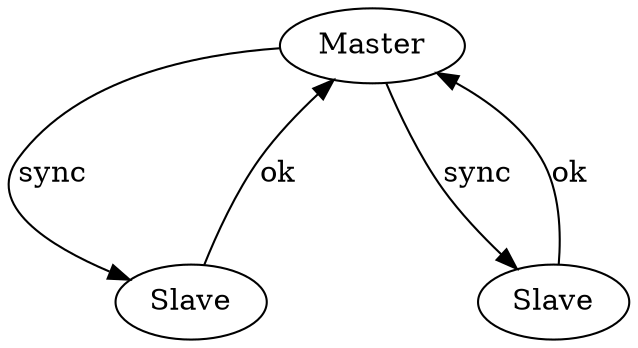

## Introduction

The only way to make a highly available system out of less available components is to use redundancy, so the system can work even when some of its parts are broken.
The simplest kind of redundancy is replication: make several copies or ‘replicas’ of each part.

Fault-tolerance on commodity hardware can be achieved through replication.
A common approach is to use a consensus algorithm to ensure that all replicas are mutually consistent.
By repeatedly applying such an algorithm on a sequence of input values, it is possible to build an identical log of values on each replica.
If the values are operations on some data structure, application of the same log on all replicas may be used to arrive at mutually consistent data structures on all replicas.
For instance, if the log contains a sequence of database operations, and if the same sequence of operations is applied to the (local) database on each replica,
eventually all replicas will end up with the same database content (provided that they all started with the same initial database state).

- Single Master
  - Synchronous Replication
  - Asynchronous Replication
  - Semi synchronous Replication
- Multi Master
- Leaderless

Conflict

Last Write Wins(LWW)

Conflict-Free Replicated Data Type

## Replicated State Machines

Redundancy is not enough; to be useful it must be coordinated.
The simplest way to do this is to make each non-faulty replica do the same thing.
Then any non-faulty replica can provide the outputs; if the replicas are not fail-stop, requiring the same output from f replicas will tolerate f – 1 faults.
More complicated kinds of redundancy (such as error-correcting codes) are cheaper, but they depend on special properties of the service being provided.

## Links

- [Distributed Systems](/docs/CS/Distributed/Distributed_Systems.md)
