## Introduction

用不可靠的组件构建高可用系统的唯一方法是使用冗余，这样即使某些部分损坏，系统也能工作。
最简单的冗余方式是复制：为每个部分制作多个副本或"副本"。

复制数据有几个原因：

- 使数据在地理上靠近用户（从而减少延迟）
- 允许系统在部分组件发生故障时继续工作（从而提高可用性）
- 扩展可以处理读取查询的机器数量（从而提高读取吞吐量）

如果要复制的数据不随时间变化，那么复制很简单：你只需要将数据复制到每个节点一次即可。
复制的所有困难在于处理对复制数据的变更。

我们将讨论三种流行的算法，用于在节点间复制变更：单领导者、[多领导者](/docs/CS/Distributed/Replica.md?id=Multi-Leader-Replication)
和[无领导者复制](/docs/CS/Distributed/Replica.md?id=leaderless-replication)。
几乎所有的分布式数据库都使用这三种方法之一。
有许多权衡需要考虑：例如，使用同步还是异步复制，以及如何处理故障副本。
这些通常是数据库中的可配置选项，尽管细节因数据库而异，但通用原理在许多不同实现中是相似的。

通过商用硬件可以实现容错。
一种常见的方法是使用共识算法来确保所有副本相互一致。
通过对一系列输入值重复应用这样的算法，可以在每个副本上构建相同的值日志。
如果这些值是对某种数据结构的操作，则在所有副本上应用相同的日志可用于在所有副本上达成相互一致的数据结构。
例如，如果日志包含一系列数据库操作，并且相同的操作序列应用于每个副本上的（本地）数据库，
最终所有副本将具有相同的数据库内容（前提是它们都从相同的初始数据库状态开始）。

## 领导者与跟随者

存储数据库副本的每个节点称为一个副本。有多个副本时，不可避免地会出现一个问题：如何确保所有数据最终都到达所有副本？

对数据库的每次写入都需要由每个副本处理；否则，副本将不再包含相同的数据。
最常见的解决方案称为基于领导者的复制（也称为主动/被动或主从复制），如图 1 所示。其工作原理如下：

1. 其中一个副本被指定为领导者（也称为主库或主节点）。
   当客户端想要写入数据库时，它们必须将请求发送给领导者，领导者首先将新数据写入其本地存储。
2. 其他副本称为跟随者（只读副本、从库、次要副本或热备份）。每当领导者将新数据写入其本地存储时，它也会将数据变更作为复制日志或变更流的一部分发送给所有跟随者。
   每个跟随者从领导者获取日志，并通过按照与领导者相同的顺序应用所有写入来相应地更新其本地数据库副本。
3. 当客户端想要从数据库读取时，它可以查询领导者或任何跟随者。然而，写入仅在领导者上接受（从客户端的角度来看，跟随者是只读的）。

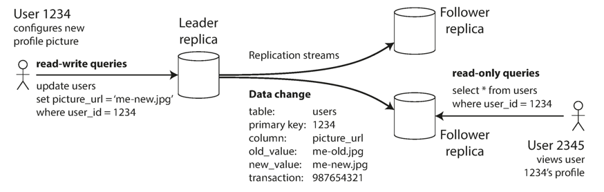

Fig.1. 基于领导者（主从）复制。

这种复制模式是许多关系数据库的内置功能，例如 PostgreSQL（自 9.0 版本起）、MySQL、Oracle Data Guard 和 SQL Server 的 AlwaysOn 可用性组。
它也用于一些非关系数据库，包括 MongoDB、RethinkDB 和 Espresso。
最后，基于领导者的复制不仅限于数据库：分布式消息代理（如 Kafka）和高可用队列 RabbitMQ 也使用它。
一些网络文件系统和复制块设备（如 DRBD）也类似。

### 同步复制与异步复制

复制系统的一个重要细节是复制是同步发生还是异步发生。
（在关系数据库中，这通常是一个可配置选项；其他系统通常硬编码为其中之一。）
想想图 1 中发生的情况：网站用户更新了他们的个人资料图片。
在某个时间点，客户端将更新请求发送给领导者；不久之后，领导者收到它。在某个时候，领导者将数据变更转发给跟随者。
最终，领导者通知客户端更新成功。

图 2 显示了系统各组件之间的通信：用户的客户端、领导者和两个跟随者。时间从左到右流动。
请求或响应消息显示为粗箭头。

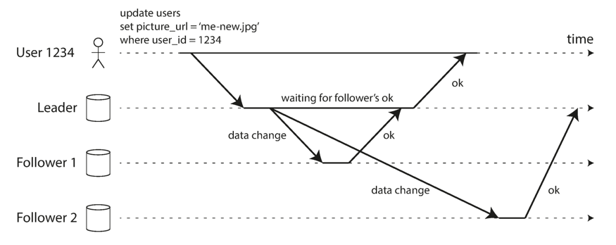

Fig.2. 具有一个同步和一个异步跟随者的基于领导者复制。

在图 2 的示例中，到跟随者 1 的复制是同步的：领导者等待跟随者 1 确认收到写入后，才向用户报告成功，并使写入对其他客户端可见。
到跟随者 2 的复制是异步的：领导者发送消息，但不等待跟随者的响应。

图表显示，跟随者 2 处理消息有明显的延迟。
通常，复制相当快：大多数数据库系统在不到一秒的时间内将变更应用到跟随者。
然而，无法保证需要多长时间。
在某些情况下，跟随者可能落后领导者数分钟或更长时间；例如，如果跟随者正在从故障中恢复，系统接近最大容量运行，或者节点之间存在网络问题。

同步复制的优势在于保证跟随者拥有与领导者一致的、最新的数据副本。
如果领导者突然故障，我们可以确信数据仍然在跟随者上可用。
缺点是如果同步跟随者没有响应（因为崩溃、网络故障或任何其他原因），写入无法处理。
领导者必须阻塞所有写入并等待同步副本再次可用。
因此，让所有跟随者都是同步的并不实际：任何一个节点故障都会导致整个系统停滞。
在实践中，如果在数据库上启用同步复制，通常意味着一个跟随者是同步的，其他是异步的。
如果同步跟随者变得不可用或缓慢，其中一个异步跟随者会变为同步。
这保证了至少在两个节点上拥有最新的数据副本：领导者和一个同步跟随者。这种配置有时也称为半同步。

通常，基于领导者的复制配置为完全异步。
在这种情况下，如果领导者发生故障且无法恢复，尚未复制到跟随者的任何写入都会丢失。这意味着即使已向客户端确认，写入也不能保证持久化。
然而，完全异步配置的优势在于，即使所有跟随者都落后了，领导者也可以继续处理写入。

削弱持久性听起来是个糟糕的权衡，但异步复制仍然被广泛使用，尤其是在有许多跟随者或它们地理分布的情况下。

有时，你需要设置新的跟随者——可能是为了增加副本数量，或替换故障节点。
如何确保新跟随者拥有领导者数据的准确副本？
简单地将数据文件从一个节点复制到另一个节点通常是不够的：客户端不断地写入数据库，数据始终在变化，因此标准的文件复制会在不同时间点看到数据库的不同部分。
结果可能毫无意义。
你可以通过锁定数据库（使其无法写入）来使磁盘上的文件保持一致，但这与我们高可用性的目标相悖。
幸运的是，设置跟随者通常可以在不停机的情况下完成。
从概念上讲，过程如下：

1. 在某个时间点获取领导者数据库的一致性快照——如果可能，无需锁定整个数据库。
   大多数数据库都有这个功能，因为备份也需要它。
   在某些情况下，需要第三方工具，如 MySQL 的 innobackupex。
2. 将快照复制到新的跟随者节点。
3. 跟随者连接到领导者并请求自快照以来发生的所有数据变更。
   这要求快照与领导者复制日志中的确切位置相关联。
   该位置有各种名称：例如，PostgreSQL 称之为日志序列号，MySQL 称之为 binlog 坐标。
4. 当跟随者处理完自快照以来的积压数据变更后，我们称它已赶上。
   它现在可以继续处理来自领导者的实时数据变更。

设置跟随者的实际步骤因数据库而异。
在某些系统中，该过程是完全自动化的，而在其他系统中，它可能是一个相当神秘的多步骤工作流，需要管理员手动执行。

### 处理节点宕机

系统中的任何节点都可能宕机，可能是由于故障意外发生，但也可能是计划内维护（例如，重启机器以安装内核安全补丁）。
能够在不宕机的情况下重启单个节点是运维和管理的巨大优势。
因此，我们的目标是使整个系统在个别节点故障的情况下继续运行，并将节点宕机的影响降到最低。
如何通过基于领导者的复制实现高可用性？

#### 跟随者故障：追赶恢复

每个跟随者在本地磁盘上维护一个从领导者接收的数据变更日志。
如果跟随者崩溃并重新启动，或者领导者和跟随者之间的网络暂时中断，跟随者可以很容易地恢复：从日志中，它知道故障发生前处理的最后一个事务。
因此，跟随者可以连接到领导者并请求在跟随者断开连接期间发生的所有数据变更。
当它应用了这些变更后，它就跟上了领导者，并且可以像以前一样继续接收数据变更流。

#### 领导者故障：故障转移

处理领导者故障比较棘手：需要将其中一个跟随者提升为新领导者，客户端需要重新配置以将写入发送到新领导者，其他跟随者需要开始从新领导者消费数据变更。
这个过程称为故障转移。
故障转移可以手动进行（管理员被告知领导者已故障并采取必要步骤创建新领导者）或自动进行。自动故障转移过程通常包括以下步骤：

1. 确定领导者已故障。可能出现问题的原因有很多：崩溃、断电、网络问题等。
   没有万无一失的方法来检测出了什么问题，因此大多数系统简单地使用超时：节点之间频繁地来回发送消息，如果某个节点在一段时间内没有响应，例如 30 秒，则假定它已死亡。
   （如果领导者是有意因计划内维护而下线，则不适用。）
2. 选择一个新的领导者。这可以通过选举过程（领导者由剩余副本的多数选出），或者新领导者可以由先前选举的控制节点指定。
   最佳领导者候选者通常是具有来自旧领导者的最新数据变更的副本（以最小化数据丢失）。
   让所有节点就新领导者达成一致是一个共识问题，详见第 9 章。
3. 重新配置系统以使用新领导者。客户端现在需要将写入请求发送到新领导者。
   如果旧领导者重新上线，它可能仍然认为自己是领导者，不知道其他副本已强制其下台。
   系统需要确保旧领导者成为跟随者并识别新领导者。

故障转移充满了可能出错的情况：

- 如果使用异步复制，新领导者可能尚未收到旧领导者在故障前的所有写入。
  如果在选择新领导者后前领导者重新加入集群，这些写入应该如何处理？
  同时，新领导者可能已收到冲突的写入。
  最常见的解决方案是简单地丢弃旧领导者未复制的写入，这可能违反客户端的持久性期望。
- 如果需要与数据库内容协调数据库外部的其他存储系统，丢弃写入尤其危险。
  例如，在一次 GitHub 事故中，一个过时的 MySQL 跟随者被提升为领导者。
  数据库使用自增计数器为新行分配主键，但由于新领导者的计数器落后于旧领导者，它重用了旧领导者先前分配的一些主键。
  这些主键也在 Redis 存储中使用，因此主键的重用导致 MySQL 和 Redis 之间不一致，导致一些私密数据被泄露给错误的用户。
- 在某些故障场景下，可能发生两个节点都认为自己是领导者的情况。
  这种情况称为脑裂，非常危险：如果两个领导者都接受写入，并且没有解决冲突的过程，数据很可能会丢失或损坏。
  作为安全措施，一些系统有机制在检测到两个领导者时关闭其中一个节点。
  然而，如果这个机制没有精心设计，可能会导致两个节点都被关闭。
- 在宣布领导者死亡之前，正确的超时时间是多少？较长的超时意味着在领导者故障的情况下恢复时间更长。
  然而，如果超时太短，可能会出现不必要的故障转移。
  例如，暂时的负载峰值可能导致节点响应时间超过超时，或网络故障可能导致数据包延迟。
  如果系统已经在应对高负载或网络问题，不必要的故障转移可能会使情况更糟，而不是更好。

这些问题没有简单的解决方案。
因此，一些运维团队更喜欢手动执行故障转移，即使软件支持自动故障转移。
这些问题——节点故障、不可靠的网络以及副本一致性、持久性、可用性和延迟之间的权衡——实际上是分布式系统中的基本问题。

## 复制日志

基于领导者的复制在底层是如何工作的？实践中使用了多种不同的复制方法，让我们逐一简要介绍。

### 基于语句的复制

在最简单的情况下，领导者记录它执行的每个写入请求（语句）并将该语句日志发送给其跟随者。
对于关系数据库，这意味着每个 INSERT、UPDATE 或 DELETE 语句都被转发给跟随者，每个跟随者解析并执行该 SQL 语句，就像它是从客户端接收到的一样。
虽然这听起来合理，但这种复制方法有各种可能失败的方式：

- 任何调用非确定性函数的语句，例如获取当前日期和时间的 NOW() 或获取随机数的 RAND()，在每个副本上可能生成不同的值。
- 如果语句使用了自增列，或依赖于数据库中的现有数据（例如 UPDATE … WHERE <some condition>），则必须在每个副本上以完全相同的顺序执行，否则可能产生不同的效果。
  当有多个并发执行的事务时，这可能有限制。
- 具有副作用的语句（例如触发器、存储过程、用户定义函数）可能导致每个副本上出现不同的副作用，除非副作用是绝对确定性的。

有可能解决这些问题——例如，领导者可以在记录语句时将任何非确定性函数调用替换为固定的返回值，以便所有跟随者获得相同的值。
然而，由于存在如此多的边界情况，现在通常更倾向于其他复制方法。
在 MySQL 5.1 版本之前使用基于语句的复制。
今天它有时仍被使用，因为它非常紧凑，但默认情况下，如果语句中存在任何非确定性，MySQL 现在会切换到基于行的复制。
VoltDB 使用基于语句的复制，并通过要求事务具有确定性来使其安全。

### 预写日志（WAL）传输

我们讨论了存储引擎如何在磁盘上表示数据，并发现通常每个写入都追加到日志中：

- 对于日志结构存储引擎，此日志是主要的存储位置。日志段在后台进行压缩和垃圾回收。
- 对于 B-tree（覆盖单个磁盘块），每次修改首先写入预写日志，以便索引在崩溃后可以恢复到一致状态。

无论哪种情况，日志都是包含对数据库所有写入的仅追加字节序列。
我们可以使用完全相同的日志在另一个节点上构建副本：领导者除了将日志写入磁盘外，还通过网络将其发送给跟随者。
当跟随者处理此日志时，它会构建与领导者上完全相同的数据结构副本。

这种复制方法用于 PostgreSQL 和 Oracle 等。
主要缺点是日志在非常低的级别描述数据：WAL 包含哪些字节在哪些磁盘块上被更改的详细信息。
这使得复制与存储引擎紧密耦合。
如果数据库从一个版本到另一个版本更改其存储格式，通常无法在领导者和跟随者上运行不同版本的数据库软件。
这似乎是一个实现细节，但它可能产生重大的操作影响。
如果复制协议允许跟随者使用比领导者更新的软件版本，你可以先升级跟随者，然后执行故障转移使升级后的节点成为新领导者，从而实现数据库软件的无宕机升级。
如果复制协议不允许这种版本不匹配（如 WAL 传输通常的情况），此类升级需要停机。

### 逻辑日志（基于行）复制

另一种方法是使用不同的日志格式进行复制和存储引擎，这允许复制日志与存储引擎内部解耦。
这种复制日志称为*逻辑日志*，以区别于存储引擎的（物理）数据表示。
关系数据库的逻辑日志通常是以行粒度描述对数据库表写入的记录序列：

- 对于插入的行，日志包含所有列的新值。
- 对于删除的行，日志包含足够的信息来唯一标识被删除的行。
  通常这会是主键，但如果表上没有主键，则需要记录所有列的旧值。
- 对于更新的行，日志包含足够的信息来唯一标识被更新的行，以及所有列的新值（或至少所有已更改列的新值）。

修改多行的事务会生成多个这样的日志记录，后跟一个指示事务已提交的记录。
MySQL 的 binlog（当配置为使用基于行的复制时）使用这种方法。
由于逻辑日志与存储引擎内部解耦，它可以更容易地保持向后兼容，允许领导者和跟随者运行不同版本的数据库软件，甚至不同的存储引擎。
逻辑日志格式也更容易被外部应用程序解析。
如果你想将数据库内容发送到外部系统（例如用于离线分析的数据仓库，或用于构建自定义索引和缓存），这一点很有用。
这种技术称为*变更数据捕获*。

### 基于触发器的复制

到目前为止描述的复制方法由数据库系统实现，不涉及任何应用程序代码。
在许多情况下，这正是你需要的——但在某些情况下需要更多的灵活性。
例如，如果你只想复制数据的子集，或想从一种数据库复制到另一种数据库，或需要冲突解决逻辑，那么可能需要将复制提升到应用层。

一些工具，如 Oracle GoldenGate，可以通过读取数据库日志使数据变更对应用程序可用。
另一种方法是使用许多关系数据库中可用的功能：触发器和存储过程。
触发器允许你注册自定义应用程序代码，当数据库系统中发生数据变更（写入事务）时自动执行。
触发器可以将此变更记录到单独的表中，外部进程可以从中读取。
然后，该外部进程可以应用任何必要的应用程序逻辑，并将数据变更复制到另一个系统。
例如，Oracle 的 Databus 和 Postgres 的 Bucardo 就是这样工作的。
基于触发器的复制通常比其他复制方法有更大的开销，并且比数据库内置复制更容易出现错误和限制。
然而，由于其灵活性，它仍然很有用。

## 复制滞后

能够容忍节点故障只是想要复制的一个原因。
正如第二部分引言中提到的，其他原因包括可扩展性（处理比单台机器能处理的更多的请求）和延迟（将副本地理上放置得更靠近用户）。
基于领导者的复制要求所有写入通过单个节点，但只读查询可以发送到任何副本。
对于主要由读取和少量写入组成的工作负载（这是 Web 上的常见模式），有一个有吸引力的选择：创建许多跟随者，并将读取请求分布在这些跟随者上。
这减轻了领导者的负载，并允许附近的副本提供读取服务。
在这种读取扩展架构中，你可以简单地通过增加更多跟随者来提高只读请求的服务能力。
然而，这种方法仅在异步复制的情况下实际可行——如果你试图同步复制到所有跟随者，单个节点故障或网络中断将使整个系统无法写入。
节点越多，某个节点宕机的可能性就越大，因此完全同步的配置会非常不可靠。

不幸的是，如果应用程序从异步跟随者读取，如果跟随者落后，它可能看到过时的信息。
这导致数据库中出现明显的不一致：如果你同时在领导者和跟随者上运行相同的查询，可能会得到不同的结果，因为并非所有写入都已反映在跟随者中。
这种不一致只是暂时的——如果你停止写入数据库并等待一段时间，跟随者最终会赶上并与领导者保持一致。
因此，这种效果称为*最终一致性*。

"最终"一词故意模糊：一般来说，副本可以落后多远没有限制。
在正常操作中，领导者的写入与跟随者上反映之间的延迟——*复制滞后*——可能只有几分之一秒，在实践中不易察觉。
然而，如果系统接近容量运行或网络出现问题，滞后可能很容易增加到几秒甚至几分钟。

当滞后如此之大时，它引入的不一致不仅是理论问题，也是应用程序的实际问题。
在本节中，我们将重点介绍复制滞后可能发生的三个问题示例，并概述解决这些问题的一些方法。

### 读后写

许多应用程序允许用户提交一些数据，然后查看他们提交的内容。
这可能是客户数据库中的记录，或讨论线程中的评论，或其他类似内容。
当新数据提交时，必须发送给领导者，但当用户查看数据时，可以从跟随者读取。
如果数据经常被查看但只是偶尔写入，这尤其合适。
使用异步复制时，存在一个问题，如图 3 所示：如果用户在写入后不久查看数据，新数据可能尚未到达副本。
对用户来说，看起来他们提交的数据丢失了，因此他们理所当然会不高兴。

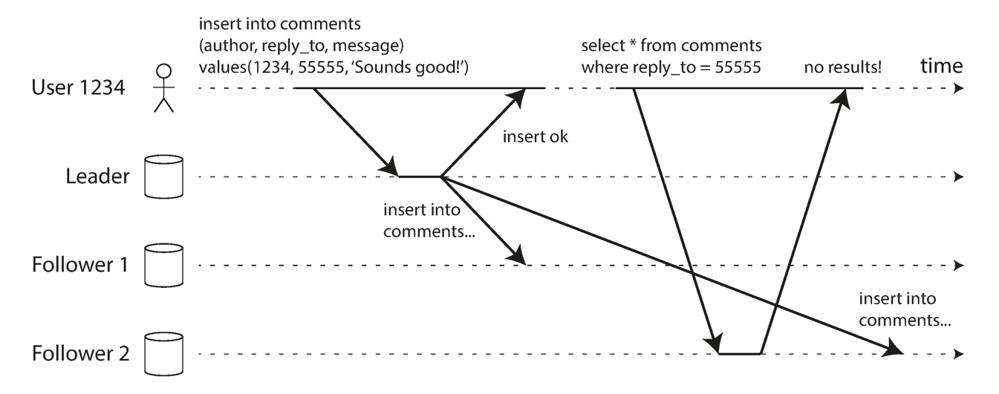

Fig.3. 用户进行写入，然后从过时的副本读取。为防止这种异常，我们需要读后写一致性。

在这种情况下，我们需要*读后写一致性*，也称为*读写一致性*。
这保证如果用户重新加载页面，他们将始终看到自己提交的任何更新。
它不对其他用户做出任何承诺：其他用户的更新可能在稍后某个时间才可见。
然而，它向用户保证他们自己的输入已正确保存。

如何在基于领导者的复制系统中实现读后写一致性：

- 当读取用户可能已修改的内容时，从领导者读取；否则，从跟随者读取。
  这需要你有某种方法来知道某些内容是否可能已被修改，而无需实际查询它。
  例如，社交网络上的用户个人资料信息通常只由个人资料所有者编辑，而不是其他人。
  因此，一个简单的规则是：始终从领导者读取用户自己的个人资料，从跟随者读取其他用户的个人资料。
- 如果应用程序中的大多数内容都可能被用户编辑，那么这种方法将无效，因为大多数内容都必须从领导者读取（抵消了读取扩展的好处）。
  在这种情况下，可以使用其他标准来决定是否从领导者读取。
  例如，你可以跟踪上次更新时间，并在上次更新后的一分钟内，所有读取都从领导者进行。
  你也可以监控跟随者上的复制滞后，并阻止对落后于领导者超过一分钟的跟随者的查询。
- 客户端可以记住其最近写入的时间戳——然后系统可以确保为该用户提供读取服务的副本至少反映了该时间戳的更新。
  如果副本不够新，可以由另一个副本处理该读取，或查询等待直到副本赶上。
  时间戳可以是逻辑时间戳（指示写入顺序的东西，如日志序列号）或实际系统时钟（此时时钟同步变得至关重要）。
- 如果你的副本分布在多个数据中心（为了地理接近用户或可用性），还有额外的复杂性。
  任何需要由领导者服务的请求都必须路由到包含领导者的数据中心。

另一个复杂情况出现在同一用户从多个设备访问你的服务时，例如桌面 Web 浏览器和移动应用程序。
在这种情况下，你可能希望提供跨设备的读后写一致性：如果用户在一个设备上输入了一些信息，然后在另一个设备上查看，他们应该看到刚刚输入的信息。
在这种情况下，还有一些额外的问题需要考虑：

- 需要记住用户上次更新时间戳的方法变得更加困难，因为一个设备上运行的代码不知道另一设备上发生了哪些更新。
  这个元数据需要集中化。
- 如果你的副本分布在不同的数据中心，无法保证来自不同设备的连接将路由到同一数据中心。
  （例如，如果用户的台式计算机使用家庭宽带连接，而他们的移动设备使用蜂窝数据网络，设备的网络路由可能完全不同。）
  如果你的方法需要从领导者读取，你可能首先需要将所有用户设备的请求路由到同一个数据中心。

### 单调读取

从异步跟随者读取时可能发生的第二个异常示例是用户可能看到时间*倒退*。
如果用户从不同的副本进行多次读取，就可能发生这种情况。
例如，图 4 显示用户 2345 进行了两次相同的查询，第一次到一个滞后较小的跟随者，第二次到一个滞后较大的跟随者。
（如果用户刷新网页并且每个请求路由到随机服务器，这种情况很可能发生。）
第一次查询返回用户 1234 最近添加的评论，但第二次查询不返回任何内容，因为滞后的跟随者尚未接收到该写入。
实际上，第二次查询观察到系统处于比第一次查询更早的时间点。
如果第一次查询没有返回任何内容，这还不算太糟，因为用户 2345 可能不知道用户 1234 最近添加了评论。
然而，对于用户 2345 来说，如果他们先看到用户 1234 的评论出现，然后又看到它消失，这非常令人困惑。

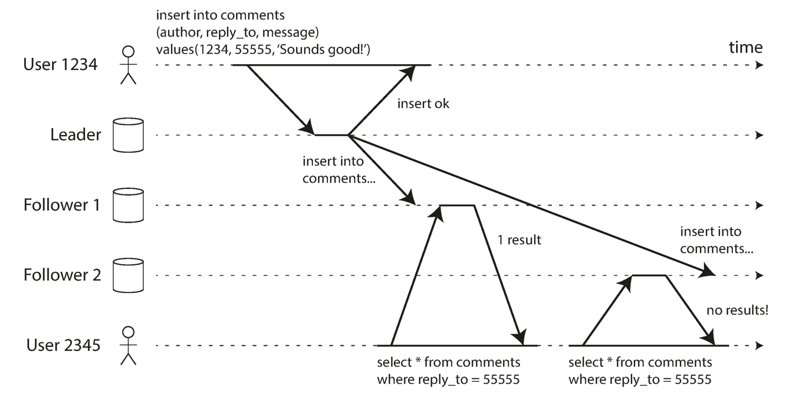

Fig.4. 用户先从最新副本读取，然后从过时副本读取。时间似乎倒退了。为防止这种异常，我们需要单调读取。

*单调读取*是保证这种异常不会发生的保证。
这是一个比*强一致性*更弱的保证，但比*最终一致性*更强。
当你读取数据时，可能看到一个旧值；单调读取仅意味着如果某个用户顺序进行多次读取，他们不会看到时间倒退，即他们不会在之前读取了新数据后又读取到更旧的数据。
实现单调读取的一种方法是确保每个用户始终从同一个副本进行读取（不同用户可以从不同副本读取）。
例如，可以基于用户 ID 的哈希值选择副本，而不是随机选择。
然而，如果该副本故障，用户的查询需要重新路由到另一个副本。

### 一致前缀读取

复制滞后异常的第三个示例涉及因果关系的违反。
想象一下普恩斯先生和凯克夫人之间的以下简短对话：

> Mr. Poons
> How far into the future can you see, Mrs. Cake?
>
> Mrs. Cake
> About ten seconds usually, Mr. Poons

这两句话之间存在因果依赖关系：凯克夫人听到了普恩斯先生的问题并回答了它。
现在，想象有第三个人通过跟随者收听这段对话。
凯克夫人的话经过一个滞后较小的跟随者，但普恩斯先生的话有较长的复制滞后（见图 5）。
这位观察者将听到以下内容：

> Mrs. Cake
> About ten seconds usually, Mr. Poons.
>
> Mr. Poons
> How far into the future can you see, Mrs. Cake?

对观察者来说，看起来凯克夫人在普恩斯先生提问之前就回答了问题。
这种超能力令人印象深刻，但非常令人困惑。

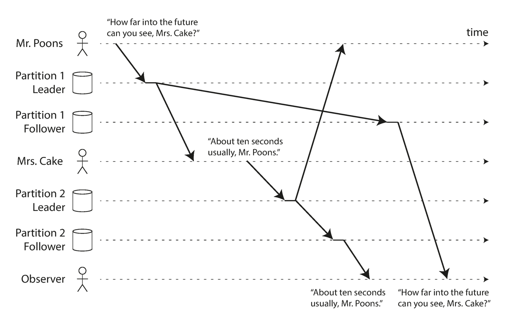

Fig.5. 如果某些分区复制速度较慢，观察者可能在看到问题之前就看到答案。

防止这种异常需要另一种保证：一致前缀读取。
这个保证说，如果一系列写入以某种顺序发生，那么任何读取这些写入的人都会看到它们以相同的顺序出现。

如果数据库总是以相同的顺序应用写入，读取总是看到一致的前缀，因此这种异常不可能发生。
然而，在许多分布式数据库中，不同的分区独立运行，因此不存在写入的全局顺序：当用户从数据库读取时，他们可能看到数据库的某些部分处于较旧的状态，而其他部分处于较新的状态。
一种解决方案是确保任何因果相关的写入都写入同一个分区——但在某些应用中，这无法高效完成。

### 复制滞后的解决方案

当使用最终一致性系统时，值得考虑如果复制滞后增加到几分钟甚至几小时，应用程序的行为会如何。
如果答案是"没问题"，那很好。
然而，如果结果是对用户的不良体验，重要的是设计系统以提供更强的保证，例如读后写。
假装复制是同步的而实际上是异步的，是未来问题的根源。

如前所述，应用程序可以通过某些方法提供比底层数据库更强的保证——例如，在领导者上执行某些类型的读取。
然而，在应用程序代码中处理这些问题很复杂且容易出错。
如果应用程序开发人员不必担心微妙的复制问题，而可以信任他们的数据库"做正确的事"，那就更好了。
这就是事务存在的原因：它们是数据库提供更强保证以使应用程序更简单的一种方式。
单节点事务已经存在了很长时间。
然而，在向分布式（复制和分区）数据库的迁移中，许多系统放弃了它们，声称事务在性能和可用性方面过于昂贵，并断言最终一致性在可扩展系统中是不可避免的。
这种说法有一定道理，但过于简单化，我们将在本书的其余部分进行更细致的讨论。

## 多领导者复制

到目前为止，在本章中我们只考虑了使用单个领导者的复制架构。
虽然这是一种常见的方法，但也有有趣的替代方案。
基于领导者的复制有一个主要缺点：只有一个领导者，所有写入都必须经过它。
如果你因任何原因无法连接到领导者，例如由于你和领导者之间的网络中断，你就无法写入数据库。

基于领导者复制模型的一个自然扩展是允许多个节点接受写入。
复制仍然以相同的方式进行：处理写入的每个节点必须将数据变更转发到所有其他节点。
我们称之为*多领导者配置*（也称为主主或主动/主动复制）。
在这种设置中，每个领导者同时充当其他领导者的跟随者。

在单个数据中心内使用多领导者设置通常没有意义，因为好处很少超过增加的复杂性。
然而，在某些情况下，这种配置是合理的。

想象你有一个数据库，其副本分布在多个不同的数据中心（也许是为了容忍整个数据中心的故障，或者是为了更靠近你的用户）。
使用正常的基于领导者的复制设置，领导者必须位于其中一个数据中心，并且所有写入都必须经过该数据中心。
在多领导者配置中，你可以在每个数据中心拥有一个领导者。
图 6 显示了这种架构可能的样子。
在每个数据中心内，使用常规的主从复制；在数据中心之间，每个数据中心的领导者将其变更复制到其他数据中心的领导者。

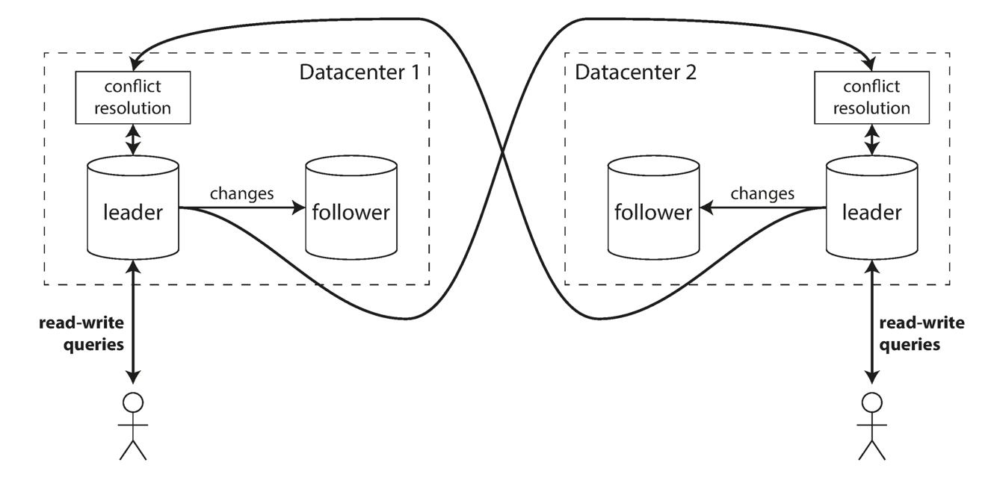

Fig.6. 跨多个数据中心的多领导者复制。

让我们比较单领导者和多领导者配置在多数据中心部署中的表现：

- **性能**
  在单领导者配置中，每次写入必须通过互联网到达具有领导者的数据中心。
  这可能会给写入增加显著的延迟，并且可能违背了拥有多个数据中心的初衷。
  在多领导者配置中，每次写入可以在本地数据中心处理，并异步复制到其他数据中心。
  因此，数据中心间的网络延迟对用户是隐藏的，这意味着感知性能可能更好。
- **容忍数据中心宕机**
  在单领导者配置中，如果具有领导者的数据中心发生故障，故障转移可以提升另一个数据中心中的跟随者为领导者。
  在多领导者配置中，每个数据中心可以独立于其他数据中心继续运行，当故障数据中心重新上线时，复制会赶上来。
- **容忍网络问题**
  数据中心之间的流量通常通过公共互联网，这可能不如数据中心内的本地网络可靠。
  单领导者配置对此数据中心间链路的问题非常敏感，因为写入是通过此链路同步进行的。
  具有异步复制的多领导者配置通常可以更好地容忍网络问题：暂时的网络中断不会阻止写入处理。

一些数据库默认支持多领导者配置，但通常也可以通过外部工具实现，如 MySQL 的 Tungsten Replicator、PostgreSQL 的 BDR 和 Oracle 的 GoldenGate。
尽管多领导者复制有优势，但也有一个很大的缺点：相同的数据可能同时在两个不同的数据中心被修改，这些写入冲突必须解决。

由于多领导者复制在许多数据库中是一个稍后添加的功能，通常存在微妙的配置陷阱和与其他数据库功能令人惊讶的交互。
例如，自增键、触发器和完整性约束可能成为问题。
因此，多领导者复制通常被认为是危险领域，应尽可能避免。

### 客户端离线操作

多领导者复制适用的另一种情况是，当你有一个需要在断开互联网连接时继续工作的应用程序。
例如，考虑你手机、笔记本电脑和其他设备上的日历应用。
无论你的设备当前是否有互联网连接，你都需要能够查看会议（发出读取请求）和输入新会议（发出写入请求）。
如果你在离线时进行了任何更改，当设备下一次在线时，需要与服务器和其他设备同步。

在这种情况下，每个设备都有一个充当领导者的本地数据库（它接受写入请求），并且你所有设备上的日历副本之间存在异步多领导者复制过程（同步）。
复制滞后可能是几小时甚至几天，具体取决于你何时有互联网访问。
从架构的角度来看，这种设置本质上与数据中心之间的多领导者复制相同，只是更极端：每个设备是一个"数据中心"，它们之间的网络连接极不可靠。
从丰富的日历同步实现失败历史可以看出，多领导者复制是一个难以正确实现的东西。
有一些工具旨在使这种多领导者配置更容易。
例如，CouchDB 就是为此操作模式设计的。

### 处理写入冲突

多领导者复制最大的问题是可能发生写入冲突，这意味着需要冲突解决。
例如，考虑一个同时被两个用户编辑的 Wiki 页面，如图 7 所示。
用户 1 将页面标题从 A 改为 B，用户 2 同时将标题从 A 改为 C。
每个用户的更改都成功应用于其本地领导者。
然而，当变更异步复制时，检测到冲突。
这个问题在单领导者数据库中不存在。

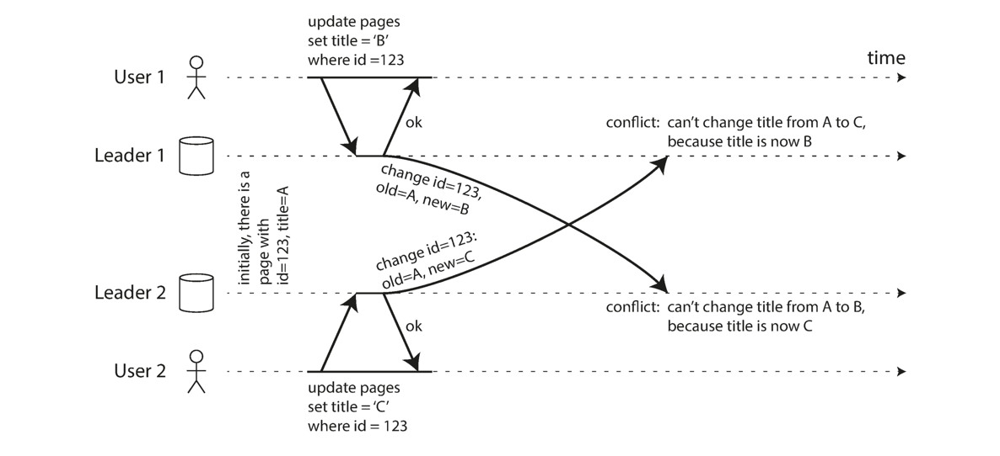

Fig.7. 两个领导者同时更新同一条记录导致的写入冲突。

同步与异步冲突检测

在单领导者数据库中，第二个写入者将阻塞并等待第一次写入完成，或中止第二个写入事务，迫使用户重试写入。
另一方面，在多领导者设置中，两次写入都成功，冲突仅在稍后的某个时间点被异步检测到。
此时，要求用户解决冲突可能太晚了。
原则上，你可以使冲突检测同步——即等待写入复制到所有副本后再告诉用户写入成功。
然而，这样做将失去多领导者复制的主要优势：允许每个副本独立接受写入。
如果你想要同步冲突检测，不如直接使用单领导者复制。

#### 冲突避免

处理冲突的最简单策略是避免它们：如果应用程序可以确保特定记录的所有写入都通过同一个领导者，那么冲突就不会发生。
由于许多多领导者复制的实现处理冲突的能力很差，避免冲突是经常推荐的策略。

例如，在用户可以编辑自己数据的应用程序中，你可以确保特定用户的请求始终路由到同一个数据中心，并使用该数据中心的领导者进行读写。
不同的用户可能有不同的"主"数据中心（可能根据地理接近度选择），但从任何一个用户的角度来看，配置基本上是单领导者。

然而，有时你可能想要更改记录的指定领导者——可能是因为一个数据中心发生故障，需要将流量重新路由到另一个数据中心，或者因为用户已移动到不同位置，现在更接近另一个数据中心。
在这种情况下，冲突避免就不再有效，你必须处理不同领导者上并发写入的可能性。

#### 趋向一致状态

单领导者数据库以顺序方式应用写入：如果同一字段有多个更新，最后一次写入决定该字段的最终值。
在多领导者配置中，没有定义的写入顺序，因此不清楚最终值应该是什么。在图 7 中，在领导者 1 上标题先更新为 B 然后为 C；在领导者 2 上先更新为 C 然后为 B。
没有哪种顺序比另一种"更正确"。

如果每个副本简单地按照看到写入的顺序应用写入，数据库将处于不一致状态：最终值在领导者 1 上是 C，在领导者 2 上是 B。
这是不可接受的——每个复制方案必须确保所有副本中的数据最终相同。
因此，数据库必须以收敛的方式解决冲突，这意味着所有副本必须在所有变更被复制后达到相同的最终值。
有多种实现收敛冲突解决的方法：

- 为每个写入赋予唯一 ID（例如时间戳、长随机数、UUID 或键和值的哈希），选择最高 ID 的写入作为胜者，丢弃其他写入。
  如果使用时间戳，这种技术称为最后写入者获胜。虽然这种方法很流行，但它很容易导致数据丢失。
- 为每个副本赋予唯一 ID，让来自编号更高副本的写入始终优先于编号更低副本的写入。这种方法也意味着数据丢失。
- 以某种方式合并值——例如，按字母顺序排序然后连接起来（在图 7 中，合并后的标题可能是类似"B/C"的东西）。
- 在明确的数据结构中记录冲突，保留所有信息，并编写应用程序代码在稍后时间解决冲突（可能通过提示用户）。

#### 自定义冲突解决逻辑

由于解决冲突最合适的方式可能取决于应用程序，大多数多领导者复制工具允许你使用应用程序代码编写冲突解决逻辑。
该代码可以在写入或读取时执行：

- **写入时**
  一旦数据库系统在复制变更日志中检测到冲突，就调用冲突处理程序。
  例如，Bucardo 允许你为此目的编写一段 Perl 代码。
  此处理程序通常不能提示用户——它在后台进程中运行，必须快速执行。
- **读取时**
  当检测到冲突时，所有冲突的写入都被存储。
  下次读取数据时，这些多个版本的数据返回给应用程序。
  应用程序可能提示用户或自动解决冲突，并将结果写回数据库。例如，CouchDB 就是这样工作的。

注意，冲突解决通常适用于单个行或文档的级别，而不是整个事务。
因此，如果你有一个原子地执行多个不同写入的事务，每个写入在冲突解决方面仍被单独考虑。

> 自动冲突解决
>
> 冲突解决规则可能很快变得复杂，自定义代码可能容易出错。
> Amazon 是一个经常被引用的由于冲突解决处理程序导致意外效果的例子：有一段时间，购物车上的冲突解决逻辑会保留添加到购物车的商品，但不会保留从购物车中移除的商品。
> 因此，客户有时会看到以前被移除的商品重新出现在购物车中。
> 有一些关于自动解决并发数据修改引起的冲突的有趣研究。几个研究方向值得一提：
>
> - 无冲突复制数据类型是一组用于集合、映射、有序列表、计数器等的数据结构，可以由多个用户同时编辑，并以合理的方式自动解决冲突。
>   一些 CRDT 已在 Riak 2.0 中实现。
> - 可合并持久数据结构显式跟踪历史，类似于 Git 版本控制系统，并使用三路合并函数（而 CRDT 使用两路合并）。
> - 操作转换是协作式编辑应用程序（如 Etherpad 和 Google Docs）背后的冲突解决算法。
>   它专为并发编辑有序列表（如构成文本文档的字符列表）而设计。
>   这些算法在数据库中的实现仍然年轻，但它们很可能在未来被集成到更多的复制数据系统中。
>   自动冲突解决可以使多领导者数据同步对应用程序来说更简单。

有些冲突是显而易见的。
在图 7 的示例中，两个写入同时修改了同一条记录中的同一字段，将其设置为两个不同的值。
这毫无疑问是一个冲突。
其他类型的冲突可能更微妙。
例如，考虑一个会议室预订系统：它跟踪哪个房间在什么时间被哪组人预订。
这个应用程序需要确保每个房间在任何时间只能被一组人预订（即同一房间不能有重叠的预订）。
在这种情况下，如果为同一房间同时创建了两个不同的预订，就可能发生冲突。
即使应用程序在允许用户预订之前检查了可用性，如果两个预订是在两个不同的领导者上进行的，也可能发生冲突。

没有快速的现成答案，但在接下来的章节中，我们将追踪一条通向深入理解此问题的道路。
我们将在第 7 章中看到更多冲突示例，并在第 12 章中讨论在复制系统中检测和解决冲突的可扩展方法。

### 多领导者复制拓扑

复制拓扑描述了写入从一个节点传播到另一个节点的通信路径。
如果你有两个领导者，如图 7 所示，只有一种可能的拓扑：领导者 1 必须将其所有写入发送给领导者 2，反之亦然。
如果有两个以上的领导者，则可能使用各种不同的拓扑。
一些示例如图 8 所示。

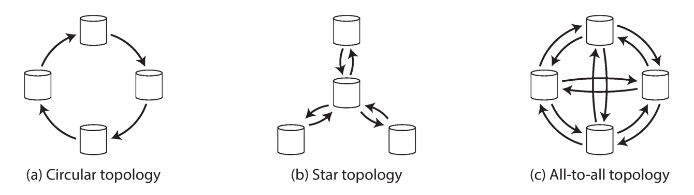

Fig.8. 多领导者复制可以设置的三种示例拓扑。

最通用的拓扑是全联通，其中每个领导者将其写入发送给所有其他领导者。
然而，也使用更受限的拓扑：例如，MySQL 默认只支持环形拓扑，其中每个节点从一个节点接收写入并将这些写入（加上它自己的写入）转发给另一个节点。
另一种流行的拓扑是星形拓扑：一个指定的根节点将写入转发给所有其他节点。
星形拓扑可以推广到树形拓扑。
在环形和星形拓扑中，写入可能需要经过多个节点才能到达所有副本。
因此，节点需要转发从其他节点接收的数据变更。
为了防止无限复制循环，每个节点被赋予一个唯一标识符，在复制日志中，每个写入被标记为它已通过的所有节点的标识符。
当节点收到标记有自己标识符的数据变更时，该数据变更被忽略，因为节点知道它已经被处理。

环形和星形拓扑的一个问题是，如果有一个节点故障，它可能中断其他节点之间的复制消息流，导致它们无法通信，直到该节点被修复。
可以重新配置拓扑以绕过故障节点，但在大多数部署中，这种重新配置必须手动完成。
更密集连接的拓扑（如全联通）的容错性更好，因为它允许消息沿不同路径传输，避免了单点故障。
另一方面，全联通拓扑也可能有问题。
特别是，某些网络链路可能比其他链路更快（例如由于网络拥塞），导致某些复制消息可能"超过"其他消息，如图 9 所示。

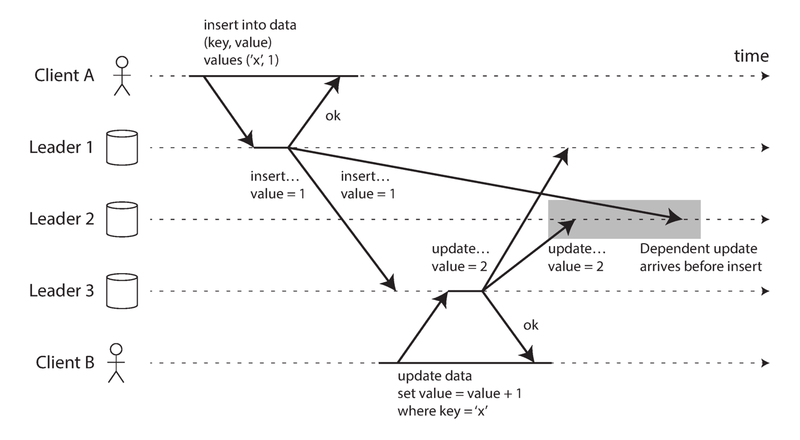

Fig.9. 使用多领导者复制，写入可能以错误顺序到达某些副本。

在图 9 中，客户端 A 在领导者 1 上向表中插入一行，客户端 B 在领导者 3 上更新该行。
然而，领导者 2 可能以不同顺序接收写入：它可能先收到更新（从其角度来看，这是对数据库中不存在的行的更新），然后才收到相应的插入（应该在更新之前）。

这是一个因果关系问题，类似于我们在"一致前缀读取"中看到的问题：更新依赖于先前的插入，因此我们需要确保所有节点先处理插入，然后处理更新。
仅仅给每个写入附加时间戳是不够的，因为不能信任时钟足够同步以正确排序领导者 2 上的这些事件。

为了正确排序这些事件，可以使用一种称为版本向量的技术。
然而，冲突检测技术在许多多领导者复制系统中实现得很差。
例如，在撰写本文时，PostgreSQL BDR 不提供写入的因果排序，而 MySQL 的 Tungsten Replicator 甚至不尝试检测冲突。

如果你正在使用具有多领导者复制的系统，值得注意这些问题，仔细阅读文档，并彻底测试你的数据库，以确保它确实提供了你相信它拥有的保证。

## 无领导者复制

本章中迄今为止讨论的复制方法（单领导者和多领导者复制）基于这样的理念：客户端将写入请求发送到一个节点（领导者），数据库系统负责将该写入复制到其他副本。
领导者确定写入应被处理的顺序，跟随者以相同顺序应用领导者的写入。

一些数据存储系统采用不同的方法，放弃领导者的概念，允许任何副本直接接受来自客户端的写入。
一些最早的复制数据系统是无领导者的，但这个想法在关系数据库主导的时代基本上被遗忘了。
在 Amazon 为其内部 Dynamo 系统使用后，它再次成为数据库的流行架构。Riak、Cassandra 和 Voldemort 是受 Dynamo 启发的具有无领导者复制模型的开源数据存储，因此这类数据库也称为 Dynamo 风格。

在一些无领导者实现中，客户端直接将写入发送到多个副本，而在其他实现中，协调节点代表客户端执行此操作。
然而，与领导者数据库不同，该协调者不强制写入的特定顺序。
正如我们将看到的，这种设计差异对数据库的使用方式有深远的影响。

### 当节点宕机时写入数据库

想象你有一个具有三个副本的数据库，其中一个副本当前不可用——可能是正在重启以安装系统更新。
在基于领导者的配置中，如果你想继续处理写入，可能需要执行故障转移。

另一方面，在无领导者配置中，不存在故障转移。
图 10 显示了发生了什么：客户端（用户 1234）将写入并行发送到所有三个副本，两个可用副本接受写入，但不可用副本错过了它。
假设三分之二的副本确认写入就足够了：在用户 1234 收到两个 ok 响应后，我们认为写入成功。
客户端简单地忽略一个副本错过了写入的事实。

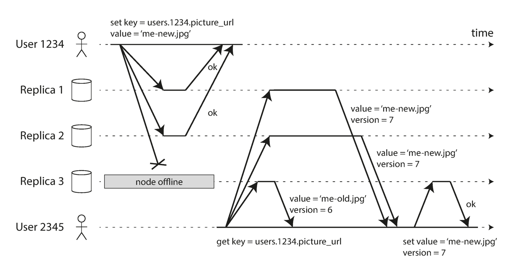

Fig.10. 节点故障后的仲裁写入、仲裁读取和读取修复。

现在想象不可用节点重新上线，客户端开始从它读取。
该节点宕机期间发生的任何写入都缺失了。
因此，如果你从该节点读取，可能会得到过时的值。

为了解决这个问题，当客户端从数据库读取时，它不只是将请求发送到一个副本：读取请求也并行发送到多个节点。
客户端可能从不同节点得到不同的响应；即从一个节点得到最新值，从另一个节点得到过时值。版本号用于确定哪个值更新。

读取修复和反熵

复制方案应确保最终所有数据都复制到每个副本。
在不可用节点重新上线后，它如何赶上它错过的写入？

Dynamo 风格的数据存储通常使用两种机制：

- **读取修复**
  当客户端并行从多个节点读取时，它可以检测到任何过时的响应。
  例如，在图 10 中，用户 2345 从副本 3 得到版本 6 的值，从副本 1 和 2 得到版本 7 的值。
  客户端看到副本 3 有过时的值，并将较新的值写回该副本。
  这种方法适用于经常读取的值。
- **反熵过程**
  此外，一些数据存储具有后台进程，不断在副本之间查找数据差异，并将缺失的数据从一个副本复制到另一个副本。
  与基于领导者复制中的复制日志不同，此反熵过程不以任何特定顺序复制写入，并且在数据复制之前可能有显著的延迟。

并非所有系统都实现这两种机制；例如，Voldemort 目前没有反熵过程。
注意，如果没有反熵过程，很少被读取的值可能在某些副本上缺失，从而降低持久性，因为读取修复仅在应用程序读取值时执行。

读取和写入的仲裁

在图 10 的示例中，尽管写入仅在三个副本中的两个上处理，我们仍认为写入成功。
如果只有三个副本中的一个接受了写入呢？我们可以做到什么程度？

如果我们知道每次成功的写入保证在至少三分之二的副本上存在，这意味着最多一个副本可以是过时的。
因此，如果我们至少从两个副本读取，我们可以确定至少有一个副本是最新的。
如果第三个副本宕机或响应缓慢，读取仍然可以继续返回最新值。

更一般地说，如果有 n 个副本，每次写入必须被 w 个节点确认才算成功，并且每次读取我们必须查询至少 r 个节点。（在我们的示例中，n = 3，w = 2，r = 2。）
只要 w + r > n，我们期望在读取时得到最新值，因为我们读取的 r 个节点中至少有一个必须是最新的。
遵循这些 r 和 w 值的读取和写入称为仲裁读取和写入。
你可以将 r 和 w 视为读或写有效所需的最小票数。

在 Dynamo 风格数据库中，参数 n、w 和 r 通常是可配置的。
常见的选择是使 n 为奇数（通常为 3 或 5），并设置 w = r = (n + 1) / 2（向上取整）。
然而，你可以根据需要调整数字。
例如，写入少读取多的工作负载可能受益于设置 w = n 和 r = 1。
这使得读取更快，但缺点是一个节点故障就导致所有数据库写入失败。

> 集群中可能有多于 n 个节点，但任何给定值仅存储在 n 个节点上。这允许数据集被分区，支持大于单个节点可容纳的数据集。

仲裁条件 w + r > n 允许系统容忍不可用节点如下：

- 如果 w < n，即使某个节点不可用，我们仍可以处理写入。
- 如果 r < n，即使某个节点不可用，我们仍可以处理读取。
- 使用 n = 3、w = 2、r = 2，我们可以容忍一个节点不可用。
- 使用 n = 5、w = 3、r = 3，我们可以容忍两个节点不可用。这种情况如图 11 所示。
- 通常，读取和写入始终并行发送到所有 n 个副本。
  参数 w 和 r 确定我们等待多少个节点——即，在我们认为读取或写入成功之前，需要 n 个节点中有多少个报告成功。

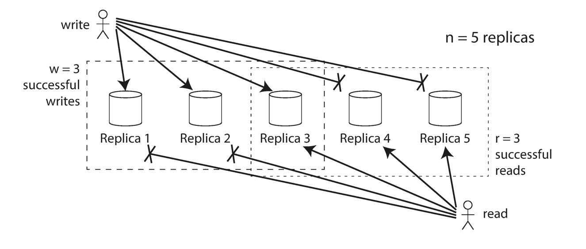

Fig.11. 如果 w + r > n，你读取的 r 个副本中至少有一个一定看到了最近成功的写入。

如果少于所需的 w 或 r 个节点可用，写入或读取返回错误。
节点可能因多种原因不可用：节点宕机（崩溃、断电）、执行操作时出错（由于磁盘已满无法写入）、客户端与节点之间的网络中断，或许多其他原因。
我们只关心节点是否返回了成功的响应，不需要区分不同的故障类型。

### 仲裁一致性的局限性

如果你有 n 个副本，并选择 w 和 r 使得 w + r > n，通常可以期望每次读取都返回某个键的最新写入值。
这是因为你写入的节点集和你读取的节点集必须重叠。
也就是说，在你读取的节点中，必须至少有一个节点具有最新值（如图 11 所示）。
通常，选择 r 和 w 为多数（超过 n/2）节点，因为这确保 w + r > n，同时仍能容忍最多 n/2 个节点故障。
但仲裁不一定是多数——重要的是读取和写入操作使用的节点集在至少一个节点上重叠。
其他仲裁分配也是可能的，这为分布式算法的设计提供了一定的灵活性。
你也可以将 w 和 r 设置为较小的数字，使得 w + r ≤ n（即不满足仲裁条件）。
在这种情况下，读取和写入仍然发送到 n 个节点，但操作成功所需成功响应的数量较少。
使用较小的 w 和 r，你更可能读取到过时的值，因为你的读取更可能不包含具有最新值的节点。
好处是，这种配置允许更低的延迟和更高的可用性：如果发生网络中断且许多副本不可达，你继续处理读取和写入的可能性更高。
只有当可达副本数量低于 w 或 r 时，数据库才分别变得无法写入或读取。

然而，即使使用 w + r > n，仍然可能存在返回过时值的边界情况。
这些取决于实现，但可能的场景包括：

- 如果使用了宽松仲裁，w 次写入可能最终位于与 r 次读取不同的节点上，因此 r 个节点和 w 个节点之间不再保证重叠。
- 如果两次写入同时发生，不清楚哪一次先发生。在这种情况下，唯一安全的解决方案是合并并发写入。
  如果基于时间戳选择胜者（最后写入者获胜），由于时钟偏移，写入可能会丢失。
- 如果写入与读取同时发生，写入可能仅反映在部分副本上。在这种情况下，无法确定读取返回的是旧值还是新值。
- 如果写入在某些副本上成功但在其他副本上失败（例如因为某些节点上的磁盘已满），并且总体上成功的副本少于 w 个，则在成功的副本上不会回滚。
  这意味着如果写入报告为失败，后续读取可能返回也可能不返回该写入的值。
- 如果带有新值的节点发生故障，并且其数据从带有旧值的副本恢复，存储新值的副本数量可能低于 w，破坏仲裁条件。
- 即使一切正常工作，也有运气不好的边界情况，正如我们将在"线性一致性和仲裁"中看到的。

因此，尽管仲裁似乎保证读取返回最新的写入值，但在实践中并非如此简单。
Dynamo 风格数据库通常针对可以容忍最终一致性的用例进行了优化。
参数 w 和 r 允许你调整读取到过时值的概率，但明智的做法是不把它们当作绝对保证。

特别是，你通常得不到"复制滞后"中讨论的保证（读后写、单调读取或一致前缀读取），因此之前提到的异常可能在应用程序中发生。
更强的保证通常需要事务或共识。

### 监控过时程度

从运维角度来看，监控你的数据库是否返回最新结果非常重要。
即使你的应用程序可以容忍过时读取，你也需要了解复制运行状况。
如果它显著落后，应该触发警报，以便你可以调查原因（例如网络问题或节点过载）。

对于基于领导者的复制，数据库通常公开复制滞后的指标，你可以将其输入监控系统。
这是可能的，因为写入以相同顺序应用到领导者和跟随者，并且每个节点在复制日志中有一个位置（它已本地应用的写入数）。
通过从领导者的当前位置减去跟随者的当前位置，你可以衡量复制滞后的数量。
然而，在无领导者复制的系统中，写入没有固定顺序，这使得监控更加困难。
此外，如果数据库只使用读取修复（没有反熵），一个值可能有多旧没有限制——如果一个值只是偶尔被读取，从过时副本返回的值可能非常陈旧。
有一些关于在无领导者复制数据库中测量副本过时程度的研究，以及根据参数 n、w 和 r 预测过时读取的预期百分比。
不幸的是，这还不是常见的做法，但在数据库的标准指标集中包含过时程度的度量将是很好的。
最终一致性是一个故意模糊的保证，但对于可操作性来说，能够量化"最终"很重要。

### 宽松仲裁与提示转交

适当配置仲裁的数据库可以在不需要故障转移的情况下容忍单个节点的故障。
它们还可以容忍单个节点响应缓慢，因为请求不必等待所有 n 个节点响应——它们可以在 w 或 r 个节点响应时返回。
这些特性使无领导者复制的数据库对需要高可用性和低延迟、并且可以容忍偶尔过时读取的用例很有吸引力。

然而，到目前为止描述的仲裁并不像它们可能的那样容错。
网络中断很容易将客户端与大量数据库节点隔离开来。
尽管这些节点还活着，其他客户端可能可以连接到它们，但对于与数据库节点隔离的客户端来说，它们跟死了一样。
在这种情况下，可能只有少于 w 或 r 个节点可达，因此客户端无法达到仲裁。

在大型集群中（节点数远多于 n），在网络中断期间，客户端可能可以连接到某些数据库节点，只是不能连接到它为特定值组装仲裁所需的节点。
在这种情况下，数据库设计者面临一个权衡：

- 最好对无法达到 w 或 r 个节点仲裁的所有请求返回错误？
- 还是无论如何都接受写入，并将它们写入一些可达但不在该值通常所在的 n 个节点之内的节点？
  后者称为宽松仲裁：写入和读取仍然需要 w 和 r 个成功响应，但这些响应可能包括不属于某值指定的 n 个"主"节点的节点。
  打个比方，如果你把自己锁在房子外面，你可以敲邻居的门，问是否可以暂时在他们的沙发上借宿。

一旦网络中断修复，一个节点暂时代表另一个节点接受的任何写入都被发送到适当的"主"节点。
这称为提示转交。（一旦你再次找到自己房子的钥匙，你的邻居会礼貌地请你离开他们的沙发回家。）
宽松仲裁对于提高写入可用性特别有用：只要任何 w 个节点可用，数据库就可以接受写入。
然而，这意味着即使 w + r > n，你也不能确定读取到某个键的最新值，因为最新值可能已被临时写入到 n 之外的某些节点。
因此，宽松仲裁实际上不是传统意义上的仲裁。
它只是持久性的保证，即数据存储在某个地方的 w 个节点上。
在提示转交完成之前，无法保证 r 个节点的读取会看到它。
在所有常见的 Dynamo 实现中，宽松仲裁是可选的。
在 Riak 中默认启用，在 Cassandra 和 Voldemort 中默认禁用。

#### 多数据中心操作

我们之前讨论了跨数据中心复制作为多领导者复制的用例。
无领导者复制也适用于多数据中心操作，因为它被设计为容忍冲突的并发写入、网络中断和延迟峰值。

Cassandra 和 Voldemort 在正常的无领导者模型中实现了多数据中心支持：副本数 n 包括所有数据中心的节点，在配置中你可以指定每个数据中心希望有多少个 n 副本。
来自客户端的每次写入都发送到所有副本，无论数据中心如何，但客户端通常只等待其本地数据中心内仲裁节点的确认，因此不受跨数据中心链路的延迟和中断影响。

到其他数据中心的较高延迟写入通常配置为异步发生，尽管配置中有一定的灵活性。
Riak 保持客户端和数据库节点之间的所有通信在一个数据中心内本地进行，因此 n 描述了一个数据中心内的副本数。
数据库集群之间的跨数据中心复制在后台异步进行，风格类似于多领导者复制。

## 并发写入

### 检测并发写入

Dynamo 风格数据库允许多个客户端同时写入同一个键，这意味着即使使用了严格的仲裁，冲突也会发生。
情况类似于多领导者复制，尽管在 Dynamo 风格数据库中，冲突也可能在读取修复或提示转交期间出现。

问题是事件可能以不同顺序到达不同节点，由于可变的网络延迟和部分故障。
例如，图 12 显示两个客户端 A 和 B 同时向三节点数据存储中的键 X 写入：

- 节点 1 收到来自 A 的写入，但由于瞬时中断从未收到来自 B 的写入。
- 节点 2 先收到来自 A 的写入，然后收到来自 B 的写入。
- 节点 3 先收到来自 B 的写入，然后收到来自 A 的写入。

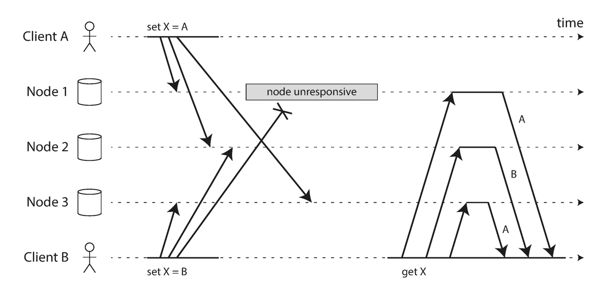

Fig.12. Dynamo 风格数据存储中的并发写入：没有明确定义的顺序。

如果每个节点在收到来自客户端的写入请求时简单地覆盖键的值，节点将永久不一致，如图 12 中的最终 get 请求所示：节点 2 认为 X 的最终值是 B，而其他节点认为值是 A。

为了最终变得一致，副本应该收敛到相同的值。
它们如何做到这一点？
人们可能期望复制数据库会自动处理这个问题，但不幸的是，大多数实现都很差：如果你想避免数据丢失，你（应用程序开发人员）需要深入了解数据库冲突处理的内部机制。

我们简要介绍了一些冲突解决技术。
在本章结束之前，让我们更详细地探讨这个问题。

#### 最后写入者获胜（丢弃并发写入）

实现最终收敛的一种方法是声明每个副本只需存储最"近"的值，并允许"较旧"的值被覆盖和丢弃。
然后，只要我们有一种明确的方式来确定哪个写入更"近"，并且每次写入最终都复制到每个副本，副本最终就会收敛到相同的值。

正如"近"字上的引号所示，这个想法实际上非常误导人。
在图 12 的示例中，当客户端向数据库节点发送写入请求时，每个客户端都不知道另一个客户端，因此不清楚哪个先发生。
实际上，说任何一个"先"发生都没有意义：我们说这些写入是并发的，因此它们的顺序未定义。

即使写入没有自然顺序，我们可以强制对它们施加任意顺序。
例如，我们可以为每个写入附加时间戳，选择最大的时间戳作为最"近"的，并丢弃具有较早时间戳的任何写入。
这种冲突解决算法称为最后写入者获胜（LWW），是 Cassandra 中唯一支持的冲突解决方法，也是 Riak 中的可选功能。
LWW 实现了最终收敛的目标，但代价是持久性：如果有多个并发写入到同一个键，即使它们都报告给客户端成功（因为它们写入到 w 个副本），只有一个写入会存活，其他写入将被静默丢弃。
此外，LWW 甚至可能丢弃非并发的写入。
在某些情况下，例如缓存，丢失写入或许是可以接受的。
如果丢失数据不可接受，LWW 是冲突解决的糟糕选择。
使用具有 LWW 的数据库的唯一安全方法是确保一个键只写入一次，然后被视为不可变，从而避免对同一键的任何并发更新。
例如，推荐使用 Cassandra 的方法是使用 UUID 作为键，从而为每个写入操作赋予唯一的键。

#### "happens-before"关系与并发性

我们如何判断两个操作是否并发？
为了建立直觉，让我们看一些例子：

- 在图 9 中，两个写入不是并发的：A 的插入发生在 B 的递增之前，因为 B 递增的值是 A 插入的值。
  换句话说，B 的操作建立在 A 的操作之上，因此 B 的操作一定发生在之后。我们也说 B 因果依赖于 A。
- 另一方面，图 12 中的两个写入是并发的：当每个客户端开始操作时，它不知道另一个客户端也在对同一个键执行操作。
  因此，操作之间没有因果依赖关系。

如果操作 B 知道 A、依赖于 A 或以某种方式建立在 A 之上，则操作 A 发生在操作 B 之前。一个操作是否发生在另一个操作之前，是定义并发含义的关键。
事实上，我们可以简单地说，如果两个操作都不在另一个之前发生（即，彼此都不知道），则这两个操作是并发的。

因此，每当你有两个操作 A 和 B 时，有三种可能性：A 发生在 B 之前，或 B 发生在 A 之前，或 A 和 B 是并发的。
我们需要一个算法来告诉我们两个操作是否并发。
如果一个操作发生在另一个之前，后面的操作应该覆盖前面的操作，但如果操作是并发的，我们就有了需要解决的冲突。

#### 捕获 happens-before 关系

让我们看一个确定两个操作是否并发，或者是否一个发生在另一个之前的算法。为简单起见，让我们从一个只有一个副本的数据库开始。
一旦我们弄清楚了如何在单个副本上做到这一点，我们就可以将方法推广到具有多副本的无领导者数据库。
图 13 显示两个客户端同时向同一个购物车添加商品。
最初，购物车是空的。
这两个客户端之间，对数据库进行了五次写入：

1. 客户端 1 将牛奶添加到购物车。这是对该键的第一次写入，因此服务器成功存储并分配版本 1。
   服务器还将值回显给客户端，以及版本号。
2. 客户端 2 将鸡蛋添加到购物车，不知道客户端 1 同时添加了牛奶（客户端 2 认为它的鸡蛋是购物车中唯一的商品）。
   服务器为此写入分配版本 2，并将鸡蛋和牛奶存储为两个独立的值。
   然后将两个值返回给客户端，以及版本号 2。
3. 客户端 1 不知道客户端 2 的写入，想要添加面粉到购物车，因此它认为当前的购物车内容应为 [milk, flour]。
   它将该值发送给服务器，以及服务器之前给客户端 1 的版本号 1。
   服务器从版本号可以判断，[milk, flour] 的写入取代了先前的值 [milk]，但与 [eggs] 是并发的。
   因此，服务器分配版本 3 给 [milk, flour]，覆盖版本 1 的值 [milk]，但保留版本 2 的值 [eggs]，并将两个剩余值返回给客户端。
4. 同时，客户端 2 想要添加火腿到购物车，不知道客户端 1 刚刚添加了面粉。
   客户端 2 在上一次响应中从服务器收到了两个值 [milk] 和 [eggs]，因此客户端现在合并这些值并添加火腿，形成新值 [eggs, milk, ham]。
   它将该值发送给服务器，以及先前的版本号 2。
   服务器检测到版本 2 覆盖了 [eggs]，但与 [milk, flour] 是并发的，因此两个剩余值是版本 3 的 [milk, flour] 和版本 4 的 [eggs, milk, ham]。
5. 最后，客户端 1 想要添加培根。它之前从服务器收到了 [milk, flour] 和 [eggs]，版本号为 3，因此它合并它们，添加培根，并将最终值 [milk, flour, eggs, bacon] 发送给服务器，以及版本号 3。
   这覆盖了 [milk, flour]（注意 [eggs] 在上一步已被覆盖），但与 [eggs, milk, ham] 是并发的，因此服务器保留这两个并发值。

### 合并并发写入的值

这个算法确保没有数据被静默丢弃，但不幸的是，它要求客户端做一些额外的工作：如果多个操作并发发生，客户端必须事后通过合并并发写入的值来清理。Riak 将这些并发值称为兄弟值。

合并兄弟值本质上与多领导者复制中的冲突解决是同一个问题，我们之前已经讨论过。
一个简单的方法是只根据版本号或时间戳选择其中一个值（最后写入者获胜），但这意味着数据丢失。
因此，你可能需要在应用程序代码中做一些更智能的事情。

以购物车为例，合并兄弟值的一个合理方法是取并集。
在图 14 中，两个最终兄弟值是 [milk, flour, eggs, bacon] 和 [eggs, milk, ham]；注意牛奶和鸡蛋都出现了两次，尽管它们各自只被写入一次。
合并后的值可能是类似 [milk, flour, eggs, bacon, ham] 的值，没有重复。

然而，如果你还允许人们从购物车中移除商品，而不仅仅是添加商品，那么取兄弟值的并集可能不会产生正确的结果：如果你合并两个兄弟购物车，并且某个商品在其中一个购物车中被移除了，那么该移除的商品将重新出现在兄弟值的并集中。
为防止此问题，当商品被移除时，不能简单地从数据库中删除；相反，系统必须留下一个带有适当版本号的标记，以指示在合并兄弟值时该商品已被移除。这种删除标记称为墓碑。
由于在应用程序代码中合并兄弟值既复杂又容易出错，有一些努力来设计可以自动执行此合并的数据结构。
例如，Riak 的数据类型支持使用一组称为 CRDT 的数据结构，这些数据结构可以以合理的方式自动合并兄弟值，包括保留删除。

## 复制状态机

冗余是不够的；要使其有用，必须进行协调。
最简单的方法是使每个无故障的副本做相同的事情。
然后任何无故障的副本都可以提供输出；如果副本不是故障停止的，要求 f 个副本输出相同结果可以容忍 f – 1 个故障。
更复杂的冗余类型（如纠错码）更便宜，但它们依赖于所提供服务的特殊属性。

## Summary

我们讨论了三种主要的复制方法：

| 复制方法 | 描述 |
| ------------------------------- | -------------------------------------------------------------------------------------------------------------------------------------------------------------------------------------------------------------------------- |
| **单领导者复制** | 客户端将所有写入发送到单个节点（领导者），领导者将数据变更事件流发送到其他副本（跟随者）。  读取可以在任何副本上进行，但从跟随者读取可能得到过时数据。 |
| **多领导者复制** | 客户端将每次写入发送到多个领导者节点之一，任何领导者都可以接受写入。  领导者将数据变更事件流相互发送以及发送到任何跟随者节点。 |
| **无领导者复制** | 客户端将每次写入发送到多个节点，并并行从多个节点读取，以检测和纠正具有过时数据的节点。 |

每种方法都有优缺点。
单领导者复制很流行，因为它相当容易理解，并且无需担心冲突解决。
多领导者和无领导者复制在面对故障节点、网络中断和延迟峰值时可能更健壮——代价是更难推理，并且只提供非常弱的一致性保证。

复制可以是同步或异步的，这对系统在发生故障时的行为有深远影响。
虽然异步复制在系统平稳运行时可以很快，但重要的是要弄清楚当复制滞后增加且服务器故障时会发生什么。
如果领导者故障并且你提升异步更新的跟随者为新领导者，最近提交的数据可能丢失。

我们研究了复制滞后可能引起的一些奇怪效果，并讨论了一些一致性模型，这些模型有助于决定应用程序在复制滞后下应如何表现：

| 复制滞后保证 | 描述 |
| ------------------------------ | ---------------------------------------------------------------------------------------------------------------------------------- |
| 读后写一致性 | 用户应始终看到自己提交的数据。 |
| 单调读取 | 用户在某个时间点看到数据后，不应在之后看到来自更早时间点的数据。 |
| 一致前缀读取 | 用户应看到数据处于因果有意义的状态：例如，以正确顺序看到问题和答案。 |

最后，我们讨论了多领导者和无领导者复制方法中固有的并发问题：由于它们允许多个写入同时发生，可能会发生冲突。
我们研究了一种数据库可以用来确定一个操作是否发生在另一个之前，或者它们是否同时发生的算法。
我们还简要介绍了通过合并并发更新来解决冲突的方法。

## Links

- [Distributed Systems](/docs/CS/Distributed/Distributed)
- [Partitioning](/docs/CS/Distributed/Partition.md)

## References

1. [Chain Replication for Supporting High Throughput and Availability](https://www.cs.cornell.edu/home/rvr/papers/OSDI04.pdf)
