## Introduction

用可靠性较差的组件构建高可用系统的唯一方法，是使用冗余（redundancy），这样即使部分组件损坏，系统仍能工作。最简单的一种冗余是复制（replication）：为每一部分制作若干副本（replicas）。

你可能出于以下原因想要复制数据：

- 让数据在地理上靠近用户（从而降低延迟）
- 让系统即使部分组件失效也能继续工作（从而提高可用性）
- 扩展能服务读查询的机器数量（从而提高读吞吐）

如果你复制的数据不随时间变化，那么复制很容易：你只需把数据复制到每个节点一次，就完成了。复制的所有难点都在于处理被复制数据的变更。

我们将讨论在节点间复制变更的三种流行算法：单领导者（single-leader）、[多领导者（multi-leader）](/docs/CS/Distributed/Replica.md?id=多领导者复制)、[无领导者（leaderless）](/docs/CS/Distributed/Replica.md?id=无领导者复制)复制。几乎所有分布式数据库都使用这三种方法之一。复制有许多权衡要考虑：例如，使用同步还是异步复制，以及如何处理失效的副本。这些通常是数据库中的配置选项，尽管细节因数据库而异，但一般原则在许多不同实现中相似。

在商用硬件上的容错可以通过复制来实现。一种常见方法是使用共识（Consensus）算法来确保所有副本相互一致。通过在一系列输入值上反复应用这样的算法，可以在每个副本上构建出相同的值日志。如果这些值是针对某个数据结构的操作，那么在所有副本上应用相同的日志就可以得到相互一致的数据结构。例如，如果日志包含一系列数据库操作，并且相同的操作序列被应用到每个副本的（本地）数据库上，那么最终所有副本都会得到相同的数据库内容（前提是它们都从相同的初始数据库状态开始）。

## 领导者与跟随者（Leaders and Followers）

每个存储数据库副本的节点称为一个副本（replica）。有了多个副本，一个不可避免的问题就出现了：我们如何确保所有数据最终都落到所有副本上？

每次对数据库的写入都需要被每个副本处理；否则副本就不再包含相同的数据。最常见的解决方案称为基于领导者（leader-based）的复制（也称为主动/被动，或主—从复制），如图 1 所示。它的工作方式如下：

1. 其中一个副本被指定为领导者（leader，也称为 master 或 primary）。当客户端想写入数据库时，它们必须把请求发给领导者，领导者先把新数据写入本地存储。
2. 其它副本称为跟随者（followers，读副本、slaves、secondaries 或热备）。每当领导者把新数据写入本地存储，它也会把数据变更作为复制日志（replication log）或变更流的一部分发送给所有跟随者。每个跟随者取出领导者的日志，并按领导者的处理顺序应用所有写入，从而更新本地数据库副本。
3. 当客户端想从数据库读取时，它可以查询领导者或任意跟随者。然而，写入只被领导者接受（从客户端视角看，跟随者是只读的）。

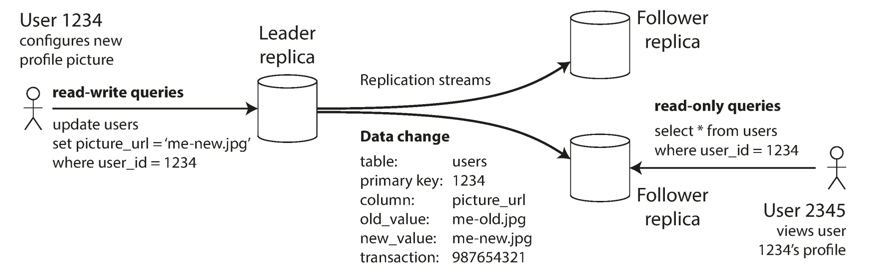

Fig.1. Leader-based (master–slave) replication.

这种复制模式是许多关系型数据库的内置特性，例如 PostgreSQL（自 9.0 起）、MySQL、Oracle Data Guard、SQL Server 的 AlwaysOn Availability Groups。它也被一些非关系型数据库使用，包括 MongoDB、RethinkDB、Espresso。最后，基于领导者的复制不限于数据库：分布式消息代理如 Kafka 和 RabbitMQ 的高可用队列也使用它。一些网络文件系统和复制块设备如 DRBD 也类似。

### 同步复制与异步复制（Synchronous Versus Asynchronous Replication）

复制系统的一个重要细节是复制是同步还是异步发生。（在关系型数据库中，这通常是一个可配置选项；其它系统常常被硬编码为二者之一。）想想图 1 中发生的情况：某网站用户更新了自己的头像。在某个时刻，客户端把更新请求发给领导者；不久之后，领导者收到。在某个时刻，领导者把数据变更转发给跟随者。最终，领导者通知客户端更新成功。

图 2 展示了系统各组件（用户的客户端、领导者和两个跟随者）之间的通信。时间从左向右流动。请求或响应消息用粗箭头表示。

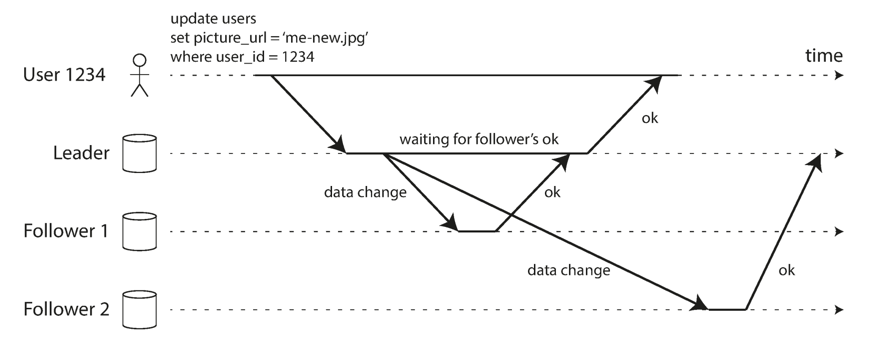

Fig.2. Leader-based replication with one synchronous and one asynchronous follower.

在图 2 的例子中，对跟随者 1 的复制是同步的：领导者等待跟随者 1 确认收到写入后，才向用户报告成功，并在把写入对其他客户端可见之前完成。对跟随者 2 的复制是异步的：领导者发送消息，但不等待跟随者的响应。

图表明跟随者 2 处理消息前有显著延迟。通常，复制相当快：大多数数据库系统在不到一秒内把变更应用到跟随者。然而，无法保证会花多长时间。有些情况下跟随者可能落后领导者几分钟甚至更久；例如，如果某个跟随者正在从故障中恢复，或者系统运行在接近容量上限，或者节点间存在网络问题。

同步复制的优势在于，跟随者保证拥有与领导者一致的、最新的数据副本。如果领导者突然失效，我们可以确信数据在跟随者上仍然可用。缺点是如果同步跟随者不响应（因为它崩溃了，或有网络故障，或任何其它原因），写入就无法处理。领导者必须阻塞所有写入，直到同步副本重新可用。因此，让所有跟随者都同步是不现实的：任何单个节点中断都会让整个系统停摆。实践中，如果你在数据库上启用同步复制，通常意味着其中一个跟随者是同步的，其它是异步的。如果同步跟随者不可用或变慢，就把其中一个异步跟随者提升为同步。这保证你至少在两个节点（领导者和一个同步跟随者）上有最新的数据副本。这种配置有时也称为半同步（semi-synchronous）。

通常，基于领导者的复制被配置为完全异步。这种情况下，如果领导者失效且无法恢复，任何尚未复制到跟随者的写入都会丢失。这意味着即使已向客户端确认，一次写入也不保证持久（durable）。然而，完全异步配置的优势在于领导者可以继续处理写入，即使所有跟随者都已落后。

弱化持久性听起来像是个糟糕的权衡，但异步复制仍被广泛使用，尤其是在有许多跟随者或它们地理分布时。

时不时需要建立新的跟随者——也许是为了增加副本数，或者替换故障节点。你如何确保新跟随者拥有领导者数据的准确副本？简单地把数据文件从一个节点复制到另一个通常不够：客户端不断地写入数据库，数据始终在变化，标准的文件复制会看到数据库在不同时间点的不同部分。结果可能毫无意义。你可以通过锁定数据库（让它不可写）来让磁盘上的文件一致，但那会违背我们高可用的目标。幸运的是，建立跟随者通常可以不停机完成。从概念上讲，过程如下：

1. 在某个时刻对领导者的数据库做一致性快照——如果可能，不要锁整个数据库。大多数数据库都有这个特性，因为它也是备份所需要的。某些情况下需要第三方工具，例如 MySQL 的 innobackupex。
2. 把快照复制到新的跟随者节点。
3. 跟随者连接到领导者，请求自快照拍摄以来发生的所有数据变更。这要求快照与领导者复制日志中的精确位置相关联。该位置有各种名称：例如 PostgreSQL 称为日志序列号（log sequence number），MySQL 称为 binlog 坐标（binlog coordinates）。
4. 当跟随者处理了自快照以来的积压数据变更后，我们说它已追上（caught up）。它现在可以继续像之前一样处理来自领导者的实时数据变更。

建立跟随者的实际步骤因数据库而异。有些系统完全自动化，而另一些可能是由管理员手动执行的、有些晦涩的多步工作流。

### 处理节点故障（Handling Node Outages）

系统中的任何节点都可能宕机，可能由于故障意外发生，也可能由于计划内维护（例如重启机器安装内核安全补丁）。能够在不停机的情况下重启单个节点，对运维是很大的优势。因此，我们的目标是尽管个别节点故障，仍让系统整体运行，并把节点宕机的影响降到最小。如何用基于领导者的复制实现高可用？

#### 跟随者故障：追赶恢复（Follower failure: Catch-up recovery）

每个跟随者在其本地磁盘上保存一份从领导者收到的数据变更日志。如果跟随者崩溃并重启，或者领导者与跟随者之间的网络暂时中断，跟随者可以相当容易地恢复：从它的日志中，它知道故障发生前处理的最后一个事务。因此，跟随者可以连接到领导者，请求在它断开期间发生的所有数据变更。当它应用了这些变更后，就追上了领导者，并可以像之前一样继续接收数据变更流。

#### 领导者故障：故障转移（Leader failure: Failover）

处理领导者故障更棘手：需要把一个跟随者提升为新的领导者，客户端需要被重新配置为把写入发给新领导者，其它跟随者需要开始从新领导者消费数据变更。这个过程称为故障转移（failover）。故障转移可以手动发生（管理员被告知领导者已失效，并采取必要步骤建立新领导者），也可以自动发生。自动故障转移过程通常包括以下步骤：

1. 确定领导者已失效。可能出错的事情很多：崩溃、断电、网络问题等等。没有万无一失的方法来检测到底出了什么错，所以大多数系统简单地使用超时：节点之间频繁互发消息，如果某个节点一段时间不响应——比如 30 秒——就被假定为已死。（如果领导者是被刻意停下进行计划维护，这不适用。）
2. 选择新领导者。这可以通过选举过程完成（领导者由多数剩余副本选出），或者由一个先前选出的控制器节点指定新领导者。领导力的最佳候选者通常是从旧领导者那里拥有最新数据变更的副本（以最小化数据丢失）。让所有节点就新领导者达成一致是一个共识问题，第 9 章详述。
3. 重新配置系统以使用新领导者。客户端现在需要把写入请求发给新领导者（我们在第 214 页“Request Routing”讨论）。如果旧领导者回来，它可能仍以为自己是领导者，没意识到其它副本已迫使它退位。系统需要确保旧领导者成为跟随者并承认新领导者。

故障转移充满可能出错的地方：

- 如果使用异步复制，在新领导者被选出之前，旧领导者可能还没收到所有写入。如果旧领导者在选出新领导者后重新加入集群，那些写入该怎么办？新领导者在此期间可能已经收到了冲突的写入。最常见的解决方案是简单地丢弃旧领导者未复制的写入，这可能违背客户端的持久性期望。
- 如果数据库的其它存储系统需要与之协调，丢弃写入尤其危险。例如，GitHub 曾发生过一起事故：一个过时的 MySQL 跟随者被提升为领导者。数据库使用自增计数器为新行分配主键，但由于新领导者的计数器落后于旧领导者，它重用了旧领导者先前分配的一些主键。这些主键也被用于 Redis 存储，因此主键的重用导致 MySQL 与 Redis 之间不一致，造成一些私有数据被错误地披露给其它用户。
- 在某些故障场景下（见第 8 章），可能发生两个节点都认为自己才是领导者。这种情况称为脑裂（split brain），很危险：如果两个领导者都接受写入，且没有解决冲突的过程（见“Multi-Leader Replication”），数据很可能丢失或损坏。作为安全闸，一些系统有机制在检测到两个领导者时关闭其中一个节点。然而，如果这个机制设计不仔细，你可能最终把两个节点都关掉。
- 在宣布领导者死亡之前，正确的超时是多少？更长的超时意味着领导者失效时恢复时间更长。然而，如果超时太短，可能出现不必要的故障转移。例如，临时的负载尖峰可能使节点的响应时间增加到超过超时，或者网络故障可能导致数据包延迟。如果系统已经在高负载或网络问题下挣扎，一次不必要的故障转移很可能让情况更糟，而不是更好。

这些问题没有简单的解决方案。因此，有些运维团队即使软件支持自动故障转移，也偏好手动执行。这些议题——节点故障、不可靠的网络、以及围绕副本一致性、持久性、可用性和延迟的权衡——实际上是分布式系统中的根本性问题。

## 复制日志（Replication Logs）

基于领导者的复制在底层如何工作？实践中使用了几种不同的复制方法，我们逐一简要看看。

### 基于语句的复制（Statement-based replication）

最简单的情况下，领导者记录它执行的每个写入请求（语句），并把该语句日志发给跟随者。对关系型数据库而言，这意味着每个 INSERT、UPDATE 或 DELETE 语句都被转发给跟随者，每个跟随者解析并执行该 SQL 语句，如同它从客户端收到一样。尽管这听起来合理，但这种方法有许多可能出问题的地方：

- 任何调用非确定性函数（如用 NOW() 获取当前日期时间，或用 RAND() 获取随机数）的语句，很可能每个副本上产生不同的值。
- 如果语句使用自增列，或者依赖数据库中已有数据（例如 UPDATE … WHERE <某条件>），它们必须以完全相同的顺序在每个副本上执行，否则可能产生不同效果。这在有多个并发执行的事务时是个限制。
- 有副作用的语句（例如触发器、存储过程、用户定义函数）可能导致每个副本上产生不同的副作用，除非这些副作用绝对确定。

这些问题可以绕开——例如，领导者在记录语句时可以把任何非确定性函数调用替换成固定的返回值，这样跟随者都得到相同的值。然而，由于边界情况太多，现在一般更倾向于其它复制方法。基于语句的复制在 MySQL 5.1 之前使用。今天偶尔仍在使用，因为它相当紧凑，但如果一条语句中有任何非确定性，MySQL 现在默认切换到基于行的复制。VoltDB 使用基于语句的复制，并通过要求事务是确定性的来保证其安全。

### 预写日志（WAL）传输（Write-ahead log (WAL) shipping）

我们讨论过存储引擎如何在磁盘上表示数据，发现通常每次写入都会追加到一个日志：

- 对于日志结构（log-structured）存储引擎，这个日志是存储的主要场所。日志段在后台被压缩和垃圾回收。
- 对于 B 树，它会覆盖单个磁盘块，每次修改先写入预写日志，以便索引在崩溃后能被恢复到一致状态。

无论哪种情况，日志都是包含所有数据库写入的、只追加的字节序列。我们可以用完全相同的日志在另一个节点上构建副本：领导者除了把日志写入磁盘，还把它通过网络发给跟随者。当跟随者处理这个日志时，它构建了与领导者上完全相同的同一批数据结构。

PostgreSQL 和 Oracle 等使用了这种复制方法。主要缺点是日志在非常低的层次描述数据：WAL 包含哪些字节在哪些磁盘块被改变的细节。这使得复制与存储引擎紧密耦合。如果数据库把一个版本的存储格式改成另一个，通常无法在领导者和跟随者上运行不同版本的数据库软件。这看似是个小的实现细节，但可能有很大的运维影响。如果复制协议允许跟随者使用比领导者更新的软件版本，你就可以先升级跟随者、再故障转移使一个升级后的节点成为新领导者，从而实现数据库软件的零停机升级。如果复制协议不允许这种版本错配（WAL 传输常常如此），这类升级就需要停机。

### 逻辑（基于行）日志复制（Logical (row-based) log replication）

另一种方法是为复制和存储引擎使用不同的日志格式，从而让复制日志与存储引擎内部解耦。这类复制日志称为*逻辑日志（logical log）*，以区别于存储引擎的（物理）数据表示。关系型数据库的逻辑日志通常是一系列以行为粒度描述对数据库表写入的记录：

- 对于插入的行，日志包含各列的新值。
- 对于删除的行，日志包含足以唯一标识被删行的信息。通常这会是主键，但如果表没有主键，就需要记录所有列的旧值。
- 对于更新的行，日志包含足以唯一标识被更新行的信息，以及各列的新值（或至少所有发生变化列的新值）。

一个修改多行的事务会生成若干这样的日志记录，随后跟着一条表示该事务已提交（committed）的记录。MySQL 的 binlog（配置为基于行复制时）使用这种方法。由于逻辑日志与存储引擎内部解耦，它更容易保持向后兼容，允许领导者和跟随者运行不同版本的数据库软件，甚至是不同的存储引擎。逻辑日志格式也更容易被外部应用解析。如果你想把数据库内容发送到外部系统（例如用于离线分析的数据仓库，或用于构建自定义索引和缓存），这一点很有用。这种技术称为*变更数据捕获（change data capture）*。

### 基于触发器的复制（Trigger-based replication）

迄今描述的复制方法都由数据库系统实现，不涉及任何应用代码。多数情况下这正是你想要的——但有些情况需要更多灵活性。例如，如果你想只复制数据子集，或从一种数据库复制到另一种，或需要冲突解决逻辑，那你可能需要把复制提升到应用层。

一些工具（如 Oracle GoldenGate）可以通过读取数据库日志把数据变更提供给应用。另一种方式是使用许多关系型数据库都提供的特性：触发器和存储过程。触发器让你注册自定义应用代码，当数据库系统中发生数据变更（写事务）时自动执行。触发器有机会把这个变更记录到一个单独的表，外部进程可以从中读取。该外部进程随后可以应用任何必要的应用逻辑，并把数据变更复制到另一个系统。例如，Oracle 的 Databus 和 Postgres 的 Bucardo 就是这样工作的。基于触发器的复制通常比其它复制方法开销更大，也比数据库内置复制更容易出 bug 和受限。然而，由于它的灵活性，它仍然有用。

## 复制延迟（Replication Lag）

能够容忍节点故障只是想要复制的一个理由。正如第二部分引言所述，其它理由是 scalability（处理单台机器无法处理的更多请求）和 latency（把副本放在离用户更近的地理位置）。基于领导者的复制要求所有写入都经过单个节点，但只读查询可以去任何副本。对于主要由读、只有很小比例写组成的工作负载（Web 上的常见模式），有一个诱人的选择：创建许多跟随者，把读请求分布到这些跟随者上。这把负载从领导者上卸下，并允许由附近的副本服务读请求。在这种读扩展（read-scaling）架构中，你只需增加更多跟随者就能提升服务只读请求的能力。然而，这种方法只有在异步复制下才现实——如果你试图同步复制到所有跟随者，单个节点故障或网络中断就会让整个系统不可写。而且节点越多，越可能有节点宕机，因此完全同步的配置会非常不可靠。

不幸的是，如果应用从异步跟随者读取，它可能看到过时信息——如果跟随者已经落后。这导致数据库中明显的“不一致”：如果你同时在领导者和跟随者上运行相同查询，可能得到不同结果，因为并非所有写入都已在跟随者上反映。这种不一致只是临时状态——如果你停止写入数据库并等待一会儿，跟随者最终会追上并与领导者一致。因此，这种效应称为*最终一致性（eventual consistency）*。

“最终”这个词故意含糊：一般而言，副本落后多远没有上限。正常运行时，写入发生在领导者、反映到跟随者之间的延迟（*复制延迟，replication lag*）可能只有不到一秒，实践中察觉不到。然而，如果系统运行在接近容量上限，或网络有问题，延迟很容易增加到几秒甚至几分钟。

当延迟这么大时，它引入的不一致不只是理论问题，而是应用的真实问题。本节我们强调三个在复制延迟时很可能发生的问题，并概述一些解决方法。

### Read after write

许多应用让用户提交一些数据，然后查看他们提交的内容。这可能是客户数据库里的一条记录、讨论串上的一条评论，或其它类似的东西。当新数据被提交时，它必须发给领导者，但当用户查看数据时，可以从跟随者读取。这在数据频繁查看但偶尔写入时尤其合适。使用异步复制时，有个问题，如图 3 所示：如果用户在写入后不久查看数据，新数据可能还没到达副本。对用户而言，看起来他们提交的数据丢失了，他们自然会不高兴。

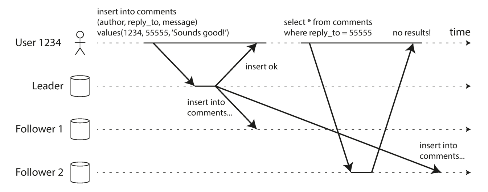

Fig.3. A user makes a write, followed by a read from a stale replica. To prevent this anomaly, we need read-after-write consistency.

在这种情况下，我们需要*读后写一致性（read-after-write consistency）*，也称为*读己之所写一致性（read-your-writes consistency）*。这是一个保证：如果用户重新加载页面，他们总是能看到自己提交的任何更新。它对其它用户不做承诺：其它用户的更新可能要到稍后才能看到。然而，它让用户确信自己的输入已被正确保存。

我们如何在基于领导者的复制系统中实现读后写一致性：

- 当读取用户可能修改过的东西时，从领导者读取；否则从跟随者读取。这要求你能在不实际查询的情况下知道某物是否可能被修改。例如，社交网络上的用户资料通常只有资料所有者本人可编辑，而不是其他人。因此一条简单规则是：总是从领导者读取用户自己的资料，从跟随者读取任何其他用户的资料。
- 如果应用中大多数东西都可能被用户编辑，那种方法就无效，因为大多数东西都得从领导者读取（抵消了读扩展的好处）。这种情况下，可以用其它标准来决定是否从领导者读取。例如，你可以跟踪最后一次更新的时间，并在最后一次更新后的一分钟内，把所有读取都从领导者进行。你也可以监控跟随者上的复制延迟，并禁止对任何落后领导者超过一分钟的跟随者发起查询。
- 客户端可以记住它最近一次写入的时间戳——那么系统可以确保为该用户服务的任何读副本至少反映到那个时间戳的更新。如果一个副本不够新，读取可以由另一个副本处理，或者查询等待直到该副本追上。时间戳可以是逻辑时间戳（指示写入顺序的东西，如日志序列号），也可以是实际的系统时钟（这种情况下时钟同步变得关键）。
- 如果你的副本分布在多个数据中心（为了离用户近或为了可用性），还有额外的复杂性。任何需要领导者服务的请求都必须被路由到包含领导者的数据中心。

当同一个用户从多个设备访问你的服务时，会出现另一个复杂性，例如桌面浏览器和移动应用。这种情况下你可能想提供跨设备的读后写一致性：如果用户在某个设备输入了某些信息，然后在另一个设备查看，他们应该看到刚输入的信息。这种情况下，有若干额外问题要考虑：

- 需要记住用户最后一次更新时间戳的方法变得更难，因为在一个设备上运行的代码不知道另一个设备上发生了什么更新。这个元数据需要集中化。
- 如果你的副本分布在不同数据中心，不保证来自不同设备的连接会被路由到同一个数据中心。（例如，如果用户的台式机用家庭宽带、移动设备用蜂窝网络，设备的网络路由可能完全不同。）如果你的方法要求从领导者读取，你可能首先需要把用户所有设备的请求路由到同一个数据中心。

### 单调读（Monotonic Reads）

我们从异步跟随者读取时可能发生的第二个异常是，用户可能看到事物*随时间倒退*。如果用户对不同的副本做多次读取，就可能发生。例如，图 4 展示用户 2345 做两次相同查询，先到一个延迟小的跟随者，再到延迟大的跟随者。（如果用户刷新网页、每个请求被路由到随机服务器，这种场景相当可能。）第一个查询返回了用户 1234 最近添加的一条评论，但第二个查询什么也没返回，因为落后的跟随者还没拿到那条写入。实际上，第二个查询观察的是比第一个查询更早的系统时刻。如果第一个查询什么都没返回，这还不算太糟，因为用户 2345 大概不知道用户 1234 最近加了评论。然而，如果用户 2345 先看到用户 1234 的评论出现、然后又看到它消失，会非常困惑。

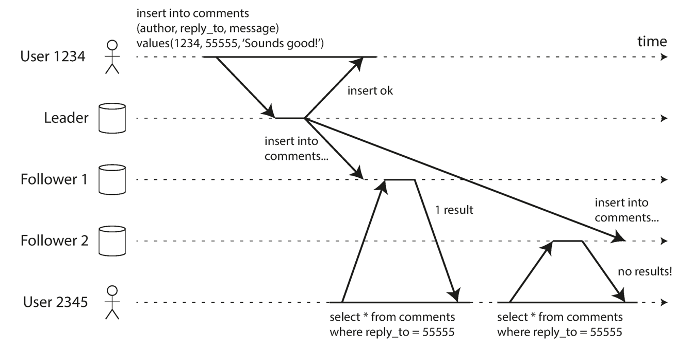

Fig.4. A user first reads from a fresh replica, then from a stale replica. Time appears to go backward. To prevent this anomaly, we need monotonic reads.

*单调读（monotonic reads）*是一种保证这种异常不会发生的承诺。它比*强一致性（strong consistency）*弱，但比*最终一致性（eventual consistency）*强。当你读取数据时，你可能看到一个旧值；单调读只意味着如果一个用户顺序做多次读取，他们不会看到时间倒退——即他们不会在先前读到新数据之后又读到更旧的数据。实现单调读的一种方法是确保每个用户总是从同一个副本读取（不同用户可以从不同副本读取）。例如，副本可以根据用户 ID 的哈希选择，而不是随机。然而，如果该副本失效，用户的查询需要被重新路由到另一个副本。

### 一致前缀读（Consistent Prefix Reads）

我们第三个复制延迟异常的例子关乎因果性的违反。想象 Mr. Poons 和 Mrs. Cake 之间如下简短对话：

> Mr. Poons
> 你能看到多远的未来，Cake 太太？
>
> Mrs. Cake
> 通常大约十秒，Poons 先生。

这两句话之间有因果依赖：Cake 太太听到 Poons 先生的问题并回答它。现在，想象第三个人通过跟随者听这段对话。Cake 太太说的话经过一个延迟小的跟随者，但 Poons 先生说的话有更长的复制延迟（见图 5）。这个观察者会听到如下内容：

> Mrs. Cake
> 通常大约十秒，Poons 先生。
>
> Mr. Poons
> 你能看到多远的未来，Cake 太太？

对观察者来说，看起来像是 Cake 太太在 Poons 先生提问之前就回答了。这种通灵能力令人印象深刻，但非常令人困惑。

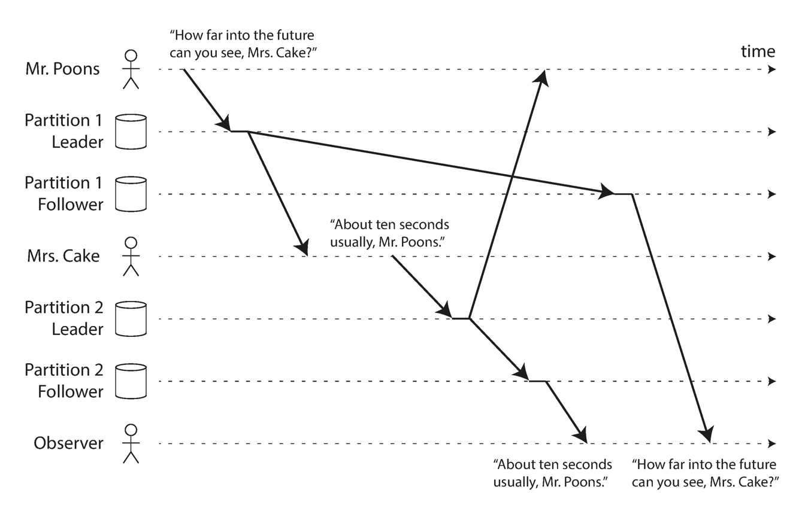

Fig.5. If some partitions are replicated slower than others, an observer may see the answer before they see the question.

防止这类异常需要另一种保证：一致前缀读（consistent prefix reads）。这个保证说，如果一系列写入以某种顺序发生，那么任何读取这些写入的人都会以相同顺序看到它们出现。

如果数据库总是以相同顺序应用写入，读取就总能看到一致前缀，因此这种异常不会发生。然而，在许多分布式数据库中，不同分区独立运行，所以没有写入的全局顺序：当用户从数据库读取时，他们可能看到数据库的某些部分处于较旧状态、某些处于较新状态。一种解决方案是确保任何因果相关的写入都写入同一个分区——但在某些应用中这无法高效完成。

### 复制延迟的解法（Solutions for Replication Lag）

当使用最终一致系统时，值得思考如果复制延迟增加到几分钟甚至几小时，应用会如何表现。如果答案是“没问题”，那就太好了。然而，如果用户得到糟糕的体验，设计系统以提供更强保证（例如读后写）就很重要。在实际上是异步时假装复制是同步的，是日后出问题的温床。

如前所述，应用可以用比底层数据库更强的保证来提供——例如，在特定种类的读取上向领导者发起。然而，在应用代码中处理这些问题既复杂又容易出错。如果应用开发者不必担心微妙的复制问题、可以信任数据库“做正确的事”，那就更好。这就是事务存在的原因：它们是数据库提供更强保证、让应用更简单的一种方式。单节点事务已经存在很久。然而，在向分布式（复制且分区）数据库迁移的过程中，许多系统放弃了它们，声称事务在性能和可用性上代价太高，并断言最终一致性在可扩展系统中是不可避免的。这种说法有一定道理，但过于简单，我们将在本书后续发展中形成更细腻的观点。

## 多领导者复制

本章到目前为止我们只考虑了使用单个领导者的复制架构。尽管那是常见方法，但也有有趣的替代。基于领导者的复制有一个主要缺点：只有一个领导者，所有写入都必须经过它。如果你由于某种原因无法连接到领导者（例如你与领导者之间的网络中断），你就无法写入数据库。

基于领导者复制模型的一个自然扩展是允许多个节点接受写入。复制仍以同样方式发生：每个处理写入的节点必须将该数据变更转发给所有其它节点。我们称这为*多领导者配置（multi-leader configuration）*（也称为主—主，或主动/主动复制）。在这种设置中，每个领导者同时充当其它领导者的跟随者。

在单个数据中心内使用多领导者设置很少有意义，因为收益很少超过增加的复杂度。然而，有些情况下这种配置是合理的。

想象你有一个数据库，副本分布在几个不同的数据中心（也许是为了容忍整个数据中心失效，或为了离用户更近）。使用普通的基于领导者的复制，领导者必须位于其中一个数据中心，所有写入都必须经过该数据中心。在多领导者配置中，你可以每个数据中心有一个领导者。图 6 展示了这种架构可能的样子。在每个数据中心内部，使用常规的领导者—跟随者复制；在数据中心之间，每个数据中心的领导者把它的变更复制到其它数据中心的领导者。

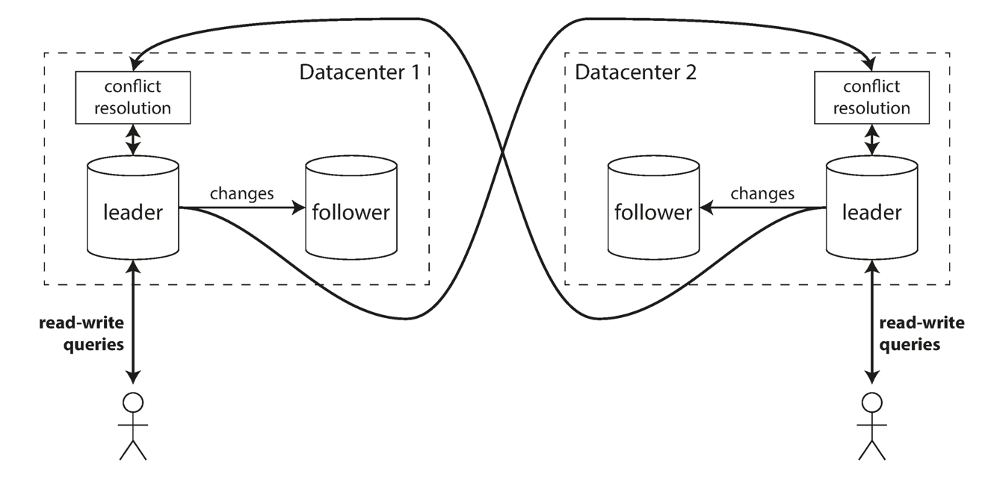

Fig.6. Multi-leader replication across multiple datacenters.

让我们比较单领导者和多领导者配置在多数据中心部署下的表现：

- 性能
  在单领导者配置中，每次写入都必须经过互联网到达有领导者的数据中心。这可能给写入增加显著延迟，并可能违背拥有多个数据中心的初衷。在多领导者配置中，每次写入都可以在本地数据中心处理，并异步复制到其它数据中心。因此，数据中心间的网络延迟对用户是隐藏的，感知性能可能更好。
- 对数据中心失效的容忍
  在单领导者配置中，如果有领导者的数据中心失效，故障转移可以把另一个数据中心的跟随者提升为领导者。在多领导者配置中，每个数据中心可以独立于其它数据中心继续运行，当失效的数据中心重新上线时复制会追上。
- 对网络问题的容忍
  数据中心间的流量通常走公共互联网，可能不如数据中心内部网络可靠。单领导者配置对这种跨数据中心链路的问题非常敏感，因为写入是同步经过这条链路的。使用异步复制的多领导者配置通常能更好地容忍网络问题：临时的网络中断不会阻止写入被处理。

一些数据库默认支持多领导者配置，但它也常通过外部工具实现，例如 MySQL 的 Tungsten Replicator、PostgreSQL 的 BDR、Oracle 的 GoldenGate。尽管多领导者复制有优势，它也有一个大缺点：相同数据可能在两个不同数据中心被并发修改，这些写冲突必须被解决。

由于多领导者复制在许多数据库中是个多少有点“打补丁”加进去的特性，常有微妙的配置陷阱以及与其它数据库特性的意外交互。例如，自增键、触发器和完整性约束可能出问题。因此，多领导者复制常被视为应尽可能避免的危险地带。

### 支持离线操作的客户端（Clients with offline operation）

多领导者复制合适的另一种情况是，如果你的应用需要在断网时仍能工作。例如，考虑你手机、笔记本和其它设备上的日历应用。你需要随时能查看会议（发起读请求）、输入新会议（发起写请求），无论设备当前是否有互联网连接。如果你在离线时做了任何更改，它们需要在设备下次上线时与服务器和你的其它设备同步。

这种情况下，每个设备都有一个本地数据库充当领导者（它接受写请求），在你的所有设备上的日历副本之间存在一个异步的多领导者复制过程（同步）。复制延迟可能长达数小时甚至数天，取决于你何时能连上互联网。从架构角度看，这种设置本质上与数据中心间的多领导者复制相同，只是走向极端：每个设备是一个“数据中心”，它们之间的网络连接极不可靠。正如大量失败的日历同步实现所表明的，多领导者复制是件很难做对的事。有些工具旨在让这类多领导者配置更容易。例如，CouchDB 就是为这种模式设计的。

### 处理写冲突（Handling Write Conflicts）

多领导者复制最大的问题是可能发生写冲突，因此需要冲突解决。例如，考虑一个 wiki 页面被两个用户同时编辑，如图 7。用户 1 把标题从 A 改为 B，用户 2 同时把标题从 A 改为 C。每个用户的更改都成功应用到他们的本地领导者。然而，当变更被异步复制时，检测到冲突。这个问题在单领导者数据库中不会发生。

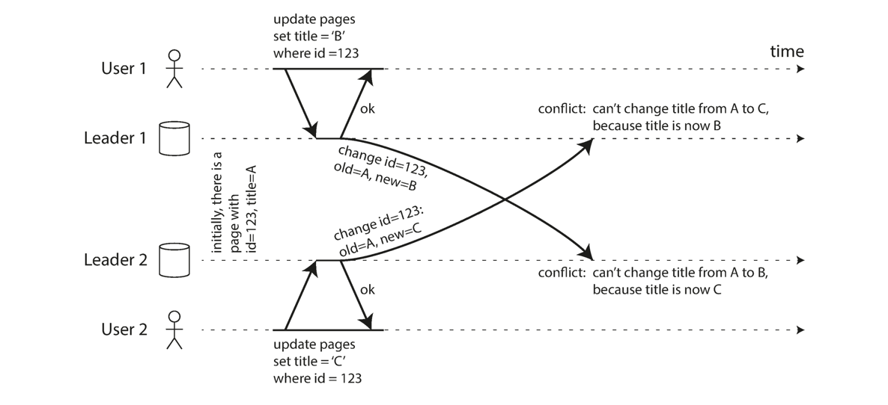

Fig.7. A write conflict caused by two leaders concurrently updating the same record.

同步与异步的冲突检测

在单领导者数据库中，第二个写入者要么阻塞等待第一个写入完成，要么中止第二个写入事务，迫使使用者重试。另一方面，在多领导者设置中，两次写入都成功，冲突只在稍后的某个时刻被异步检测到。到那时，让用户解决冲突可能为时已晚。原则上，你可以让冲突检测同步——即等待写入被复制到所有副本后再告诉用户写入成功。然而，这样做你会失去多领导者复制的主要优势：让每个副本独立接受写入。

#### 避免冲突（Conflict avoidance）

处理冲突最简单的策略是避免它们：如果应用能确保所有对某个特定记录的写入都经过同一个领导者，那么冲突就不会发生。由于许多多领导者复制的实现对冲突处理相当差，避免冲突是常被推荐的方法。

例如，在一个用户可以编辑自己数据的应用中，你可以确保来自特定用户的请求总是被路由到同一个数据中心，并在该数据中心使用领导者读写。不同用户可能有不同的“主场”数据中心（也许基于离用户近来选择），但从任何单个用户的视角看，配置本质上就是单领导者的。

然而，有时你可能想改变某条记录的指定领导者——也许因为一个数据中心失效，你需要把流量改到另一个；或者因为用户搬到了不同位置，现在离另一个数据中心更近。这种情况下，避免冲突就失效了，你必须处理不同领导者上并发写入的可能性。

向一致状态收敛（Converging toward a consistent state）

单领导者数据库按顺序应用写入：如果同一字段有若干更新，最后一个写入决定该字段的最终值。在多领导者配置中，写入没有定义的顺序，所以不清楚最终值应该是什么。在图 7 中，领导者 1 上标题先更新为 B 再更新为 C；领导者 2 上先更新为 C 再更新为 B。两种顺序都不比另一种“更正确”。

如果每个副本只是按它看到写入的顺序应用写入，数据库会陷入不一致状态：领导者 1 上最终值是 C，领导者 2 上是 B。这不可接受——每个复制方案都必须确保数据最终在所有副本上相同。因此，数据库必须以收敛（convergent）的方式解决冲突，意味着当所有变更都被复制后，所有副本都必须到达相同的最终值。实现收敛冲突解决有若干方法：

- 给每次写入一个唯一 ID（例如时间戳、长随机数、UUID，或键与值的哈希），选 ID 最大的写入为胜者，丢弃其它写入。如果使用时间戳，这种技术称为最后写入获胜（LWW，last write wins）。尽管这种方法流行，但它极易导致数据丢失。
- 给每个副本一个唯一 ID，让来自编号更大副本的写入总是优先于编号更小副本的写入。这种方法也意味着数据丢失。
- 以某种方式合并值——例如按字母排序然后拼接（在图 7 中，合并后的标题可能是“B/C”）。
- 把冲突记录在一个保留所有信息的显式数据结构中，并编写应用代码在稍后（也许通过提示用户）解决冲突。

#### 自定义冲突解决逻辑（Custom conflict resolution logic）

由于解决冲突最合适的方式可能取决于应用，大多数多领导者复制工具让你用应用代码编写冲突解决逻辑。该代码可以在写入时或读取时执行：

- 写入时
  一旦数据库系统检测到复制变更日志中的冲突，它就调用冲突处理器。例如，Bucardo 允许你为此写一段 Perl。这个处理器通常不能提示用户——它在后台进程运行，且必须快速执行。
- 读取时
  检测到冲突时，所有冲突写入都被存储。下次读取该数据时，这些多个版本的数据被返回给应用。应用可以提示用户或自动解决冲突，并把结果写回数据库。例如 CouchDB 就是这样工作。

注意，冲突解决通常作用在单个行或文档的层级，而不是整个事务。因此，如果你有一个原子地做若干不同写入的事务，出于冲突解决的目的，每次写入仍被分别考虑。

> 自动冲突解决（Automatic Conflict Resolution）
>
> 冲突解决规则可能很快变得复杂，自定义代码容易出错。Amazon 是一个常被引用的、因冲突解决处理器产生意外效果的例子：有一段时间，购物车的冲突解决逻辑会保留加入购物车的商品，但不会保留从购物车移除的商品。因此，顾客有时会看到商品重新出现在购物车中，尽管他们此前已经移除。关于自动解决并发数据修改引起的冲突，有一些有趣的研究。几条值得提及的研究路线：
>
> - 无冲突复制数据类型（CRDTs，Conflict-free replicated datatypes）是一族用于集合、映射、有序列表、计数器等的数据结构，可以被多个用户并发编辑，并自动以合理方式解决冲突。一些 CRDT 已在 Riak 2.0 中实现。
> - 可合并持久数据结构（Mergeable persistent data structures）显式地追踪历史，类似于 Git 版本控制系统，并使用三路合并函数（而 CRDT 使用两路合并）。
> - 操作变换（Operational transformation）是协作编辑应用（如 Etherpad 和 Google Docs）背后的冲突解决算法。它特别为有序列表项（构成文本文档的字符列表）的并发编辑而设计。这些算法在数据库中的实现仍很年轻，但很可能未来会被集成到更多复制数据系统中。自动冲突解决可以让多领导者的数据同步对应用来说简单得多。

有些冲突很明显。在图 7 的例子中，两次写入并发修改了同一条记录的同一个字段，把它设为两个不同值。毫无疑问这是个冲突。其它种类的冲突检测起来更微妙。例如，考虑一个会议室预订系统：它追踪哪个房间在哪个时段被哪组人预订。这个应用需要确保每个房间在任何时刻只被一组人预订（即同一房间不能有重叠的预订）。这种情况下，如果为同一房间在同一时刻创建了两个不同预订，就可能产生冲突。即使应用在允许用户预订前检查了可用性，如果两次预订是在两个不同领导者上创建的，仍可能有冲突。

没有现成的快速答案，但在后续章节中我们将找到理解这个问题的路径。我们将在第 7 章看到更多冲突的例子，并在第 12 章讨论在复制系统中检测和解决冲突的可扩展方法。

### 多领导者复制拓扑（Multi-Leader Replication Topologies）

复制拓扑描述了写入从一个节点传播到另一个节点的通信路径。如果你有两个领导者，如像图 7，只有一种合理的拓扑：领导者 1 必须把它所有的写入发给领导者 2，反之亦然。超过两个领导者时，有多种不同的拓扑可能。图 8 展示了一些例子。

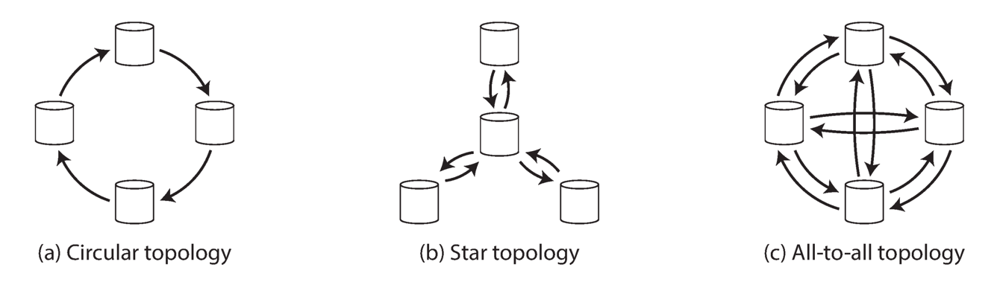

Fig.8. Three example topologies in which multi-leader replication can be set up.

最一般的拓扑是全互连（all-to-all），每个领导者把它所有的写入发给其它每个领导者。然而，也使用更受限的拓扑：例如，MySQL 默认只支持环形（circular）拓扑，每个节点从一个节点接收写入，并把那些写入（加上它自己的写入）转发给另一个节点。另一种流行的拓扑是星形（star）：一个指定的根节点把所有写入转发给所有其它节点。星形拓扑可推广为树。在环形和星形拓扑中，一次写入可能需要经过若干节点才能到达所有副本。因此，节点需要转发它们从其它节点收到的数据变更。为防止无限复制循环，每个节点被赋予唯一标识符，复制日志中每次写入都标有它所经过的所有节点的标识符。当节点收到标有它自己标识符的数据变更时，该变更被忽略，因为节点知道它已经被处理过。

环形和星形拓扑的一个问题是，只要一个节点失效，就可能中断其它节点间的复制消息流，使它们无法通信，直到该节点被修复。拓扑可以重新配置以绕过失效节点，但在大多数部署中这种重新配置必须手动完成。连接更密（如全互连）的拓扑容错性更好，因为它允许消息沿不同路径传播，避免单点故障。另一方面，全互连拓扑也有问题。特别是，某些网络链路可能比其它更快（例如由于网络拥塞），结果是某些复制消息可能“超过”其它消息，如图 9。

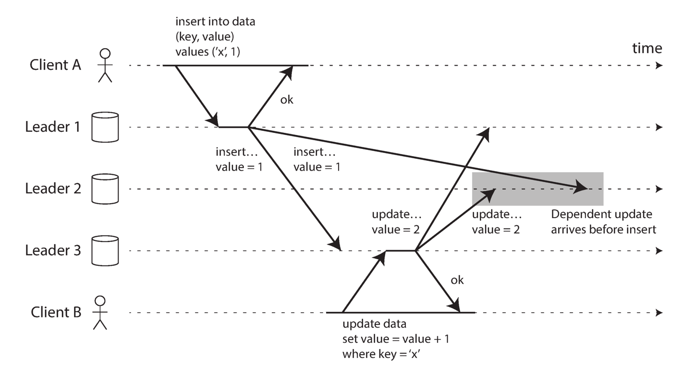

Fig.9. With multi-leader replication, writes may arrive in the wrong order at some replicas.

在图 9 中，客户端 A 在领导者 1 上向表中插入一行，客户端 B 在领导者 3 上更新那一行。然而，领导者 2 可能以不同顺序收到写入：它可能先收到更新（从它的视角看，是对数据库中不存在的一行的更新），只在之后才收到相应的插入（本应在更新之前）。

这是因果性的问题，类似于我们在“Consistent Prefix Reads”中看到的：更新依赖于先前的插入，所以我们需要确保所有节点先处理插入，再处理更新。简单地给每次写入附加时间戳并不充分，因为时钟不能被信任为足够同步以在领导者 2 上正确排序这些事件。

为了正确排序这些事件，可以使用一种称为版本向量（version vectors）的技术。然而，冲突检测技术在许多多领导者复制系统中实现得很差。例如，在撰写本文时，PostgreSQL BDR 不提供写入的因果排序，MySQL 的 Tungsten Replicator 甚至不尝试检测冲突。

如果你使用多领导者复制的系统，值得意识到这些问题，仔细阅读文档，并彻底测试你的数据库，确保它真的提供你所认为的保证。

## 无领导者复制

我们在本章讨论过的复制方法——单领导者和多领导者——基于这样的想法：客户端把写请求发给一个节点（领导者），数据库系统负责把该写入复制到其它副本。领导者决定写入应被处理的顺序，跟随者按相同顺序应用领导者的写入。

一些数据存储采取不同的方法，放弃领导者的概念，允许任何副本直接接受客户端的写入。最早的复制数据系统中一些是无领导者的，但这个想法在关系型数据库主导的时代基本被遗忘。在 Amazon 把它用于内部 Dynamo 系统后，它再次成为数据库的流行架构。Riak、Cassandra、Voldemort 是受 Dynamo 启发的、采用无领导者复制模型的开源数据存储，因此这类数据库也称为 Dynamo 风格（Dynamo-style）。

在某些无领导者实现中，客户端直接把写入发给若干副本，而在其它实现中，由一个协调者（coordinator）节点代客户端做这件事。然而，与领导者数据库不同，那个协调者不强制写入的特定顺序。正如我们将看到的，这个设计差异对数据库的使用方式有深远影响。

### 节点宕机时写入数据库（Writing to the Database When a Node Is Down）

想象你有 3 个副本的数据库，其中一个副本当前不可用——也许它正在重启以安装系统更新。在基于领导者的配置中，如果你想继续处理写入，可能需要执行故障转移。

另一方面，在无领导者配置中，不存在故障转移。图 10 展示了发生的情况：客户端（用户 1234）并行把写入发给全部三个副本，两个可用副本接受了写入，但不可用的副本错过了它。假设三个副本中有两个确认写入就足够了：用户 1234 收到两个 ok 响应后，我们认为写入成功。客户端干脆忽略其中一个副本错过写入的事实。

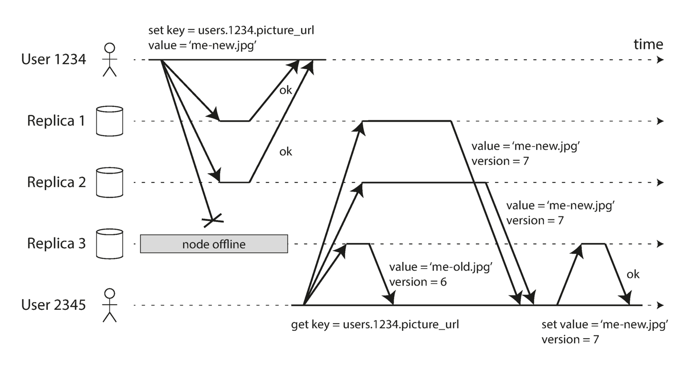

Fig.10. A quorum write, quorum read, and read repair after a node outage.

现在想象不可用的节点重新上线，客户端开始从它读取。该节点宕机期间发生的任何写入在它上面都缺失。因此，如果你从那个节点读取，你可能得到过时（陈旧）的值作为响应。

为了解决这个问题，当客户端从数据库读取时，它不只把请求发给一个副本：读请求也并行发给若干节点。客户端可能从不同节点得到不同响应；即一个节点上的最新值，和另一个节点上的陈旧值。版本号被用来确定哪个值更新。

读修复与反熵（Read repair and anti-entropy）

复制方案应确保最终所有数据都被复制到每个副本。不可用的节点重新上线后，它如何追上错过的写入？

Dynamo 风格的数据存储常使用两种机制：

- 读修复（Read repair）
  当客户端并行从若干节点读取时，它可以检测到任何陈旧响应。例如，在图 10 中，用户 2345 从副本 3 得到版本 6 的值，从副本 1 和 2 得到版本 7 的值。客户端看到副本 3 有陈旧值，把新值写回那个副本。这种方法对频繁读取的值很有效。
- 反熵过程（Anti-entropy process）
  此外，一些数据存储有一个后台进程，不断查找副本间的数据差异，并把缺失数据从一个副本复制到另一个。与基于领导者的复制中的复制日志不同，这个反熵过程不以任何特定顺序复制写入，数据被复制前可能有显著延迟。

并非所有系统都实现这两种机制；例如，Voldemort 当前没有反熵过程。注意，没有反熵过程，很少被读取的值可能在某些副本上缺失，因此持久性降低，因为读修复只在应用读取某个值时才执行。

读写法定人数（Quorums for reading and writing）

在图 10 的例子中，尽管写入只在三个副本中的两个上被处理，我们仍认为它成功。如果三个副本中只有一个接受了写入呢？我们能推到什么程度？

如果我们知道每次成功的写入都保证至少存在于三个副本中的两个上，那意味着最多一个副本可能是陈旧的。因此，如果我们至少从两个副本读取，我们可以确信其中至少一个是最新的。如果第三个副本宕机或响应慢，读取仍然可以继续返回最新值。

更一般地说，如果有 n 个副本，每次写入必须被 w 个节点确认才视为成功，每次读取必须查询至少 r 个节点。（在我们的例子中，n = 3，w = 2，r = 2。）只要 w + r > n，我们预期读取时能得到最新值，因为我们在读取的 r 个节点中至少有一个是最新的。服从这些 r 和 w 值的读写称为法定人数读写（quorum reads and writes）。你可以把 r 和 w 看作读写有效所需的最少票数。

在 Dynamo 风格的数据库中，参数 n、w、r 通常是可配置的。常见选择是让 n 为奇数（通常 3 或 5），并设 w = r = (n + 1) / 2（向上取整）。然而，你可以按需改变数字。例如，写少读多的工作负载可能受益于设 w = n 且 r = 1。这让读取更快，但缺点是一个失效节点就会导致所有数据库写入失败。

> 集群中可能有超过 n 个节点，但任何给定值只存储在 n 个节点上。这允许数据集被分区，支持比单个节点能容纳的更大的数据集。

法定人数条件 w + r > n 让系统能如下容忍不可用节点：

- 如果 w < n，即使某个节点不可用，我们仍能处理写入。
- 如果 r < n，即使某个节点不可用，我们仍能处理读取。
- n = 3，w = 2，r = 2 时，我们可以容忍一个不可用节点。
- n = 5，w = 3，r = 3 时，我们可以容忍两个不可用节点。这种情况如图 11 所示。
- 通常，读写总是并行发给所有 n 个副本。参数 w 和 r 决定我们等待多少个节点——即需要多少个 n 节点报告成功，我们才认为读写成功。

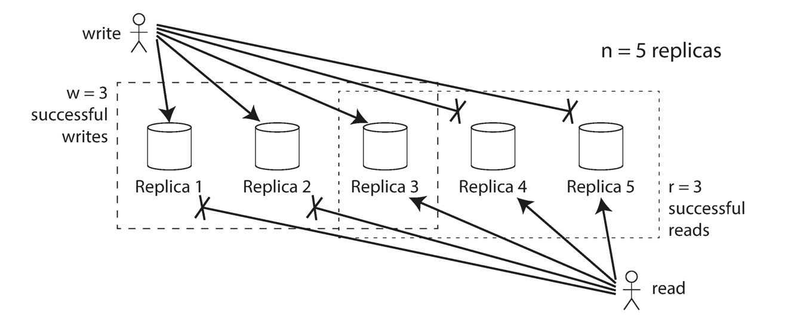

Fig.11. If w + r > n, at least one of the r replicas you read from must have seen the most recent successful write.

如果可用的节点少于所需的 w 或 r，写或读返回错误。一个节点可能因许多原因不可用：节点宕机（崩溃、断电）、执行操作出错（磁盘满无法写）、客户端与节点间网络中断，或任何其它原因。我们只关心节点是否返回了成功响应，无需区分故障的种类。

### 法定人数一致性的局限（Limitations of Quorum Consistency）

如果你有 n 个副本，并选择 w 和 r 使得 w + r > n，你通常可以预期每次读取都返回某键最新写入的值。这是因为你写入的节点集合与你读取的节点集合必然重叠。也就是说，在你读取的节点中至少有一个带有最新值（如图 11）。通常，r 和 w 选为节点的多数（超过 n/2），因为这保证 w + r > n，同时仍能容忍最多 n/2 个节点失效。但法定人数不一定是多数——重要的是读写操作使用的节点集合至少在一个节点上重叠。其它法定人数分配也是可能的，这给分布式算法的设计留有一些灵活性。你也可以把 w 和 r 设得更小，使 w + r ≤ n（即不满足法定人数条件）。这种情况下，读写仍会发给 n 个节点，但操作成功只需要更少数量的成功响应。使用更小的 w 和 r，你更可能读到陈旧值，因为你的读取更可能没包含带有最新值的节点。好的一面是，这种配置允许更低延迟和更高可用性：如果发生网络中断、许多副本变得不可达，你继续处理读写的机会更大。只有当可达副本数跌到 w 或 r 以下时，数据库才分别变得不可写或不可读。

然而，即使 w + r > n，仍可能有返回陈旧值的边界情况。这些取决于实现，但可能的场景包括：

- 如果使用了松散法定人数（sloppy quorum），w 次写入最终所在的节点可能与 r 次读取的节点不同，因此 r 节点与 w 节点之间不再保证重叠。
- 如果两次写入并发发生，不清楚哪个先发生。这种情况下，唯一安全的解决方案是合并并发写入。如果基于时间戳（最后写入获胜）选胜者，由于时钟偏移，写入可能丢失。
- 如果一次写入与一次读取并发发生，写入可能只反映在某些副本上。这种情况下，读取返回旧值还是新值是不确定的。
- 如果一次写入在某些副本成功、在其它副本失败（例如某些节点磁盘满），且总体上成功数少于 w 个副本，它在成功的副本上不会被回滚。这意味着，如果一次写入被报告为失败，后续读取可能返回、也可能不返回该写入的值。
- 如果携带新值的节点失效，其数据从携带旧值的副本恢复，那么存储新值的副本数可能跌到 w 以下，破坏法定人数条件。
- 即使一切正常，仍有某些时机不幸的边界情况，我们将在“Linearizability and quorums”中看到。

因此，尽管法定人数看似保证读取返回最新写入的值，实践中并非如此简单。Dynamo 风格的数据库通常针对能容忍最终一致性的用例优化。参数 w 和 r 让你能调整读到陈旧值的概率，但明智的做法是不要把它们当作绝对保证。

特别地，你通常得不到“Replication Lag”中讨论的那些保证（读己之所写、单调读、或一致前缀读），所以前面提到的异常可能在应用中发生。更强的保证通常需要事务或共识。

### 监控陈旧度（Monitoring staleness）

从运维角度，监控你的数据库是否返回最新结果很重要。即使你的应用能容忍陈旧读取，你也需要了解复制的健康状况。如果它严重落后，它应该告警你，以便调查原因（例如网络问题或节点过载）。

对于基于领导者的复制，数据库通常暴露复制延迟的指标，你可以喂给监控系统。这是可能的，因为写入以相同顺序应用到领导者和跟随者，每个节点在复制日志中有一个位置（它本地已应用写入的数量）。用领导者的当前位置减去跟随者的当前位置，你可以衡量复制延迟的大小。然而，在无领导者复制的系统中，写入没有固定的应用顺序，这让监控更困难。此外，如果数据库只使用读修复（没有反熵），陈旧值可能有多旧没有上限——如果一个值很少被读，陈旧副本返回的值可能非常古老。已有一些关于测量无领导者复制数据库副本陈旧度、并根据参数 n、w、r 预测预期陈旧读取比例的研究。遗憾的是这尚未成为普遍实践，但把陈旧度测量纳入数据库的标准指标集是件好事。最终一致性是一个故意含糊的保证，但为了可运维性，能够量化“最终”很重要。

### 松散法定人数与暗示移交（Sloppy Quorums and Hinted Handoff）

配置了适当法定人数的数据库可以容忍单个节点失效，无需故障转移。它们也能容忍单个节点变慢，因为请求不必等待所有 n 个节点响应——当 w 或 r 个节点响应时就可以返回。这些特性让无领导者复制的数据库对需要高可用、低延迟、且能容忍偶发陈旧读取的用例很有吸引力。

然而，法定人数（如前所述）并不像它可能的那样容错。网络中断可以轻易地把客户端与大量数据库节点切断。尽管那些节点还活着，其它客户端可能能连上它们，但对被切断的客户端而言，它们形同死亡。这种情况下，很可能剩不到 w 或 r 个可达节点，于是客户端再也无法达成法定人数。

在大型集群（节点远多于 n）中，网络中断期间客户端很可能连上某些数据库节点，只是连不上它为了某个值拼凑法定人数所需的那些节点。这种情况下，数据库设计者面临权衡：

- 是对所有无法达成 w 或 r 法定人数的请求返回错误更好？
- 还是应该照常接受写入，把它们写到某些可达、却不在该值通常所在的 n 个“家（home）”节点上的节点？

后者称为松散法定人数（sloppy quorum）：写入和读取仍需要 w 和 r 个成功响应，但这些可能包括不在该值指定的 n 个“家”节点中的节点。类比地说，如果你把自己锁在门外，你可以敲邻居的门，问能否暂时借宿沙发。

一旦网络中断修复，任何节点临时代另一个节点接受的写入都会被发给恰当的“家”节点。这称为暗示移交（hinted handoff）。（一旦你又找到房子的钥匙，邻居礼貌地请你离开沙发回家。）松散法定人数对提高写可用性特别有用：只要有任意 w 个节点可用，数据库就能接受写入。然而，这意味着即使 w + r > n，你也不能确保读到某键的最新值，因为最新值可能临时被写到了 n 之外的某些节点。因此，松散法定人数实际上根本不是传统意义上的法定人数。它只是持久性的保证，即数据被存在某处的 w 个节点上。在暗示移交完成之前，不能保证对 r 个节点的读取能看到它。松散法定人数在所有常见的 Dynamo 实现中都是可选的。在 Riak 中默认启用，在 Cassandra 和 Voldemort 中默认禁用。

#### 多数据中心运行（Multi-datacenter operation）

我们前面把跨数据中心复制作为多领导者复制的用例讨论过。无领导者复制也适合多数据中心运行，因为它被设计成容忍冲突的并发写入、网络中断和延迟尖峰。

Cassandra 和 Voldemort 在普通无领导者模型内实现它们的多数据中心支持：副本数 n 包含在所有数据中心的节点，配置中可以指定你希望每个数据中心有多少 n 个副本。来自客户端的每次写入都被发给所有副本（无论数据中心），但客户端通常只等待其本地数据中心内一个节点法定人数的确认，这样它不受跨数据中心链路的延迟和中断影响。

到其它数据中心的较高延迟写入通常配置为异步发生，尽管配置上有一些灵活性。Riak 让客户端与数据库节点间的所有通信都局限在单个数据中心，因此 n 描述单个数据中心内的副本数。数据库集群间的跨数据中心复制在后台异步发生，风格类似于多领导者复制。

## 并发写入（Concurrent Writes）

### 检测并发写入（Detecting Concurrent Writes）

Dynamo 风格的数据库允许多个客户端并发写入同一个键，这意味着即使使用严格法定人数也会发生冲突。情况类似于多领导者复制，尽管在 Dynamo 风格的数据库中，冲突也可能在读取修复或暗示移交期间产生。

问题是，由于多变网络延迟和部分失效，事件可能以不同顺序到达不同节点。例如，图 12 展示两个客户端 A 和 B 同时向三节点数据存储中的键 X 写入：

- 节点 1 收到 A 的写入，但由于瞬时中断从未收到 B 的写入。
- 节点 2 先收到 A 的写入，然后收到 B 的写入。
- 节点 3 先收到 B 的写入，然后收到 A 的写入。

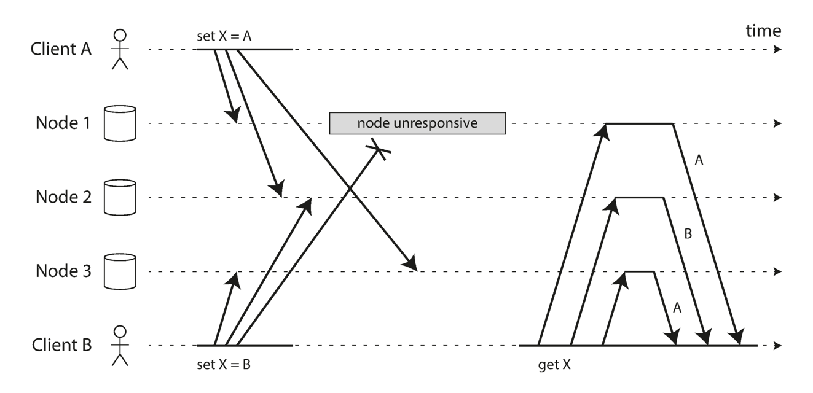

Fig.12. Concurrent writes in a Dynamo-style datastore: there is no well-defined ordering.

如果每个节点收到客户端写入请求就简单地覆盖该键的值，节点会永久不一致，正如图 12 中最后的 get 请求所示：节点 2 认为 X 的最终值是 B，而其它节点认为是 A。

为了最终一致，副本应该收敛到相同的值。它们如何做到？有人可能希望复制数据库会自动处理，但不幸的是大多数实现相当差：如果你想避免丢数据，你——应用开发者——需要大量了解数据库冲突处理的内部。

我们简要提及了一些冲突解决技术。在结束本章前，让我们更详细地探讨这个问题。

#### 最后写入获胜（丢弃并发写入）（Last write wins (discarding concurrent writes)）

实现最终收敛的一种方法是声明每个副本只需存储最“近”的值，并允许“较旧”的值被覆盖和丢弃。那么，只要我们有某种方式明确判定哪次写入更“近”，且每次写入最终都被复制到每个副本，副本最终会收敛到相同值。

正如“近”字上的引号所示，这个想法实际上相当误导。在图 12 的例子中，两个客户端发送写入请求时都不知道另一个，所以不清楚哪个先发生。事实上，说哪个“先”发生并没有意义：我们说这些写入是并发的，因此它们的顺序未定义。

尽管写入没有自然顺序，我们可以强制给它们一个任意顺序。例如，我们可以给每次写入附加时间戳，选最大的时间戳为最“近”，丢弃任何更早时间戳的写入。这个冲突解决算法称为最后写入获胜（LWW，last write wins），是 Cassandra 唯一支持的冲突解决方法，也是 Riak 的一个可选特性。LWW 实现了最终收敛的目标，但代价是持久性：如果对同一键有若干并发写入，即使它们都被报告为对客户端成功（因为它们被写入了 w 个副本），也只有一次写入会存活，其它会被悄悄丢弃。而且，LWW 甚至可能丢弃非并发的写入。有些情况（如缓存）中丢失写入也许可以接受。如果丢失数据不可接受，LWW 是糟糕的冲突解决选择。使用带 LWW 的数据库唯一安全的方式是确保一个键只被写入一次、此后视为不可变，从而避免对同一键的任何并发更新。例如，使用 Cassandra 的推荐方式是使用 UUID 作为键，从而给每次写入操作一个唯一键。

#### "happens-before" 关系与并发（The "happens-before" relationship and concurrency）

我们如何判定两个操作是否并发？为建立直觉，看几个例子：

- 在图 9 中，两次写入不是并发的：A 的插入发生在 B 的递增之前，因为 B 递增的值就是 A 插入的值。换言之，B 的操作建立在 A 的操作之上，所以 B 的操作必然更晚。我们也说 B 因果依赖于（causally dependent on）A。
- 另一方面，图 12 中的两次写入是并发的：当每个客户端开始操作时，它不知道另一个客户端也在对同一个键操作。因此，操作之间没有因果依赖。

如果操作 B 知道、依赖或建立在操作 A 之上，则操作 A 发生在（happens before）操作 B 之前。一个操作是否发生在另一个之前，是定义“并发”含义的关键。事实上，我们可以简单说：如果两个操作互不发生在对方之前（即互不认识对方），它们就是并发的。

因此，无论何时你有两个操作 A 和 B，有三种可能：要么 A 发生在 B 之前，要么 B 发生在 A 之前，要么 A 和 B 并发。我们需要一个算法来判断两个操作是否并发。如果一个操作发生在另一个之前，较晚的操作应覆盖较早的操作；但如果操作是并发的，我们就有一个需要解决的冲突。

#### 捕获 happens-before 关系（Capturing the happens-before relationship）

让我们看一个判断两个操作是并发、还是一个发生在另一个之前的算法。为简单起见，从一个只有一个副本的数据库开始。一旦弄清楚如何在单个副本上做，我们就可以把方法推广到多副本的无领导者数据库。图 13 展示两个客户端并发向同一个购物车添加商品。（如果这个例子显得太无聊，可以想象两个空中交通管制员并发向它们追踪的扇区添加飞机。）最初，购物车为空。在它们之间，客户端对数据库做了五次写入：

1. 客户端 1 向购物车添加牛奶。这是对该键的第一次写入，所以服务器成功存储它并分配版本 1。服务器还把值和版本号一起回显给客户端。
2. 客户端 2 向购物车添加鸡蛋，不知道客户端 1 并发添加了牛奶（客户端 2 以为它的鸡蛋是购物车里唯一的商品）。服务器给这次写入分配版本 2，并把鸡蛋和牛奶作为两个独立值存储。然后它把两个值和版本号 2 一起返回给客户端。
3. 客户端 1 对客户端 2 的写入毫不知情，想向购物车添加面粉，所以它认为当前购物车内容应该是 [牛奶, 面粉]。它把这个值连同服务器先前给客户端 1 的版本号 1 一起发给服务器。服务器可以从版本号判断，[牛奶, 面粉] 的写入取代先前的值 [牛奶]，但与 [鸡蛋] 并发。因此，服务器给 [牛奶, 面粉] 分配版本 3，覆盖版本 1 的值 [牛奶]，但保留版本 2 的值 [鸡蛋]，并把两个剩余值返回给客户端。
4. 同时，客户端 2 想添加火腿，不知道客户端 1 刚加了面粉。客户端 2 在上次响应中从服务器收到两个值 [牛奶] 和 [鸡蛋]，所以客户端现在合并那些值并加上火腿形成新值 [鸡蛋, 牛奶, 火腿]。它把那个值连同先前的版本号 2 发给服务器。服务器检测到版本 2 覆盖 [鸡蛋] 但与 [牛奶, 面粉] 并发，所以两个剩余值是版本 3 的 [牛奶, 面粉] 和版本 4 的 [鸡蛋, 牛奶, 火腿]。
5. 最后，客户端 1 想添加培根。它先前在版本 3 收到服务器的 [牛奶, 面粉] 和 [鸡蛋]，所以合并它们，加上培根，把最终值 [牛奶, 面粉, 鸡蛋, 培根] 连同版本号 3 发给服务器。这覆盖了 [牛奶, 面粉]（注意 [鸡蛋] 已在最后一步被覆盖），但与 [鸡蛋, 牛奶, 火腿] 并发，所以服务器保留这两个并发值。

### 合并并发写入的值（Merging concurrently written values）

这个算法确保没有数据被悄悄丢弃，但不幸的是它要求客户端做一些额外工作：如果若干操作并发发生，客户端必须在事后通过合并并发写入的值来清理。Riak 称这些并发值为兄弟（siblings）。

合并兄弟值本质上与我们在多领导者复制中讨论的冲突解决是同一个问题。一种简单方法是仅基于版本号或时间戳（最后写入获胜）选一个值，但那意味着丢数据。所以，你可能需要在应用代码中做更智能的事。

以购物车为例，合并兄弟值的一个合理方法是直接取并集。在图 14 中，两个最终兄弟值是 [牛奶, 面粉, 鸡蛋, 培根] 和 [鸡蛋, 牛奶, 火腿]；注意牛奶和鸡蛋在两个中都出现，尽管它们各自只被写入一次。合并后的值可能是 [牛奶, 面粉, 鸡蛋, 培根, 火腿]，没有重复。

然而，如果你想允许人们也从购物车移除东西、而不只是添加，那么取兄弟值的并集可能得不到正确结果：如果你合并两个兄弟购物车、而某个商品只在其中一个中被移除，那么被移除的商品会在兄弟的并集里重新出现。为防止这个问题，移除商品时不能简单地从数据库删除；相反，系统必须留下一个带适当版本号的标记，指示合并兄弟时该商品已被移除。这种删除标记称为墓碑（tombstone）。由于合并兄弟值在应用代码中既复杂又容易出错，有一些努力在设计能自动合并兄弟值的数据结构。例如，Riak 的数据类型支持使用一族称为 CRDT 的数据结构，能自动以合理方式合并兄弟值，包括保留删除。

## 复制状态机（Replicated State Machines）

仅有冗余还不够；要变得有用，它必须被协调。最简单的方式是让每个非故障副本做相同的事。那么任何非故障副本都能提供输出；如果副本不是 fail-stop，要求 f 个副本给出相同输出将容忍 f – 1 个故障。更复杂的冗余（如纠错码）更便宜，但它们依赖于所提供服务的一些特殊性质。

## 总结（Summary）

我们讨论了三种主要的复制方法：

| Replication | Description |
| ------------------------------- | -------------------------------------------------------------------------------------------------------------------------------------------------------------------------------------------------------------------------- |
| **Single-leader replication** | 客户端把所有写入发给单个节点（领导者），领导者把数据变更事件流发给其它副本（跟随者）。  读取可以在任何副本上执行，但从跟随者读取可能过时。 |
| **Multi-leader replication** | 客户端把每次写入发给若干领导者节点之一，任何一个都可以接受写入。  领导者把数据变更事件流发给彼此以及任何跟随者节点。 |
| **Leaderless replication** | 客户端把每次写入发给若干节点，并并行从若干节点读取，以检测并纠正带有陈旧数据的节点。 |

每种方法都有优缺点。单领导者复制流行，因为它相当容易理解，且不用担心冲突解决。多领导者和无领导者复制在存在故障节点、网络中断和延迟尖峰时更健壮——代价是更难推理，且只提供非常弱的一致性保证。

复制可以是同步或异步，这在发生故障时对系统行为有深远影响。尽管异步复制在系统平稳运行时很快，但弄清复制延迟增加、服务器失效时会发生什么很重要。如果领导者失效、你把一个异步更新的跟随者提升为新领导者，最近提交的数据可能丢失。

我们看了一些可能由复制延迟引起的奇怪效果，并讨论了一些有助于决定应用应在复制延迟下如何表现的一致性模型：

| Replication lag | Description |
| ------------------------------ | ---------------------------------------------------------------------------------------------------------------------------------- |
| Read-after-write consistency | 用户应总是看到自己提交的数据。 |
| Monotonic reads | 用户在某时刻看到数据后，不应之后再看到更早时刻的数据。 |
| Consistent prefix reads | 用户应看到因果合理的状态：例如，按正确顺序看到问题和它的回答。 |

最后，我们讨论了多领导者和无领导者复制方法固有的一些并发问题：因为它们允许并发发生多个写入，可能产生冲突。我们考察了一个数据库可能用来判定一个操作是否发生在另一个之前、还是它们并发的算法。我们也触及了通过合并并发更新来解决冲突的方法。

## Links

- [Distributed Systems](/docs/CS/Distributed/Distributed.md)
- [Partitioning](/docs/CS/Distributed/Partition.md)

## References

1. [Chain Replication for Supporting High Throughput and Availability](https://www.cs.cornell.edu/home/rvr/papers/OSDI04.pdf)
