## Introduction

The only way to make a highly available system out of less available components is to use redundancy, so the system can work even when some of its parts are broken.
The simplest kind of redundancy is replication: make several copies or ‘replicas’ of each part.

There are several reasons why you might want to replicate data:

- To keep data geographically close to your users (and thus reduce latency)
- To allow the system to continue working even if some of its parts have failed (and thus increase availability)
- To scale out the number of machines that can serve read queries (and thus increase read throughput)

If the data that you’re replicating does not change over time, then replication is easy: you just need to copy the data to every node once, and you’re done.
All of the difficulty in replication lies in handling changes to replicated data.
We will discuss three popular algorithms for replicating changes between nodes: single-leader, multi-leader, and leaderless replication.
Almost all distributed databases use one of these three approaches.
There are many trade-offs to consider with replication: for example, whether to use synchronous or asynchronous replication, and how to handle failed replicas.
Those are often configuration options in databases, and although the details vary by database, the general principles are similar across many different implementations.

Fault-tolerance on commodity hardware can be achieved through replication.
A common approach is to use a consensus algorithm to ensure that all replicas are mutually consistent.
By repeatedly applying such an algorithm on a sequence of input values, it is possible to build an identical log of values on each replica.
If the values are operations on some data structure, application of the same log on all replicas may be used to arrive at mutually consistent data structures on all replicas.
For instance, if the log contains a sequence of database operations, and if the same sequence of operations is applied to the (local) database on each replica,
eventually all replicas will end up with the same database content (provided that they all started with the same initial database state).

## Leaders and Followers

Each node that stores a copy of the database is called a replica. With multiple replicas, a question inevitably arises: how do we ensure that all the data ends up on all the replicas?

Every write to the database needs to be processed by every replica; otherwise, the replicas would no longer contain the same data.
The most common solution for this is called leader-based replication (also known as active/passive or master–slave replication) and is illustrated in Figure 1. It works as follows:

1. One of the replicas is designated the leader (also known as master or primary).
   When clients want to write to the database, they must send their requests to the leader, which first writes the new data to its local storage.
2. The other replicas are known as followers (read replicas, slaves, secondaries, or hot standbys).i Whenever the leader writes new data to its local storage, it also sends the data change to all of its followers as part of a replication log or change stream.
   Each follower takes the log from the leader and updates its local copy of the database accordingly, by applying all writes in the same order as they were processed on the leader.
3. When a client wants to read from the database, it can query either the leader or any of the followers. However, writes are only accepted on the leader (the followers are read-only from the client’s point of view).

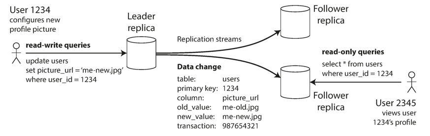

Fig.1. Leader-based (master–slave) replication.

This mode of replication is a built-in feature of many relational databases, such as PostgreSQL (since version 9.0), MySQL, Oracle Data Guard, and SQL Server’s AlwaysOn Availability Groups.
It is also used in some nonrelational databases, including MongoDB, RethinkDB, and Espresso.
Finally, leader-based replication is not restricted to only databases: distributed message brokers such as Kafka and RabbitMQ highly available queues also use it.
Some network filesystems and replicated block devices such as DRBD are similar.

### Synchronous Versus Asynchronous Replication

An important detail of a replicated system is whether the replication happens synchronously or asynchronously.
(In relational databases, this is often a configurable option; other systems are often hardcoded to be either one or the other.)
Think about what happens in Figure 1, where the user of a website updates their profile image.
At some point in time, the client sends the update request to the leader; shortly afterward, it is received by the leader. At some point, the leader forwards the data change to the followers.
Eventually, the leader notifies the client that the update was successful.

Figure 2 shows the communication between various components of the system: the user’s client, the leader, and two followers. Time flows from left to right.
A request or response message is shown as a thick arrow.

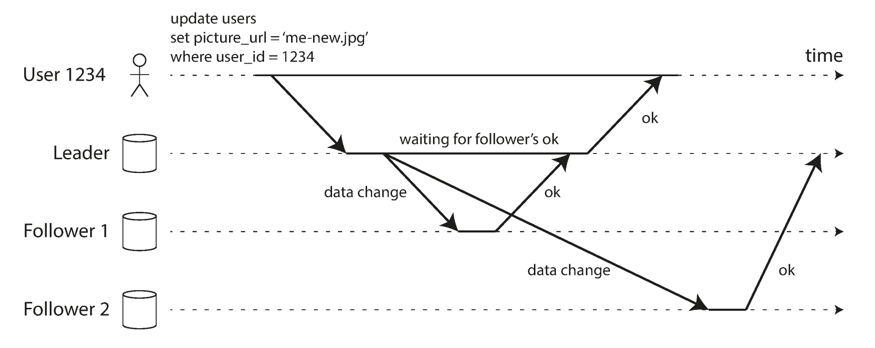

Fig.2. Leader-based replication with one synchronous and one asynchronous follower.

In the example of Figure 2, the replication to follower 1 is synchronous: the leader waits until follower 1 has confirmed that it received the write before reporting success to the user, and before making the write visible to other clients.
The replication to follower 2 is asynchronous: the leader sends the message, but doesn’t wait for a response from the follower.

The diagram shows that there is a substantial delay before follower 2 processes the message.
Normally, replication is quite fast: most database systems apply changes to followers in less than a second.
However, there is no guarantee of how long it might take.
There are circumstances when followers might fall behind the leader by several minutes or more; for example, if a follower is recovering from a failure, if the system is operating near maximum capacity, or if there are network problems between the nodes.

The advantage of synchronous replication is that the follower is guaranteed to have an up-to-date copy of the data that is consistent with the leader.
If the leader suddenly fails, we can be sure that the data is still available on the follower.
The disadvantage is that if the synchronous follower doesn’t respond (because it has crashed, or there is a network fault, or for any other reason), the write cannot be processed.
The leader must block all writes and wait until the synchronous replica is available again.
For that reason, it is impractical for all followers to be synchronous: any one node outage would cause the whole system to grind to a halt.
In practice, if you enable synchronous replication on a database, it usually means that one of the followers is synchronous, and the others are asynchronous.
If the synchronous follower becomes unavailable or slow, one of the asynchronous followers is made synchronous.
This guarantees that you have an up-to-date copy of the data on at least two nodes: the eader and one synchronous follower. This configuration is sometimes also called semi-synchronous.

Often, leader-based replication is configured to be completely asynchronous.
In this case, if the leader fails and is not recoverable, any writes that have not yet been replicated to followers are lost. This means that a write is not guaranteed to be durable, even if it has been confirmed to the client.
However, a fully asynchronous configuration has the advantage that the leader can continue processing writes, even if all of its followers have fallen behind.

Weakening durability may sound like a bad trade-off, but asynchronous replication is nevertheless widely used, especially if there are many followers or if they are geographically distributed.

From time to time, you need to set up new followers—perhaps to increase the number of replicas, or to replace failed nodes.
How do you ensure that the new follower has an accurate copy of the leader’s data?
Simply copying data files from one node to another is typically not sufficient: clients are constantly writing to the database, and the data is always in flux, so a standard file copy would see different parts of the database at different points in time.
The result might not make any sense.
You could make the files on disk consistent by locking the database (making it unavailable for writes), but that would go against our goal of high availability.
Fortunately, setting up a follower can usually be done without downtime.
Conceptually, the process looks like this:

1. Take a consistent snapshot of the leader’s database at some point in time—if possible, without taking a lock on the entire database.
   Most databases have this feature, as it is also required for backups.
   In some cases, third-party tools are needed, such as innobackupex for MySQL.
2. Copy the snapshot to the new follower node.
3. The follower connects to the leader and requests all the data changes that have happened since the snapshot was taken.
   This requires that the snapshot is associated with an exact position in the leader’s replication log.
   That position has various names: for example, PostgreSQL calls it the log sequence number, and MySQL calls it the binlog coordinates.
4. When the follower has processed the backlog of data changes since the snapshot, we say it has caught up.
   It can now continue to process data changes from the leader as they happen.

The practical steps of setting up a follower vary significantly by database.
In some systems the process is fully automated, whereas in others it can be a somewhat arcane multi-step workflow that needs to be manually performed by an administrator.

### Handling Node Outages

Any node in the system can go down, perhaps unexpectedly due to a fault, but just as likely due to planned maintenance (for example, rebooting a machine to install a kernel security patch).
Being able to reboot individual nodes without downtime is a big advantage for operations and maintenance.
Thus, our goal is to keep the system as a whole running despite individual node failures, and to keep the impact of a node outage as small as possible.
How do you achieve high availability with leader-based replication?

#### Follower failure: Catch-up recovery

On its local disk, each follower keeps a log of the data changes it has received from the leader.
If a follower crashes and is restarted, or if the network between the leader and the follower is temporarily interrupted, the follower can recover quite easily: from its log, it knows the last transaction that was processed before the fault occurred.
Thus, the follower can connect to the leader and request all the data changes that occurred during the time when the follower was disconnected.
When it has applied these changes, it has caught up to the leader and can continue receiving a stream of data changes as before.

#### Leader failure: Failover

Handling a failure of the leader is trickier: one of the followers needs to be promoted to be the new leader, clients need to be reconfigured to send their writes to the new leader, and the other followers need to start consuming data changes from the new leader.
This process is called failover.
Failover can happen manually (an administrator is notified that the leader has failed
and takes the necessary steps to make a new leader) or automatically. An automatic
failover process usually consists of the following steps:

1. Determining that the leader has failed. There are many things that could potentially go wrong: crashes, power outages, network issues, and more.
   There is no foolproof way of detecting what has gone wrong, so most systems simply use a timeout: nodes frequently bounce messages back and forth between each other, and if a node doesn’t respond for some period of time—say, 30 seconds—it is assumed to be dead.
   (If the leader is deliberately taken down for planned maintenance, this doesn’t apply.)
2. Choosing a new leader. This could be done through an election process (where the leader is chosen by a majority of the remaining replicas), or a new leader could be appointed by a previously elected controller node.
   The best candidate for leadership is usually the replica with the most up-to-date data changes from the old leader (to minimize any data loss).
   Getting all the nodes to agree on a new leader is a consensus problem, discussed in detail in Chapter 9.
3. Reconfiguring the system to use the new leader. Clients now need to send their write requests to the new leader (we discuss this in “Request Routing” on page 214).
   If the old leader comes back, it might still believe that it is the leader, not realizing that the other replicas have forced it to step down.
   The system needs to ensure that the old leader becomes a follower and recognizes the new leader.

Failover is fraught with things that can go wrong:

- If asynchronous replication is used, the new leader may not have received all the writes from the old leader before it failed.
  If the former leader rejoins the cluster after a new leader has been chosen, what should happen to those writes?
  The new leader may have received conflicting writes in the meantime.
  The most common solution is for the old leader’s unreplicated writes to simply be discarded, which may violate clients’ durability expectations.
- Discarding writes is especially dangerous if other storage systems outside of the database need to be coordinated with the database contents.
  For example, in one incident at GitHub, an out-of-date MySQL follower was promoted to leader.
  The database used an autoincrementing counter to assign primary keys to new rows, but because the new leader’s counter lagged behind the old leader’s, it reused some primary keys that were previously assigned by the old leader.
  These primary keys were also used in a Redis store, so the reuse of primary keys resulted in inconsistency between MySQL and Redis, which caused some private data to be disclosed to the wrong users.
- In certain fault scenarios (see Chapter 8), it could happen that two nodes both believe that they are the leader. This situation is called split brain, and it is dangerous: if both leaders accept writes, and there is no process for resolving conflicts (see “Multi-Leader Replication” on page 168), data is likely to be lost or corrupted.
  As a safety catch, some systems have a mechanism to shut down one node if two leaders are detected.ii However, if this mechanism is not carefully designed, you can end up with both nodes being shut down.
- What is the right timeout before the leader is declared dead? A longer timeout means a longer time to recovery in the case where the leader fails.
  However, if the timeout is too short, there could be unnecessary failovers.
  For example, a temporary load spike could cause a node’s response time to increase above the timeout, or a network glitch could cause delayed packets.
  If the system is already struggling with high load or network problems, an unnecessary failover is likely to make the situation worse, not better.

There are no easy solutions to these problems.
For this reason, some operations teams prefer to perform failovers manually, even if the software supports automatic failover.
These issues—node failures; unreliable networks; and trade-offs around replica consistency, durability, availability, and latency—are in fact fundamental problems in distributed systems.

## Replication Logs

How does leader-based replication work under the hood? Several different replication methods are used in practice, so let’s look at each one briefly.

### Statement-based replication

In the simplest case, the leader logs every write request (statement) that it executes and sends that statement log to its followers.
For a relational database, this means that every INSERT, UPDATE, or DELETE statement is forwarded to followers, and each follower parses and executes that SQL statement as if it had been received from a client.
Although this may sound reasonable, there are various ways in which this approach to replication can break down:

- Any statement that calls a nondeterministic function, such as NOW() to get the current date and time or RAND() to get a random number, is likely to generate a different value on each replica.
- If statements use an autoincrementing column, or if they depend on the existing data in the database (e.g., UPDATE … WHERE <some condition>), they must be executed in exactly the same order on each replica, or else they may have a different effect.
  This can be limiting when there are multiple concurrently executing transactions.
- Statements that have side effects (e.g., triggers, stored procedures, user-defined functions) may result in different side effects occurring on each replica, unless the side effects are absolutely deterministic.

It is possible to work around those issues—for example, the leader can replace any nondeterministic function calls with a fixed return value when the statement is logged so that the followers all get the same value.
However, because there are so many edge cases, other replication methods are now generally preferred.
Statement-based replication was used in MySQL before version 5.1.
It is still sometimes used today, as it is quite compact, but by default MySQL now switches to rowbased replication if there is any nondeterminism in a statement.
VoltDB uses statement-based replication, and makes it safe by requiring transactions to be deterministic.

### Write-ahead log (WAL) shipping

We discussed how storage engines represent data on disk, and we found that usually every write is appended to a log:

- In the case of a log-structured storage engine, this log is the main place for storage. Log segments are compacted and garbage-collected in the background.
- In the case of a B-tree, which overwrites individual disk blocks, every modification is first written to a write-ahead log so that the index can be restored to a consistent state after a crash.

In either case, the log is an append-only sequence of bytes containing all writes to the database.
We can use the exact same log to build a replica on another node: besides writing the log to disk, the leader also sends it across the network to its followers.
When the follower processes this log, it builds a copy of the exact same data structures as found on the leader.

This method of replication is used in PostgreSQL and Oracle, among others.
The main disadvantage is that the log describes the data on a very low level: a WAL contains details of which bytes were changed in which disk blocks.
This makes replication closely coupled to the storage engine.
If the database changes its storage format from one version to another, it is typically not possible to run different versions of the database software on the leader and the followers.
That may seem like a minor implementation detail, but it can have a big operational impact.
If the replication protocol allows the follower to use a newer software version than the leader, you can perform a zero-downtime upgrade of the database software by first upgrading the followers and then performing a failover to make one of the upgraded nodes the new leader.
If the replication protocol does not allow this version mismatch, as is often the case with WAL shipping, such upgrades require downtime.

### Logical (row-based) log replication

An alternative is to use different log formats for replication and for the storage engine, which allows the replication log to be decoupled from the storage engine internals.
This kind of replication log is called a *logical log*, to distinguish it from the storage engine’s (physical) data representation.
A logical log for a relational database is usually a sequence of records describing writes to database tables at the granularity of a row:

- For an inserted row, the log contains the new values of all columns.
- For a deleted row, the log contains enough information to uniquely identify the row that was deleted.
  Typically this would be the primary key, but if there is no primary key on the table, the old values of all columns need to be logged.
- For an updated row, the log contains enough information to uniquely identify the updated row, and the new values of all columns (or at least the new values of all columns that changed).

A transaction that modifies several rows generates several such log records, followed by a record indicating that the transaction was committed.
MySQL’s binlog (when configured to use row-based replication) uses this approach.
Since a logical log is decoupled from the storage engine internals, it can more easily be kept backward compatible, allowing the leader and the follower to run different versions of the database software, or even different storage engines.
A logical log format is also easier for external applications to parse.
This aspect is useful if you want to send the contents of a database to an external system, such as a data warehouse for offline analysis, or for building custom indexes and caches.
This technique is called *change data capture*.

### Trigger-based replication

The replication approaches described so far are implemented by the database system, without involving any application code.
In many cases, that’s what you want—but there are some circumstances where more flexibility is needed.
For example, if you want to only replicate a subset of the data, or want to replicate from one kind of database to another, or if you need conflict resolution logic, then you may need to move replication up to the application layer.

Some tools, such as Oracle GoldenGate, can make data changes available to an application by reading the database log.
An alternative is to use features that are available in many relational databases: triggers and stored procedures.
A trigger lets you register custom application code that is automatically executed when a data change (write transaction) occurs in a database system.
The trigger has the opportunity to log this change into a separate table, from which it can be read by an external process.
That external process can then apply any necessary application logic and replicate the data change to another system.
Databus for Oracle and Bucardo for Postgres work like this, for example.
Trigger-based replication typically has greater overheads than other replication methods, and is more prone to bugs and limitations than the database’s built-in replication.
However, it can nevertheless be useful due to its flexibility.

## Replication Lag

Being able to tolerate node failures is just one reason for wanting replication.
As mentioned in the introduction to Part II, other reasons are scalability (processing more requests than a single machine can handle) and latency (placing replicas geographically closer to users).
Leader-based replication requires all writes to go through a single node, but readonly queries can go to any replica.
For workloads that consist of mostly reads and only a small percentage of writes (a common pattern on the web), there is an attractive option: create many followers, and distribute the read requests across those followers.
This removes load from the leader and allows read requests to be served by nearby replicas.
In this read-scaling architecture, you can increase the capacity for serving read-only requests simply by adding more followers.
However, this approach only realistically works with asynchronous replication—if you tried to synchronously replicate to all followers, a single node failure or network outage would make the entire system unavailable for writing.
And the more nodes you have, the likelier it is that one will be down, so a fully synchronous configuration would be very unreliable.

Unfortunately, if an application reads from an asynchronous follower, it may see outdated information if the follower has fallen behind.
This leads to apparent inconsistencies in the database: if you run the same query on the leader and a follower at the same time, you may get different results, because not all writes have been reflected in the follower.
This inconsistency is just a temporary state—if you stop writing to the database and wait a while, the followers will eventually catch up and become consistent with the leader.
For that reason, this effect is known as *eventual consistency*.

The term “eventually” is deliberately vague: in general, there is no limit to how far a replica can fall behind.
In normal operation, the delay between a write happening on the leader and being reflected on a follower—the *replication lag*—may be only a fraction of a second, and not noticeable in practice.
However, if the system is operating near capacity or if there is a problem in the network, the lag can easily increase to several seconds or even minutes.

When the lag is so large, the inconsistencies it introduces are not just a theoretical issue but a real problem for applications.
In this section we will highlight three examples of problems that are likely to occur when there is replication lag and outline some approaches to solving them.

### Read after write

Many applications let the user submit some data and then view what they have submitted.
This might be a record in a customer database, or a comment on a discussion thread, or something else of that sort.
When new data is submitted, it must be sent to the leader, but when the user views the data, it can be read from a follower.
This is especially appropriate if data is frequently viewed but only occasionally written.
With asynchronous replication, there is a problem, illustrated in Figure 3: if the user views the data shortly after making a write, the new data may not yet have reached the replica.
To the user, it looks as though the data they submitted was lost, so they will be understandably unhappy.

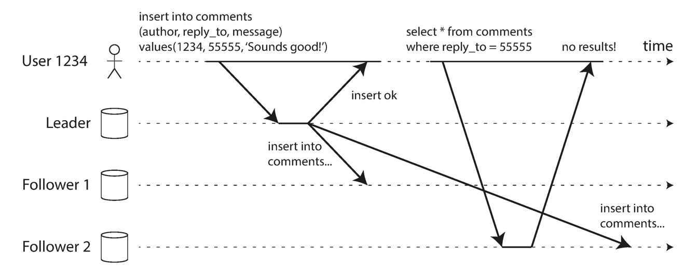

Fig.3. A user makes a write, followed by a read from a stale replica. To prevent this anomaly, we need read-after-write consistency.

In this situation, we need *read-after-write consistency*, also known as *read-your-writes consistency*.
This is a guarantee that if the user reloads the page, they will always see any updates they submitted themselves.
It makes no promises about other users: other users’ updates may not be visible until some later time.
However, it reassures the user that their own input has been saved correctly.

How can we implement read-after-write consistency in a system with leader-based replication:

- When reading something that the user may have modified, read it from the leader; otherwise, read it from a follower.
  This requires that you have some way of knowing whether something might have been modified, without actually querying it.
  For example, user profile information on a social network is normally only editable by the owner of the profile, not by anybody else.
  Thus, a simple rule is: always read the user’s own profile from the leader, and any other users’ profiles from a follower.
- If most things in the application are potentially editable by the user, that approach won’t be effective, as most things would have to be read from the leader (negating the benefit of read scaling).
  In that case, other criteria may be used to decide whether to read from the leader.
  For example, you could track the time of the last update and, for one minute after the last update, make all reads from the leader.
  You could also monitor the replication lag on followers and prevent queries on any follower that is more than one minute behind the leader.
- The client can remember the timestamp of its most recent write—then the system can ensure that the replica serving any reads for that user reflects updates at least until that timestamp.
  If a replica is not sufficiently up to date, either the read can be handled by another replica or the query can wait until the replica has caught up.
  The timestamp could be a logical timestamp (something that indicates ordering of writes, such as the log sequence number) or the actual system clock (in which case clock synchronization becomes critical).
- If your replicas are distributed across multiple datacenters (for geographical proximity to users or for availability), there is additional complexity.
  Any request that needs to be served by the leader must be routed to the datacenter that contains the leader.

Another complication arises when the same user is accessing your service from multiple devices, for example a desktop web browser and a mobile app.
In this case you may want to provide cross-device read-after-write consistency: if the user enters some information on one device and then views it on another device, they should see the information they just entered.
In this case, there are some additional issues to consider:

- Approaches that require remembering the timestamp of the user’s last update become more difficult, because the code running on one device doesn’t know what updates have happened on the other device.
  This metadata will need to be centralized.
- If your replicas are distributed across different datacenters, there is no guarantee that connections from different devices will be routed to the same datacenter.
  (For example, if the user’s desktop computer uses the home broadband connection and their mobile device uses the cellular data network, the devices’ network routes may be completely different.)
  If your approach requires reading from the leader, you may first need to route requests from all of a user’s devices to the same datacenter.

### Monotonic Reads

Our second example of an anomaly that can occur when reading from asynchronous followers is that it’s possible for a user to see things *moving backward in time*.
This can happen if a user makes several reads from different replicas.
For example, Figure 4 shows user 2345 making the same query twice, first to a follower with little lag, then to a follower with greater lag.
(This scenario is quite likely if the user refreshes a web page, and each request is routed to a random server.)
The first query returns a comment that was recently added by user 1234, but the second query doesn’t return anything because the lagging follower has not yet picked up that write.
In effect, the second query is observing the system at an earlier point in time than the first query.
This wouldn’t be so bad if the first query hadn’t returned anything, because user 2345 probably wouldn’t know that user 1234 had recently added a comment.
However, it’s very confusing for user 2345 if they first see user 1234’s comment appear, and then see it disappear again.

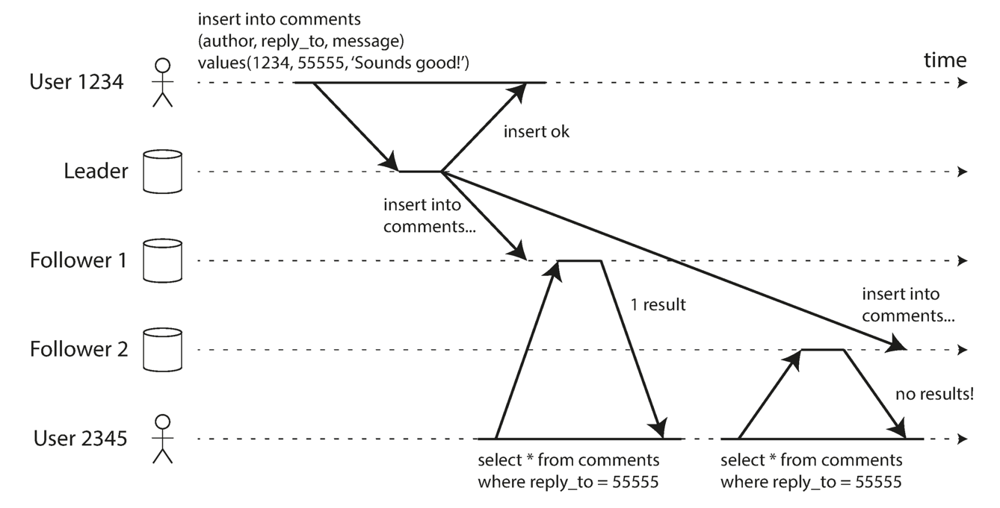

Fig.4. A user first reads from a fresh replica, then from a stale replica. Time appears to go backward. To prevent this anomaly, we need monotonic reads.

*Monotonic reads* is a guarantee that this kind of anomaly does not happen.
It’s a lesser guarantee than *strong consistency*, but a stronger guarantee than *eventual consistency*.
When you read data, you may see an old value; monotonic reads only means that if one user makes several reads in sequence, they will not see time go backward i.e., they will not read older data after having previously read newer data.
One way of achieving monotonic reads is to make sure that each user always makes their reads from the same replica (different users can read from different replicas).
For example, the replica can be chosen based on a hash of the user ID, rather than randomly.
However, if that replica fails, the user’s queries will need to be rerouted to another replica.

### Consistent Prefix Reads

Our third example of replication lag anomalies concerns violation of causality.
Imagine the following short dialog between Mr. Poons and Mrs. Cake:

> Mr. Poons
> How far into the future can you see, Mrs. Cake?
>
> Mrs. Cake
> About ten seconds usually, Mr. Poons

There is a causal dependency between those two sentences: Mrs. Cake heard Mr. Poons’s question and answered it.
Now, imagine a third person is listening to this conversation through followers.
The things said by Mrs. Cake go through a follower with little lag, but the things said by Mr. Poons have a longer replication lag (see Figure 5).
This observer would hear the following:

> Mrs. Cake
> About ten seconds usually, Mr. Poons.
>
> Mr. Poons
> How far into the future can you see, Mrs. Cake?

To the observer it looks as though Mrs. Cake is answering the question before Mr. Poons has even asked it.
Such psychic powers are impressive, but very confusing.

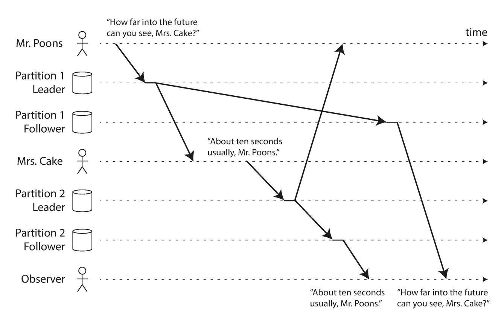

Fig.5. If some partitions are replicated slower than others, an observer may see the answer before they see the question.

Preventing this kind of anomaly requires another type of guarantee: consistent prefix reads.
This guarantee says that if a sequence of writes happens in a certain order, then anyone reading those writes will see them appear in the same order.

If the database always applies writes in the same order, reads always see a consistent prefix, so this anomaly cannot happen.
However, in many distributed databases, different partitions operate independently, so there is no global ordering of writes: when a user reads from the database, they may see some parts of the database in an older state and some in a newer state.
One solution is to make sure that any writes that are causally related to each other are written to the same partition—but in some applications that cannot be done efficiently.

### Solutions for Replication Lag

When working with an eventually consistent system, it is worth thinking about how the application behaves if the replication lag increases to several minutes or even hours.
If the answer is “no problem,” that’s great.
However, if the result is a bad experience for users, it’s important to design the system to provide a stronger guarantee, such as read-after-write.
Pretending that replication is synchronous when in fact it is asynchronous is a recipe for problems down the line.

As discussed earlier, there are ways in which an application can provide a stronger guarantee than the underlying database—for example, by performing certain kinds of reads on the leader.
However, dealing with these issues in application code is complex and easy to get wrong.
It would be better if application developers didn’t have to worry about subtle replication issues and could just trust their databases to “do the right thing.”
This is why transactions exist: they are a way for a database to provide stronger guarantees so that the application can be simpler.
Single-node transactions have existed for a long time.
However, in the move to distributed (replicated and partitioned) databases, many systems have abandoned them, claiming that transactions are too expensive in terms of performance and availability, and asserting that eventual consistency is inevitable in a scalable system.
There is some truth in that statement, but it is overly simplistic, and we will develop a more nuanced view over the course of the rest of this book.

## Multi-Leader Replication

So far in this chapter we have only considered replication architectures using a single leader.
Although that is a common approach, there are interesting alternatives.
Leader-based replication has one major downside: there is only one leader, and all writes must go through it.
If you can’t connect to the leader for any reason, for example due to a network interruption between you and the leader, you can’t write to the database.

A natural extension of the leader-based replication model is to allow more than one node to accept writes.
Replication still happens in the same way: each node that processes a write must forward that data change to all the other nodes.
We call this a *multi-leader configuration* (also known as master–master or active/active replication).
In this setup, each leader simultaneously acts as a follower to the other leaders.

It rarely makes sense to use a multi-leader setup within a single datacenter, because the benefits rarely outweigh the added complexity.
However, there are some situations in which this configuration is reasonable.

Imagine you have a database with replicas in several different datacenters (perhaps so that you can tolerate failure of an entire datacenter, or perhaps in order to be closer to your users).
With a normal leader-based replication setup, the leader has to be in one of the datacenters, and all writes must go through that datacenter.
In a multi-leader configuration, you can have a leader in each datacenter.
Figure 6 shows what this architecture might look like.
Within each datacenter, regular leader–follower replication is used; between datacenters, each datacenter’s leader replicates its changes to the leaders in other datacenters.

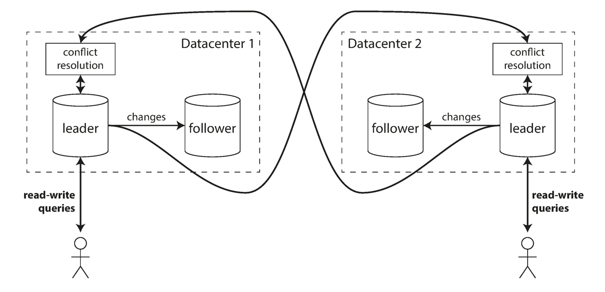

Fig.6. Multi-leader replication across multiple datacenters.

Let’s compare how the single-leader and multi-leader configurations fare in a multidatacenter deployment:

- Performance
  In a single-leader configuration, every write must go over the internet to the datacenter with the leader.
  This can add significant latency to writes and might contravene the purpose of having multiple datacenters in the first place.
  In a multi-leader configuration, every write can be processed in the local datacenter and is replicated asynchronously to the other datacenters.
  Thus, the interdatacenter network delay is hidden from users, which means the perceived performance may be better.
- Tolerance of datacenter outages
  In a single-leader configuration, if the datacenter with the leader fails, failover can promote a follower in another datacenter to be leader.
  In a multi-leader configuration, each datacenter can continue operating independently of the others, and replication catches up when the failed datacenter comes back online.
- Tolerance of network problems
  Traffic between datacenters usually goes over the public internet, which may be less reliable than the local network within a datacenter.
  A single-leader configuration is very sensitive to problems in this inter-datacenter link, because writes are made synchronously over this link.
  A multi-leader configuration with asynchronous replication can usually tolerate network problems better: a temporary network interruption does not prevent writes being processed.

Some databases support multi-leader configurations by default, but it is also often implemented with external tools, such as Tungsten Replicator for MySQL, BDR for PostgreSQL, and GoldenGate for Oracle.
Although multi-leader replication has advantages, it also has a big downside: the same data may be concurrently modified in two different datacenters, and those write conflicts must be resolved.

As multi-leader replication is a somewhat retrofitted feature in many databases, there are often subtle configuration pitfalls and surprising interactions with other database features.
For example, autoincrementing keys, triggers, and integrity constraints can be problematic.
For this reason, multi-leader replication is often considered dangerous territory that should be avoided if possible.

### Clients with offline operation

Another situation in which multi-leader replication is appropriate is if you have an application that needs to continue to work while it is disconnected from the internet.
For example, consider the calendar apps on your mobile phone, your laptop, and other devices.
You need to be able to see your meetings (make read requests) and enter new meetings (make write requests) at any time, regardless of whether your device currently has an internet connection.
If you make any changes while you are offline, they need to be synced with a server and your other devices when the device is next online.

In this case, every device has a local database that acts as a leader (it accepts write requests), and there is an asynchronous multi-leader replication process (sync) between the replicas of your calendar on all of your devices.
The replication lag may be hours or even days, depending on when you have internet access available.
From an architectural point of view, this setup is essentially the same as multi-leader replication between datacenters, taken to the extreme: each device is a “datacenter,” and the network connection between them is extremely unreliable.
As the rich history of broken calendar sync implementations demonstrates, multi-leader replication is a tricky thing to get right.
There are tools that aim to make this kind of multi-leader configuration easier.
For example, CouchDB is designed for this mode of operation.

### Handling Write Conflicts

The biggest problem with multi-leader replication is that write conflicts can occur, which means that conflict resolution is required.
For example, consider a wiki page that is simultaneously being edited by two users, as shown in Figure 7.
User 1 changes the title of the page from A to B, and user 2 changes the title from A to C at the same time.
Each user’s change is successfully applied to their local leader.
However, when the changes are asynchronously replicated, a conflict is detected.
This problem does not occur in a single-leader database.

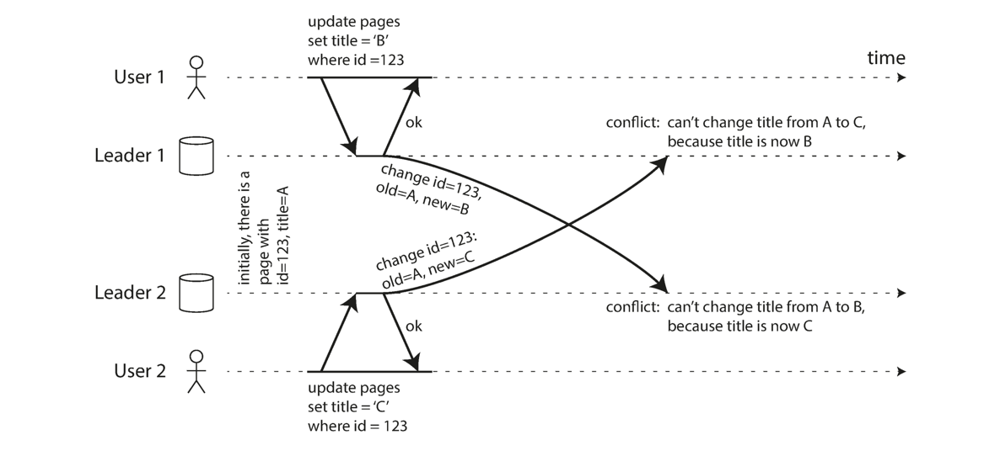

Fig.7. A write conflict caused by two leaders concurrently updating the same record.

Synchronous versus asynchronous conflict detection

In a single-leader database, the second writer will either block and wait for the first write to complete, or abort the second write transaction, forcing the user to retry the write.
On the other hand, in a multi-leader setup, both writes are successful, and the conflict is only detected asynchronously at some later point in time.
At that time, it may be too late to ask the user to resolve the conflict.
In principle, you could make the conflict detection synchronous—i.e., wait for the write to be replicated to all replicas before telling the user that the write was successful.
However, by doing so, you would lose the main advantage of multi-leader replication: allowing each replica to accept writes independently.
If you want synchronous conflict detection, you might as well just use single-leader replication.

#### Conflict avoidance

The simplest strategy for dealing with conflicts is to avoid them: if the application can ensure that all writes for a particular record go through the same leader, then conflicts cannot occur.
Since many implementations of multi-leader replication handle conflicts quite poorly, avoiding conflicts is a frequently recommended approach.

For example, in an application where a user can edit their own data, you can ensure that requests from a particular user are always routed to the same datacenter and use the leader in that datacenter for reading and writing.
Different users may have different “home” datacenters (perhaps picked based on geographic proximity to the user), but from any one user’s point of view the configuration is essentially single-leader.

However, sometimes you might want to change the designated leader for a record perhaps because one datacenter has failed and you need to reroute traffic to another datacenter, or perhaps because a user has moved to a different location and is now closer to a different datacenter.
In this situation, conflict avoidance breaks down, and you have to deal with the possibility of concurrent writes on different leaders.

Converging toward a consistent state

A single-leader database applies writes in a sequential order: if there are several updates to the same field, the last write determines the final value of the field.
In a multi-leader configuration, there is no defined ordering of writes, so it’s not clear what the final value should be. In Figure 7, at leader 1 the title is first updated to B and then to C; at leader 2 it is first updated to C and then to B.
Neither order is “more correct” than the other.

If each replica simply applied writes in the order that it saw the writes, the database would end up in an inconsistent state: the final value would be C at leader 1 and B at leader 2.
That is not acceptable—every replication scheme must ensure that the data is eventually the same in all replicas.
Thus, the database must resolve the conflict in a convergent way, which means that all replicas must arrive at the same final value when all changes have been replicated.
There are various ways of achieving convergent conflict resolution:

- Give each write a unique ID (e.g., a timestamp, a long random number, a UUID, or a hash of the key and value), pick the write with the highest ID as the winner, and throw away the other writes.
  If a timestamp is used, this technique is known as last write wins (LWW). Although this approach is popular, it is dangerously prone to data loss.
- Give each replica a unique ID, and let writes that originated at a highernumbered replica always take precedence over writes that originated at a lowernumbered replica. This approach also implies data loss.
- Somehow merge the values together—e.g., order them alphabetically and then concatenate them (in Figure 7, the merged title might be something like “B/C”).
- Record the conflict in an explicit data structure that preserves all information, and write application code that resolves the conflict at some later time (perhaps by prompting the user).

#### Custom conflict resolution logic

As the most appropriate way of resolving a conflict may depend on the application, most multi-leader replication tools let you write conflict resolution logic using application code.
That code may be executed on write or on read:

- On write
  As soon as the database system detects a conflict in the log of replicated changes, it calls the conflict handler.
  For example, Bucardo allows you to write a snippet of Perl for this purpose.
  This handler typically cannot prompt a user—it runs in a background process and it must execute quickly.
- On read
  When a conflict is detected, all the conflicting writes are stored.
  The next time the data is read, these multiple versions of the data are returned to the application.
  The application may prompt the user or automatically resolve the conflict, and write the result back to the database. CouchDB works this way, for example.

Note that conflict resolution usually applies at the level of an individual row or document, not for an entire transaction.
Thus, if you have a transaction that atomically makes several different writes, each write is still considered separately for the purposes of conflict resolution.

> Automatic Conflict Resolution
>
> Conflict resolution rules can quickly become complicated, and custom code can be error-prone.
> Amazon is a frequently cited example of surprising effects due to a conflict resolution handler: for some time, the conflict resolution logic on the shopping cart would preserve items added to the cart, but not items removed from the cart.
> Thus, customers would sometimes see items reappearing in their carts even though they had previously been removed.
> There has been some interesting research into automatically resolving conflicts
> caused by concurrent data modifications. A few lines of research are worth mentioning:
>
> - Conflict-free replicated datatypes (CRDTs) are a family of data structures for sets, maps, ordered lists, counters, etc. that can be concurrently edited by multiple users, and which automatically resolve conflicts in sensible ways.
>   Some CRDTs have been implemented in Riak 2.0.
> - Mergeable persistent data structures track history explicitly, similarly to the Git version control system, and use a three-way merge function (whereas CRDTs use two-way merges).
> - Operational transformation is the conflict resolution algorithm behind collaborative editing applications such as Etherpad and Google Docs.
>   It was designed particularly for concurrent editing of an ordered list of items, such as the list of characters that constitute a text document.
>   Implementations of these algorithms in databases are still young, but it’s likely that they will be integrated into more replicated data systems in the future.
>   Automatic conflict resolution could make multi-leader data synchronization much simpler for applications to deal with.

Some kinds of conflict are obvious.
In the example in Figure 7, two writes concurrently modified the same field in the same record, setting it to two different values.
There is little doubt that this is a conflict.
Other kinds of conflict can be more subtle to detect.
For example, consider a meeting room booking system: it tracks which room is booked by which group of people at which time.
This application needs to ensure that each room is only booked by one group of people at any one time (i.e., there must not be any overlapping bookings for the same room).
In this case, a conflict may arise if two different bookings are created for the same room at the same time.
Even if the application checks availability before allowing a user to make a booking, there can be a conflict if the two bookings are made on two different leaders.

There isn’t a quick ready-made answer, but in the following chapters we will trace a path toward a good understanding of this problem.
We will see some more examples of conflicts in Chapter 7, and in Chapter 12 we will discuss scalable approaches for detecting and resolving conflicts in a replicated system.

### Multi-Leader Replication Topologies

A replication topology describes the communication paths along which writes are propagated from one node to another.
If you have two leaders, like in Figure 7, there is only one plausible topology: leader 1 must send all of its writes to leader 2, and vice versa.
With more than two leaders, various different topologies are possible.
Some examples are illustrated in Figure 8.

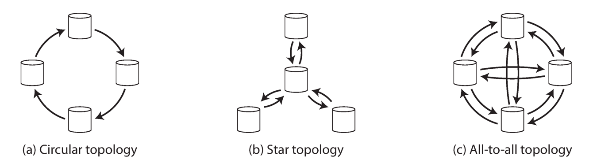

Fig.8. Three example topologies in which multi-leader replication can be set up.

The most general topology is all-to-all, in which every leader sends its writes to every other leader.
However, more restricted topologies are also used: for example, MySQL by default supports only a circular topology, in which each node receives writes from one node and forwards those writes (plus any writes of its own) to one other node.
Another popular topology has the shape of a star:v one designated root node forwards writes to all of the other nodes.
The star topology can be generalized to a tree.
In circular and star topologies, a write may need to pass through several nodes before it reaches all replicas.
Therefore, nodes need to forward data changes they receive from other nodes.
To prevent infinite replication loops, each node is given a unique identifier, and in the replication log, each write is tagged with the identifiers of all the nodes it has passed through.
When a node receives a data change that is tagged with its own identifier, that data change is ignored, because the node knows that it has already been processed.

A problem with circular and star topologies is that if just one node fails, it can interrupt the flow of replication messages between other nodes, causing them to be unable to communicate until the node is fixed.
The topology could be reconfigured to work around the failed node, but in most deployments such reconfiguration would have to be done manually.
The fault tolerance of a more densely connected topology (such as all-to-all) is better because it allows messages to travel along different paths, avoiding a single point of failure.
On the other hand, all-to-all topologies can have issues too.
In particular, some network links may be faster than others (e.g., due to network congestion), with the result that some replication messages may “overtake” others, as illustrated in Figure 9.

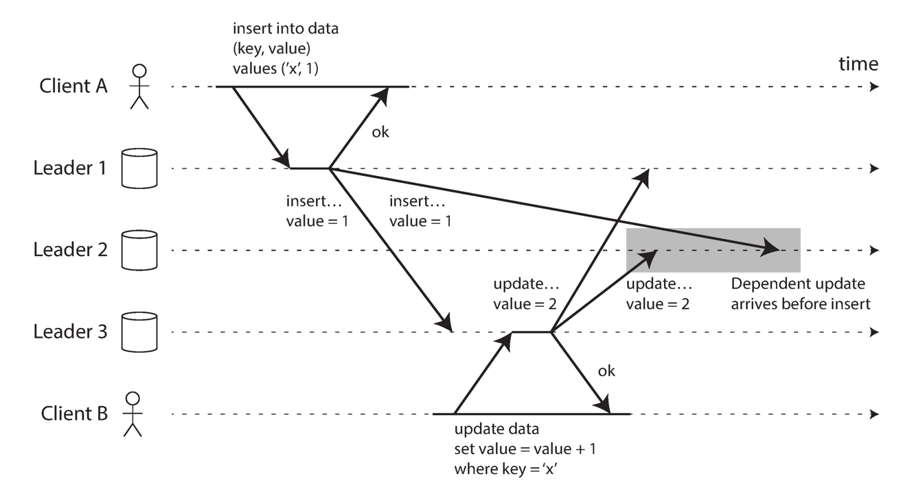

Fig.9. With multi-leader replication, writes may arrive in the wrong order at some replicas.

In Figure 9, client A inserts a row into a table on leader 1, and client B updates that row on leader 3.
However, leader 2 may receive the writes in a different order: it may first receive the update (which, from its point of view, is an update to a row that does not exist in the database) and only later receive the corresponding insert (which should have preceded the update).

This is a problem of causality, similar to the one we saw in “Consistent Prefix Reads”: the update depends on the prior insert, so we need to make sure that all nodes process the insert first, and then the update.
Simply attaching a timestamp to every write is not sufficient, because clocks cannot be trusted to be sufficiently in sync to correctly order these events at leader 2.

To order these events correctly, a technique called version vectors can be used.
However, conflict detection techniques are poorly implemented in many multi-leader replication systems.
For example, at the time of writing, PostgreSQL BDR does not provide causal ordering of writes, and Tungsten Replicator for MySQL doesn’t even try to detect conflicts.

If you are using a system with multi-leader replication, it is worth being aware of these issues, carefully reading the documentation, and thoroughly testing your database to ensure that it really does provide the guarantees you believe it to have.

## Leaderless Replication

The replication approaches we have discussed so far in this chapter—single-leader and multi-leader replication—are based on the idea that a client sends a write request to one node (the leader), and the database system takes care of copying that write to the other replicas.
A leader determines the order in which writes should be processed, and followers apply the leader’s writes in the same order.

Some data storage systems take a different approach, abandoning the concept of a leader and allowing any replica to directly accept writes from clients.
Some of the earliest replicated data systems were leaderless, but the idea was mostly forgotten during the era of dominance of relational databases.
It once again became a fashionable architecture for databases after Amazon used it for its in-house Dynamo system .vi Riak, Cassandra, and Voldemort are open source datastores with leaderless replication models inspired by Dynamo, so this kind of database is also known as Dynamo-style.

In some leaderless implementations, the client directly sends its writes to several replicas, while in others, a coordinator node does this on behalf of the client.
However, unlike a leader database, that coordinator does not enforce a particular ordering of writes.
As we shall see, this difference in design has profound consequences for the way the database is used.

### Writing to the Database When a Node Is Down

Imagine you have a database with three replicas, and one of the replicas is currently unavailable—perhaps it is being rebooted to install a system update.
In a leader-based configuration, if you want to continue processing writes, you may need to perform a failover.

On the other hand, in a leaderless configuration, failover does not exist. Figure 10
shows what happens: the client (user 1234) sends the write to all three replicas in par‐
allel, and the two available replicas accept the write but the unavailable replica misses
it. Let’s say that it’s sufficient for two out of three replicas to acknowledge the write:
after user 1234 has received two ok responses, we consider the write to be successful.
The client simply ignores the fact that one of the replicas missed the write.

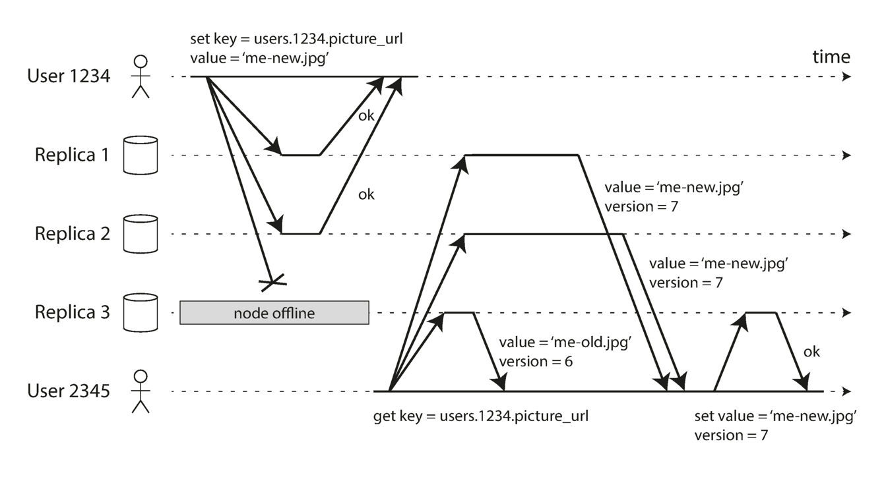

Fig.10. A quorum write, quorum read, and read repair after a node outage.

Now imagine that the unavailable node comes back online, and clients start reading
from it. Any writes that happened while the node was down are missing from that
node. Thus, if you read from that node, you may get stale (outdated) values as
responses.

To solve that problem, when a client reads from the database, it doesn’t just send its
request to one replica: read requests are also sent to several nodes in parallel. The cli‐
ent may get different responses from different nodes; i.e., the up-to-date value from
one node and a stale value from another. Version numbers are used to determine
which value is newer

Read repair and anti-entropy
The replication scheme should ensure that eventually all the data is copied to every
replica. After an unavailable node comes back online, how does it catch up on the
writes that it missed?

Two mechanisms are often used in Dynamo-style datastores:
Read repair
When a client makes a read from several nodes in parallel, it can detect any stale
responses. For example, in Figure 10, user 2345 gets a version 6 value from rep‐
lica 3 and a version 7 value from replicas 1 and 2. The client sees that replica 3
has a stale value and writes the newer value back to that replica. This approach
works well for values that are frequently read.
Anti-entropy process
In addition, some datastores have a background process that constantly looks for
differences in the data between replicas and copies any missing data from one
replica to another. Unlike the replication log in leader-based replication, this
anti-entropy process does not copy writes in any particular order, and there may
be a significant delay before data is copied.
Not all systems implement both of these; for example, Voldemort currently does not
have an anti-entropy process. Note that without an anti-entropy process, values that
are rarely read may be missing from some replicas and thus have reduced durability,
because read repair is only performed when a value is read by the application.

Quorums for reading and writing

In the example of Figure 10, we considered the write to be successful even though it was only processed on two out of three replicas.
What if only one out of three replicas accepted the write? How far can we push this?

If we know that every successful write is guaranteed to be present on at least two out of three replicas, that means at most one replica can be stale.
Thus, if we read from at least two replicas, we can be sure that at least one of the two is up to date.
If the third replica is down or slow to respond, reads can nevertheless continue returning an upto-date value.

More generally, if there are n replicas, every write must be confirmed by w nodes to be considered successful, and we must query at least r nodes for each read. (In our example, n = 3, w = 2, r = 2.)
As long as w + r > n, we expect to get an up-to-date value when reading, because at least one of the r nodes we’re reading from must be up to date.
Reads and writes that obey these r and w values are called quorum reads and writes.
You can think of r and w as the minimum number of votes required for the read or write to be valid.

In Dynamo-style databases, the parameters n, w, and r are typically configurable.
A common choice is to make n an odd number (typically 3 or 5) and to set w = r = (n + 1) / 2 (rounded up).
However, you can vary the numbers as you see fit.
For example, a workload with few writes and many reads may benefit from setting w = n and r = 1.
This makes reads faster, but has the disadvantage that just one failed node causes all database writes to fail.

> There may be more than n nodes in the cluster, but any given value is stored only on n nodes. This allows the dataset to be partitioned, supporting datasets that are larger than you can fit on one node.

The quorum condition, w + r > n, allows the system to tolerate unavailable nodes as
follows:

- If w < n, we can still process writes if a node is unavailable.
- If r < n, we can still process reads if a node is unavailable.
- With n = 3, w = 2, r = 2 we can tolerate one unavailable node.
- With n = 5, w = 3, r = 3 we can tolerate two unavailable nodes. This case is illus‐
  trated in Figure 11.
- Normally, reads and writes are always sent to all n replicas in parallel. The
  parameters w and r determine how many nodes we wait for—i.e., how many of
  the n nodes need to report success before we consider the read or write to be suc‐
  cessful.

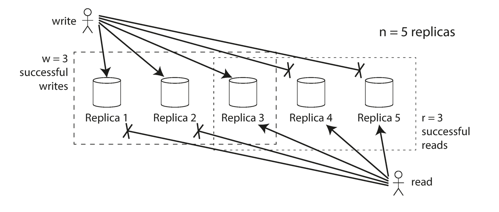

Fig.11. If w + r > n, at least one of the r replicas you read from must have seen the most recent successful write.

If fewer than the required w or r nodes are available, writes or reads return an error.
A node could be unavailable for many reasons: because the node is down (crashed,
powered down), due to an error executing the operation (can’t write because the disk
is full), due to a network interruption between the client and the node, or for any
number of other reasons. We only care whether the node returned a successful
response and don’t need to distinguish between different kinds of fault.

### Limitations of Quorum Consistency

If you have n replicas, and you choose w and r such that w + r > n, you can generally
expect every read to return the most recent value written for a key. This is the case
because the set of nodes to which you’ve written and the set of nodes from which
you’ve read must overlap. That is, among the nodes you read there must be at least
one node with the latest value (illustrated in Figure 11).
Often, r and w are chosen to be a majority (more than n/2) of nodes, because that
ensures w + r > n while still tolerating up to n/2 node failures. But quorums are not
necessarily majorities—it only matters that the sets of nodes used by the read and
write operations overlap in at least one node. Other quorum assignments are possi‐
ble, which allows some flexibility in the design of distributed algorithms [45].
You may also set w and r to smaller numbers, so that w + r ≤ n (i.e., the quorum con‐
dition is not satisfied). In this case, reads and writes will still be sent to n nodes, but a
smaller number of successful responses is required for the operation to succeed.
With a smaller w and r you are more likely to read stale values, because it’s more
likely that your read didn’t include the node with the latest value. On the upside, this
configuration allows lower latency and higher availability: if there is a network inter‐
ruption and many replicas become unreachable, there’s a higher chance that you can
continue processing reads and writes. Only after the number of reachable replicas
falls below w or r does the database become unavailable for writing or reading,
respectively.
However, even with w + r > n, there are likely to be edge cases where stale values are
returned. These depend on the implementation, but possible scenarios include:

- If a sloppy quorum is used (see “Sloppy Quorums and Hinted Handoff” on page
  183), the w writes may end up on different nodes than the r reads, so there is no
  longer a guaranteed overlap between the r nodes and the w nodes [46].
- If two writes occur concurrently, it is not clear which one happened first. In this
  case, the only safe solution is to merge the concurrent writes (see “Handling
  Write Conflicts” on page 171). If a winner is picked based on a timestamp (last
  write wins), writes can be lost due to clock skew [35]. We will return to this topic
  in “Detecting Concurrent Writes” on page 184.
- If a write happens concurrently with a read, the write may be reflected on only
  some of the replicas. In this case, it’s undetermined whether the read returns the
  old or the new value.
- If a write succeeded on some replicas but failed on others (for example because
  the disks on some nodes are full), and overall succeeded on fewer than w replicas,
  it is not rolled back on the replicas where it succeeded. This means that if a write
  was reported as failed, subsequent reads may or may not return the value from
  that write [47].
- If a node carrying a new value fails, and its data is restored from a replica carry‐
  ing an old value, the number of replicas storing the new value may fall below w,
  breaking the quorum condition.
- Even if everything is working correctly, there are edge cases in which you can get
  unlucky with the timing, as we shall see in “Linearizability and quorums”.

Thus, although quorums appear to guarantee that a read returns the latest written
value, in practice it is not so simple. Dynamo-style databases are generally optimized
for use cases that can tolerate eventual consistency. The parameters w and r allow you
to adjust the probability of stale values being read, but it’s wise to not take them as
absolute guarantees.

In particular, you usually do not get the guarantees discussed in “Problems with Rep‐
lication Lag” on page 161 (reading your writes, monotonic reads, or consistent prefix
reads), so the previously mentioned anomalies can occur in applications. Stronger
guarantees generally require transactions or consensus.

### Monitoring staleness

From an operational perspective, it’s important to monitor whether your databases
are returning up-to-date results. Even if your application can tolerate stale reads, you
need to be aware of the health of your replication. If it falls behind significantly, it
should alert you so that you can investigate the cause (for example, a problem in the
network or an overloaded node).
For leader-based replication, the database typically exposes metrics for the replication
lag, which you can feed into a monitoring system. This is possible because writes are
applied to the leader and to followers in the same order, and each node has a position
in the replication log (the number of writes it has applied locally). By subtracting a
follower’s current position from the leader’s current position, you can measure the
amount of replication lag.
However, in systems with leaderless replication, there is no fixed order in which
writes are applied, which makes monitoring more difficult. Moreover, if the database only uses read repair (no anti-entropy), there is no limit to how old a value might be
—if a value is only infrequently read, the value returned by a stale replica may be
ancient.
There has been some research on measuring replica staleness in databases with lead‐
erless replication and predicting the expected percentage of stale reads depending on
the parameters n, w, and r [48]. This is unfortunately not yet common practice, but it
would be good to include staleness measurements in the standard set of metrics for
databases. Eventual consistency is a deliberately vague guarantee, but for operability
it’s important to be able to quantify “eventual".

### Sloppy Quorums and Hinted Handoff

Databases with appropriately configured quorums can tolerate the failure of individ‐
ual nodes without the need for failover. They can also tolerate individual nodes going
slow, because requests don’t have to wait for all n nodes to respond—they can return
when w or r nodes have responded. These characteristics make databases with leader‐
less replication appealing for use cases that require high availability and low latency,
and that can tolerate occasional stale reads.
However, quorums (as described so far) are not as fault-tolerant as they could be. A
network interruption can easily cut off a client from a large number of database
nodes. Although those nodes are alive, and other clients may be able to connect to
them, to a client that is cut off from the database nodes, they might as well be dead. In
this situation, it’s likely that fewer than w or r reachable nodes remain, so the client
can no longer reach a quorum.
In a large cluster (with significantly more than n nodes) it’s likely that the client can
connect to some database nodes during the network interruption, just not to the
nodes that it needs to assemble a quorum for a particular value. In that case, database
designers face a trade-off:

- Is it better to return errors to all requests for which we cannot reach a quorum of
  w or r nodes?
- Or should we accept writes anyway, and write them to some nodes that are
  reachable but aren’t among the n nodes on which the value usually lives?
  The latter is known as a sloppy quorum [37]: writes and reads still require w and r
  successful responses, but those may include nodes that are not among the designated
  n “home” nodes for a value. By analogy, if you lock yourself out of your house, you
  may knock on the neighbor’s door and ask whether you may stay on their couch tem‐
  porarily.

Once the network interruption is fixed, any writes that one node temporarily
accepted on behalf of another node are sent to the appropriate “home” nodes. This is called hinted handoff. (Once you find the keys to your house again, your neighbor
politely asks you to get off their couch and go home.)
Sloppy quorums are particularly useful for increasing write availability: as long as any
w nodes are available, the database can accept writes. However, this means that even
when w + r > n, you cannot be sure to read the latest value for a key, because the
latest value may have been temporarily written to some nodes outside of n [47].
Thus, a sloppy quorum actually isn’t a quorum at all in the traditional sense. It’s only
an assurance of durability, namely that the data is stored on w nodes somewhere.
There is no guarantee that a read of r nodes will see it until the hinted handoff has
completed.
Sloppy quorums are optional in all common Dynamo implementations. In Riak they
are enabled by default, and in Cassandra and Voldemort they are disabled by default.

#### Multi-datacenter operation

We previously discussed cross-datacenter replication as a use case for multi-leader
replication (see “Multi-Leader Replication” on page 168). Leaderless replication is
also suitable for multi-datacenter operation, since it is designed to tolerate conflicting
concurrent writes, network interruptions, and latency spikes.
Cassandra and Voldemort implement their multi-datacenter support within the nor‐
mal leaderless model: the number of replicas n includes nodes in all datacenters, and
in the configuration you can specify how many of the n replicas you want to have in
each datacenter. Each write from a client is sent to all replicas, regardless of datacen‐
ter, but the client usually only waits for acknowledgment from a quorum of nodes
within its local datacenter so that it is unaffected by delays and interruptions on the
cross-datacenter link.
The higher-latency writes to other datacenters are often configured to happen asynchronously, although there is some flexibility in the configuration.
Riak keeps all communication between clients and database nodes local to one data‐
center, so n describes the number of replicas within one datacenter. Cross-datacenter
replication between database clusters happens asynchronously in the background, in
a style that is similar to multi-leader replication.

## Concurrent Writes

### Detecting Concurrent Writes

Dynamo-style databases allow several clients to concurrently write to the same key, which means that conflicts will occur even if strict quorums are used.
The situation is similar to multi-leader replication, although in Dynamo-style databases conflicts can also arise during read repair or hinted handoff.

The problem is that events may arrive in a different order at different nodes, due to variable network delays and partial failures.
For example, Figure 12 shows two clients, A and B, simultaneously writing to a key X in a three-node datastore:

- Node 1 receives the write from A, but never receives the write from B due to a transient outage.
- Node 2 first receives the write from A, then the write from B.
- Node 3 first receives the write from B, then the write from A.

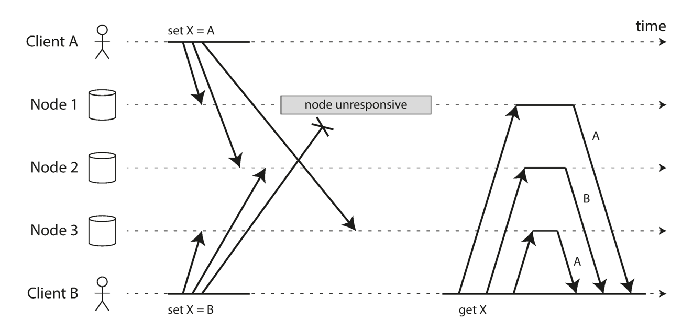

Fig.12. Concurrent writes in a Dynamo-style datastore: there is no well-defined ordering.

If each node simply overwrote the value for a key whenever it received a write request from a client, the nodes would become permanently inconsistent, as shown by the final get request in Figure 12: node 2 thinks that the final value of X is B, whereas the other nodes think that the value is A.

In order to become eventually consistent, the replicas should converge toward the same value.
How do they do that?
One might hope that replicated databases would handle this automatically, but unfortunately most implementations are quite poor: if you want to avoid losing data, you—the application developer—need to know a lot about the internals of your database’s conflict handling.

We briefly touched on some techniques for conflict resolution.
Before we wrap up this chapter, let’s explore the issue in a bit more detail.

#### Last write wins (discarding concurrent writes)

One approach for achieving eventual convergence is to declare that each replica need only store the most “recent” value and allow “older” values to be overwritten and discarded.
Then, as long as we have some way of unambiguously determining which write is more “recent,” and every write is eventually copied to every replica, the replicas will eventually converge to the same value.

As indicated by the quotes around “recent,” this idea is actually quite misleading.
In the example of Figure 12, neither client knew about the other one when it sent its write requests to the database nodes, so it’s not clear which one happened first.
In fact, it doesn’t really make sense to say that either happened “first”: we say the writes are concurrent, so their order is undefined.

Even though the writes don’t have a natural ordering, we can force an arbitrary order on them.
For example, we can attach a timestamp to each write, pick the biggest timestamp as the most “recent,” and discard any writes with an earlier timestamp.
This conflict resolution algorithm, called last write wins (LWW), is the only supported conflict resolution method in Cassandra, and an optional feature in Riak.
LWW achieves the goal of eventual convergence, but at the cost of durability: if there are several concurrent writes to the same key, even if they were all reported as successful to the client (because they were written to w replicas), only one of the writes will survive and the others will be silently discarded.
Moreover, LWW may even drop writes that are not concurrent, as we shall discuss in “Timestamps for ordering events” on page 291.
There are some situations, such as caching, in which lost writes are perhaps acceptable.
If losing data is not acceptable, LWW is a poor choice for conflict resolution.
The only safe way of using a database with LWW is to ensure that a key is only written once and the reafter treated as immutable, thus avoiding any concurrent updates to the same key.
For example, a recommended way of using Cassandra is to use a UUID as the key, thus giving each write operation a unique key.

#### The “happens-before” relationship and concurrency

How do we decide whether two operations are concurrent or not?
To develop an intuition, let’s look at some examples:

- In Figure 9, the two writes are not concurrent: A’s insert happens before B’s increment, because the value incremented by B is the value inserted by A.
  In other words, B’s operation builds upon A’s operation, so B’s operation must have happened later. We also say that B is causally dependent on A.
- On the other hand, the two writes in Figure 12 are concurrent: when each client starts the operation, it does not know that another client is also performing an operation on the same key.
  Thus, there is no causal dependency between the operations.

An operation A happens before another operation B if B knows about A, or depends on A, or builds upon A in some way. Whether one operation happens before another operation is the key to defining what concurrency means.
In fact, we can simply say that two operations are concurrent if neither happens before the other (i.e., neither knows about the other).

Thus, whenever you have two operations A and B, there are three possibilities: either A happened before B, or B happened before A, or A and B are concurrent.
What we need is an algorithm to tell us whether two operations are concurrent or not.
If one operation happened before another, the later operation should overwrite the earlier operation, but if the operations are concurrent, we have a conflict that needs to be resolved.

#### Capturing the happens-before relationship

Let’s look at an algorithm that determines whether two operations are concurrent, or whether one happened before another. To keep things simple, let’s start with a database that has only one replica.
Once we have worked out how to do this on a single replica, we can generalize the approach to a leaderless database with multiple replicas.
Figure 13 shows two clients concurrently adding items to the same shopping cart.
(If that example strikes you as too inane, imagine instead two air traffic controllers concurrently adding aircraft to the sector they are tracking.) Initially, the cart is empty.
Between them, the clients make five writes to the database:

1. Client 1 adds milk to the cart. This is the first write to that key, so the server successfully stores it and assigns it version 1.
   The server also echoes the value back to the client, along with the version number.
2. Client 2 adds eggs to the cart, not knowing that client 1 concurrently added milk(client 2 thought that its eggs were the only item in the cart).
   The server assigns version 2 to this write, and stores eggs and milk as two separate values.
   It then returns both values to the client, along with the version number of 2.
3. Client 1, oblivious to client 2’s write, wants to add flour to the cart, so it thinks the current cart contents should be [milk, flour].
   It sends this value to the server, along with the version number 1 that the server gave client 1 previously.
   The server can tell from the version number that the write of [milk, flour] supersedes the prior value of [milk] but that it is concurrent with [eggs].
   Thus, the server assigns version 3 to [milk, flour], overwrites the version 1 value [milk], but keeps the version 2 value [eggs] and returns both remaining values to the client.
4. Meanwhile, client 2 wants to add ham to the cart, unaware that client 1 just added flour.
   Client 2 received the two values [milk] and [eggs] from the server in the last response, so the client now merges those values and adds ham to form a new value, [eggs, milk, ham].
   It sends that value to the server, along with the previous version number 2.
   The server detects that version 2 overwrites [eggs] but is concurrent with [milk, flour], so the two remaining values are [milk, flour] with version 3, and [eggs, milk, ham] with version 4.
5. Finally, client 1 wants to add bacon. It previously received [milk, flour] and [eggs] from the server at version 3, so it merges those, adds bacon, and sends the final value [milk, flour, eggs, bacon] to the server, along with the version number 3.
   This overwrites [milk, flour] (note that [eggs] was already overwritten in the last step) but is concurrent with [eggs, milk, ham], so the server keeps those two concurrent values.

### Merging concurrently written values

This algorithm ensures that no data is silently dropped, but it unfortunately requires that the clients do some extra work: if several operations happen concurrently, clients have to clean up afterward by merging the concurrently written values. Riak calls these concurrent values siblings.

Merging sibling values is essentially the same problem as conflict resolution in multileader replication, which we discussed previously.
A simple approach is to just pick one of the values based on a version number or timestamp (last write wins), but that implies losing data.
So, you may need to do something more intelligent in application code.

With the example of a shopping cart, a reasonable approach to merging siblings is to just take the union.
In Figure 14, the two final siblings are [milk, flour, eggs, bacon] and [eggs, milk, ham]; note that milk and eggs appear in both, even though they were each only written once.
The merged value might be something like [milk, flour, eggs, bacon, ham], without duplicates.

However, if you want to allow people to also remove things from their carts, and not just add things, then taking the union of siblings may not yield the right result: if you merge two sibling carts and an item has been removed in only one of them, then the removed item will reappear in the union of the siblings.
To prevent this probem, an item cannot simply be deleted from the database when it is removed; instead, the system must leave a marker with an appropriate version number to indicate that the item has been removed when merging siblings. Such a deletion marker is known as a tombstone.
As merging siblings in application code is complex and error-prone, there are some efforts to design data structures that can perform this merging automatically.
For example, Riak’s datatype support uses a family of data structures called CRDTs that can automatically merge siblings in sensible ways, including preserving deletions.

## Replicated State Machines

Redundancy is not enough; to be useful it must be coordinated.
The simplest way to do this is to make each non-faulty replica do the same thing.
Then any non-faulty replica can provide the outputs; if the replicas are not fail-stop, requiring the same output from f replicas will tolerate f – 1 faults.
More complicated kinds of redundancy (such as error-correcting codes) are cheaper, but they depend on special properties of the service being provided.

## Summary

We discussed three main approaches to replication:

| Replication               | Description                                                                                                                                                                                                          |
| --------------------------- | ---------------------------------------------------------------------------------------------------------------------------------------------------------------------------------------------------------------------- |
| Single-leader replication | Clients send all writes to a single node (the leader), which sends a stream of data change events to the other replicas (followers). Reads can be performed on any replica, but reads from followers might be stale. |
| Multi-leader replication  | Clients send each write to one of several leader nodes, any of which can accept writes. The leaders send streams of data change events to each other and to any follower nodes.                                      |
| Leaderless replication    | Clients send each write to several nodes, and read from several nodes in parallel in order to detect and correct nodes with stale data.                                                                              |

Each approach has advantages and disadvantages.
Single-leader replication is popular because it is fairly easy to understand and there is no conflict resolution to worry about.
Multi-leader and leaderless replication can be more robust in the presence of faulty nodes, network interruptions, and latency spikes—at the cost of being harder to reason about and providing only very weak consistency guarantees.

Replication can be synchronous or asynchronous, which has a profound effect on the system behavior when there is a fault.
Although asynchronous replication can be fast when the system is running smoothly, it’s important to figure out what happens when replication lag increases and servers fail.
If a leader fails and you promote an asynchronously updated follower to be the new leader, recently committed data may be lost.

We looked at some strange effects that can be caused by replication lag, and we discussed a few consistency models which are helpful for deciding how an application should behave under replication lag:

| Replication lag              | Description                                                                                                                      |
| ------------------------------ | ---------------------------------------------------------------------------------------------------------------------------------- |
| Read-after-write consistency | Users should always see data that they submitted themselves.                                                                     |
| Monotonic reads              | After users have seen the data at one point in time, they shouldn’t later see the data from some earlier point in time.         |
| Consistent prefix reads      | Users should see the data in a state that makes causal sense: for example, seeing a question and its reply in the correct order. |

Finally, we discussed the concurrency issues that are inherent in multi-leader and leaderless replication approaches: because they allow multiple writes to happen concurrently, conflicts may occur.
We examined an algorithm that a database might use to determine whether one operation happened before another, or whether they happened concurrently.
We also touched on methods for resolving conflicts by merging together concurrent updates.

## Links

- [Distributed Systems](/docs/CS/Distributed/Distributed_Systems.md)

## References

1. [Chain Replication for Supporting High Throughput and Availability](https://www.cs.cornell.edu/home/rvr/papers/OSDI04.pdf)
