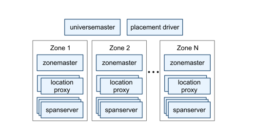
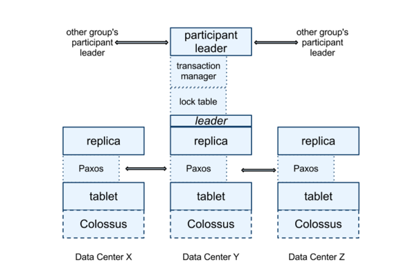

## Introduction

Spanner is Google’s scalable, multi-version, globally distributed, and synchronously-replicated database.
At the highest level of abstraction, it is a database that shards data across many sets of [Paxos state machines](/docs/CS/Distributed/Paxos.md) in datacenters spread all over the world.
Replication is used for global availability and geographic locality; clients automatically failover between replicas.
Spanner automatically reshards data across machines as the amount of data or the number of servers changes, and it automatically migrates data across machines (even across datacenters) to balance load and in response to failures.
Spanner is designed to scale up to millions of machines across hundreds of datacenters and trillions of database rows.

As a globally-distributed database, Spanner provides several interesting features.

- First, the replication configurations for data can be dynamically controlled at a fine grain by applications.
  Applications can specify constraints to control which datacenters contain which data, how far data is from its users (to control read latency),
  how far replicas are from each other (to control write latency), and how many replicas are maintained (to control durability, availability, and read performance).
  Data can also be dynamically and transparently moved between datacenters by the system to balance resource usage across datacenters.
- Second, Spanner has two features that are difficult to implement in a distributed database: it provides externally consistent reads and writes, and globally-consistent reads across the database at a timestamp.

These features enable Spanner to support consistent backups, consistent MapReduce executions, and atomic schema updates, all at global scale, and even in the presence of ongoing transactions.
These features are enabled by the fact that Spanner assigns globally-meaningful commit timestamps to transactions, even though transactions may be distributed.
The timestamps reflect serialization order.
In addition, the serialization order satisfies external consistency (or equivalently, linearizability): if a transaction T1 commits before another transaction T2 starts, then T1’s commit timestamp is smaller than T2’s.
Spanner is the first system to provide such guarantees at global scale.

The key enabler of these properties is a new TrueTime API and its implementation.
The API directly exposes clock uncertainty, and the guarantees on Spanner’s timestamps depend on the bounds that the implementation provides.
If the uncertainty is large, Spanner slows down to wait out that uncertainty.
Google’s cluster-management software provides an implementation of the TrueTime API.
This implementation keeps uncertainty small (generally less than 10ms) by using multiple modern clock references (GPS and atomic clocks).

## Data Model

Spanner exposes the following set of data features to applications: a data model based on schematized semi-relational tables, a query language, and generalpurpose transactions.
The move towards supporting these features was driven by many factors.
The need to support schematized semi-relational tables and synchronous replication is supported by the popularity of Megastore.

The application data model is layered on top of the directory-bucketed key-value mappings supported by the implementation.
An application creates one or more databases in a universe.
Each database can contain an unlimited number of schematized tables.
Tables look like relational-database tables, with rows, columns, and versioned values. We will not go into detail about the query language for Spanner.
It looks like SQL with some extensions to support protocol-buffer-valued fields.

Spanner’s data model is not purely relational, in that rows must have names.
More precisely, every table is required to have an ordered set of one or more primary-key columns.
This requirement is where Spanner still looks like a key-value store: the primary keys form the name for a row, and each table defines a mapping from the primary-key columns to the non-primary-key columns.
A row has existence only if some value (even if it is NULL) is defined for the row’s keys.
Imposing this structure is useful because it lets applications control data locality through their choices of keys.

## Architecture

A Spanner deployment is called a universe. Given that Spanner manages data globally, there will be only a handful of running universes.

Spanner is organized as a set of zones, where each zone is the rough analog of a deployment of Bigtable servers.
Zones are the unit of administrative deployment.
The set of zones is also the set of locations across which data can be replicated.
Zones can be added to or removed from a running system as new datacenters are brought into service and old ones are turned off, respectively.
Zones are also the unit of physical isolation: there may be one or more zones in a datacenter, for example, if different applications’ data must be partitioned across different sets of servers in the same datacenter.



A zone has one *zonemaster* and between one hundred and several thousand *spanservers*.
The former assigns data to spanservers; the latter serve data to clients.
The per-zone location proxies are used by clients to locate the spanservers assigned to serve their data.
The universe master and the placement driver are currently singletons.
The universe master is primarily a console that displays status information about all the zones for interactive debugging.
The placement driver handles automated movement of data across zones on the timescale of minutes.
The placement driver periodically communicates with the spanservers to find data that needs to be moved, either to meet updated replication constraints or to balance load.

### Spanserver

The spanserver software stack is shown in below figure.



At the bottom, each spanserver is responsible for between 100 and 1000 instances of a data structure called a tablet.
A tablet is similar to Bigtable’s tablet abstraction, in that it implements a bag of the following mappings:

```
(key:string, timestamp:int64) → string
```

Unlike Bigtable, Spanner assigns timestamps to data, which is an important way in which Spanner is more like a multi-version database than a key-value store.
A tablet’s state is stored in set of B-tree-like files and a write-ahead log, all on a distributed file system called Colossus (the successor to the [Google File System](/docs/CS/Distributed/GFS.md)).

To support replication, each spanserver implements a single Paxos state machine on top of each tablet.
(An early Spanner incarnation supported multiple Paxos state machines per tablet, which allowed for more flexible replication configurations. The complexity of that design led us to abandon it.)
Each state machine stores its metadata and log in its corresponding tablet.
Our Paxos implementation supports long-lived leaders with time-based leader leases, whose length defaults to 10 seconds.
The current Spanner implementation logs every Paxos write twice: once in the tablet’s log, and once in the Paxos log.
This choice was made out of expediency, and we are likely to remedy this eventually.
Our implementation of Paxos is pipelined, so as to improve Spanner’s throughput in the presence of WAN latencies; but writes are applied by Paxos in order.

The Paxos state machines are used to implement a consistently replicated bag of mappings.
The key-value mapping state of each replica is stored in its corresponding tablet.
Writes must initiate the Paxos protocol at the leader; reads access state directly from the underlying tablet at any replica that is sufficiently up-to-date.
The set of replicas is collectively a Paxos group.

At every replica that is a leader, each spanserver implements a lock table to implement concurrency control.
The lock table contains the state for two-phase locking: it maps ranges of keys to lock states. (Note that having a long-lived Paxos leader is critical to efficiently managing the lock table.)
In both Bigtable and Spanner, we designed for long-lived transactions (for example, for report generation, which might take on the order of minutes), which perform poorly under optimistic concurrency control in the presence of conflicts.
Operations that require synchronization, such as transactional reads, acquire locks in the lock table; other operations bypass the lock table.

### Directories

On top of the bag of key-value mappings, the Spanner implementation supports a bucketing abstraction called a directory, which is a set of contiguous keys that share a common prefix.
(The choice of the term directory is a historical accident; a better term might be bucket.)
Supporting directories allows applications to control the locality of their data by choosing keys carefully.

A directory is the unit of data placement. All data in a directory has the same replication configuration.
When data is moved between Paxos groups, it is moved directory by directory.
Spanner might move a directory to shed load from a Paxos group; to put directories that are frequently accessed together into the same group; or to move a directory into a group that is closer to its accessors.
Directories can be moved while client operations are ongoing.
One could expect that a 50MB directory can be moved in a few seconds.

The fact that a Paxos group may contain multiple directories implies that a Spanner tablet is different from a Bigtable tablet: the former is not necessarily a single lexicographically contiguous partition of the row space.
Instead, a Spanner tablet is a container that may encapsulate multiple partitions of the row space.
We made this decision so that it would be possible to colocate multiple directories that are frequently accessed together.

## TrueTime

TrueTime API. The argument t is of type TTstamp.


| Method       | Returns                              |
| -------------- | -------------------------------------- |
| TT.now()     | TTinterval: [earliest, latest]       |
| TT.after(t)  | true if t has definitely passed      |
| TT.before(t) | true if t has definitely not arrived |

TrueTime explicitly represents time as a TTinterval, which is an interval with bounded time uncertainty (unlike standard time interfaces that give clients no notion of uncertainty).
The endpoints of a TTinterval are of type TTstamp.
The TT.now() method returns a TTinterval that is guaranteed to contain the absolute time during which TT.now() was invoked.
The time epoch is analogous to UNIX time with leap-second smearing.
Define the instantaneous error bound as , which is half of the interval’s width, and the average error bound as .
The TT.after() and TT.before() methods are convenience wrappers around TT.now().

The underlying time references used by TrueTime are GPS and atomic clocks.
TrueTime uses two forms of time reference because they have different failure modes.
GPS reference-source vulnerabilities include antenna and receiver failures, local radio interference, correlated failures (e.g., design faults such as incorrect leapsecond handling and spoofing), and GPS system outages.
Atomic clocks can fail in ways uncorrelated to GPS and each other, and over long periods of time can drift significantly due to frequency error.

TrueTime is implemented by a set of time master machines per datacenter and a timeslave daemon per machine.
The majority of masters have GPS receivers with dedicated antennas; these masters are separated physically to reduce the effects of antenna failures, radio interference, and spoofing.
The remaining masters (which we refer to as Armageddon masters) are equipped with atomic clocks.
An atomic clock is not that expensive: the cost of an Armageddon master is of the same order as that of a GPS master.
All masters’ time references are regularly compared against each other.
Each master also cross-checks the rate at which its reference advances time against its own local clock, and evicts itself if there is substantial divergence.
Between synchronizations, Armageddon masters advertise a slowly increasing time uncertainty that is derived from conservatively applied worst-case clock drift.
GPS masters advertise uncertainty that is typically close to zero.

## Concurrency Control

### Leases

Spanner’s Paxos implementation uses timed leases to make leadership long-lived (10 seconds by default).
A potential leader sends requests for timed lease votes; upon receiving a quorum of lease votes the leader knows it has a lease.
A replica extends its lease vote implicitly on a successful write, and the leader requests lease-vote extensions if they are near expiration.
Define a leader’s lease interval as starting when it discovers it has a quorum of lease votes, and as ending when it no longer has a quorum of lease votes (because some have expired).
Spanner depends on the following disjointness invariant:for each Paxos group, each Paxos leader’s lease interval is disjoint from every other leader’s.

## Transaction

The Spanner implementation supports *readwrite transactions*, *read-only transactions* (predeclared snapshot-isolation transactions), and *snapshot reads*.
Standalone writes are implemented as read-write transactions; non-snapshot standalone reads are implemented as read-only transactions.
Both are internally retried(clients need not write their own retry loops).

A read-only transaction is a kind of transaction that has the performance benefits of snapshot isolation.
A read-only transaction must be predeclared as not having any writes; it is not simply a read-write transaction
without any writes. Reads in a read-only transaction execute at a system-chosen timestamp without locking, so that incoming writes are not blocked.

The execution of the reads in a read-only transaction can proceed on any replica that is sufficiently up-to-date.
A snapshot read is a read in the past that executes without locking.
A client can either specify a timestamp for a snapshot read, or provide an upper bound on the desired timestamp’s staleness and let Spanner choose a timestamp.
In either case, the execution of a snapshot read proceeds at any replica that is sufficiently up-to-date.

For both read-only transactions and snapshot reads, commit is inevitable once a timestamp has been chosen, unless the data at that timestamp has been garbagecollected.
As a result, clients can avoid buffering results inside a retry loop.
When a server fails, clients can internally continue the query on a different server by repeating the timestamp and the current read position.

### Read-Write Transactions

Like Bigtable, writes that occur in a transaction are buffered at the client until commit.
As a result, reads in a transaction do not see the effects of the transaction’s writes.
This design works well in Spanner because a read returns the timestamps of any data read, and uncommitted writes have not yet been assigned timestamps.
Reads within read-write transactions use wound wait to avoid deadlocks.

### Read-Only Transactions

Assigning a timestamp requires a negotiation phase between all of the Paxos groups that are involved in the reads.
As a result, Spanner requires a scope expression for every read-only transaction, which is an expression that summarizes the keys that will be read by the entire transaction.
Spanner automatically infers the scope for standalone queries.

### Schema-Change Transactions

TrueTime enables Spanner to support atomic schema changes.
It would be infeasible to use a standard transaction, because the number of participants (the number of groups in a database) could be in the millions.
Bigtable supports atomic schema changes in one datacenter, but its schema changes block all operations.

A Spanner schema-change transaction is a generally non-blocking variant of a standard transaction.

- First, it is explicitly assigned a timestamp in the future, which is registered in the prepare phase.
  As a result, schema changes across thousands of servers can complete with minimal disruption to other concurrent activity.
- Second, reads and writes, which implicitly depend on the schema, synchronize with any registered schema-change timestamp at time t: they may proceed if their timestamps precede t, but they must block behind the schemachange transaction if their timestamps are after t.

Without TrueTime, defining the schema change to happen at t would be meaningless.

## Links

- [Google](/docs/CS/Distributed/Google.md)
- [GFS](/docs/CS/Distributed/GFS.md)

## References

1. [Spanner: Google's Globally-Distributed Database](https://www.usenix.org/system/files/conference/osdi12/osdi12-final-16.pdf)
