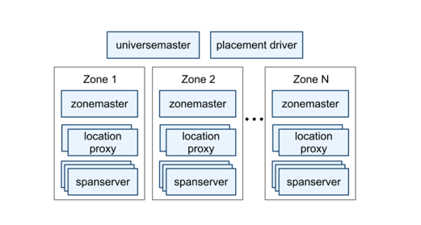
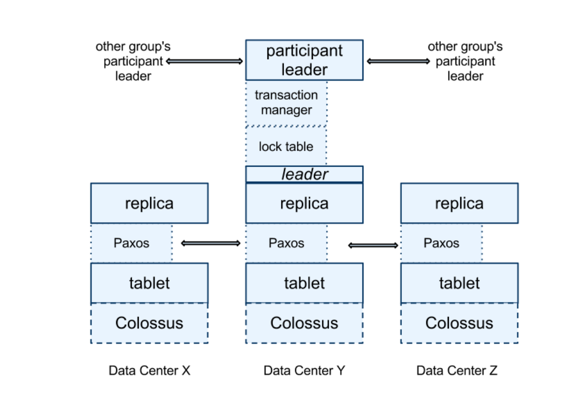

## Introduction

Spanner 是 Google 的可扩展、多版本、全球分布且同步复制的数据库。
在最抽象的层面上，它是一个数据库，将数据分片到分布在全球各地的数据中心中的多组 [Paxos 状态机](/docs/CS/Distributed/Consensus/Paxos.md) 上。
复制用于实现全球可用性和地理 locality；客户端在副本之间自动故障转移。
Spanner 会根据数据量或服务器数量的变化自动在机器之间重新分片数据，并且会自动跨机器（甚至跨数据中心）迁移数据以平衡负载和应对故障。
Spanner 旨在扩展到跨越数百个数据中心和数万亿数据库行的数百万台机器。

作为一个全球分布式数据库，Spanner 提供了几个有趣的功能。

- 首先，数据的复制配置可以由应用程序以细粒度动态控制。
  应用程序可以指定约束来控制哪些数据中心包含哪些数据、数据与用户之间的距离（以控制读取延迟）、
  副本之间的距离（以控制写入延迟），以及维护多少副本（以控制持久性、可用性和读取性能）。
  系统还可以动态透明地在数据中心之间移动数据，以平衡跨数据中心的资源使用。
- 其次，Spanner 有两个在分布式数据库中难以实现的功能：它提供外部一致性读写，以及在某个时间戳下跨数据库的全局一致性读取。

这些特性使 Spanner 能够支持全局范围内的一致性备份、一致性 MapReduce 执行和原子模式更新，即使在存在正在进行的交易的情况下也是如此。
这些特性得以实现的原因是，Spanner 为事务分配了全局有意义的提交时间戳，即使事务可能是分布式的。
时间戳反映了序列化顺序。
此外，序列化顺序满足外部一致性（或等价地，线性izability）：如果事务 T1 在另一个事务 T2 开始之前提交，则 T1 的提交时间戳小于 T2 的。
Spanner 是第一个在全球范围内提供此类保证的系统。

实现这些属性的关键是一个新的 TrueTime API 及其实现。
该 API 直接暴露了时钟的不确定性，Spanner 对时间戳的保证取决于实现提供的边界。
如果不确定性很大，Spanner 会减慢速度以等待该不确定性过去。
Google 的集群管理软件提供了 TrueTime API 的实现。
这种实现通过使用多个现代时钟参考（GPS 和原子钟）来保持不确定性很小（通常小于 10ms）。

## Data Model

Spanner 向应用程序公开以下一组数据特性：基于模式化半关系表的数据模型、查询语言和通用事务。
支持这些特性的转变是由许多因素驱动的。
对支持模式化半关系表和同步复制的需求得到了 Megastore 流行度的支持。

应用程序数据模型分层在实现支持的目录桶键值映射之上。
应用程序在 universe 中创建一个或多个数据库。
每个数据库可以包含无限数量的模式化表。
表看起来像关系数据库表，有行、列和版本化的值。我们不会详细讨论 Spanner 的查询语言。
它看起来像 SQL，并带有一些扩展以支持 protocol buffer 值字段。

Spanner 的数据模型并非纯粹关系型，因为行必须有名称。
更准确地说，每个表都需要有一组有序的一个或多个主键列。
这个要求是 Spanner 看起来仍然像键值存储的地方：主键构成行的名称，每个表定义了从主键列到非主键列的映射。
只有当为行的键定义了某个值（即使它是 NULL）时，行才存在。
施加这种结构很有用，因为它让应用程序通过选择键来控制数据 locality。

## Architecture

Spanner 的部署称为 universe。鉴于 Spanner 在全球范围内管理数据，只会存在少数几个运行的 universe。

Spanner 组织为一组 zone，其中每个 zone 大致相当于 Bigtable 服务器的部署单元。
Zone 是管理部署的单位。
Zone 集合也是数据可以复制的位置集合。
随着新数据中心的投入使用和旧数据中心的关闭，可以分别向运行系统添加 zone 或从中移除 zone。
Zone 也是物理隔离的单位：例如，一个数据中心中可能有一个或多个 zone，如果不同应用程序的数据必须在同一数据中心的不同服务器集合之间分区的话。



一个 zone 有一个 **zonemaster** 和一百到数千个 **spanserver**。
前者将数据分配给 spanserver；后者向客户端提供数据。
每个 zone 的 location proxy 由客户端用于定位分配来服务其数据的 spanserver。
Universe master 和 placement driver 目前是单例。
Universe master 主要是一个控制台，显示所有 zone 的状态信息，用于交互式调试。
Placement driver 处理以分钟为时间尺度跨 zone 的数据自动移动。
Placement driver 定期与 spanserver 通信，以发现需要移动的数据，无论是为了满足更新的复制约束还是为了平衡负载。

### Spanserver

Spanserver 软件栈如下图所示。



在底层，每个 spanserver 负责 100 到 1000 个称为 tablet 的数据结构实例。
Tablet 类似于 Bigtable 的 tablet 抽象，因为它实现了以下映射的集合：

```
(key:string, timestamp:int64) → string
```

与 Bigtable 不同，Spanner 为数据分配时间戳，这是 Spanner 更像多版本数据库而非键值存储的一个重要方面。
Tablet 的状态存储在一组类似 B 树的文件和预写日志中，所有这些都位于名为 Colossus 的分布式文件系统上（[Google File System](/docs/CS/Distributed/GFS.md) 的后继者）。

为了支持复制，每个 spanserver 在每个 tablet 之上实现一个单一的 Paxos 状态机。
（Spanner 的早期版本支持每个 tablet 多个 Paxos 状态机，这允许更灵活的复制配置。该设计的复杂性导致我们放弃了它。）
每个状态机将其元数据和日志存储在相应的 tablet 中。
我们的 Paxos 实现支持带有基于时间的 leader lease 的长寿命 leader，其长度默认为 10 秒。
当前的 Spanner 实现将每个 Paxos 写入记录两次：一次在 tablet 日志中，一次在 Paxos 日志中。
这个选择是出于权宜之计，我们很可能最终会解决这个问题。
我们的 Paxos 实现是流水线化的，以提高 Spanner 在面对 WAN 延迟时的吞吐量；但写入由 Paxos 按顺序应用。

Paxos 状态机用于实现一致复制的映射集合。
每个副本的键值映射状态存储在其相应的 tablet 中。
写入必须在 leader 处启动 Paxos 协议；读取直接从任何足够新的副本的底层 tablet 访问状态。
副本集合统称为 Paxos group。

在每个作为 leader 的副本处，每个 spanserver 实现一个锁表以实现并发控制。
锁表包含两阶段锁定的状态：它将键范围映射到锁状态。（注意，拥有长寿命的 Paxos leader 对于高效管理锁表至关重要。）
在 Bigtable 和 Spanner 中，我们设计了长寿命事务（例如，用于报告生成，可能需要几分钟量级），这在乐观并发控制下在存在冲突时性能不佳。
需要同步的操作（如事务性读取）在锁表中获取锁；其他操作绕过锁表。

### Directories

在键值映射集合之上，Spanner 实现了一个称为 directory 的桶抽象，它是一组共享共同前缀的连续键。
（选择 directory 这个术语是历史偶然；更好的术语可能是 bucket。）
支持 directory 允许应用程序通过仔细选择键来控制其数据的 locality。

Directory 是数据放置的单位。同一个 directory 中的所有数据具有相同的复制配置。
当数据在 Paxos group 之间移动时，以 directory 为单位进行移动。
Spanner 可能移动 directory 以减轻 Paxos group 的负载；将经常一起访问的 directory 放入同一 group；或者将 directory 移动到更接近其访问者的 group。
Directory 可以在客户端操作正在进行时移动。可以预期一个 50MB 的 directory 在几秒内完成移动。

一个 Paxos group 可能包含多个 directory，这意味着 Spanner tablet 不同于 Bigtable tablet：前者不一定是行空间的单个字典序连续分区。
相反，Spanner tablet 是一个容器，可以封装行空间的多个分区。
我们做出这个决定是为了能够将经常一起访问的多个 directory 放在同一位置。

## TrueTime

TrueTime API。参数 t 的类型是 TTstamp。

| Method       | Returns                              |
| -------------- | -------------------------------------- |
| TT.now()     | TTinterval: [earliest, latest]       |
| TT.after(t)  | true if t has definitely passed      |
| TT.before(t) | true if t has definitely not arrived |

TrueTime 显式地将时间表示为 TTinterval，这是一个具有有界时间不确定性的区间（与不给客户端任何不确定性概念的标准时间接口不同）。
TTinterval 的端点类型为 TTstamp。
TT.now() 方法返回一个保证包含调用 TT.now() 时的绝对时间的 TTinterval。
时间纪元类似于带有闰秒涂抹的 UNIX 时间。
定义瞬时误差界为区间宽度的一半，以及平均误差界。
TT.after() 和 TT.before() 方法是围绕 TT.now() 的便利包装。

TrueTime 使用的时间参考是 GPS 和原子钟。
TrueTime 使用两种时间参考形式，因为它们有不同的故障模式。
GPS 参考源的漏洞包括天线和接收器故障、本地无线电干扰、相关性故障（如闰秒处理不当和欺骗的设计缺陷）以及 GPS 系统中断。
原子钟可能以与 GPS 和彼此不相关的方式故障，并且在长时间内可能由于频率误差而显著漂移。

TrueTime 由每个数据中心的一组 time master 机器和每台机器上的 timeslave 守护进程实现。
大多数 master 配有带专用天线的 GPS 接收器；这些 master 在物理上是分开的，以减少天线故障、无线电干扰和欺骗的影响。
其余 master（我们称之为 Armageddon master）配备原子钟。
原子钟并不那么昂贵：Armageddon master 的成本与 GPS master 在同一数量级。
所有 master 的时间参考定期相互比较。
每个 master 还交叉检查其参考时间推进的速率与其本地时钟，并在出现较大偏差时自我驱逐。
在同步之间，Armageddon master 通告一个缓慢增加的时间不确定性，该不确定性来自保守应用的最坏情况时钟漂移。
GPS master 通告的不确定性通常接近于零。

## Concurrency Control

### Leases

Spanner 的 Paxos 实现使用定时 lease 来使 leadership 长寿命（默认 10 秒）。
潜在 leader 发送定时 lease 投票请求；收到 lease 投票的 quorum 后，leader 知道它拥有 lease。
副本在成功写入时隐式延长其 lease 投票，并且如果接近过期，leader 会请求 lease 投票延长。
定义 leader 的 lease 区间从它发现拥有 quorum 的 lease 投票时开始，到它不再拥有 quorum 的 lease 投票时结束（因为有些已过期）。
Spanner 依赖以下不重叠不变量：对于每个 Paxos group，每个 Paxos leader 的 lease 区间与所有其他 leader 的不重叠。

## Transaction

Spanner 实现支持 **读写事务**、**只读事务**（预声明的快照隔离事务）和 **快照读取**。
独立写入作为读写事务实现；非快照独立读取作为只读事务实现。
两者都在内部重试（客户端无需编写自己的重试循环）。

只读事务是一种具有快照隔离性能优势的事务。
只读事务必须被预先声明为没有任何写入；它不是一个没有任何写入的读写事务。
只读事务中的读取在系统选择的时间戳下执行，无需锁定，因此传入的写入不会被阻塞。

只读事务中的读取可以在任何足够新的副本上执行。
快照读取是对过去的读取，无需锁定即可执行。
客户端可以为快照读取指定时间戳，或者提供所需时间戳陈旧度的上限，让 Spanner 选择时间戳。
无论哪种情况，快照读取在任何足够新的副本上执行。

对于只读事务和快照读取，一旦选择了时间戳，提交就是不可避免的，除非该时间戳的数据已被垃圾回收。
因此，客户端可以避免在重试循环内缓冲结果。
当服务器失败时，客户端可以通过重复时间戳和当前读取位置在内部继续在不同的服务器上执行查询。

### Read-Write Transactions

与 Bigtable 一样，事务中发生的写入在客户端缓冲，直到提交。
因此，事务中的读取看不到该事务的写入效果。
这种设计在 Spanner 中运行良好，因为读取返回任何读取数据的时间戳，而未提交的写入尚未分配时间戳。
读写事务中的读取使用 wound wait 来避免死锁。

### Read-Only Transactions

分配时间戳需要在涉及读取的所有 Paxos group 之间进行协商阶段。
因此，Spanner 需要每个只读事务的 scope 表达式，该表达式汇总整个事务将要读取的键。
Spanner 为独立查询自动推断 scope。

### Schema-Change Transactions

TrueTime 使 Spanner 能够支持原子模式更改。
使用标准事务是不可行的，因为参与者的数量（数据库中的 group 数量）可能达到数百万。
Bigtable 支持单个数据中心内的原子模式更改，但其模式更改会阻塞所有操作。

Spanner 的模式更改事务是标准事务的一种通常非阻塞变体。

- 首先，它被显式分配一个未来的时间戳，该时间戳在准备阶段注册。
  因此，跨数千台服务器的模式更改可以在对并发活动影响最小的情况下完成。
- 其次，隐式依赖模式的读取和写入会在时间 t 与任何已注册的模式更改时间戳同步：如果它们的时间戳早于 t，则可以继续，但如果它们的时间戳在 t 之后，则必须阻塞在模式更改事务之后。

没有 TrueTime，定义模式更改发生在时间 t 是毫无意义的。

## Links

- [Google](/docs/CS/Distributed/Google.md)
- [GFS](/docs/CS/Distributed/GFS.md)

## References

1. [Spanner: Google's Globally-Distributed Database](https://www.usenix.org/system/files/conference/osdi12/osdi12-final-16.pdf)
