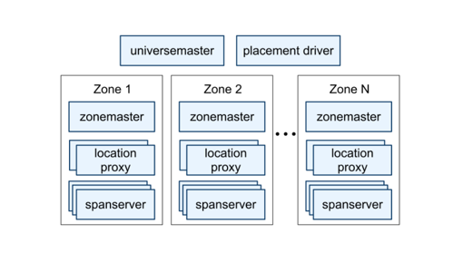
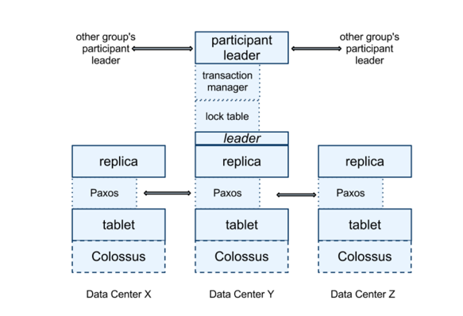

## Introduction

Spanner 是 Google 可扩展的、多版本的、全球分布式的、同步复制的数据库。在最高层抽象上，它是一个将 sharding 数据跨分布于全球各地数据中心的许多 [Paxos state machines](/docs/CS/Distributed/Consensus/Paxos.md) 集合的数据库。Replication 用于实现全球可用性和地理局部性；客户端在副本之间自动故障转移（failover）。Spanner 随着数据量或服务器数量的变化自动在机器间重新分片（reshard），并且它自动在机器间（甚至跨数据中心）迁移数据以平衡负载并应对故障。Spanner 的设计目标是扩展到跨数百个数据中心的数百万台机器以及数万亿（trillions）数据库行。

作为一个全球分布式数据库，Spanner 提供了若干有趣的特性。

- 首先，数据的复制配置可以由应用以细粒度动态控制。应用可以指定约束来控制哪些数据中心包含哪些数据、数据距离其用户有多远（以控制读延迟）、副本彼此之间的距离有多远（以控制写延迟），以及维护多少个副本（以控制持久性、可用性和读性能）。数据还可以由系统在数据中心之间动态且透明地移动，以平衡数据中心间的资源使用。
- 其次，Spanner 有两个在分布式数据库中难以实现的特性：它提供外部一致（externally consistent）的读写，以及在某个时间戳上的跨数据库全局一致读。

这些特性使 Spanner 能够在全球规模上支持一致的备份、一致的 MapReduce 执行和原子的 schema 更新，并且即使在存在进行中事务的情况下也能做到。这些特性之所以能够实现，是因为 Spanner 为事务分配具有全局意义（globally-meaningful）的提交时间戳，即使事务可能是分布式的。这些时间戳反映了串行化（serialization）顺序。此外，串行化顺序满足外部一致性（external consistency）（或者等价地，线性一致性（linearizability））：如果一个事务 T1 在另一个事务 T2 开始之前提交，那么 T1 的提交时间戳小于 T2 的。Spanner 是第一个在全球规模上提供此类保证的系统。

这些特性的关键促成因素是一个新的 TrueTime API 及其实现。该 API 直接暴露时钟不确定性（clock uncertainty），而 Spanner 时间戳上的保证依赖于该实现所提供的边界。如果不确定性很大，Spanner 会放慢速度以等待该不确定性消逝。Google 的集群管理软件提供了 TrueTime API 的一个实现。该实现通过使用多个现代时钟参考（GPS 和 atomic clock）将不确定性保持得很小（通常小于 10ms）。

## 数据模型

Spanner 向应用暴露以下一组数据特性：一个基于模式化（schematized）半关系表的数据模型、一种查询语言，以及通用目的的事务（transaction）。支持这些特性的举措是由许多因素推动的。支持模式化半关系表和同步复制的需求，得益于 Megastore 的流行。

应用数据模型层叠在由实现支持的、按目录分桶（directory-bucketed）的键值映射之上。一个应用在 universe 中创建一个或多个数据库。每个数据库可以包含无限数量的模式化表。表看起来像关系型数据库表，具有行、列和带版本的值。我们不会深入讨论 Spanner 的查询语言。它看起来像 SQL，并带有一些扩展以支持 protocol-buffer-valued 字段。

Spanner 的数据模型并非纯关系型的，因为行必须有名字。更准确地说，每个表都被要求有一组有序的一个或多个主键列。这个要求正是 Spanner 仍然看起来像一个键值存储的地方：主键构成了一行的名字，并且每个表定义了一个从主键列到非主键列的映射。只有当为行的键定义了某个值（即使它是 NULL）时，该行才存在。施加这种结构是有用的，因为它让应用通过其对键的选择来控制数据局部性。

## 架构

一个 Spanner 部署被称为一个 universe。鉴于 Spanner 在全球管理数据，将只会有少量的运行中的 universe。

Spanner 被组织为一组 zone，其中每个 zone 大致类似于一组 Bigtable server 的部署。Zone 是管理部署的单位。Zone 的集合也是数据可以被复制到的位置集合。随着新的数据中心投入使用以及旧的数据中心停用，zone 可以被添加到运行中的系统或从其中移除。Zone 也是物理隔离的单位：在一个数据中心中可能存在一个或多个 zone，例如，如果不同应用的数据必须被划分到同一数据中心中不同的服务器集合中。



一个 zone 有一个 *zonemaster* 和一百到几千个 *spanserver*。前者将数据分配给 spanserver；后者将数据提供给客户端。每个 zone 的位置代理（location proxy）被客户端用来定位被分配来服务其数据的 spanserver。Universe master 和 placement driver 目前是单例（singleton）。Universe master 主要是一个控制台，显示所有 zone 的状态信息以进行交互式调试。Placement driver 处理跨 zone 的数据在分钟级时间尺度上的自动移动。Placement driver 周期性地与 spanserver 通信，以找到需要被移动的数据，无论是为了满足更新的复制约束还是为了平衡负载。

### Spanserver

Spanserver 的软件栈如下图所示。



在最底层，每个 spanserver 负责 100 到 1000 个称为 tablet 的数据结构的实例。一个 tablet 类似于 Bigtable 的 tablet 抽象，因为它实现了一个如下映射的集合：

```
(key:string, timestamp:int64) → string
```

与 Bigtable 不同，Spanner 为数据分配时间戳，这是 Spanner 比键值存储更像多版本数据库的一个重要方面。一个 tablet 的状态被存储在一组类 B 树（B-tree-like）的文件和一个预写日志（write-ahead log）中，所有这些都位于一个称为 Colossus（[Google File System](/docs/CS/Distributed/GFS.md) 的继任者）的分布式文件系统上。

为了支持复制，每个 spanserver 在每个 tablet 之上实现一个单一的 Paxos state machine。（Spanner 早期的一个化身（incarnation）支持每个 tablet 多个 Paxos state machine，这允许更灵活的复制配置。该设计的复杂性导致我们放弃了它。）每个 state machine 将其元数据和日志存储在它对应的 tablet 中。我们的 Paxos 实现支持具有基于时间的 leader 租约（leader lease）的长期存活的 leader，其长度默认是 10 秒。当前的 Spanner 实现将每个 Paxos 写记录两次：一次在 tablet 的日志中，一次在 Paxos 日志中。这个选择是出于权宜之计，我们可能最终会补救它。我们的 Paxos 实现是流水线化的（pipelined），以提高 Spanner 在存在 WAN 延迟时的吞吐量；但写是由 Paxos 按顺序应用的。

Paxos state machine 被用来实现一个一致复制的映射集合。每个副本的键值映射状态存储在其对应的 tablet 中。写必须在 leader 处发起 Paxos 协议；读直接从任何足够新的副本处的底层 tablet 访问状态。这组副本 collectively 是一个 Paxos group。

在每个作为 leader 的副本处，每个 spanserver 实现一个锁表（lock table）来实现并发控制（concurrency control）。该锁表包含两阶段锁（two-phase locking）的状态：它将键的范围映射到锁状态。（注意，拥有一个长期存活的 Paxos leader 对于高效管理锁表至关重要。）在 Bigtable 和 Spanner 中，我们都是为长期存活的事务（例如报告生成，可能需要数分钟量级）而设计的，这些事务在存在冲突的情况下在乐观并发控制（optimistic concurrency control）下表现很差。需要同步的操作，例如事务读，会在锁表中获取锁；其他操作则绕过锁表。

### 目录

在键值映射集合之上，Spanner 实现支持一种称为 directory 的分桶抽象，它是一组共享一个公共前缀的连续键。（选择 directory 这个术语是一个历史意外；更好的术语可能是 bucket。）支持 directory 允许应用通过谨慎地选择键来控制其数据的局部性。

一个 directory 是数据放置的单位。一个 directory 中的所有数据具有相同的复制配置。当数据在 Paxos group 之间移动时，它是按 directory 移动的。Spanner 可能移动一个 directory 以从 Paxos group 卸下负载；将经常一起访问的 directory 放入同一个 group；或者将一个 directory 移动到一个更靠近其访问者的 group 中。Directory 可以在客户端操作进行期间被移动。可以预期一个 50MB 的 directory 可以在几秒内被移动。

一个 Paxos group 可能包含多个 directory 这一事实意味着一个 Spanner tablet 不同于一个 Bigtable tablet：前者不一定是一段字典序连续的行空间分区。相反，一个 Spanner tablet 是一个可能封装行空间的多个分区的容器。我们做出这个决定是为了能够把经常一起访问的多个 directory 放在一起。

## TrueTime

TrueTime API。参数 t 的类型是 TTstamp。

| Method       | Returns                              |
| -------------- | -------------------------------------- |
| TT.now()     | TTinterval: [earliest, latest]       |
| TT.after(t)  | 若 t 已确定过去则为 true              |
| TT.before(t) | 若 t 已确定未到达则为 true            |

TrueTime 显式地将时间表示为一个 TTinterval，它是一个具有有界时间不确定性（time uncertainty）的区间（不同于标准时间接口，后者不给客户端任何不确定性的概念）。一个 TTinterval 的端点是 TTstamp 类型。TT.now() 方法返回一个保证包含调用 TT.now() 时的绝对时间的 TTinterval。时间纪元（epoch）类似于带闰秒涂抹（leap-second smearing）的 UNIX 时间。将瞬时误差界限（instantaneous error bound）定义为 ，它是区间宽度的一半，并将平均误差界限（average error bound）定义为 。TT.after() 和 TT.before() 方法是围绕 TT.now() 的便利封装。

TrueTime 使用的底层时间参考是 GPS 和 atomic clock。TrueTime 使用两种形式的时间参考，因为它们具有不同的故障模式。GPS 参考源的漏洞包括天线和接收器故障、本地无线电干扰、相关故障（例如，不正确的闰秒处理和欺骗（spoofing）等设计缺陷），以及 GPS 系统停机。Atomic clock 可能以与 GPS 和彼此不相关的方式发生故障，并且在长时间内可能由于频率误差而显著漂移。

TrueTime 由每个数据中心的一组 time master 机器和每个机器上的一个 timeslave 守护进程实现。大多数 master 拥有带专用天线的 GPS 接收器；这些 master 在物理上分开，以减少天线故障、无线电干扰和欺骗（spoofing）的影响。其余的 master（我们称之为 Armageddon master）配备了 atomic clock。一个 atomic clock 并不那么昂贵：一个 Armageddon master 的成本与一个 GPS master 同量级。所有 master 的时间参考定期进行相互比较。每个 master 还交叉检查其参考推进时间的速度与其自身的本地时钟，如果有显著分歧就自我驱逐。在同步之间，Armageddon master 公布一个缓慢增长的时间不确定性，该不确定性源自保守应用的最坏情况时钟漂移。GPS master 公布的不确定性通常接近于零。

## 并发控制

### 租约

Spanner 的 Paxos 实现使用定时租约（timed lease）来使 leadership 长期存活（默认 10 秒）。一个潜在的 leader 发送定时租约投票（timed lease vote）请求；一旦收到法定人数（quorum）的租约投票，leader 就知道它拥有一个租约。一个副本在一次成功的写上隐式地延长其租约投票，而 leader 在它们接近过期时请求租约投票延期。将 leader 的租约区间（lease interval）定义为从它发现它拥有一个法定人数的租约投票开始，到它不再拥有法定人数（因为某些已过期）结束。Spanner 依赖于以下不相交（disjointness）不变式：对于每个 Paxos group，每个 Paxos leader 的租约区间都与其他每个 leader 的租约区间不相交。

## 事务

Spanner 的实现支持 *读写事务（read-write transactions）*、*只读事务（read-only transactions）*（预先声明的快照隔离事务），以及 *快照读（snapshot reads）*。独立的写被实现为读写事务；非快照的独立读被实现为只读事务。两者都在内部被重试（客户端无需编写自己的重试循环）。

只读事务是一种具有快照隔离性能优势的事务。只读事务必须预先声明为没有任何写；它不仅仅是一个没有任何写的读写事务。只读事务中的读在一个系统选择的时间戳上无锁地执行，从而不会阻塞到来的写。

只读事务中的读的执行可以在任何足够新的副本上进行。快照读是一个在过去执行且无需加锁的读。客户端可以要么为快照读指定一个时间戳，要么提供所需时间戳陈旧程度（staleness）的上界并让 Spanner 选择一个时间戳。无论哪种情况，快照读的执行都在任何足够新的副本上进行。

对于只读事务和快照读两者，一旦选择了一个时间戳，提交就是必然的，除非该时间戳处的数据已被垃圾回收（garbage collected）。结果，客户端可以避免在重试循环中缓冲结果。当一台 server 失败时，客户端可以通过重复时间戳和当前读位置，在另一台 server 上内部继续该查询。

### 读写事务

与 Bigtable 一样，发生在一个事务中的写被缓冲在客户端，直到提交。结果，事务中的读看不到该事务的写的效果。这个设计在 Spanner 中运作良好，因为一次读返回任何所读数据的时间戳，而未提交的写尚未被分配时间戳。读写事务内的读使用 wound wait 来避免死锁。

### 只读事务

分配一个时间戳需要所有参与到读中的 Paxos group 之间进行一个协商（negotiation）阶段。结果，Spanner 要求每个只读事务有一个作用域（scope）表达式，这是一个总结了整个事务将要读取的键的表达式。Spanner 自动推断独立查询的 scope。

### Schema 变更事务

TrueTime 使 Spanner 能够支持原子的 schema 变更。使用标准事务是不可行的，因为参与者（一个数据库中的 group 数量）的数量可能达到数百万。Bigtable 在一个数据中心内支持原子的 schema 变更，但它的 schema 变更会阻塞所有操作。

一个 Spanner schema 变更事务是标准事务的一种通常非阻塞的变体。

- 首先，它在未来被显式地分配一个时间戳，该时间戳在准备（prepare）阶段被注册。结果，跨数千台 server 的 schema 变更可以以对其他并发活动最小的干扰完成。
- 其次，隐式依赖于 schema 的读和写，会与任何在时刻 t 注册的 schema 变更时间戳同步：如果它们的时间戳在 t 之前，它们可以进行；但如果它们的时间戳在 t 之后，它们必须在 schema 变更事务之后阻塞。

如果没有 TrueTime，定义在 t 发生的 schema 变更将毫无意义。

## Links

- [Google](/docs/CS/Distributed/Google.md)
- [GFS](/docs/CS/Distributed/GFS.md)

## References

1. [Spanner: Google's Globally-Distributed Database](https://www.usenix.org/system/files/conference/osdi12/osdi12-final-16.pdf)
