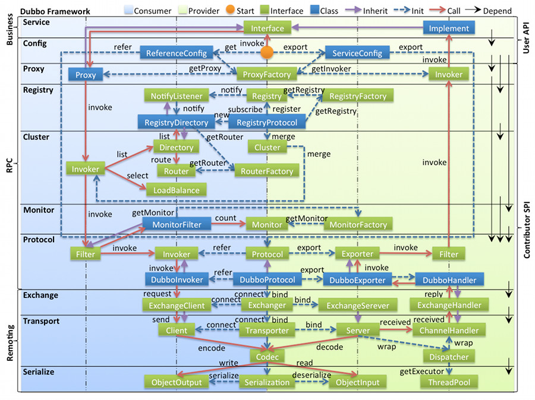

## Introduction

[Apache Dubbo](http://dubbo.apache.org/) is an easy-to-use, high-performance WEB and RPC framework with builtin service discovery, traffic management, observability, security features, tools and best practices for building enterprise-level microservices.

使用 Dubbo 开发的微服务原生具备相互之间的远程地址发现与通信能力，利用Dubbo 提供的丰富服务治理特性，可以实现诸如服务发现、负载均衡、流量调度等服务治理诉求。
Dubbo 被设计为高度可扩展，用户可以方便的实现流量拦截、选址的各种定制逻辑。
在云原生时代，Dubbo相继衍生出了Dubbo3、Proxyless Mesh等架构与解决方案，在易用性、超大规模微服务实践、云原生基础设施适配、安全性等几大方向上进行了全面升级。  

Dubbo 在很多大企业内部衍生出了独立版本，比如在阿里巴巴内部就基于Dubbo3 衍生出了 HSF3  

Fig.1. Architecture

以上是 Dubbo 的工作原理图，从抽象架构上分为两层：服务治理抽象控制面和Dubbo 数据面

- 服务治理控制面
  服务治理控制面不是特指如注册中心类的单个具体组件，而是对 Dubbo 治理体系的抽象表达。控制面包含协调服务发现的注册中心、流量管控策略、Dubbo Admin控制台等，如果采用了 Service Mesh 架构则还包含 Istio 等服务网格控制面。
-  Dubbo 数据面
  数据面代表集群部署的所有 Dubbo 进程，进程之间通过 RPC 协议实现数据交换，Dubbo 定义了微服务应用开发与调用规范并负责完成数据传输的编解码工作。
  - 服务消费者（Dubbo Consumer），发起业务调用或 RPC 通信的 Dubbo 进程。
  - 服务提供者（Dubbo Provider），接收业务调用或 RPC 通信的 Dubbo 进程。  

Dubbo 数据面
从数据面视角，Dubbo 帮助解决了微服务实践中的以下问题：

- Dubbo 作为服务开发框架约束了微服务定义、开发与调用的规范，定义了服务
  治理流程及适配模式。
- Dubbo 作为 RPC 通信协议实现解决服务间数据传输的编解码问题  

- [start](/docs/CS/Framework/Dubbo/Start.md)
- [Registry](/docs/CS/Framework/Dubbo/registry.md)
- [Remoting](/docs/CS/Framework/Dubbo/remoting.md)
- [cluster](/docs/CS/Framework/Dubbo/cluster.md)
- [Transporter](/docs/CS/Framework/Dubbo/Transporter.md)
- [LoadBalance](/docs/CS/Framework/Dubbo/LoadBalance.md)

## Design

### layers

### cluster

| 节点 |	角色说明 |
| :---: | :---: |
| Provider | 暴露服务的服务提供方 |
| Consumer | 调用远程服务的服务消费方 |
| Registry | 服务注册与发现的注册中心 |
| Monitor | 统计服务的调用次数和调用时间的监控中心 |
| Container | 服务运行容器 |

调用关系说明：

- 服务容器负责启动，加载，运行服务提供者。
- 服务提供者在启动时，向注册中心注册自己提供的服务。
- 服务消费者在启动时，向注册中心订阅自己所需的服务。
- 注册中心返回服务提供者地址列表给消费者，如果有变更，注册中心将基于长连接推送变更数据给消费者。
- 服务消费者，从提供者地址列表中，基于软负载均衡算法，选一台提供者进行调用，如果调用失败，再选另一台调用。
- 服务消费者和提供者，在内存中累计调用次数和调用时间，定时每分钟发送一次统计数据到监控中心。

## Package

### SPI

[SPI](/docs/CS/Framework/Dubbo/SPI.md)

use Adapter

Wrapper class

JavaAssist

### Protocol

| Protocol   | Transporter                        | Serialization               | Features                               | Applicable Scene                                             |
| :--------- | :--------------------------------- | --------------------------- | -------------------------------------- | ------------------------------------------------------------ |
| dubbo      | Mina, Netty, grizzy                | dubbo, hessian2, java, json | Single Long connection Async NIO TCP   | Multiple rquests with few contents or consumers much larger than providers |
| rmi        | Java rmi                           | Serializable                | Multiple short connections, Sync, TCP  |                                                              |
| hessian    | Servlet, default Jetty             | Hessian                     | Multiple short connections, Sync, HTTP |                                                              |
| http       | Spring HttpInvoker                 | form                        | Multiple short connections, Sync, HTTP | Unsupport upload files                                       |
| webservice | 传输：HTTP  序列化：SOAP文件序列化 |                             | Multiple short connections, Sync, HTTP |                                                              |
| Triple     |                                    | default ProtoBuf            | Single Long connection Async NIO TCP   |                                                              |

Protocol Invoker Exporter(wrapper Invoker)

## Transport
AbstractServer.doOpen()->create a Netty or Mina Server.

use NioEventLoop

Request Event connected by NettyServer -> AllChannelHandler -> Executor Service 
-> Dubbo Protocol invoke() -> received

- received
- handleRequest

-> reply()

RegistryProtocol

- create Registry
- do Register

Dispatcher
AllDispstcher

ThreadPool Model

GenericFilter

MultiHandler

[CVE-2020-1948](https://www.cve.org/CVERecord?id=CVE-2020-1948)

## Features

延迟暴露

## Links

- [RPC](/docs/CS/Distributed/RPC/RPC.md)