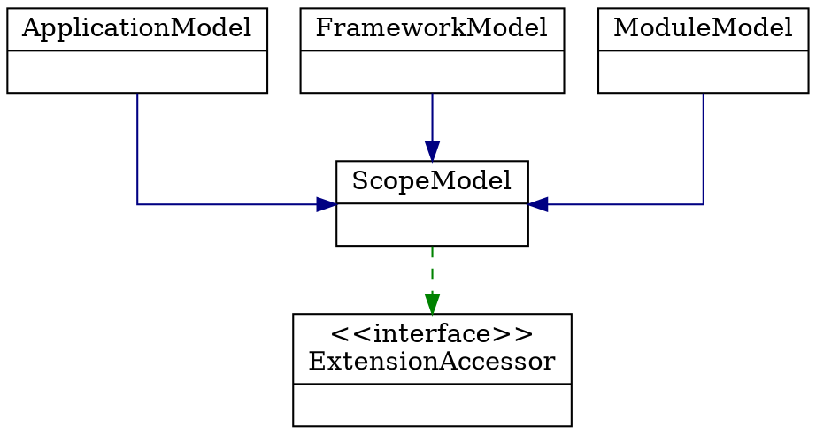

## Introduction

[Apache Dubbo](http://dubbo.apache.org/) 是一款易用、高性能的 WEB 和 RPC 框架，同时为构建企业级微服 务提供服务发现、流量治理、可观测、认证鉴权等能力、工具与最佳实践。

使用 Dubbo 开发的微服务原生具备相互之间的远程地址发现与通信能力，利用Dubbo 提供的丰富服务治理特性，可以实现诸如服务发现、负载均衡、流量调度等服务治理诉求。
Dubbo 被设计为高度可扩展，用户可以方便的实现流量拦截、选址的各种定制逻辑。
在云原生时代，Dubbo相继衍生出了Dubbo3、Proxyless Mesh等架构与解决方案，在易用性、超大规模微服务实践、云原生基础设施适配、安全性等几大方向上进行了全面升级。  


Dubbo 在很多大企业内部衍生出了独立版本，比如在阿里巴巴内部就基于Dubbo3 衍生出了 HSF3  


## Architecture

<div style="text-align: center;">


</div>

<p style="text-align: center;">
Fig.1. Architecture
</p>

以上是 Dubbo 的工作原理图，从抽象架构上分为两层：服务治理抽象控制面和Dubbo 数据面

- 服务治理控制面
  服务治理控制面不是特指如注册中心类的单个具体组件，而是对 Dubbo 治理体系的抽象表达。控制面包含协调服务发现的注册中心、流量管控策略、Dubbo Admin控制台等，如果采用了 Service Mesh 架构则还包含 Istio 等服务网格控制面。
-  Dubbo 数据面
  数据面代表集群部署的所有 Dubbo 进程，进程之间通过 RPC 协议实现数据交换，Dubbo 定义了微服务应用开发与调用规范并负责完成数据传输的编解码工作。
  - 服务消费者（Dubbo Consumer），发起业务调用或 RPC 通信的 Dubbo 进程。
  - 服务提供者（Dubbo Provider），接收业务调用或 RPC 通信的 Dubbo 进程。  


Dubbo 数据面
从数据面视角，Dubbo 帮助解决了微服务实践中的以下问题：

- Dubbo 作为服务开发框架约束了微服务定义、开发与调用的规范，定义了服务
  治理流程及适配模式。
- Dubbo 作为 RPC 通信协议实现解决服务间数据传输的编解码问题  


Dubbo 在微服务应用开发框架之上抽象了一 套 RPC 服务定义、暴露、调用与治理的编程范式，比如 Dubbo Java 作为服务开发 框架，当运行在 Spring 体系时就是构建在 Spring Boot 应用开发框架之上的微服务 开发框架，并在此之上抽象了一套 RPC 服务定义、暴露、调用与治理的编程范式。


- [start](/docs/CS/Framework/Dubbo/Start.md)
- [Registry](/docs/CS/Framework/Dubbo/registry.md)
- [Remoting](/docs/CS/Framework/Dubbo/remoting.md)
- [cluster](/docs/CS/Framework/Dubbo/cluster.md)
- [Transporter](/docs/CS/Framework/Dubbo/Transporter.md)
- [LoadBalance](/docs/CS/Framework/Dubbo/LoadBalance.md)


Dubbo 在微服务应用开发框架之上抽象了一 套 RPC 服务定义、暴露、调用与治理的编程范式，比如 Dubbo Java 作为服务开发 框架，当运行在 Spring 体系时就是构建在 Spring Boot 应用开发框架之上的微服务 开发框架，并在此之上抽象了一套 RPC 服务定义、暴露、调用与治理的编程范式


Dubbo 从设计上不绑定任何一款特定通信协议，HTTP/2、REST、gRPC、JsonRPC、 Thrift、Hessian2 等几乎所有主流的通信协议，Dubbo 框架都可以提供支持。

服务开发框架解决了开发与通信的问题，但在微服务集群环境下，我们仍需要解决 无状态服务节点动态变化、外部化配置、日志跟踪、可观测性、流量管理、高可用 性、数据一致性等一系列问题，我们将这些问题统称为服务治理。
Apache Dubbo 概念与架构 13Dubbo 抽象了一套微服务治理模式并发布了对应的官方实现，服务治理可帮助简化 微服务开发与运维，让开发者更专注在微服务业务本身。


### Dubbo和其它框架的比较

很多开发者经常会问到 Apache Dubbo 与 Spring Cloud、gRPC 以及一些 Service Mesh 项目如 Istio 的关系

<!-- tabs:start -->

##### **Dubbo 和 Spring Cloud**

从下图我们可以看出，Dubbo 和 Spring Cloud 有很多相似之处，它们都在整个架构图的相同位置并提供一些相似的功能。
- Dubbo 和 Spring Cloud 都侧重在对分布式系统中常见问题模式的抽象(如服 务发现、负载均衡、动态配置等)，同时对每一个问题都提供了配套组件实现， 形成了一套微服务整体解决方案，让使用 Dubbo 及 Spring Cloud 的用户在开 发微服务应用时可以专注在业务逻辑开发上。
- Dubbo 和 Spring Cloud 都完全兼容 Spring 体系的应用开发模式，Dubbo 对 Spring 应用开发框架、Spring Boot 微服务框架都做了很好的适配，由于 Spring Cloud 出自 Spring 体系，在这一点上自然更不必多说

<div style="text-align: center;">


</div>

<p style="text-align: center;">
Fig.1. Dubbo和Spring Cloud比较
</p>

虽然两者有很多相似之处，但由于它们在诞生背景与架构设计上的巨大差异，两者 在性能、适用的微服务集群规模、生产稳定性保障、服务治理等方面都有很大差异。

Spring Cloud 的优势在于:
- 同样都支持 Sprig 开发体系的情况下，Spring Cloud 得到更多的原生支持。
- 对一些常用的微服务模式做了抽象如服务发现、动态配置、异步消息等，同时 包括一些批处理任务、定时任务、持久化数据访问等领域也有涉猎。
- 基于 HTTP 的通信模式，加上相对比较完善的入门文档和演示 demo 和 starters， 让开发者在第一感觉上更易于上手。

Spring Cloud 的问题有:
- 只提供抽象模式的定义不提供官方稳定实现，开发者只能寻求类似 Netflix、 Alibaba、Azure 等不同厂商的实现套件，而每个厂商支持的完善度、稳定性、 活跃度各异。
- 有微服务全家桶却不是能拿来就用的全家桶，demo 上手容易，但落地推广与 长期使用的成本非常高。
- 欠缺服务治理能力，尤其是流量管控方面如负载均衡、流量路由方便能力都比 较弱。
- 编程模型与通信协议绑定 HTTP，在性能、与其他 RPC 体系互通上存在障碍。
- 总体架构与实现只适用于小规模微服务集群实践，当集群规模增长后就会遇到 地址推送效率、内存占用等各种瓶颈的问题，但此时迁移到其他体系却很难实 现。
- 很多微服务实践场景的问题需要用户独自解决，比如优雅停机、启动预热、服 务测试，再比如双注册、双订阅、延迟注册、服务按分组隔离、集群容错等。

而以上这些点，都是 Dubbo 的优势所在:
- 完全支持 Spring & Spring Boot 开发模式，同时在服务发现、动态配置等基础模式上提供与 Spring Cloud 对等的能力。
- 是企业级微服务实践方案的整体输出，Dubbo 考虑到了企业微服务实践中会遇 到的各种问题如优雅上下线、多注册中心、流量管理等，因此其在生产环境的 长期维护成本更低。
- 在通信协议和编码上选择更灵活，包括 rpc 通信层协议如 HTTP、HTTP/2(Triple、 gRPC)、TCP 二进制协议、rest 等，序列化编码协议 Protobuf、JSON、Hessian2 等，支持单端口多协议。Apache Dubbo 概念与架构 30• Dubbo 从设计上突出服务服务治理能力，如权重动态调整、标签路由、条件路 由等，支持 Proxyless 等多种模式接入 Service Mesh 体系。
- 高性能的 RPC 协议编码与实现。
- Dubbo 是在超大规模微服务集群实践场景下开发的框架，可以做到百万实例规模的集群水平扩容，应对集群增长带来的各种问题。
- Dubbo 提供 Java 外的多语言实现，使得构建多语言异构的微服务体系成为可能。 


Dubbo 在入门资料上的欠缺是对比 Spring Cloud 的一个劣势，这体现在依 赖配置管理、文档、demo 示例完善度上


##### **Dubbo与gRPC**


Dubbo 与 gRPC 最大的差异在于两者的定位上:
- gRPC 定位为一款 RPC 框架，Google 推出它的核心目标是定义云原生时代的 rpc 通信规范与标准实现。
- Dubbo 定位是一款微服务开发框架，它侧重解决微服务实践从服务定义、开发、 通信到治理的问题，因此 Dubbo 同时提供了 RPC 通信、与应用开发框架的适 配、服务治理等能力。

Apache Dubbo 概念与架构 31Dubbo 不绑定特定的通信协议，即 Dubbo 服务间可通过多种 RPC 协议通信并支持 灵活切换。因此，你可以在 Dubbo 开发的微服务中选用 gRPC 通信，Dubbo 完全 兼容 gRPC，并将 gRPC 设计为内置原生支持的协议之一。

gRPC 没有为开发者提供以下能力:
- 缺乏与业务应用框架集成的开发模式，用户需要基于 gRPC 底层的 RPC API 定 义、发布或调用微服务，中间可能还有与业务应用开发框架整合的问题。
- 缺乏微服务周边生态扩展与适配，如服务发现、限流降级、链路追踪等没有多 少可供选择的官方实现，且扩展起来非常困难。
- 缺乏服务治理能力，作为一款 rpc 框架，缺乏对服务治理能力的抽象。

因此，gRPC 更适合作为底层的通信协议规范或编解码包，而 Dubbo 则可用作微服 务整体解决方案。对于 gRPC 协议，我们推荐的使用模式 Dubbo+gRPC 的组合，这 个时候，gRPC 只是隐藏在底层的一个通信协议，不被微服务开发者感知，开发者基 于 Dubbo 提供的 API 和配置开发服务，并基于 dubbo 的服务治理能力治理服务

##### **Dubbo与Istio**

Service Mesh 是近年来在云原生背景下诞生的一种微服务架构，在 Kubernetes 体 系下，让微服务开发中的更多能力如流量拦截、服务治理等下沉并成为基础设施， 让微服务开发、升级更轻量。Istio 是 Service Mesh 的开源代表实现，它从部署架构 上分为数据面与控制面，从这一点上与 Dubbo 总体架构是基本一致的，Istio 带来 的主要变化在于:
- 数据面，Istio 通过引入 Sidecar 实现了对服务流量的透明拦截，Sidecar 通常是 与 Dubbo 等开发的传统微服务组件部署在一起。
- 控制面，将之前抽象的服务治理中心聚合为一个具有统一实现的具体组件，并 实现了与底层基础设施如 Kubernetes 无缝适配。

Dubbo 已经实现了对 Istio 体系的全面接入，可以用 Istio 控制面治理 Dubbo 服务， 而在数据面部署架构上，针对 Sidecar 引入的复杂性与性能问题，Dubbo 还支持无 代理的 Proxyless 模式。
除此之外，Dubbo Mesh 体系还解决了 Istio 架构落地过程中的很多问题，包括提供 更灵活的数据面部署架构、更低的迁移成本等。

从数据面的视角，Dubbo 支持如下两种开发和部署模式，可以通过 Istio、Consul、 Linkerd 等控制面组件实现对数据面服务的治理。
- Proxy 模式，Dubbo 与 Envoy 一起部署，Dubbo 作为编程框架&协议通信组件 存在，流量管控由 Envoy 与 Istio 控制面交互实现。
- Proxyless 模式，Dubbo 进程保持独立部署，Dubbo 通过标准 xDS 协议直接 接入 Istio 等控制面组件。

从控制面视角，Dubbo 可接入原生 Istio 标准控制面和规则体系，而对于一些 Dubbo 老版本用户，Dubbo Mesh 提供了平滑迁移方案，具体请查看 Dubbo Mesh 服务网格。


<!-- tabs:end -->


## Data Model


注册数据

Dubbo3的注册信息新增:

- `/dubbo/metadata` **元数据信息**
- `/dubbo/mapping` 服务和应用的 **映射信息**
- `/dubbo/config` **注册中心配置**
- `/services目录` **应用信息**

### ServiceConfig

服务的配置 ServiceConfig


ScopeNodel

```java
public ServiceConfigBase() {
        //服务元数据对象创建
        serviceMetadata = new ServiceMetadata();
        //为服务元数据对象
        serviceMetadata.addAttribute("ORIGIN_CONFIG", this);
    }
```


```java
public final void setScopeModel(ScopeModel scopeModel) {
    if (scopeModel != null && this.scopeModel != scopeModel) {
        checkScopeModel(scopeModel);
        ScopeModel oldScopeModel = this.scopeModel;
        this.scopeModel = scopeModel;
        // reinitialize spi extension and change referenced config's scope model
        this.postProcessAfterScopeModelChanged(oldScopeModel, this.scopeModel);
    }
}
```

postProcessAfterScopeModelChanged 从父类到子类执行


AbstractInterfaceConfig

```java
@Override
protected void postProcessAfterScopeModelChanged(ScopeModel oldScopeModel, ScopeModel newScopeModel) {
    super.postProcessAfterScopeModelChanged(oldScopeModel, newScopeModel);
    // change referenced config's scope model
    ApplicationModel applicationModel = ScopeModelUtil.getApplicationModel(getScopeModel());
    if (this.configCenter != null && this.configCenter.getScopeModel() != applicationModel) {
        this.configCenter.setScopeModel(applicationModel);
    }
    if (this.metadataReportConfig != null && this.metadataReportConfig.getScopeModel() != applicationModel) {
        this.metadataReportConfig.setScopeModel(applicationModel);
    }
    if (this.monitor != null && this.monitor.getScopeModel() != applicationModel) {
        this.monitor.setScopeModel(applicationModel);
    }
    if (CollectionUtils.isNotEmpty(this.registries)) {
        this.registries.forEach(registryConfig -> {
            if (registryConfig.getScopeModel() != applicationModel) {
                registryConfig.setScopeModel(applicationModel);
            }
        });
    }
}
```


ServiceConfigBase

```java
@Override
protected void postProcessAfterScopeModelChanged(ScopeModel oldScopeModel, ScopeModel newScopeModel) {
    super.postProcessAfterScopeModelChanged(oldScopeModel, newScopeModel);
    if (this.provider != null && this.provider.getScopeModel() != getScopeModel()) {
        this.provider.setScopeModel(getScopeModel());
    }
}
```
ServiceConfig
```java
@Override
protected void postProcessAfterScopeModelChanged(ScopeModel oldScopeModel, ScopeModel newScopeModel) {
    super.postProcessAfterScopeModelChanged(oldScopeModel, newScopeModel);
    protocolSPI = this.getExtensionLoader(Protocol.class).getAdaptiveExtension();
    proxyFactory = this.getExtensionLoader(ProxyFactory.class).getAdaptiveExtension();
}
```

## ScopeModel

**为什么会在Dubbo3的新版本中加入这个域模型呢** ，主要有如下原因 之前dubbo都是只有一个作用域的，通过静态类属性共享增加域模型是为了: 

1. 让Dubbo支持多应用的部署，这块一些大企业有诉求 
2. 从架构设计上，解决静态属性资源共享、清理的问题 
3. 分层模型将应用的管理和服务的管理分开

Dubbo3中在启动时候需要启动配置中心、元数据中心，这个配置中心和元数据中心可以归应用模型来管理。 Dubbo作为RPC框架又需要启动服务和引用服务，服务级别的管理就交给了这个模块模型来管理。 分层次的管理方便我们理解和处理逻辑，父子级别的模型又方便了数据传递。





| 类型                  | 说明                                                         |
| :-------------------- | :----------------------------------------------------------- |
| **ExtensionAccessor** | - 扩展的统一访问器 - 用于获取扩展加载管理器ExtensionDirector对象 **获取扩展对象ExtensionLoader** 根据扩展名字 **获取具体扩展对象** - 获取自适应扩展对象- 获取默认扩展对象 |
| **ScopeModel**        | 模型对象的公共抽象父类型 ，内部id用于表示模型树的层次结构 公共模型名称，可以被用户设置 描述信息 类加载器管理 父模型管理parent 当前模型的所属域ExtensionScope有: **FRAMEWORK(框架)** ，**APPLICATION(应用)** ，**MODULE(模块)** ，**SELF(自给自足** ，为每个作用域创建一个实例，用于特殊的SPI扩展，如ExtensionInjector) 具体的扩展加载程序管理器对象的管理: **ExtensionDirector** 域Bean工厂管理，一个内部共享的Bean工厂 **ScopeBeanFactory** |
| **FrameworkModel**    | dubbo框架模型，可与多个应用程序共享 - FrameworkModel实例对象集合，allInstances ，所有ApplicationModel实例对象集合，applicationModels ，发布的ApplicationModel实例对象集合pubApplicationModels ，框架的服务存储库 **FrameworkServiceRepository** 类型对象(数据存储在内存中) ，内部的应用程序模型对象internalApplicationModel |
| **ApplicationModel**  | 表示正在使用Dubbo的应用程序，并存储基本 **元数据信息** ，以便在RPC调用过程中使用。 ApplicationModel包括许多关于 **发布服务** 的ProviderModel和许多关于订阅服务的Consumer Model。 |
| **ModuleModel**       | 服务模块的模型                                               |

### defaultModel

```java
 public static ApplicationModel defaultModel() {
        // should get from default FrameworkModel, avoid out of sync
        return FrameworkModel.defaultModel().defaultApplication();
    }
```

During destroying the default FrameworkModel, the FrameworkModel.defaultModel() or ApplicationModel.defaultModel() will return a broken model, maybe cause unpredictable problem.

Recommendation: Avoid using the default model as much as possible.


```java
public static FrameworkModel defaultModel() {
    FrameworkModel instance = defaultInstance;
    if (instance == null) {
        synchronized (globalLock) {
            resetDefaultFrameworkModel();
            if (defaultInstance == null) {
                defaultInstance = new FrameworkModel();
            }
            instance = defaultInstance;
        }
    }
    return instance;
}
```

#### resetDefaultFrameworkModel

```java
private static void resetDefaultFrameworkModel() {
    synchronized (globalLock) {
        if (defaultInstance != null && !defaultInstance.isDestroyed()) {
            return;
        }
        FrameworkModel oldDefaultFrameworkModel = defaultInstance;
        if (allInstances.size() > 0) {
            defaultInstance = allInstances.get(0);
        } else {
            defaultInstance = null;
        }
        if (oldDefaultFrameworkModel != defaultInstance) {
            if (LOGGER.isInfoEnabled()) {
                LOGGER.info("Reset global default framework from " + safeGetModelDesc(oldDefaultFrameworkModel)
                        + " to " + safeGetModelDesc(defaultInstance));
            }
        }
    }
}
```


### FrameworkModel


```java
public FrameworkModel() {
    super(null, ExtensionScope.FRAMEWORK, false);
    synchronized (globalLock) {
        synchronized (instLock) {
            this.setInternalId(String.valueOf(index.getAndIncrement()));
            // register FrameworkModel instance early
            allInstances.add(this);
            if (LOGGER.isInfoEnabled()) {
                LOGGER.info(getDesc() + " is created");
            }
            initialize();

            TypeDefinitionBuilder.initBuilders(this);

            serviceRepository = new FrameworkServiceRepository(this);

            ExtensionLoader<ScopeModelInitializer> initializerExtensionLoader =
                    this.getExtensionLoader(ScopeModelInitializer.class);
            Set<ScopeModelInitializer> initializers = initializerExtensionLoader.getSupportedExtensionInstances();
            for (ScopeModelInitializer initializer : initializers) {
                initializer.initializeFrameworkModel(this);
            }

            internalApplicationModel = new ApplicationModel(this, true);
            internalApplicationModel
                    .getApplicationConfigManager()
                    .setApplication(new ApplicationConfig(
                            internalApplicationModel, CommonConstants.DUBBO_INTERNAL_APPLICATION));
            internalApplicationModel.setModelName(CommonConstants.DUBBO_INTERNAL_APPLICATION);
        }
    }
}
```

#### FrameworkModel::initialize

```java
protected void initialize() {
        synchronized (instLock) {
            this.extensionDirector =
                    new ExtensionDirector(parent != null ? parent.getExtensionDirector() : null, scope, this);
            this.extensionDirector.addExtensionPostProcessor(new ScopeModelAwareExtensionProcessor(this));
            this.beanFactory = new ScopeBeanFactory(parent != null ? parent.getBeanFactory() : null, extensionDirector);

            // Add Framework's ClassLoader by default
            ClassLoader dubboClassLoader = ScopeModel.class.getClassLoader();
            if (dubboClassLoader != null) {
                this.addClassLoader(dubboClassLoader);
            }
        }
    }
```


域模型初始化器的获取与初始化(ScopeModelInitializer类型和initializeFrameworkModel方法) 加载到的ScopeModelInitializer类型的SPI扩展实现


域模型初始化器的SPI扩展类型有如下8个:


创建ApplicationConfig对象让后将其添加至应用模型中 内部应用程序模型，这里为应用配置管理器设置一个应用配置对象，将这个应用配置的模块名字配置名字设置为DUBBO_INTERNAL_APPLICATION， 应用配置记录着我们常见的应用配置信息


### AplicationModel

 

```java
protected ApplicationModel(FrameworkModel frameworkModel, boolean isInternal) {
    super(frameworkModel, ExtensionScope.APPLICATION, isInternal);
    synchronized (instLock) {
        Assert.notNull(frameworkModel, "FrameworkModel can not be null");
        this.frameworkModel = frameworkModel;
        frameworkModel.addApplication(this);
        if (LOGGER.isInfoEnabled()) {
            LOGGER.info(getDesc() + " is created");
        }
        initialize();

        this.internalModule = new ModuleModel(this, true);
        this.serviceRepository = new ServiceRepository(this);

        ExtensionLoader<ApplicationInitListener> extensionLoader =
                this.getExtensionLoader(ApplicationInitListener.class);
        Set<String> listenerNames = extensionLoader.getSupportedExtensions();
        for (String listenerName : listenerNames) {
            extensionLoader.getExtension(listenerName).init();
        }

        initApplicationExts();

        ExtensionLoader<ScopeModelInitializer> initializerExtensionLoader =
                this.getExtensionLoader(ScopeModelInitializer.class);
        Set<ScopeModelInitializer> initializers = initializerExtensionLoader.getSupportedExtensionInstances();
        for (ScopeModelInitializer initializer : initializers) {
            initializer.initializeApplicationModel(this);
        }

        Assert.notNull(getApplicationServiceRepository(), "ApplicationServiceRepository can not be null");
        Assert.notNull(getApplicationConfigManager(), "ApplicationConfigManager can not be null");
        Assert.assertTrue(
                getApplicationConfigManager().isInitialized(), "ApplicationConfigManager can not be initialized");
    }
}
```


```java
public static ApplicationModel defaultModel() {
    // should get from default FrameworkModel, avoid out of sync
    return FrameworkModel.defaultModel().defaultApplication();
}
```


```java
public ApplicationModel defaultApplication() {
    ApplicationModel appModel = this.defaultAppModel;
    if (appModel == null) {
        // check destroyed before acquire inst lock, avoid blocking during destroying
        checkDestroyed();
        resetDefaultAppModel();
        if ((appModel = this.defaultAppModel) == null) {
            synchronized (instLock) {
                if (this.defaultAppModel == null) {
                    this.defaultAppModel = newApplication();
                }
                appModel = this.defaultAppModel;
            }
        }
    }
    Assert.notNull(appModel, "Default ApplicationModel is null");
    return appModel;
}
```


```java
private void resetDefaultAppModel() {
    synchronized (instLock) {
        if (this.defaultAppModel != null && !this.defaultAppModel.isDestroyed()) {
            return;
        }
        ApplicationModel oldDefaultAppModel = this.defaultAppModel;
        if (pubApplicationModels.size() > 0) {
            this.defaultAppModel = pubApplicationModels.get(0);
        } else {
            this.defaultAppModel = null;
        }
        if (defaultInstance == this && oldDefaultAppModel != this.defaultAppModel) {
            if (LOGGER.isInfoEnabled()) {
                LOGGER.info("Reset global default application from " + safeGetModelDesc(oldDefaultAppModel) + " to "
                        + safeGetModelDesc(this.defaultAppModel));
            }
        }
    }
}
```


```java
private void initApplicationExts() {
    Set<ApplicationExt> exts = this.getExtensionLoader(ApplicationExt.class).getSupportedExtensionInstances();
    for (ApplicationExt ext : exts) {
        ext.initialize();
    }
}
```


ConfigManager的作用，无锁配置管理器（通过ConcurrentHashMap），用于快速读取操作。写入操作锁带有配置类型的子配置映射，用于安全检查和添加新配置

AbstractConfigManager的初始化方法initialize

```java
public abstract class AbstractConfigManager extends LifecycleAdapter {
@Override
public void initialize() throws IllegalStateException {
    if (!initialized.compareAndSet(false, true)) {
        return;
    }
    CompositeConfiguration configuration = scopeModel.modelEnvironment().getConfiguration();

    // dubbo.config.mode
    String configModeStr = (String) configuration.getProperty(ConfigKeys.DUBBO_CONFIG_MODE);
    try {
        if (StringUtils.hasText(configModeStr)) {
            this.configMode = ConfigMode.valueOf(configModeStr.toUpperCase());
        }
    } catch (Exception e) {
        String msg = "Illegal '" + ConfigKeys.DUBBO_CONFIG_MODE + "' config value [" + configModeStr
                + "], available values " + Arrays.toString(ConfigMode.values());
        logger.error(COMMON_PROPERTY_TYPE_MISMATCH, "", "", msg, e);
        throw new IllegalArgumentException(msg, e);
    }

    // dubbo.config.ignore-duplicated-interface
    String ignoreDuplicatedInterfaceStr =
            (String) configuration.getProperty(ConfigKeys.DUBBO_CONFIG_IGNORE_DUPLICATED_INTERFACE);
    if (ignoreDuplicatedInterfaceStr != null) {
        this.ignoreDuplicatedInterface = Boolean.parseBoolean(ignoreDuplicatedInterfaceStr);
    }

    // print
    Map<String, Object> map = new LinkedHashMap<>();
    map.put(ConfigKeys.DUBBO_CONFIG_MODE, configMode);
    map.put(ConfigKeys.DUBBO_CONFIG_IGNORE_DUPLICATED_INTERFACE, this.ignoreDuplicatedInterface);
    logger.info("Config settings: " + map);
}
}
```


Environment类型的initialize方法

```java
@Override
public void initialize() throws IllegalStateException {
    if (initialized.compareAndSet(false, true)) {
        this.propertiesConfiguration = new PropertiesConfiguration(scopeModel);
        this.systemConfiguration = new SystemConfiguration();
        this.environmentConfiguration = new EnvironmentConfiguration();
        this.externalConfiguration = new InmemoryConfiguration("ExternalConfig");
        this.appExternalConfiguration = new InmemoryConfiguration("AppExternalConfig");
        this.appConfiguration = new InmemoryConfiguration("AppConfig");

        loadMigrationRule();
    }
}
```


### ModuleModel


### layers


调用链路


### cluster

| 节点 |	角色说明 |
| :---: | :---: |
| Provider | 暴露服务的服务提供方 |
| Consumer | 调用远程服务的服务消费方 |
| Registry | 服务注册与发现的注册中心 |
| Monitor | 统计服务的调用次数和调用时间的监控中心 |
| Container | 服务运行容器 |

调用关系说明：

- 服务容器负责启动，加载，运行服务提供者。
- 服务提供者在启动时，向注册中心注册自己提供的服务。
- 服务消费者在启动时，向注册中心订阅自己所需的服务。
- 注册中心返回服务提供者地址列表给消费者，如果有变更，注册中心将基于长连接推送变更数据给消费者。
- 服务消费者，从提供者地址列表中，基于软负载均衡算法，选一台提供者进行调用，如果调用失败，再选另一台调用。
- 服务消费者和提供者，在内存中累计调用次数和调用时间，定时每分钟发送一次统计数据到监控中心。

## Package

### SPI

[SPI](/docs/CS/Framework/Dubbo/SPI.md)

use Adapter

Wrapper class

JavaAssist

### Protocol

| Protocol   | Transporter                        | Serialization               | Features                               | Applicable Scene                                             |
| :--------- | :--------------------------------- | --------------------------- | -------------------------------------- | ------------------------------------------------------------ |
| dubbo      | Mina, Netty, grizzy                | dubbo, hessian2, java, json | Single Long connection Async NIO TCP   | Multiple rquests with few contents or consumers much larger than providers |
| rmi        | Java rmi                           | Serializable                | Multiple short connections, Sync, TCP  |                                                              |
| hessian    | Servlet, default Jetty             | Hessian                     | Multiple short connections, Sync, HTTP |                                                              |
| http       | Spring HttpInvoker                 | form                        | Multiple short connections, Sync, HTTP | Unsupport upload files                                       |
| webservice | 传输：HTTP  序列化：SOAP文件序列化 |                             | Multiple short connections, Sync, HTTP |                                                              |
| Triple     |                                    | default ProtoBuf            | Single Long connection Async NIO TCP   |                                                              |


Protocol Invoker Exporter(wrapper Invoker)

## Transport
AbstractServer.doOpen()->create a Netty or Mina Server.

use NioEventLoop

Request Event connected by NettyServer -> AllChannelHandler -> Executor Service 
-> Dubbo Protocol invoke() -> received

- received
- handleRequest

-> reply()

RegistryProtocol

- create Registry
- do Register

Dispatcher
AllDispstcher

ThreadPool Model

GenericFilter

MultiHandler


[CVE-2020-1948](https://www.cve.org/CVERecord?id=CVE-2020-1948)


## Features

延迟暴露


## Links

- [RPC](/docs/CS/Distributed/RPC/RPC.md)