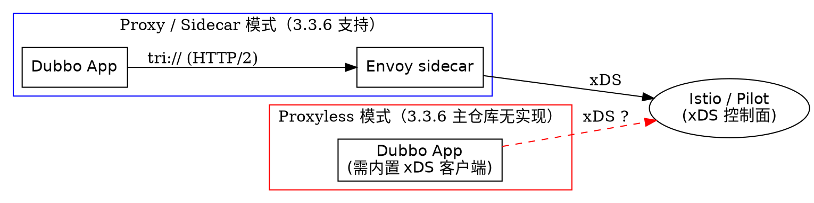

## Introduction

网上有大量文章声称「Dubbo 3 支持 Proxyless 模式直接接入 Istio 控制面」。本文要在**源码层面**把这个说法拆开：Dubbo 3.3.6 主仓库里有 Mesh 相关的真实代码，但**没有 Proxyless 直连 xDS 控制面的实现**。把「文档愿景」当成「源码现状」是这一主题最常见的错误。

先破除三个直觉：

- **「主仓库里有一个 `dubbo-xds` / `dubbo-registry-xds` 模块负责直连 Istio」**——不成立。`dubbo-registry/` 下只有 `api` / `multicast` / `multiple` / `nacos` / `zookeeper`，没有 xDS registry；整棵源码树没有 `Xds*` / `Pilot*` / `Proxyless*` Java 类，也没有任何 xDS 扩展注册。
- **「`io.envoyproxy.controlplane:api` 被主模块依赖」**——不成立。它只在 `dubbo-dependencies-bom/pom.xml` 里做**版本声明**（`envoy_api_version = 0.1.35`），没有任何主模块声明该依赖。
- **「`mesh-enable=true` 就是 Proxyless」**——不成立。这套逻辑做的事只是「按 Kubernetes Service DNS 名拼出一个 `tri://` 地址」，把流量交给**外部 Envoy/Istio sidecar** 治理，属于 classic sidecar 模式，Dubbo 进程本身不连控制面。

版本基线：Apache Dubbo **3.3.6**，源码 tag `dubbo-3.3.6`。本文所有「有 / 没有」的结论都给出检索范围与文件行号；凡是「未查到」的，都在同一棵源码树上做过全量检索。

## Proxy 与 Proxyless：两个必须分清的概念

「Dubbo 接入 Service Mesh」在中文语境里常被笼统称为 "Dubbo Mesh"，但它实际指向两条**完全不同的技术路线**：

| 维度 | Proxy / Sidecar 模式 | Proxyless 模式 |
| :--- | :--- | :--- |
| 数据面 | Dubbo 进程 + 独立 Envoy 进程 | 只有 Dubbo 进程 |
| 谁做流量拦截 | Envoy（iptables 劫持或显式指向） | 应用进程内 |
| 谁连控制面 | Envoy 通过 xDS 连 Istio/Pilot | 应用进程内的 xDS 客户端 |
| Dubbo 的角色 | 只负责把地址指向 sidecar / K8s Service | 需要实现 xDS 客户端、服务发现、路由、TLS |
| 3.3.6 主仓库 | **有**（`mesh-enable` + `providedBy` + mesh router） | **无**（未见任何 xDS 客户端实现） |

Proxyless 的价值在于去掉一跳代理、降低延迟与资源开销；代价是**应用进程要自己实现一整套 xDS 协议**（LDS/RDS/CDS/EDS、服务发现、负载均衡、mTLS 证书轮转等）。这不是加几行配置能解决的，它是一个独立的数据面实现。

> [!WARNING]
> **本笔记最重要的一条结论：在 Apache Dubbo 3.3.6 主仓库源码层面，「Proxyless 直连 xDS 控制面」是没有实现的。**
> Dubbo 官方文档确实描述过 Proxyless Mesh 的架构目标（把 Dubbo 作为数据面接入 Istio），但**主仓库源码里没有对应的实现类**——没有 xDS gRPC 客户端、没有 `Stream` 订阅、没有 `dubbo-xds` 模块、没有 xDS registry 扩展。任何「Dubbo 3.3 开箱即用 Proxyless 接入 Istio」的表述，都应视为文档愿景而非当前源码能力。落地时请走 sidecar 路线，或采用社区 / 独立项目提供的实现。

两条路线的数据流差异可以用下面的图概括：



Proxyless 之所以难，是因为它把 Envoy 承担的一整套职责搬进了应用进程：xDS 协议栈（gRPC stream + LDS/RDS/CDS/EDS 资源模型）、服务发现与端点管理、负载均衡算法、mTLS 证书申请与轮转、连接池与熔断。这些在主仓库的 `mesh` 相关源码里都找不到对应实现，只有「拼一个 K8s Service 地址」和「消费一份配置中心下发的规则」两件事。

## 主仓库真实存在的 Mesh 代码

主仓库里与 Mesh 直接相关的真实实现有两块：**URL 约定**与**规则路由**。

### 一、mesh-enable + providedBy：拼出 K8s Service 地址

这是最容易在源码里看到、也最常被误读为 Proxyless 的一块。核心逻辑在 `ReferenceConfig` 的 mesh URL 构造：

```java
// dubbo-config/dubbo-config-api/.../config/ReferenceConfig.java:562-573（节选）
// In mesh mode, providedBy equals K8S Service name.
String providedBy = referenceParameters.get(PROVIDED_BY);
// cluster_domain default is 'cluster.local',generally unchanged.
String clusterDomain =
        Optional.ofNullable(System.getenv(CLUSTER_DOMAIN)).orElse(DEFAULT_CLUSTER_DOMAIN);
// By VirtualService and DestinationRule, envoy will generate a new route rule,such as
// 'demo.default.svc.cluster.local:80',the default port is 80.
Integer meshPort = Optional.ofNullable(getProviderPort()).orElse(DEFAULT_MESH_PORT);
// DubboReference default is -1, process it.
meshPort = meshPort > -1 ? meshPort : DEFAULT_MESH_PORT;
// get mesh url.
url = TRIPLE + "://" + providedBy + "." + podNamespace + SVC + clusterDomain + ":" + meshPort;
```

这段代码只做一件事：把 `providedBy`（K8s Service 名）、namespace、cluster domain、port 拼成 `tri://<service>.<ns>.svc.cluster.local:<port>`。**它不连接任何控制面，也不解析任何 xDS 资源**——地址里的域名交给 K8s DNS 解析，路由交给域名指向的 Envoy/Istio。这就是 sidecar 模式的接入方式。

前置校验在 `checkMeshConfig`：

```java
// dubbo-config/dubbo-config-api/.../config/ReferenceConfig.java:582-592（节选）
private boolean checkMeshConfig(Map<String, String> referenceParameters) {
    if (!"true".equals(referenceParameters.getOrDefault(MESH_ENABLE, "false"))) {
        // In mesh mode, unloadClusterRelated can only be false.
        referenceParameters.put(UNLOAD_CLUSTER_RELATED, "false");
        return false;
    }

    getScopeModel()
            .getConfigManager()
            .getProtocol(TRIPLE)
            .orElseThrow(() -> new IllegalStateException("In mesh mode, a triple protocol must be specified"));
    ...
}
```

两条硬性约束由此明确：

1. **必须 `mesh-enable=true`**：它是 `ConsumerConfig` 上的属性（`ConsumerConfig.java:181` `@Parameter(key = MESH_ENABLE)`），不是 Reference 注解属性，配置形如 `dubbo.consumer.mesh-enable=true`。
2. **必须存在 triple 协议**：`getConfigManager().getProtocol(TRIPLE)` 取不到就抛异常。原因是 Triple 走 HTTP/2，Envoy/Istio 才能按其规则识别与路由；Dubbo 私有 TCP 协议对 sidecar 而言不可路由。这一点与 [Triple.md](/docs/CS/Framework/Dubbo/Triple.md) 中「Triple 让流量可被通用组件识别」的设计目标一致。

相关常量与默认值：

| 项 | 值 | 来源 |
| :--- | :--- | :--- |
| `MESH_ENABLE` | `"mesh-enable"`（`@since 3.1.0`） | `CommonConstants.java:568` |
| `DEFAULT_MESH_PORT` | `80` | `CommonConstants.java:573` |
| `PROVIDED_BY` | `"provided-by"` | `RegistryConstants.java:102` |
| `PROVIDER_NAMESPACE` | `"provider-namespace"` | `RegistryConstants.java:116` |
| `SVC` | `".svc."` | `CommonConstants.java:578` |
| `DEFAULT_CLUSTER_DOMAIN` | `"cluster.local"` | `CommonConstants.java:585` |
| `TRIPLE` | `"tri"` | `CommonConstants.java:30` |

namespace 的取值优先级是：`@DubboReference(providerNamespace = "...")` > 环境变量 `POD_NAMESPACE` > 字面量 `"default"`。取不到 `POD_NAMESPACE` 时会打告警，提示可能不在 K8s 环境。

### 配置示例

消费端开启 mesh 并指定上游 K8s Service 名：

```yaml
# application.yaml（消费端）
dubbo:
  consumer:
    mesh-enable: true
  application:
    name: mesh-consumer
```

```java
// 消费端引用：providedBy 写 K8s Service 名，默认端口 80
@DubboReference(providedBy = "dubbo-samples-xds-provider")
private GreetingService greetingService;
```

运行时，Dubbo 不会去连注册中心找地址，而是直接构造：

```properties
# 构造结果（TRIPLE="tri"，SVC=".svc."，clusterDomain 默认 cluster.local）
tri://dubbo-samples-xds-provider.default.svc.cluster.local:80
```

> [!TIP]
> 端口默认 `80`（`DEFAULT_MESH_PORT`），这个 80 是**Envoy 监听的端口**，不是 Dubbo Provider 的端口。Provider 的真实端口由 Istio 的 `VirtualService` / `DestinationRule` 决定；`@DubboReference(providerPort = N)` 只是让你显式指定 Envoy 暴露的端口，`providerPort <= -1` 时回落到 80。

### 二、dubbo-cluster 里的 mesh 规则路由

除了 URL 约定，主仓库还有一套**真实的 Mesh 规则路由实现**，位于 `dubbo-cluster`：

```properties
# dubbo-cluster/src/main/resources/META-INF/dubbo/internal/org.apache.dubbo.rpc.cluster.router.state.StateRouterFactory
standard-mesh-rule=org.apache.dubbo.rpc.cluster.router.mesh.route.StandardMeshRuleRouterFactory
```

```java
// dubbo-cluster/.../router/mesh/route/StandardMeshRuleRouterFactory.java:27-33（节选）
@Activate(order = -50)
public class StandardMeshRuleRouterFactory implements StateRouterFactory {
    @Override
    public <T> StateRouter<T> getRouter(Class<T> interfaceClass, URL url) {
        return new StandardMeshRuleRouter<>(url);
    }
}
```

它把 Istio 的 `VirtualService` / `DestinationRule` 语义搬到了 Dubbo 的路由器里，`MeshRuleConstants` 直接定义了 `DestinationRule`、`VirtualService`、`kind`、`metadata` 等 key。

但关键在于**规则从哪里来**：

```java
// dubbo-cluster/.../router/mesh/route/MeshRuleManager.java:62-95（节选）
private synchronized MeshAppRuleListener subscribeAppRule(String app) {
    MeshAppRuleListener meshAppRuleListener = new MeshAppRuleListener(app);
    // demo-app.MESHAPPRULE
    String appRuleDataId = app + MESH_RULE_DATA_ID_SUFFIX;

    // Add listener to rule repository ( dynamic configuration )
    String rawConfig = ruleRepository.getRule(appRuleDataId, DynamicConfiguration.DEFAULT_GROUP, 5000L);
    ...
    ruleRepository.addListener(appRuleDataId, DynamicConfiguration.DEFAULT_GROUP, meshAppRuleListener);

    // Add listener to env ( kubernetes, xDS )
    for (MeshEnvListener envListener : envListeners) {
        if (envListener.isEnable()) {
            envListener.onSubscribe(app, meshAppRuleListener);
        }
    }
    ...
}
```

规则来源是 `GovernanceRuleRepository`（动态配置中心），data id 形如 `<app>.MESHAPPRULE`，group 是 `DynamicConfiguration.DEFAULT_GROUP`。代码里确实留了注释 "Add listener to env ( kubernetes, xDS )"，但那个 `MeshEnvListener` 是一个**扩展点，主仓库没有提供任何实现**：

```java
// dubbo-cluster/.../router/mesh/route/MeshEnvListener.java:20-32（节选）
/**
 * Mesh Rule Listener
 * Such as Kubernetes, Service Mesh (xDS) environment support define rule in env
 */
public interface MeshEnvListener {
    default boolean isEnable() {
        return false;
    }

    void onSubscribe(String appName, MeshAppRuleListener listener);

    void onUnSubscribe(String appName);
}
```

`MeshEnvListenerFactory` 同样只有接口、没有 SPI 注册文件、没有实现类；`isEnable()` 默认返回 `false`。也就是说，**主仓库的 mesh 路由只实现了「从配置中心消费规则」，而「从 K8s / xDS 环境监听规则」这条路径缺省是关闭且空实现的**。这恰好再次印证：主仓库没有 xDS 数据面。

> [!NOTE]
> 这套路由器的定位是「消费已下发的 Istio 风格规则」，不是「作为 xDS 客户端订阅控制面」。两者不要混为一谈。规则由外部系统写进配置中心（data id `<app>.MESHAPPRULE`），Mesh router 读出来用于 Dubbo 侧的选址决策。

#### 规则模型：把 Istio CRD 映射成 Dubbo 路由

路由器本体是 `MeshRuleRouter`，它是一个 `AbstractStateRouter`，同时实现 `MeshRuleListener` 以接收规则变更：

```java
// dubbo-cluster/.../router/mesh/route/MeshRuleRouter.java:60-70（节选）
public abstract class MeshRuleRouter<T> extends AbstractStateRouter<T> implements MeshRuleListener {

    private static final ErrorTypeAwareLogger logger = LoggerFactory.getErrorTypeAwareLogger(MeshRuleRouter.class);

    private final Map<String, String> sourcesLabels;
    private volatile BitList<Invoker<T>> invokerList = BitList.emptyList();
    private volatile Set<String> remoteAppName = Collections.emptySet();

    protected MeshRuleManager meshRuleManager;
    protected Set<TracingContextProvider> tracingContextProviders;
}
```

`StandardMeshRuleRouter` 是它的标准实现，靠 `ruleSuffix()` 返回 `"standard"` 区分规则来源：

```java
// dubbo-cluster/.../router/mesh/route/StandardMeshRuleRouter.java:22-32
public class StandardMeshRuleRouter<T> extends MeshRuleRouter<T> {

    public StandardMeshRuleRouter(URL url) {
        super(url);
    }

    @Override
    public String ruleSuffix() {
        return STANDARD_ROUTER_KEY;
    }
}
```

它把 Istio 的两个 CRD 语义搬进了 Dubbo 的规则对象：

| Istio 概念 | Dubbo 侧的类（`router/mesh/rule` 包） | 作用 |
| :--- | :--- | :--- |
| `VirtualService` | `VirtualServiceRule` → `VirtualServiceSpec` → `DubboRoute` → `DubboRouteDetail` → `DubboDestination` | 按 method / 参数 / 附件匹配，决定路由到哪个 destination |
| `VirtualService.match` | `DubboMatchRequest` + `match` 子包（`StringMatch`、`DoubleMatch`、`BoolMatch`、`DubboMethodMatch`、`DubboAttachmentMatch`、`AddressMatch` 等） | 匹配条件的建模 |
| `DestinationRule` | `DestinationRule` → `DestinationRuleSpec` → `TrafficPolicy` → `LoadBalancerSettings` / `ConnectionPoolSettings` / `TCPSettings` | 目标子集、LB 策略、连接池、keepalive |

关键仍然在于**规则输入**：这些类解析的是配置中心里那段文本，而不是控制面推送的 xDS 资源。`MeshRuleConstants` 里的 `DESTINATION_RULE_KEY = "DestinationRule"`、`VIRTUAL_SERVICE_KEY = "VirtualService"`、`KIND_KEY = "kind"` 只是用来识别 JSON 里的字段，不代表 Dubbo 说 xDS。

### 三、mesh 模式下的调用链：unloadClusterRelated

侧车模式下，地址已经由 K8s DNS + Envoy 决定，Dubbo 本地的 Directory / Cluster 选址链就成了多余的（甚至是有害的，因为它只看到一个地址却仍要做集群容错）。Dubbo 用一个开关让调用直接落到 mesh 地址：

```java
// dubbo-config/dubbo-config-api/.../config/ReferenceConfig.java:668-679（节选）
private void createInvoker() {
    if (urls.size() == 1) {
        URL curUrl = urls.get(0);
        invoker = protocolSPI.refer(interfaceClass, curUrl);
        // registry url, mesh-enable and unloadClusterRelated is true, not need Cluster.
        if (!UrlUtils.isRegistry(curUrl) && !curUrl.getParameter(UNLOAD_CLUSTER_RELATED, false)) {
            List<Invoker<?>> invokers = new ArrayList<>();
            invokers.add(invoker);
            invoker = Cluster.getCluster(getScopeModel(), Cluster.DEFAULT)
                    .join(new StaticDirectory(curUrl, invokers), true);
        }
    } else {
        ...
    }
}
```

`unloadClusterRelated` 是 `@DubboReference` 上的属性（`DubboReference.java:385`，默认 `false`），配置项名 `UNLOAD_CLUSTER_RELATED = "unloadClusterRelated"`（`CommonConstants.java:590`）。当它为 `true` 时，只有单个 mesh 地址的情形**不再 join Cluster**，Invoker 直接指向 Envoy。这与上文 `checkMeshConfig` 里「非 mesh 模式强制把它设为 false」是配套逻辑。

> [!NOTE]
> mesh 模式下是否要开 `unloadClusterRelated` 取决于你的治理诉求：开了就更「纯粹」地把治理交给 Istio（Dubbo 不做本地容错），不开则 Dubbo 仍保留本地 Cluster 行为。两条路径都只涉及「本地是否包一层 Cluster」，与 xDS 无关。

## 主仓库缺失的部分

### 复现检索方法

下面的命令在 Apache Dubbo 3.3.6 源码树上可直接复现本文的「不存在」结论：

```bash
# 1. 找任何 xds / proxyless / istio / envoy / pilot 的命中（不区分大小写）
grep -rniE "proxyless|dubbo-xds|\bxds\b" --include='*.java' --include='*.xml' --include='*.properties' .

# 2. 找是否存在 xds / istio / proxyless 目录
find . -type d \( -iname '*xds*' -o -iname '*istio*' -o -iname '*proxyless*' \)

# 3. 找是否有模块声明 envoy 控制面依赖
grep -rn "envoyproxy" --include='pom.xml' .

# 4. 检查 registry 下是否有 xds 实现
ls dubbo-registry/
```

预期结果：第 2、3 条**零命中**；第 1 条只命中注释、`LICENSE` 归属说明与 `LoggerCodeConstants` 的历史错误码；第 4 条列出 `api` / `multicast` / `multiple` / `nacos` / `zookeeper`，没有 xds。


对整棵源码树按 `Xds`、`Proxyless`、`Istio`、`Envoy`、`Pilot` 做全量检索，结果可以归纳为「真实代码只有上文两块，其余全是残留」：

**未查到的（不存在）：**

| 检索目标 | 结果 |
| :--- | :--- |
| `dubbo-xds` / `dubbo-registry-xds` 模块目录 | 不存在（`dubbo-registry/` 下无 xds） |
| `Xds*` / `Pilot*` / `Proxyless*` Java 类 | 不存在 |
| xDS gRPC 客户端 / `Stream` 订阅 / `DiscoveryRequest` | 不存在 |
| 任何 `io.envoyproxy.controlplane` 的**主模块依赖声明** | 不存在，仅在 BOM 做版本声明 |
| `istio/` / `xds/` 源码目录 | 不存在 |

**查到的残留（不是实现）：**

| 命中 | 位置 | 性质 |
| :--- | :--- | :--- |
| `io.envoyproxy.controlplane:api` 版本声明 | `dubbo-dependencies-bom/pom.xml:671-673` | BOM 版本锁定，无模块依赖 |
| checkstyle / RAT 排除 `**/istio/v1/auth/**/*` | 根 `pom.xml:596` | 构建排除项 |
| `dubbo-registry-xds` 字样 | `LICENSE:284` | 许可证归属说明（`ca.proto` 源自 Istio） |
| `REGISTRY_ERROR_*_XDS` / `REGISTRY_*_ISTIO` 错误码 | `dubbo-common/.../LoggerCodeConstants.java:160-193` | 历史错误码常量，无对应生产代码 |
| `@ProvidedBy("dubbo-samples-xds-provider")` | `dubbo-common/.../config/annotation/ProvidedBy.java:29` | javadoc 示例 |
| envoy 路由注释 | `ReferenceConfig.java:567`、`AbstractReferenceConfig.java:88` | 注释 |
| mesh 路由器的 `xDS` 注释 | `MeshRuleManager.java:77,95`、`MeshEnvListener.java:21` | 注释（无实现） |

> [!WARNING]
> `LICENSE` 里出现 `dubbo-registry-xds`、`LoggerCodeConstants` 里有 `XDS` / `ISTIO` 错误码，说明这个模块在历史上**曾经存在过**（Dubbo 3.0/3.1 时期），后被移除，只留下许可证归属与错误码常量。**不要因为这些残留就认为 3.3.6 仍带该模块。** 判断某模块是否还在，看目录与 SPI 注册文件，不要看常量与注释。

## 借助 Istio 落地的正确姿势

在 3.3.6 上，Dubbo 接入 Istio 的正确姿势是 **sidecar 模式**，步骤与职责边界如下：

| 步骤 | 谁负责 | 做什么 |
| :--- | :--- | :--- |
| 1. 流量劫持 | Istio | 由 sidecar injector 注入 Envoy 并劫持 Pod 流量 |
| 2. 协议要求 | Dubbo | 必须暴露 triple 协议（HTTP/2），否则 Envoy 无法按规则路由 |
| 3. 地址构造 | Dubbo | `mesh-enable=true` + `providedBy=<K8s Service 名>`，拼出 `tri://<svc>.<ns>.svc.cluster.local:80` |
| 4. 域名解析 | K8s DNS | 把 Service DNS 解析到 Envoy / Service ClusterIP |
| 5. 流量治理 | Istio | 用 `VirtualService` / `DestinationRule` 做路由、负载均衡、mTLS、限流 |
| 6. 规则下发（可选） | 外部系统 / 控制面 | 若要让 Dubbo Mesh router 参与选址，需把规则写进配置中心 `<app>.MESHAPPRULE` |

这里的职责边界很清楚：**Dubbo 只做「按 Service DNS 名拼地址」和「（可选）消费已下发的路由规则」，控制面能力完全由外部 Istio 提供。** Dubbo 进程不订阅 xDS、不管理证书、不做服务发现——这些都在 Envoy 与 Istio 里。

关于 [Istio](/docs/CS/Framework/Istio/Istio.md) 侧的具体配置（`VirtualService` / `DestinationRule` 的写法、[Service](/docs/CS/Container/k8s/Service.md) 的 DNS 规则），属于 Istio 与 Kubernetes 的主题，不在本笔记展开。

## 陷阱清单

| 直觉写法 / 印象 | 源码实际 | 后果 |
| :--- | :--- | :--- |
| 「主仓库支持 Proxyless 接入 Istio」 | 无 xDS 客户端、无 `dubbo-xds` 模块、无 xDS 注册 | 方案设计方向错误 |
| 「`io.envoyproxy.controlplane` 是 Dubbo 依赖」 | 仅 BOM 版本声明，无模块依赖 | 以为自带 xDS 能力 |
| 「`mesh-enable=true` 即 Proxyless」 | 只拼 K8s Service 地址，依赖外部 sidecar | 误判架构 |
| 「Mesh 模式也可用 Dubbo 私有协议」 | `checkMeshConfig` 强制要求 triple 协议 | 启动即抛异常 |
| 「`providedBy` 写 Dubbo 服务名」 | 写的是 **K8s Service 名** | 地址拼错、DNS 解析失败 |
| 「默认端口是 Provider 端口」 | 默认 `80`，是 Envoy 端口 | 连到错误端口 |
| 「`mesh-enable` 是注解属性」 | 是 `ConsumerConfig` 属性（`dubbo.consumer.mesh-enable`） | 配错位置不生效 |
| 「mesh router 会连 xDS 控制面」 | 规则来自配置中心；`MeshEnvListener` 无实现 | 以为能自动同步 Istio 配置 |
| 「`LICENSE` 提到 `dubbo-registry-xds` 说明模块还在」 | 目录不存在，只剩许可证残留 | 依赖不存在的模块 |

## Links

- [Dubbo](/docs/CS/Framework/Dubbo/Dubbo.md)
- [Triple](/docs/CS/Framework/Dubbo/Triple.md)
- [registry](/docs/CS/Framework/Dubbo/registry.md)
- [Istio](/docs/CS/Framework/Istio/Istio.md)
- [Service](/docs/CS/Container/k8s/Service.md)

## References

1. [Apache Dubbo Proxyless Mesh 官方文档](https://cn.dubbo.apache.org/zh-cn/overview/mannual/java-sdk/reference-manual/proxyless-mesh/)
2. [Istio 官方文档](https://istio.io/latest/docs/)
3. [dubbo-cluster mesh router 源码](https://github.com/apache/dubbo/tree/3.3/dubbo-cluster/src/main/java/org/apache/dubbo/rpc/cluster/router/mesh)
