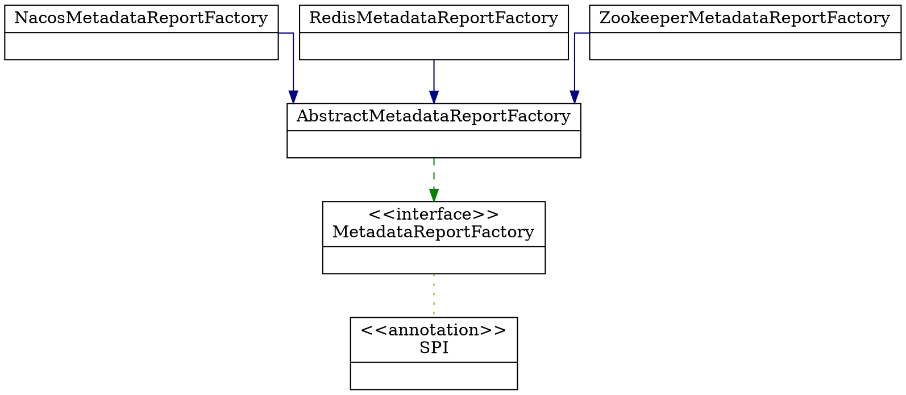

## Introduction


元数据中心在2.7.x版本开始支持，随着应用级别的服务注册和服务发现在Dubbo中落地，**元数据中心也变的越来越重要**。在以下几种情况下会需要部署元数据中心：

- 对于一个原先采用老版本Dubbo搭建的应用服务，在迁移到Dubbo 3时，Dubbo 3 会需要一个**元数据中心来维护RPC服务与应用的映射关系（即接口与应用的映射关系）**，因为如果采用了**应用级别的服务发现和服务注册**，在注册中心中将**采用“应用 —— 实例列表”结构**的数据组织形式，**不再是以往的“接口 —— 实例列表”结构的数据组织形式**，而以往用接口级别的服务注册和服务发现的应用服务在**迁移到应用级别**时，**得不到接口与应用之间的对应关系**，从而无法从注册中心得到实例列表信息，所以**Dubbo为了兼容这种场景，在Provider端启动时，会往元数据中心存储接口与应用的映射关系**。
- 为了让**注册中心更加聚焦与地址的发现和推送能力**，**减轻注册中心的负担**，元数据中心承载了所有的服务元数据、大量接口/方法级别配置信息等，无论是接口粒度还是应用粒度的服务发现和注册，元数据中心都起到了重要的作用。
- 如果有以上两种需求，都可以选择部署元数据中心，并通过Dubbo的配置来集成该元数据中心。


综上所述可以用几句话概括下:

- 元数据中心来维护RPC服务与应用的映射关系（即接口与应用的映射关系）来兼容接口与应用之间的对应关系
- 让注册中心更加聚焦与地址的发现和推送能力


**元数据中心并不依赖于注册中心和配置中心**，用户可以自由选择是否集成和部署元数据中心


元数据中心为 Dubbo 中的两类元数据提供了存取能力

- 地址发现元数据
- 服务运维元数据

Dubbo 围绕应用级服务发现构建了一套元数据机制，即 `接口 - 应用映射关系` 与 `接口配置元数据`。


接口 - 应用映射关系

Dubbo 一直以来都能做到精确的地址发现，即只订阅 Consumer 声明要关心的服务及相关的地址列表，相比于拉取/订阅全量地址列表，这样做有很好的性能优势。 在应用级服务发现模型中，想做到精确地址订阅并不容易，因为 Dubbo Consumer 只声明了要消费的接口列表，Consumer 需要能够将接口转换为 Provider 应用名才能进行精准服务订阅，

为此，Dubbo 需要在元数据中心维护这一份 `接口名->应用名` 的对应关系，Dubbo3 中通过 provider 启动的时候主动向元数据中心上报实现。 接口 (service name) - 应用 (Provider application name) 的映射关系可以是一对多的，即一个 service name 可能会对应多个不同的 application name。

以 zookeeper 为例，映射关系保存在以下位置:

```shell
$ ./zkCli.sh
$ get /dubbo/mapping/org.apache.dubbo.demo.DemoService
$ demo-provider,two-demo-provider,dubbo-demo-annotation-provider
```

`接口级配置元数据`是作为地址发现的补充，相比于 Spring Cloud 等地址发现模型只能同步 ip、port 信息，Dubbo 的服务发现机制可以同步接口列表、接口定义、接口级参数配置等信息。 这部分内容根据当前应用的自身信息、以及接口信息计算而来，并且从性能角度出发，还根据元数据生成 revision，以实现不同机器实例间的元数据聚合。

以 Zookeeper 为例，接口配置元数据保存在以下位置，如果多个实例生成的 revision 相同，则最终会共享同一份元数据配置：

```
/dubbo/metadata/{application name}/{revision}
```


Dubbo 上报的服务运维元数据通常为各种运维系统所用，如服务测试、网关数据映射、服务静态依赖关系分析等。

各种第三方系统可直接读取并使用这部分数据

元数据上报默认是一个异步的过程，为了更好的控制异步行为，元数据配置组件 (metadata-report) 开放了两个配置项：

- 失败重试
  失败重试可以通过 retrytimes （重试次数。默认 100），retryperiod（重试周期。默认 3000ms）进行设置。
- 每天定时重试刷新
  默认开启，可以通过设置 `cycleReport=false` 进行关闭


完整的配置项

```properties
dubbo.metadata-report.address=zookeeper://127.0.0.1:2181
dubbo.metadata-report.username=xxx         ##非必须
dubbo.metadata-report.password=xxx         ##非必须
dubbo.metadata-report.retry-times=30       ##非必须,default值100
dubbo.metadata-report.retry-period=5000    ##非必须,default值3000
dubbo.metadata-report.cycle-report=false   ##非必须,default值true
dubbo.metadata-report.sync.report=false    ##非必须,default值为false
```

如果元数据地址(dubbo.metadata-report.address)也不进行配置，会判断注册中心的协议是否支持元数据中心，如果支持，会使用注册中心的地址来用作元数据中心

## start

元数据中心的启动是在DefaultApplicationDeployer中的初始化方法 initialize() 中

```java
private void startMetadataCenter() {

    useRegistryAsMetadataCenterIfNecessary();

    ApplicationConfig applicationConfig = getApplication();

    String metadataType = applicationConfig.getMetadataType();
    // FIXME, multiple metadata config support.
    Collection<MetadataReportConfig> metadataReportConfigs = configManager.getMetadataConfigs();
    if (CollectionUtils.isEmpty(metadataReportConfigs)) {
        if (REMOTE_METADATA_STORAGE_TYPE.equals(metadataType)) {
            throw new IllegalStateException(
                    "No MetadataConfig found, Metadata Center address is required when 'metadata=remote' is enabled.");
        }
        return;
    }

    MetadataReportInstance metadataReportInstance =
            applicationModel.getBeanFactory().getBean(MetadataReportInstance.class);
    List<MetadataReportConfig> validMetadataReportConfigs = new ArrayList<>(metadataReportConfigs.size());
    for (MetadataReportConfig metadataReportConfig : metadataReportConfigs) {
        if (ConfigValidationUtils.isValidMetadataConfig(metadataReportConfig)) {
            ConfigValidationUtils.validateMetadataConfig(metadataReportConfig);
            validMetadataReportConfigs.add(metadataReportConfig);
        }
    }
    metadataReportInstance.init(validMetadataReportConfigs);
    if (!metadataReportInstance.isInitialized()) {
        throw new IllegalStateException(String.format(
                "%s MetadataConfigs found, but none of them is valid.", metadataReportConfigs.size()));
    }
}
```


没有元数据中心则使用注册中心

- 配置缓存中查询元数据配置,配置存在则直接返回
- 查询所有可用的默认注册中心列表
  - 多注册中心遍历
  - 选符合条件的注册中心 (筛选逻辑就是查看是否有对应协议的扩展支持)
  - 注册中心配置RegistryConfig映射转换为元数据中心配置类型MetadataReportConfig 映射就是获取需要的配置
  - 将元数据中心配置存储在配置缓存中方便后续使用

```java
private void useRegistryAsMetadataCenterIfNecessary() {

    Collection<MetadataReportConfig> originMetadataConfigs = configManager.getMetadataConfigs();
    if (originMetadataConfigs.stream().anyMatch(m -> Objects.nonNull(m.getAddress()))) {
        return;
    }

    Collection<MetadataReportConfig> metadataConfigsToOverride = originMetadataConfigs.stream()
            .filter(m -> Objects.isNull(m.getAddress()))
            .collect(Collectors.toList());

    if (metadataConfigsToOverride.size() > 1) {
        return;
    }

    MetadataReportConfig metadataConfigToOverride =
            metadataConfigsToOverride.stream().findFirst().orElse(null);

    List<RegistryConfig> defaultRegistries = configManager.getDefaultRegistries();
    if (!defaultRegistries.isEmpty()) {
        defaultRegistries.stream()
                .filter(this::isUsedRegistryAsMetadataCenter)
                .map(registryConfig -> registryAsMetadataCenter(registryConfig, metadataConfigToOverride))
                .forEach(metadataReportConfig -> {
                    overrideMetadataReportConfig(metadataConfigToOverride, metadataReportConfig);
                });
    }
}
```

可配置项有哪些 对应类型为MetadataReportConfig

```java
public class MetadataReportInstance implements Disposable {

    private final AtomicBoolean initialized = new AtomicBoolean(false);
    private String metadataType;

    // mapping of registry id to metadata report instance, registry instances will use this mapping to find related
    // metadata reports
    private final Map<String, MetadataReport> metadataReports = new HashMap<>();
    private final ApplicationModel applicationModel;
    private final NopMetadataReport nopMetadataReport;

    public MetadataReportInstance(ApplicationModel applicationModel) {
        this.applicationModel = applicationModel;
        this.nopMetadataReport = new NopMetadataReport();
    }

    public void init(List<MetadataReportConfig> metadataReportConfigs) {
        if (!initialized.compareAndSet(false, true)) {
            return;
        }

        this.metadataType = applicationModel
                .getApplicationConfigManager()
                .getApplicationOrElseThrow()
                .getMetadataType();
        if (metadataType == null) {
            this.metadataType = DEFAULT_METADATA_STORAGE_TYPE;
        }

        MetadataReportFactory metadataReportFactory =
                applicationModel.getExtensionLoader(MetadataReportFactory.class).getAdaptiveExtension();
        for (MetadataReportConfig metadataReportConfig : metadataReportConfigs) {
            init(metadataReportConfig, metadataReportFactory);
        }
    }
    
    private void init(MetadataReportConfig config, MetadataReportFactory metadataReportFactory) {
        URL url = config.toUrl();
        if (METADATA_REPORT_KEY.equals(url.getProtocol())) {
            String protocol = url.getParameter(METADATA_REPORT_KEY, DEFAULT_DIRECTORY);
            url = URLBuilder.from(url)
                    .setProtocol(protocol)
                    .setPort(url.getParameter(PORT_KEY, url.getPort()))
                    .setScopeModel(config.getScopeModel())
                    .removeParameter(METADATA_REPORT_KEY)
                    .build();
        }
        url = url.addParameterIfAbsent(
                APPLICATION_KEY, applicationModel.getCurrentConfig().getName());
        url = url.addParameterIfAbsent(
                REGISTRY_LOCAL_FILE_CACHE_ENABLED,
                String.valueOf(applicationModel.getCurrentConfig().getEnableFileCache()));
        //        RegistryConfig registryConfig = applicationModel.getConfigManager().getRegistry(relatedRegistryId)
        //                .orElseThrow(() -> new IllegalStateException("Registry id " + relatedRegistryId + " does not
        // exist."));
        MetadataReport metadataReport = metadataReportFactory.getMetadataReport(url);
        if (metadataReport != null) {
            metadataReports.put(getRelatedRegistryId(config, url), metadataReport);
        }
    }
}
```

关于元数据的初始化我们主要看两个位置:

- 一个是元数据工厂对象的创建与初始化MetadataReportFactory
- 一个是元数据对象的创建与初始化MetadataReport


#### MetadataReportFactory

```java
@SPI(DEFAULT)
public interface MetadataReportFactory {

    String DEFAULT = "redis";

    @Adaptive({PROTOCOL_KEY})
    MetadataReport getMetadataReport(URL url);

    default void destroy() {}
}
```





抽象类AbstractMetadataReportFactory中的获取元数据操作对象的模版方法getMetadataReport(URL url), 用了双重校验锁的逻辑来创建对象缓存对象,又用了模版方法设计模式,来让抽象类做通用的逻辑,让实现类型去做扩展

```java
public abstract class AbstractMetadataReportFactory implements MetadataReportFactory {

    private static final ErrorTypeAwareLogger logger =
            LoggerFactory.getErrorTypeAwareLogger(AbstractMetadataReportFactory.class);
    private static final String EXPORT_KEY = "export";
    private static final String REFER_KEY = "refer";

    /**
     * The lock for the acquisition process of the registry
     */
    private final ReentrantLock lock = new ReentrantLock();

    /**
     * Registry Collection Map<metadataAddress, MetadataReport>
     */
    private final Map<String, MetadataReport> serviceStoreMap = new ConcurrentHashMap<>();

    @Override
    public MetadataReport getMetadataReport(URL url) {
        url = url.setPath(MetadataReport.class.getName()).removeParameters(EXPORT_KEY, REFER_KEY);
        String key = url.toServiceString(NAMESPACE_KEY);

        MetadataReport metadataReport = serviceStoreMap.get(key);
        if (metadataReport != null) {
            return metadataReport;
        }

        // Lock the metadata access process to ensure a single instance of the metadata instance
        lock.lock();
        try {
            metadataReport = serviceStoreMap.get(key);
            if (metadataReport != null) {
                return metadataReport;
            }
            boolean check = url.getParameter(CHECK_KEY, true) && url.getPort() != 0;
            try {
                metadataReport = createMetadataReport(url);
            } catch (Exception e) {
                if (!check) {
                    logger.warn(PROXY_FAILED_EXPORT_SERVICE, "", "", "The metadata reporter failed to initialize", e);
                } else {
                    throw e;
                }
            }

            if (check && metadataReport == null) {
                throw new IllegalStateException("Can not create metadata Report " + url);
            }
            if (metadataReport != null) {
                serviceStoreMap.put(key, metadataReport);
            }
            return metadataReport;
        } finally {
            // Release the lock
            lock.unlock();
        }
    }
}
```


##### **Zookeeper**


##### **Redis**

```java
public class RedisMetadataReportFactory extends AbstractMetadataReportFactory {

    @Override
    public MetadataReport createMetadataReport(URL url) {
        return new RedisMetadataReport(url);
    }
}
```


```java
public class RedisMetadataReport extends AbstractMetadataReport {

    private static final String REDIS_DATABASE_KEY = "database";
    private static final ErrorTypeAwareLogger logger = LoggerFactory.getErrorTypeAwareLogger(RedisMetadataReport.class);

    // protected , for test
    protected JedisPool pool;
    private Set<HostAndPort> jedisClusterNodes;
    private int timeout;
    private String password;

    public RedisMetadataReport(URL url) {
        super(url);
        timeout = url.getParameter(TIMEOUT_KEY, DEFAULT_TIMEOUT);
        password = url.getPassword();
        if (url.getParameter(CLUSTER_KEY, false)) {
            jedisClusterNodes = new HashSet<>();
            List<URL> urls = url.getBackupUrls();
            for (URL tmpUrl : urls) {
                jedisClusterNodes.add(new HostAndPort(tmpUrl.getHost(), tmpUrl.getPort()));
            }
        } else {
            int database = url.getParameter(REDIS_DATABASE_KEY, 0);
            pool = new JedisPool(new JedisPoolConfig(), url.getHost(), url.getPort(), timeout, password, database);
        }
    }
}
```


AbstractMetadataReport

```java
public AbstractMetadataReport(URL reportServerURL) {
    setUrl(reportServerURL);
    applicationModel = reportServerURL.getOrDefaultApplicationModel();

    boolean localCacheEnabled = reportServerURL.getParameter(REGISTRY_LOCAL_FILE_CACHE_ENABLED, true);
    // Start file save timer
    String defaultFilename = System.getProperty(USER_HOME) + DUBBO_METADATA + reportServerURL.getApplication()
            + "-" + replace(reportServerURL.getAddress(), ":", "-")
            + CACHE;
    String filename = reportServerURL.getParameter(FILE_KEY, defaultFilename);
    File file = null;
    if (localCacheEnabled && ConfigUtils.isNotEmpty(filename)) {
        file = new File(filename);
        if (!file.exists()
                && file.getParentFile() != null
                && !file.getParentFile().exists()) {
            if (!file.getParentFile().mkdirs()) {
                throw new IllegalArgumentException("Invalid service store file " + file
                        + ", cause: Failed to create directory " + file.getParentFile() + "!");
            }
        }
        // if this file exists, firstly delete it.
        if (!initialized.getAndSet(true) && file.exists()) {
            file.delete();
        }
    }
    this.file = file;
    loadProperties();
    syncReport = reportServerURL.getParameter(SYNC_REPORT_KEY, false);
    metadataReportRetry = new MetadataReportRetry(
            reportServerURL.getParameter(RETRY_TIMES_KEY, DEFAULT_METADATA_REPORT_RETRY_TIMES),
            reportServerURL.getParameter(RETRY_PERIOD_KEY, DEFAULT_METADATA_REPORT_RETRY_PERIOD));
    // cycle report the data switch
    if (reportServerURL.getParameter(CYCLE_REPORT_KEY, DEFAULT_METADATA_REPORT_CYCLE_REPORT)) {
        reportTimerScheduler = Executors.newSingleThreadScheduledExecutor(
                new NamedThreadFactory("DubboMetadataReportTimer", true));
        reportTimerScheduler.scheduleAtFixedRate(
                this::publishAll, calculateStartTime(), ONE_DAY_IN_MILLISECONDS, TimeUnit.MILLISECONDS);
    }

    this.reportMetadata = reportServerURL.getParameter(REPORT_METADATA_KEY, false);
    this.reportDefinition = reportServerURL.getParameter(REPORT_DEFINITION_KEY, true);
}
```