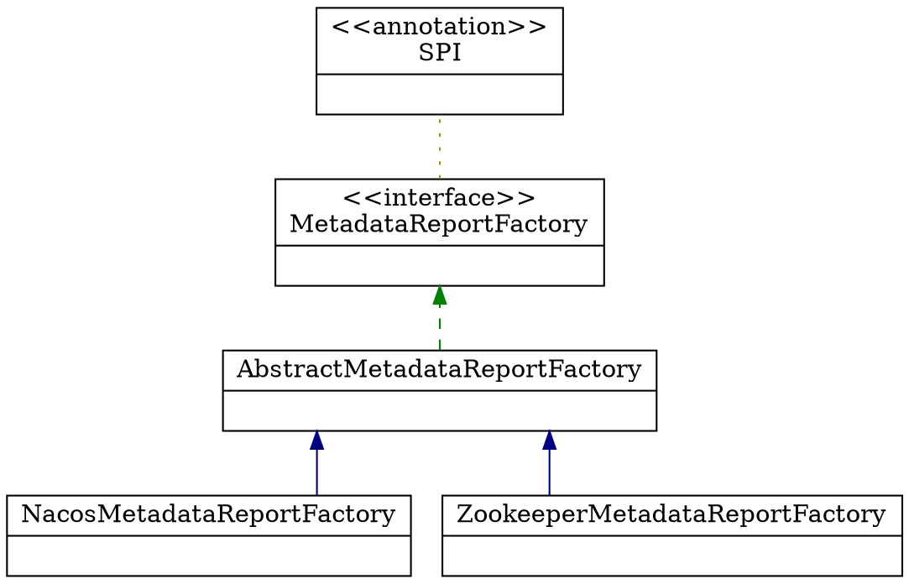

## Introduction

元数据中心（Metadata Center）在 Dubbo 2.7.x 引入。服务注册从「接口级」转向「应用级」后它成为刚需：应用级注册中心里存的是「应用 → 实例列表」，消费端只知道接口名，无法凭空算出该订阅哪个应用，于是 Provider 启动时必须主动上报一份「接口 → 应用」映射，消费端才能精准订阅。同时 Dubbo 把接口定义、方法签名、接口级参数配置也一并放进元数据中心，注册中心只负责地址，职责彻底分开。

流传最广的三个说法，本文逐条从源码推翻：

- **「`MetadataReportFactory` 的默认实现是 Redis，所以默认走 Redis 元数据中心」**——不成立。`String DEFAULT = "redis"` 这个常量确实还在源码里，但 **3.3.6 主仓库没有 Redis 元数据实现**：`dubbo-metadata/` 只有 `api` / `definition-protobuf` / `processor` / `report-nacos` / `report-zookeeper` 五个子模块，`MetadataReportFactory` 的 SPI 注册文件全仓只有 nacos 与 zookeeper 两份。默认扩展名指向一个不存在的实现，想用必须显式引入外部 artifact。
- **「元数据存在 `/dubbo/mapping/{interface}`，接口定义靠 `publishServiceDefinition` 上报」**——不成立。`mapping/` 这一层路径已被去掉（issue #4671），3.3.6 的真实路径是 `/dubbo/{interface}`；接口上的方法名是 `storeProviderMetadata`。`publishServiceDefinition` 只是 `MetadataUtils` 里的一个 `static` 辅助方法，且那个类在 `dubbo-registry-api` 而不在 `dubbo-metadata/`。
- **「元数据是逐条实时写中心，provider 侧 key 形如 `provider:{interface}`」**——不成立。3.x 的核心是 `MetadataInfo` 的 **revision 聚合**：先在内存里把本应用全部接口算出一个 revision，再整体写成一份 JSON，多个实例算出相同 revision 就**共享同一份元数据节点**。存储 key 也不是前缀式，而是 `KeyTypeEnum` 的双轨制（`PATH` 用 `/`、`UNIQUE_KEY` 用 `:`），provider 是路径里的一个**段**。

版本基线：Apache Dubbo **3.3.6**，源码 tag `dubbo-3.3.6`。本文所有类路径、方法签名、存储 key 格式、默认值、行号均取自该 tag 官方源码。

事实来源声明：模块清单来自 `ls dubbo-metadata/`；SPI 注册内容来自读取 `META-INF/dubbo/internal/` 下的注册文件；类实现逐行取自 `.java` 源码；「某类不存在」的判定基于对全仓 `*.java` 的检索并在文中写明范围。本文不引用二手博客。

注册中心侧的职责与地址推送机制见 [registry.md](/docs/CS/Framework/Dubbo/registry.md)，配置项全表见 [config.md](/docs/CS/Framework/Dubbo/config.md)，应用启动顺序见 [Start.md](/docs/CS/Framework/Dubbo/Start.md)，本文不重复。

## 承载的两类元数据

| 类别 | 作用 | 主要接口方法 |
| :--- | :--- | :--- |
| 接口-应用映射关系 | 应用级服务发现下，消费端把接口名翻译成 Provider 应用名 | `getServiceAppMapping` / `registerServiceAppMapping` |
| 接口配置元数据 | 接口列表、接口定义、接口级参数，服务发现的补充 | `publishAppMetadata` / `storeProviderMetadata` |
| 服务运维元数据 | 给网关、测试平台、静态依赖分析等第三方系统读取 | `storeConsumerMetadata` / `MetadataService` |

之所以需要「接口-应用映射」，是因为应用级模型下消费端只声明接口列表，需要能把接口转换成 Provider 应用名才能做精准订阅。这个映射可以是一对多：一个接口名可能对应多个应用，由 Provider 启动时主动上报实现。

## 存储 key 的双轨制

`KeyTypeEnum` 定义了两套拼装格式，是理解元数据中心存储结构的**唯一入口**：

```java
// dubbo-metadata/dubbo-metadata-api/src/main/java/org/apache/dubbo/metadata/report/identifier/KeyTypeEnum.java:28-43
public enum KeyTypeEnum {
    PATH(PATH_SEPARATOR) {
        public String build(String one, String... others) {
            return buildPath(one, others);
        }
    },

    UNIQUE_KEY(KEY_SEPARATOR) {
        public String build(String one, String... others) {
            StringBuilder keyBuilder = new StringBuilder(one);
            for (String other : others) {
                keyBuilder.append(separator).append(isBlank(other) ? EMPTY_STRING : other);
            }
            return keyBuilder.toString();
        }
    };
```

| 类型 | 分隔符 | 用途 |
| :--- | :--- | :--- |
| `PATH` | `/` | **中心化存储**的节点路径（ZK 节点、Nacos path） |
| `UNIQUE_KEY` | `:` | 本地唯一标识（`getIdentifierKey()`），用于 map key、去重、占位 |

`getUniqueKey(KeyTypeEnum)` 传 `PATH` 走 `getFilePathKey`，传 `UNIQUE_KEY` 走 `getIdentifierKey`。分隔符常量在 `MetadataConstants.java:20,32`：`KEY_SEPARATOR = ":"`、`PATH_SEPARATOR = "/"`；`DEFAULT_PATH_TAG = "metadata"`（`:21`）。

四类 key 的实际拼装结果：

| 用途 | 类:行号 | `PATH` 格式 | `UNIQUE_KEY` 格式 |
| :--- | :--- | :--- | :--- |
| 接口级元数据（含 revision） | `ServiceMetadataIdentifier.java:51,55` | `/dubbo/metadata/{pathTag}/{iface}/{version}/{group}/{side}/{protocol}/revision:{revision}` | `{iface}:{version}:{group}:{side}:{protocol}:revision:{revision}` |
| 应用级元数据 | `SubscriberMetadataIdentifier.java:42-48` + `BaseApplicationMetadataIdentifier.java:40-47` | `/dubbo/metadata/{application}/{revision}` | `{application}:{revision}` |
| 接口定义 | `MetadataIdentifier.java:50-56` + `BaseServiceMetadataIdentifier.java:47-61` | `/dubbo/metadata/{iface}/{version}/{group}/{side}/{application}` | `{iface}:{version}:{group}:{side}:{application}` |
| 接口→应用映射 | `ServiceNameMapping.java:67-71` + `ZookeeperMetadataReport.java:215-217` | **`/dubbo/{serviceInterface}`** | — |

> [!WARNING]
> **provider 那一段不是前缀，是路径中的一段。** Provider 侧接口定义的 `PATH` 是 `/dubbo/metadata/{iface}/{version}/{group}/provider/{application}`，其中 `provider` 是 `side` **段**（`BaseServiceMetadataIdentifier` 的字段之一），不是 `provider:{interface}` 那种前缀式 key。混用这两种形态去找节点必然落空。

根目录默认 `"dubbo"`（`AbstractMetadataReport.java:86` `DEFAULT_ROOT = "dubbo"`），`ZookeeperMetadataReport.toRootDir()`（`:79-85`）把它处理成 `/dubbo/`。`revision` 前缀常量 `KEY_REVISION_PREFIX = "revision"`（`MetadataConstants.java:22`），拼接结果是字面量 `revision:{值}`。

### 映射路径已去掉 `mapping/` 层

2.7.x 时代 ZK 上的映射节点是 `/dubbo/mapping/{interface}`，内容是逗号分隔的多个应用名。**3.3.6 里 `mapping/` 这一层被注释掉了**：

```java
// dubbo-metadata/dubbo-metadata-api/src/main/java/org/apache/dubbo/metadata/ServiceNameMapping.java:67-71
static String buildGroup(String serviceInterface) {
    // the issue : https://github.com/apache/dubbo/issues/4671
    //        return DEFAULT_MAPPING_GROUP + SLASH + serviceInterface;
    return serviceInterface;
}
```

`DEFAULT_MAPPING_GROUP = "mapping"` 常量**还在**（`:46`），但 `buildGroup` 已不拼它。配合 `ZookeeperMetadataReport.buildPathKey(group, serviceKey)`（`:215-217`，即 `toRootDir() + group + "/" + serviceKey`），实际路径变成裸接口名。以 ZK 为例，3.3.6 读映射：

```shell
$ ./zkCli.sh
$ get /dubbo/org.apache.dubbo.demo.DemoService
$ demo-provider,two-demo-provider,dubbo-demo-annotation-provider
```

值格式（逗号分隔多应用名）仍成立：`ServiceNameMapping.getAppNames()`（`:88-96`）按 `COMMA_SEPARATOR` 切分并 trim。

> [!NOTE]
> `ZookeeperMetadataReport` 的读写实现里，**path 仍是用 `DEFAULT_MAPPING_GROUP` 拼的**（`getServiceAppMapping` 里 `buildPathKey(DEFAULT_MAPPING_GROUP, serviceKey)`，`:161`），只是这个 `group` 是**服务名**而非字面量 `mapping`——因为传进来的 `serviceKey` 本身就是 `buildGroup(url.getServiceInterface())` 的结果。读代码时容易把这两层看成「拼出 mapping 前缀」，实际上拼出的是裸接口名。

## `MetadataInfo`：revision 聚合机制

3.x 元数据中心的核心。**不是「逐条上报接口」，而是「先聚合整个应用，再算一个 revision 写一份」**。

`MetadataInfo`（`MetadataInfo.java:58`）持有本应用全部导出服务的元数据：

| 字段 | 位置 | 说明 |
| :--- | :--- | :--- |
| `app` | `:62` | 应用名 |
| `revision` | `:65` | `volatile`，上报到中心的版本号，**必须与 `rawMetadataInfo` 同步更新** |
| `services` | `:67` | `Map<String, ServiceInfo>`，key 格式 `{group}/{interface}:{version}:{protocol}` |
| `rawMetadataInfo` | `:71` | `transient volatile`，上报到远端的 JSON 内容，**必须与 `revision` 同步更新** |

revision 的计算是 `synchronized` 的：

```java
// dubbo-metadata/dubbo-metadata-api/src/main/java/org/apache/dubbo/metadata/MetadataInfo.java:186-217
public synchronized String calAndGetRevision() {
    if (revision != null && !updated) {
        return revision;
    }
    updated = false;
    if (CollectionUtils.isEmptyMap(services)) {
        this.revision = EMPTY_REVISION;
    } else {
        String tempRevision = calRevision();
        if (!StringUtils.isEquals(this.revision, tempRevision)) {
            if (logger.isInfoEnabled()) {
                logger.info(String.format(
                        "[METADATA_REGISTER] metadata revision changed: %s -> %s, app: %s, services: %d",
                        this.revision, tempRevision, this.app, this.services.size()));
            }
            this.revision = tempRevision;
            this.rawMetadataInfo = JsonUtils.toJson(this);
        }
    }
    return revision;
}

public synchronized String calRevision() {
    StringBuilder sb = new StringBuilder();
    sb.append(app);
    for (Map.Entry<String, ServiceInfo> entry : new TreeMap<>(services).entrySet()) {
        sb.append(entry.getValue().toDescString());
    }
    return RevisionResolver.calRevision(sb.toString());
}
```

几个关键点：

- **`calAndGetRevision()` 只在注册等特定节点调用**（源码 javadoc 明确写了 "Usage of this method is strictly restricted to certain points such as when during registration"），其余地方一律用 `getRevision()`（`:177`）读缓存值，避免每次读都重算。
- **revision 变了才重新序列化 JSON**：`calRevision()` 把 `app` 与各 `ServiceInfo.toDescString()` 按 `TreeMap` 有序拼接（排序保证「同一组接口不同插入顺序」算出同一 revision），交给 `RevisionResolver.calRevision` 取 hash。
- **`addService` / `removeService` 只置脏标记**：`addService(URL)`（`:146-163`）构造 `ServiceInfo`、经 `MetadataParamsFilter` 过滤入参、塞进 `services`，最后 `updated = true`；真正的重算推迟到注册时。
- **上报内容取 `getContent()`**（`:224`），直接返回 `rawMetadataInfo`，是一个 `@Transient` 方法——所以 JSON 里的字段名就叫 `content`。

**「多实例共享同一份元数据」就靠这个实现**。两个实例若导出完全相同的接口集合，算出的 revision 相同，写的节点路径也相同：

```java
// dubbo-metadata/dubbo-metadata-report-zookeeper/src/main/java/org/apache/dubbo/metadata/store/zookeeper/ZookeeperMetadataReport.java:140-146
@Override
public void publishAppMetadata(SubscriberMetadataIdentifier identifier, MetadataInfo metadataInfo) {
    String path = getNodePath(identifier);
    if (StringUtils.isBlank(zkClient.getContent(path)) && StringUtils.isNotEmpty(metadataInfo.getContent())) {
        zkClient.createOrUpdate(path, metadataInfo.getContent(), false);
    }
}
```

`if (isBlank(zkClient.getContent(path)))` 是**关键守卫**：节点已有内容就不覆盖。N 个实例因此共享同一份元数据节点，而不是互相覆盖成最后写入者的版本。也正因如此 `unPublishAppMetadata`（`:148-153`）会**直接 delete 整个节点**——它无法只删自己那部分。

> [!TIP]
> 延迟上报有独立配置：`METADATA_PUBLISH_DELAY_KEY = "dubbo.application.metadata.publish.delay"`，默认 `DEFAULT_METADATA_PUBLISH_DELAY = 1000` ms（`MetadataConstants.java:24-25`）。

## `MetadataReport` 接口的真实方法集

19 个方法（`MetadataReport.java:33-98`）。这是打假「`publishServiceDefinition` 是接口方法」的关键——**接口上没有这个名字**：

| 分类 | 方法 | 行号 |
| :--- | :--- | :--- |
| 接口定义 | `void storeProviderMetadata(MetadataIdentifier, ServiceDefinition)` | `:37` |
| | `String getServiceDefinition(MetadataIdentifier)` | `:39` |
| 应用级元数据 | `default void publishAppMetadata(SubscriberMetadataIdentifier, MetadataInfo)` | `:44` |
| | `default void unPublishAppMetadata(SubscriberMetadataIdentifier, MetadataInfo)` | `:46` |
| | `default MetadataInfo getAppMetadata(SubscriberMetadataIdentifier, Map<String,String>)` | `:48` |
| 运维元数据 | `void storeConsumerMetadata(MetadataIdentifier, Map<String,String>)` | `:55` |
| | `List<String> getExportedURLs(ServiceMetadataIdentifier)` | `:57` |
| 生命周期 | `void destroy()` | `:59` |
| 内部/遗留 | `void saveServiceMetadata(ServiceMetadataIdentifier, URL)` | `:61` |
| | `void removeServiceMetadata(ServiceMetadataIdentifier)` | `:63` |
| | `void saveSubscribedData(SubscriberMetadataIdentifier, Set<String>)` | `:65` |
| | `List<String> getSubscribedURLs(SubscriberMetadataIdentifier)` | `:67` |
| | `default ConfigItem getConfigItem(String key, String group)` | `:69` |
| 映射（CAS） | `default boolean registerServiceAppMapping(String, String, String, Object ticket)` | `:73` |
| | `default boolean registerServiceAppMapping(String serviceKey, String application, URL url)` | `:78` |
| | `default void removeServiceAppMappingListener(String, MappingListener)` | `:82` |
| | `default Set<String> getServiceAppMapping(String, MappingListener, URL)` | `:87` |
| | `default Set<String> getServiceAppMapping(String, URL)` | `:91` |
| 开关 | `boolean shouldReportDefinition()` | `:95` |
| | `boolean shouldReportMetadata()` | `:97` |

注意 `storeProviderMetadata`、`getServiceDefinition`、`publishAppMetadata` 等**没有 `default` 关键字**，是必须实现的抽象方法；而映射相关的全是 `default` 空实现，所以新元数据中心不支持映射时能编译通过但**静默失效**——这是一个容易踩的坑。

`shouldReportDefinition()` / `shouldReportMetadata()` 对应 `AbstractMetadataReport` 的 `reportDefinition`（默认 `true`）与 `reportMetadata`（默认 `false`）两个字段（`AbstractMetadataReport.java:155-156`），上报前先问这两个开关。

### `publishServiceDefinition` 到底在哪

它在 `MetadataUtils` 里，是个 `static` 辅助方法，**不是 `MetadataReport` 接口方法**：

```java
// dubbo-registry/dubbo-registry-api/src/main/java/org/apache/dubbo/registry/client/metadata/MetadataUtils.java:77-104
public static void publishServiceDefinition(
        URL url, ServiceDescriptor serviceDescriptor, ApplicationModel applicationModel) {
    if (getMetadataReports(applicationModel).isEmpty()) {
        logger.info("[METADATA_REGISTER] Remote Metadata Report Server is not provided or unavailable, "
                + "will stop registering service definition to remote center!");
        return;
    }
    try {
        String side = url.getSide();
        if (PROVIDER_SIDE.equalsIgnoreCase(side)) {
            String serviceKey = url.getServiceKey();
            FullServiceDefinition serviceDefinition = serviceDescriptor.getFullServiceDefinition(serviceKey);
            if (StringUtils.isNotEmpty(serviceKey) && serviceDefinition != null) {
                serviceDefinition.setParameters(url.getParameters());
                for (Map.Entry<String, MetadataReport> entry :
                        getMetadataReports(applicationModel).entrySet()) {
                    MetadataReport metadataReport = entry.getValue();
                    if (!metadataReport.shouldReportDefinition()) {
                        logger.info("Report of service definition is disabled for " + entry.getKey());
                        continue;
                    }
                    metadataReport.storeProviderMetadata(
                            new MetadataIdentifier(
                                    url.getServiceInterface(),
                                    url.getVersion() == null ? "" : url.getVersion(),
                                    url.getGroup() == null ? "" : url.getGroup(),
                                    PROVIDER_SIDE,
                                    applicationModel.getApplicationName()),
                            serviceDefinition);
                }
            }
        } else {
            // 消费端分支走 storeConsumerMetadata，见 :105-120
```
调用点是 `ServiceConfig.java:886,903` 与 `ReferenceConfig.java:519`。注意这个类在 **`dubbo-registry/dubbo-registry-api/`**，包名 `org.apache.dubbo.registry.client.metadata`，**不在 `dubbo-metadata/`**。

### 类路径速查

几个类容易被误认为在 `dubbo-metadata/`，实际不在：

| 类 | 真实模块 | 包 |
| :--- | :--- | :--- |
| `MetadataServiceDelegation` | `dubbo-registry/dubbo-registry-api` | `org.apache.dubbo.registry.client.metadata` |
| `MetadataUtils` | `dubbo-registry/dubbo-registry-api` | `org.apache.dubbo.registry.client.metadata` |
| `ServiceMetadata` | `dubbo-common` | `org.apache.dubbo.rpc.model`（`:30`，继承 `BaseServiceMetadata`） |
| `MetadataReport` / `MetadataInfo` / `ServiceNameMapping` | `dubbo-metadata/dubbo-metadata-api` | `org.apache.dubbo.metadata[.report]` |

> [!NOTE]
> `ServiceMetadata` 的源码 javadoc 自己都写了 `Notice, this class currently has no usage inside Dubbo.`——它不是元数据中心的载体，只是框架侧的 service 元模型。

## `ServiceNameMapping`：接口到应用名的映射

映射能力是一个**独立的 SPI**，与 `MetadataReport` 并列：

```java
// dubbo-metadata/dubbo-metadata-api/src/main/java/org/apache/dubbo/metadata/ServiceNameMapping.java:36-52
@SPI(value = "metadata", scope = APPLICATION)
public interface ServiceNameMapping extends Destroyable {

    String DEFAULT_MAPPING_GROUP = "mapping";

    /**
     * Map the specified Dubbo service interface, group, version and protocol to current Dubbo service name
     */
    boolean map(URL url);

    boolean hasValidMetadataCenter();

    static ServiceNameMapping getDefaultExtension(ScopeModel scopeModel) {
        return ScopeModelUtil.getApplicationModel(scopeModel).getDefaultExtension(ServiceNameMapping.class);
    }
```

`scope` 是 `APPLICATION`（应用级），与 `Transporter` 的 `FRAMEWORK` 形成对比。默认扩展名 `metadata` 在 **`dubbo-registry-api`** 的注册文件里——这正是「映射读写最终落到 `MetadataReport` 上」的衔接点：

```properties
# dubbo-registry/dubbo-registry-api/src/main/resources/META-INF/dubbo/internal/org.apache.dubbo.metadata.ServiceNameMapping
metadata=org.apache.dubbo.registry.client.metadata.MetadataServiceNameMapping
```

只有 1 个实现，且注册在注册中心模块而非元数据中心模块。

`AbstractServiceNameMapping`（`:52`）承担本地缓存与并发控制：

| 成员 | 行号 | 作用 |
| :--- | :--- | :--- |
| `mappingCacheManager` | `:54` | 本地映射缓存，构造时按 `enableFileCache` 决定是否落盘 |
| `mappingListeners` | `:55` | `serviceKey → Set<MappingListener>`，变更监听注册表 |
| `mappingLocks` | `:57` | **同一应用内各注册中心共享的 `ReentrantLock`**，注释写明 "mapping lock is shared among registries of the same application" |
| `get(URL)` / `getAndListen(URL, MappingListener)` | `:96,104` | 抽象方法，读映射 / 读映射并监听变更 |
| `getAndListen(URL, URL, MappingListener)` | `:109` | 实现：先查本地缓存，空则**异步** `AsyncMappingTask` 拉取 |

缓存 miss 时的行为差异在 `getAndListen`（`:109-123`）：先打日志 `[METADATA_REGISTER] Local cache mapping is empty`，若异步拉取仍为空，则**回退读注册中心 URL 上的 `SUBSCRIBED_SERVICE_NAMES_KEY`**（`providedBy` 场景），再不行才彻底放弃。这条回退链是「迁移期双注册」能工作的原因。

`MetadataServiceNameMapping`（`dubbo-registry-api/.../MetadataServiceNameMapping.java:57`）是具体实现，它从 `MetadataReportInstance` 取 `MetadataReport` 来读写映射，并带 CAS 重试配置（`casRetryTimes` / `casRetryWaitTime`，对应 `CAS_RETRY_TIMES_KEY` / `CAS_RETRY_WAIT_TIME_KEY`）。

## `MetadataReportFactory`：工厂与多实例容器

工厂接口极简：

```java
// dubbo-metadata/dubbo-metadata-api/src/main/java/org/apache/dubbo/metadata/report/MetadataReportFactory.java:27-40
@SPI(DEFAULT)
public interface MetadataReportFactory {

    String DEFAULT = "redis";

    @Adaptive({PROTOCOL_KEY})
    MetadataReport getMetadataReport(URL url);

    default void destroy() {}
}
```

> [!WARNING]
> **`DEFAULT = "redis"` 在 3.3.6 主仓库没有对应实现。** 这是本篇最值得打假的一处：常量在（`MetadataReportFactory.java:32`），`@SPI(DEFAULT)` 也在用它，但全仓的 `META-INF/dubbo/internal/org.apache.dubbo.metadata.report.MetadataReportFactory` 只有两份——

```properties
# dubbo-metadata/dubbo-metadata-report-nacos/src/main/resources/META-INF/dubbo/internal/org.apache.dubbo.metadata.report.MetadataReportFactory
nacos=org.apache.dubbo.metadata.store.nacos.NacosMetadataReportFactory
```

```properties
# dubbo-metadata/dubbo-metadata-report-zookeeper/src/main/resources/META-INF/dubbo/internal/org.apache.dubbo.metadata.report.MetadataReportFactory
zookeeper=org.apache.dubbo.metadata.store.zookeeper.ZookeeperMetadataReportFactory
```

派生关系是：


```dot
digraph "MetadataReportFactory" {

rankdir = BT

splines  = ortho;
fontname = "Inconsolata";

node [colorscheme = ylgnbu4];
edge [colorscheme = dark28, dir = both];

AbstractMetadataReportFactory  [shape = record, label = "{ AbstractMetadataReportFactory |  }"];
MetadataReportFactory          [shape = record, label = "{ \<\<interface\>\>\nMetadataReportFactory |  }"];
NacosMetadataReportFactory     [shape = record, label = "{ NacosMetadataReportFactory |  }"];
SPI                            [shape = record, label = "{ \<\<annotation\>\>\nSPI |  }"];
ZookeeperMetadataReportFactory [shape = record, label = "{ ZookeeperMetadataReportFactory |  }"];

AbstractMetadataReportFactory  -> MetadataReportFactory          [color = "#008200", style = dashed, arrowtail = none    , arrowhead = normal  , taillabel = "", label = "", headlabel = ""];
MetadataReportFactory          -> SPI                            [color = "#999900", style = dotted, arrowtail = none    , arrowhead = none    , taillabel = "", label = "", headlabel = ""];
NacosMetadataReportFactory     -> AbstractMetadataReportFactory  [color = "#000082", style = solid , arrowtail = none    , arrowhead = normal  , taillabel = "", label = "", headlabel = ""];
ZookeeperMetadataReportFactory -> AbstractMetadataReportFactory  [color = "#000082", style = solid , arrowtail = none    , arrowhead = normal  , taillabel = "", label = "", headlabel = ""];

}
```

图中**只有 2 个实现**。2.7.x 时代常见的 `RedisMetadataReportFactory` / `RedisMetadataReport`（含 `JedisPool` 构建、cluster 节点解析）在 3.3.6 主仓库**完全不存在**，属于外部仓库或更早版本的历史实现。

### 抽象工厂：双检锁 + 模板方法

`AbstractMetadataReportFactory`（`:34`）用双检锁缓存实例，key 是 `url.toServiceString(NAMESPACE_KEY)`（**namespace 参与 key**）：

```java
// dubbo-metadata/dubbo-metadata-api/src/main/java/org/apache/dubbo/metadata/report/support/AbstractMetadataReportFactory.java:51-83
@Override
public MetadataReport getMetadataReport(URL url) {
    url = url.setPath(MetadataReport.class.getName()).removeParameters(EXPORT_KEY, REFER_KEY);
    String key = url.toServiceString(NAMESPACE_KEY);

    MetadataReport metadataReport = serviceStoreMap.get(key);
    if (metadataReport != null) {
        return metadataReport;
    }

    // Lock the metadata access process to ensure a single instance of the metadata instance
    lock.lock();
    try {
        metadataReport = serviceStoreMap.get(key);
        if (metadataReport != null) {
            return metadataReport;
        }
        boolean check = url.getParameter(CHECK_KEY, true) && url.getPort() != 0;
        try {
            metadataReport = createMetadataReport(url);
        } catch (Exception e) {
            if (!check) {
                logger.warn(PROXY_FAILED_EXPORT_SERVICE, "", "", "The metadata reporter failed to initialize", e);
            } else {
                throw e;
            }
        }
        if (check && metadataReport == null) {
            throw new IllegalStateException("Can not create metadata Report " + url);
        }
        if (metadataReport != null) {
            serviceStoreMap.put(key, metadataReport);
        }
        return metadataReport;
    } finally {
        lock.unlock();
    }
```

`check` 是容错开关：`check=false`（URL 参数 `check=false`）且端口为 0 时，创建失败只 warn 不抛，把「元数据中心连不上」降级为「元数据功能不可用」，应用能继续启动。抽象方法签名是 **`protected abstract` MetadataReport createMetadataReport(URL url)**（`:105`）——**是 `protected`，不是 `public`**。3.3.6 末尾还多了 `destroy()`（`:92-104`）遍历销毁所有实例。

### 多报告组合：没有 `CompositeMetadataReport`

3.3.6 **没有 `CompositeMetadataReport`** 这个类。多报告的「组合」语义由 `MetadataReportInstance` 内部的 `Map` 承担：

```java
// dubbo-metadata/dubbo-metadata-api/src/main/java/org/apache/dubbo/metadata/report/MetadataReportInstance.java:60-66,116-141
// mapping of registry id to metadata report instance, registry instances will use this mapping to find related
// metadata reports
private final Map<String, MetadataReport> metadataReports = new HashMap<>();
private final ApplicationModel applicationModel;
private final NopMetadataReport nopMetadataReport;

private String getRelatedRegistryId(MetadataReportConfig config, URL url) {
    String relatedRegistryId = config.getRegistry();
    if (isEmpty(relatedRegistryId)) {
        relatedRegistryId = config.getId();
    }
    if (isEmpty(relatedRegistryId)) {
        relatedRegistryId = DEFAULT_KEY;
    }
    String namespace = url.getParameter(NAMESPACE_KEY);
    if (!StringUtils.isEmpty(namespace)) {
        relatedRegistryId += ":" + namespace;
    }
    return relatedRegistryId;
}

public MetadataReport getMetadataReport(String registryKey) {
    MetadataReport metadataReport = metadataReports.get(registryKey);
    if (metadataReport == null && metadataReports.size() > 0) {
        metadataReport = metadataReports.values().iterator().next();
    }
    return metadataReport;
}
```

三个要点：

- **`getRelatedRegistryId` 的取值优先级**：`config.getRegistry()` → `config.getId()` → `DEFAULT_KEY`，且**会拼上 `":" + namespace`**。所以同名配置在不同 namespace 下是**两个独立的 map entry、两个独立实例**。
- **`getMetadataReport(registryKey)` 有回退**：按 registryId 查不到时，**返回 map 里的第一个**。多注册中心场景下，若某注册中心没配对应元数据中心，它会静默复用别人的元数据中心，而不是报错。
- **没有元数据中心时用 `NopMetadataReport`**（`support/NopMetadataReport.java:30`），所有方法空实现，由 `getNopMetadataReport()` 提供。

`init(List<MetadataReportConfig>)`（`:70-88`）的要点：`metadataType` 为 `null` 时回落 `DEFAULT_METADATA_STORAGE_TYPE`（源码保留的 `== null` 旧式写法，其他地方已改 `isEmpty`）；`metadata=xxx` 这种「协议为 `metadata`、真实存储在 `metadata` 参数里」的 URL 会被 `URLBuilder` 改写为真实协议。单配置版本 `init(MetadataReportConfig, MetadataReportFactory)`（`:88-115`）会补 `APPLICATION_KEY`、`REGISTRY_LOCAL_FILE_CACHE_ENABLED` 两个参数，再 `getMetadataReport(url)` 并按 `getRelatedRegistryId` 入 map。

`ZookeeperMetadataReportFactory`（`:30-47`）很薄，`createMetadataReport` 只有一行 `new ZookeeperMetadataReport(url, zookeeperClientManager)`，复用的是 `dubbo-remoting-zookeeper-curator5` 的 `ZookeeperClientManager`——与注册中心共用同一套 Curator 客户端管理。

## 元数据中心 vs 注册中心

这是最容易被含糊过去的一点。**两者是两个独立 SPI，可以是不同协议、可以只部署一个**：

| 维度 | 注册中心 | 元数据中心 |
| :--- | :--- | :--- |
| SPI | `RegistryFactory` | `MetadataReportFactory` |
| 存什么 | 实例地址列表（应用 → 实例） | 接口定义、接口-应用映射、应用元数据 JSON |
| 数据规模 | 与**实例数**成正比 | 与**接口数**成正比 |
| 访问模式 | 订阅推送为主 | 读写为主，基本无订阅 |

元数据中心**并非强依赖**注册中心，但 Dubbo 提供了一条「复用注册中心」的便利路径。触发点在 `DefaultApplicationDeployer.useRegistryAsMetadataCenterIfNecessary()`（`:494-520`）：

```java
// dubbo-config/dubbo-config-api/src/main/java/org/apache/dubbo/config/deploy/DefaultApplicationDeployer.java:494-519
private void useRegistryAsMetadataCenterIfNecessary() {

    Collection<MetadataReportConfig> originMetadataConfigs = configManager.getMetadataConfigs();
    if (originMetadataConfigs.stream().anyMatch(m -> Objects.nonNull(m.getAddress()))) {
        return;
    }

    Collection<MetadataReportConfig> metadataConfigsToOverride = originMetadataConfigs.stream()
            .filter(m -> Objects.isNull(m.getAddress()))
            .collect(Collectors.toList());

    if (metadataConfigsToOverride.size() > 1) {
        return;
    }

    MetadataReportConfig metadataConfigToOverride =
            metadataConfigsToOverride.stream().findFirst().orElse(null);

    List<RegistryConfig> defaultRegistries = configManager.getDefaultRegistries();
    if (!defaultRegistries.isEmpty()) {
        defaultRegistries.stream()
                .filter(this::isUsedRegistryAsMetadataCenter)
                .map(registryConfig -> registryAsMetadataCenter(registryConfig, metadataConfigToOverride))
                .forEach(metadataReportConfig ->
                        overrideMetadataReportConfig(metadataConfigToOverride, metadataReportConfig));
    }
}
```

筛选条件是 `isUsedRegistryAsMetadataCenter`（`:548-551`）：

```java
// dubbo-config/dubbo-config-api/src/main/java/org/apache/dubbo/config/deploy/DefaultApplicationDeployer.java:548-551
private boolean isUsedRegistryAsMetadataCenter(RegistryConfig registryConfig) {
    return isUsedRegistryAsCenter(
            registryConfig, registryConfig::getUseAsMetadataCenter, "metadata", MetadataReportFactory.class);
}
```

即：**该注册协议是否有对应的 `MetadataReportFactory` 扩展**。ZK 与 Nacos 都有，所以默认被复用；Redis / Consul 之类主仓库没有元数据实现的注册中心，不会被复用。

> [!WARNING]
> 复用的前提是「元数据配置存在但没写 `address`」。若 `originMetadataConfigs` 中**任一**配置已有 `address`（`:497-499`），整个复用逻辑直接 return——混合配置下不会逐个判断。

两者的**关联方式**是同一个 id 绑定，而不是共用实例。`MetadataReportInstance` 的字段 javadoc 写明（`:48-53`）：给 `<dubbo:registry id="demo1"/>` 配一个 `<dubbo:metadata id="demo1"/>`，注册中心就通过 `getMetadataReport("demo1")` 找到自己的元数据中心实例。

## `MetadataService` 与 V2

运维元数据的读取入口是 `MetadataService`（`dubbo-metadata-api/.../metadata/MetadataService.java`），一个可被远程调用的 RPC 接口，消费端通过它向 Provider 拉取接口级元数据。

3.3.6 另有 **`MetadataServiceV2`**（`MetadataServiceV2.java:21`），`extends org.apache.dubbo.rpc.model.DubboStub`，走 protobuf/Triple 序列化，配 `dubbo-metadata-definition-protobuf` 模块与 `MetadataServiceV2OuterClass` / `MetadataInfoV2OrBuilder` 生成类。版本协商由 `MetadataServiceVersionUtils` 处理。新部署建议直接用 V2。

## 启动流程

元数据中心在 `DefaultApplicationDeployer.start()` 流程里启动，**在 `startMetadataCenter()` 这一步**（源码 `:238` 处的调用，方法注释标注 `@since 2.7.8`）：

```java
// dubbo-config/dubbo-config-api/src/main/java/org/apache/dubbo/config/deploy/DefaultApplicationDeployer.java:312-343
private void startMetadataCenter() {

    useRegistryAsMetadataCenterIfNecessary();

    ApplicationConfig applicationConfig = getApplicationOrElseThrow();

    String metadataType = applicationConfig.getMetadataType();
    // FIXME, multiple metadata config support.
    Collection<MetadataReportConfig> metadataReportConfigs = configManager.getMetadataConfigs();
    if (CollectionUtils.isEmpty(metadataReportConfigs)) {
        if (REMOTE_METADATA_STORAGE_TYPE.equals(metadataType)) {
            throw new IllegalStateException(
                    "No MetadataConfig found, Metadata Center address is required when 'metadata=remote' is enabled.");
        }
        return;
    }

    MetadataReportInstance metadataReportInstance =
            applicationModel.getBeanFactory().getBean(MetadataReportInstance.class);
    List<MetadataReportConfig> validMetadataReportConfigs = new ArrayList<>(metadataReportConfigs.size());
    for (MetadataReportConfig metadataReportConfig : metadataReportConfigs) {
        if (ConfigValidationUtils.isValidMetadataConfig(metadataReportConfig)) {
            ConfigValidationUtils.validateMetadataConfig(metadataReportConfig);
            validMetadataReportConfigs.add(metadataReportConfig);
        }
    }
    metadataReportInstance.init(validMetadataReportConfigs);
    if (!metadataReportInstance.isInitialized()) {
        throw new IllegalStateException(String.format(
                "%s MetadataConfigs found, but none of them is valid.", metadataReportConfigs.size()));
    }
}
```

> [!NOTE]
> 这里有两个与旧版本不同的地方：方法名是 **`getApplicationOrElseThrow()`**（不是 `getApplication()`）；`startMetadataCenter()` 由 `start()` 流程调用，**3.3.6 没有 `initialize()` 方法**——「元数据中心在 `DefaultApplicationDeployer.initialize()` 中启动」对应的是更早的版本结构。

两个「不抛异常」的正常退出路径：

- 没有任何元数据配置，且 `metadata` 不是 `remote` → 直接 `return`，应用继续启动（不部署元数据中心是合法配置）。
- 有配置但**全部校验不通过** → `init()` 未成功，`isInitialized()` 为 `false`，抛 `IllegalStateException`。注意异常信息用的是 `metadataReportConfigs.size()`（原始数量）而非过滤后的数量，排查时会略有误导。

## 上报的重试与定时刷新

上报默认异步（`AbstractMetadataReport.storeProviderMetadata`，`:289-296`）：`syncReport=false` 时走单线程池 `reportCacheExecutor`（`DubboSaveMetadataReport`），`true` 时在调用线程同步执行。

三个配置项的默认值在 `support/Constants.java:20-30`：

```java
// dubbo-metadata/dubbo-metadata-api/src/main/java/org/apache/dubbo/metadata/report/support/Constants.java:20-30
String METADATA_REPORT_KEY = "metadata";

Integer DEFAULT_METADATA_REPORT_RETRY_TIMES = 100;

Integer DEFAULT_METADATA_REPORT_RETRY_PERIOD = 3000;

Boolean DEFAULT_METADATA_REPORT_CYCLE_REPORT = true;

String CACHE = ".cache";

String DUBBO_METADATA = "/.dubbo/dubbo-metadata-";
```

| 配置项 | 默认值 | 常量 |
| :--- | :--- | :--- |
| 失败重试次数（`retrytimes` / `retry-times`） | `100` | `DEFAULT_METADATA_REPORT_RETRY_TIMES` |
| 重试周期（`retryperiod` / `retry-period`） | `3000` ms | `DEFAULT_METADATA_REPORT_RETRY_PERIOD` |
| 每日定时刷新（`cycleReport` / `cycle-report`） | `true` | `DEFAULT_METADATA_REPORT_CYCLE_REPORT` |
| 同步上报（`sync.report` / `sync-report`） | `false` | `syncReport` 字段（`:143`） |
| 上报接口定义（`report-definition`） | `true` | `reportDefinition`（`:156`） |
| 上报运维元数据（`report-metadata`） | `false` | `reportMetadata`（`:155`） |

定时刷新的触发时间在凌晨 2 点到 6 点之间随机：`calculateStartTime()`（`:477-489`）先算到次日 0 点，再加 2 小时基准与 `ThreadLocalRandom` 的 4 小时抖动，周期为 `ONE_DAY_IN_MILLISECONDS`。

**重试没有 `RetryMetadataReport` 这个类**。3.3.6 主源码 0 命中，只在测试代码里有个同名私有静态类（`AbstractMetadataReportTest.java:405`）。真实机制是 `AbstractMetadataReport` 的**内部类** `MetadataReportRetry`（`AbstractMetadataReport.java:493`，**不是独立文件**）+ `failedReports` map（`:101`）：

```java
// dubbo-metadata/dubbo-metadata-api/src/main/java/org/apache/dubbo/metadata/report/support/AbstractMetadataReport.java:493-512
class MetadataReportRetry {
    final ScheduledExecutorService retryExecutor =
            Executors.newScheduledThreadPool(0, new NamedThreadFactory("DubboMetadataReportRetryTimer", true));
    volatile ScheduledFuture retryScheduledFuture;
    final AtomicInteger retryCounter = new AtomicInteger(0);
    long retryPeriod;
    // if no failed report, wait how many times to run retry task.
    int retryTimesIfNonFail = 600;
    int retryLimit;

    public MetadataReportRetry(int retryTimes, int retryPeriod) {
        this.retryPeriod = retryPeriod;
        this.retryLimit = retryTimes;
    }
```

注意 `retryTimesIfNonFail = 600` 这个**硬编码常量**：连续 600 个周期没有失败上报就主动取消重试任务，避免定时器空转。

### 构造器与本地缓存文件

```java
// dubbo-metadata/dubbo-metadata-api/src/main/java/org/apache/dubbo/metadata/report/support/AbstractMetadataReport.java:114-157
public AbstractMetadataReport(URL reportServerURL) {
    setUrl(reportServerURL);
    applicationModel = reportServerURL.getOrDefaultApplicationModel();

    boolean localCacheEnabled = reportServerURL.getParameter(REGISTRY_LOCAL_FILE_CACHE_ENABLED, true);
    // Start file save timer
    String defaultFilename = SystemPropertyConfigUtils.getSystemProperty(USER_HOME) + DUBBO_METADATA
            + reportServerURL.getApplication()
            + "-" + replace(reportServerURL.getAddress(), ":", "-")
            + CACHE;
    String filename = reportServerURL.getParameter(FILE_KEY, defaultFilename);
    File file = null;
    if (localCacheEnabled && ConfigUtils.isNotEmpty(filename)) {
        file = new File(filename);
        if (!file.exists() && file.getParentFile() != null && !file.getParentFile().exists()) {
            if (!file.getParentFile().mkdirs()) {
                throw new IllegalArgumentException("Invalid service store file " + file
                        + ", cause: Failed to create directory " + file.getParentFile() + "!");
            }
        }
        // if this file exists, firstly delete it.
        if (!initialized.getAndSet(true) && file.exists()) {
            file.delete();
        }
    }
    this.file = file;
    loadProperties();
    syncReport = reportServerURL.getParameter(SYNC_REPORT_KEY, false);
    metadataReportRetry = new MetadataReportRetry(
            reportServerURL.getParameter(RETRY_TIMES_KEY, DEFAULT_METADATA_REPORT_RETRY_TIMES),
            reportServerURL.getParameter(RETRY_PERIOD_KEY, DEFAULT_METADATA_REPORT_RETRY_PERIOD));
    // cycle report the data switch
    if (reportServerURL.getParameter(CYCLE_REPORT_KEY, DEFAULT_METADATA_REPORT_CYCLE_REPORT)) {
        reportTimerScheduler = Executors.newSingleThreadScheduledExecutor(
                new NamedThreadFactory("DubboMetadataReportTimer", true));
        reportTimerScheduler.scheduleAtFixedRate(
                this::publishAll, calculateStartTime(), ONE_DAY_IN_MILLISECONDS, TimeUnit.MILLISECONDS);
    }
    this.reportMetadata = reportServerURL.getParameter(REPORT_METADATA_KEY, false);
    this.reportDefinition = reportServerURL.getParameter(REPORT_DEFINITION_KEY, true);
}
```

两点：

- 取 `user.home` 用的是 **`SystemPropertyConfigUtils.getSystemProperty(USER_HOME)`**（`:120`），不是裸 `System.getProperty`——前者多了一层配置覆盖能力。这是 3.3.6 相对旧笔记的一处实质变化。
- 默认缓存文件名是 `${user.home}/.dubbo/dubbo-metadata-{应用名}-{地址,冒号换连字符}.cache`（`DUBBO_METADATA` 常量含前导斜杠，`CACHE` 是后缀 `.cache`），可用 URL 参数 `file` 覆盖。

`storeProviderMetadataTask`（`:298-`）的写入路径**先过一遍 metrics 事件**（`MetricsEventBus.post(MetadataEvent.toServiceSubscribeEvent(...))`），真正的上报被包在事件回调里。

## 配置项

```properties
dubbo.metadata-report.address=zookeeper://127.0.0.1:2181
dubbo.metadata-report.username=xxx         ##非必须
dubbo.metadata-report.password=xxx         ##非必须
dubbo.metadata-report.retry-times=30       ##非必须,default值100
dubbo.metadata-report.retry-period=5000    ##非必须,default值3000
dubbo.metadata-report.cycle-report=false   ##非必须,default值true
dubbo.metadata-report.sync.report=false    ##非必须,default值为false
```

对应的配置类是 `dubbo-config-api` 的 `org.apache.dubbo.config.MetadataReportConfig`，还支持 `group`、`namespace`、`registry`（关联注册中心 id）、`useAsConfigCenter`、`enableFileCache` 等字段，全部字段见 [config.md](/docs/CS/Framework/Dubbo/config.md)。

如果完全不配 `dubbo.metadata-report.address`，则走前面说的「复用注册中心」路径。

## 默认值汇总表

| 项 | 默认值 | 来源 |
| :--- | :--- | :--- |
| `MetadataReportFactory` 扩展名 | `redis`（**主仓库无实现**） | `MetadataReportFactory.java:32` |
| 已注册的元数据实现 | `zookeeper`、`nacos` | 2 份 SPI 文件 |
| `MetadataReportFactory` 的 `@Adaptive` key | `PROTOCOL_KEY` | `MetadataReportFactory.java:33` |
| `ServiceNameMapping` 扩展名 / scope | `metadata` / `APPLICATION` | `ServiceNameMapping.java:38` |
| 映射根节点 | `/dubbo/{interface}`（**无 `mapping/`**） | `ServiceNameMapping.java:67-71` |
| 应用元数据节点 | `/dubbo/metadata/{app}/{revision}` | `BaseApplicationMetadataIdentifier.java:44-47` |
| 重试次数 / 周期 | `100` / `3000` ms | `support/Constants.java:22-28` |
| 每日定时刷新 | `true` | `DEFAULT_METADATA_REPORT_CYCLE_REPORT` |
| 同步上报 | `false` | `AbstractMetadataReport.java:143` |
| 上报接口定义 / 运维元数据 | `true` / `false` | `AbstractMetadataReport.java:155-156` |
| 本地缓存 | 开启，文件名含 `/.dubbo/dubbo-metadata-` | `AbstractMetadataReport.java:118-121`，`Constants.java:30` |
| 上报延迟 | `1000` ms | `MetadataConstants.java:24-25` |
| 无失败后取消重试任务 | 600 个周期 | `AbstractMetadataReport.java:505` |
| 存储 key 分隔符 | `PATH` 用 `/`，`UNIQUE_KEY` 用 `:` | `KeyTypeEnum.java:28-43` |
| 根目录 | `dubbo` | `AbstractMetadataReport.java:86` |
| `pathTag` | `metadata` | `MetadataConstants.java:21` |

## 陷阱清单

| 直觉写法 / 印象 | 源码实际 | 后果 |
| :--- | :--- | :--- |
| 「默认元数据中心是 Redis」 | `DEFAULT = "redis"` 存在但主仓库无实现，SPI 只有 zk/nacos | 启动时报找不到扩展 |
| 「`publishServiceDefinition` 是 `MetadataReport` 接口方法」 | 接口上是 `storeProviderMetadata`；前者是 `MetadataUtils` 的 static 方法 | 实现新元数据中心时找不到要实现的方法 |
| 「映射节点在 `/dubbo/mapping/{iface}`」 | `buildGroup` 已注释掉 `mapping/`，实为 `/dubbo/{iface}`（issue #4671） | 读不到映射，接口级订阅退化 |
| 「有 `CompositeMetadataReport` 做多中心组合」 | 3.3.6 无此类；组合靠 `MetadataReportInstance` 的 Map | 找类失败 |
| 「有 `RetryMetadataReport` 封装重试」 | 无此类；是 `AbstractMetadataReport` 的内部类 `MetadataReportRetry` | 找类失败 |
| 「provider 元数据 key 是 `provider:{iface}`」 | `provider` 是 `side` **段**，形如 `{iface}/{version}/{group}/provider/{app}` | 按前缀式拼 key 必然落空 |
| 「`MetadataUtils` 在 `dubbo-metadata/`」 | 在 `dubbo-registry/dubbo-registry-api/`，包 `org.apache.dubbo.registry.client.metadata` | import 路径错 |
| 「`ServiceMetadata` 是元数据中心载体」 | 在 `dubbo-common/rpc/model/`，且源码自述「当前在 Dubbo 内无使用」 | 找错模块 |
| 「多注册中心下元数据中心一一对应」 | `getMetadataReport(key)` miss 时**回退到 map 第一个** | 多注册中心静默串用元数据中心 |
| 「元数据中心不可用就启动失败」 | `check=false` 且端口为 0 时只 warn；无元数据配置时直接 return | 误判健康状态 |
| 「改 namespace 只是换个作用域」 | `getRelatedRegistryId` 拼 `":" + namespace`，是两个独立实例 | 实例数翻倍，连接数误判 |
| 「启动在 `DefaultApplicationDeployer.initialize()`」 | 3.3.6 无 `initialize()`，在 `start()` 流程 `:238` 调 `startMetadataCenter()` | 找不到方法 |
| 「构造器里用 `System.getProperty(user.home)`」 | 3.3.6 为 `SystemPropertyConfigUtils.getSystemProperty` | 覆盖行为不同 |
| 「`publishAppMetadata` 会覆盖已有节点」 | ZK 实现有 `isBlank` 守卫，不覆盖 | 以为会更新，实际沿用旧内容 |
| 「`unPublishAppMetadata` 只删自己那份」 | 直接 delete 整个节点 | 一个实例下线导致全体元数据丢失 |
| 「映射相关的 `MetadataReport` 方法必须实现」 | 全是 `default` 空实现，不支持时编译通过但静默失效 | 映射功能莫名不工作 |

## Links

- [Dubbo](/docs/CS/Framework/Dubbo/Dubbo.md)
- [registry](/docs/CS/Framework/Dubbo/registry.md)
- [config](/docs/CS/Framework/Dubbo/config.md)
- [Start](/docs/CS/Framework/Dubbo/Start.md)
- [Protocol](/docs/CS/Framework/Dubbo/Protocol.md)
- [Invocation](/docs/CS/Framework/Dubbo/Invocation.md)

## References

1. [Apache Dubbo 元数据模块源码](https://github.com/apache/dubbo/tree/3.3.6/dubbo-metadata)
2. [Apache Dubbo 应用级服务发现设计讨论](https://github.com/apache/dubbo/discussions/9187)
3. [issue #4671 元数据映射路径调整](https://github.com/apache/dubbo/issues/4671)
