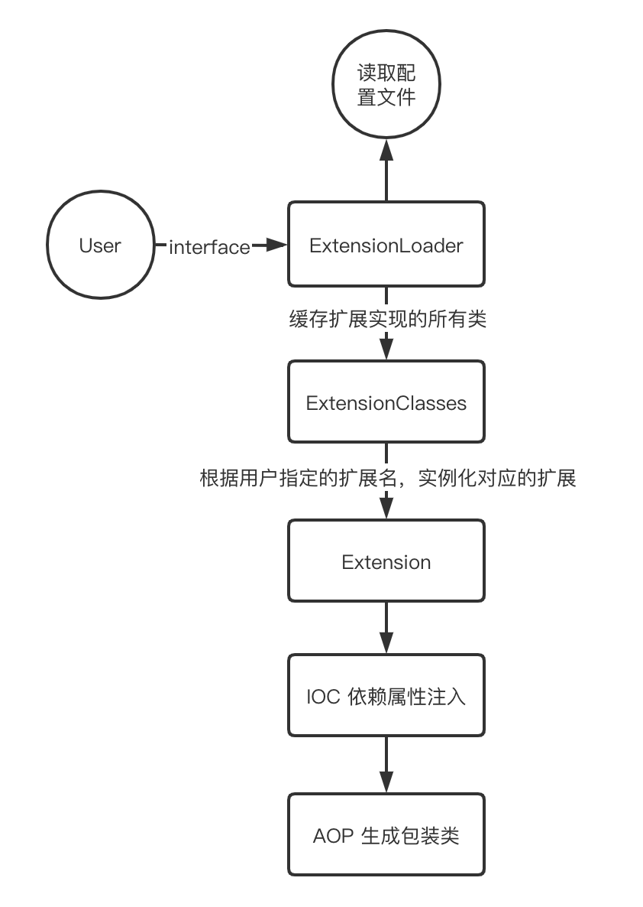
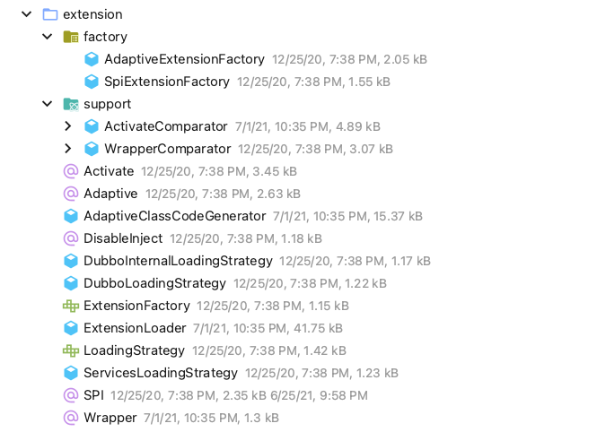
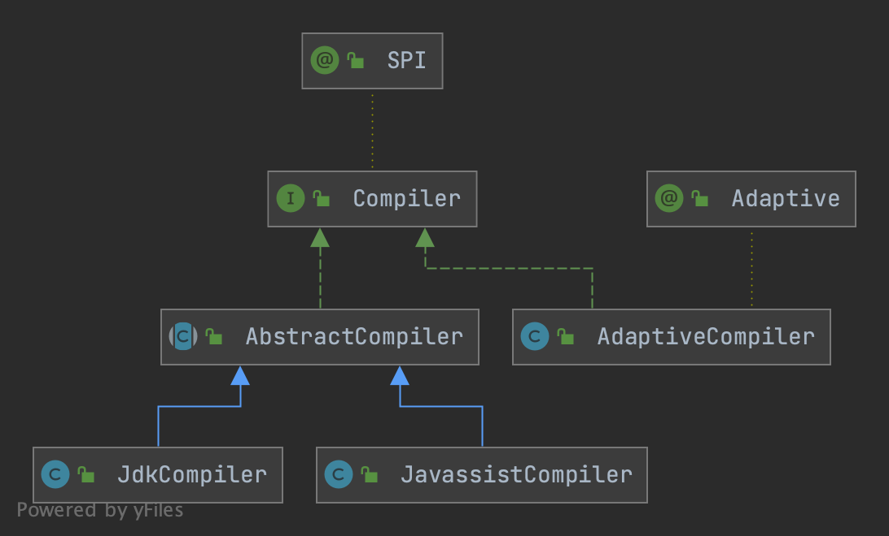

## Introduction

Dubbo 并未使用 Java 原生的 [SPI](/docs/CS/Java/JDK/Basic/SPI.md) 机制，而是对其进行了增强

为什么 Dubbo自己实现 SPI，而不直接使用 Java SPI 呢？
其主要原因有：
- Java SPI 一次性实例化所有扩展点的实现，会造成不必要的资源浪费（比如，实例化了系统中用不到的扩展点实现、初始化时间过长等）；
- 如果扩展点加载失败，连扩展点的名称都拿不到了。比如：JDK 标准的 ScriptEngine，通过 getName() 获取脚本类型的名称，但如果 RubyScriptEngine 因为所依赖的 jruby.jar 不存在，导致 RubyScriptEngine 类加载失败，这个失败原因被吃掉了，和 ruby 对应不起来，当用户执行 ruby 脚本时，会报不支持 ruby，而不是真正失败的原因。
- Java SPI 不支持依赖注入，对扩展点的依赖不友好。Dubbo SPI 支持依赖注入，即在实例化扩展点的过程中，通过反射调用扩展点的 setXXX 方法，注入依赖的扩展点；
- Java SPI 获取实现类方式单一，只能通过遍历获取。Dubbo SPI 支持通过 key 获取实现类，使用起来更方便、更灵活；
- 另外，Dubbo SPI 还实现了强大的自适应扩展和自动激活功能，通过这两个功能可以实现在运行时替换具体实现类（运行到具体的方法时才决定使用哪个实现）以及简化配置。

Dubbo 扩展能力的特性

- 按需加载。Dubbo 的扩展能力不会一次性实例化所有实现，而是用扩展类实例化，减少资源浪费。
- 增加扩展类的 IOC 能力。Dubbo 的扩展能力并不仅仅只是发现扩展服务实现类，而是在此基础上更进一步，如果该扩展类的属性依赖其他对象，则 Dubbo 会自动的完成该依赖对象的注入功能。
- 增加扩展类的 AOP 能力。Dubbo 扩展能力会自动的发现扩展类的包装类，完成包装类的构造，增强扩展类的功能。
- 具备动态选择扩展实现的能力。Dubbo 扩展会基于参数，在运行时动态选择对应的扩展类，提高了 Dubbo 的扩展能力。
- 可以对扩展实现进行排序。能够基于用户需求，指定扩展实现的执行顺序。
- 提供扩展点的 Adaptive 能力。该能力可以使的一些扩展类在 consumer 端生效，一些扩展类在 provider 端生效。

从 Dubbo 扩展的设计目标可以看出，Dubbo 实现的一些例如动态选择扩展实现、IOC、AOP 等特性，能够为用户提供非常灵活的扩展能力。


Dubbo 加载扩展的整个流程如下：主要步骤为 4 个：
- 读取并解析配置文件
- 缓存所有扩展实现
- 基于用户执行的扩展名，实例化对应的扩展实现
- 进行扩展实例属性的 IOC 注入以及实例化扩展的包装类，实现 AOP 特性

<div style="text-align: center;">



</div>

<p style="text-align: center;">
Fig.1. Dubbo加载流程
</p>

Dubbo SPI是通过键值对的方式进行配置
```
xxx=com.foo.XxxProtocol
yyy=com.foo.YyyProtocol
```

The reason for this change is:
If there's third party library referenced by static field or by method in extension implementation, its class will fail to initialize if the third party library doesn't exist.
In this case, dubbo cannot figure out extension's id therefore cannot be able to map the exception information with the extension, if the previous format is used.

**For example**:
Fails to load Extension("mina").
When user configure to use mina, dubbo will complain the extension cannot be loaded, instead of reporting which extract extension implementation fails and the extract reason.

### Packages



### Example

对接口添加@SPI注解

```java
@Documented
@Retention(RetentionPolicy.RUNTIME)
@Target({ElementType.TYPE})
public @interface SPI {
    /**
     * default extension name
     */
    String value() default "";
}
```

`SPI` marker for extension interface

```java
//Protocol. (API/SPI, Singleton, ThreadSafe)
@SPI("dubbo")
public interface Protocol {
  
  	@Adaptive
    <T> Exporter<T> export(Invoker<T> invoker) throws RpcException;
}
```

## ExtensionLoader

org.apache.dubbo.rpc.model.ApplicationModel, DubboBootstrap and this class are at present designed to be singleton or static (by itself totally static or uses some static fields). So the instances returned from them are of process or classloader scope. 
If you want to support multiple dubbo servers in a single process, you may need to refactor these three classes.

Load dubbo extensions
auto inject dependency extension
auto wrap extension in wrapper
default extension is an adaptive instance


```java
public class ExtensionLoader<T> {

  	private static final Pattern NAME_SEPARATOR = Pattern.compile("\\s*[,]+\\s*");

    private static final ConcurrentMap<Class<?>, ExtensionLoader<?>> EXTENSION_LOADERS = new ConcurrentHashMap<>(64);

    private static final ConcurrentMap<Class<?>, Object> EXTENSION_INSTANCES = new ConcurrentHashMap<>(64);

    private final Class<?> type;

    private final ExtensionFactory objectFactory;

    private final ConcurrentMap<Class<?>, String> cachedNames = new ConcurrentHashMap<>();

    private final Holder<Map<String, Class<?>>> cachedClasses = new Holder<>();

    private final Map<String, Object> cachedActivates = new ConcurrentHashMap<>();
    private final ConcurrentMap<String, Holder<Object>> cachedInstances = new ConcurrentHashMap<>();
    private final Holder<Object> cachedAdaptiveInstance = new Holder<>();
    private volatile Class<?> cachedAdaptiveClass = null;
    private String cachedDefaultName;
    private volatile Throwable createAdaptiveInstanceError;

    private Set<Class<?>> cachedWrapperClasses;

    private Map<String, IllegalStateException> exceptions = new ConcurrentHashMap<>();

    // Record all unacceptable exceptions when using SPI
    private Set<String> unacceptableExceptions = new ConcurrentHashSet<>();

    private static volatile LoadingStrategy[] strategies = loadLoadingStrategies();

    public static void setLoadingStrategies(LoadingStrategy... strategies) {
        if (ArrayUtils.isNotEmpty(strategies)) {
            ExtensionLoader.strategies = strategies;
        }
    }

    // Load all prioritized Loading Strategies via ServiceLoader
    private static LoadingStrategy[] loadLoadingStrategies() {
        return stream(load(LoadingStrategy.class).spliterator(), false)
                .sorted()
                .toArray(LoadingStrategy[]::new);
    }

    // Get all Loading Strategies
    public static List<LoadingStrategy> getLoadingStrategies() {
        return asList(strategies);
    }

    private static <T> boolean withExtensionAnnotation(Class<T> type) {
        return type.isAnnotationPresent(SPI.class);
    }

}
```

### getExtensionLoader

获取ExtensionLoader

```java
@SuppressWarnings("unchecked")
public static <T> ExtensionLoader<T> getExtensionLoader(Class<T> type) {
  	// assert type nonNull & isInterface & with @SPI
  
    ExtensionLoader<T> loader = (ExtensionLoader<T>) EXTENSION_LOADERS.get(type);
    if (loader == null) {// if no cache, new ExtensionLoader & put in cache
        EXTENSION_LOADERS.putIfAbsent(type, new ExtensionLoader<T>(type));
        loader = (ExtensionLoader<T>) EXTENSION_LOADERS.get(type);
    }
    return loader;
}

private ExtensionLoader(Class<?> type) {
        this.type = type;
        objectFactory =
                (type == ExtensionFactory.class ? null : ExtensionLoader.getExtensionLoader(ExtensionFactory.class).getAdaptiveExtension());
    }
```
获取Extension

Dubbo SPI 第一次获取扩展点在流程上可以分为以下五步：

1. 解析扩展点配置文件；
2. 加载扩展点实现类；
3. 实例化扩展点；
4. 依赖注入；
5. 如果是包装类，则特殊处理并返回包装类。

以下是一些获取拓展点的函数

1. getExtension
2. getAdaptiveExtension
3. getActivateExtension

### getAdaptiveExtension

1. if cachedAdaptiveInstance, return
2. Else `getAdaptiveExtensionClass`
   1. cachedAdaptiveClass = `getExtensionClasses`
      1. invoke `loadExtensionClasses`
   2. Or cachedAdaptiveClass == null, `createAdaptiveExtensionClass`
3. `injectExtension`

Use DCL get instance from `cachedAdaptiveInstance`

```java
@SuppressWarnings("unchecked")
public T getAdaptiveExtension() {
    Object instance = cachedAdaptiveInstance.get();
    if (instance == null) {
        if (createAdaptiveInstanceError != null) {
            throw new IllegalStateException("Failed to create adaptive instance: " +
                    createAdaptiveInstanceError.toString(),
                    createAdaptiveInstanceError);
        }

        synchronized (cachedAdaptiveInstance) {
            instance = cachedAdaptiveInstance.get();
            if (instance == null) {
                try {
                    instance = createAdaptiveExtension();
                    cachedAdaptiveInstance.set(instance);
                } catch (Throwable t) {
                    createAdaptiveInstanceError = t;
                    throw new IllegalStateException("Failed to create adaptive instance: " + t.toString(), t);
                }
            }
        }
    }

    return (T) instance;
}
```

#### createAdaptiveExtension

```java
@SuppressWarnings("unchecked")
private T createAdaptiveExtension() {
    try {
        return injectExtension((T) getAdaptiveExtensionClass().newInstance());
    } catch (Exception e) {
        throw new IllegalStateException("Can't create adaptive extension " + type + ", cause: " + e.getMessage(), e);
    }
}

private Class<?> getAdaptiveExtensionClass() {
    getExtensionClasses();
    if (cachedAdaptiveClass != null) {
        return cachedAdaptiveClass;
    }
    return cachedAdaptiveClass = createAdaptiveExtensionClass();
}

```

#### createAdaptiveExtensionClass

**create Dynamic Class** by [AdaptiveClassCodeGenerator](/docs/CS/Framework/Dubbo/SPi.md?id=AdaptiveClassCodeGenerator)

```java
private Class<?> createAdaptiveExtensionClass() {
    String code = new AdaptiveClassCodeGenerator(type, cachedDefaultName).generate();
    ClassLoader classLoader = findClassLoader();
    org.apache.dubbo.common.compiler.Compiler compiler =
            ExtensionLoader.getExtensionLoader(org.apache.dubbo.common.compiler.Compiler.class).getAdaptiveExtension();
    return compiler.compile(code, classLoader);
}
```

#### injectExtension

Dubbo SPI 扩展点的依赖注入有两个关键点：

1. 成员变量`ExtensionFactory objectFactory`；
2. 依赖注入逻辑`injectExtension(T instance)`。


ExtensionFactory`是扩展点工厂，用于获取扩展点。所有的依赖注入之前都要通过 objectFactory 获取依赖的扩展点。

objectFactory set by ExtensionLoader's constructor

```java
// ExtensionFactory
@SPI
public interface ExtensionFactory {
    // Get extension.
    <T> T getExtension(Class<T> type, String name);
}
```

`ExtensionFactory`只有一个 getExtension 方法，用于获取扩展点。三个实现类分别是`SpiExtensionFactory`、`SpringExtensionFactory`和`AdaptiveExtensionFactory`。

- `SpiExtensionFactory`：通过 Dubbo SPI 获取扩展点。
- `SpringExtensionFactory`：通过 Spring 获取扩展点。
- `AdaptiveExtensionFactory`：相当于对`SpiExtensionFactory`和`SpringExtensionFactory`的封装，除了`ExtensionFactory`对象外，所有依赖注入获取依赖扩展点都是通过`AdaptiveExtensionFactory`获取的。它持有了`SpiExtensionFactory`和`SpringExtensionFactor


通过getAdaptiveExtension获取所有的拓展点 使用反射通过setter函数赋值

```java
private T injectExtension(T instance) {
    try {
        for (Method method : instance.getClass().getMethods()) {
            if (!isSetter(method)) {
                continue;
            }
            // Check DisableInject to see if we need auto injection for this property
            if (method.getAnnotation(DisableInject.class) != null) {
                continue;
            }
            Class<?> pt = method.getParameterTypes()[0];
            if (ReflectUtils.isPrimitives(pt)) {
                continue;
            }

            try {
                String property = getSetterProperty(method);
                Object object = objectFactory.getExtension(pt, property);
                if (object != null) {
                    method.invoke(instance, object);
                }
            } catch (Exception e) {
                logger.error("");
            }
        }
    } catch (Exception e) {
        logger.error(e.getMessage(), e);
    }
    return instance;
}

private void initExtension(T instance) {
    if (instance instanceof Lifecycle) {
        Lifecycle lifecycle = (Lifecycle) instance;
        lifecycle.initialize();
    }
}
```

#### getExtensionClasses

先看缓存

```java
private Map<String, Class<?>> getExtensionClasses() {
    Map<String, Class<?>> classes = cachedClasses.get();
    if (classes == null) {
        synchronized (cachedClasses) {
            classes = cachedClasses.get();
            if (classes == null) {
                classes = loadExtensionClasses();
                cachedClasses.set(classes);
            }
        }
    }
    return classes;
}
```

##### loadExtensionClasses

在上层调用已经有锁 没有线程安全问题

```java

private Map<String, Class<?>> loadExtensionClasses() {
    cacheDefaultExtensionName();

    Map<String, Class<?>> extensionClasses = new HashMap<>();

    for (LoadingStrategy strategy : strategies) {
        loadDirectory(extensionClasses, strategy.directory(), type.getName(), strategy.preferExtensionClassLoader(),
                strategy.overridden(), strategy.excludedPackages());
        loadDirectory(extensionClasses, strategy.directory(), type.getName().replace("org.apache", "com.alibaba"),
                strategy.preferExtensionClassLoader(), strategy.overridden(), strategy.excludedPackages());
    }

    return extensionClasses;
}

/**
 * extract and cache default extension name if exists
 */
private void cacheDefaultExtensionName() {
    final SPI defaultAnnotation = type.getAnnotation(SPI.class);
    if (defaultAnnotation == null) {
        return;
    }

    String value = defaultAnnotation.value();
    if ((value = value.trim()).length() > 0) {
        String[] names = NAME_SEPARATOR.split(value);
        if (names.length > 1) {
            throw new IllegalStateException("More than 1 default extension name on extension " + type.getName()
                    + ": " + Arrays.toString(names));
        }
        if (names.length == 1) {
            cachedDefaultName = names[0];
        }
    }
}
```

##### loadDirectory

```java
private void loadDirectory(Map<String, Class<?>> extensionClasses, String dir, String type,
                           boolean extensionLoaderClassLoaderFirst, boolean overridden, String... excludedPackages) {
    String fileName = dir + type;
    try {
        Enumeration<java.net.URL> urls = null;
        ClassLoader classLoader = findClassLoader();

        // try to load from ExtensionLoader's ClassLoader first
        if (extensionLoaderClassLoaderFirst) {
            ClassLoader extensionLoaderClassLoader = ExtensionLoader.class.getClassLoader();
            if (ClassLoader.getSystemClassLoader() != extensionLoaderClassLoader) {
                urls = extensionLoaderClassLoader.getResources(fileName);
            }
        }

        if (urls == null || !urls.hasMoreElements()) {
            if (classLoader != null) {
                urls = classLoader.getResources(fileName);
            } else {
                urls = ClassLoader.getSystemResources(fileName);
            }
        }

        if (urls != null) {
            while (urls.hasMoreElements()) {
                java.net.URL resourceURL = urls.nextElement();
                loadResource(extensionClasses, classLoader, resourceURL, overridden, excludedPackages);
            }
        }
    } catch (Throwable t) {
        logger.error("Exception occurred when loading extension class (interface: " +
                type + ", description file: " + fileName + ").", t);
    }
}
```

##### loadResource

invoke `loadClass` in BufferedReader

```java
private void loadResource(Map<String, Class<?>> extensionClasses, ClassLoader classLoader,
                          java.net.URL resourceURL, boolean overridden, String... excludedPackages) {
    try {
        try (BufferedReader reader = new BufferedReader(new InputStreamReader(resourceURL.openStream(), StandardCharsets.UTF_8))) {
            String line;
            String clazz = null;
            while ((line = reader.readLine()) != null) {
                final int ci = line.indexOf('#');
                if (ci >= 0) {
                    line = line.substring(0, ci);
                }
                line = line.trim();
                if (line.length() > 0) {
                    try {
                        String name = null;
                        int i = line.indexOf('=');
                        if (i > 0) {
                            name = line.substring(0, i).trim();
                            clazz = line.substring(i + 1).trim();
                        } else {
                            clazz = line;
                        }
                        if (StringUtils.isNotEmpty(clazz) && !isExcluded(clazz, excludedPackages)) {
                            loadClass(extensionClasses, resourceURL, Class.forName(clazz, true, classLoader), name, overridden);
                        }
                    } catch (Throwable t) {
                        IllegalStateException e = new IllegalStateException("");
                        exceptions.put(line, e);
        }    }	}		}
    } catch (Throwable t) {
        logger.error("");
    }
}

private boolean isExcluded(String className, String... excludedPackages) {
    if (excludedPackages != null) {
        for (String excludePackage : excludedPackages) {
            if (className.startsWith(excludePackage + ".")) {
                return true;
            }
        }
    }
    return false;
}
```

### loadClass

cache Class

```java
private void loadClass(Map<String, Class<?>> extensionClasses, java.net.URL resourceURL, Class<?> clazz, String name,
                       boolean overridden) throws NoSuchMethodException {
    if (!type.isAssignableFrom(clazz)) {
        throw new IllegalStateException("Error occurred when loading extension class (interface: " +
                type + ", class line: " + clazz.getName() + "), class "
                + clazz.getName() + " is not subtype of interface.");
    }
    if (clazz.isAnnotationPresent(Adaptive.class)) {
        cacheAdaptiveClass(clazz, overridden);
    
    } else if (isWrapperClass(clazz)) {/** 	test if clazz is a wrapper class
																						which has Constructor with given 
																						class type as its only argument*/													cacheWrapperClass(clazz);
    } else {
        clazz.getConstructor();
        if (StringUtils.isEmpty(name)) {
            name = findAnnotationName(clazz);
            if (name.length() == 0) {
                throw new IllegalStateException(
                        "No such extension name for the class " + clazz.getName() + " in the config " + resourceURL);
            }
        }

        String[] names = NAME_SEPARATOR.split(name);
        if (ArrayUtils.isNotEmpty(names)) {
            cacheActivateClass(clazz, names[0]);
            for (String n : names) {
                cacheName(clazz, n);
                saveInExtensionClass(extensionClasses, clazz, n, overridden);
            }
        }
    }
}

/**
 * cache name
 */
private void cacheName(Class<?> clazz, String name) {
    if (!cachedNames.containsKey(clazz)) {
        cachedNames.put(clazz, name);
    }
}
```

#### cacheAdaptiveClass

```java
/**
 * cache Adaptive class which is annotated with <code>Adaptive</code>
 */
private void cacheAdaptiveClass(Class<?> clazz, boolean overridden) {
    if (cachedAdaptiveClass == null || overridden) {
        cachedAdaptiveClass = clazz;
    } else if (!cachedAdaptiveClass.equals(clazz)) {
        throw new IllegalStateException("More than 1 adaptive class found: "
                + cachedAdaptiveClass.getName()
                + ", " + clazz.getName());
    }
}
```

#### cacheWrapperClass

```java
/**
 * cache wrapper class
 * <p>
 * like: ProtocolFilterWrapper, ProtocolListenerWrapper
 */
private void cacheWrapperClass(Class<?> clazz) {
    if (cachedWrapperClasses == null) {
        cachedWrapperClasses = new ConcurrentHashSet<>();
    }
    cachedWrapperClasses.add(clazz);
}
```

#### cacheActivateClass

```java
/**
 * cache Activate class which is annotated with <code>Activate</code>
 * <p>
 * for compatibility, also cache class with old alibaba Activate annotation
 */
private void cacheActivateClass(Class<?> clazz, String name) {
    Activate activate = clazz.getAnnotation(Activate.class);
    if (activate != null) {
        cachedActivates.put(name, activate);
    } else {
        // support com.alibaba.dubbo.common.extension.Activate
        com.alibaba.dubbo.common.extension.Activate oldActivate =
                clazz.getAnnotation(com.alibaba.dubbo.common.extension.Activate.class);
        if (oldActivate != null) {
            cachedActivates.put(name, oldActivate);
        }
    }
}
```

#### saveInExtensionClass

```java
/**
 * put clazz in extensionClasses
 */
private void saveInExtensionClass(Map<String, Class<?>> extensionClasses, Class<?> clazz, String name, boolean overridden) {
    Class<?> c = extensionClasses.get(name);
    if (c == null || overridden) {
        extensionClasses.put(name, clazz);
    } else if (c != clazz) {
        // duplicate implementation is unacceptable
        unacceptableExceptions.add(name);
        String duplicateMsg =
                "Duplicate extension " + type.getName() + " name " + name + " on " + c.getName() + " and " + clazz.getName();
        logger.error(duplicateMsg);
        throw new IllegalStateException(duplicateMsg);
    }
}
```

### getExtension

双重校验锁防止创建多个

```java
public T getExtension(String name) {
    return getExtension(name, true);
}

public T getExtension(String name, boolean wrap) {
    if ("true".equals(name)) {
        return getDefaultExtension();
    }
    final Holder<Object> holder = getOrCreateHolder(name);
    Object instance = holder.get();
    if (instance == null) {
        synchronized (holder) {
            instance = holder.get();
            if (instance == null) {
                instance = createExtension(name, wrap);
                holder.set(instance);
            }
        }
    }
    return (T) instance;
}
```

```java
public T getOriginalInstance(String name) {
    getExtension(name);
    Class<?> clazz = getExtensionClasses().get(name);
    return (T) EXTENSION_INSTANCES.get(clazz);
}
```


#### createExtension


Wrap extensions like AOP

invoke [injectExension](/docs/CS/Framework/Dubbo/SPI.md?id=injectExension)

```java
@SuppressWarnings("unchecked")
private T createExtension(String name, boolean wrap) {
    // 解析配置文件 加载类
    Class<?> clazz = getExtensionClasses().get(name);
    try {
        T instance = (T) EXTENSION_INSTANCES.get(clazz);
        if (instance == null) {
            EXTENSION_INSTANCES.putIfAbsent(clazz, clazz.getDeclaredConstructor().newInstance());
            instance = (T) EXTENSION_INSTANCES.get(clazz);
        }
        // 依赖注入
        injectExtension(instance);


        if (wrap) {
			// 包装类
            List<Class<?>> wrapperClassesList = new ArrayList<>();
            if (cachedWrapperClasses != null) {
                wrapperClassesList.addAll(cachedWrapperClasses);
                wrapperClassesList.sort(WrapperComparator.COMPARATOR);
                Collections.reverse(wrapperClassesList);
            }

            if (CollectionUtils.isNotEmpty(wrapperClassesList)) {
                for (Class<?> wrapperClass : wrapperClassesList) {
                    Wrapper wrapper = wrapperClass.getAnnotation(Wrapper.class);
                    if (wrapper == null
                            || (ArrayUtils.contains(wrapper.matches(), name) && !ArrayUtils.contains(wrapper.mismatches(), name))) {
                        instance = injectExtension((T) wrapperClass.getConstructor(type).newInstance(instance));
                    }
                }
            }
        }
		// 初始化
        initExtension(instance);
        return instance;
    } catch (Throwable t) {
        throw new IllegalStateException("Extension instance (name: " + name + ", class: " +
                type + ") couldn't be instantiated: " + t.getMessage(), t);
    }
}
```

```java
private static ClassLoader findClassLoader() {
    return ClassUtils.getClassLoader(ExtensionLoader.class);
}

public String getExtensionName(T extensionInstance) {
    return getExtensionName(extensionInstance.getClass());
}

public String getExtensionName(Class<?> extensionClass) {
    getExtensionClasses();// load class
    return cachedNames.get(extensionClass);
}
```

### getActivateExtension

Get activate extensions.

```java
public List<T> getActivateExtension(URL url, String[] values, String group) {
    List<T> activateExtensions = new ArrayList<>();
    // solve the bug of using @SPI's wrapper method to report a null pointer exception.
    TreeMap<Class, T> activateExtensionsMap = new TreeMap<>(ActivateComparator.COMPARATOR);
    Set<String> loadedNames = new HashSet<>();
    Set<String> names = CollectionUtils.ofSet(values);
    if (!names.contains(REMOVE_VALUE_PREFIX + DEFAULT_KEY)) {
        getExtensionClasses();
        for (Map.Entry<String, Object> entry : cachedActivates.entrySet()) {
            String name = entry.getKey();
            Object activate = entry.getValue();

            String[] activateGroup, activateValue;

            if (activate instanceof Activate) {
                activateGroup = ((Activate) activate).group();
                activateValue = ((Activate) activate).value();
            } else if (activate instanceof com.alibaba.dubbo.common.extension.Activate) {
                activateGroup = ((com.alibaba.dubbo.common.extension.Activate) activate).group();
                activateValue = ((com.alibaba.dubbo.common.extension.Activate) activate).value();
            } else {
                continue;
            }
            if (isMatchGroup(group, activateGroup)
                    && !names.contains(name)
                    && !names.contains(REMOVE_VALUE_PREFIX + name)
                    && isActive(activateValue, url)
                    && !loadedNames.contains(name)) {
                activateExtensionsMap.put(getExtensionClass(name), getExtension(name));
                loadedNames.add(name);
            }
        }
        if (!activateExtensionsMap.isEmpty()) {
            activateExtensions.addAll(activateExtensionsMap.values());
        }
    }
    List<T> loadedExtensions = new ArrayList<>();
    for (String name : names) {
        if (!name.startsWith(REMOVE_VALUE_PREFIX)
                && !names.contains(REMOVE_VALUE_PREFIX + name)) {
            if (!loadedNames.contains(name)) {
                if (DEFAULT_KEY.equals(name)) {
                    if (!loadedExtensions.isEmpty()) {
                        activateExtensions.addAll(0, loadedExtensions);
                        loadedExtensions.clear();
                    }
                } else {
                    loadedExtensions.add(getExtension(name));
                }
                loadedNames.add(name);
            } else {
                // If getExtension(name) exists, getExtensionClass(name) must exist, so there is no null pointer processing here.
                String simpleName = getExtensionClass(name).getSimpleName();
                logger.warn("Catch duplicated filter, ExtensionLoader will ignore one of them. Please check. Filter Name: " + name +
                        ". Ignored Class Name: " + simpleName);
            }
        }
    }
    if (!loadedExtensions.isEmpty()) {
        activateExtensions.addAll(loadedExtensions);
    }
    return activateExtensions;
}
```

### AdaptiveClassCodeGenerator

```java
public String generate() {
    // no need to generate adaptive class since there's no adaptive method found.
    if (!hasAdaptiveMethod()) {
        throw new IllegalStateException("No adaptive method exist on extension " + type.getName() + ", refuse to create the adaptive class!");
    }

    StringBuilder code = new StringBuilder();
    code.append(generatePackageInfo());
    code.append(generateImports());
    code.append(generateClassDeclaration());

    Method[] methods = type.getMethods();
    for (Method method : methods) {
        code.append(generateMethod(method));
    }
    code.append("}");

    if (logger.isDebugEnabled()) {
        logger.debug(code.toString());
    }
    return code.toString();
}
```

## Compiler



```java
/**
 * Compiler. (SPI, Singleton, ThreadSafe)
 */
@SPI(JavassistCompiler.NAME)
public interface Compiler {

    /**
     * Compile java source code.
     *
     * @param code        Java source code
     * @param classLoader classloader
     * @return Compiled class
     */
    Class<?> compile(String code, ClassLoader classLoader);

}
```

```java
/**
 * AdaptiveCompiler. (SPI, Singleton, ThreadSafe)
 */
@Adaptive
public class AdaptiveCompiler implements Compiler {

    private static volatile String DEFAULT_COMPILER;

  	// call by ApplicationConfig#setCompiler()
    public static void setDefaultCompiler(String compiler) {
        DEFAULT_COMPILER = compiler;
    }

    @Override
    public Class<?> compile(String code, ClassLoader classLoader) {
        Compiler compiler;
        ExtensionLoader<Compiler> loader = ExtensionLoader.getExtensionLoader(Compiler.class);
        String name = DEFAULT_COMPILER; // copy reference
        if (name != null && name.length() > 0) {
            compiler = loader.getExtension(name);
        } else {
            compiler = loader.getDefaultExtension();
        }
        return compiler.compile(code, classLoader);
    }

}
```

### JavassistCompiler

```java
/**
 * JavassistCompiler. (SPI, Singleton, ThreadSafe)
 */
public class JavassistCompiler extends AbstractCompiler {

    public static final String NAME = "javassist";

    private static final Pattern IMPORT_PATTERN = Pattern.compile("import\\s+([\\w\\.\\*]+);\n");

    private static final Pattern EXTENDS_PATTERN = Pattern.compile("\\s+extends\\s+([\\w\\.]+)[^\\{]*\\{\n");

    private static final Pattern IMPLEMENTS_PATTERN = Pattern.compile("\\s+implements\\s+([\\w\\.]+)\\s*\\{\n");

    private static final Pattern METHODS_PATTERN = Pattern.compile("\n(private|public|protected)\\s+");

    private static final Pattern FIELD_PATTERN = Pattern.compile("[^\n]+=[^\n]+;");

    @Override
    public Class<?> doCompile(String name, String source) throws Throwable {
        CtClassBuilder builder = new CtClassBuilder();
        builder.setClassName(name);

        // process imported classes
        Matcher matcher = IMPORT_PATTERN.matcher(source);
        while (matcher.find()) {
            builder.addImports(matcher.group(1).trim());
        }

        // process extended super class
        matcher = EXTENDS_PATTERN.matcher(source);
        if (matcher.find()) {
            builder.setSuperClassName(matcher.group(1).trim());
        }

        // process implemented interfaces
        matcher = IMPLEMENTS_PATTERN.matcher(source);
        if (matcher.find()) {
            String[] ifaces = matcher.group(1).trim().split("\\,");
            Arrays.stream(ifaces).forEach(i -> builder.addInterface(i.trim()));
        }

        // process constructors, fields, methods
        String body = source.substring(source.indexOf('{') + 1, source.length() - 1);
        String[] methods = METHODS_PATTERN.split(body);
        String className = ClassUtils.getSimpleClassName(name);
        Arrays.stream(methods).map(String::trim).filter(m -> !m.isEmpty()).forEach(method -> {
            if (method.startsWith(className)) {
                builder.addConstructor("public " + method);
            } else if (FIELD_PATTERN.matcher(method).matches()) {
                builder.addField("private " + method);
            } else {
                builder.addMethod("public " + method);
            }
        });

        // compile
        ClassLoader classLoader = org.apache.dubbo.common.utils.ClassUtils.getCallerClassLoader(getClass());
        CtClass cls = builder.build(classLoader);
        return cls.toClass(classLoader, JavassistCompiler.class.getProtectionDomain());
    }

}
```

### JDKCompiler

```java
/**
 * JdkCompiler. (SPI, Singleton, ThreadSafe)
 */
public class JdkCompiler extends AbstractCompiler {

    public static final String NAME = "jdk";

    private final JavaCompiler compiler = ToolProvider.getSystemJavaCompiler();

    private final DiagnosticCollector<JavaFileObject> diagnosticCollector = new DiagnosticCollector<JavaFileObject>();

    private final ClassLoaderImpl classLoader;

    private final JavaFileManagerImpl javaFileManager;

    private final List<String> options;

    private static final String DEFAULT_JAVA_VERSION = "1.8";

}
```

## Summary


|              | JDK SPI                   | Dubbo SPI       | Spring SPI |
| -------------- | --------------------------- | ----------------- | ---------- |
| load         | must load all SubClasses  | -               | must load all SubClasses |
| Source       | only one source           | -               |  |
| Fail Message | fail message may override | -               |  |
| Extension    | -                         | support IoC AOP |  |


## Links

- [Dubbo](/docs/CS/Framework/Dubbo/Dubbo.md)