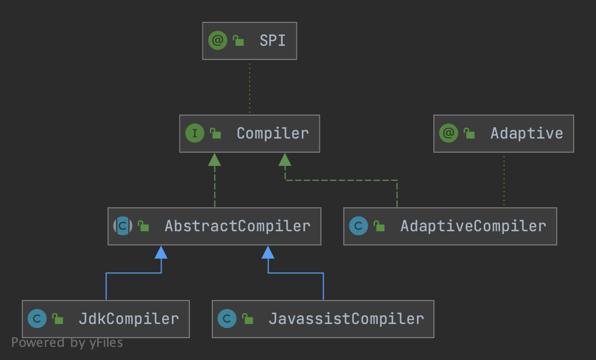

## Introduction

Dubbo 没有直接使用 Java 原生的 [SPI](/docs/CS/Java/JDK/Basic/SPI.md)，而是把「加载扩展」重写了一遍，并且从 3.0 开始在这套机制之上压了一整层**域模型（ScopeModel）**。这一层是本篇最容易写错的地方，也是旧版资料几乎不提的地方。

先说清三个反直觉的事实，它们构成本篇的主线：

1. **`@SPI` 注解只有两个属性：`value` 和 `scope`。** 流传很广的「`@SPI(value, dependencies, scope, order)` 四属性」写法是错的——`dependencies` 从来不存在，`order` 属于 `@Activate` 而不是 `@SPI`（`Activate.java:93` 的默认值是 `0`）。3.3.6 的定义只有几行有效代码，见下文。
2. **`ExtensionLoader.getExtensionLoader(Class)` 已经 `@Deprecated`**，而且 `resetExtensionLoader(Class)` 是**空方法体**。原因不在「不推荐」，而在语义：没有 `ScopeModel` 参数时它只能返回「默认 ApplicationModel 的默认 ModuleModel」里的加载器，这在一个进程跑多个 Dubbo 应用时会拿错实例。带 `ScopeModel` 的新入口在 `ScopeModelUtil` 上，不在 `ExtensionLoader` 上。
3. **`ExtensionLoader` 里已经没有 `EXTENSION_LOADERS` / `EXTENSION_INSTANCES` 这两个静态 Map 了**。3.x 把「谁负责缓存某个类型的扩展加载器」这件事上移给了 `ExtensionDirector`，把「谁负责缓存某个类型的扩展实例」下放成了 `ExtensionLoader` 的**实例字段**。所以旧笔记里「`ExtensionLoader` 是静态单例容器」的整段描述在 3.3.6 里是错的。

那么「扩展实例属于哪个模型」这个问题由谁回答？答案是 `@SPI` 上的 `scope()` 属性。它决定了这个 SPI 的实现类实例会被挂到 `FrameworkModel` / `ApplicationModel` / `ModuleModel` 中的哪一层去，是全局一份、一个应用一份，还是一个服务模块一份。这是 Dubbo 3.x 最大的架构变化，也是本篇新增篇幅最多的部分。

本文版本基线：**Apache Dubbo 3.3.6**（tag `dubbo-3.3.6`）。所有代码块、SPI 文件内容、方法签名均逐文件核对自源码树，代码块首行注释给出文件路径与行号。本篇不重复 [Dubbo](/docs/CS/Framework/Dubbo/Dubbo.md?id=scopemodel) 里 ScopeModel 的模型树与生命周期叙述，只讲**它如何决定扩展加载与实例归属**；扩展点的实际用法见 [Filter](/docs/CS/Framework/Dubbo/Filter.md) 与 [cluster](/docs/CS/Framework/Dubbo/cluster.md)。

## 为什么不直接用 Java SPI

这一节的思想在 3.3.6 里没有变化，是理解 Dubbo 扩展设计的动机基础。Java SPI 的主要缺陷有五个：

- **一次性实例化所有扩展实现**。`ServiceLoader` 拿到 `Iterator` 后 Dubbo 若要遍历就会触发全部实现类的加载与初始化，实例化那些本次运行根本用不到的扩展点，浪费资源、拉长启动时间。
- **加载失败会连扩展名一起丢掉**。JDK 标准的 `ScriptEngine` 通过 `getName()` 暴露脚本类型名，但如果 `RubyScriptEngine` 因缺少 jruby.jar 而加载失败，这个异常会被吞掉，用户执行 ruby 脚本时只会得到「不支持 ruby」，看不到真正的失败原因。
- **不支持依赖注入**。扩展点里 `setXxx(依赖)` 无人处理。
- **获取实现的方式单一**，只能遍历，没有「按 key 取一个」。
- **没有 AOP**，无法自动给扩展套包装类。

Dubbo 的对应增强：按需加载（只加载类，首次 `getExtension` 才实例化）、IoC（setter 反射注入）、AOP（自动发现 Wrapper）、自适应扩展（`@Adaptive`，运行时按 URL 参数选实现）、自动激活（`@Activate`，按 group/value/order 筛选与排序）。

配置格式也从「一行一个类名」改成 key-value：

```properties
# META-INF/dubbo/internal/org.apache.dubbo.rpc.Protocol
dubbo=org.apache.dubbo.rpc.protocol.dubbo.DubboProtocol
tri=org.apache.dubbo.rpc.protocol.tri.TripleProtocol
```

理由与 `@SPI` 注解的 javadoc 一致：如果扩展实现的静态字段或方法引用了第三方库，第三方库缺失时类初始化就会失败。若用旧格式（只写类名），Dubbo 连扩展的 id 都拿不到，无法把异常映射回具体扩展；改成 key-value 后，至少能报出「加载 `xxx` 扩展失败」并附上真实原因。

## @SPI 注解

3.3.6 的定义只有这么几行：

```java
// dubbo-common/src/main/java/org/apache/dubbo/common/extension/SPI.java:53-67
@Documented
@Retention(RetentionPolicy.RUNTIME)
@Target({ElementType.TYPE})
public @interface SPI {
    /**
     * default extension name
     */
    String value() default "";

    /**
     * scope of SPI, default value is application scope.
     */
    ExtensionScope scope() default ExtensionScope.APPLICATION;
}
```

> [!WARNING]
> `@SPI` 上**没有** `dependencies`，也**没有** `order`。`order` / `before` / `after` / `onClass` 都在 `@Activate` 上（`Activate.java:45-99`）。看到把 `order` 写进 `@SPI` 的代码或文档，一律是错的。

标注在接口上，形如：

```java
// dubbo-rpc/dubbo-rpc-api/src/main/java/org/apache/dubbo/rpc/Protocol.java:58
@SPI(value = "dubbo", scope = ExtensionScope.FRAMEWORK)
public interface Protocol {
    @Adaptive({Constants.PROTOCOL_KEY})
    <T> Exporter<T> export(Invoker<T> invoker) throws RpcException;
}
```

不同扩展点选不同的 scope，这直接决定了实例的复用范围：

| 扩展点 | 3.3.6 注解 | 位置 |
| --- | --- | --- |
| `Protocol` | `@SPI(value = "dubbo", scope = FRAMEWORK)` | `Protocol.java:58` |
| `Compiler` | `@SPI(value = "javassist", scope = FRAMEWORK)` | `Compiler.java:25` |
| `Converter` / `MultiValueConverter` | `@SPI(scope = FRAMEWORK)` | `Converter.java:33`、`MultiValueConverter.java:36` |
| `ThreadPool` | `@SPI(value = "fixed", scope = FRAMEWORK)` | `ThreadPool.java:29` |
| `Filter` | `@SPI(scope = MODULE)` | `Filter.java:68` |
| `ModuleExt` / `ModuleDeployListener` | `@SPI(scope = MODULE)` | `ModuleExt.java:22` |
| `ApplicationExt` / `ApplicationInitListener` | `@SPI(scope = APPLICATION)` | `ApplicationExt.java:22` |
| `InfraAdapter` / `DataStore` / `StatusChecker` | `@SPI(scope = APPLICATION)` | `InfraAdapter.java:29` 等 |
| `ExtensionInjector` | `@SPI(scope = SELF)` | `ExtensionInjector.java:22` |

### ExtensionScope 的四个取值

```java
// dubbo-common/src/main/java/org/apache/dubbo/common/extension/ExtensionScope.java
public enum ExtensionScope {
    FRAMEWORK,    // 框架内共享，可拿到 FrameworkModel，拿不到 ApplicationModel / ModuleModel
    APPLICATION,  // 一个应用一份，应用内所有模块共享
    MODULE,       // 一个模块一份，可拿到三层模型
    SELF          // 每个作用域各创建一份，给特殊 SPI 用，例如 ExtensionInjector
}
```

这四条约束不是装饰性的注释，而是 `ExtensionDirector` 实际路由的依据，见下一节。

## ScopeModel：扩展实例属于哪个模型

### 三层模型

Dubbo 3.x 把「静态单例」拆成了一棵模型树，三个节点都继承 `ScopeModel`（`ScopeModel.java:41`）：

- `FrameworkModel`（`FrameworkModel.java:43`）——框架级，一个 JVM 内可以有多个实例，彼此不共享应用状态。持有全部 `ApplicationModel` 集合、`FrameworkServiceRepository`，以及默认实例 `FrameworkModel.defaultModel()`（`FrameworkModel.java:179`）。
- `ApplicationModel`（`ApplicationModel.java:53`）——一个「正在使用 Dubbo 的应用」，存 `ProviderModel` / `ConsumerModel` 等元数据，`ApplicationModel.defaultModel()` 实际是 `FrameworkModel.defaultModel().defaultApplication()`。
- `ModuleModel`（`ModuleModel.java:40`）——一个「服务模块」，对应老版本里 DubboBootstrap 的粒度，也是 `@SPI(scope = MODULE)` 扩展实例的最小隔离单位。

`ScopeModel` 自身持有父引用、作用域类型、一组累积的 ClassLoader、一个 `ExtensionDirector` 和一个 `ScopeBeanFactory`（`ScopeModel.java:62-77`）。`initialize()` 里创建 `ExtensionDirector` 并把 Dubbo 自己的 ClassLoader 加进去：

```java
// dubbo-common/src/main/java/org/apache/dubbo/rpc/model/ScopeModel.java:100-113
protected void initialize() {
    synchronized (instLock) {
        this.extensionDirector =
                new ExtensionDirector(parent != null ? parent.getExtensionDirector() : null, scope, this);
        this.extensionDirector.addExtensionPostProcessor(new ScopeModelAwareExtensionProcessor(this));
        this.beanFactory = new ScopeBeanFactory(parent != null ? parent.getBeanFactory() : null, extensionDirector);

        // Add Framework's ClassLoader by default
        ClassLoader dubboClassLoader = ScopeModel.class.getClassLoader();
        if (dubboClassLoader != null) {
            this.addClassLoader(dubboClassLoader);
        }
    }
}
```

> [!TIP]
> `addClassLoader` 会**递归加到所有父模型**（`ScopeModel.java:227-236`），也就是说子模型加的 ClassLoader 对父模型同样可见。这是子类加载器场景下扩展能被父层找到的原因。

### ExtensionDirector：scope 的实际执行者

`ExtensionDirector` 逐层对应一个 `ScopeModel`，它实现的查找逻辑类似 ClassLoader 的双亲委派，但**第一道门是 scope 匹配**：

```java
// dubbo-common/src/main/java/org/apache/dubbo/common/extension/ExtensionDirector.java:67-107
@Override
@SuppressWarnings("unchecked")
public <T> ExtensionLoader<T> getExtensionLoader(Class<T> type) {
    checkDestroyed();
    if (type == null) {
        throw new IllegalArgumentException("Extension type == null");
    }
    if (!type.isInterface()) {
        throw new IllegalArgumentException("Extension type (" + type + ") is not an interface!");
    }
    if (!withExtensionAnnotation(type)) {
        throw new IllegalArgumentException("Extension type (" + type
                + ") is not an extension, because it is NOT annotated with @" + SPI.class.getSimpleName() + "!");
    }

    // 1. find in local cache
    ExtensionLoader<T> loader = (ExtensionLoader<T>) extensionLoadersMap.get(type);

    ExtensionScope scope = extensionScopeMap.get(type);
    if (scope == null) {
        SPI annotation = type.getAnnotation(SPI.class);
        scope = annotation.scope();
        extensionScopeMap.put(type, scope);
    }

    if (loader == null && scope == ExtensionScope.SELF) {
        // create an instance in self scope
        loader = createExtensionLoader0(type);
    }

    // 2. find in parent
    if (loader == null) {
        if (this.parent != null) {
            loader = this.parent.getExtensionLoader(type);
        }
    }

    // 3. create it
    if (loader == null) {
        loader = createExtensionLoader(type);
    }

    return loader;
}
```

关键在第 3 步的 `createExtensionLoader`：

```java
// dubbo-common/src/main/java/org/apache/dubbo/common/extension/ExtensionDirector.java:109-130
private <T> ExtensionLoader<T> createExtensionLoader(Class<T> type) {
    ExtensionLoader<T> loader = null;
    if (isScopeMatched(type)) {
        // if scope is matched, just create it
        loader = createExtensionLoader0(type);
    }
    return loader;
}

private boolean isScopeMatched(Class<?> type) {
    final SPI defaultAnnotation = type.getAnnotation(SPI.class);
    return defaultAnnotation.scope().equals(scope);
}
```

把三步合起来读，`@SPI(scope)` 的语义就完全确定了：

| scope | 行为 | 为什么 |
| --- | --- | --- |
| `FRAMEWORK` | 只有 `FrameworkModel` 的 Director 能 `isScopeMatched`，创建后 ApplicationModel 找不到就往上委派命中它 | 全进程一份，无状态最安全 |
| `APPLICATION` | `FrameworkModel` 层 `isScopeMatched` 为 false，委派到 `ApplicationModel` 才创建 | 不同应用要隔离数据，应用内模块共享 |
| `MODULE` | 前两层都不匹配，直到某个 `ModuleModel` 才创建 | 服务级隔离，每个模块一份 |
| `SELF` | 跳过第 2 步委派，第 1 步判空后直接 `createExtensionLoader0` | 每一层都必须有一份自己的，不能向上共享 |

> [!NOTE]
> `SELF` 只在 `loader == null` 时才创建，且不走父委派。这正是 `ExtensionInjector` 选 `SELF` 的原因：依赖注入器必须**每个模型一份**，否则 ModuleModel 想注入依赖时会拿到 ApplicationModel 或 FrameworkModel 的注入器，跨作用域泄漏。

### 拿 ExtensionLoader 的正确姿势

三个层次，从旧到新：

```java
// 1. 已废弃：拿到的是「默认 ApplicationModel 的默认 ModuleModel」的加载器
// dubbo-common/src/main/java/org/apache/dubbo/common/extension/ExtensionLoader.java:240-247
@Deprecated
public static <T> ExtensionLoader<T> getExtensionLoader(Class<T> type) {
    return ApplicationModel.defaultModel().getDefaultModule().getExtensionLoader(type);
}

@Deprecated
public static void resetExtensionLoader(Class type) {}
```

`resetExtensionLoader` 在 3.3.6 里是**完全空的方法体**，不是「实现被简化」——它只保留符号兼容，调用它什么都不做。

正确做法是从 `ScopeModel` 上取，因为 `ScopeModel implements ExtensionAccessor`，而 `ExtensionAccessor` 把 `getExtensionLoader` / `getExtension` / `getAdaptiveExtension` 都定义成了 default 方法（`ExtensionAccessor.java:28-52`）。`ScopeModelUtil` 则解决了「手上只有一个 `ScopeModel`，或者连 `ScopeModel` 都没有」这两种情况：

```java
// dubbo-common/src/main/java/org/apache/dubbo/rpc/model/ScopeModelUtil.java:100-118
public static <T> ExtensionLoader<T> getExtensionLoader(Class<T> type, ScopeModel scopeModel) {
    if (scopeModel != null) {
        return scopeModel.getExtensionLoader(type);
    } else {
        SPI spi = type.getAnnotation(SPI.class);
        if (spi == null) {
            throw new IllegalArgumentException("SPI annotation not found for class: " + type.getName());
        }
        switch (spi.scope()) {
            case FRAMEWORK:
                return FrameworkModel.defaultModel().getExtensionLoader(type);
            case APPLICATION:
                return ApplicationModel.defaultModel().getExtensionLoader(type);
            case MODULE:
                return ApplicationModel.defaultModel().getDefaultModule().getExtensionLoader(type);
            default:
                throw new IllegalArgumentException("Unable to get ExtensionLoader for type: " + type.getName());
        }
    }
}
```

`scopeModel == null` 时按 `spi.scope()` 退化到对应的默认模型——这就是 `@SPI(scope)` 的「自动路由」形态，也是 `AdaptiveClassCodeGenerator` 生成的代码里那条 `ScopeModel scopeModel = ScopeModelUtil.getOrDefault(url.getScopeModel(), Xxx.class);` 的由来（`AdaptiveClassCodeGenerator.java:74-79`）。

> [!TIP]
> `ScopeModelUtil.getExtensionLoader(Class, ScopeModel)` 这个签名**在 `ScopeModelUtil` 上，不在 `ExtensionLoader` 上**。`ExtensionLoader` 上那个只有单参版本，而且已废弃。

### 模型的销毁

`ScopeModel.destroy()`（`ScopeModel.java:117-141`）按 `onDestroy → 逐个 removeClassLoader → beanFactory.destroy → extensionDirector.destroy()` 的顺序收尾；`ExtensionDirector.destroy()` 再逐个调 `ExtensionLoader.destroy()`，后者销毁自己缓存的 `Disposable` 扩展实例（`ExtensionLoader.java:249-278`）。销毁后 `ExtensionLoader` 的 `destroyed` 标志置位，所有取实例的入口都会先 `checkDestroyed()` 抛异常：

```java
// dubbo-common/src/main/java/org/apache/dubbo/common/extension/ExtensionLoader.java:281-285
private void checkDestroyed() {
    if (destroyed.get()) {
        throw new IllegalStateException("ExtensionLoader is destroyed: " + type);
    }
}
```

## ExtensionLoader 核心字段与生命周期

### 字段

3.3.6 的字段列表与旧版差异极大。三个静态 Map 里的 `EXTENSION_LOADERS` / `EXTENSION_INSTANCES` **已删除**，`objectFactory` **已改名**为 `injector` 且类型从 `ExtensionFactory` 变成 `ExtensionInjector`：

```java
// dubbo-common/src/main/java/org/apache/dubbo/common/extension/ExtensionLoader.java:115-160
private static final String SPECIAL_SPI_PROPERTIES = "special_spi.properties";

private final ConcurrentMap<Class<?>, Object> extensionInstances = new ConcurrentHashMap<>(64);

private final Class<?> type;

private final ExtensionInjector injector;

private final ConcurrentMap<Class<?>, String> cachedNames = new ConcurrentHashMap<>();

private final ReentrantLock loadExtensionClassesLock = new ReentrantLock();
private final Holder<Map<String, Class<?>>> cachedClasses = new Holder<>();

private final Map<String, Object> cachedActivates = Collections.synchronizedMap(new LinkedHashMap<>());
private final Map<String, Set<String>> cachedActivateGroups = Collections.synchronizedMap(new LinkedHashMap<>());
private final Map<String, String[][]> cachedActivateValues = Collections.synchronizedMap(new LinkedHashMap<>());
private final ConcurrentMap<String, Holder<Object>> cachedInstances = new ConcurrentHashMap<>();
// ... cachedAdaptiveInstance / cachedAdaptiveClass / cachedDefaultName 略

private static final Map<String, String> specialSPILoadingStrategyMap = getSpecialSPILoadingStrategyMap();

private final ExtensionDirector extensionDirector;
private final List<ExtensionPostProcessor> extensionPostProcessors;
private InstantiationStrategy instantiationStrategy;
private final ActivateComparator activateComparator;
private final ScopeModel scopeModel;
private final AtomicBoolean destroyed = new AtomicBoolean();
```

对照关系：

| 旧字段（2.7 / 旧笔记） | 3.3.6 归属 | 说明 |
| --- | --- | --- |
| `static EXTENSION_LOADERS` | `ExtensionDirector.extensionLoadersMap` | 缓存上移，按模型分桶 |
| `static EXTENSION_INSTANCES` | `ExtensionLoader.extensionInstances`（实例字段） | 缓存下移，按模型隔离 |
| `ExtensionFactory objectFactory` | `ExtensionInjector injector` | 接口换代，见 IoC 一节 |
| `synchronized (cachedClasses)` | `ReentrantLock loadExtensionClassesLock` | 显式锁 |
| `ActivateComparator.COMPARATOR`（静态） | `activateComparator`（实例） | 需要 `ExtensionDirector` 才能构造 |
| `findClassLoader()` | `scopeModel.getClassLoaders()` | 方法已删除 |

`extensionInstances` 从静态降为实例字段，是 3.x 里「同一进程多应用不串味」最直接的体现：两个 `ApplicationModel` 各自 `getExtension` 同一个 SPI 类型时，`Class<?>` 相同但 `ExtensionLoader` 不同，`putIfAbsent` 落在不同的 Map 里，不会互相覆盖。

构造器签名也变了，注入器自身是延迟取的：

```java
// dubbo-common/src/main/java/org/apache/dubbo/common/extension/ExtensionLoader.java:216-224
ExtensionLoader(Class<?> type, ExtensionDirector extensionDirector, ScopeModel scopeModel) {
    this.type = type;
    this.extensionDirector = extensionDirector;
    this.extensionPostProcessors = extensionDirector.getExtensionPostProcessors();
    initInstantiationStrategy();
    this.injector = (type == ExtensionInjector.class
            ? null
            : extensionDirector.getExtensionLoader(ExtensionInjector.class).getAdaptiveExtension());
    this.activateComparator = new ActivateComparator(extensionDirector);
    this.scopeModel = scopeModel;
}
```

`type == ExtensionInjector.class` 时注入器为 `null`，防止 `injectExtension` 递归注入自己。

### 获取扩展的五步

`getExtension(name, wrap)` 的双检锁结构与旧版一致，但入口多了两道校验（`ExtensionLoader.java:557-566`）：

```java
// dubbo-common/src/main/java/org/apache/dubbo/common/extension/ExtensionLoader.java:557-566
public T getExtension(String name, boolean wrap) {
    checkDestroyed();
    if (StringUtils.isEmpty(name)) {
        throw new IllegalArgumentException("Extension name == null");
    }
    if ("true".equals(name)) {
        return getDefaultExtension();
    }
    String cacheKey = name;
    if (!wrap) {
        cacheKey += "_origin";
    }
    final Holder<Object> holder = getOrCreateHolder(cacheKey);
```

注意 `cacheKey`：`wrap` 与否会缓存成两个不同的 key，所以 `getOriginalInstance` 与 `getExtension` 不会互相污染。

流程仍是五步：解析配置文件 → 加载实现类 → 实例化 → 依赖注入 → 包装类处理并返回。

## 加载流程

四个加载方法的签名在 3.3.6 全部变了，且中间插入了 `LoadingStrategy` 对象与 `special_spi.properties` 机制。

### getExtensionClasses：锁换了

```java
// dubbo-common/src/main/java/org/apache/dubbo/common/extension/ExtensionLoader.java:955-981
private Map<String, Class<?>> getExtensionClasses() {
    Map<String, Class<?>> classes = cachedClasses.get();
    if (classes == null) {
        loadExtensionClassesLock.lock();
        try {
            classes = cachedClasses.get();
            if (classes == null) {
                try {
                    classes = loadExtensionClasses();
                } catch (InterruptedException e) {
                    throw new IllegalStateException(
                            "Exception occurred when loading extension class (interface: " + type + ")", e);
                }
                cachedClasses.set(classes);
            }
        } finally {
            loadExtensionClassesLock.unlock();
        }
    }
    return classes;
}
```

与旧版的 `synchronized (cachedClasses)` 相比只是换成了显式 `ReentrantLock`（配合 `try/finally`），但注意 `loadExtensionClasses()` 现在**抛 `InterruptedException`**，所以整个方法体被 try 包裹并转成 `IllegalStateException`。

### loadExtensionClasses：传 strategy 对象

```java
// dubbo-common/src/main/java/org/apache/dubbo/common/extension/ExtensionLoader.java:987-1003
private Map<String, Class<?>> loadExtensionClasses() throws InterruptedException {
    checkDestroyed();
    cacheDefaultExtensionName();

    Map<String, Class<?>> extensionClasses = new HashMap<>();

    for (LoadingStrategy strategy : strategies) {
        loadDirectory(extensionClasses, strategy, type.getName());

        // compatible with old ExtensionFactory
        if (this.type == ExtensionInjector.class) {
            loadDirectory(extensionClasses, strategy, ExtensionFactory.class.getName());
        }
    }

    return extensionClasses;
}
```

两处与旧版不同：

1. 第二行不再把 `type.getName().replace("org.apache", "com.alibaba")` 传给 `loadDirectory`，兼容加载挪进了 `loadDirectory` 内部（见下）。
2. 多了一次针对 `ExtensionFactory` 旧 SPI 文件的补加载——`loadExtensionClasses` 时若当前类型是 `ExtensionInjector`，会额外按 `org.apache.dubbo.common.extension.ExtensionFactory` 这个名字再扫一遍，保证老代码里写在旧文件里的扩展也能被读到。

`LoadingStrategy` 在 3.x 是一组可插拔策略（`DubboLoadingStrategy` 用 `META-INF/dubbo/internal/` 且 `overridden() == true`），比旧版的四个散装参数多了 `includedPackages` / `onlyExtensionClassLoaderPackages` 等过滤维度。

### loadDirectory：签名全变 + special_spi

```java
// dubbo-common/src/main/java/org/apache/dubbo/common/extension/ExtensionLoader.java:1005-1021
private void loadDirectory(Map<String, Class<?>> extensionClasses, LoadingStrategy strategy, String type)
        throws InterruptedException {
    loadDirectoryInternal(extensionClasses, strategy, type);
    if (Dubbo2CompactUtils.isEnabled()) {
        try {
            String oldType = type.replace("org.apache", "com.alibaba");
            if (oldType.equals(type)) {
                return;
            }
            // if class not found,skip try to load resources
            ClassUtils.forName(oldType);
            loadDirectoryInternal(extensionClasses, strategy, oldType);
        } catch (ClassNotFoundException classNotFoundException) {

        }
    }
}
```

与旧版签名 `(Map, String dir, String type, boolean, boolean, String...)` 相比：**不再逐个传目录/开关/排除包，而是整个 `LoadingStrategy` 传进来**；`com.alibaba` 兼容分支从 `loadExtensionClasses` 移到这里，并且加了 `ClassUtils.forName(oldType)` 存在性检查——老包名完全不存在时直接跳过，不再白扫一遍文件系统。

真正的逻辑在 `loadDirectoryInternal`，其中最值得注意的是 `special_spi.properties` 分支：

```java
// dubbo-common/src/main/java/org/apache/dubbo/common/extension/ExtensionLoader.java:1045-1069
private void loadDirectoryInternal(
        Map<String, Class<?>> extensionClasses, LoadingStrategy loadingStrategy, String type)
        throws InterruptedException {
    String fileName = loadingStrategy.directory() + type;
    try {
        List<ClassLoader> classLoadersToLoad = new LinkedList<>();

        // try to load from ExtensionLoader's ClassLoader first
        if (loadingStrategy.preferExtensionClassLoader()) {
            ClassLoader extensionLoaderClassLoader = ExtensionLoader.class.getClassLoader();
            if (ClassLoader.getSystemClassLoader() != extensionLoaderClassLoader) {
                classLoadersToLoad.add(extensionLoaderClassLoader);
            }
        }

        if (specialSPILoadingStrategyMap.containsKey(type)) {
            String internalDirectoryType = specialSPILoadingStrategyMap.get(type);
            // skip to load spi when name don't match
            if (!LoadingStrategy.ALL.equals(internalDirectoryType)
                    && !internalDirectoryType.equals(loadingStrategy.getName())) {
                return;
            }
            classLoadersToLoad.clear();
            classLoadersToLoad.add(ExtensionLoader.class.getClassLoader());
        } else {
            // load from scope model
            Set<ClassLoader> classLoaders = scopeModel.getClassLoaders();
            // ... 把 scopeModel 的 ClassLoader 逐个加入 classLoadersToLoad
        }
```

`special_spi.properties` 是一份「key = 扩展接口全限定名，value = 允许加载它的 LoadingStrategy 名或 `ALL`」的配置文件（常量在 `ExtensionLoader.java:115`，内容解析在 `:186`）。命中它的 SPI **只从 Dubbo 自己的 ClassLoader 加载**，跳过其他所有 ClassLoader——目的是加速启动，因为这类扩展必然来自 Dubbo 自身 jar，没必要去用户 ClassLoader 里一遍遍找。

注意这里的 `scopeModel.getClassLoaders()`——这就是替代旧 `findClassLoader()` 的东西。`findClassLoader()` 在 3.3.6 里已经被删除，`ExtensionLoader` 中搜不到该方法；`ScopeModel.getClassLoaders()` 返回的是该模型及其所有父模型累积的 ClassLoader 集合（`ScopeModel.java:252-254`）。

### loadResource：三个过滤维度

```java
// dubbo-common/src/main/java/org/apache/dubbo/common/extension/ExtensionLoader.java:1139-1189
private void loadResource(
        Map<String, Class<?>> extensionClasses,
        ClassLoader classLoader,
        java.net.URL resourceURL,
        boolean overridden,
        String[] includedPackages,
        String[] excludedPackages,
        String[] onlyExtensionClassLoaderPackages) {
    try {
        List<String> newContentList = getResourceContent(resourceURL);
        String clazz;
        for (String line : newContentList) {
            try {
                String name = null;
                int i = line.indexOf('=');
                if (i > 0) {
                    name = line.substring(0, i).trim();
                    clazz = line.substring(i + 1).trim();
                } else {
                    clazz = line;
                }
                if (StringUtils.isNotEmpty(clazz)
                        && !isExcluded(clazz, excludedPackages)
                        && isIncluded(clazz, includedPackages)
                        && !isExcludedByClassLoader(clazz, classLoader, onlyExtensionClassLoaderPackages)) {
                    loadClass(classLoader, extensionClasses, resourceURL,
                            Class.forName(clazz, true, classLoader), name, overridden);
                }
            } catch (Throwable t) {
                exceptions.put(line, new IllegalStateException(
                        "Failed to load extension class (interface: " + type + ", class line: " + line + ") in "
                                + resourceURL + ", cause: " + t.getMessage(), t));
            }
        }
    } catch (Throwable t) {
        logger.error(COMMON_ERROR_LOAD_EXTENSION, "", "",
                "Exception occurred when loading extension class (interface: " + type + ", class file: "
                        + resourceURL + ") in " + resourceURL, t);
    }
}
```

三个变化：

1. **参数多了两个**：`includedPackages`（白名单）与 `onlyExtensionClassLoaderPackages`（限定只能由 Dubbo ClassLoader 加载的包）。
2. **过滤条件从一个变三个**：`!isExcluded && isIncluded && !isExcludedByClassLoader`。
3. **不再直接 `new BufferedReader` 读流**，改为 `getResourceContent(resourceURL)`（`:1191-1224`）——它用一个 `SoftReference<ConcurrentHashMap<URL, List<String>>>` 缓存每个资源 URL 的行列表，多 ClassLoader 扫同一个文件时不会重复读盘。

`#` 注释与空行裁剪仍然在 `getResourceContent` 里做，语义没变。

### loadClass：首参是 ClassLoader + onClass 条件加载

```java
// dubbo-common/src/main/java/org/apache/dubbo/common/extension/ExtensionLoader.java:1266-1307
private void loadClass(
        ClassLoader classLoader,
        Map<String, Class<?>> extensionClasses,
        java.net.URL resourceURL,
        Class<?> clazz,
        String name,
        boolean overridden) {
    if (!type.isAssignableFrom(clazz)) {
        throw new IllegalStateException(
                "Error occurred when loading extension class (interface: " + type + ", class line: "
                        + clazz.getName() + "), class " + clazz.getName() + " is not subtype of interface.");
    }

    if (!loadClassIfActive(classLoader, clazz)) {
        return;
    }

    if (clazz.isAnnotationPresent(Adaptive.class)) {
        cacheAdaptiveClass(clazz, overridden);
    } else if (isWrapperClass(clazz)) {
        cacheWrapperClass(clazz);
    } else {
        if (StringUtils.isEmpty(name)) {
            name = findAnnotationName(clazz);
            if (name.length() == 0) {
                throw new IllegalStateException("No such extension name for the class " + clazz.getName()
                        + " in the config " + resourceURL);
            }
        }

        String[] names = NAME_SEPARATOR.split(name);
        if (ArrayUtils.isNotEmpty(names)) {
            cacheActivateClass(clazz, names[0]);
            for (String n : names) {
                cacheName(clazz, n);
                saveInExtensionClass(extensionClasses, clazz, n, overridden);
            }
        }
    }
}
```

首参从无到有——`classLoader` 现在显式传进来（多 ClassLoader 场景下必须知道这条记录来自哪个加载器）。`loadClassIfActive` 是新增的：

```java
// dubbo-common/src/main/java/org/apache/dubbo/common/extension/ExtensionLoader.java:1309-1333
private boolean loadClassIfActive(ClassLoader classLoader, Class<?> clazz) {
    Activate activate = clazz.getAnnotation(Activate.class);

    if (activate == null) {
        return true;
    }
    String[] onClass = null;

    if (activate instanceof Activate) {
        onClass = ((Activate) activate).onClass();
    } else if (Dubbo2CompactUtils.isEnabled()
            && Dubbo2ActivateUtils.isActivateLoaded()
            && Dubbo2ActivateUtils.getActivateClass().isAssignableFrom(activate.getClass())) {
        onClass = Dubbo2ActivateUtils.getOnClass(activate);
    }

    boolean isActive = true;

    if (null != onClass && onClass.length > 0) {
        isActive = Arrays.stream(onClass)
                .filter(StringUtils::isNotBlank)
                .allMatch(className -> ClassUtils.isPresent(className, classLoader));
    }
    return isActive;
}
```

`@Activate(onClass = "...")` 指定的类**全部存在**才加载这个扩展，类路径校验前移到加载阶段。旧版里 `loadClass` 用 `clazz.getConstructor()`（探测有无无参构造）来试探，现在这一步被 `loadClassIfActive` 的早退取代。

其余三个 cache 方法的语义与旧版一致：`cacheAdaptiveClass` 保证至多一个 `@Adaptive` 实现、`cacheWrapperClass` 按 `isWrapperClass`（唯一构造参数就是 `type`）收集、`cacheActivateClass` 记录 `@Activate` 注解对象。`saveInExtensionClass` 里遇到同名重复实现会记入 `unacceptableExceptions` 并抛异常：

```java
// dubbo-common/src/main/java/org/apache/dubbo/common/extension/ExtensionLoader.java:1347-1366
private void saveInExtensionClass(Map<String, Class<?>> extensionClasses, Class<?> clazz, String name, boolean overridden) {
    Class<?> c = extensionClasses.get(name);
    if (c == null || overridden) {
        extensionClasses.put(name, clazz);
    } else if (c != clazz) {
        // duplicate implementation is unacceptable
        unacceptableExceptions.add(name);
        String duplicateMsg =
                "Duplicate extension " + type.getName() + " name " + name + " on " + c.getName() + " and " + clazz.getName();
        logger.error(duplicateMsg);
        throw new IllegalStateException(duplicateMsg);
    }
}
```

### createExtension：postProcess 三步

`createExtension` 的骨架（AOP 包装 + 注入 + 初始化）没变，但实例创建与前后置处理都改了：

```java
// dubbo-common/src/main/java/org/apache/dubbo/common/extension/ExtensionLoader.java:773-788
private T createExtension(String name, boolean wrap) {
    Class<?> clazz = getExtensionClasses().get(name);
    if (clazz == null || unacceptableExceptions.contains(name)) {
        throw findException(name);
    }
    try {
        T instance = (T) extensionInstances.get(clazz);
        if (instance == null) {
            extensionInstances.putIfAbsent(clazz, createExtensionInstance(clazz));
            instance = (T) extensionInstances.get(clazz);
            instance = postProcessBeforeInitialization(instance, name);
            injectExtension(instance);
            instance = postProcessAfterInitialization(instance, name);
        }
```

三处关键变化：

1. **实例化不再用 `clazz.getDeclaredConstructor().newInstance()`**，改为 `createExtensionInstance(clazz)` → `instantiationStrategy.instantiate(type)`（`ExtensionLoader.java:825-827`）。`InstantiationStrategy`（`dubbo-common/.../common/beans/support/InstantiationStrategy.java:33`）会先试无参构造，再试带 `ScopeModel` 参数的构造，从而让扩展能拿到它所属的模型。
2. **新增 `postProcessBeforeInitialization` / `postProcessAfterInitialization`**，遍历 `extensionPostProcessors`。默认注册的 `ScopeModelAwareExtensionProcessor` 靠「前置」把 `ScopeModel` 注入给实现了 `ScopeModelAware` 的扩展。
3. **异常路径变了**：类找不到或名字被标记为不可接受时，抛 `findException(name)` 而不是简单返回 null——它会把之前 `loadResource` 里记录的原始异常带上，异常信息可追溯。

包装类逻辑不变：`cachedWrapperClasses` 按 `WrapperComparator` 排序后反转，`@Wrapper(matches/mismatches)` 决定是否包裹，包裹后**同样要走一遍前后置处理和注入**。

```java
// dubbo-common/src/main/java/org/apache/dubbo/common/extension/ExtensionLoader.java:790-812
            if (wrap) {
                List<Class<?>> wrapperClassesList = new ArrayList<>();
                if (cachedWrapperClasses != null) {
                    wrapperClassesList.addAll(cachedWrapperClasses);
                    wrapperClassesList.sort(WrapperComparator.COMPARATOR);
                    Collections.reverse(wrapperClassesList);
                }

                if (CollectionUtils.isNotEmpty(wrapperClassesList)) {
                    for (Class<?> wrapperClass : wrapperClassesList) {
                        Wrapper wrapper = wrapperClass.getAnnotation(Wrapper.class);
                        boolean match = (wrapper == null)
                                || ((ArrayUtils.isEmpty(wrapper.matches())
                                                || ArrayUtils.contains(wrapper.matches(), name))
                                        && !ArrayUtils.contains(wrapper.mismatches(), name));
                        if (match) {
                            instance = (T) wrapperClass.getConstructor(type).newInstance(instance);
                            instance = postProcessBeforeInitialization(instance, name);
                            injectExtension(instance);
                            instance = postProcessAfterInitialization(instance, name);
                        }
                    }
                }
            }

            // Warning: After an instance of Lifecycle is wrapped by cachedWrapperClasses, it may not still be Lifecycle
            // instance, this application may not invoke the lifecycle.initialize hook.
            initExtension(instance);
```

注意匹配条件比旧版更完整：旧版是 `wrapper == null || (contains(matches, name) && !contains(mismatches, name))`，3.3.6 补了 `ArrayUtils.isEmpty(wrapper.matches())` 分支，即**`matches` 为空表示匹配全部**。这一点与 `@Wrapper` 的 javadoc 一致，但旧代码里会漏判。

## Adaptive 扩展生成

### getAdaptiveExtension

入口结构与旧版一致（DCL + 缓存），多了 `checkDestroyed()`，并且 `createAdaptiveInstanceError` 也会缓存住首次失败：

```java
// dubbo-common/src/main/java/org/apache/dubbo/common/extension/ExtensionLoader.java:721-724
public T getAdaptiveExtension() {
    checkDestroyed();
    Object instance = cachedAdaptiveInstance.get();
    if (instance == null) {
        if (createAdaptiveInstanceError != null) {
            throw new IllegalStateException("Failed to create adaptive instance: "
                    + createAdaptiveInstanceError.toString(), createAdaptiveInstanceError);
        }
```

`createAdaptiveExtension` 多了前后置处理三步：

```java
// dubbo-common/src/main/java/org/apache/dubbo/common/extension/ExtensionLoader.java:1435-1447
private T createAdaptiveExtension() {
    try {
        T instance = (T) getAdaptiveExtensionClass().newInstance();
        instance = postProcessBeforeInitialization(instance, null);
        injectExtension(instance);
        instance = postProcessAfterInitialization(instance, null);
        initExtension(instance);
        return instance;
    } catch (Exception e) {
        throw new IllegalStateException(
                "Can't create adaptive extension " + type + ", cause: " + e.getMessage(), e);
    }
}
```

> [!NOTE]
> 自适应实例的 `name` 参数传的是 `null`（不是具体扩展名），所以写 `ExtensionPostProcessor` 时不要假设 `name` 一定有值。

### createAdaptiveExtensionClass

改动最彻底的一处，三点变化：ClassLoader 来源改了、加了 GraalVM 原生镜像分支、`compile` 变三参。

```java
// dubbo-common/src/main/java/org/apache/dubbo/common/extension/ExtensionLoader.java:1457-1472
private Class<?> createAdaptiveExtensionClass() {
    // Adaptive Classes' ClassLoader should be the same with Real SPI interface classes' ClassLoader
    ClassLoader classLoader = type.getClassLoader();
    try {
        if (NativeDetector.inNativeImage()) {
            return classLoader.loadClass(type.getName() + "$Adaptive");
        }
    } catch (Throwable ignore) {

    }
    String code = new AdaptiveClassCodeGenerator(type, cachedDefaultName).generate();
    org.apache.dubbo.common.compiler.Compiler compiler = extensionDirector
            .getExtensionLoader(org.apache.dubbo.common.compiler.Compiler.class)
            .getAdaptiveExtension();
    return compiler.compile(type, code, classLoader);
}
```

- ClassLoader 从旧版的 `findClassLoader()`（即 `ExtensionLoader.class` 的 CL）改成 **`type.getClassLoader()`**。理由写在注释里：自适应类必须跟真实 SPI 接口用同一个 ClassLoader，否则生成的类 `instanceof` 不上目标接口。
- `NativeDetector.inNativeImage()` 为真（GraalVM native-image）时不做生成，直接 `loadClass(type.getName() + "$Adaptive")`——原生镜像里所有自适应类必须在构建期预先生成好（`dubbo-native` 插件负责这件事），运行期没有 `javassist`/`jdk` 编译器可用。
- 编译器改从 `extensionDirector` 取而不是 `ExtensionLoader.getExtensionLoader(Compiler.class)`，因为 `Compiler` 是 `FRAMEWORK` 作用域，必须由框架层的 Director 提供。
- `compile` 变三参，见 Compiler 一节。

### AdaptiveClassCodeGenerator

包路径变了：3.3.6 在 `org.apache.dubbo.common.extension` 下，**`extension.support` 里没有这个类**。

`generate()` 变成了委托给 `generate(boolean sort)` 的薄方法（`AdaptiveClassCodeGenerator.java:98-131`）：

```java
// dubbo-common/src/main/java/org/apache/dubbo/common/extension/AdaptiveClassCodeGenerator.java:98-126
public String generate() {
    return this.generate(false);
}

/**
 * generate and return class code
 * @param sort - whether sort methods
 */
public String generate(boolean sort) {
    // no need to generate adaptive class since there's no adaptive method found.
    if (!hasAdaptiveMethod()) {
        throw new IllegalStateException("No adaptive method exist on extension " + type.getName()
                + ", refuse to create the adaptive class!");
    }

    StringBuilder code = new StringBuilder();
    code.append(generatePackageInfo());
    code.append(generateImports());
    code.append(generateClassDeclaration());

    Method[] methods = type.getMethods();
    if (sort) {
        Arrays.sort(methods, Comparator.comparing(Method::toString));
    }
    for (Method method : methods) {
        code.append(generateMethod(method));
    }
    code.append('}');

    if (logger.isDebugEnabled()) {
        logger.debug(code.toString());
    }
    return code.toString();
}
```

`generate(boolean sort)` 让方法顺序可控——排序后生成的类每次构建结果一致，便于 GraalVM 原生镜像做闭世界分析。

最能体现 ScopeModel 侵入程度的是 `generateImports()`：它**固定注入 `ScopeModel` 与 `ScopeModelUtil` 两个 import**（`:143-148`），因为每个自适应方法都要用到它们：

```java
// dubbo-common/src/main/java/org/apache/dubbo/common/extension/AdaptiveClassCodeGenerator.java:72-79
private static final String CODE_SCOPE_MODEL_ASSIGNMENT =
        "ScopeModel scopeModel = ScopeModelUtil.getOrDefault(url.getScopeModel(), %s.class);\n";
private static final String CODE_EXTENSION_ASSIGNMENT =
        "%s extension = (%<s)scopeModel.getExtensionLoader(%s.class).getExtension(extName);\n";
```

生成的代码形如：

```java
ScopeModel scopeModel = ScopeModelUtil.getOrDefault(url.getScopeModel(), Protocol.class);
Protocol extension = (Protocol) scopeModel.getExtensionLoader(Protocol.class).getExtension(extName);
```

也就是说 3.x 的自适应扩展**在运行时按 URL 携带的 `ScopeModel` 决定用哪个加载器**，这正是「同一个 `Protocol` 接口在多个应用里各自持有自己的 `Protocol` 实例」能成立的机制基础。旧版的生成代码是 `ExtensionLoader.getExtensionLoader(Protocol.class)`——写死了全局静态容器。

## 激活与排序

### getActivateExtension 重写

3.3.6 的实现与旧版差异集中在三点：**两级缓存**、**`containsExtension` 取代 `loadedNames` 去重**、**`DEFAULT_KEY` 分支重写**。

```java
// dubbo-common/src/main/java/org/apache/dubbo/common/extension/ExtensionLoader.java:344-403
public List<T> getActivateExtension(URL url, String[] values, String group) {
    checkDestroyed();
    // solve the bug of using @SPI's wrapper method to report a null pointer exception.
    Map<Class<?>, T> activateExtensionsMap = new TreeMap<>(activateComparator);
    List<String> names = values == null
            ? new ArrayList<>(0)
            : Arrays.stream(values).map(StringUtils::trim).collect(Collectors.toList());
    Set<String> namesSet = new HashSet<>(names);
    if (!namesSet.contains(REMOVE_VALUE_PREFIX + DEFAULT_KEY)) {
        if (cachedActivateGroups.size() == 0) {
            synchronized (cachedActivateGroups) {
                // cache all extensions
                if (cachedActivateGroups.size() == 0) {
                    getExtensionClasses();
                    for (Map.Entry<String, Object> entry : cachedActivates.entrySet()) {
                        String name = entry.getKey();
                        Object activate = entry.getValue();

                        String[] activateGroup, activateValue;

                        if (activate instanceof Activate) {
                            activateGroup = ((Activate) activate).group();
                            activateValue = ((Activate) activate).value();
                        } else if (Dubbo2CompactUtils.isEnabled()
                                && Dubbo2ActivateUtils.isActivateLoaded()
                                && Dubbo2ActivateUtils.getActivateClass().isAssignableFrom(activate.getClass())) {
                            activateGroup = Dubbo2ActivateUtils.getGroup((Annotation) activate);
                            activateValue = Dubbo2ActivateUtils.getValue((Annotation) activate);
                        } else {
                            continue;
                        }
                        cachedActivateGroups.put(name, new HashSet<>(Arrays.asList(activateGroup)));
                        // 把 "k1:v1, k2" 一次性解析成 [[k1, v1], [k2, null]]
                        String[][] keyPairs = new String[activateValue.length][];
                        for (int i = 0; i < activateValue.length; i++) {
                            keyPairs[i] = activateValue[i].contains(":")
                                    ? activateValue[i].split(":")
                                    : new String[] {activateValue[i]};
                        }
                        cachedActivateValues.put(name, keyPairs);
                    }
                }
            }
        }
```

这一段做了三件事：

1. **把 `@Activate` 的 `group` / `value` 提前解析成两个新缓存**：`cachedActivateGroups`（`String → Set<String>`）与 `cachedActivateValues`（`String → String[][]`）。旧版每次调用都要重新读注解对象、重新 split。
2. **`"key:value"` 语法在此处一次性解析成 keyPairs**。`@Activate(value = "tps:5")` 里的冒号在旧版是每次遍历重新 `split`，现在只做一次。
3. **加了 `Dubbo2CompactUtils.isEnabled()` 分支**，支持 `com.alibaba.dubbo` 的老 `@Activate` 注解——但要额外判断 `Dubbo2ActivateUtils.isActivateLoaded()`，因为紧凑模式下那个类可能根本没被加载进来。

遍历缓存的阶段也简化了：

```java
// dubbo-common/src/main/java/org/apache/dubbo/common/extension/ExtensionLoader.java:394-401
            // traverse all cached extensions
            cachedActivateGroups.forEach((name, activateGroup) -> {
                if (isMatchGroup(group, activateGroup)
                        && !namesSet.contains(name)
                        && !namesSet.contains(REMOVE_VALUE_PREFIX + name)
                        && isActive(cachedActivateValues.get(name), url)) {

                    activateExtensionsMap.put(getExtensionClass(name), getExtension(name));
                }
            });
```

去重不再靠 `loadedNames` 集合，而是靠 `TreeMap<Class<?>, T>` 以 `Class` 为 key 天然去重。`DEFAULT_KEY` 分支（`ext1,default,ext2` 这种写法）也重写成显式的 `extensionsResult` 累加——`default` 之前后显式列出的扩展会插到自动激活的那批之前/之后，而不带 `default` 时全部按 `order` 统一排序（`:404-435`）。

`containsExtension(name)` 就是 `getExtensionClasses().containsKey(name)`（`:852-854`）。旧版里「名字不存在会 NPE」以及「重复 filter 打 warn 日志」的处理，现在由这个方法兜住——名字不存在时直接跳过，不抛异常也不打日志。

`isActive` 的签名也变了，从吃 `String[] activateValue` 变成吃预解析好的 `String[][] keyPairs`：

```java
// dubbo-common/src/main/java/org/apache/dubbo/common/extension/ExtensionLoader.java:471-497
private boolean isActive(String[][] keyPairs, URL url) {
    if (keyPairs.length == 0) {
        return true;
    }
    for (String[] keyPair : keyPairs) {
        // @Active(value="key1:value1, key2:value2")
        String key;
        String keyValue = null;
        if (keyPair.length > 1) {
            key = keyPair[0];
            keyValue = keyPair[1];
        } else {
            key = keyPair[0];
        }

        String realValue = url.getParameter(key);
        if (StringUtils.isEmpty(realValue)) {
            realValue = url.getAnyMethodParameter(key);
        }
        if ((keyValue != null && keyValue.equals(realValue))
                || (keyValue == null && ConfigUtils.isNotEmpty(realValue))) {
            return true;
        }
    }
    return false;
}
```

`key:v` 精确匹配值，`key` 只要非空即命中；任一 key 命中就激活。

### 排序：ActivateComparator

旧笔记写的 `ActivateComparator.COMPARATOR` 静态常量**已不存在**。3.3.6 是实例字段，通过构造入参拿 `ExtensionDirector`：

```java
// dubbo-common/src/main/java/org/apache/dubbo/common/extension/support/ActivateComparator.java:37-51
public class ActivateComparator implements Comparator<Class<?>> {

    private final List<ExtensionDirector> extensionDirectors;
    private final Map<Class<?>, ActivateInfo> activateInfoMap = new ConcurrentHashMap<>();

    public ActivateComparator(ExtensionDirector extensionDirector) {
        extensionDirectors = new ArrayList<>();
        extensionDirectors.add(extensionDirector);
    }

    public ActivateComparator(List<ExtensionDirector> extensionDirectors) {
        this.extensionDirectors = extensionDirectors;
    }
```

为什么需要 `ExtensionDirector`？因为排序过程要能反向查到扩展所属模型上的注解与配置，`ActivateInfo` 的解析不再依赖任何静态上下文。排序规则本身（`@Activate.order` 升序、`before`/`after`）未变，`order` 默认 `0`。

> [!TIP]
> `TreeMap<Class<?>, T>` 用 `Class` 当 key，而 `Class` 本身不可比较，实际顺序完全由 `activateComparator` 提供，类名这一层不会干扰结果。

## IoC：ExtensionInjector

### ExtensionFactory 已废弃

3.3.6 里 `ExtensionFactory` 还在，但标了 `@Deprecated`，Javadoc 直接写「use `ExtensionInjector` instead」，并且 `@SPI` 是 `FRAMEWORK` 作用域：

```java
// dubbo-common/src/main/java/org/apache/dubbo/common/extension/ExtensionFactory.java:19-40
/**
 * ExtensionFactory
 * @deprecated use {@link ExtensionInjector} instead
 */
@Deprecated
@SPI(scope = ExtensionScope.FRAMEWORK)
public interface ExtensionFactory extends ExtensionInjector {

    @Override
    default <T> T getInstance(Class<T> type, String name) {
        return getExtension(type, name);
    }

    /**
     * Get extension.
     */
    <T> T getExtension(Class<T> type, String name);
}
```

真正的主接口是 `ExtensionInjector`，注意它的 scope 是 **`SELF`**：

```java
// dubbo-common/src/main/java/org/apache/dubbo/common/extension/ExtensionInjector.java:22-36
/**
 * An injector to provide resources for SPI extension.
 */
@SPI(scope = ExtensionScope.SELF)
public interface ExtensionInjector extends ExtensionAccessorAware {

    /**
     * Get instance of specify type and name.
     */
    <T> T getInstance(final Class<T> type, final String name);

    @Override
    default void setExtensionAccessor(final ExtensionAccessor extensionAccessor) {}
}
```

方法名从 `getExtension` 变成了 `getInstance`，实现类全部改名 `*ExtensionInjector`。

### 三个实现与 SPI 文件

`ExtensionFactory` 的 SPI 文件**不存在**（已核实），只有 `ExtensionInjector` 的，三行：

```properties
# dubbo-common/src/main/resources/META-INF/dubbo/internal/org.apache.dubbo.common.extension.ExtensionInjector
adaptive=org.apache.dubbo.common.extension.inject.AdaptiveExtensionInjector
spi=org.apache.dubbo.common.extension.inject.SpiExtensionInjector
scopeBean=org.apache.dubbo.common.beans.ScopeBeanExtensionInjector
```

对照旧笔记的三个类名：

| 旧类名 | 3.3.6 | 位置 |
| --- | --- | --- |
| `AdaptiveExtensionFactory` | `AdaptiveExtensionInjector` | `common/extension/inject/` |
| `SpiExtensionFactory` | `SpiExtensionInjector` | `common/extension/inject/` |
| `SpringExtensionFactory` | `SpringExtensionInjector` | **不在 `dubbo-common`**，在 `dubbo-config-spring` 的 `config/spring/extension/` |
| （无） | `ScopeBeanExtensionInjector` | `common/beans/`，3.x 新增，走 `ScopeBeanFactory` 取 Bean |

`AdaptiveExtensionInjector` 的实现思路是「遍历所有注入器，取第一个返回非 null 的」（`AdaptiveExtensionInjector.java:31-56`）：

```java
// dubbo-common/src/main/java/org/apache/dubbo/common/extension/inject/AdaptiveExtensionInjector.java:43-56
    @Override
    public void initialize() throws IllegalStateException {
        ExtensionLoader<ExtensionInjector> loader = extensionAccessor.getExtensionLoader(ExtensionInjector.class);
        injectors = loader.getSupportedExtensions().stream()
                .map(loader::getExtension)
                .collect(Collectors.collectingAndThen(Collectors.toList(), Collections::unmodifiableList));
    }

    @Override
    public <T> T getInstance(final Class<T> type, final String name) {
        return injectors.stream()
                .map(injector -> injector.getInstance(type, name))
                .filter(Objects::nonNull)
                .findFirst()
```

它 `implements Lifecycle`——所有依赖注入都发生在 `initialize()` 之后，所以自依赖注入器的场景不会死循环。

> [!NOTE]
> 旧笔记说「所有依赖注入都通过 `AdaptiveExtensionFactory` 获取」这句话在 3.3.6 依然成立，只是名字换成了 `AdaptiveExtensionInjector`。另外 SPI 文件里 `scopeBean` 这一项是 3.x 新增的：它优先于 `spi` 返回 `ScopeBeanFactory` 里注册的 Bean，让用户 `@Bean` 定义的扩展能覆盖 SPI 文件里的同名实现。

### injectExtension

```java
// dubbo-common/src/main/java/org/apache/dubbo/common/extension/ExtensionLoader.java:856-895
private T injectExtension(T instance) {
    if (injector == null) {
        return instance;
    }

    try {
        for (Method method : instance.getClass().getMethods()) {
            if (!isSetter(method)) {
                continue;
            }
            /**
             * Check {@link DisableInject} to see if we need auto-injection for this property
             */
            if (method.isAnnotationPresent(DisableInject.class)) {
                continue;
            }

            // When spiXXX implements ScopeModelAware, ExtensionAccessorAware,
            // the setXXX of ScopeModelAware and ExtensionAccessorAware does not need to be injected
            if (method.getDeclaringClass() == ScopeModelAware.class) {
                continue;
            }
            if (instance instanceof ScopeModelAware || instance instanceof ExtensionAccessorAware) {
                if (ignoredInjectMethodsDesc.contains(ReflectUtils.getDesc(method))) {
                    continue;
                }
            }

            Class<?> pt = method.getParameterTypes()[0];
            if (ReflectUtils.isPrimitives(pt)) {
                continue;
            }

            try {
                String property = getSetterProperty(method);
```

与旧笔记的三处差异：

1. **`injector == null` 早退**（旧版没有）。`type == ExtensionInjector.class` 时注入器是 null（见构造器），不加这个判断会 NPE。
2. **`method.getAnnotation(DisableInject.class)` 换成 `method.isAnnotationPresent(DisableInject.class)`**。
3. **新增 `ScopeModelAware` / `ExtensionAccessorAware` 的跳过逻辑**。这两个接口的 `setScopeModel` / `setExtensionAccessor` 形参也是对象，签名上完全符合 setter 特征，若不跳过就会被 `injectExtension` 当普通依赖去注入——而它们恰恰是由 `postProcess` / `ExtensionAccessorAware` 机制注入的。`ignoredInjectMethodsDesc` 是在类初始化时把这两个接口所有方法的描述符预先算好的（`ExtensionLoader.java:204-213`）。

`initExtension` 不变，仍是「若是 `Lifecycle` 就调 `initialize()`」。

## Compiler



### 接口：双签名的兼容期

3.3.6 的 `Compiler` 是**两个 default 方法互相委托**的结构，旧的两参签名标了 `@Deprecated`：

```java
// dubbo-common/src/main/java/org/apache/dubbo/common/compiler/Compiler.java:22-53
/**
 * Compiler. (SPI, Singleton, ThreadSafe)
 */
@SPI(value = "javassist", scope = ExtensionScope.FRAMEWORK)
public interface Compiler {

    /**
     * Compile java source code.
     * @deprecated use {@link Compiler#compile(Class, String, ClassLoader)} to support JDK 16
     */
    @Deprecated
    default Class<?> compile(String code, ClassLoader classLoader) {
        return compile(null, code, classLoader);
    }

    /**
     * Compile java source code.
     * @param neighbor    A class belonging to the same package that this
     *                    class belongs to.  It is used to load the class. (For JDK 16 and above)
     */
    default Class<?> compile(Class<?> neighbor, String code, ClassLoader classLoader) {
        return compile(code, classLoader);
    }
}
```

新增的 `neighbor` 参数是**为支持 JDK 16+ 必需的**：JDK 9+ 的模块系统要求定义类与目标类同包，`javassist` 的 `toClass()` 在 JDK 16 之后不再支持传入任意 ClassLoader 去定义类，必须借助一个同包的「邻居类」作为定义锚点。`ExtensionLoader` 传的就是 `type`（那个 SPI 接口）本身。

注意这两个 default 方法是**互相委托**的，如果第三方实现类两个都不覆写就会无限递归（`StackOverflowError`）。自定义 `Compiler` 必须覆写至少一个。

SPI 文件三行：

```properties
# dubbo-common/src/main/resources/META-INF/dubbo/internal/org.apache.dubbo.common.compiler.Compiler
adaptive=org.apache.dubbo.common.compiler.support.AdaptiveCompiler
jdk=org.apache.dubbo.common.compiler.support.JdkCompiler
javassist=org.apache.dubbo.common.compiler.support.JavassistCompiler
```

`AdaptiveCompiler` 通过 `DEFAULT_COMPILER`（由 `ApplicationConfig#setCompiler()` 设置）决定用哪个实现，未设置则用 `@SPI("javassist")` 声明的默认值。

### JavassistCompiler 与 JdkCompiler

这两个类**仍在 `dubbo-common` 的 `org.apache.dubbo.common.compiler.support` 包**，类名、`NAME` 常量、结构都没有变化。`JavassistCompiler` 依然是「正则解析源码 → `CtClassBuilder` → `toClass`」这条路：

```java
// dubbo-common/src/main/java/org/apache/dubbo/common/compiler/support/JavassistCompiler.java:32-59
public class JavassistCompiler extends AbstractCompiler {

    public static final String NAME = "javassist";

    private static final Pattern IMPORT_PATTERN = Pattern.compile("import\\s+([\\w\\.\\*]+);\n");

    private static final Pattern EXTENDS_PATTERN = Pattern.compile("\\s+extends\\s+([\\w\\.]+)[^\\{]*\\{\n");

    private static final Pattern IMPLEMENTS_PATTERN = Pattern.compile("\\s+implements\\s+([\\w\\.]+)\\s*\\{\n");

    private static final Pattern METHODS_PATTERN = Pattern.compile("\n(private|public|protected)\\s+");

    private static final Pattern FIELD_PATTERN = Pattern.compile("[^\n]+=[^\n]+;");

    @Override
    public Class<?> doCompile(String name, String source) throws Throwable {
        CtClassBuilder builder = new CtClassBuilder();
        builder.setClassName(name);

        // process imported classes
        Matcher matcher = IMPORT_PATTERN.matcher(source);
        while (matcher.find()) {
            builder.addImports(matcher.group(1).trim());
        }
        // ... 处理 extends / implements / 成员
```

`JdkCompiler` 同样保留 `ToolProvider.getSystemJavaCompiler()` + `ClassLoaderImpl` + `JavaFileManagerImpl` 那套 `DEFAULT_JAVA_VERSION = "1.8"` 的字段结构，靠 JDK 内置编译器 + 内存文件管理器工作。

> [!NOTE]
> 旧的 `findClassLoader()` 在这两个类里也没有出现。`JavassistCompiler` 取 CL 用的是 `ClassUtils.getCallerClassLoader(getClass())`——按调用栈回溯拿到 Dubbo 自己的 ClassLoader，而不是取 SPI 接口的 CL。所以**自定义 `Compiler` 时要自己决定 `classLoader` 参数怎么用**，别假设它一定是接口的 ClassLoader。

## AOP

Dubbo AOP 用 wrapper 模式实现，一个类要成为 AOP wrapper 必须同时满足：

- 实现该 SPI 接口；
- 构造器**有且仅有一个**参数，类型就是该 SPI 接口（判定逻辑在 `ExtensionLoader.java:1412-1420` 的 `isWrapperClass`）；
- 和普通扩展一样写进 `META-INF/dubbo/internal/org.apache.dubbo.rpc.Protocol` 等配置文件。

排序由 `@Wrapper(order = ...)` 控制，默认 `0`；`matches` 为空表示全匹配，`mismatches` 永远排除。加载后 `cachedWrapperClasses` 按 `WrapperComparator` 排序并反转，再逐层包裹。

## 关键机制速查

| 机制 | 3.3.6 位置 | 要点 |
| --- | --- | --- |
| `@SPI` | `SPI.java:53-67` | 只有 `value` + `scope`（默认 `APPLICATION`） |
| `ExtensionScope` | `ExtensionScope.java` | `FRAMEWORK` / `APPLICATION` / `MODULE` / `SELF` |
| 扩展加载器归属 | `ExtensionDirector.java:67-107` | scope 匹配 → 父委派 → 创建 |
| 实例缓存 | `ExtensionLoader.java:117` | `extensionInstances` 是**实例**字段，非静态 |
| 注入器 | `ExtensionLoader.java:121` | `ExtensionInjector injector`，`ExtensionFactory` 已废弃 |
| 取加载器 | `ExtensionAccessor.java:31`、`ScopeModelUtil.java:100` | 静态单参版 `@Deprecated` |
| 类加载器 | `ScopeModel.java:252` | `scopeModel.getClassLoaders()`，`findClassLoader()` 已删除 |
| 类加载锁 | `ExtensionLoader.java:125` | `ReentrantLock` |
| 特殊加载策略 | `ExtensionLoader.java:115`、`:143` | `special_spi.properties` |
| 包过滤 | `LoadingStrategy.java` | `excludedPackages` / `includedPackages` / `onlyExtensionClassLoaderPackages` |
| 条件加载 | `ExtensionLoader.java:1309-1333` | `@Activate.onClass` 全部命中才加载 |
| 激活缓存 | `ExtensionLoader.java:129-130` | `cachedActivateGroups` + `cachedActivateValues` |
| 排序 | `ActivateComparator.java:43` | 实例字段，构造入参 `ExtensionDirector` |
| 前后置处理 | `ExtensionPostProcessor.java:22` | 默认注册 `ScopeModelAwareExtensionProcessor` |
| 实例化策略 | `InstantiationStrategy.java:33` | 先无参构造，再试带 `ScopeModel` 的构造 |
| 代码生成 | `AdaptiveClassCodeGenerator.java:98` | 在 `common.extension` 包，**不在 `support`** |
| 编译器接口 | `Compiler.java:25-53` | 三参为主，两参 `@Deprecated` |
| 生命周期 | `ExtensionLoader.java:249-285` | `destroy()` / `checkDestroyed()` |

## 陷阱清单

1. **`@SPI` 没有 `dependencies`，也没有 `order`。** 排序看 `@Activate(order = ...)`，默认 `0`（`Activate.java:93`），升序排列，值越小越靠前。
2. **`ExtensionLoader.getExtensionLoader(Class)` 已 `@Deprecated`**，且 `resetExtensionLoader(Class)` 是空方法体（`ExtensionLoader.java:241-247`）。新入口是 `scopeModel.getExtensionLoader(type)` 或 `ScopeModelUtil.getExtensionLoader(type, scopeModel)`。`getExtensionLoader(Class, ScopeModel)` 这个签名在 `ScopeModelUtil` 上，**不在 `ExtensionLoader` 上**。
3. **`EXTENSION_LOADERS` / `EXTENSION_INSTANCES` 两个静态 Map 不存在了。** 前者搬到 `ExtensionDirector.extensionLoadersMap`，后者变成 `ExtensionLoader` 的实例字段 `extensionInstances`。
4. **`objectFactory` 叫 `injector` 了**，类型是 `ExtensionInjector`。
5. **`findClassLoader()` 已删除。** 改用 `scopeModel.getClassLoaders()`。
6. **没有 `META-INF/dubbo/internal/org.apache.dubbo.common.extension.ExtensionFactory` 这个文件。** 只有 `ExtensionInjector`（3 行），且 `SpringExtensionInjector` 在 `dubbo-config-spring` 而非 `dubbo-common`。
7. **`AdaptiveClassCodeGenerator` 在 `org.apache.dubbo.common.extension`，不在 `extension.support`。**
8. **`Compiler.compile(String, ClassLoader)` 已 `@Deprecated`。** 主签名是 `compile(Class<?> neighbor, String code, ClassLoader)`；两个 default 互相委托，自定义实现必须覆写至少一个。
9. **`@Activate(order)` 默认是 `0`，不是 `-1`。** 「自定义扩展排在内置之后」这个结论偶然成立，真实规则是按 `order` 数值升序，与「内置/自定义」身份无关。
10. **`@SPI(scope = ...)` 决定实例归属哪一层模型。** `FRAMEWORK` 只有框架层能创建，`APPLICATION` 每个应用一份，`MODULE` 每个服务模块一份，`SELF` 每层一份且不走父委派（`ExtensionInjector` 就是 `SELF`）。
11. **自适应扩展的 ClassLoader 是 `type.getClassLoader()`，不是 Dubbo 自己的。** 因为生成类必须和 SPI 接口同 ClassLoader，否则 `instanceof` 不成立。
12. **GraalVM native-image 下不做代码生成**，直接加载构建期预生成的 `Xxx$Adaptive`。
13. **`loadResource` 的过滤是三重的**：`!isExcluded && isIncluded && !isExcludedByClassLoader`。只判 `excludedPackages` 的时代已经过去。
14. **`activateExtensionsMap` 以 `Class` 为 key**，不是 `String`。所以同名冲突在 `saveInExtensionClass` 阶段就会被拦下并记入 `unacceptableExceptions`，`getExtension` 时抛 `findException(name)` 带出原始加载异常。
15. **写 `ExtensionPostProcessor` 时不要假设 `name` 非空**——自适应扩展走 `postProcessBeforeInitialization(instance, null)`。

## Links

- [Dubbo](/docs/CS/Framework/Dubbo/Dubbo.md?id=scopemodel)
- [cluster](/docs/CS/Framework/Dubbo/cluster.md)
- [Filter](/docs/CS/Framework/Dubbo/Filter.md)
- [Protocol](/docs/CS/Framework/Dubbo/Protocol.md)
- [ThreadPool](/docs/CS/Framework/Dubbo/ThreadPool.md)
- [Serialization](/docs/CS/Framework/Dubbo/Serialization.md)

## References

- [扩展点开发指南](https://cn.dubbo.apache.org/zh-cn/overview/mannual/java-sdk/reference-manual/architecture/dubbo-spi/)
- [Extension Mechanism (Apache Dubbo 3.3.6 source)](https://github.com/apache/dubbo/tree/dubbo-3.3.6/dubbo-common/src/main/java/org/apache/dubbo/common/extension)