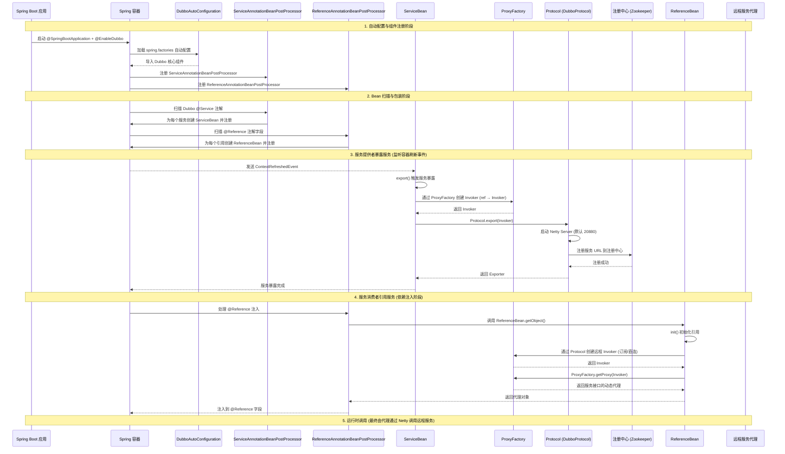
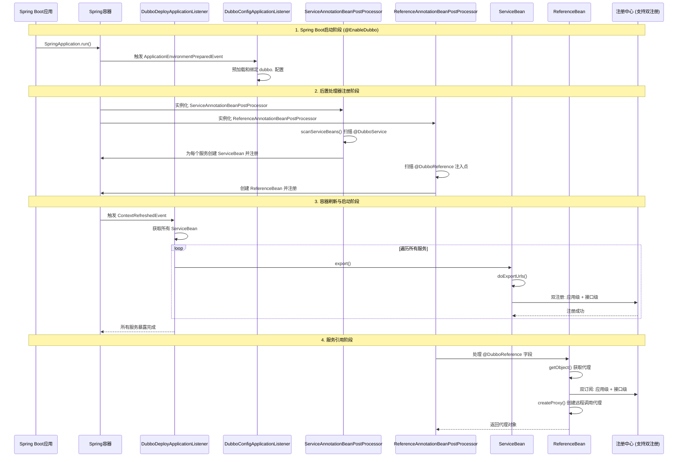

## Introduction

基于 Dubbo 3.0.8 版本的源码，其启动流程的核心，是引入了分层模型（域模型）和独立的发布器（`Deployer`），以此来解耦服务与应用的启动逻辑。总的来说，一个完整流程由 `DubboBootstrap`（传统 API 入口）或 Spring 事件监听器（Spring Boot 集成入口）触发，经由发布器串联起配置加载、模型初始化到最终的服务导出/引用等步骤




## Spring Boot

Dubbo 与 Spring Boot 的集成，核心就是利用 Spring Boot 的自动装配机制，将 Dubbo 的各个核心组件注册到 Spring 容器中，从而启动 RPC 服务。整个过程主要分为自动配置、服务暴露和服务引用三大环节


##### **Dubbo2.7**

以下是 Dubbo 接入 Spring Boot 的完整时序图，包含自动配置、服务暴露和服务引用的核心交互



启动步骤：

1. 启动类@EnableDubbo -> Spring Boot启动
2. 加载spring.factories -> DubboAutoConfiguration（自动配置）
3. DubboComponentScanRegistrar注册ServiceAnnotationBeanPostProcessor和ReferenceAnnotationBeanPostProcessor到Spring容器。
4. Spring刷新容器，后置处理器处理阶段：
   a. ServiceAnnotationBeanPostProcessor处理@Service，为每个服务创建ServiceBean实例并注册。
   b. ReferenceAnnotationBeanPostProcessor处理@Reference，为每个引用创建ReferenceBean并注册（或延迟处理？）
5. 容器刷新完成，发布ContextRefreshedEvent。
6. ServiceBean监听到事件，调用export()。
7. ServiceBean调用ProxyFactory.getInvoker(ref)创建Invoker。
8. 调用Protocol.export(invoker)，启动Netty Server，注册到Registry。
9. 同时，ReferenceAnnotationBeanPostProcessor在依赖注入阶段或SmartInitializingSingleton阶段（实际是在postProcessAfterInitialization或通过ReferenceBean初始化），调用ReferenceBean.getObject()创建代理。
10. ReferenceBean创建Invoker（从Registry订阅或直连），然后ProxyFactory.getProxy(invoker)生成代理，注入到字段


##### **Dubbo3**

在 Spring 或 Spring Boot 环境中，启动过程不再需要手动编码调用 `DubboBootstrap`。框架会通过内置的 `DubboDeployApplicationListener` 监听 Spring 容器的 `ContextRefreshedEvent` 事件来触发启动



 Spring Boot 3.x + Dubbo 3.x 的启动步骤：

1. **配置加载**：`DubboConfigApplicationListener` 监听 `ApplicationEnvironmentPreparedEvent`，读取 `dubbo.*` 配置并绑定到配置对象。
2. **后置处理器注册**：Spring 容器注册 `ServiceAnnotationBeanPostProcessor` 和 `ReferenceAnnotationBeanPostProcessor`。
3. **扫描服务提供者**：`ServiceAnnotationBeanPostProcessor` 扫描 `@DubboService` 注解的类，为每个服务生成 `ServiceBean` 并注册到容器。
4. **暴露服务**：`ContextRefreshedEvent` 触发 `DubboDeployApplicationListener`，调用 `ServiceBean.export()`，执行双注册（同时写入应用级和接口级元数据），并启动 `Triple` 协议服务器。
5. **引用服务**：`ReferenceAnnotationBeanPostProcessor` 处理 `@DubboReference` 注入点，调用 `ReferenceBean.getObject()` 创建代理，通过双订阅从注册中心获取地址列表，生成远程调用代理


## DubboBootstrap

Dubbo3 往云原生的方向走自然要针对云原生应用的应用启动，应用运行，应用发 布等信息做一些建模，这个 DubboBootstrap 就是用来启动 Dubbo 服务的。类似 于 Netty 的 Bootstrap 类型和 ServerBootstrap 启动器


```java
public DubboBootstrap start() {
    // 1. 状态检查与初始化
    if (started.compareAndSet(false, true)) {
        // 2. 核心初始化（配置、模型等）
        initialize(); 
        // 3. 暴露服务
        exportServices();
        // 4. 暴露元数据服务
        exportMetadataService();
        // 5. 注册服务实例（服务发现）
        registerServiceInstance();
        // 6. 引用服务
        referServices();
    }
    return this;
}
```

### initialize

`initialize()` 是整个启动流程的基础，它负责搭建 Dubbo 运行所需的核心骨架，主要完成以下几件事：

1. **初始化配置 (ConfigManager)**：`ConfigManager` 负责从各类配置源（如 API、XML、Properties、配置中心）加载和合并配置信息，形成统一的配置视图。
2. **搭建领域模型 (ApplicationModel)**：Dubbo 3.x 引入了分层模型，`ApplicationModel` 是应用级的根模型，代表着整个 Dubbo 应用，它管理所有模块和全局配置。
3. **创建模块模型 (ModuleModel)**：`ModuleModel` 是模块级模型，通常对应一个 RPC 服务模块，管理着服务发布和引用的具体逻辑。
4. **初始化发布器 (Deployer)**：发布器是 Dubbo 3.x 中用于管理启动和关闭逻辑的核心组件，包括 `ApplicationDeployer` 和 `ModuleDeployer`。
5. **初始化环境组件 (Environment)**：负责系统属性、环境变量等配置的管理。
6. **预热缓存**：包括加载本地缓存的服务列表、启动配置中心监听器等。

```java
@Override
public void initialize() {
    if (initialized) {
        return;
    }
    // Ensure that the initialization is completed when concurrent calls
    synchronized (startLock) {
        if (initialized) {
            return;
        }
        onInitialize();
        // register shutdown hook
        registerShutdownHook();
        startConfigCenter();
        loadApplicationConfigs();
        initModuleDeployers();
        initMetricsReporter();
        initMetricsService();
        // @since 2.7.8
        startMetadataCenter();
        initialized = true;
    }
}
```

## Deploy

无论是哪种入口，最终都会进入框架层，依赖由 **分层模型** 和 **发布器** 协同完成的启动过程

发布器包含

- 应用发布器ApplicationDeployer用于初始化并启动应用程序实例
- 模块发布器ModuleDeployer 模块（服务）的导出/引用服务

两种发布器有各自的接口，他们都继承了抽象的发布器AbstractDeployer 封装了一些公共的操作比如状态切换，状态查询的逻辑

### ApplicationDeployer::start


initialize包含注册中心和元数据中心等初始化 而doStart 是服务的

```java
public Future start() {
    synchronized (startLock) {
        if (isStopping() || isStopped() || isFailed()) {
            throw new IllegalStateException(getIdentifier() + " is stopping or stopped, can not start again");
        }

        try {
            // maybe call start again after add new module, check if any new module
            boolean hasPendingModule = hasPendingModule();

            if (isStarting()) {
                // currently, is starting, maybe both start by module and application
                // if it has new modules, start them
                if (hasPendingModule) {
                    startModules();
                }
                // if it is starting, reuse previous startFuture
                return startFuture;
            }

            // if is started and no new module, just return
            if (isStarted() && !hasPendingModule) {
                return CompletableFuture.completedFuture(false);
            }

            // pending -> starting : first start app
            // started -> starting : re-start app
            onStarting();

            initialize();

            doStart();
        } catch (Throwable e) {
            onFailed(getIdentifier() + " start failure", e);
            throw e;
        }

        return startFuture;
    }
}
```


### doStart

发布服务 先启动内部服务，再启动外部服务 不论是内部服务还是外部服务调用的代码逻辑都是模块发布器 ModuleDeployer 的 start()方法，

```java
private void doStart() {
    startModules();
}

private void startModules() {
    // ensure init and start internal module first
    prepareInternalModule();

    // filter and start pending modules, ignore new module during starting, throw exception of module start
    for (ModuleModel moduleModel : applicationModel.getModuleModels()) {
        if (moduleModel.getDeployer().isPending()) {
        moduleModel.getDeployer().start();
        }
    }
}
```


容错设置帮我们尽可能保障服务稳定调用，但调用也有流量高低之分，流量低的时候可能你发 现不了什么特殊情况，一旦流量比较高，你可能会发现提供方总是有那么几台服务器流量特别 高，另外几个服务器流量特别低。 这是因为 Dubbo 默认使用的是 loadbalance="random" 随机类型的负载均衡策略，为了尽 可能雨露均沾调用到提供方各个节点，你可以继续设置 loadbalance="roundrobin" 来进 行轮询调用


Dubbo 线程池总数默认是固定的，200 个，

采用上下文对象来存储，那异步化的结果也就毋庸置疑存储在上下文对象中。

Dubbo 异步实现原理

首先，还是定义线程池对象，在 Dubbo 中 RpcContext.startAsync 方法意味着异步模式的开 启：

最终是通过 CAS 原子性的方式创建了一个 java.util.concurrent.CompletableFuture 对象，这个对象就存储在当前的上下文 org.apache.dubbo.rpc.RpcContextAttachment 对象中。

asyncContext 富含上下文信息，只需要把这个所谓的 asyncContext 对象传入到子线程 中，然后将 asyncContext 中的上下文信息充分拷贝到子线程中，这样，子线程处理所需要的 任何信息就不会因为开启了异步化处理而缺失

Dubbo 用 asyncContext.write 写入异步结果，通过 write 方法的查看，最终我们的异步化结果 是存入了 java.util.concurrent.CompletableFuture 对象中，这样拦截处只需要调用 java.util.concurrent.CompletableFuture#get(long timeout, TimeUnit unit) 方法就可以很轻松地 拿到异步化结果了。


日志追踪 使用FIlter
隐式传递trace id 到rpc context中

```java
@Override
public Future start() throws IllegalStateException {
    // initialize，maybe deadlock applicationDeployer lock & moduleDeployer lock
    applicationDeployer.initialize();

    return startSync();
}
```


```java
private synchronized Future startSync() throws IllegalStateException {
    if (isStopping() || isStopped() || isFailed()) {
        throw new IllegalStateException(getIdentifier() + " is stopping or stopped, can not start again");
    }

    try {
        if (isStarting() || isStarted()) {
            return startFuture;
        }

        onModuleStarting();

        initialize();

        // export services
        exportServices();

        // prepare application instance
        // exclude internal module to avoid wait itself
        if (moduleModel != moduleModel.getApplicationModel().getInternalModule()) {
            applicationDeployer.prepareInternalModule();
        }

        // refer services
        referServices();

        // if no async export/refer services, just set started
        if (asyncExportingFutures.isEmpty() && asyncReferringFutures.isEmpty()) {
            // publish module started event
            onModuleStarted();

            // register services to registry
            registerServices();

            // check reference config
            checkReferences();

            // complete module start future after application state changed
            completeStartFuture(true);
        } else {
            frameworkExecutorRepository.getSharedExecutor().submit(() -> {
                try {
                    // wait for export finish
                    waitExportFinish();
                    // wait for refer finish
                    waitReferFinish();

                    // publish module started event
                    onModuleStarted();

                    // register services to registry
                    registerServices();

                    // check reference config
                    checkReferences();
                } catch (Throwable e) {
                    onModuleFailed(getIdentifier() + " start failed: " + e, e);
                } finally {
                    // complete module start future after application state changed
                    completeStartFuture(true);
                }
            });
        }

    } catch (Throwable e) {
        onModuleFailed(getIdentifier() + " start failed: " + e, e);
        throw e;
    }

    return startFuture;
}
```


### ModuleDeployer

`initialize()` 完成后，Dubbo 进入**模块启动阶段**，主要逻辑由 `DefaultApplicationDeployer` 推动，并由 `ModuleDeployer` 执行具体的模块生命周期管理。其核心流程如下：

1. **初始化**：`ModuleDeployer` 实例化，并加载该模块的专属配置。
2. **准备**：校验模块配置、解析服务依赖等。
3. **启动**：开始执行模块级别的启动逻辑，进入**阶段三**。
4. **发布**：模块成功启动后，广播 `ModuleDeployedEvent` 事件，通知系统模块就绪

`ModuleDeployer` 的启动，标志着 Dubbo 进入核心业务启动阶段


模块启动后，`start()` 方法会继续调用 `exportServices` 和 `referServices` 来执行具体的服务操作，这也是服务治理的核心环节

## Provider

提供者启动的核心是暴露服务，供消费者调用。该过程主要由 `ServiceConfig` 类完成

`ServiceConfig.export()` 内部会调用 `doExportUrls()`，完成如下关键步骤：

1. **前置准备**：再次进行配置校验、接口赋值等。
2. **生成 URL**：根据 `ApplicationConfig`、`RegistryConfig`、`ProtocolConfig` 等配置构建 URL，并**将本地服务实现封装成 `Invoker`**，它是 Dubbo 中调用处理的核心实体。
3. **协议暴露**：调用 `Protocol.export(invoker)` 方法。Dubbo 会根据 URL 协议（如 `dubbo` 或 `tri`）进行不同的暴露逻辑：
   - 启动对应的网络服务器（如 Netty Server）。
   - 将服务接口、IP、端口等信息注册到配置的注册中心（如 Zookeeper）。
4. **事件分发**：服务暴露完成后，会发送 `ServiceConfigExportedEvent` 事件，用于触发后续操作，如服务映射。

### doExport


Invoked after publish ContextRefreshedEvent in [Spring finishRefresh](/docs/CS/Framework/Spring/IoC.md?id=finishRefresh)

```java
public class DubboBootstrapApplicationListener extends OnceApplicationContextEventListener implements Ordered {

    @Override
    public void onApplicationContextEvent(ApplicationContextEvent event) {
        if (DubboBootstrapStartStopListenerSpringAdapter.applicationContext == null) {
            DubboBootstrapStartStopListenerSpringAdapter.applicationContext = event.getApplicationContext();
        }
        if (event instanceof ContextRefreshedEvent) {
            onContextRefreshedEvent((ContextRefreshedEvent) event);
        } else if (event instanceof ContextClosedEvent) {
            onContextClosedEvent((ContextClosedEvent) event);
        }
    }

    private void onContextRefreshedEvent(ContextRefreshedEvent event) {
        dubboBootstrap.start();
    }
}
```


```java
// ServiceConfig#doExport()
protected synchronized void doExport() {
    if (exported) {
        return;
    }
    exported = true;

    if (StringUtils.isEmpty(path)) {
        path = interfaceName;
    }
    doExportUrls();
    bootstrap.setReady(true);
}
```
#### doExportUrls

```java
private void doExportUrls() {
  ServiceRepository repository = ApplicationModel.getServiceRepository();
  ServiceDescriptor serviceDescriptor = repository.registerService(getInterfaceClass());
  repository.registerProvider(
    getUniqueServiceName(),
    ref,
    serviceDescriptor,
    this,
    serviceMetadata
  );

  List<URL> registryURLs = ConfigValidationUtils.loadRegistries(this, true);

  int protocolConfigNum = protocols.size();
  for (ProtocolConfig protocolConfig : protocols) {
    String pathKey = URL.buildKey(getContextPath(protocolConfig)
                                  .map(p -> p + "/" + path)
                                  .orElse(path), group, version);
    // In case user specified path, register service one more time to map it to path.
    repository.registerService(pathKey, interfaceClass);
    doExportUrlsFor1Protocol(protocolConfig, registryURLs, protocolConfigNum);
  }
}

```

##### doExportUrlsFor1Protocol

export either local or remote, not both

if remote:

1. use [ProxyFactory](/docs/CS/Framework/Dubbo/Start.md?id=proxy) wrap Invoker
2. may export no registries
3. may only injvm
4. add monitor
5. export registry


```java
// ServiceConfig
private void doExportUrlsFor1Protocol(ProtocolConfig protocolConfig, List<URL> registryURLs, int protocolConfigNum) {
    String name = protocolConfig.getName();
    if (StringUtils.isEmpty(name)) {
        name = DUBBO;
    }

    Map<String, String> map = new HashMap<String, String>();
    map.put(SIDE_KEY, PROVIDER_SIDE);

    ServiceConfig.appendRuntimeParameters(map);
    AbstractConfig.appendParameters(map, getMetrics());
    AbstractConfig.appendParameters(map, getApplication());
    AbstractConfig.appendParameters(map, getModule());
    // remove 'default.' prefix for configs from ProviderConfig
    // appendParameters(map, provider, Constants.DEFAULT_KEY);
    AbstractConfig.appendParameters(map, provider);
    AbstractConfig.appendParameters(map, protocolConfig);
    AbstractConfig.appendParameters(map, this);
    MetadataReportConfig metadataReportConfig = getMetadataReportConfig();
    if (metadataReportConfig != null && metadataReportConfig.isValid()) {
        map.putIfAbsent(METADATA_KEY, REMOTE_METADATA_STORAGE_TYPE);
    }
    if (CollectionUtils.isNotEmpty(getMethods())) {
        for (MethodConfig method : getMethods()) {
            AbstractConfig.appendParameters(map, method, method.getName());
            String retryKey = method.getName() + RETRY_SUFFIX;
            if (map.containsKey(retryKey)) {
                String retryValue = map.remove(retryKey);
                if (FALSE_VALUE.equals(retryValue)) {
                    map.put(method.getName() + RETRIES_SUFFIX, ZERO_VALUE);
                }
            }
            List<ArgumentConfig> arguments = method.getArguments();
            if (CollectionUtils.isNotEmpty(arguments)) {
                for (ArgumentConfig argument : arguments) {
                    // convert argument type
                    if (argument.getType() != null && argument.getType().length() > 0) {
                        Method[] methods = interfaceClass.getMethods();
                        // visit all methods
                        if (methods.length > 0) {
                            for (int i = 0; i < methods.length; i++) {
                                String methodName = methods[i].getName();
                                // target the method, and get its signature
                                if (methodName.equals(method.getName())) {
                                    Class<?>[] argtypes = methods[i].getParameterTypes();
                                    // one callback in the method
                                    if (argument.getIndex() != -1) {
                                        if (argtypes[argument.getIndex()].getName().equals(argument.getType())) {
                                            AbstractConfig
                                                    .appendParameters(map, argument, method.getName() + "." + argument.getIndex());
                                        } else {
                                            throw new IllegalArgumentException("");
                                        }
                                    } else {
                                        // multiple callbacks in the method
                                        for (int j = 0; j < argtypes.length; j++) {
                                            Class<?> argclazz = argtypes[j];
                                            if (argclazz.getName().equals(argument.getType())) {
                                                AbstractConfig.appendParameters(map, argument, method.getName() + "." + j);
                                                if (argument.getIndex() != -1 && argument.getIndex() != j) {
                                                    throw new IllegalArgumentException("");
                        }		}		}		}		}		}		}
                    } else if (argument.getIndex() != -1) {
                        AbstractConfig.appendParameters(map, argument, method.getName() + "." + argument.getIndex());
                    } else {throw new IllegalArgumentException("");}
            }		}
        } // end of methods for
    }

    if (ProtocolUtils.isGeneric(generic)) {
        map.put(GENERIC_KEY, generic);
        map.put(METHODS_KEY, ANY_VALUE);
    } else {
        String revision = Version.getVersion(interfaceClass, version);
        if (revision != null && revision.length() > 0) {
            map.put(REVISION_KEY, revision);
        }

        String[] methods = Wrapper.getWrapper(interfaceClass).getMethodNames();
        if (methods.length == 0) {
            map.put(METHODS_KEY, ANY_VALUE);
        } else {
            map.put(METHODS_KEY, StringUtils.join(new HashSet<String>(Arrays.asList(methods)), ","));
        }
    }

    /**
     * Here the token value configured by the provider is used to assign the value to ServiceConfig#token
     */
    if (ConfigUtils.isEmpty(token) && provider != null) {
        token = provider.getToken();
    }

    if (!ConfigUtils.isEmpty(token)) {
        if (ConfigUtils.isDefault(token)) {
            map.put(TOKEN_KEY, UUID.randomUUID().toString());
        } else {
            map.put(TOKEN_KEY, token);
        }
    }
    //init serviceMetadata attachments
    serviceMetadata.getAttachments().putAll(map);

    // export service
    String host = findConfigedHosts(protocolConfig, registryURLs, map);
    Integer port = findConfigedPorts(protocolConfig, name, map, protocolConfigNum);
    URL url = new URL(name, host, port, getContextPath(protocolConfig).map(p -> p + "/" + path).orElse(path), map);

    // You can customize Configurator to append extra parameters
    if (ExtensionLoader.getExtensionLoader(ConfiguratorFactory.class)
            .hasExtension(url.getProtocol())) {
        url = ExtensionLoader.getExtensionLoader(ConfiguratorFactory.class)
                .getExtension(url.getProtocol()).getConfigurator(url).configure(url);
    }

    String scope = url.getParameter(SCOPE_KEY);
    // don't export when none is configured
    if (!SCOPE_NONE.equalsIgnoreCase(scope)) {

        // export to local if the config is not remote (export to remote only when config is remote)
        if (!SCOPE_REMOTE.equalsIgnoreCase(scope)) {
            exportLocal(url);
        }
        // export to remote if the config is not local (export to local only when config is local)
        if (!SCOPE_LOCAL.equalsIgnoreCase(scope)) {
            if (CollectionUtils.isNotEmpty(registryURLs)) {
                for (URL registryURL : registryURLs) {
                    if (SERVICE_REGISTRY_PROTOCOL.equals(registryURL.getProtocol())) {
                        url = url.addParameterIfAbsent(SERVICE_NAME_MAPPING_KEY, "true");
                    }

                    //if protocol is only injvm ,not register
                    if (LOCAL_PROTOCOL.equalsIgnoreCase(url.getProtocol())) {
                        continue;
                    }
                    url = url.addParameterIfAbsent(DYNAMIC_KEY, registryURL.getParameter(DYNAMIC_KEY));
                    URL monitorUrl = ConfigValidationUtils.loadMonitor(this, registryURL);
                    if (monitorUrl != null) {
                        url = url.addParameterAndEncoded(MONITOR_KEY, monitorUrl.toFullString());
                    }

                    // For providers, this is used to enable custom proxy to generate invoker
                    String proxy = url.getParameter(PROXY_KEY);
                    if (StringUtils.isNotEmpty(proxy)) {
                        registryURL = registryURL.addParameter(PROXY_KEY, proxy);
                    }

                    Invoker<?> invoker = PROXY_FACTORY.getInvoker(ref, (Class) interfaceClass,
                            registryURL.addParameterAndEncoded(EXPORT_KEY, url.toFullString()));
                    DelegateProviderMetaDataInvoker wrapperInvoker = new DelegateProviderMetaDataInvoker(invoker, this);

                    Exporter<?> exporter = PROTOCOL.export(wrapperInvoker);
                    exporters.add(exporter);
                }
            } else { // no registries
                Invoker<?> invoker = PROXY_FACTORY.getInvoker(ref, (Class) interfaceClass, url);
                DelegateProviderMetaDataInvoker wrapperInvoker = new DelegateProviderMetaDataInvoker(invoker, this);

                Exporter<?> exporter = PROTOCOL.export(wrapperInvoker);
                exporters.add(exporter);
            }

            MetadataUtils.publishServiceDefinition(url);
        }
    }
    this.urls.add(url);
}
```


if has Registry

### RegistryProtocol

TODO, replace RegistryProtocol completely in the future.

doLocalExport by actual Protocol, such as `DubboProtocol`

closure by `ExporterChangeableWrapper`

```java
// RegistryProtocol#export()
@Override
public <T> Exporter<T> export(final Invoker<T> originInvoker) throws RpcException {
    URL registryUrl = getRegistryUrl(originInvoker);
    // url to export locally
    URL providerUrl = getProviderUrl(originInvoker);

    // Subscribe the override data
    // FIXME When the provider subscribes, it will affect the scene : a certain JVM exposes the service and call
    //  the same service. Because the subscribed is cached key with the name of the service, it causes the
    //  subscription information to cover.
    final URL overrideSubscribeUrl = getSubscribedOverrideUrl(providerUrl);
    final OverrideListener overrideSubscribeListener = new OverrideListener(overrideSubscribeUrl, originInvoker);
    overrideListeners.put(overrideSubscribeUrl, overrideSubscribeListener);

    providerUrl = overrideUrlWithConfig(providerUrl, overrideSubscribeListener);
    // export invoker
    final ExporterChangeableWrapper<T> exporter = doLocalExport(originInvoker, providerUrl);

    // url to registry
    final Registry registry = getRegistry(originInvoker);
    final URL registeredProviderUrl = getUrlToRegistry(providerUrl, registryUrl);

    // decide if we need to delay publish
    boolean register = providerUrl.getParameter(REGISTER_KEY, true);
    if (register) {
        registry.register(registeredProviderUrl);
    }

    // register stated url on provider model
    registerStatedUrl(registryUrl, registeredProviderUrl, register);


    exporter.setRegisterUrl(registeredProviderUrl);
    exporter.setSubscribeUrl(overrideSubscribeUrl);

    // Deprecated! Subscribe to override rules in 2.6.x or before.
    registry.subscribe(overrideSubscribeUrl, overrideSubscribeListener);

    notifyExport(exporter);
    //Ensure that a new exporter instance is returned every time export
    return new DestroyableExporter<>(exporter);
}
```


#### doLocalExport

```java
// RegistryProtocol#doLocalExport()
@SuppressWarnings("unchecked")
private <T> ExporterChangeableWrapper<T> doLocalExport(final Invoker<T> originInvoker, URL providerUrl) {
    String key = getCacheKey(originInvoker);

    return (ExporterChangeableWrapper<T>) bounds.computeIfAbsent(key, s -> {
        Invoker<?> invokerDelegate = new InvokerDelegate<>(originInvoker, providerUrl);
        return new ExporterChangeableWrapper<>((Exporter<T>) protocol.export(invokerDelegate), originInvoker);
    });
}
```


`DubboProtocol#export()` -> openServer ->createServer ->  Exchangers.bind() -> HeaderExchangeServer -> Transporters.bind() -> NettyTransporter -> new NettyServer() -> doOpen -> `ServerBootstrap#bind()`

```java
@Override
public <T> Exporter<T> export(Invoker<T> invoker) throws RpcException {
    URL url = invoker.getUrl();

    // export service.
    String key = serviceKey(url);
    DubboExporter<T> exporter = new DubboExporter<T>(invoker, key, exporterMap);
    exporterMap.addExportMap(key, exporter);

    //export an stub service for dispatching event
    Boolean isStubSupportEvent = url.getParameter(STUB_EVENT_KEY, DEFAULT_STUB_EVENT);
    Boolean isCallbackservice = url.getParameter(IS_CALLBACK_SERVICE, false);
    if (isStubSupportEvent && !isCallbackservice) {
        String stubServiceMethods = url.getParameter(STUB_EVENT_METHODS_KEY);
        if (stubServiceMethods == null || stubServiceMethods.length() == 0) {}
    }

    openServer(url);
    optimizeSerialization(url);

    return exporter;
}
```


### exportLocal

```java
/** ServiceConfig#exportLocal()
 * always export injvm
 */
private void exportLocal(URL url) {
    URL local = URLBuilder.from(url)
            .setProtocol(LOCAL_PROTOCOL)
            .setHost(LOCALHOST_VALUE)
            .setPort(0)
            .build();
    Exporter<?> exporter = PROTOCOL.export(
            PROXY_FACTORY.getInvoker(ref, (Class) interfaceClass, local));
    exporters.add(exporter);
}

// InjvmProtocol#export()
@Override
public <T> Exporter<T> export(Invoker<T> invoker) throws RpcException {
  String serviceKey = invoker.getUrl().getServiceKey();
  InjvmExporter<T> tInjvmExporter = new InjvmExporter<>(invoker, serviceKey, exporterMap);
  exporterMap.addExportMap(serviceKey, tInjvmExporter);
  return tInjvmExporter;
}
```


## Consumer

服务消费者的启动过程相对“懒”，`referServices()` 方法并不立即发起远程连接，而是**为每个 `ReferenceConfig` 创建一个动态代理对象**。这个代理对象直到业务代码第一次调用其方法时，才会触发真正的服务引用和连接建立，这是一种**懒加载机制**，可以有效避免启动耗时过长。


### createProxy

all of scenarios need to create [Proxy](/docs/CS/Framework/Dubbo/Start.md?id=proxy) :

1. shouldJvmRefer
2. one registry
3. multiple registries
4. Cluster

```java
// ReferenceConfig
@SuppressWarnings({"unchecked", "rawtypes", "deprecation"})
private T createProxy(Map<String, String> map) {
    if (shouldJvmRefer(map)) {	// injvm or same JVM
        URL url = new URL(LOCAL_PROTOCOL, LOCALHOST_VALUE, 0, interfaceClass.getName()).addParameters(map);
        invoker = REF_PROTOCOL.refer(interfaceClass, url);
    } else {
        urls.clear();
        if (url != null && url.length() > 0) { // user specified URL, could be peer-to-peer address, or register center's address.
            String[] us = SEMICOLON_SPLIT_PATTERN.split(url);
            if (us != null && us.length > 0) {
                for (String u : us) {
                    URL url = URL.valueOf(u);
                    if (StringUtils.isEmpty(url.getPath())) {
                        url = url.setPath(interfaceName);
                    }
                    if (UrlUtils.isRegistry(url)) {
                        urls.add(url.addParameterAndEncoded(REFER_KEY, StringUtils.toQueryString(map)));
                    } else {
                        urls.add(ClusterUtils.mergeUrl(url, map));
                    }
                }
            }
        } else { // assemble URL from register center's configuration
            // if protocols not injvm checkRegistry
            if (!LOCAL_PROTOCOL.equalsIgnoreCase(getProtocol())) {
                checkRegistry();
                List<URL> us = ConfigValidationUtils.loadRegistries(this, false);
                if (CollectionUtils.isNotEmpty(us)) {
                    for (URL u : us) {
                        URL monitorUrl = ConfigValidationUtils.loadMonitor(this, u);
                        if (monitorUrl != null) {
                            map.put(MONITOR_KEY, URL.encode(monitorUrl.toFullString()));
                        }
                        urls.add(u.addParameterAndEncoded(REFER_KEY, StringUtils.toQueryString(map)));
                    }
                }
                if (urls.isEmpty()) {
                    throw new IllegalStateException("");
                }
            }
        }

        if (urls.size() == 1) {
            invoker = REF_PROTOCOL.refer(interfaceClass, urls.get(0));
        } else {
            List<Invoker<?>> invokers = new ArrayList<Invoker<?>>();
            URL registryURL = null;
            for (URL url : urls) {
                // For multi-registry scenarios, it is not checked whether each referInvoker is available.
                // Because this invoker may become available later.
                invokers.add(REF_PROTOCOL.refer(interfaceClass, url));

                if (UrlUtils.isRegistry(url)) {
                    registryURL = url; // use last registry url
                }
            }

            if (registryURL != null) { // registry url is available
                // for multi-subscription scenario, use 'zone-aware' policy by default
                String cluster = registryURL.getParameter(CLUSTER_KEY, ZoneAwareCluster.NAME);
                // The invoker wrap sequence would be: ZoneAwareClusterInvoker(StaticDirectory) -> FailoverClusterInvoker(RegistryDirectory, routing happens here) -> Invoker
                invoker = Cluster.getCluster(cluster, false).join(new StaticDirectory(registryURL, invokers));
            } else { // not a registry url, must be direct invoke.
                String cluster = CollectionUtils.isNotEmpty(invokers)
                        ?
                        (invokers.get(0).getUrl() != null ? invokers.get(0).getUrl().getParameter(CLUSTER_KEY, ZoneAwareCluster.NAME) :
                                Cluster.DEFAULT)
                        : Cluster.DEFAULT;
                invoker = Cluster.getCluster(cluster).join(new StaticDirectory(invokers));
            }
        }
    }
    URL consumerURL = new URL(CONSUMER_PROTOCOL, map.remove(REGISTER_IP_KEY), 0, map.get(INTERFACE_KEY), map);
    MetadataUtils.publishServiceDefinition(consumerURL);

    // create service proxy
    return (T) PROXY_FACTORY.getProxy(invoker, ProtocolUtils.isGeneric(generic));
}
```


### refer

```java
// RegistryProtocol
@Override
@SuppressWarnings("unchecked")
public <T> Invoker<T> refer(Class<T> type, URL url) throws RpcException {
    url = getRegistryUrl(url);
    Registry registry = getRegistry(url); // getRegistry
    if (RegistryService.class.equals(type)) {
        return proxyFactory.getInvoker((T) registry, type, url);
    }

    // group="a,b" or group="*"
    Map<String, String> qs = StringUtils.parseQueryString(url.getParameterAndDecoded(REFER_KEY));
    String group = qs.get(GROUP_KEY);
    if (group != null && group.length() > 0) {
        if ((COMMA_SPLIT_PATTERN.split(group)).length > 1 || "*".equals(group)) {
            return doRefer(Cluster.getCluster(MergeableCluster.NAME), registry, type, url, qs);
        }
    }

    Cluster cluster = Cluster.getCluster(qs.get(CLUSTER_KEY));
    return doRefer(cluster, registry, type, url, qs);
}


protected <T> Invoker<T> doRefer(Cluster cluster, Registry registry, Class<T> type, URL url, Map<String, String> parameters) {
  URL consumerUrl = new URL(CONSUMER_PROTOCOL, parameters.remove(REGISTER_IP_KEY), 0, type.getName(), parameters);
  ClusterInvoker<T> migrationInvoker = getMigrationInvoker(this, cluster, registry, type, url, consumerUrl);
  return interceptInvoker(migrationInvoker, url, consumerUrl);
}
```


```java
// AbstractProtocol
@Override
public <T> Invoker<T> refer(Class<T> type, URL url) throws RpcException {
  return new AsyncToSyncInvoker<>(protocolBindingRefer(type, url));
}


protected abstract <T> Invoker<T> protocolBindingRefer(Class<T> type, URL url) throws RpcException;

// DubboProtocol
@Override
public <T> Invoker<T> protocolBindingRefer(Class<T> serviceType, URL url) throws RpcException {
  optimizeSerialization(url);

  // create rpc invoker.
  DubboInvoker<T> invoker = new DubboInvoker<T>(serviceType, url, getClients(url), invokers);
  invokers.add(invoker);

  return invoker;
}

private ExchangeClient[] getClients(URL url) {
  // whether to share connection
  int connections = url.getParameter(CONNECTIONS_KEY, 0);
  // if not configured, connection is shared, otherwise, one connection for one service
  if (connections == 0) {
    /*
             * The xml configuration should have a higher priority than properties.
             */
    String shareConnectionsStr = url.getParameter(SHARE_CONNECTIONS_KEY, (String) null);
    connections = Integer.parseInt(StringUtils.isBlank(shareConnectionsStr) ? ConfigUtils.getProperty(SHARE_CONNECTIONS_KEY,
                                                                                                      DEFAULT_SHARE_CONNECTIONS) : shareConnectionsStr);
    return getSharedClient(url, connections).toArray(new ExchangeClient[0]);
  } else {
    ExchangeClient[] clients = new ExchangeClient[connections];
    for (int i = 0; i < clients.length; i++) {
      clients[i] = initClient(url);
    }
    return clients;
  }

}

private ExchangeClient initClient(URL url) {

    // client type setting.
    String str = url.getParameter(CLIENT_KEY, url.getParameter(SERVER_KEY, DEFAULT_REMOTING_CLIENT));

    url = url.addParameter(CODEC_KEY, DubboCodec.NAME);
    // enable heartbeat by default
    url = url.addParameterIfAbsent(HEARTBEAT_KEY, String.valueOf(DEFAULT_HEARTBEAT));

    // BIO is not allowed since it has severe performance issue.
    if (str != null && str.length() > 0 && !ExtensionLoader.getExtensionLoader(Transporter.class).hasExtension(str)) {
        throw new RpcException("Unsupported client type: " + str + "," +
                " supported client type is " +
                StringUtils.join(ExtensionLoader.getExtensionLoader(Transporter.class).getSupportedExtensions(), " "));
    }

    ExchangeClient client;
    try {
        // connection should be lazy
        if (url.getParameter(LAZY_CONNECT_KEY, false)) {
            client = new LazyConnectExchangeClient(url, requestHandler);

        } else {
            client = Exchangers.connect(url, requestHandler);
        }

    } catch (RemotingException e) {
        throw new RpcException("Fail to create remoting client for service(" + url + "): " + e.getMessage(), e);
    }

    return client;
}
```

## ProxyFactory

- javassist
- Cglib

```java
/**
 * ProxyFactory. (API/SPI, Singleton, ThreadSafe)
 */
@SPI("javassist")
public interface ProxyFactory {

    /**
     * create proxy.
     *
     * @param invoker
     * @return proxy
     */
    @Adaptive({PROXY_KEY})
    <T> T getProxy(Invoker<T> invoker) throws RpcException;

    /**
     * create proxy.
     *
     * @param invoker
     * @return proxy
     */
    @Adaptive({PROXY_KEY})
    <T> T getProxy(Invoker<T> invoker, boolean generic) throws RpcException;

    /**
     * create invoker.
     *
     * @param <T>
     * @param proxy
     * @param type
     * @param url
     * @return invoker
     */
    @Adaptive({PROXY_KEY})
    <T> Invoker<T> getInvoker(T proxy, Class<T> type, URL url) throws RpcException;

}
```


## Shutdown

destroy registries and protocols(servers then clients), wait for pending tasks completed.

优雅停机的实现

1. 收到信号 Spring触发容器销毁事件
2. provider 取消服务注册元信息
3. consumer 收到最新地址列表(不包含停机地址)
4. provider 对 Consumer 响应 Dubbo 协议发送readonly报文 通知 Consumer 服务不可用
5. provider 等待已经执行任务执行结束 并拒绝新任务执行

> 2.6.3 后修复了一些停机bug 原因为Spring也同时注册了 shutdown hooks 并发线程执行可能引用已销毁资源导致报错 例如Dubbo发现 Spring已经关闭上下文状态导致访问Spring资源报错

### Shutdown Hooks

The [shutdown hook](/docs/CS/Java/JDK/JVM/destroy.md?id=shutdown-hooks) thread to do the clean up stuff.
This is a **singleton** in order to ensure there is only one shutdown hook registered. 

Because ApplicationShutdownHooks use `java.util.IdentityHashMap` to store the shutdown hooks.

```java
public class DubboShutdownHook extends Thread {
    /**
     * Destroy all the resources, including registries and protocols.
     */
    public void destroyAll() {
        if (!destroyed.compareAndSet(false, true)) {
            return;
        }
        // destroy all the registries
        AbstractRegistryFactory.destroyAll();
        // destroy all the protocols
        ExtensionLoader<Protocol> loader = ExtensionLoader.getExtensionLoader(Protocol.class);
        for (String protocolName : loader.getLoadedExtensions()) {
            try {
                Protocol protocol = loader.getLoadedExtension(protocolName);
                if (protocol != null) {
                    protocol.destroy();
                }
            } catch (Throwable t) {
                logger.warn(t.getMessage(), t);
            }
        }
    }
}
```

### Spring Extension

```java
package org.apache.dubbo.config.spring.extension;
        
public class SpringExtensionFactory implements ExtensionFactory, Lifecycle {
    public static void addApplicationContext(ApplicationContext context) {
        CONTEXTS.add(context);
        if (context instanceof ConfigurableApplicationContext) {
            ((ConfigurableApplicationContext) context).registerShutdownHook();
            // see https://github.com/apache/dubbo/issues/7093
            DubboShutdownHook.getDubboShutdownHook().unregister();
        }
    }
}

public class DubboBootstrapApplicationListener implements ApplicationListener, ApplicationContextAware, Ordered {

    private void onContextClosedEvent(ContextClosedEvent event) {
        if (dubboBootstrap.getTakeoverMode() == BootstrapTakeoverMode.SPRING) {
            // will call dubboBootstrap.stop() through shutdown callback.
            DubboShutdownHook.getDubboShutdownHook().run();
        }
    }
}
```


## Links

- [Dubbo](/docs/CS/Framework/Dubbo/Dubbo.md)