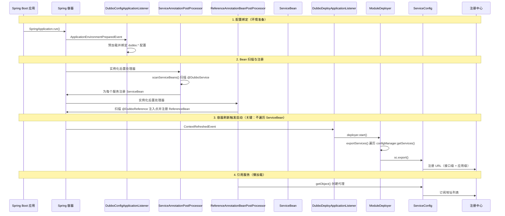

## Introduction

写 Dubbo 启动流程最容易踩的坑，是把 2.7 时代那份「`DubboBootstrap.start()` 里依次做五件事」的流程图当成 3.x 的实现照抄。这份笔记最早的版本自述「基于 Dubbo 3.0.8」，其中 `DubboBootstrap#start()`、`ServiceConfig` 导出链、停机链、Spring 集成四处全是 3.0.x 的旧形态。本文按 **Apache Dubbo 3.3.6** 逐文件核对后重写，核心结论是：

**`DubboBootstrap` 从未被删除，也未被 `ApplicationDeployer` 取代——被取代的只是它的内部实现。** 3.3.6 里这个类仍有 891 行，`initialize()`（`:211`）、`start()`（`:218`）、`start(boolean)`（`:229`）、`asyncStart()`（`:246`）、`stop()`（`:256`）、`takeoverMode`（`:360/365`）全部可用。它内部只持有一个 `ApplicationDeployer` 字段（`:104`），`start()` 全文三行：

```java
// dubbo-config/dubbo-config-api/src/main/java/org/apache/dubbo/config/bootstrap/DubboBootstrap.java:218-221
public DubboBootstrap start() {
    this.start(true);
    return this;
}
```

老笔记里那五步（`exportServices` / `exportMetadataService` / `registerServiceInstance` / `referServices`）**已全部下沉到 `DefaultApplicationDeployer`**。把「类还在」误读成「实现没变」，是这一代笔记最普遍的错误。

第二个坑在 Spring 集成。3.3.6 里 `ServiceBean` **不再监听任何事件**（`ServiceBean.java:42-47` 的 `implements` 列表里没有 `ApplicationListener`），导出服务由 `DubboDeployApplicationListener` 驱动，而它**不遍历 `ServiceBean`、不调 `export()`，只调 `deployer.start()`**（`:160-189`）。「容器刷新 → `ServiceBean` 收到事件 → 调 `export()`」这条 2.7 直觉链路，在 3.3.6 已经不存在。

第三个坑是停机。旧笔记整段 `DubboShutdownHook.destroyAll()`（遍历 `ExtensionLoader.getLoadedExtensions()` 逐个 `protocol.destroy()`）在 3.3.6 里**整段查不到**，public 入口改成 `run()`（`:75-84`）→ 私有 `doDestroy()`（`:86-144`），协议销毁下沉到 `FrameworkModelCleaner`。

> [!NOTE]
> 版本基线：Apache Dubbo **3.3.6**，本文所有代码块与行号均逐文件核对自源码 tag `dubbo-3.3.6`。消费者侧的引用链、Filter、心跳、超时在 [Consumer](/docs/CS/Framework/Dubbo/Consumer.md)，集群接口基座在 [cluster](/docs/CS/Framework/Dubbo/cluster.md)。



## DubboBootstrap

`DubboBootstrap` 是编程式入口，形态上类似 Netty 的 `Bootstrap`——本身不干活，只把请求转给 `ApplicationDeployer`。

```java
// dubbo-config/dubbo-config-api/src/main/java/org/apache/dubbo/config/bootstrap/DubboBootstrap.java:79-104（节选）
public final class DubboBootstrap {
    // ...
    private final ApplicationDeployer applicationDeployer;
```

生命周期方法全部是薄封装：

```java
// dubbo-config/dubbo-config-api/src/main/java/org/apache/dubbo/config/bootstrap/DubboBootstrap.java:211-262（节选）
    public void initialize() {
        applicationDeployer.initialize();
    }

    public DubboBootstrap start() {
        this.start(true);
        return this;
    }

    public DubboBootstrap start(boolean wait) {
        Future future = applicationDeployer.start();
        if (wait) {
            try {
                future.get();
            } catch (Exception e) {
                throw new IllegalStateException("await dubbo application start finish failure", e);
            }
        }
        return this;
    }

    public Future asyncStart() {
        return applicationDeployer.start();
    }

    public DubboBootstrap stop() throws IllegalStateException {
        destroy();
        return this;
    }

    public void destroy() {
        applicationModel.destroy();
    }
```

`start(boolean wait)` 的 `wait` 语义是「是否阻塞等启动完成」，`asyncStart()` 直接返回 `Future` 供调用方自行等待。`stop()` 调 `destroy()`，后者只是 `applicationModel.destroy()`——**销毁的语义边界是 ApplicationModel，不是 Deployer**。

### takeoverMode

`DubboBootstrap` 用 `takeoverMode` 表达「启动/关闭由谁接管」（`BootstrapTakeoverMode`，枚举值 `SPRING, MANUAL, AUTO, SERVLET`，`:29-34`），默认值 `AUTO`（`DubboBootstrap.java:90`）。语义是「env 会在 `ServiceConfig#export()` 完成后自动初始化」。

| 取值 | 含义 |
|---|---|
| `SPRING` | 生命周期由 Spring 容器控制 |
| `MANUAL` | 由用户控制，所有服务 init 完后需自己调 `start()` |
| `AUTO` | `ServiceConfig#export()` 完成时自动初始化 |
| `SERVLET` | 由 Servlet 容器控制 |

`setBootstrap()` 里有一处细节：只有当 takeoverMode **不是** `MANUAL` 时才会被覆写成 `SPRING`（`DubboBootstrapApplicationListener.java:73-75`）。手动接管的应用不会被 Spring 覆盖。

### initialize

`initialize()` 搭的是 Dubbo 运行所需的骨架，`DefaultApplicationDeployer#initialize` 的顺序即依赖顺序：

```java
// dubbo-config/dubbo-config-api/src/main/java/org/apache/dubbo/config/deploy/DefaultApplicationDeployer.java:210-246
    @Override
    public void initialize() {
        if (initialized) {
            return;
        }
        // Ensure that the initialization is completed when concurrent calls
        synchronized (startLock) {
            if (initialized) {
                return;
            }
            onInitialize();

            // register shutdown hook
            registerShutdownHook();

            startConfigCenter();
            loadApplicationConfigs();
            initModuleDeployers();
            initMetricsReporter();
            initMetricsService();

            // @since 3.2.3
            initObservationRegistry();

            // @since 2.7.8
            startMetadataCenter();

            initialized = true;

            if (logger.isInfoEnabled()) {
                logger.info(getIdentifier() + " has been initialized!");
            }
        }
    }
```

逐项说明：

- `onInitialize()`：创建 `ConfigManager`、初始化 `Environment`（系统属性与环境变量）。
- `registerShutdownHook()`：注册 JVM 关闭钩子，见 [Shutdown](#shutdown)。
- `startConfigCenter()`：连接配置中心，启动动态配置监听。
- `loadApplicationConfigs()`：`configManager.loadConfigs()`，从 API / XML / Properties / 配置中心加载并合并成应用级配置。
- `initModuleDeployers()`：先 `applicationModel.getDefaultModule()` 确保默认模块存在，再逐个 `moduleModel.getDeployer().initialize()`。
- `initMetricsReporter()` / `initMetricsService()` / `initObservationRegistry()`：可观测三件套。**`initObservationRegistry()` 是 3.2.3 才有的**（`:234-235`），旧笔记里没有。
- `startMetadataCenter()`：启动元数据中心（2.7.8 引入）。

`initialized` 标志 + `synchronized (startLock)` 的双层检查保证并发调用只初始化一次。

> [!TIP]
> 整个 `initialize()` 里没有一行「加载 SPI 扩展」——扩展加载是 `ExtensionLoader` 的懒加载行为，`initialize()` 只保证 `ConfigManager` / `Environment` / 各 Deployer 就位。把 `initialize()` 理解成「把 Dubbo 启动起来」是最常见的误读，它只到「骨架搭好」为止。

## Deployer 分层

启动的实际执行者是发布器，分两层：

- `ApplicationDeployer`：初始化并启动应用实例（`dubbo-common/src/main/java/org/apache/dubbo/common/deploy/ApplicationDeployer.java`）
- `ModuleDeployer`：导出 / 引用模块内的服务（同目录 `ModuleDeployer.java`）

两者都继承 `Deployer<E extends ScopeModel>`（同目录 `Deployer.java`），该接口提供状态机方法：`isPending()` / `isRunning()` / `isStarted()` / `isStarting()` / `isStopping()` / `isStopped()` / `isCompletion()`，以及 `initialize()` / `start()` / `stop()`。`AbstractDeployer` 封装了状态切换与锁实现。

> [!NOTE]
> `ApplicationDeployer` / `ModuleDeployer` 接口在 **`dubbo-common`** 模块的 `org.apache.dubbo.common.deploy` 包，不在 `dubbo-config`。实现类 `DefaultApplicationDeployer` / `DefaultModuleDeployer` 才在 `dubbo-config-api` 的 `org.apache.dubbo.config.deploy` 包。接口下沉到 dubbo-common 是为了让 `ServiceConfig` 等配置类能在不依赖 dubbo-config 的情况下引用生命周期抽象。

### ApplicationDeployer::start

`start()` 处理状态机的所有分支，核心是 `isCompletion()` 这个条件：

```java
// dubbo-config/dubbo-config-api/src/main/java/org/apache/dubbo/config/deploy/DefaultApplicationDeployer.java:677-716
    @Override
    public Future start() {
        synchronized (startLock) {
            if (isStopping() || isStopped() || isFailed()) {
                throw new IllegalStateException(getIdentifier() + " is stopping or stopped, can not start again");
            }

            try {
                // maybe call start again after add new module, check if any new module
                boolean hasPendingModule = hasPendingModule();

                if (isStarting()) {
                    if (hasPendingModule) {
                        startModules();
                    }
                    // if it is starting, reuse previous startFuture
                    return startFuture;
                }

                // if is started and no new module, just return
                if ((isStarted() || isCompletion()) && !hasPendingModule) {
                    return CompletableFuture.completedFuture(false);
                }

                // pending -> starting : first start app
                // started -> starting : re-start app
                onStarting();

                initialize();
                doStart();
            } catch (Throwable e) {
                onFailed(getIdentifier() + " start failure", e);
                throw e;
            }

            return startFuture;
        }
    }
```

四个分支：

1. **停止中/已停止/已失败** → 直接抛 `IllegalStateException`，不允许重启。
2. **正在启动中** → 若有 pending 模块则先启动它们，然后**复用上次的 `startFuture`**（不重复启动）。
3. **已启动或已完成，且无新模块** → 返回一个**已完成但值为 false** 的 `CompletableFuture`。注意判断条件是 `(isStarted() || isCompletion())`——**旧笔记只写了 `isStarted()`，漏掉 `isCompletion()`**。`isCompletion()` 表示「启动流程已走完但应用还活着」的状态，只判 `isStarted()` 会导致这类重复调用把流程重跑一遍。
4. **其余情况** → `onStarting()` 切状态 → `initialize()` → `doStart()`。

`doStart()` 与 `startModules()`：

```java
// dubbo-config/dubbo-config-api/src/main/java/org/apache/dubbo/config/deploy/DefaultApplicationDeployer.java:734-774
    private void doStart() {
        startModules();

        // prepare application instance
        //        prepareApplicationInstance();

        // Ignore checking new module after start
        //        executorRepository.getSharedExecutor().submit(() -> { ... while (isStarting()) { ... } ... });
    }

    private void startModules() {
        // ensure init and start internal module first
        prepareInternalModule();

        // filter and start pending modules, ignore new module during starting, throw exception of module start
        for (ModuleModel moduleModel : applicationModel.getModuleModels()) {
            if (moduleModel.getDeployer().isPending()) {
                moduleModel.getDeployer().start();
            }
        }
    }
```

`doStart()` 里 `prepareApplicationInstance()` 与「启动后持续检查新模块」的守护任务**都被注释掉了**——只有 `startModules()` 生效。注释里保留了设计意图，说明这两块曾计划启用但当前未启用。读 3.x 源码时看到成片注释代码要留神：它们是历史遗留，不是待完成的 TODO。

`startModules()` 的两个要点：`prepareInternalModule()` 保证 Dubbo 自身用的内部模块先启动（否则内部服务要先依赖应用级服务会死锁）；循环里只启 `isPending()` 的模块，启动期间新增的模块会被忽略。

### ModuleDeployer

`DefaultModuleDeployer` 是真正做导出/引用动作的地方。`start()` 第一件事是反向依赖应用级 deployer：

```java
// dubbo-config/dubbo-config-api/src/main/java/org/apache/dubbo/config/deploy/DefaultModuleDeployer.java:155-160
    @Override
    public Future start() throws IllegalStateException {
        // initialize，maybe deadlock applicationDeployer lock & moduleDeployer lock
        applicationDeployer.initialize();

        return startSync();
    }
```

这行注释点出了锁顺序问题：应用级 deployer 启动时会调 `moduleModel.getDeployer().start()`，若模块级反过来先调应用级 `initialize()`，就可能互相持锁。所以顺序必须是**应用级先 initialize，模块级再 start**。

`startSync()` 的主干：

```java
// dubbo-config/dubbo-config-api/src/main/java/org/apache/dubbo/config/deploy/DefaultModuleDeployer.java:162-203（节选）
    private synchronized Future startSync() throws IllegalStateException {
        if (isStopping() || isStopped() || isFailed()) {
            throw new IllegalStateException(getIdentifier() + " is stopping or stopped, can not start again");
        }

        try {
            if (isStarting() || isStarted() || isCompletion()) {
                return startFuture;
            }

            onModuleStarting();
            initialize();

            // export services
            exportServices();

            // prepare application instance
            // exclude internal module to avoid wait itself
            if (moduleModel != moduleModel.getApplicationModel().getInternalModule()) {
                applicationDeployer.prepareInternalModule();
            }

            // refer services
            referServices();

            // if no async export/refer services, just set started
            if (asyncExportingFutures.isEmpty() && asyncReferringFutures.isEmpty()) {
                onModuleStarted();
                registerServices();
                checkReferences();
                onModuleCompletion();
                completeStartFuture(true);
            } else {
                // 提交到共享线程池，等异步导出/引用完成后收尾
            }
```

与旧笔记的三处差异：守卫条件多了 `isCompletion()`（`:168`）；注册服务前多一步 `onModuleCompletion()`（`:200`）；异步分支存在（`asyncExportingFutures` / `asyncReferringFutures` 非空时提交到 `frameworkExecutorRepository.getSharedExecutor()`）。

`exportServices()` 遍历的是 `configManager.getServices()`，不是 Spring Bean：

```java
// dubbo-config/dubbo-config-api/src/main/java/org/apache/dubbo/config/deploy/DefaultModuleDeployer.java:440-444
    private void exportServices() {
        for (ServiceConfigBase sc : configManager.getServices()) {
            exportServiceInternal(sc);
        }
    }
```

`exportServiceInternal`（`:463`）里，若配置了异步导出则 `CompletableFuture.runAsync` 到 `executorRepository.getServiceExportExecutor()` 并把 future 收进 `asyncExportingFutures`（`:477`）；否则同步调用 `sc.export()` 或 `sc.export(RegisterTypeEnum.AUTO_REGISTER_BY_DEPLOYER)`（`:495`）。

## Spring Boot 集成

Dubbo 与 Spring Boot 的集成靠 Spring 的事件机制触发，共三个关键类：

| 类 | 状态 | 职责 |
|---|---|---|
| `DubboConfigApplicationListener` | 存在 | 绑定 `dubbo.*` 配置 |
| `DubboDeployApplicationListener` | 存在 | 驱动 `deployer.start()` / `moduleModel.destroy()` |
| `DubboBootstrapApplicationListener` | 存在（已 `@Deprecated`） | 兼容 2.7.x 的 takeover 逻辑 |
| `ServiceBean` | 存在，**但不监听事件** | 只是 `ServiceConfig` 的 Spring Bean 载体 |

### 启动时序


```mermaid
sequenceDiagram
    participant App as Spring Boot 应用
    participant SC as Spring 容器
    participant DCAL as DubboConfigApplicationListener
    participant SABPP as ServiceAnnotationPostProcessor
    participant RABPP as ReferenceAnnotationBeanPostProcessor
    participant SB as ServiceBean
    participant DDAL as DubboDeployApplicationListener
    participant MD as ModuleDeployer
    participant SCfg as ServiceConfig
    participant Reg as 注册中心

    Note over App,Reg: 1. 配置绑定（环境准备）
    App->>SC: SpringApplication.run()
    SC->>DCAL: ApplicationEnvironmentPreparedEvent
    DCAL->>DCAL: 预加载并绑定 dubbo.* 配置

    Note over App,Reg: 2. Bean 扫描与注册
    SC->>SABPP: 实例化后置处理器
    SABPP->>SABPP: scanServiceBeans() 扫描 @DubboService
    SABPP->>SC: 为每个服务注册 ServiceBean
    SC->>RABPP: 实例化后置处理器
    RABPP->>SC: 扫描 @DubboReference 注入点并注册 ReferenceBean

    Note over App,Reg: 3. 容器刷新触发启动（关键：不遍历 ServiceBean）
    SC->>DDAL: ContextRefreshedEvent
    DDAL->>MD: deployer.start()
    MD->>MD: exportServices() 遍历 configManager.getServices()
    MD->>SCfg: sc.export()
    SCfg->>Reg: 注册 URL（接口级 + 应用级）

    Note over App,Reg: 4. 引用服务（懒加载）
    RABPP->>SCfg: getObject() 创建代理
    SCfg->>Reg: 订阅地址列表
```

四步流程对应源码：

1. **配置加载**：`DubboConfigApplicationListener` 监听 `ApplicationEnvironmentPreparedEvent`，把 `dubbo.*` 绑定到配置对象。
2. **后置处理器注册**：`ServiceAnnotationPostProcessor` 与 `ReferenceAnnotationBeanPostProcessor` 注册进容器；前者扫描 `@DubboService` 生成 `ServiceBean`（`scanServiceBeans()` 在 `ServiceAnnotationPostProcessor.java:205`），后者处理 `@DubboReference` 注入点。
3. **暴露服务**：`ContextRefreshedEvent` → `DubboDeployApplicationListener` → `deployer.start()` → `DefaultModuleDeployer.exportServices()` → `sc.export()`。
4. **引用服务**：`ReferenceAnnotationBeanPostProcessor` 处理注入点，`ReferenceBean.getObject()` 创建代理。

关键在于第 3 步。`DubboDeployApplicationListener` 的实现：

```java
// dubbo-config/dubbo-config-spring/src/main/java/org/apache/dubbo/config/spring/context/DubboDeployApplicationListener.java:160-189
    private void onContextRefreshedEvent(ContextRefreshedEvent event) {
        ModuleDeployer deployer = moduleModel.getDeployer();
        Assert.notNull(deployer, "Module deployer is null");
        Object singletonMutex = LockUtils.getSingletonMutex(applicationContext);
        // start module
        Future future = null;
        synchronized (singletonMutex) {
            future = deployer.start();
        }

        // if the module does not start in background, await finish
        if (!deployer.isBackground()) {
            try {
                future.get();
            } catch (InterruptedException e) {
                logger.warn(...);
            } catch (Exception e) {
                logger.warn(...);
            }
        }
    }
```

**它不遍历 `ServiceBean`、不调 `ServiceBean.export()`，只调 `deployer.start()`。** 遍历 `configManager.getServices()` 的逻辑在 `DefaultModuleDeployer.exportServices()`（`:440-444`）。旧笔记里「`DDAL` 获取所有 `ServiceBean` → 循环 `SB.export()`」的描述与 3.3.6 不符。

`synchronized (singletonMutex)` 是为了与 Spring 的单例初始化锁互斥，避免 Dubbo 启动期间容器还在建单例。`isBackground()` 为 false 时才 `future.get()` 阻塞等待；后台启动模式下直接返回。

`ServiceBean` 只是一层 Spring 适配：

```java
// dubbo-config/dubbo-config-spring/src/main/java/org/apache/dubbo/config/spring/ServiceBean.java:42-47
public class ServiceBean<T> extends ServiceConfig<T>
        implements InitializingBean,
                DisposableBean,
                ApplicationContextAware,
                BeanNameAware,
                ApplicationEventPublisherAware {
```

五个接口里**没有 `ApplicationListener`**，也没有任何事件订阅能力。旧笔记「`ServiceBean` 监听到事件，调用 `export()`」的链路在 3.3.6 已不存在。

### 兼容路径

`DubboBootstrapApplicationListener` 是 2.7.x 时代的类，3.3.6 里标了 `@Deprecated`（`:47`），但仍在：

```java
// dubbo-config/dubbo-config-spring/src/main/java/org/apache/dubbo/config/spring/context/DubboBootstrapApplicationListener.java:48
public class DubboBootstrapApplicationListener implements ApplicationListener, ApplicationContextAware, Ordered {
```

与旧笔记的三处差异：

| 旧笔记 | 3.3.6 |
|---|---|
| `extends OnceApplicationContextEventListener` | `implements ApplicationListener, ApplicationContextAware, Ordered`，**不再继承** `OnceApplicationContextEventListener`（`:48`） |
| `onContextRefreshedEvent` 只调 `dubboBootstrap.start()` | 有 `takeoverMode == SPRING` 判断，且调 `moduleModel.getDeployer().start()`（`:119-123`） |
| `ContextClosedEvent` 时调 `DubboShutdownHook.getDubboShutdownHook().run()` | 调 `moduleModel.getDeployer().stop()`（`:125-131`），`getDubboShutdownHook()` 那行已被注释掉 |

```java
// dubbo-config/dubbo-config-spring/src/main/java/org/apache/dubbo/config/spring/context/DubboBootstrapApplicationListener.java:119-131
    private void onContextRefreshedEvent(ContextRefreshedEvent event) {
        if (bootstrap.getTakeoverMode() == BootstrapTakeoverMode.SPRING) {
            moduleModel.getDeployer().start();
        }
    }

    private void onContextClosedEvent(ContextClosedEvent event) {
        if (bootstrap.getTakeoverMode() == BootstrapTakeoverMode.SPRING) {
            // will call dubboBootstrap.stop() through shutdown callback.
            // bootstrap.getApplicationModel().getBeanFactory().getBean(DubboShutdownHook.class).run();
            moduleModel.getDeployer().stop();
        }
    }
```

`:128` 那行注释掉的 `getBean(DubboShutdownHook.class).run()` 是旧实现残留——3.3.6 的停机走 `deployer.stop()`。

> [!WARNING]
> `SpringExtensionFactory` 这个类在 3.3.6 **全仓库不存在**（grep 零匹配）。它承接的职责已改由 `ExtensionInjector` 体系提供，SPI 注册在 `dubbo-common/src/main/resources/META-INF/dubbo/internal/org.apache.dubbo.common.extension.ExtensionInjector`：`adaptive` / `spi` / `scopeBean` 三项。老笔记里「`SpringExtensionFactory.addApplicationContext()` 里调 `DubboShutdownHook.getDubboShutdownHook().unregister()`」的代码整段都不存在——而且 `DubboShutdownHook.getDubboShutdownHook()` 这个静态方法在 3.3.6 也**已不存在**，实例需 `new DubboShutdownHook(applicationModel)`（`:62`）再从 bean factory 取。

## Provider

提供者启动的核心是暴露服务，由 `ServiceConfig` 完成。

### export 入口

3.3.6 的 `export` **多了 `RegisterTypeEnum` 参数**（`ServiceConfig.java:311`）：

```java
// dubbo-config/dubbo-config-api/src/main/java/org/apache/dubbo/config/ServiceConfig.java:311-323（节选）
    @Override
    public void export(RegisterTypeEnum registerType) {
        if (this.exported) {
            return;
        }

        if (getScopeModel().isLifeCycleManagedExternally()) {
            // prepare model for reference
            getScopeModel().getDeployer().prepare();
        } else {
            // ensure start module, compatible with old api usage
            getScopeModel().getDeployer().start();
        }
```

这段是 3.x 生命周期语义的体现：如果模型的生命周期由外部（Spring）管理，只 `prepare()`；否则自己 `start()`，兼容老 API 用法。

`RegisterTypeEnum` 四个值（`dubbo-common/.../common/constants/RegisterTypeEnum.java`）：

| 取值 | 语义 |
|---|---|
| `NEVER_REGISTER` | 永不注册，任何命令（如 QoS-online）也不行 |
| `MANUAL_REGISTER` | 可由命令注册，但默认不注册 |
| `AUTO_REGISTER_BY_DEPLOYER` | 由 deployer 在启动后注册（延迟发布，防止服务在全部就绪前被调用） |
| `AUTO_REGISTER` | 导出服务时立即注册 |

`doExport` 是 `export` 的下一层：

```java
// dubbo-config/dubbo-config-api/src/main/java/org/apache/dubbo/config/ServiceConfig.java:552-565
    protected synchronized void doExport(RegisterTypeEnum registerType) {
        if (unexported) {
            throw new IllegalStateException("The service " + interfaceClass.getName() + " has already unexported!");
        }
        if (exported) {
            return;
        }

        if (StringUtils.isEmpty(path)) {
            path = interfaceName;
        }
        doExportUrls(registerType);
        exported();
    }
```

**旧笔记里的 `bootstrap.setReady(true)` 在 3.3.6 已不存在**（`dubbo-config-api` 整模块 grep `setReady` 零匹配）。原来的「标记就绪」语义改由末尾的 `exported()` 承担：

```java
// dubbo-config/dubbo-config-api/src/main/java/org/apache/dubbo/config/ServiceConfig.java:397-416
    protected void exported() {
        exported = true;
        List<URL> exportedURLs = this.getExportedUrls();
        exportedURLs.forEach(url -> {
            if (url.getParameter(SERVICE_NAME_MAPPING_KEY, false)) {
                ServiceNameMapping serviceNameMapping = ServiceNameMapping.getDefaultExtension(getScopeModel());
                ScheduledExecutorService scheduledExecutor = getScopeModel()
                        .getBeanFactory()
                        .getBean(FrameworkExecutorRepository.class)
                        .getSharedScheduledExecutor();
                mapServiceName(url, serviceNameMapping, scheduledExecutor);
            }
        });

        onExported();

        if (hasRegistrySpecified()) {
            getScopeModel().getDeployer().getApplicationDeployer().exportMetadataService();
        }
    }
```

三件事：置 `exported = true`、触发服务名映射（应用级发现时用）、调 `onExported()` 发 `ServiceConfigExportedEvent`，最后在指定了注册中心时调应用级 deployer 导出元数据服务。

### doExportUrls

```java
// dubbo-config/dubbo-config-api/src/main/java/org/apache/dubbo/config/ServiceConfig.java:568-594（节选）
    @SuppressWarnings({"unchecked", "rawtypes"})
    private void doExportUrls(RegisterTypeEnum registerType) {
        ModuleServiceRepository repository = getScopeModel().getServiceRepository();
        ServiceDescriptor serviceDescriptor;
        final boolean serverService = ref instanceof ServerService;
        if (serverService) {
            serviceDescriptor = ((ServerService) ref).getServiceDescriptor();
            // for stub service, path always interface name or IDL package name
            this.path = serviceDescriptor.getInterfaceName();
            repository.registerService(serviceDescriptor);
        } else {
            serviceDescriptor = repository.registerService(getInterfaceClass());
        }
        providerModel = new ProviderModel(
                serviceMetadata.getServiceKey(),
                ref,
                serviceDescriptor,
                getScopeModel(),
                serviceMetadata,
                interfaceClassLoader);

        // Compatible with dependencies on ServiceModel#getServiceConfig(), and will be removed in a future version
        providerModel.setConfig(this);

        providerModel.setDestroyRunner(getDestroyRunner());
        repository.registerProvider(providerModel);
```

与旧笔记的差异：

| 旧笔记 | 3.3.6 |
|---|---|
| `ApplicationModel.getServiceRepository()`（静态） | `getScopeModel().getServiceRepository()`（`:569`） |
| 直接 `repository.registerProvider(getUniqueServiceName(), ref, ...)` 六参 | 先构造 `ProviderModel` 对象（`:582-588`），再 `registerProvider(providerModel)`（`:594`） |
| 无 `ServerService` 分支 | 有 `ref instanceof ServerService` 判断（stub 服务走 `getServiceDescriptor()`） |
| 无 `providerModel` 字段 | 构造后 `setConfig(this)`（兼容旧依赖）、`setDestroyRunner(...)` |

`ServerService` 是 Triple / gRPC stub 服务的标记接口，实现它的 ref 自带 `ServiceDescriptor`，路径取 IDL 包名而非接口名。

循环部分与旧版基本一致：

```java
// dubbo-config/dubbo-config-api/src/main/java/org/apache/dubbo/config/ServiceConfig.java:596-611（节选）
        List<URL> registryURLs = !Boolean.FALSE.equals(isRegister())
                ? ConfigValidationUtils.loadRegistries(this, true)
                : Collections.emptyList();

        for (ProtocolConfig protocolConfig : protocols) {
            String pathKey = URL.buildKey(
                    getContextPath(protocolConfig).map(p -> p + "/" + path).orElse(path), group, version);
            // stub service will use generated service name
            if (!serverService) {
                // In case user specified path, register service one more time to map it to path.
                repository.registerService(pathKey, interfaceClass);
            }
            doExportUrlsFor1Protocol(protocolConfig, registryURLs, registerType);
        }

        providerModel.setServiceUrls(urls);
```

两处小差异：`registryURLs` 增加了 `isRegister()` 前置判断（`:596-598`）；`registerService(pathKey, ...)` 被包在 `if (!serverService)` 里；末尾多了 `providerModel.setServiceUrls(urls)`（`:611`）——**旧笔记没有这一行**，意味着 3.x 会把导出的 URL 回写到 ProviderModel 上，供后续查询与元数据上报使用。

### doExportUrlsFor1Protocol

3.3.6 把这个方法大幅瘦身了。原来 170 多行的「手工拼 map」逻辑被抽成三个方法：

```java
// dubbo-config/dubbo-config-api/src/main/java/org/apache/dubbo/config/ServiceConfig.java:614-633
    private void doExportUrlsFor1Protocol(
            ProtocolConfig protocolConfig, List<URL> registryURLs, RegisterTypeEnum registerType) {
        Map<String, String> map = buildAttributes(protocolConfig);

        // remove null key and null value
        map.keySet().removeIf(key -> StringUtils.isEmpty(key) || StringUtils.isEmpty(map.get(key)));
        // init serviceMetadata attachments
        serviceMetadata.getAttachments().putAll(map);

        URL url = buildUrl(protocolConfig, map);

        processServiceExecutor(url);

        if (CollectionUtils.isEmpty(registryURLs)) {
            registerType = RegisterTypeEnum.NEVER_REGISTER;
        }
        exportUrl(url, registryURLs, registerType);

        initServiceMethodMetrics(url);
    }
```

三个抽出的方法：`buildAttributes(ProtocolConfig)`（`:680`，原来那堆 `appendParameters` 拼 map 的活）、`buildUrl(ProtocolConfig, Map)`（`:821`，算 host/port 后 `new URL` 并 `setScopeModel` + `setServiceModel`）、`initServiceMethodMetrics(URL)`（`:635`，按 methods 逐个发 `MetricsEventBus.publish`）。

**无注册中心时强制改成 `NEVER_REGISTER`**（`:627-629`）——这是 3.x 新增的判断，旧笔记没有。

`exportUrl` 承接 scope 判断与本地/远程分流：

```java
// dubbo-config/dubbo-config-api/src/main/java/org/apache/dubbo/config/ServiceConfig.java:861-887（节选）
    private void exportUrl(URL url, List<URL> registryURLs, RegisterTypeEnum registerType) {
        String scope = url.getParameter(SCOPE_KEY);
        // don't export when none is configured
        if (!SCOPE_NONE.equalsIgnoreCase(scope)) {

            // export to local if the config is not remote
            if (!SCOPE_REMOTE.equalsIgnoreCase(scope)) {
                exportLocal(url);
            }

            // export to remote if the config is not local
            if (!SCOPE_LOCAL.equalsIgnoreCase(scope)) {
                // export to extra protocol is used in remote export
                String extProtocol = url.getParameter(EXT_PROTOCOL, "");
                List<String> protocols = new ArrayList<>();

                if (StringUtils.isNotBlank(extProtocol)) {
                    // export original url
                    url = URLBuilder.from(url)
                            .addParameter(IS_PU_SERVER_KEY, Boolean.TRUE.toString())
                            .build();
                }

                url = exportRemote(url, registryURLs, registerType);
                if (!isGeneric(generic) && !getScopeModel().isInternal()) {
                    MetadataUtils.publishServiceDefinition(url, providerModel.getServiceModel(), getApplicationModel());
                }
```

`scope=none` 两边都不导出；`scope=remote` 只导远程；`scope=local` 只导本地；不配则两边都导。新增的 `EXT_PROTOCOL` 支持「一个服务额外导出到其它协议」，主 URL 打 `IS_PU_SERVER_KEY` 标记，额外协议的 URL 打 `IS_EXTRA` 标记。

远端导出走 `exportRemote`（`:914`），逐个注册中心处理，包括 `SERVICE_NAME_MAPPING_KEY`、`MONITOR_KEY`（3.x 用 `putAttribute` 而非 `addParameterAndEncoded`）、`PROXY_KEY` 透传，以及 injvm 短路：`if (LOCAL_PROTOCOL.equalsIgnoreCase(url.getProtocol())) continue;`。

真正调 `Protocol.export` 的地方：

```java
// dubbo-config/dubbo-config-api/src/main/java/org/apache/dubbo/config/ServiceConfig.java:964-981
    @SuppressWarnings({"unchecked", "rawtypes"})
    private void doExportUrl(URL url, boolean withMetaData, RegisterTypeEnum registerType) {
        if (!url.getParameter(REGISTER_KEY, true)) {
            registerType = RegisterTypeEnum.MANUAL_REGISTER;
        }
        if (registerType == RegisterTypeEnum.NEVER_REGISTER
                || registerType == RegisterTypeEnum.MANUAL_REGISTER
                || registerType == RegisterTypeEnum.AUTO_REGISTER_BY_DEPLOYER) {
            url = url.addParameter(REGISTER_KEY, false);
        }

        Invoker<?> invoker = proxyFactory.getInvoker(ref, (Class) interfaceClass, url);
        if (withMetaData) {
            invoker = new DelegateProviderMetaDataInvoker(invoker, this);
        }
        Exporter<?> exporter = protocolSPI.export(invoker);
        ConcurrentHashMapUtils.computeIfAbsent(exporters, registerType, k -> new CopyOnWriteArrayList<>())
                .add(exporter);
    }
```

三个 `RegisterTypeEnum` 值（`NEVER_REGISTER` / `MANUAL_REGISTER` / `AUTO_REGISTER_BY_DEPLOYER`）都会把 URL 的 `REGISTER_KEY` 置 false，只有 `AUTO_REGISTER` 保留注册行为。另注意 `exporters` 是 `Map<RegisterTypeEnum, List<Exporter>>`，按注册类型分组，取消注册时要按类型取。

### RegistryProtocol

`RegistryProtocol` 是「协议 + 注册」的胶水层——它自己不开 Netty Server，只把导出委托给真正的协议（`DubboProtocol` 等），再补上注册中心的部分。

```java
// dubbo-registry/dubbo-registry-api/src/main/java/org/apache/dubbo/registry/integration/RegistryProtocol.java:272-301
    @Override
    public <T> Exporter<T> export(final Invoker<T> originInvoker) throws RpcException {
        URL registryUrl = getRegistryUrl(originInvoker);
        // url to export locally
        URL providerUrl = getProviderUrl(originInvoker);

        // Subscribe the override data
        final URL overrideSubscribeUrl = getSubscribedOverrideUrl(providerUrl);
        final OverrideListener overrideSubscribeListener = new OverrideListener(overrideSubscribeUrl, originInvoker);
        ConcurrentHashMap<URL, Set<NotifyListener>> overrideListeners =
                getProviderConfigurationListener(overrideSubscribeUrl).getOverrideListeners();
        ConcurrentHashMapUtils.computeIfAbsent(overrideListeners, overrideSubscribeUrl, k -> new ConcurrentHashSet<>())
                .add(overrideSubscribeListener);

        providerUrl = overrideUrlWithConfig(providerUrl, overrideSubscribeListener);
        // export invoker
        final ExporterChangeableWrapper<T> exporter = doLocalExport(originInvoker, providerUrl);

        // url to registry
        final Registry registry = getRegistry(registryUrl);
        final URL registeredProviderUrl = customizeURL(providerUrl, registryUrl);

        // decide if we need to delay publish (provider itself and registry should both need to register)
        boolean register = providerUrl.getParameter(REGISTER_KEY, true) && registryUrl.getParameter(REGISTER_KEY, true);
        if (register) {
            register(registry, registeredProviderUrl);
        }

        // register stated url on provider model
        registerStatedUrl(registryUrl, registeredProviderUrl, register);

        exporter.setRegisterUrl(registeredProviderUrl);
        exporter.setSubscribeUrl(overrideSubscribeUrl);
        exporter.setNotifyListener(overrideSubscribeListener);
        exporter.setRegistered(register);
```

后半段是 2.6.x 兼容代码的退场闸门：

```java
// dubbo-registry/dubbo-registry-api/src/main/java/org/apache/dubbo/registry/integration/RegistryProtocol.java:310-320
        ApplicationModel applicationModel = getApplicationModel(providerUrl.getScopeModel());
        if (applicationModel
                .modelEnvironment()
                .getConfiguration()
                .convert(Boolean.class, ENABLE_26X_CONFIGURATION_LISTEN, true)) {
            if (!registry.isServiceDiscovery()) {
                // Deprecated! Subscribe to override rules in 2.6.x or before.
                registry.subscribe(overrideSubscribeUrl, overrideSubscribeListener);
            }
        }

        notifyExport(exporter);
        // Ensure that a new exporter instance is returned every time export
        return new DestroyableExporter<>(exporter);
    }
```

与旧笔记的六处差异：

| # | 旧笔记 | 3.3.6 |
|---|---|---|
| 1 | `overrideListeners.put(...)` 直接 put | 先取 `getProviderConfigurationListener(url).getOverrideListeners()`，再 `ConcurrentHashMapUtils.computeIfAbsent(...).add(...)`（`:283-286`） |
| 2 | `getRegistry(originInvoker)` | `getRegistry(registryUrl)`，**参数从 Invoker 改成 URL**（`:293`） |
| 3 | `getUrlToRegistry(providerUrl, registryUrl)` | 改名 `customizeURL(providerUrl, registryUrl)`（`:294`） |
| 4 | `providerUrl.getParameter(REGISTER_KEY, true)` | `&& registryUrl.getParameter(REGISTER_KEY, true)`，**新增 registryUrl 侧判断**（`:297`） |
| 5 | 无 | 新增 `exporter.setNotifyListener(...)` 与 `exporter.setRegistered(register)`（`:307-308`） |
| 6 | 直接 `registry.subscribe(...)` | 被 `ENABLE_26X_CONFIGURATION_LISTEN` 开关 + `!registry.isServiceDiscovery()` 双重包裹（`:311-319`） |

第 4 处值得强调：注释写得很清楚「provider itself and registry should both need to register」——**两处都配了不注册才不注册**，任一侧显式关闭都会生效。

第 6 处是 2.6.x 兼容代码的退场开关。应用级发现（`registry.isServiceDiscovery()` 为 true）下已经没有 `override://` 规则的概念，不需要订阅；而 `ENABLE_26X_CONFIGURATION_LISTEN` 允许整体关掉这段历史包袱。

`doLocalExport` 与旧笔记差异不大，但 key 变成了二级：

```java
// dubbo-registry/dubbo-registry-api/src/main/java/org/apache/dubbo/registry/integration/RegistryProtocol.java:349-360
    private <T> ExporterChangeableWrapper<T> doLocalExport(final Invoker<T> originInvoker, URL providerUrl) {
        String providerUrlKey = getProviderUrlKey(originInvoker);
        String registryUrlKey = getRegistryUrlKey(originInvoker);
        Invoker<?> invokerDelegate = new InvokerDelegate<>(originInvoker, providerUrl);

        ReferenceCountExporter<?> exporter =
                exporterFactory.createExporter(providerUrlKey, () -> protocol.export(invokerDelegate));
        return (ExporterChangeableWrapper<T>) ConcurrentHashMapUtils.computeIfAbsent(
                ConcurrentHashMapUtils.computeIfAbsent(bounds, providerUrlKey, k -> new ConcurrentHashMap<>()),
                registryUrlKey,
                s -> new ExporterChangeableWrapper<>((ReferenceCountExporter<T>) exporter, originInvoker));
    }
```

旧笔记用的是单 key `getCacheKey(originInvoker)` + `bounds.computeIfAbsent`。3.3.6 改成 `providerUrlKey` → `registryUrlKey` 两级缓存，并引入 `ReferenceCountExporter` 做引用计数（同一服务被多个注册中心导出时，底层 Exporter 只建一次，按计数决定何时真正 unexport）。`bounds` 的类型也从单层 Map 变成了嵌套 Map。

### DubboProtocol#export

```java
// dubbo-rpc/dubbo-rpc-dubbo/src/main/java/org/apache/dubbo/rpc/protocol/dubbo/DubboProtocol.java:336-364
    @Override
    public <T> Exporter<T> export(Invoker<T> invoker) throws RpcException {
        checkDestroyed();
        URL url = invoker.getUrl();

        // export service.
        String key = serviceKey(url);
        DubboExporter<T> exporter = new DubboExporter<>(invoker, key, exporterMap);

        // export a stub service for dispatching event
        boolean isStubSupportEvent = url.getParameter(STUB_EVENT_KEY, DEFAULT_STUB_EVENT);
        boolean isCallbackService = url.getParameter(IS_CALLBACK_SERVICE, false);
        if (isStubSupportEvent && !isCallbackService) {
            String stubServiceMethods = url.getParameter(STUB_EVENT_METHODS_KEY);
            if (stubServiceMethods == null || stubServiceMethods.length() == 0) {
                if (logger.isWarnEnabled()) {
                    logger.warn(
                            PROTOCOL_UNSUPPORTED, "", "",
                            "consumer [" + url.getParameter(INTERFACE_KEY)
                                    + "], has set stub proxy support event ,but no stub methods founded.");
                }
            }
        }

        openServer(url);
        optimizeSerialization(url);

        return exporter;
    }
```

三处修正：开头新增 `checkDestroyed()`（`:337`）；两个 `Boolean` 包装类型改成原始 `boolean`（`:345-346`）；原来空着的 `if` 体补了 warn 日志（`:349-358`）。

另外注意 `exporterMap.addExportMap(key, exporter)` 被**去掉了**——3.3.6 只构造 `DubboExporter`，注册表维护交给 `ExporterChangeableWrapper` 那一层。`openServer(url)` 才是真正开 Netty Server 的入口，后续链路是 `openServer` → `createServer` → `Exchangers.bind()` → `HeaderExchangeServer` → `Transporters.bind()` → `NettyTransporter` → `NettyServer#doOpen` → `ServerBootstrap#bind()`。

### exportLocal

```java
// dubbo-config/dubbo-config-api/src/main/java/org/apache/dubbo/config/ServiceConfig.java:986-998
    /**
     * always export injvm
     */
    private void exportLocal(URL url) {
        URL local = URLBuilder.from(url)
                .setProtocol(LOCAL_PROTOCOL)
                .setHost(LOCALHOST_VALUE)
                .setPort(0)
                .build();
        local = local.setScopeModel(getScopeModel()).setServiceModel(providerModel);
        local = local.addParameter(EXPORTER_LISTENER_KEY, LOCAL_PROTOCOL);
        doExportUrl(local, false, RegisterTypeEnum.AUTO_REGISTER);
        logger.info("[SERVICE_PUBLISH][METADATA_REGISTER] Export dubbo service " + interfaceClass.getName()
                + " to local registry url : " + local);
    }
```

与旧笔记的差异：不再直接 `PROTOCOL.export(PROXY_FACTORY.getInvoker(...))`，而是**统一走 `doExportUrl(local, false, RegisterTypeEnum.AUTO_REGISTER)`**；新增 `setScopeModel(...).setServiceModel(providerModel)` 挂上模型上下文，以及 `addParameter(EXPORTER_LISTENER_KEY, LOCAL_PROTOCOL)` 标记来源。第二个参数 `withMetaData=false` 表示不包 `DelegateProviderMetaDataInvoker`。

对应地，`InjvmProtocol#export` 也被简化成一行：

```java
// dubbo-rpc/dubbo-rpc-injvm/src/main/java/org/apache/dubbo/rpc/protocol/injvm/InjvmProtocol.java:74-76
    @Override
    public <T> Exporter<T> export(Invoker<T> invoker) throws RpcException {
        return new InjvmExporter<>(invoker, invoker.getUrl().getServiceKey(), exporterMap);
    }
```

**`exporterMap.addExportMap(serviceKey, tInjvmExporter)` 不再需要手动调用**——`InjvmExporter` 构造器内部已经处理了注册。旧笔记里那两行手动注册是多余的。

## Consumer

消费者侧「懒」：`referServices()` 不立即建连，而是先为每个 `ReferenceConfig` 创建动态代理，代理要等业务代码第一次调方法时才触发真正的引用与连接建立。

`ReferenceConfig#createProxy` 在 3.3.6 已重构为「四步分工」，旧笔记那段把四种场景塞在一个方法里的写法是 3.0.x 形态：

```java
// dubbo-config/dubbo-config-api/src/main/java/org/apache/dubbo/config/ReferenceConfig.java:490-523
    @SuppressWarnings({"unchecked"})
    private T createProxy(Map<String, String> referenceParameters) {
        urls.clear();

        meshModeHandleUrl(referenceParameters);

        if (StringUtils.isNotEmpty(url)) {
            // user specified URL, could be peer-to-peer address, or register center's address.
            parseUrl(referenceParameters);
        } else {
            // if protocols not in jvm checkRegistry
            aggregateUrlFromRegistry(referenceParameters);
        }
        createInvoker();

        if (logger.isInfoEnabled()) {
            logger.info("Referred dubbo service: [" + referenceParameters.get(INTERFACE_KEY) + "]."
                    + (ProtocolUtils.isGeneric(referenceParameters.get(GENERIC_KEY))
                            ? " it's GenericService reference"
                            : " it's not GenericService reference"));
        }

        URL consumerUrl = new ServiceConfigURL(
                CONSUMER_PROTOCOL,
                referenceParameters.get(REGISTER_IP_KEY),
                0,
                referenceParameters.get(INTERFACE_KEY),
                referenceParameters);
        consumerUrl = consumerUrl.setScopeModel(getScopeModel());
        consumerUrl = consumerUrl.setServiceModel(consumerModel);
        MetadataUtils.publishServiceDefinition(consumerUrl, consumerModel.getServiceModel(), getApplicationModel());

        // create service proxy
        return (T) proxyFactory.getProxy(invoker, ProtocolUtils.isGeneric(generic));
    }
```

与旧笔记的差异：

| 旧笔记 | 3.3.6 |
|---|---|
| `shouldJvmRefer(map)` 在最外层，整个方法被 if/else 包住 | **不在这里**。`meshModeHandleUrl` → `parseUrl` / `aggregateUrlFromRegistry` → `createInvoker()` 三步 |
| `SEMICOLON_SPLIT_PATTERN.split(url)` 在主流程 | 移入 `parseUrl()`（`:605`） |
| `REF_PROTOCOL.refer(...)` | `protocolSPI.refer(...)` |
| `Cluster.getCluster(cluster, false)` | `Cluster.getCluster(getScopeModel(), cluster, false)`，**有 ScopeModel 首参** |
| `new StaticDirectory(invokers)` | `new StaticDirectory(curUrl, invokers)`，**多 URL 参数** |
| `new URL(CONSUMER_PROTOCOL, ...)` | `new ServiceConfigURL(...)`，并 `setScopeModel` + `setServiceModel` |
| `MetadataUtils.publishServiceDefinition(consumerURL)` 单参 | **三参** `(consumerUrl, consumerModel.getServiceModel(), getApplicationModel())` |

`shouldJvmRefer`（`:854`）仍然存在，但被挪进了配置校验链与 `InjvmProtocol.isInjvmRefer` 的判断里，不再是 `createProxy` 的外层分支。

```java
// dubbo-config/dubbo-config-api/src/main/java/org/apache/dubbo/config/ReferenceConfig.java:669-712（节选）
    private void createInvoker() {
        if (urls.size() == 1) {
            URL curUrl = urls.get(0);
            invoker = protocolSPI.refer(interfaceClass, curUrl);
            // registry url, mesh-enable and unloadClusterRelated is true, not need Cluster.
            if (!UrlUtils.isRegistry(curUrl) && !curUrl.getParameter(UNLOAD_CLUSTER_RELATED, false)) {
                List<Invoker<?>> invokers = new ArrayList<>();
                invokers.add(invoker);
                invoker = Cluster.getCluster(getScopeModel(), Cluster.DEFAULT)
                        .join(new StaticDirectory(curUrl, invokers), true);
            }
        } else {
            List<Invoker<?>> invokers = new ArrayList<>();
            URL registryUrl = null;
            for (URL url : urls) {
                // For multi-registry scenarios, it is not checked whether each referInvoker is available.
                invokers.add(protocolSPI.refer(interfaceClass, url));

                if (UrlUtils.isRegistry(url)) {
                    registryUrl = url; // use last registry url
                }
            }

            if (registryUrl != null) {
                // for multi-subscription scenario, use 'zone-aware' policy by default
                String cluster = registryUrl.getParameter(CLUSTER_KEY, ZoneAwareCluster.NAME);
                invoker = Cluster.getCluster(registryUrl.getScopeModel(), cluster, false)
                        .join(new StaticDirectory(registryUrl, invokers), false);
            } else {
                if (CollectionUtils.isEmpty(invokers)) {
                    throw new IllegalArgumentException("invokers == null");
                }
                URL curUrl = invokers.get(0).getUrl();
                String cluster = curUrl.getParameter(CLUSTER_KEY, Cluster.DEFAULT);
                invoker =
                        Cluster.getCluster(getScopeModel(), cluster).join(new StaticDirectory(curUrl, invokers), true);
            }
        }
    }
```

三个分支的 `join` 第二个参数分别是 `true` / `false` / `true`，`getCluster` 的 ScopeModel 首参来源也不同（`getScopeModel()` vs `registryUrl.getScopeModel()`）。单 URL 场景加了 `UNLOAD_CLUSTER_RELATED` 判断——mesh 场景下不需要 Cluster 包装。多注册中心场景保留 `zone-aware` 默认策略。

> [!NOTE]
> 这段与 [Consumer](/docs/CS/Framework/Dubbo/Consumer.md) 中的代码块一致。消费者侧的引用链、迁移（`MigrationInvoker`）、Filter、心跳与超时处理都在那一篇，本文不重复。

### refer 与 protocolBindingRefer

`RegistryProtocol#refer` 分派到 `doRefer`：

```java
// dubbo-registry/dubbo-registry-api/src/main/java/org/apache/dubbo/registry/integration/RegistryProtocol.java:578-596
    protected <T> Invoker<T> doRefer(
            Cluster cluster, Registry registry, Class<T> type, URL url, Map<String, String> parameters) {
        Map<String, Object> consumerAttribute = new HashMap<>(url.getAttributes());
        consumerAttribute.remove(REFER_KEY);
        String p = isEmpty(parameters.get(PROTOCOL_KEY)) ? CONSUMER : parameters.get(PROTOCOL_KEY);
        URL consumerUrl = new ServiceConfigURL(
                p,
                null,
                null,
                parameters.get(REGISTER_IP_KEY),
                0,
                getPath(parameters, type),
                parameters,
                consumerAttribute);
        url = url.putAttribute(CONSUMER_URL_KEY, consumerUrl);
        ClusterInvoker<T> migrationInvoker = getMigrationInvoker(this, cluster, registry, type, url, consumerUrl);
        return interceptInvoker(migrationInvoker, url, consumerUrl);
    }
```

与旧笔记相比：URL 类型从 `new URL(...)` 换成 `new ServiceConfigURL(...)`；新增 `consumerAttribute`（把 URL attributes 拷出来并移除 `REFER_KEY`）；`getPath` 对泛化调用走 `parameters.get(INTERFACE_KEY)` 而非 `type.getName()`。返回类型是 `ClusterInvoker<T>` 而非 `Invoker<T>`，因为要经 `interceptInvoker` 交给 `RegistryProtocolListener` 处理（迁移监听器就在这里挂上）。

协议侧的 refer 链路（3.3.6 与旧笔记差异明显）：

```java
// dubbo-rpc/dubbo-rpc-api/src/main/java/org/apache/dubbo/rpc/protocol/AbstractProtocol.java:135-141
    @Override
    public <T> Invoker<T> refer(Class<T> type, URL url) throws RpcException {
        return protocolBindingRefer(type, url);
    }

    @Deprecated
    protected abstract <T> Invoker<T> protocolBindingRefer(Class<T> type, URL url) throws RpcException;
```

**旧笔记的 `new AsyncToSyncInvoker<>(protocolBindingRefer(type, url))` 在 3.3.6 里不成立**——`AsyncToSyncInvoker` 这个类在整棵源码树中已不存在（`find` 零结果），同步阻塞的职责上移到 `AbstractInvoker#waitForResultIfSync`（`AbstractInvoker.java:280-293`），在 `InvokeMode.SYNC` 时调 `asyncResult.get(timeout, TimeUnit.MILLISECONDS)`。

`DubboProtocol` 侧：

```java
// dubbo-rpc/dubbo-rpc-dubbo/src/main/java/org/apache/dubbo/rpc/protocol/dubbo/DubboProtocol.java:434-450
    @Override
    public <T> Invoker<T> refer(Class<T> type, URL url) throws RpcException {
        checkDestroyed();
        return protocolBindingRefer(type, url);
    }

    @Override
    public <T> Invoker<T> protocolBindingRefer(Class<T> serviceType, URL url) throws RpcException {
        checkDestroyed();
        optimizeSerialization(url);

        // create rpc invoker.
        DubboInvoker<T> invoker = new DubboInvoker<>(serviceType, url, getClients(url), invokers);
        invokers.add(invoker);

        return invoker;
    }
```

`getClients` 的返回类型从 `ExchangeClient[]` 变成了 `ClientsProvider`（`:452`），共享连接时返回 `getSharedClient(url, connections)`，独占连接时返回 `new ExclusiveClientsProvider(clients)`（`:469-471`）。这是一个延迟建连的抽象——不必在 `refer` 阶段就把所有 `ExchangeClient` 建出来。`initClient`（`:541`）里也多了两步：把 `InstanceAddressURL` 替换成 `ServiceConfigURL`（`:565-572`，因为前者会把参数写进 ServiceInstance 导致多服务共享参数），以及用 `UrlUtils.getHeartbeat(url)` 取心跳间隔。

## ProxyFactory

`ProxyFactory` 负责两个方向的转换：服务引用 `getInvoker`（本地对象 → Invoker）与服务暴露 `getProxy`（Invoker → 本地代理对象）。

```java
// dubbo-rpc/dubbo-rpc-api/src/main/java/org/apache/dubbo/rpc/ProxyFactory.java:29-48（节选）
@SPI(value = "javassist", scope = FRAMEWORK)
public interface ProxyFactory {

    @Adaptive({PROXY_KEY})
    <T> T getProxy(Invoker<T> invoker) throws RpcException;

    @Adaptive({PROXY_KEY})
    <T> T getProxy(Invoker<T> invoker, boolean generic) throws RpcException;

    @Adaptive({PROXY_KEY})
    <T> Invoker<T> getInvoker(T proxy, Class<T> type, URL url) throws RpcException;
}
```

`@SPI` 注解多了 `scope = FRAMEWORK`（`:29`），三个方法的签名与旧笔记一致。

内置扩展只有 **4 个**（`dubbo-rpc/dubbo-rpc-api/src/main/resources/META-INF/dubbo/internal/org.apache.dubbo.rpc.ProxyFactory`）：

```properties
# dubbo-rpc/dubbo-rpc-api/src/main/resources/META-INF/dubbo/internal/org.apache.dubbo.rpc.ProxyFactory
stub=org.apache.dubbo.rpc.proxy.wrapper.StubProxyFactoryWrapper
jdk=org.apache.dubbo.rpc.proxy.jdk.JdkProxyFactory
javassist=org.apache.dubbo.rpc.proxy.javassist.JavassistProxyFactory
nativestub=org.apache.dubbo.rpc.stub.StubProxyFactory
```

> [!WARNING]
> **`Cglib` 在 3.3.6 中完全不存在**（全仓库无 Cglib 代理实现）。旧笔记「javassist / Cglib」两项的写法在 3.x 已失效，实际是 `stub`（包装器）/ `jdk` / `javassist` / `nativestub` 四项。

类名未变但实现方式变了：`JavassistProxyFactory` 现在是「javassist 主路径 + JDK 兜底」的混合策略。

```java
// dubbo-rpc/dubbo-rpc-api/src/main/java/org/apache/dubbo/rpc/proxy/javassist/JavassistProxyFactory.java:40-53（节选）
    private final JdkProxyFactory jdkProxyFactory = new JdkProxyFactory();

    @Override
    @SuppressWarnings("unchecked")
    public <T> T getProxy(Invoker<T> invoker, Class<?>[] interfaces) {
        try {
            return (T) Proxy.getProxy(interfaces).newInstance(new InvokerInvocationHandler(invoker));
        } catch (Throwable fromJavassist) {
            // try fall back to JDK proxy factory
            try {
                T proxy = jdkProxyFactory.getProxy(invoker, interfaces);
                logger.error(
                        PROXY_FAILED, "", "",
                        "Failed to generate proxy by Javassist failed. Fallback to use JDK proxy success. "
                                + "Interfaces: " + Arrays.toString(interfaces),
                        fromJavassist);
                return proxy;
            } catch (Throwable fromJdk) {
```

主路径仍用 `org.apache.dubbo.common.bytecode.Proxy`（Javassist 字节码生成），但捕获所有异常后回落到 `JdkProxyFactory`。`getInvoker` 同理（`:80-95`）。这解决了 Javassist 在 JDK 新版本上生成字节码失败导致服务无法启动的问题。

## Shutdown

停机的目标是：销毁注册中心与协议（先服务端后客户端）、等在途任务跑完、并让消费者及时知道「这个 Provider 要走了」。

优雅停机的完整链路：

1. 收到信号（Spring 触发容器销毁事件，或 JVM shutdown hook）
2. Provider 取消服务注册元信息
3. Consumer 收到最新地址列表（不含停机地址）
4. Provider 对 Consumer 发送 **readonly 报文**通知服务不可用
5. Provider 等待已执行任务结束，并拒绝新任务

第 4 步的报文发送与接收两侧都能在源码里定位。发送侧：

```java
// dubbo-config/dubbo-config-api/src/main/java/org/apache/dubbo/config/DubboShutdownHook.java:86-95
    private void doDestroy() {
        int timeout = ConfigurationUtils.getServerShutdownTimeout(applicationModel);
        ConfigurationUtils.setExpectedShutdownTime(System.currentTimeMillis() + timeout);

        // send readonly for shutdown hook
        List<GracefulShutdown> gracefulShutdowns =
                GracefulShutdown.getGracefulShutdowns(applicationModel.getFrameworkModel());
        for (GracefulShutdown gracefulShutdown : gracefulShutdowns) {
            gracefulShutdown.readonly();
        }
```

接收侧在 `HeaderExchangeHandler.handlerEvent`（`HeaderExchangeHandler.java:77-84`）：收到 `READONLY_EVENT` 就给 channel 打 `CHANNEL_ATTRIBUTE_READONLY_KEY = TRUE` 标记；`DubboInvoker.isAvailable()` 检查这个标记（`DubboInvoker.java:169`），有标记则视为不可用。

> [!NOTE]
> 「Provider 发 readonly 报文通知 Consumer 服务不可用」这个描述在 3.3.6 **依然成立**，对应 `DubboShutdownHook.java:90-95` 与 `GracefulShutdown.java:24-30`。旧笔记这一点是对的，保留。

`GracefulShutdown` 接口本身只有三个成员（`dubbo-rpc/dubbo-rpc-api/.../rpc/GracefulShutdown.java:23-31`）：`readonly()` / `writeable()` / 静态 `getGracefulShutdowns(FrameworkModel)`。实现类 `DubboGracefulShutdown` 遍历 `dubboProtocol.getServers()` 的所有 channel 逐个发事件请求，发送失败只 warn 不抛异常——停机路径上的异常会掩盖真正的错误。

### Shutdown Hook

```java
// dubbo-config/dubbo-config-api/src/main/java/org/apache/dubbo/config/DubboShutdownHook.java:41-84（节选）
public class DubboShutdownHook extends Thread {
    // ...
    private final AtomicBoolean destroyed = new AtomicBoolean(false);

    /**
     * Whether ignore listen on shutdown hook?
     */
    private final boolean ignoreListenShutdownHook;

    public DubboShutdownHook(ApplicationModel applicationModel) {
        super("DubboShutdownHook");
        this.applicationModel = applicationModel;
        Assert.notNull(this.applicationModel, "ApplicationModel is null");
        ignoreListenShutdownHook = Boolean.parseBoolean(
                ConfigurationUtils.getProperty(applicationModel, CommonConstants.IGNORE_LISTEN_SHUTDOWN_HOOK));
        // ...
    }

    @Override
    public void run() {
        if (!ignoreListenShutdownHook && destroyed.compareAndSet(false, true)) {
            if (logger.isInfoEnabled()) {
                logger.info("Run shutdown hook now.");
            }
            doDestroy();
        }
    }
```

`doDestroy()`（`:86-144`）的完整顺序：

1. 读 `server.shutdown.timeout` 并调 `ConfigurationUtils.setExpectedShutdownTime(...)`——设置预期停机时间，供优雅停机等待逻辑使用。
2. 遍历 `GracefulShutdown` 发 readonly（见上）。
3. 检查是否有模块绑定在 Spring 上（`module.isLifeCycleManagedExternally()`）。若有，则**轮询等待 Spring 侧销毁完成**，最多等 `timeout` 毫秒，每 10ms 检查一次。
4. 若仍未销毁，`applicationModel.destroy()`。

第 3 步的等待是为了「避免 Dubbo 与 Spring 的停机冲突」——源码注释写得很直白。这解决了 2.6.3 之后的一批停机 bug：Spring 也注册了 shutdown hook，两边并发执行可能引用已销毁的资源。

> [!WARNING]
> **旧笔记的 `DubboShutdownHook.destroyAll()` 在 3.3.6 中已不存在**，包括里面「`AbstractRegistryFactory.destroyAll()` + 遍历 `ExtensionLoader.getLoadedExtensions()` 逐个 `protocol.destroy()`」的整段逻辑。3.3.6 改为 `run()` → `doDestroy()`，最终只调 `applicationModel.destroy()`（`:142`），协议销毁下沉到 `FrameworkModelCleaner`。源码里甚至留了注释解释为什么不直接销毁协议（`DefaultApplicationDeployer.java:1150-1156`）：协议是框架级的，一个框架下多个应用共用，销毁协议要等所有应用都停。
>
> 同理，**`DubboShutdownHook.getDubboShutdownHook()` 静态方法也不存在**（3.3.6 需 `new DubboShutdownHook(applicationModel)`）。唯一残留引用是 `DubboBootstrapApplicationListener.java:128` 那行**已被注释掉**的代码。

停机回调机制也在 3.x 挪了位置。`ShutdownHookCallback` 现在在 `dubbo-common/src/main/java/org/apache/dubbo/common/lang/`（不在 `common/hooks/`），触发点在 `DefaultApplicationDeployer#executeShutdownCallbacks`（`:1168-1172`）——它从 bean factory 取 `ShutdownHookCallbacks` bean 并调 `callback()`，这个调用发生在 `postDestroy()` 里（`:1148`），即注册中心与元数据中心销毁之后、状态置为 stopped 之前。

### 应用级 stop

`DefaultApplicationDeployer#stop()` 只有一行（`:1081-1083`）：`applicationModel.destroy()`。真正做事的是 `preDestroy()`：

```java
// dubbo-config/dubbo-config-api/src/main/java/org/apache/dubbo/config/deploy/DefaultApplicationDeployer.java:1086-1104
    @Override
    public void preDestroy() {
        synchronized (destroyLock) {
            if (isStopping() || isStopped()) {
                return;
            }
            onStopping();

            offline();
            unregisterServiceInstance();
            unexportMetricsService();
            unRegisterShutdownHook();
            if (asyncMetadataFuture != null) {
                asyncMetadataFuture.cancel(true);
            }
        }
    }
```

`offline()` 遍历各模块的 `ModuleServiceRepository`，把每个 `ProviderModel` 的 `RegisterStatedURL` 逐个反注册（对应停机链路第 2 步「取消服务注册元信息」），并把 `statedUrl.setRegistered(false)`。

> [!TIP]
> `ready` / `readonly` 这两个状态在 3.3.6 里**已不属于 Dubbo 生命周期状态机**。`Deployer` 接口的状态方法是 `isPending` / `isRunning` / `isStarted` / `isCompletion` / `isStarting` / `isStopping` / `isStopped`，没有 `isReady`。旧笔记 `doExport()` 里的 `bootstrap.setReady(true)` 在 3.3.6 的 `dubbo-config-api` 里 grep 零匹配。想在启动完成后做点什么，位置是 `exported()` 里的 `onExported()`，或者挂 `DeployListener`。

## 陷阱清单

| # | 说法 | 3.3.6 事实 |
|---|---|---|
| 1 | `DubboBootstrap` 已被 `ApplicationDeployer` 取代 | **类未被删除也未被取代**，891 行完整存在。被取代的只是内部实现——所有方法委派给 `applicationDeployer` 字段（`DubboBootstrap.java:104`） |
| 2 | `DubboBootstrap.start()` 里有五步 | 只有三行，全委派（`:218-221`）。五步已下沉到 `DefaultApplicationDeployer` |
| 3 | `start()` 同步跑完 | `start(true)` 阻塞 `future.get()`，`asyncStart()` 返回 `Future`；两者都只是 `applicationDeployer.start()` 的包装 |
| 4 | `DefaultApplicationDeployer.initialize()` 缺可观测步骤 | 3.2.3 起有 `initObservationRegistry()`（`:234-235`） |
| 5 | `ApplicationDeployer.start()` 用 `isStarted()` 判重 | 条件是 `(isStarted() \|\| isCompletion()) && !hasPendingModule`（`:698`），漏掉 `isCompletion()` 会重跑流程 |
| 6 | `ServiceConfig.export()` 无参 | 签名是 `export(RegisterTypeEnum)`（`:311`） |
| 7 | `doExport()` 末尾调 `bootstrap.setReady(true)` | **已不存在**（`dubbo-config-api` 整模块零匹配），改调 `exported()`（`:397-416`） |
| 8 | `doExportUrls()` 直接 `registerProvider` 六参 | 先构造 `ProviderModel`（`:582-588`）再 `registerProvider(providerModel)`（`:594`）；且用 `getScopeModel().getServiceRepository()` 而非静态 `ApplicationModel.getServiceRepository()` |
| 9 | `doExportUrls()` 没有 `setServiceUrls` | 末尾有 `providerModel.setServiceUrls(urls)`（`:611`） |
| 10 | `RegistryProtocol#export` 用 `getUrlToRegistry` | 改名 `customizeURL`（`RegistryProtocol.java:294`） |
| 11 | `getRegistry(originInvoker)` | `getRegistry(registryUrl)`，参数从 Invoker 改成 URL（`:293`） |
| 12 | `register` 只看 `providerUrl` | `providerUrl && registryUrl` 两侧都判断（`:297`） |
| 13 | `overrideListeners.put(...)` | 改为 `getProviderConfigurationListener(...).getOverrideListeners()` + `computeIfAbsent().add()`（`:283-286`） |
| 14 | 无条件 `registry.subscribe(...)` | 被 `ENABLE_26X_CONFIGURATION_LISTEN` 开关 + `!registry.isServiceDiscovery()` 双重包裹（`:311-319`） |
| 15 | `RegistryProtocol` 有 `destroyAll` 式协议遍历销毁 | 没有；协议销毁下沉到 `FrameworkModelCleaner` |
| 16 | `ServiceConfig#exportLocal` 直接 `PROTOCOL.export(...)` | 统一走 `doExportUrl(local, false, RegisterTypeEnum.AUTO_REGISTER)`，并 `setScopeModel` + `setServiceModel` + `EXPORTER_LISTENER_KEY`（`:986-998`） |
| 17 | `InjvmProtocol#export` 需手动 `addExportMap` | 只 `return new InjvmExporter<>(...)` 一行（`InjvmProtocol.java:74-76`） |
| 18 | `DubboProtocol#export` 用 `Boolean` 包装类型 | 原始 `boolean`；开头有 `checkDestroyed()`；空 if 体补了 warn（`DubboProtocol.java:337/345-346/349-358`） |
| 19 | `ReferenceConfig#createProxy` 里 `shouldJvmRefer` 在最外层 | 已拆为 `meshModeHandleUrl` → `parseUrl` / `aggregateUrlFromRegistry` → `createInvoker`；`createInvoker` 用 `protocolSPI` + 带 ScopeModel 的 `Cluster.getCluster` + 带 URL 的 `StaticDirectory`（`ReferenceConfig.java:490-523/669-712`） |
| 20 | `AbstractProtocol.refer` 包 `AsyncToSyncInvoker` | **`AsyncToSyncInvoker` 类在 3.3.6 不存在**；同步阻塞上移到 `AbstractInvoker#waitForResultIfSync`（`:280-293`） |
| 21 | `MetadataUtils.publishServiceDefinition(consumerURL)` 单参 | 三参 `(consumerUrl, consumerModel.getServiceModel(), getApplicationModel())` |
| 22 | ProxyFactory 有 Cglib 实现 | **Cglib 在 3.3.6 完全不存在**；SPI 只有 `stub` / `jdk` / `javassist` / `nativestub` 四项 |
| 23 | `ProxyFactory` 的 `@SPI("javassist")` | `@SPI(value = "javassist", scope = FRAMEWORK)`（`ProxyFactory.java:29`） |
| 24 | JavassistProxyFactory 只有一条路径 | 主路径 + JDK 兜底（`:50` 起 `catch` 后 `jdkProxyFactory.getProxy`） |
| 25 | `DubboShutdownHook.destroyAll()` 遍历销毁 protocol | **该方法不存在**。3.3.6 是 `run()` → `doDestroy()` → `applicationModel.destroy()`（`:75-84/86-144`） |
| 26 | `DubboShutdownHook.getDubboShutdownHook()` 静态方法 | **不存在**，需 `new DubboShutdownHook(applicationModel)`（`:62`）；唯一残留引用是被注释掉的（`DubboBootstrapApplicationListener.java:128`） |
| 27 | 存在 `SpringExtensionFactory` 类 | **3.3.6 全仓库不存在**，职责改由 `ExtensionInjector`（`adaptive` / `spi` / `scopeBean`）提供 |
| 28 | `ServiceBean` 监听 `ContextRefreshedEvent` 调 `export()` | **不监听任何事件**（`ServiceBean.java:42-47` 无 `ApplicationListener`） |
| 29 | `DubboDeployApplicationListener` 遍历 `ServiceBean` 调 `export()` | **不遍历**，只调 `deployer.start()`（`:160-189`）；遍历 `configManager.getServices()` 的逻辑在 `DefaultModuleDeployer.exportServices()`（`:440-444`） |
| 30 | `DubboBootstrapApplicationListener extends OnceApplicationContextEventListener` | `implements ApplicationListener, ApplicationContextAware, Ordered`，不再继承（`:48`），且整个类已 `@Deprecated`（`:47`） |
| 31 | `ContextClosedEvent` 调 `DubboShutdownHook.getDubboShutdownHook().run()` | 调 `moduleModel.getDeployer().stop()`（`:125-131`） |
| 32 | `ShutdownHookCallback` 在 `common/hooks/` | 在 `dubbo-common/.../common/lang/`，触发点是 `DefaultApplicationDeployer#executeShutdownCallbacks`（`:1168-1172`） |

## Links

- [Dubbo](/docs/CS/Framework/Dubbo/Dubbo.md)
- [Consumer](/docs/CS/Framework/Dubbo/Consumer.md)
- [config](/docs/CS/Framework/Dubbo/config.md)
- [cluster](/docs/CS/Framework/Dubbo/cluster.md)
- [Router](/docs/CS/Framework/Dubbo/Router.md)
- [Protocol](/docs/CS/Framework/Dubbo/Protocol.md)

## References

- [Apache Dubbo 源码 tag dubbo-3.3.6](https://github.com/apache/dubbo/tree/dubbo-3.3.6)
- [DubboBootstrap.java](https://github.com/apache/dubbo/blob/dubbo-3.3.6/dubbo-config/dubbo-config-api/src/main/java/org/apache/dubbo/config/bootstrap/DubboBootstrap.java)
- [DefaultApplicationDeployer.java](https://github.com/apache/dubbo/blob/dubbo-3.3.6/dubbo-config/dubbo-config-api/src/main/java/org/apache/dubbo/config/deploy/DefaultApplicationDeployer.java)
- [ServiceConfig.java](https://github.com/apache/dubbo/blob/dubbo-3.3.6/dubbo-config/dubbo-config-api/src/main/java/org/apache/dubbo/config/ServiceConfig.java)
- [RegistryProtocol.java](https://github.com/apache/dubbo/blob/dubbo-3.3.6/dubbo-registry/dubbo-registry-api/src/main/java/org/apache/dubbo/registry/integration/RegistryProtocol.java)
- [DubboShutdownHook.java](https://github.com/apache/dubbo/blob/dubbo-3.3.6/dubbo-config/dubbo-config-api/src/main/java/org/apache/dubbo/config/DubboShutdownHook.java)
