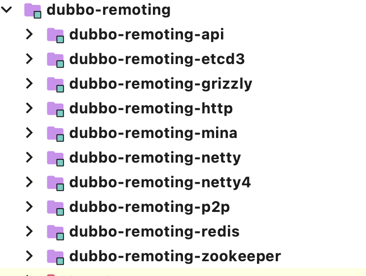

## Introduction





```java
/**
 * Endpoint. (API/SPI, Prototype, ThreadSafe)
 *
 *
 * @see org.apache.dubbo.remoting.Channel
 * @see org.apache.dubbo.remoting.Client
 * @see RemotingServer
 */
public interface Endpoint {

    /**
     * get url.
     *
     * @return url
     */
    URL getUrl();

    /**
     * get channel handler.
     *
     * @return channel handler
     */
    ChannelHandler getChannelHandler();

    /**
     * get local address.
     *
     * @return local address.
     */
    InetSocketAddress getLocalAddress();

    /**
     * send message.
     *
     * @param message
     * @throws RemotingException
     */
    void send(Object message) throws RemotingException;

    /**
     * send message.
     *
     * @param message
     * @param sent    already sent to socket?
     */
    void send(Object message, boolean sent) throws RemotingException;

    /**
     * close the channel.
     */
    void close();

    /**
     * Graceful close the channel.
     */
    void close(int timeout);

    void startClose();

    /**
     * is closed.
     *
     * @return closed
     */
    boolean isClosed();

}
```


#### Channel

```java
/**
 * Channel. (API/SPI, Prototype, ThreadSafe)
 *
 * @see org.apache.dubbo.remoting.Client
 * @see RemotingServer#getChannels()
 * @see RemotingServer#getChannel(InetSocketAddress)
 */
public interface Channel extends Endpoint {

    /**
     * get remote address.
     *
     * @return remote address.
     */
    InetSocketAddress getRemoteAddress();

    /**
     * is connected.
     *
     * @return connected
     */
    boolean isConnected();

    /**
     * has attribute.
     *
     * @param key key.
     * @return has or has not.
     */
    boolean hasAttribute(String key);

    /**
     * get attribute.
     *
     * @param key key.
     * @return value.
     */
    Object getAttribute(String key);

    /**
     * set attribute.
     *
     * @param key   key.
     * @param value value.
     */
    void setAttribute(String key, Object value);

    /**
     * remove attribute.
     *
     * @param key key.
     */
    void removeAttribute(String key);
}
```


```java
public interface Resetable {
  
    void reset(URL url);

}
```

```java
/**
 * Indicate whether the implementation (for both server and client) has the ability to sense and handle idle connection.
 * If the server has the ability to handle idle connection, it should close the connection when it happens, and if
 * the client has the ability to handle idle connection, it should send the heartbeat to the server.
 */
public interface IdleSensible {
    /**
     * Whether the implementation can sense and handle the idle connection. By default it's false, the implementation
     * relies on dedicated timer to take care of idle connection.
     *
     * @return whether has the ability to handle idle connection
     */
    default boolean canHandleIdle() {
        return false;
    }
}
```


```java
/**
 * Remoting Client. (API/SPI, Prototype, ThreadSafe)
 * <p>
 * <a href="http://en.wikipedia.org/wiki/Client%E2%80%93server_model">Client/Server</a>
 *
 * @see org.apache.dubbo.remoting.Transporter#connect(org.apache.dubbo.common.URL, ChannelHandler)
 */
public interface Client extends Endpoint, Channel, Resetable, IdleSensible {

    /**
     * reconnect.
     */
    void reconnect() throws RemotingException;

    @Deprecated
    void reset(org.apache.dubbo.common.Parameters parameters);

}
```


```java
/**
 * Remoting Server. (API/SPI, Prototype, ThreadSafe)
 * <p>
 * <a href="http://en.wikipedia.org/wiki/Client%E2%80%93server_model">Client/Server</a>
 *
 * @see org.apache.dubbo.remoting.Transporter#bind(org.apache.dubbo.common.URL, ChannelHandler)
 */
public interface RemotingServer extends Endpoint, Resetable, IdleSensible {

    /**
     * is bound.
     *
     * @return bound
     */
    boolean isBound();

    /**
     * get channels.
     *
     * @return channels
     */
    Collection<Channel> getChannels();

    /**
     * get channel.
     *
     * @param remoteAddress
     * @return channel
     */
    Channel getChannel(InetSocketAddress remoteAddress);

    @Deprecated
    void reset(Parameters parameters);

}
```


#### Dispatcher

```java
/**
 * ChannelHandlerWrapper (SPI, Singleton, ThreadSafe)
 */
@SPI(AllDispatcher.NAME)
public interface Dispatcher {

    /**
     * dispatch the message to threadpool.
     *
     * @param handler
     * @param url
     * @return channel handler
     */
    @Adaptive({Constants.DISPATCHER_KEY, "dispather", "channel.handler"})
    // The last two parameters are reserved for compatibility with the old configuration
    ChannelHandler dispatch(ChannelHandler handler, URL url);

}
```


#### ChannelHandler


```java
/**
 * ChannelHandler. (API, Prototype, ThreadSafe)
 *
 * @see org.apache.dubbo.remoting.Transporter#bind(org.apache.dubbo.common.URL, ChannelHandler)
 * @see org.apache.dubbo.remoting.Transporter#connect(org.apache.dubbo.common.URL, ChannelHandler)
 */
@SPI
public interface ChannelHandler {

    /**
     * on channel connected.
     *
     * @param channel channel.
     */
    void connected(Channel channel) throws RemotingException;

    /**
     * on channel disconnected.
     *
     * @param channel channel.
     */
    void disconnected(Channel channel) throws RemotingException;

    /**
     * on message sent.
     *
     * @param channel channel.
     * @param message message.
     */
    void sent(Channel channel, Object message) throws RemotingException;

    /**
     * on message received.
     *
     * @param channel channel.
     * @param message message.
     */
    void received(Channel channel, Object message) throws RemotingException;

    /**
     * on exception caught.
     *
     * @param channel   channel.
     * @param exception exception.
     */
    void caught(Channel channel, Throwable exception) throws RemotingException;

}
```


#### Transporter

```java
/**
 * Transporter. (SPI, Singleton, ThreadSafe)
 * <p>
 * <a href="http://en.wikipedia.org/wiki/Transport_Layer">Transport Layer</a>
 * <a href="http://en.wikipedia.org/wiki/Client%E2%80%93server_model">Client/Server</a>
 *
 * @see org.apache.dubbo.remoting.Transporters
 */
@SPI("netty")
public interface Transporter {

    /**
     * Bind a server.
     *
     * @param url     server url
     * @param handler
     * @return server
     * @throws RemotingException
     * @see org.apache.dubbo.remoting.Transporters#bind(URL, ChannelHandler...)
     */
    @Adaptive({Constants.SERVER_KEY, Constants.TRANSPORTER_KEY})
    RemotingServer bind(URL url, ChannelHandler handler) throws RemotingException;

    /**
     * Connect to a server.
     *
     * @param url     server url
     * @param handler
     * @return client
     * @throws RemotingException
     * @see org.apache.dubbo.remoting.Transporters#connect(URL, ChannelHandler...)
     */
    @Adaptive({Constants.CLIENT_KEY, Constants.TRANSPORTER_KEY})
    Client connect(URL url, ChannelHandler handler) throws RemotingException;

}
```


#### Transporters

```java
/**
 * Transporter facade. (API, Static, ThreadSafe)
 */
public class Transporters {

    static {
        // check duplicate jar package
        Version.checkDuplicate(Transporters.class);
        Version.checkDuplicate(RemotingException.class);
    }

    private Transporters() {
    }

    public static RemotingServer bind(String url, ChannelHandler... handler) throws RemotingException {
        return bind(URL.valueOf(url), handler);
    }

    public static RemotingServer bind(URL url, ChannelHandler... handlers) throws RemotingException {
        if (url == null) {
            throw new IllegalArgumentException("url == null");
        }
        if (handlers == null || handlers.length == 0) {
            throw new IllegalArgumentException("handlers == null");
        }
        ChannelHandler handler;
        if (handlers.length == 1) {
            handler = handlers[0];
        } else {
            handler = new ChannelHandlerDispatcher(handlers);
        }
        return getTransporter().bind(url, handler);
    }

    public static Client connect(String url, ChannelHandler... handler) throws RemotingException {
        return connect(URL.valueOf(url), handler);
    }

    public static Client connect(URL url, ChannelHandler... handlers) throws RemotingException {
        if (url == null) {
            throw new IllegalArgumentException("url == null");
        }
        ChannelHandler handler;
        if (handlers == null || handlers.length == 0) {
            handler = new ChannelHandlerAdapter();
        } else if (handlers.length == 1) {
            handler = handlers[0];
        } else {
            handler = new ChannelHandlerDispatcher(handlers);
        }
        return getTransporter().connect(url, handler);
    }

    public static Transporter getTransporter() {
        return ExtensionLoader.getExtensionLoader(Transporter.class).getAdaptiveExtension();
    }

}
```


#### Code2

```java
@SPI
public interface Codec2 {

    @Adaptive({Constants.CODEC_KEY})
    void encode(Channel channel, ChannelBuffer buffer, Object message) throws IOException;

    @Adaptive({Constants.CODEC_KEY})
    Object decode(Channel channel, ChannelBuffer buffer) throws IOException;


    enum DecodeResult {
        NEED_MORE_INPUT, SKIP_SOME_INPUT
    }

}
```


## Links

- [Dubbo](/docs/CS/Framework/Dubbo/Dubbo.md)