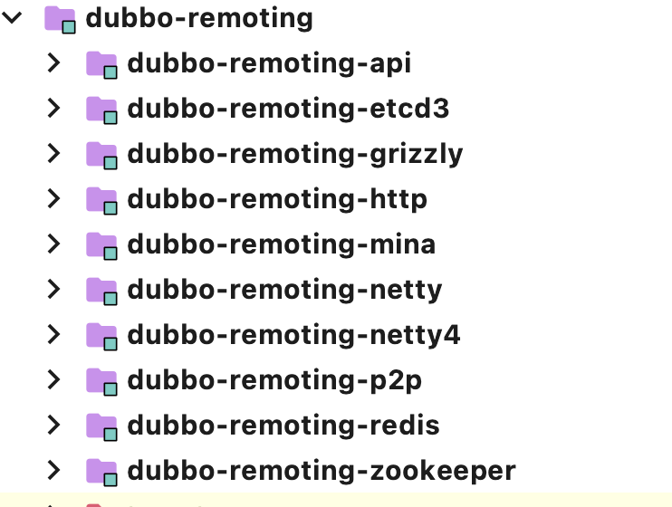

## Introduction

Dubbo 的 remoting 层要回答的问题很具体：**一条字节流怎么变成一次可以 `invoke` 的 Java 调用，以及这条连接idle 了由谁负责掐断。** 这一层只有 4 个核心接口（`Endpoint` / `Channel` / `Client` / `RemotingServer`）加4 个扩展点（`Dispatcher` / `ChannelHandler` / `Transporter` / `Codec2`），但流传的直觉几乎全是错的：

1. **「`Transporter` 有netty / netty4 / mina 三种实现」**——3.3.6 里**没有 `mina`**，整个 `dubbo-remoting/` 下连mina 的影子都没有。实际扩展名是 `netty` 与 `netty4`（**两者指向同一个 `NettyTransporter` 类**），加上独立 netty 模块里的 `netty3`。
2. **「`Transporters.getTransporter()` 是个静态无参方法」**——3.3.6 已改成 **`getTransporter(URL url)`**，内部从 URL 上取 `FrameworkModel` 再拿 `ExtensionLoader`。这是 3.x ScopeModel 化的直接体现，静态方法里不再有全局单例入口。
3. **「`Transporters` 里有 `Version.checkDuplicate` 静态块做 jar 冲突检测」**——该 static 块**已被删除**，构造器只剩 `private Transporters() {}` 一行。
4. **「所有 remoting 扩展点都是应用级SPI」**——`Dispatcher` / `ChannelHandler` / `Transporter` / `Codec2` 四者的 `@SPI` 在3.3.6 里全部带 `scope = ExtensionScope.FRAMEWORK`，即框架级SPI，只在 `FrameworkModel` 上加载一次。

本文版本基线：Apache Dubbo **3.3.6**，所有代码块均逐文件核对自源码 tag `dubbo-3.3.6`。其中 `Endpoint` / `Channel` / `Client` / `RemotingServer` 四个接口节已按 3.3.6 **逐字核对，与源码完全一致**（`Endpoint.java:31-88`、`Channel.java:28-74`、`Client.java:28-37`、`RemotingServer.java:31-57`）。传输层的具体落地实参见 [Transporter](/docs/CS/Framework/Dubbo/Transporter.md)，Filter 侧的拦截见 [Filter](/docs/CS/Framework/Dubbo/Filter.md)。

> [!NOTE]
>
> 本篇是 Dubbo 子树里源码保真度最高的一篇，四个核心接口原样保留。需修正的只有4 处 `@SPI` 的 `scope`、`Transporters` 的两处签名、一个标题笔误，以及补上 `HeaderExchange*` 的包路径与 3.3.6 新增的三个 remoting 模块指路。




> [!TIP]
>
> 接下来的 `Endpoint` / `Channel` / `Client` / `RemotingServer` 四节、以及 `Resetable` / `IdleSensible` 两个辅助接口，**已按 3.3.6 逐字核对，与源码完全一致**，未作任何改动。

```java
/**
 * Endpoint. (API/SPI, Prototype, ThreadSafe)
 *
 *
 * @see org.apache.dubbo.remoting.Channel
 * @see org.apache.dubbo.remoting.Client
 * @see RemotingServer
 */
public interface Endpoint {

    /**
     * get url.
     *
     * @return url
     */
    URL getUrl();

    /**
     * get channel handler.
     *
     * @return channel handler
     */
    ChannelHandler getChannelHandler();

    /**
     * get local address.
     *
     * @return local address.
     */
    InetSocketAddress getLocalAddress();

    /**
     * send message.
     *
     * @param message
     * @throws RemotingException
     */
    void send(Object message) throws RemotingException;

    /**
     * send message.
     *
     * @param message
     * @param sent    already sent to socket?
     */
    void send(Object message, boolean sent) throws RemotingException;

    /**
     * close the channel.
     */
    void close();

    /**
     * Graceful close the channel.
     */
    void close(int timeout);

    void startClose();

    /**
     * is closed.
     *
     * @return closed
     */
    boolean isClosed();

}
```


#### Channel

```java
/**
 * Channel. (API/SPI, Prototype, ThreadSafe)
 *
 * @see org.apache.dubbo.remoting.Client
 * @see RemotingServer#getChannels()
 * @see RemotingServer#getChannel(InetSocketAddress)
 */
public interface Channel extends Endpoint {

    /**
     * get remote address.
     *
     * @return remote address.
     */
    InetSocketAddress getRemoteAddress();

    /**
     * is connected.
     *
     * @return connected
     */
    boolean isConnected();

    /**
     * has attribute.
     *
     * @param key key.
     * @return has or has not.
     */
    boolean hasAttribute(String key);

    /**
     * get attribute.
     *
     * @param key key.
     * @return value.
     */
    Object getAttribute(String key);

    /**
     * set attribute.
     *
     * @param key   key.
     * @param value value.
     */
    void setAttribute(String key, Object value);

    /**
     * remove attribute.
     *
     * @param key key.
     */
    void removeAttribute(String key);
}
```


```java
public interface Resetable {
  
    void reset(URL url);

}
```

```java
/**
 * Indicate whether the implementation (for both server and client) has the ability to sense and handle idle connection.
 * If the server has the ability to handle idle connection, it should close the connection when it happens, and if
 * the client has the ability to handle idle connection, it should send the heartbeat to the server.
 */
public interface IdleSensible {
    /**
     * Whether the implementation can sense and handle the idle connection. By default it's false, the implementation
     * relies on dedicated timer to take care of idle connection.
     *
     * @return whether has the ability to handle idle connection
     */
    default boolean canHandleIdle() {
        return false;
    }
}
```


```java
/**
 * Remoting Client. (API/SPI, Prototype, ThreadSafe)
 * <p>
 * <a href="http://en.wikipedia.org/wiki/Client%E2%80%93server_model">Client/Server</a>
 *
 * @see org.apache.dubbo.remoting.Transporter#connect(org.apache.dubbo.common.URL, ChannelHandler)
 */
public interface Client extends Endpoint, Channel, Resetable, IdleSensible {

    /**
     * reconnect.
     */
    void reconnect() throws RemotingException;

    @Deprecated
    void reset(org.apache.dubbo.common.Parameters parameters);

}
```


```java
/**
 * Remoting Server. (API/SPI, Prototype, ThreadSafe)
 * <p>
 * <a href="http://en.wikipedia.org/wiki/Client%E2%80%93server_model">Client/Server</a>
 *
 * @see org.apache.dubbo.remoting.Transporter#bind(org.apache.dubbo.common.URL, ChannelHandler)
 */
public interface RemotingServer extends Endpoint, Resetable, IdleSensible {

    /**
     * is bound.
     *
     * @return bound
     */
    boolean isBound();

    /**
     * get channels.
     *
     * @return channels
     */
    Collection<Channel> getChannels();

    /**
     * get channel.
     *
     * @param remoteAddress
     * @return channel
     */
    Channel getChannel(InetSocketAddress remoteAddress);

    @Deprecated
    void reset(Parameters parameters);

}
```


#### Dispatcher

```java
/**
 * ChannelHandlerWrapper (SPI, Singleton, ThreadSafe)
 */
@SPI(value = AllDispatcher.NAME, scope = ExtensionScope.FRAMEWORK)
public interface Dispatcher {

    /**
     * dispatch the message to threadpool.
     *
     * @param handler
     * @param url
     * @return channel handler
     */
    @Adaptive({Constants.DISPATCHER_KEY, "dispather", "channel.handler"})
    // The last two parameters are reserved for compatibility with the old configuration
    ChannelHandler dispatch(ChannelHandler handler, URL url);

}
```


#### ChannelHandler


```java
/**
 * ChannelHandler. (API, Prototype, ThreadSafe)
 *
 * @see org.apache.dubbo.remoting.Transporter#bind(org.apache.dubbo.common.URL, ChannelHandler)
 * @see org.apache.dubbo.remoting.Transporter#connect(org.apache.dubbo.common.URL, ChannelHandler)
 */
@SPI(scope = ExtensionScope.FRAMEWORK)
public interface ChannelHandler {

    /**
     * on channel connected.
     *
     * @param channel channel.
     */
    void connected(Channel channel) throws RemotingException;

    /**
     * on channel disconnected.
     *
     * @param channel channel.
     */
    void disconnected(Channel channel) throws RemotingException;

    /**
     * on message sent.
     *
     * @param channel channel.
     * @param message message.
     */
    void sent(Channel channel, Object message) throws RemotingException;

    /**
     * on message received.
     *
     * @param channel channel.
     * @param message message.
     */
    void received(Channel channel, Object message) throws RemotingException;

    /**
     * on exception caught.
     *
     * @param channel   channel.
     * @param exception exception.
     */
    void caught(Channel channel, Throwable exception) throws RemotingException;

}
```


#### Transporter

```java
/**
 * Transporter. (SPI, Singleton, ThreadSafe)
 * <p>
 * <a href="http://en.wikipedia.org/wiki/Transport_Layer">Transport Layer</a>
 * <a href="http://en.wikipedia.org/wiki/Client%E2%80%93server_model">Client/Server</a>
 *
 * @see org.apache.dubbo.remoting.Transporters
 */
@SPI(value = "netty", scope = ExtensionScope.FRAMEWORK)
public interface Transporter {

    /**
     * Bind a server.
     *
     * @param url     server url
     * @param handler
     * @return server
     * @throws RemotingException
     * @see org.apache.dubbo.remoting.Transporters#bind(URL, ChannelHandler...)
     */
    @Adaptive({Constants.SERVER_KEY, Constants.TRANSPORTER_KEY})
    RemotingServer bind(URL url, ChannelHandler handler) throws RemotingException;

    /**
     * Connect to a server.
     *
     * @param url     server url
     * @param handler
     * @return client
     * @throws RemotingException
     * @see org.apache.dubbo.remoting.Transporters#connect(URL, ChannelHandler...)
     */
    @Adaptive({Constants.CLIENT_KEY, Constants.TRANSPORTER_KEY})
    Client connect(URL url, ChannelHandler handler) throws RemotingException;

}
```


#### Transporters

```java
/**
 * Transporter facade. (API, Static, ThreadSafe)
 */
public class Transporters {

    private Transporters() {}

    public static RemotingServer bind(String url, ChannelHandler... handler) throws RemotingException {
        return bind(URL.valueOf(url), handler);
    }

    public static RemotingServer bind(URL url, ChannelHandler... handlers) throws RemotingException {
        if (url == null) {
            throw new IllegalArgumentException("url == null");
        }
        if (handlers == null || handlers.length == 0) {
            throw new IllegalArgumentException("handlers == null");
        }
        ChannelHandler handler;
        if (handlers.length == 1) {
            handler = handlers[0];
        } else {
            handler = new ChannelHandlerDispatcher(handlers);
        }
        return getTransporter(url).bind(url, handler);
    }

    public static Client connect(String url, ChannelHandler... handler) throws RemotingException {
        return connect(URL.valueOf(url), handler);
    }

    public static Client connect(URL url, ChannelHandler... handlers) throws RemotingException {
        if (url == null) {
            throw new IllegalArgumentException("url == null");
        }
        ChannelHandler handler;
        if (handlers == null || handlers.length == 0) {
            handler = new ChannelHandlerAdapter();
        } else if (handlers.length == 1) {
            handler = handlers[0];
        } else {
            handler = new ChannelHandlerDispatcher(handlers);
        }
        return getTransporter(url).connect(url, handler);
    }

    public static Transporter getTransporter(URL url) {
        return url.getOrDefaultFrameworkModel()
                .getExtensionLoader(Transporter.class)
                .getAdaptiveExtension();
    }

}
```

两处 3.3.6 差异值得单独点出：

| 位置 | 旧写法 |3.3.6 真实形态 | 证据 |
|---|---|---|---|
| 类首 | `static { Version.checkDuplicate(Transporters.class); Version.checkDuplicate(RemotingException.class); }` | **static 块已删除**，只剩 `private Transporters() {}` | `Transporters.java:26-28` |
| 取实例 | `public static Transporter getTransporter()` | **`getTransporter(URL url)`**，从 URL 取 `FrameworkModel` | `Transporters.java:69-73` |
| 调用点 | `getTransporter().bind(...)` / `.connect(...)` | `getTransporter(url).bind(...)` / `.connect(...)` | `Transporters.java:47`、`:66` |

`getTransporter` 从「静态全局单例」变成「按 URL 定位 `FrameworkModel`」，意味着同一个 JVM 内可以有多个 `FrameworkModel`，各自持有独立的 `Transporter` 实例——这是 3.x 把扩展点作用域显式化的一个缩影。


#### Codec2

```java
@SPI(scope = ExtensionScope.FRAMEWORK)
public interface Codec2 {

    @Adaptive({Constants.CODEC_KEY})
    void encode(Channel channel, ChannelBuffer buffer, Object message) throws IOException;

    @Adaptive({Constants.CODEC_KEY})
    Object decode(Channel channel, ChannelBuffer buffer) throws IOException;


    enum DecodeResult {
        NEED_MORE_INPUT, SKIP_SOME_INPUT
    }

}
```

`Codec2` 在 3.3.6 注册了 4 个扩展名，其中 `default` 是 3.x 新增的类路径无关（Pu）编解码：

```properties
# dubbo-remoting/dubbo-remoting-api/src/main/resources/META-INF/dubbo/internal/org.apache.dubbo.remoting.Codec2
transport=org.apache.dubbo.remoting.transport.codec.TransportCodec
telnet=org.apache.dubbo.remoting.telnet.codec.TelnetCodec
exchange=org.apache.dubbo.remoting.exchange.codec.ExchangeCodec
default=org.apache.dubbo.remoting.api.pu.DefaultCodec
```

## 扩展点清单

`Transporter` 的注册分散在**两个模块**里，且`netty` 与 `netty4` 是同一个实现类的两个名字：

```properties
# dubbo-remoting/dubbo-remoting-netty4/src/main/resources/META-INF/dubbo/internal/org.apache.dubbo.remoting.Transporter
netty4=org.apache.dubbo.remoting.transport.netty4.NettyTransporter
netty=org.apache.dubbo.remoting.transport.netty4.NettyTransporter

# dubbo-remoting/dubbo-remoting-netty/src/main/resources/META-INF/dubbo/internal/org.apache.dubbo.remoting.Transporter
netty3=org.apache.dubbo.remoting.transport.netty.NettyTransporter
```

`Dispatcher` 的 5 个扩展名（`all` / `direct` / `message` / `execution` / `connection`）与笔记旧版完全一致，仍然有效。

## Exchange 层与 3.3.6 新增模块

`Endpoint` / `Channel` 只是「一条连接」的抽象，**真正被业务代码拿到的是 Exchange 层**：`Exchanger` 把 `Channel` 包装成 `ExchangeChannel`，而它的 header 协议实现在 3.3.6 位于：

```
dubbo-remoting/dubbo-remoting-api/src/main/java/org/apache/dubbo/remoting/exchange/support/header/
├── HeaderExchanger.java
├── HeaderExchangeChannel.java
├── HeaderExchangeClient.java
├── HeaderExchangeHandler.java
└── HeaderExchangeServer.java
```

这一层的 `HeartbeatTimerTask` / `ReconnectTimerTask` / `TimeoutCheckTask`（超时判定）都挂在 `HeaderExchange*` 上，消费端侧的完整调用时序见 [Consumer](/docs/CS/Framework/Dubbo/Consumer.md?id=timeout)。

3.3.6 在 `dubbo-remoting/` 下新增了三个模块，都是 Triple 协议的传输底座，与传统 `Transporter` 体系并行：

| 模块 | 注册的扩展 | 作用 |
|---|---|---|
| `dubbo-remoting-http12` | `HttpMessageAdapterFactory` / `HttpMessageEncoderFactory` / `HttpMessageDecoderFactory` | Triple 协议 HTTP/1.2 传输 |
| `dubbo-remoting-http3` | `ChannelAddressAccessor` | HTTP/3 |
| `dubbo-remoting-websocket` | 无 SPI 文件 | 仅客户端握手支持 |

> [!WARNING]
>
> 这三个模块用的是**各自独立的 `HttpMessage*` 工厂扩展点**，不是 `Transporter` / `Codec2`。想跟它们打交道，不要去 `org.apache.dubbo.remoting.Transporter` 的 SPI 文件里找。

## 陷阱清单

> [!WARNING]
>
> 这一节的每一条都对应一个「读了旧文档就会写错」的具体后果。

1. **`Transporter` 没有 `mina` 扩展名**。3.3.6 的 `dubbo-remoting/` 下只有 `dubbo-remoting-api`、`-netty`、`-netty4`、`-http12`、`-http3`、`-websocket`、`-zookeeper-curator5`。配置 `transporter=mina` 会在运行期报找不到扩展。
2. **`netty` 与 `netty4` 是同一个类**。两个名字注册到同一个 `org.apache.dubbo.remoting.transport.netty4.NettyTransporter`，语义上完全等价，不存在「netty 比 netty4 老所以要选 netty4」这回事。
3. **`getTransporter()` 无参版本已不存在**。3.3.6 只有 `getTransporter(URL)`，直接 `Transporters.getTransporter()` 编译不过。
4. **`@SPI` 不带 `scope` 就是错的**。`Dispatcher` / `ChannelHandler` / `Transporter` / `Codec2` 四者都是 `ExtensionScope.FRAMEWORK`。用 `ExtensionLoader.getExtensionLoader(Transporter.class)` 这类静态入口去拿它们，等于绕过了 ScopeModel 树。
5. **`HeaderExchange*` 不在 `org.apache.dubbo.remoting` 根包**，而在 `exchange.support.header` 子包。按根包找会漏掉整个 Exchange 层。
6. **`Version.checkDuplicate` 已从 `Transporters` 移除**。还在照着老笔记找classpath 冲突检测逻辑的人，需要改看 `FrameworkModelCleaner`。

## Links

- [Dubbo](/docs/CS/Framework/Dubbo/Dubbo.md)
- [Transporter](/docs/CS/Framework/Dubbo/Transporter.md)
- [Protocol](/docs/CS/Framework/Dubbo/Protocol.md)
- [Consumer](/docs/CS/Framework/Dubbo/Consumer.md)
- [ThreadPool](/docs/CS/Framework/Dubbo/ThreadPool.md)

## References

1. [Apache Dubbo 3.3.6 源码（tag dubbo-3.3.6）](https://github.com/apache/dubbo/tree/dubbo-3.3.6)
2. [dubbo-remoting 模块源码](https://github.com/apache/dubbo/tree/dubbo-3.3.6/dubbo-remoting)
3. [RPC 通信原理与 Dubbo 通信实现](https://cn.dubbo.apache.org/zh-cn/overview/core-features/rpc/)
