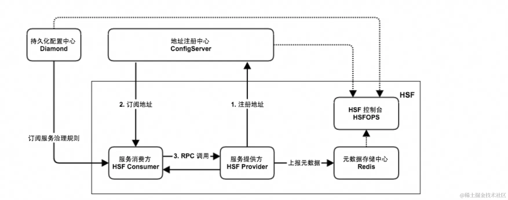

## Introduction

高速服务框架HSF（High-speed Service Framework），是在阿里巴巴广泛使用的分布式RPC服务框架

HSF连通不同的业务系统，解耦系统间的实现依赖。
HSF从分布式应用的层面，统一了服务的发布与调用方式，从而帮助用户更加方便、快速地开发分布式应用，以及提供或使用公共功能模块。
HSF为用户屏蔽了分布式领域中的各种复杂技术细节，如远程通讯、序列化实现、性能损耗、同步与异步调用方式的实现等。

> HSF3内核为[Dubbo3](/docs/CS/Framework/Dubbo/Dubbo.md).

## Architecture

HSF作为一个纯客户端架构的RPC框架，没有服务端集群，
所有HSF服务调用均是通过服务消费方（Consumer）与服务提供方（Provider）点对点进行。为了实现整套分布式服务体系，HSF还需要依赖以下外部系统。

<div style="text-align: center;">



</div>

<p style="text-align: center;">
Fig.1. HSF architecture.
</p>


- Provider
  服务提供方绑定了12200端口，用于接收请求并提供服务，同时将地址信息发布到地址注册中心。
- Consumer
  服务消费者通过地址注册中心订阅服务，根据订阅到的地址信息发起调用，地址注册中心不参与调用。
- ConfigServer
  HSF依赖注册中心进行服务发现，如果没有注册中心，HSF只能完成简单的点对点调用。
  服务提供端无法将服务信息对外暴露，服务消费端可能已经明确了待调用的服务，但是无法获取该服务。因此注册中心是服务信息的中介，为服务提供了注册与发现的功能。
- EDAS持久化配置中心
  持久化的配置中心用于存储HSF服务的各种治理规则，HSF客户端在启动的过程中向持久化配置中心订阅服务治理规则，如路由规则、归组规则、权重规则等，从而根据规则对调用过程的选址逻辑进行干预。
- EDAS元数据存储中心
  元数据指HSF服务对应的方法列表以及参数结构等信息。元数据对HSF的调用过程不会产生影响，因此元数据存储中心是可选的。由于服务运维的便捷性，HSF客户端在启动时会将元数据上报到元数据存储中心，方便服务运维。
- EDAS控制台
  EDAS控制台打通了服务地址注册中心、持久化配置中心、元数据存储中心等，为用户提供了服务运维功能，包括服务查询、服务治理规则管理等，提高HSF服务研发的效率、运维的便捷性。


Dubbo 3.0实现了和HSF框架的技术统一。
在EDAS中，可以便捷地将HSF应用升级为Dubbo 3.0应用。
升级之后，HSF应用可沿用原有的开发方式，还可以使用EDAS为Dubbo应用提供的更加完善的服务治理功能。


同步调用
HSF客户端默认以同步调用的方式消费服务，客户端代码需要同步等待返回结果。


泛化调用
对于一般的HSF调用来说，HSF客户端需要依赖服务的二方包，通过依赖二方包中的API进行编程调用，获取返回结果。但是泛化调用不需要依赖服务的二方包，可以发起HSF调用，获取返回结果。在平台型的产品中，泛化调用的方式可以有效减少平台型产品的二方包依赖，实现系统的轻量级运行。
调用链路Filter扩展
HSF内部设计了调用过滤器，能够主动发现用户的调用过滤器扩展点，将其集成到HSF调用链路中，便于扩展方对HSF的请求进行扩展处理


## SPI

HSF SPI与JDK SPI的使用方法类似，也大致分为以下几步:
1. 编写标准接口，并将其实现
2. 在META-INF/services文件夹下添加包含实现类类名的配置文件
3. 使用HSFServiceContainer.getInstances()方法

除了以上基本功能之外，HSF SPI有着更多的扩展配置选项，这些配置由在标准接口或实现类上使用注解实现。以下是几个可配置的注解：

- @Name: 用于标注一个实现，相当于给这个拓展实现起了个别名，可以在后期加载时加载指定name的实现，相当于起过滤作用；
- @Order: 当一个接口类有多个实现类时，该注解可以决定加载出实例列表中实例的先后顺序；
- @Scope: 用来描述一个实现类是否property，默认为singleton，如果使用property，则会在线程请求时，才创建并存放于 ThreadLocal 中；
- @Tag: 用来描述一个服务实现的标记，可以使用这个注解形容一个接口的若干服务实现类，可以在加载时加载指定tag的实例，起过滤作用。
- @Shared: 用来描述一个服务接口类型，被标注的服务是一个共享服务，表示该服务的实例将放置在Shared Container中（Shared Container的概念将在接下来提到）

HSF SPI不同于JDK SPI，只有单层加载器。HSF使用的SPI机制有多个级别的加载器，类似于Java的类加载机制。
服务类实例的加载由各级AppServiceContainer共同完成，加载过程中会优先委托上一级的容器进行加载。以下是HSF中ServiceContainer的一些概念：
- HSFServiceContainer： HSF SPI机制中的门面容器类，所有服务实例时加载请求都会打到这里进行委托加载。
- AppServiceContainer： HSF SPI机制中的具体实现类，和JDK SPI中的ServiceLoader类似，但是功能上比ServiceLoader强大。此外，从加载过程来看，AppServiceContainer类似于类加载机制中的各个类加载器，进行服务实例加载时会委托父ServiceContainer先进行加载。
- Shared Container： 这是HSFServiceContainer中包含的一个Container，本质上也是一个AppServiceContainer，所有@Shared修饰的实例将会从这里加载，它也是各级AppServiceContainer的父容器。
- ApplicationModel： 代表一个应用实例，它持有了应用类所对应的ClassLoader，AppServiceContainer需要委托该ClassLoader加载服务实例。


当加载请求进入HSFServiceContainer时，如果需要加载的扩展实现类被@Shared修饰过时，则会直接使用Shared Container加载实例；
否则，则使用应用的 AppServiceContainer加载。而AppServiceContainer的加载实例流程则是：先委托父类加载容器加载，如果可以从父类容器获取实例，则直接返回；否则，使用本身的容器类加载实例。以上过程十分类似于Java的类加载过程


### HSFServiceContainer
首先，我们从顶级容器HSFServiceContainer开始解析：

```java


public class HSFServiceContainer {
/**
 * 共享的容器，它不隶属与任何一个应用
 */
    public static final AppServiceContainerSHARED_CONTAINER =

    newAppServiceContainer();

    /**
     * 创建一个AppServiceContainer
     *
     * @param applicationModel 应用
     * @return 应用加载器
     */
    public static AppServiceContainer createAppServiceContainer(ApplicationModelapplicationModel) {
        returnnewAppServiceContainer(applicationModel, SHARED_CONTAINER);
    }

    /**
     * 根据一个接口类型，获取容器中的一个服务实例
     *
     * @param classType 接口类型
     * @return 返回接口对应的扩展实例
     */
    public static <T> TgetInstance(Class<T> classType) {
        AppServiceContainerappServiceContainer = getAppServiceContainer(classType);
        return appServiceContainer.getInstance(classType);
    }

    /**
     * 根据接口类型获取合适的AppServiceContainer，
     * 如果是@Shared，那么直接获取SHARED_CONTAINER
     * 否则，根据上下文获取当前的AppServiceContainer
     *
     * @param classType 接口类型
     * @return 应用服务加载器
     */
    private static <T> AppServiceContainergetAppServiceContainer(Class<T> classType) {
    }
}
```
HSFServiceContainer源码中较为重要的有以下几点：
- HSFServiceContainer中包含了SHARED_CONTAINER，从根本上来说，它是一个无父容器的AppServiceContainer。
- 通过createAppServiceContainer()方法创建的子容器都会自动将父容器设置为SHARED_CONTAINER。
- 最重要的getInstance()方法中，HSFServiceContainer先通过判断接口是否被@Shared修饰过，而决定是依靠SHARED_CONTAINER加载实例，还是依靠当前应用的AppServiceContainer进行加载；之后HSFServiceContainer调用对应容器的getInstance()方法获取实例。
  
由于具体的创建实例逻辑在AppServiceContainer中实现，因此还需要向下追踪解析。

### AppServiceContainer

首先来看AppServiceContainer的部分成员构成：
```java
  public class AppServiceContainer {
    //扩展接口到实现类之间的关系，{SPIClassType:{ImplementsClassName:ImplementsClassInstance}}
    private ConcurrentHashMap<Class<?>, Map<String, Class<?>>> spiRepository;
    //单例缓存，{ImplementsClassInstance: ObjectInstance}
    private ConcurrentHashMap<Class<?>, Object> singletonCache;
    //父容器
    private AppServiceContainer parent;
    //当前类加载器
    private ClassLoader loader;
    //当前应用
    private ApplicationModel application;
}
```
成员中较为重要的有以下几个：
  
  spiRepository中会储存扩展接口与对应实现类的映射关系，由之后要解析的loadSpi()方法进行加载
  
  singletonCache是一个实现实例的单例缓存，这也说明了相对与JDK SPI只能支持Prototype，HSF SPI新增了Singleton的支持，使用起来将会有更多的可能性。
  
  除此之外，AppServiceContainer还指定了父容器，存储了当前类加载器和当前应用。
  3、AppServiceContainer.getInstance()
  现在，开始解析HSFServiceContainer.getInstances()中调用的getInstance()方法：

```java
/**
* 根据接口类型以及name属性，返回指定的扩展服务实例
* 其中name属性由 <code>@com.taobao.hsf.annotation.Name("name")</code>注释在扩展实现类型上
*
* @param classType 接口类型
* @param name 指定扩展名称
* @param tags 标签
* @return 返回指定的接口对应的扩展实例
  */
  <T> T getInstance(Class<T> classType, Stringname, String[] tags) {
      Tinstance = null;
      //1、委托父加载器进行加载
      if (parent != null && isSharedType(classType)) {
          instance = parent.getInstance(classType, name, tags);
      }
      //2、parent没有找到，那就本地找
      if (instance == null) {
          String[] names;
          if (name == null) {
              names = ALL_NAME;
          } else {
              names = StringUtils.equals(name, ALL_NAME_ABBR) ? ALL_NAME : newString[]{
                  name
              } ;
          }
          List<T> instanceList = findInstances(classType, names, tags, false);
          //只返回一个实例
          if (instanceList != null && !instanceList.isEmpty()) {
              instance = instanceList.get(0);
          }
      }
      return instance;
  }
```

getInstance()方法逻辑较为简单：1. 委托父加载器进行加载；2. 如果parent那里没有找到，那么就在本地找，调用findInstances()方法。因此，这与JVM类加载中的双亲委派机制有着异曲同工之处。
  值得注意的是，getInstance()方法中，除了第一个接口类型参数之外还有两个参数。其中，name参数由之前提到的@Name注解在实现类上定义，而tags由@tag注解定义。这两个参数的作用都是通过传入参数进行实例过滤，如果不传入则代表不进行过滤，加载全部实例。

4、AppServiceContainer.findInstances()
  下面继续追踪，以下是findInstances()方法的部分源码：
```java

  /**
* 根据name获取对应的扩展，如果name为全部，则返回所有的扩展实例
*
* @param classType 接口类型
* @param names 扩展命名数组
* @param tags 标签数组
* @return 扩展实例列表
  */
  private <T> List<T> findInstances(Class<T> classType, String[] names, String[] tags, boolean withDefault) {
      if (classType == null) {
          return Collections.emptyList();
      }
      //1、加载所有指定接口类型的实现类
      loadSpi(classType);
      List<T> instanceList = newArrayList < T > ();
      Map<String, Class<?>> spiTypes = spiRepository.get(classType);
//2、创建扩展实现类实例
      if (spiTypes != null && !spiTypes.isEmpty()) {
//根据是否设置了特定的names参数来决定是否进行一轮过滤
//如果没有设置特定的names则加载全部实例
          if (ALL_NAME == names || withDefault) {
              for (Class<?> clazz : newLinkedHashSet < Class < ?>>(spiTypes.values())){
                  if (isPermit(classType, clazz, names)) {
                      Tinstance = createInstance(classType, clazz);
                      if (instance != null) {
                          instanceList.add(instance);
                      }
                  }
              }
              //如果设定来特定的names，只加载相应别名的实例
          } else {
//  ......
          }
      }
  }
```

//具体加载和过滤的逻辑，加载时同样要调用createInstance(classType, clazz)
  根据以上的源码，我们总结一下代码流程：
1.
在指定目录下查找出指定接口类型的所有扩展实现类，具体逻辑由loadSpi(classType)实现；
2.
根据是否指定来别名来实例化全部实例或者指定别名的实例，创建实例时调用了createInstance(classType, clazz)方法；
3.
根据tags的设置进行一轮实例过滤；
4.
按照@Order的数值大小对实例list进行排序。
findInstances()中还分别调用了loadSpi(classType)、createInstance(classType, clazz)两个重要方法。其中，createInstance()方法较为简单：

```java
/**
* 根据接口和实际类型,返回创建实例
*
* @param intfClazz 接口类型
* @param clazz 具体类型
* @param <T> 接口类型
* @return 实例
*/
@SuppressWarnings("ALL")
private <T> T createInstance(Class<T> intfClazz, Class<?> clazz) {
    Tresult;
    if (isSingletonType(intfClazz, clazz)) {
        result = (T) getSingleton(clazz);
    } else {
        result = (T) getPrototype(clazz);
    }
    return result;
}
```
createInstance()方法中根据了接口和实现类上的@Scope注解来判断并创建返回相应类型的实例，其中getSingleton(clazz)创建的缓存将会缓存到本AppServiceContainer的缓存中。创建实例的具体方法也与JDK SPI类似，利用ContextClassLoader，并使用反射的方法创建实例。
  到此为止，@Name、@Tag、@Order、@Scope、@Shared，这5个注解配置的实现逻辑都已经被分别查看到。
  5、AppServiceContainer.loadSpi()
  最后，我们来解析一下findInstances()中第一步调用的loadSpi(classType)方法。这一方法的功能与JDK SPI的查找服务类的功能类似：通过接口类型扫描相应配置文件，加载出具体的实现类class等信息。以下是loadSpi()的源码：

```java

  /**
* 加载当前type对应的所有SPI类型信息
*
* @param type 接口
  */
  privatesynchronizedvoidloadSpi(Class<?> type) {
if (!spiRepository.containsKey(type)) {
Map<String, Class<?>> spiImplsMap = newLinkedHashMap<String, Class<?>>();
// 由应用加载的扩展
Map<URL, Map<String, Class<?>>> applicationExtension = null;
  if (application != null && application.getAppContextClassLoader() != null) {
  // 代表框架的loader和应用的loader不是同一个
  if (application.getAppContextClassLoader() != loader) {
  //加载这个loader中对应type的SPI扩展类型信息，但是排除com.taobao.hsf的开头
  applicationExtension = ServiceLoaderUtils.load(type, application.getAppContextClassLoader(),
  "com.taobao.hsf");
  }
  }
  // 由框架加载的扩展
  Map<URL, Map<String, Class<?>>> extension = ServiceLoaderUtils.load(type, loader);
// 合并由两个地方加载的扩展，并进行去重，用过滤后的内容覆盖当前框架加载的
if (applicationExtension != null && !applicationExtension.isEmpty()) {
//合并去重逻辑，结果放入extensionMap
 ......
 }
 ......
//将结果放入当前容器的spiRepository中进行缓存，等待后续创建实例时使用
for (Map<String, Class<?>> extensionMap : extension.values()) {
  //别名填充
  fillSpiConcreteClazz(type, extensionMap, spiImplsMap);
  }
```

loadSpi(classType)方法是一个synchronized修饰的线程安全方法，主要的步骤总结如下：
1. 进入方法先判断是否已经加载过该接口的相应信息，如果没有才进行加载，与JDK SPI类似；
2. 通过传入不同的classloader来分别使用ServiceLoaderUtils.load()加载应用和框架的实现类信息；
3. 进行信息合并处理，并写入当前容器的spiRepository中。

其中，第2步中调用的ServiceLoaderUtils.load()方法将会根据传入的对应接口类型和classloader，去加载classloader下能够加载到的SPI实现类。配置文件位置的前缀"META-INF/services/"也在这个类中定义，有兴趣的同学可以去阅读这部分源码


这个图不是严格的时序图，而只是表述来以下HSF SPI取实例时的一些主要步骤，实际上HSF SPI还需要实现很多细节，它还要复杂得很多


职责链

跟踪过HSF调用链路的同学会发现，HSF在Consumer Bean或Provider Bean创建的时候会创建多个职责链。这些职责链中的Handler完成了HSF调用链路中的很多流程，这些Handler包括：路由选址RegistryInvocationHandler、泛化调用GenericInvocationClientFilter、鹰眼追踪EagleEyeClientFilter等等。HSF为了更优雅的实现职责链灵活扩展，在进行职责链构建过程时使用的就是SPI。下面我们来对职责链的构建过程进行解析

HSF职责链构建过程是在Bean创建的时候进行的，创建完成的链会被储存到Bean中ServiceMetadata下，例如以下几个链


```java
publicclassServiceMetadataextendsContainerBase {
//.....
    privatevolatileInvocationHandlerinvocationHandler;
    privateSyncInvocationHandlersyncInvocationHandler;
    privateProtocolprotocolFilterChain;
//.....
}
```

这些链的构建过程在ServiceMetadata.init()方法中，init()方法调用到了各条的链的Factory。由于各条链的Factory都较为类似，所以我们以InvocationHandlerChainFactory.buildHandlerChain为例子进行解析


```java
public staticInvocationHandlerbuildHandlerChain(ServiceMetadatametadata, InvocationHandlerinvocationHandler) {
    List<InvocationHandlerInterceptor> handlers;
//1、通过SPI的方式获取各个Handler的实例
    if (metadata.isProvider()) {
        handlers = HSFServiceContainer.getInstances(InvocationHandlerInterceptor.class, "server");
    } else {
        handlers = HSFServiceContainer.getInstances(InvocationHandlerInterceptor.class, "client");
    }
    InvocationHandlerlast = invocationHandler;
    for (inti = handlers.size() - 1; i >= 0; i--) {
//2、将各个Handler实例组装成链.....
    }
    return last;
}
```

从代码中可以看出，这个buildHandlerChain方法最主要的就两步：1、取出实现类链接口InvocationHandlerInterceptor的各种类实例；2、将这些实例组装成链。
但是现在有了一些问题：

HSF是分为Consumer端和Provider端的，我们怎么区分这些取出来的链节点是我们需要的？

这么多的Handler取出来，它一定有个执行顺序，上面代码中并未体现出排序这一过程，那么排序究竟是在哪里呢？
其实这两个问题的解决这就是步骤一的SPI加载过程。我们可以先举两个Handler的例子来看一下

```java
@Tag("client")
@Order(10)
publicclassDubboClientFilterSyncInvocationHandlerInterceptorimplementsSyncInvocationHandlerInterceptor, ServiceMetadataAware, LifeCycle {
//....
}


@Tag("client")
@Order(50)
publicclassErrorLogSyncInvocationHandlerimplementsSyncInvocationHandlerInterceptor, ServiceMetadataAware {
//....
}
```
可以看到，这两个Handler上用@tag标注来它是用于client的，HSF的SPI就可以根据这一信息进行过滤；而上面的第二个问题，@Order注解帮我们解决了，上面的例子中，第一个节点将会被先取出。
因此，也正因为使用了SPI，HSF在进行链构建的时候不用将各种链节点的实现类进行硬编码构建，而且在进行实例加载时还获得了下列好处：
1.
根据@tag注解区分进行筛选过滤，例如区分类Handler是server端还是client端的使用的
2.
根据@Order注解控制实例列表返回的顺序，相当于对职责链节点进行了一次排序
3.
根据@Scope确定了这个Handler是不是单例


最后，我们对JDK自带的和HSF实现的SPI进行对比：

|             | JDK SPI                 | HSF SPI                           |
|-------------|-------------------------|-----------------------------------|
| 是否支持实例缓存    | 	不支持                    | 	Singleton实例会缓存                   |
| 是否支持实例排序    | 	不支持                    | 新实例加入会排序不稳定 支持使用@Order进行排序        |
| 是否支持作用域     | 	不支持 每次都要创建实例，相当于Prototype | 	支持使用@Scope配置成Singleton或Prototype |
| 是否支持获取时进行过滤 | 不支持 配置文件中的类都会被迭代加载  | 可使用@Name和@Tag定义实例的名称、标签，加载时根据需求过滤 |
| 其他          | 	支持多级容器加载的概念            | @Shared修饰的接口会由共享容器加载              |


## Links

- [Dubbo](/docs/CS/Framework/Dubbo/Dubbo.md)


## References

1. [HSF](https://juejin.cn/post/7381375087205777419)