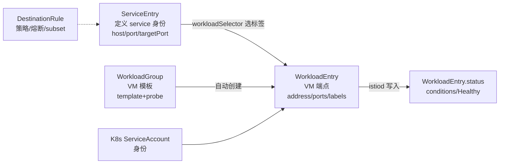

# Istio 接入 VM 工作负载

## Introduction

把虚拟机接进服务网格，是混合云现实中最常被低估的一环。它麻烦的地方在于**注册中心只认识 K8s 对象**：VM 不是 Pod，没有 Service，istiod 天然看不见它。必须靠一组 CRD 把 VM「伪装」成注册中心能理解的端点。

而这组 CRD 的字段设计有大量反直觉之处，本文开头列的五条几乎都能在二手资料里看到错的版本：`WorkloadEntry` **没有** `capacity` 字段、`ports` 是 **map 不是 list**、`metadata` 只在 `WorkloadGroup` 上、它**有** status 子资源、`analyze` 的阈值参数叫 `--failure-threshold`。写错这些的表现是「CRD 被拒绝」或「配置静默不生效」。

版本基线：**Istio 1.31.1**（2026-09-21 发布，1.31.0 于 2026-08-31）。以下字段逐条核实自 `istio/istio` 与 `istio/api` 的 1.31.1 tag（`istio/istio@1.31.1/go.mod` 声明的 api 版本为 `v1.31.1-0.20260915183457-d60a532be69a`，与 tarball 逐字符一致）。

## 三个 CRD 的分工与连接方式



三者关系一句话记法：**`ServiceEntry` 给 VM 一个「服务身份」，`WorkloadEntry` 描述「这台 VM 在哪」，`DestinationRule` 决定「怎么连它」。**

`workload_entry.proto` 原文强调了这个依赖：

> "A `WorkloadEntry` **must** be accompanied by an Istio `ServiceEntry` that selects the workload through the appropriate labels and provides the service definition for a `MESH_INTERNAL` service (hostnames, port properties, etc.)."

> [!WARNING]
> **`ServiceEntry.workloadSelector.labels` 为空 ≠ 选全部，而是「一个都不选」。** 源码注释原文：「**SE with empty workload selector will not select any workloads**」。这是接入 VM 最常见的静默失效点。

## `WorkloadEntry` 字段（7 个，速查）

短名 `we`，`networking.istio.io/v1`，Namespaced。

| 字段 | 类型 | 语义 | 约束 |
| :-- | :-- | :-- | :-- |
| `address` | string | 端点地址**不含端口**。域名仅当 resolution=DNS 时可用且须 FQDN 无通配符；UDS 用 `unix:///abs/path` | MaxLength=256；**`address` 与 `network` 至少填一个** |
| `ports` | **map\<string, uint32\>** | servicePortName → 本端点端口 | **优先级高于 targetPort**；值 `0 < p <= 65535`；MaxProperties=128 |
| `labels` | map\<string,string\> | 端点标签，**`ServiceEntry.workloadSelector` 据此选中** | MaxProperties=256 |
| `network` | string | L3 域分组。**`address` 为空时必填** | MaxLength=2048 |
| `locality` | string | `us/us-east-1/az-1/r11` 形式 | MaxLength=2048 |
| `weight` | uint32 | 负载均衡权重 0~4294967295 | — |
| `serviceAccount` | string | sidecar 身份。**必须与 WorkloadEntry/ServiceEntry 同命名空间存在** | MaxLength=253 |

> [!WARNING]
> **没有「必填字段」但 CEL 强制 `address` 与 `network` 二选一**。proto 注释明确：「`address` and `labels` fields should not be set in the template」（指 WorkloadGroup 模板）。
>
> **不存在的字段（常被误记）**：`capacity` / `metadata` / `discoveryEndpoints` / `asGroup` —— 逐项核对 proto 与 CRD 确认**均不存在**。`asGroup` 在全仓库无此标识符。
>
> `capacity` 的真相：它是 ambient 的**内部 xDS 字段** `workloadapi.Workload.capacity`（`*wrappers.UInt32Value`，field 27），由 `WorkloadEntry.spec.weight` 在 `workloads.go:553-555` 映射而来，**无公开 API 文档**。若笔记/文档提到「WorkloadEntry 的 capacity」，几乎肯定混淆了内部 xDS 类型。

> [!TIP]
> **WorkloadEntry 有 status 子资源**（`+cue-gen:WorkloadEntry:subresource:status`），含 `conditions` / `observedGeneration` / `validationMessages`。这不是「只能手动创建」的只声明式对象——istiod 会回写健康状态，见后文「健康检查」。

## `WorkloadGroup`：VM 集群的模板

短名 `wg`，三个字段：

| 字段 | 说明 |
| :-- | :-- |
| `metadata` | `ObjectMeta`（labels + annotations，各 MaxProperties=256）。proto 特意说明「应设在这里而非 `template` 内」 |
| `template` | **WorkloadEntry 类型，标记 REQUIRED**。CRD 上挂 `IgnoreSubValidation:["Address is required"]`，即模板内**免 address 校验** |
| `probe` | `ReadinessProbe`，镜像 K8s 语义：`initialDelaySeconds` / `timeoutSeconds`(默认 1s) / `periodSeconds`(默认 10s) / `successThreshold` / `failureThreshold`；方法为 oneof：`httpGet` / `tcpSocket` / `exec` / `grpc` |

`probe` 的语义是 **Deployment : Pod 的模板关系**：

> "A `WorkloadGroup` can have more than one `WorkloadEntry`. `WorkloadGroup` has **no relationship to resources which control service registry like `ServiceEntry`** and as such doesn't configure host name for these workloads."

即它只管「批量造出端点」，**不提供服务 hostname**——hostname 永远由 `ServiceEntry` 给。

> [!NOTE]
> **`WorkloadGroup.metadata` 不能设 `network`。** 它只有 `labels` 与 `annotations` 两个字段，**无 network**。network 只能在 `template.network` 逐组设置（`istioctl x workload group create --network` 写入的正是 `Spec.Template.Network`）。

## 部署实操

### 前置条件

官方 VM 安装页列出四条：

1. VM 到 ingress gateway（east-west gateway）有 IP 连通性
2. 命名空间 + ServiceAccount 已创建
3. **第三方 token 必须启用**，否则需 `--set values.global.jwtPolicy=first-party-jwt`
4. 安装包 `https://blob.istio.io/istio-release/releases/1.31.1/deb/istio-sidecar.deb`（CentOS 用 rpm）

集群侧必须打 network 标签（多网络场景）：

```bash
kubectl label namespace istio-system topology.istio.io/network="${CLUSTER_NETWORK}"
```

### `istioctl x workload` 命令组

1.31 中确实存在（`istioctl/pkg/workload/workload.go:85-119`）：

```
istioctl x workload
├── group create      # 建 WorkloadGroup
└── entry configure   # 生成 VM 上的 sidecar 配置包
```

`x workload entry configure` 关键参数：

| 参数 | 默认值 | 说明 |
| :-- | :-- | :-- |
| `-o, --output` | `""` | **必填**（Args 校验），输出目录 |
| `--name` / `-n` | `""` | 走 API server 模式时必填 |
| `-f, --file` | `""` | 本地 WorkloadGroup artifact；留空走 API server |
| `--tokenDuration` | **3600**（秒） | TokenRequest 过期时间 |
| `--ingressService` | **`istio-eastwestgateway`** | 格式 `<service>.<namespace>` |
| `--ingressIP` / `--internalIP` / `--externalIP` | `""` | **`--internalIP` 与 `--externalIP` 互斥**（PreRunE 校验） |
| `--autoregister` | `false` | 置 `ISTIO_META_AUTO_REGISTER_GROUP` |
| `--capture-dns` | **true** | 置 `ISTIO_META_DNS_CAPTURE` |
| `--clusterID` | 自动探测 | 未设时从 `istio-sidecar-injector` CM 的 `global.multiCluster.clusterName` 提取 |

`x workload group create` 参数：`--name`、`-n`、`-l/--labels`、`-a/--annotations`、`-p/--ports`、`-s/--serviceAccount`（**默认 `default`**）、`--network`、`--locality`、`-w/--weight`。

### 身份签发：TokenRequest → 证书

机制是：`istioctl x workload entry configure` 通过 **TokenRequest API** 为 `template.serviceAccount` 签发 JWT，agent 再用它换 mTLS 证书。

- Token audience 固定为 **`istio-ca`**（`authenticationv1.TokenRequest{ Audiences: []string{"istio-ca"} }`）
- CA 根证书从 `wg.Namespace` 的 ConfigMap `CACertNamespaceConfigMap` 取 `cacert` key

生成的落地路径：

| 文件 | 目标位置 |
| :-- | :-- |
| `root-cert.pem` | `/etc/certs/root-cert.pem` |
| `istio-token` | `/var/run/secrets/tokens/istio-token` |
| `cluster.env` | `/var/lib/istio/envoy/cluster.env` |
| `mesh.yaml` | `/etc/istio/config/mesh` |
| `hosts` 片段 | 追加 `/etc/hosts` |

需 `chown -R istio-proxy /var/lib/istio /etc/certs /etc/istio/proxy /etc/istio/config /var/run/secrets`。

### 注入的 proxyMetadata 全清单

`workload.go:497-521` 写入 `mesh.yaml` 的值：

```
CANONICAL_SERVICE, CANONICAL_REVISION, POD_NAMESPACE, SERVICE_ACCOUNT, TRUST_DOMAIN,
ISTIO_META_CLUSTER_ID, ISTIO_META_MESH_ID, ISTIO_META_NETWORK, ISTIO_META_POD_PORTS,
ISTIO_META_WORKLOAD_NAME, ISTIO_METAJSON_LABELS,
ISTIO_META_DNS_CAPTURE（--capture-dns，默认 true）
ISTIO_META_AUTO_REGISTER_GROUP（--autoregister 时 = WorkloadGroup 名）
```

`cluster.env` 额外 override（`workload.go:364-371`）：

```
ISTIO_INBOUND_PORTS, ISTIO_NAMESPACE, ISTIO_SERVICE, ISTIO_SERVICE_CIDR,
ISTIO_LOCAL_EXCLUDE_PORTS, SERVICE_ACCOUNT, [CA_ADDR（revisioned）], [ISTIO_SVC_IP]
```

> [!NOTE]
> **`ISTIO_META_NETWORK` 不用手写**——`workload.go:504` 明确 `md["ISTIO_META_NETWORK"] = we.Network`，WorkloadGroup 的 `template.network` 会被自动翻译。
>
> `ISTIO_LOCAL_EXCLUDE_PORTS` 默认 **`22,15090,15021`**，再按 statusPort 追加 `15020`。源码注释说明 22 是为了避免 VM 失联（改 SSH 端口时需同步调整）。

### systemd 单元

权威模板在 `tools/packaging/common/istio.service`：`ExecStart=/usr/local/bin/istio-start.sh`、`Restart=always`、`RestartSec=10`、`TimeoutStopSec=30s`。`istio-start.sh` 读 `./var/lib/istio/envoy/sidecar.env` 与 `cluster.env`；默认 pilot 地址 `istiod.${ISTIO_SYSTEM_NAMESPACE}.svc:15012`；`EXEC_USER` 默认 `istio-proxy`，`ISTIO_INBOUND_INTERCEPTION_MODE=TPROXY` 时改为 `root`。

## 健康检查：WorkloadEntry 也有 status

这是容易忽略的一点——**VM 的健康状态是被主动探测出来的**：

- 资格判定：WorkloadEntry 上**存在注解 `proxy.istio.io/health-checks-enabled`** 即视为有资格（值不必为 true，但非 true 时上报不生效）
- 探测由 `WorkloadGroup.probe` 驱动，istiod 写回 `status.conditions`（类型 `Healthy`）
- 开关 `PILOT_ENABLE_WORKLOAD_ENTRY_HEALTHCHECKS` 默认 **true**

自动注册相关开关（`pilot/pkg/features/pilot.go:150-161`）：

| 变量 | 默认 |
| :-- | :-- |
| `PILOT_ENABLE_WORKLOAD_ENTRY_AUTOREGISTRATION` | **true** |
| `PILOT_WORKLOAD_ENTRY_GRACE_PERIOD` | **10s** |
| `PILOT_ENABLE_WORKLOAD_ENTRY_HEALTHCHECKS` | **true** |
| `PILOT_ENABLE_CROSS_CLUSTER_WORKLOAD_ENTRY` | true |
| `PILOT_ENABLE_K8S_SELECT_WORKLOAD_ENTRIES` | true（带 selector 的 K8s Service 可选中匹配的 WorkloadEntry） |

自动注册生成的 WorkloadEntry 名字 = `AutoRegisterGroup + "-" + sanitizeIP(IP)`，超 253 字符**从开头**截断并告警。

标签优先级（自动注册时）：`node metadata > WorkloadGroup.Metadata > WorkloadGroup.Template`，且**明确不使用 `proxy.Labels`**（避免循环依赖）。

## ambient 与 VM：一个需要说清的矛盾

**官方立场是明确的：VM 不能加入 ambient mesh。**

官方 migrate 页把「VM workloads in the mesh」列为 hard blocker，原文：

> "**VM workloads** in the mesh. VM-based workloads cannot join the ambient mesh."

> [!WARNING]
> **但源码层面 ambient 索引确实会处理 WorkloadEntry**，这与「完全不感知 VM」的简化说法有出入。代码事实：
> - `ambientindex.go:350` 把 `WorkloadEntries` 传入 `builder.WorkloadsCollection`，`workloads.go:502-587` 有完整的 `workloadEntryWorkloadBuilder`
> - 其中有明确 hack：`workloads.go:566` — `w.WorkloadType = workloadapi.WorkloadType_POD // XXX(shashankram): HACK to impersonate pod`
> - 健康状态硬编码：`workloads.go:551` — `Status: workloadapi.WorkloadStatus_HEALTHY, // TODO: WE can be unhealthy`（ambient 侧**不反映** VM 探针失败）
> - `AMBIENT_ENABLE_MULTI_NETWORK` 默认 **false**
>
> **准确的表述是**：官方声明不支持，索引代码把 VM 当 pod 硬编码处理且健康状态写死，**不要指望 ambient 能正确路由与观测 VM**。两侧并存容易造成误判，必须按「不支持」来设计。

其他已核实的 ambient 限制：**不支持 SPIRE**（指 SPIRE 作为证书提供方）；HBONE 不可关闭。

### 1.31 的 HBONE 修复与升级动作

1.31 修复了「advertised HBONE capability 未传播到自动注册的 WorkloadEntry」（`releasenotes/notes/60788.yaml`）。

> [!WARNING]
> **升级必须手动介入。** 官方说明：标签**只在自动创建时应用**，升级前已注册的 WorkloadEntry 会继续走明文。两条补救路径：
> 1. 重连一个全新实例（触发重新注册）
> 2. 手动给 WorkloadEntry 加标签 **`networking.istio.io/tunnel=http`**

## 其他限制与已知问题

| 问题 | 结论 |
| :-- | :-- |
| VM 与 K8s Pod 的 mTLS 是否互通 | **互通**。proto 注释：「Pods with sidecars will automatically communicate with the workload using istio mutual TLS」 |
| `PeerAuthentication` / `AuthorizationPolicy` 是否生效 | **生效**，前提是 `serviceAccount` 存在且身份一致 |
| VM 能否被 `HTTPRoute` 路由 | **未查到官方明确说明**。`HTTPRoute` 的 `parentRefs`/`backendRefs` 指向 K8s Service，ServiceEntry 不是 K8s Service 对象，实践上需 SE + K8s Service 桥接。**此项属推断，非核实** |
| `network` 语义 | 同一 network 内端点**假定 L3 互相可达**；跨 network 需 Istio Gateway（通常 `AUTO_PASSTHROUGH` 模式） |
| 1.31 修复 | 「Service 或 WorkloadEntry 在创建后被更新」相关问题已修（issue 27183/27151/27185）；多端口 WorkloadEntry 的 `targetPort` 不生效也已修 |

## 排障速查

| 现象 | 先查 |
| :-- | :-- |
| WorkloadEntry 配了但没流量 | `ServiceEntry.workloadSelector.labels` **是否为空**（空=不选任何 workload） |
| 一直走明文（升级后） | 加标签 `networking.istio.io/tunnel=http` 或重连实例触发重注册 |
| VM 健康状态不更新 | WorkloadEntry 是否有注解 `proxy.istio.io/health-checks-enabled`；`PILOT_ENABLE_WORKLOAD_ENTRY_HEALTHCHECKS` |
| VM 证书签发失败 | `serviceAccount` 是否存在且**与 WorkloadEntry 同 ns**；Token audience 须为 `istio-ca` |
| VM 能连上但服务不通 | 确认 `network` 已设且集群打了 `topology.istio.io/network` 标签 |
| SSH 连不上 | `ISTIO_LOCAL_EXCLUDE_PORTS` 默认 `22,15090,15021`（+15020）；改 SSH 端口须同步 |
| 端口映射不对 | `ports` 是 map（servicePortName→端口），**优先级高于 targetPort**；多端口时注意 1.31 前 `targetPort` 曾失效的 bug 已修 |
| 想让多台 VM 一起管 | 用 `WorkloadGroup`（`template` 免 address 校验 + `probe` 主动探活） |

## Links

- [Istio](/docs/CS/Framework/Istio/Istio.md)
- [Install](/docs/CS/Framework/Istio/Install.md)
- [Ambient](/docs/CS/Framework/Istio/Ambient.md)
- [Security](/docs/CS/Framework/Istio/Security.md)
- [Kubernetes Service](/docs/CS/Container/k8s/Service.md)

## References

- <https://istio.io/v1.31/docs/setup/install/virtual-machine/>
- <https://istio.io/v1.31/docs/reference/config/networking/workload-entry/>
- <https://istio.io/v1.31/docs/reference/config/networking/workload-group/>
- <https://istio.io/v1.31/docs/ops/diagnostic-tools/virtual-machines/>
- <https://api.github.com/repos/istio/istio/releases/latest>
