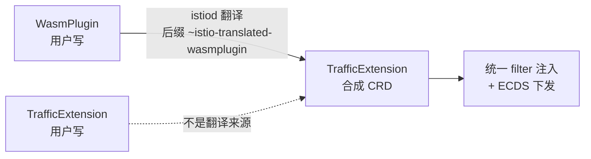

# Istio Wasm 插件开发

## Introduction

Wasm 插件是 Istio 唯一「不改二进制就能加逻辑」的扩展机制，但 1.31 前后发生了两处**架构级变化**，导致绝大多数网上的教程是错的：

1. **`WasmPlugin` 在 1.31 已被 `TrafficExtension` 包裹** —— istiod 内置翻译控制器把 `WasmPlugin` 转成合成的 `TrafficExtension`（名字后缀 `~istio-translated-wasmplugin`），ECDS 下发判定**只认 `kind.TrafficExtension`**。你在 Envoy 侧看到插件以 TrafficExtension 身份出现，报错措辞也是。
2. **运行时是 V8，不是 Wasmtime** —— `pilot/pkg/model/extensions.go:41` 硬编码 `defaultRuntime = "envoy.wasm.runtime.v8"`，全仓 `grep -i wasmtime` **零命中**。

版本基线：**Istio 1.31.1**（2026-09-21 发布）。所有 CRD 字段核实自 `istio/istio@1.31.1` 的 `manifests/charts/base/files/crd-all.gen.yaml`（CRD schema 为权威，373-733 行）与 `istio/api` 的 `extensions/v1alpha1/wasm.proto`；仓库状态为 `api.github.com` 实测。

## `WasmPlugin` CRD 字段速查

API group/version：**`extensions.istio.io/v1alpha1`**（1.31 中仍是 alpha，无 v1beta1/v1）。

| 字段 | 类型 | 默认 | 枚举/约束 | 备注 |
| :-- | :-- | :-- | :-- | :-- |
| `selector` | object | — | `matchLabels`，**不允许 `*` 通配** | 与 targetRef/targetRefs **三选一** |
| `targetRef` | object | — | namespace **必须为空** | **`$hide_from_docs`；代码注释标 deprecated** |
| `targetRefs` | array | — | **MaxItems=16**；namespace 必须为空 | 支持 Gateway / GatewayClass / Service(仅 waypoint) / ServiceEntry |
| `url` | string | — | **REQUIRED**；scheme ∈ `['',http,https,file,oci]`，**无 scheme 默认 `oci://`** | |
| `sha256` | string | `""` | `^$|^[a-f0-9]{64}$`（**允许空**） | 空则代理自算 |
| `imagePullPolicy` | string | `IfNotPresent` | `UNSPECIFIED_POLICY` / `IfNotPresent` / `Always`；**OCI + `:latest` → Always** | |
| `imagePullSecret` | string | `""` | **必须同 ns + `dockerconfigjson` 类型** | ns 被强制重写 |
| `verificationKey` | string | `""` | — | **`$hide_from_docs`；功能未实现，勿用** |
| `pluginConfig` | object | — | 自由 Struct，`x-kubernetes-preserve-unknown-fields: true` | **非分类型结构** |
| `pluginName` | string | `""` | MinLength=1, MaxLength=256 | Envoy 侧叫 `rootId` |
| `phase` | string | `UNSPECIFIED_PHASE` | `UNSPECIFIED_PHASE` / `AUTHN` / `AUTHZ` / `STATS` | |
| `priority` | integer | `0` | int32, nullable | **降序执行；越大越靠前** |
| `vmConfig` | object | — | `env[]` MaxItems=256；`valueFrom` ∈ `INLINE` / `HOST` | `HOST` 可读宿主环境变量 |
| `match` | array | `[]` | `TrafficSelector[]{mode, ports}`，元素间 **OR** | `mode` ∈ `UNDEFINED` / `CLIENT` / `SERVER` / `CLIENT_AND_SERVER` |
| `failStrategy` | string | **`FAIL_CLOSE`** | `FAIL_CLOSE`(0) / `FAIL_OPEN`(1) / `FAIL_RELOAD`(2) | 认证/授权插件**勿用** `FAIL_OPEN` |
| `type` | string | **`HTTP`** | `UNSPECIFIED_PLUGIN_TYPE` / `HTTP` / `NETWORK` | unspecified **实际按 HTTP 处理** |
| `status` | object | — | `conditions`（含 `validationMessages`） | controller 写入 |

**CRD 级 CEL 校验**（三选一）：

```
(has(self.selector) ? 1 : 0) + (has(self.targetRef) ? 1 : 0) + (has(self.targetRefs) ? 1 : 0) <= 1
```

> [!WARNING]
> **大量字段名是错的**（已逐项核对 schema 373-733 行）：`envoyOverrides`、`size`、`checksum`、`failPolicy`、`match.phase`、`match.context`、`pluginConfig.envoy` / `.envoyExtAuthz` / `.envoyExtProc`、`type: Istio::Envoy::Proxy` —— **全部不存在**。
>
> **`phase` 没有 `STATIC` / `STANZBIL` / `REPLACE` / `NONE`** —— 那是 Envoy wasm 配置里的概念（早期 Istio 遗留），不是 Istio `WasmPlugin` 的取值。实际只有 4 个值。
>
> **`match` 没有 `phase` / `context`**，只有 `mode` + `ports`。`mode` 也没有 `SIDECAR_INBOUND` / `GATEWAY` —— 那是 `EnvoyFilter.match.context` 的枚举。
>
> **`type` 默认不是 `Istio::Envoy::Proxy`**，实际默认行为为 **HTTP**。

## `WasmPlugin` → `TrafficExtension` 翻译

这是 1.31 的结构性变化。官方概念文档原文：

> Istio provides two mechanisms for extending the Envoy-based proxies: WebAssembly (Wasm) and Lua. **Both are configured using the [`TrafficExtension`] API**, which provides a unified way to attach extensions to workloads with consistent targeting and phase/priority ordering.



- 翻译控制器：`pilot/pkg/config/kube/extensions/translate.go:27-77`，注册于 `pilot/pkg/bootstrap/configcontroller.go:173-174`
- **ECDS 推送判定只认 `kind.TrafficExtension`**：`pilot/pkg/xds/ecds.go:46-55`
- `TrafficExtension` 的 `oneof filter_config { WasmConfig wasm = 6; LuaConfig lua = 7; }` —— **wasm 与 lua 互斥**，CEL 强制 `has(self.wasm) != has(self.lua)`
- `TrafficExtension` **只有复数 `targetRefs`**，其 wrapper 的 `GetTargetRef()` **硬编码返回 nil**
- 两者 `phase` 枚举数值完全相同（UNSPECIFIED=0/AUTHN=1/AUTHZ=2/STATS=3），这正是 `WasmPlugin` 能被强转的依据

> [!NOTE]
> `WasmPlugin` 与 `TrafficExtension` 的 wasm 配置**可以共存于同一集群**（istiod 用合成名后缀区分，不冲突），但**同一个扩展不能同时用两种 API 表达**（会生成两个 filter 实例）。
>
> 二者不是「二选一替代」，而是「新旧两层封装」。

## `WasmPlugin` vs `EnvoyFilter` 选型

| | `WasmPlugin` / `TrafficExtension` | `EnvoyFilter` |
| :-- | :-- | :-- |
| 官方定位 | 生产推荐（WebAssembly） | 轻量一次性（Lua） |
| 能力 | 完整 filter SPI + hostcall | 直接改 Envoy 配置结构 |
| 稳定性 | `WasmPlugin` v1alpha1 | 稳定但**暴露内部实现** |
| 升级安全性 | 沙箱隔离崩溃 | **暴露实现细节，升级易失效** |
| waypoint 支持 | ✅（Alpha） | **❌ 明确不支持且被劝阻** |

`EnvoyFilter` 在 waypoint 上的原文措辞很强硬：*"not currently supported for any existing Istio version with waypoint proxies… its use is **not supported, and is actively discouraged by the maintainers**."* 代码层面 `envoyfilter.go:78-81` 留 TODO 直接 `continue`。

> [!NOTE]
> **内存开销差异显著**（官方基准，低并发环境）：Wasm ≈ **117 MiB** vs Lua ≈ **20 MiB**。但要正确理解这个数字的含义——见下文「安全边界」。
>
> 官方对 EnvoyFilter 的警告原文：*"EnvoyFilter exposes internal implementation details that may change at any time. Please use extreme caution, especially around upgrades."*

## 可用扩展点：只有 2 种 filter 类型

Istio 自己只用两种 wasm filter（`pkg/wellknown` + `pkg/convert.go`）：

```
envoy.extensions.filters.http.wasm.v3.Wasm      ← type: HTTP（默认）
envoy.extensions.filters.network.wasm.v3.Wasm    ← type: NETWORK
```

`phase`（AUTHN/AUTHZ/STATS）决定的是在**既有 Istio filter 链中的相对插入点**，**不是**让用户选 `ext_authz` / `ext_proc` / `jwt_authn` / `ratelimit` 等 filter。

> [!WARNING]
> **「官方列出的可注入 filter 名清单」这一说法不成立。** Istio **不提供**「把插件注入到 `envoy.filters.http.ext_authz`」的能力——插件始终是 wasm filter 本身，只是位置不同。`ratelimit` / `local_ratelimit` / `jwt_authn` 作为 `WasmPlugin` 注入点**未查到官方支持**。
>
> 真正想挂到那些扩展点，路径是 `EnvoyFilter`（`applyTo` + `context`），而它**在 waypoint 上不可用**。

## SDK 与仓库（实测状态，2026-10）

> [!WARNING]
> **记忆中的大量仓库名在 1.31 已不存在。** 实测 404 清单：

| 不存在的仓库 | 正确替代 |
| :-- | :-- |
| `proxy-wasm/proxy-wasm-go` | `proxy-wasm/proxy-wasm-go-sdk` |
| `proxy-wasm/proxy-wasm-rust` | `proxy-wasm/proxy-wasm-rust-sdk` |
| `proxy-wasm/proxy-wasm-cpp` | `proxy-wasm/proxy-wasm-cpp-sdk` |
| `proxy-wasm/proxy-wasm-js` | 无对应；AssemblyScript 见下表 |
| `proxy-wasm/proxy-wasm-otel` | **未找到替代** |
| `istio/proxy-wasm-go`、`istio/wasm-go`、`istio/istio-wasm-example`、`istio/wasm-tests` | `istio-ecosystem/wasm-extensions` / `proxy-wasm/proxy-wasm-go-sdk` |
| `tetratelabs/proxy-wasm-go-sdk` | **已归档**（2025-04-24），迁至 `proxy-wasm` 组织 |

**proxy-wasm 组织（实测全量 9 个仓库）**：

| 仓库 | archived | 最近 push | release | 用途 |
| :-- | :-- | :-- | :-- | :-- |
| `proxy-wasm-go-sdk` | false | 2026-01-05 | **无 release** | Go SDK（wazero v1.7.2） |
| `proxy-wasm-rust-sdk` | false | 2026-08-19 | v0.2.5 (2026-05) | Rust SDK（crate 名 `proxy-wasm` 0.3.0-dev） |
| `proxy-wasm-cpp-sdk` | false | 2026-08-28 | 无 release | C++ SDK（emsdk 4.0.6） |
| `proxy-wasm-cpp-host` | false | 2026-07-22 | — | C++ host 实现 |
| `proxy-wasm/spec` | false | 2026-08-11 | 无 | **Proxy-Wasm ABI 规范** |
| `proxy-wasm/community` | false | 2026-09-24 | — | 社区 |
| `test-framework` / `.allstar` / `.github` | **true** | — | — | 已归档 |

> [!NOTE]
> **Go SDK 无 git tag / 无 release**，只能 pin 伪版本：`github.com/proxy-wasm/proxy-wasm-go-sdk v0.0.0-<pseudo-version>`。底层是 `github.com/tetratelabs/wazero v1.7.2`（间接引入）。

**生态仓库**：`istio-ecosystem/wasm-extensions`（官方 C++ 示例全集，**不在 `istio` 组织**）、`solo-io/proxy-runtime`（官方文档推荐的 AssemblyScript SDK）、`tetratelabs/coraza-proxy-wasm`（WAF，非官方）。

**npm 包**：`proxy-wasm` 与 `proxy-wasm-js` **均 404**。可用：`@solo-io/proxy-runtime` v0.1.15（官方推荐）、`@gcoredev/proxy-wasm-sdk-as` v1.2.4、`@kong/proxy-wasm-sdk` v0.0.6、`@higress/proxy-wasm-assemblyscript-sdk` v0.0.2。

> [!WARNING]
> **`istio/proxy` 里没有 `extensions/` 也没有 `samples/`** —— 它只有 261 个文件的 Bazel 包装仓库（`ENVOY_VERSION.txt`@1.31.1 = `1.39.2-dev`）。而 header-to-metadata / authz / jwt-authn / metrics / echo / rate-limit 这些「官方示例」**均不存在于 `istio-ecosystem/wasm-extensions`**。
>
> 另外 `webassemblyhub.io` 当前 **HTTP 520 不可用**；istio.io 的旧路径 `/v1.31/docs/ops/extensions/wasm/` 已 404，新路径是 `/docs/tasks/extensibility/wasm-modules/`。

## 开发实操（以 Go 为例）

### Step 1 — 依赖

```go
require github.com/proxy-wasm/proxy-wasm-go-sdk v0.0.0-<pseudo-version>
```

### Step 2 — 编写 handler

> [!WARNING]
> **回调方法名与旧版教程不同。** `OnProxyStart` / `OnStreamComplete` / `OnContextCreate` / `OnContextDelete` / `OnLocalReply` 在当前 SDK 中**不存在**——那是旧版 API。

实测 `proxywasm/types/context.go` 的实际方法集：

```
OnVMStart / OnVMStartStatus / OnVMStartStatusOK
OnPluginStart / OnPluginDone / OnPluginStartStatus
OnNewConnection / OnDownstreamData / OnDownstreamClose
OnUpstreamData / OnUpstreamClose
OnHttpRequestHeaders / OnHttpRequestBody / OnHttpRequestTrailers
OnHttpResponseHeaders / OnHttpResponseBody / OnHttpResponseTrailers
OnHttpStreamDone / OnStreamDone
OnQueueReady / OnTick
```

对应关系：`OnStreamComplete` → `OnHttpStreamDone` / `OnStreamDone`；`OnContextCreate` → `OnPluginStart`。

官方 helloworld 范式：

```go
func main() {}   // 必须存在（c-shared 导出要求），注册逻辑放 init()

func init() {
	proxywasm.SetPluginContext(func(contextID uint32) types.PluginContext {
		return &helloWorld{}
	})
}

type helloWorld struct {
	types.DefaultPluginContext   // 嵌入默认实现，避免实现所有方法
}

func (ctx *helloWorld) OnPluginStart(pluginConfigurationSize int) types.OnPluginStartStatus {
	proxywasm.LogInfo("OnPluginStart from Go!")
	if err := proxywasm.SetTickPeriodMilliSeconds(tickMilliseconds); err != nil {
		proxywasm.LogCriticalf("failed to set tick period: %v", err)
	}
	return types.OnPluginStartStatusOK
}
```

接口定义位置：`VMContext` / `PluginContext` / `TcpContext` / `HttpContext`。

### Step 3 — 构建

SDK `Makefile` 的权威命令：

```bash
env GOOS=wasip1 GOARCH=wasm go build -buildmode=c-shared -o main.wasm ./main.go
```

即**标准 Go 工具链 + wazero**，已不需要 TinyGo。Rust 对应 `cargo build --target wasm32-wasip1 --release`。

> [!WARNING]
> **`tinygo build -scheduler=none -target=wasi -no-debug` 不是必需**：tinygo 在 `proxy-wasm-go-sdk`、`istio-ecosystem/wasm-extensions`、`istio/istio` 1.31.1 中**均零命中**。官方改用标准 Go + wazero 后已摆脱 TinyGo 依赖。
>
> **`wasm-opt` 也不是必需**：在三个仓库中均无提及。Rust 侧靠 `opt-level=3 + lto=true + codegen-units=1` 在编译期优化。体积优化是有价值的工程实践，但**优化后必须重新计算 sha256**。

### Step 4 — 部署清单

```yaml
apiVersion: extensions.istio.io/v1alpha1
kind: WasmPlugin
metadata:
  name: my-plugin
spec:
  targetRefs:
  - kind: Service
    name: productpage
  url: oci://my-registry/ my-plugin:1.0.0
  sha256: <64位十六进制>
  imagePullPolicy: IfNotPresent
  phase: AUTHN
  type: HTTP
  pluginConfig:
    myKey: myValue
```

| 项 | 结论 |
| :-- | :-- |
| `imagePullPolicy` 默认 | `IfNotPresent`；**OCI + `:latest` tag 时为 `Always`** |
| sha256 能省略 | **能**（CRD pattern 允许空），省略则代理自算摘要 |
| 省略的代价 | ①「设了 sha256 ⇒ 一律 IfNotPresent」这条覆盖规则失效；②失去供应链完整性保证 |
| url digest 形式 | `oci://reg/img@sha256:<hex>` 也触发 `IfNotPresent` |
| 私有 registry | `imagePullSecret` 指定**同 ns** 的 `kubernetes.io/dockerconfigjson` Secret，ns 被强制重写 |
| insecure registry | agent 支持 `WASM_INSECURE_REGISTRIES`（逗号分隔） |
| 二进制大小上限 | `ISTIO_WASM_MAX_BINARY_SIZE_BYTES`，**默认 256MB** |
| 模块缓存 | 每个 proxy 各自缓存，生命周期随 Pod，按 checksum 命名（`<sha256>.wasm`） |

## 挂 waypoint 与 Issue 60530

1.31 之前，`WasmPlugin` 用 `targetRefs` 指向 Service 时会导致 **waypoint crash-loop**。

> [!WARNING]
> **成因已定位到源码**（`push_context.go:2197-2212`）：waypoint 场景下 `allowedNamespaces` 未包含应用 namespace，命中后直接 `continue` 并打日志 `proxy requested invalid TrafficExtension configuration`，Envoy 永远等不到 ECDS 资源。
>
> 修复方式：加入 `if proxy.IsWaypointProxy()` 分支，插入 waypoint 服务所在的 namespace。
>
> 踩到这个坑时看到的报错措辞是 **TrafficExtension** 而不是 WasmPlugin——因为翻译已完成。

## 本地调试

> [!WARNING]
> **`istioctl proxy-config wasm` 不存在。** `istioctl/pkg/proxyconfig` 全部子命令是：`cluster`、`all`、`listener`、`envoy-stats`、`log`、`route`、`endpoint`、`eds`、`bootstrap`、`secret`、`rootca-compare`、`ecds`。
>
> 想看 Wasm 插件用 **`istioctl proxy-config ecds <pod>`**（别名 `ec`）。

```bash
istioctl proxy-config ecds <pod-name[.namespace]>
istioctl proxy-config ecds deployment/<deployment-name[.namespace]>
ssh <user@hostname> 'curl localhost:15000/config_dump' > envoy-config.json
istioctl proxy-config ecds --file envoy-config.json
```

> [!NOTE]
> **`ISTIO_WASM_PLUGIN_CACHE` 不存在**，`WasmRemoteFetch` 是**指标名**不是环境变量。
>
> （代码事实：`ecds` 子命令复用了 `edsPath`（`?include_eds=true`）作为 dump 路径，疑似疏漏；实际影响未验证。）

## 安全边界：这不是访问控制机制

这是本章最重要的一节。

### 沙箱能隔离什么

官方文档对 Wasm 的定位是「**Full VM sandbox — a crash is contained to the plugin**」，且「A programming error or crash in one plugin doesn't affect other plugins」。

与 Lua 的对比说明了核心安全优势：Lua「**Runs in-process; a crash can kill the worker thread**」。

**failStrategy 是安全相关的**——proto 明确警告 `FAIL_OPEN`「**not recommended for the authentication or the authorization plugins**」：认证/授权插件用 fail-open 等于**插件挂了就放行**。

fail-open 的实现方式：agent 转换失败时插入 RBAC filter 兜底（`allow` = 放行全部 / `deny` = 拒绝全部），stat prefix `wasm-default-allow` / `wasm-default-deny`。

### 插件能访问什么

| 类别 | 内容 |
| :-- | :-- |
| Filter SPI | 构建 filter 插件 |
| **Host APIs** | headers、trailers、**metadata**（含 peer/downstream 身份） |
| **Call out APIs** | **gRPC 和 HTTP 调用** |
| Stats / Logging | 指标与日志 |
| `vmConfig.valueFrom: HOST` | **读取宿主 proxy 的环境变量** |

### 插件能看到明文数据

已核实的事实链：

1. `pluginConfig` 是自由 Struct，**可访问 header 与 body**；ABI 提供 `OnHttpRequestBody` 等回调，**body 按需 buffer 后交给插件**
2. `phase` 最晚可到 `STATS`（= 在授权后、stats 前），**意味着它跑在 mTLS 解密之后**
3. 官方 C++ 示例用途正是 AuthN Filter（实现 OIDC 流程并填充 `Authorization` 头）——必然需要读真实流量
4. Istio 集成测试 `wasm_test.go` 断言 `injectedHeader = "x-resp-injection"`——插件在 waypoint 上**改写真实响应头**

> [!IMPORTANT]
> **结论：Wasm 插件运行在 mTLS 解密之后的 filter 链中，能读取明文请求/响应体与全部 header。**
>
> mTLS 只保护「客户端 ↔ sidecar/waypoint」这一段，**不保护「sidecar/waypoint ↔ 后端应用」这一段**。一旦流量进入代理，插件即可见明文。

### 因此风险评估的含义

| 事实 | 推论 |
| :-- | :-- |
| 插件可读明文 body | 装上插件 ≈ **把该路径上全部明文数据的读取权授予它** |
| 有 call out API（gRPC/HTTP） | 恶意/被攻陷的插件可**外传数据** |
| `valueFrom: HOST` | 可读宿主环境变量 |
| `verificationKey` **功能未实现** | **无供应链签名验证**；`sha256` 只验字节一致，不验来源可信 |
| 官方劝阻认证插件用 `FAIL_OPEN` | 插件挂了就放行 |

> [!NOTE]
> 所以「Wasm 插件不能被随便用在数据面」的**准确表述**是：不是「沙箱不安全」，而是——**沙箱不限制插件看什么、也不限制它把数据发到哪**。它是**代码隔离**机制，不是数据访问控制机制。安全边界依赖：谁有权限创建 `WasmPlugin`（RBAC on `wasmplugins.extensions.istio.io`）、镜像来源是否可信、是否有审核流程。

> [!WARNING]
> **未核实的项不要写**：「沙箱无文件系统访问」（文档未明说）、**「无网络访问」（与文档冲突，文档明确列出 call out API）**、单个插件的 CPU/内存硬上限（只查到二进制大小 256MB 与 HTTP 拉取超时；V8 VM 级资源限制属 Envoy 侧，未取证）。

## 常见失败模式

| 现象 | 排查 |
| :-- | :-- |
| 插件 crash-loop 且提到 TrafficExtension | 1.31 前的 Issue #60530，`targetRefs` 指向 Service 时 waypoint 场景 |
| 拉取失败 | 私有 registry 需 `imagePullSecret`（同 ns、`dockerconfigjson` 类型）；insecure 需 `WASM_INSECURE_REGISTRIES` |
| sha256 不匹配 | 优化后重新计算 |
| 想用 `istioctl pc wasm` | 该命令不存在，用 `ecds` |
| 找不到官方示例仓库 | `istio/proxy-wasm-go` 等已 404；看 `istio-ecosystem/wasm-extensions` |
| 找不到 tinygo 依赖 | 已不需要，标准 Go + `GOOS=wasip1` |
| 认证插件失效且放行 | 检查 `failStrategy` 是否为 `FAIL_OPEN`（应改 `FAIL_CLOSE`） |
| 插件看不到 header | 检查 `phase` 位置与 `match.mode`（CLIENT/SERVER） |

## 排障速查

| 层次 | 手段 |
| :-- | :-- |
| 资源是否下发 | `kubectl get wasmplugin` 看 status.conditions（含 validationMessages） |
| Envoy 是否收到 | `istioctl pc ecds <pod>`（**不是** `pc wasm`） |
| 插件是否加载 | sidecar 日志搜插件名；用 `istioctl pc log <pod> --level wasm:debug` 提升插件日志级别 |
| 翻译后的形态 | 合成 `TrafficExtension`，名字带 `~istio-translated-wasmplugin` 后缀 |

## Links

- [Istio](/docs/CS/Framework/Istio/Istio.md)
- [Envoy](/docs/CS/Framework/Istio/Envoy.md)
- [Ambient](/docs/CS/Framework/Istio/Ambient.md)
- [Troubleshooting](/docs/CS/Framework/Istio/Troubleshooting.md)
- [Security](/docs/CS/Framework/Istio/Security.md)
- [Higress（Wasm 网关实践的另一条路径）](/docs/CS/Framework/Higress/Higress.md)

## References

- <https://istio.io/v1.31/docs/concepts/extensibility/>
- <https://istio.io/v1.31/docs/tasks/extensibility/wasm-modules/>
- <https://github.com/proxy-wasm/spec>（Proxy-Wasm ABI 规范）
- <https://github.com/proxy-wasm/proxy-wasm-go-sdk>
- <https://github.com/istio-ecosystem/wasm-extensions>
- <https://api.github.com/repos/istio/istio/releases/latest>
