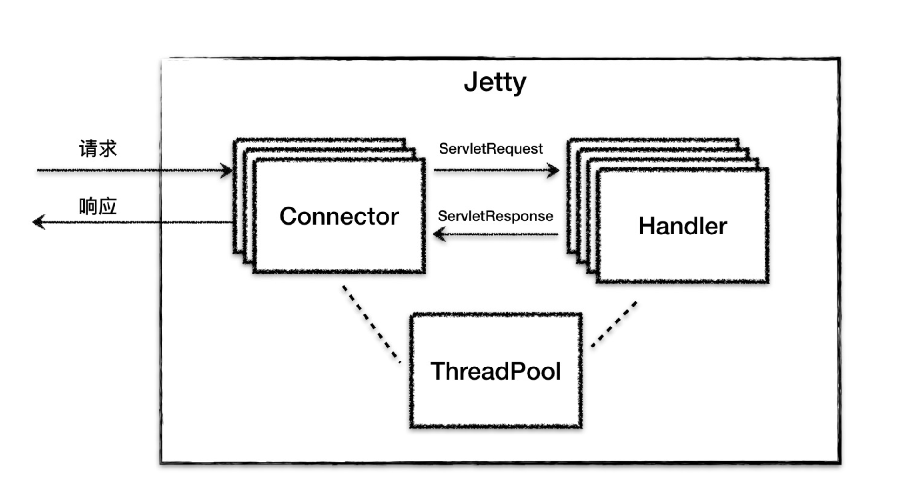

## Introduction


Connectors, handlers and a global thread pool.


SelectorManager
ManagedSelector


ByteBufPool re-usable objects , ConcurrentLinkedDeque

## Architecture


<div style="text-align: center;">



</div>

<p style="text-align: center;">
Fig.1. Tomcat architecture
</p>

Jetty Server 可以有多个 Connector 在不同的端口上监听客户请求，而对于请求处理的
Handler 组件，也可以根据具体场景使用不同的 Handler。这样的设计提高了 Jetty 的灵
活性，需要支持 Servlet，则可以使用 ServletHandler；需要支持 Session，则再增加一个
SessionHandler。也就是说我们可以不使用 Servlet 或者 Session，只要不配置这个
Handler 就行了。

为了启动和协调上面的核心组件工作，Jetty 提供了一个 Server 类来做这个事情，它负责
创建并初始化 Connector、Handler、ThreadPool 组件，然后调用 start 方法启动它们


## Connector

### Acceptor

The connector will execute a number of acceptor tasks to the Exception service passed to the constructor. 
The acceptor tasks run in a loop while the connector is running and repeatedly call the abstract accept(int) method. 
The implementation of the accept method must:
- block waiting for new connections
- accept the connection (eg socket accept)
- perform any configuration of the connection (eg. socket configuration)
- call the getDefaultConnectionFactory() ConnectionFactory.newConnection(Connector, EndPoint) method to create a new Connection instance.

The default number of acceptor tasks is the minimum of 1 and the number of available CPUs divided by 8. 
Having more acceptors may reduce the latency for servers that see a high rate of new connections (eg HTTP/1.0 without keep-alive). 
Typically the default is sufficient for modern persistent protocols (HTTP/1.1, HTTP/2 etc.)

```java
public abstract class AbstractConnector extends ContainerLifeCycle implements Connector, Dumpable
{
  private final Thread[] _acceptors;

    @Override
    protected void doStart() throws Exception
    { 
        // ...
        super.doStart();

        for (int i = 0; i < _acceptors.length; i++)
        {
            Acceptor a = new Acceptor(i);
            addBean(a);
            getExecutor().execute(a);
        }
 
    }
}
 ```   

处理请求流程

1.Acceptor 监听连接请求，当有连接请求到达时就接受连接，一个连接对应一个
Channel，Acceptor 将 Channel 交给 ManagedSelector 来处理。
2.ManagedSelector 把 Channel 注册到 Selector 上，并创建一个 EndPoint 和
Connection 跟这个 Channel 绑定，接着就不断地检测 I/O 事件。
3.I/O 事件到了就调用 EndPoint 的方法拿到一个 Runnable，并扔给线程池执行。
4. 线程池中调度某个线程执行 Runnable。
5.Runnable 执行时，调用回调函数，这个回调函数是 Connection 注册到 EndPoint 中
的。
6. 回调函数内部实现，其实就是调用 EndPoint 的接口方法来读数据。
7.Connection 解析读到的数据，生成请求对象并交给 Handler 组件去处理


ManagedSelector将 I/O 事件的侦测和处理放到同一个线程来处理，充分利用了 CPU 缓存并减少了线程上下文切换的开销

### ExecutionStrategy

ProduceConsume、
ProduceExecuteConsume、ExecuteProduceConsume
和 EatWhatYouKill


在低线程情况下，就执行 ProduceExecuteConsume 策略，I/O 侦测用专门的线程处理，I/O 事件的处理扔给线程池处理，其实就是放到线程池的队列里慢慢处理。
## Handler

A Jetty component that handles HTTP requests, of any version (HTTP/1.1, HTTP/2 or HTTP/3). A Handler is a Request.Handler with the addition of LifeCycle behaviours, plus variants that allow organizing Handlers as a tree structure.

Handlers may wrap the Request, Response and/or Callback and then forward the wrapped instances to their children, so that they see a modified request; and/or to intercept the read of the request content; and/or intercept the generation of the response; and/or to intercept the completion of the callback.

A Handler is an Invocable and implementations must respect the Invocable.InvocationType they declare within calls to handle(Request, Response, Callback).

Handler实现了 Servlet 规范中的 Servlet、Filter 和 Listener 功能中的一个或者多个


HandlerWrapper持有下一个Handler的引用 用于编织处理链路

ScopedHandler实现回溯调用


## Lifecycle

```java

WebAppContext webapp = new WebAppContext();
webapp.setContextPath("/mywebapp");
webapp.setWar("mywebapp.war");

server.setHandler(webapp);

server.start();
server.join()

```

## 对象池


ByteBufferPool

ByteBufferPool 是用不同的桶（Bucket）来管理不同长度的
ByteBuffer，因为我们可能需要分配一块 1024 字节的 Buffer，也可能需要一块 64K 字节
的 Buffer。而桶的内部用一个 ConcurrentLinkedDeque 来放置 ByteBuffer 对象的引
用。

Buffer 的分配和释放过程，就是找到相应的桶，并对桶中的 Deque 做出队和入队的操
作，而不是直接向 JVM 堆申请和释放内存

对象池大小靠连接数/queue length限制


## Comparison with Tomcat


相同点:

设计组件化 支持配置 模板模式

生命周期管理 实现一键式启停 状态流转与监听器模式

组件间调用

流程处理 责任链模式


Tomcat 和 Jetty 在解析 HTTP 协议数据时， 都采取了延迟解析的策
略，HTTP 的请求体（HTTP Body）直到用的时候才解析
当 Tomcat 调用Servlet 的 service 方法时，只是读取了和解析了 HTTP 请求头，并没有读取 HTTP 请求体。
直到你的 Web 应用程序调用了 ServletRequest 对象的 getInputStream 方法或者
getParameter 方法时，Tomcat 才会去读取和解析 HTTP 请求体中的数据；这意味着如果
你的应用程序没有调用上面那两个方法，HTTP 请求体的数据就不会被读取和解析，这样就
省掉了一次 I/O 系统调用


Jetty没有Service的概念


Tomcat可以对Connector配置不同的线程池

Jetty的Connector都是公用全局线程池

Jetty Connector 设计中的一大特点是，使用了回调函数来模拟异步 I/O，比如
Connection 向 EndPoint 注册了一堆回调函数。它的本质将函数当作一个参数来传递


Jetty的Selector和processor默认是同一个线程处理 类似Netty

Tomcat是分离的 使用Poller单独做Selector

Jetty 在吞吐量和响应速度方面稍有优势，并且 Jetty 消耗的线程和内存资源明显比
Tomcat 要少，这也恰好说明了 Jetty 在设计上更加小巧和轻量级的特点。
但是 Jetty 有 2.45% 的错误率，而 Tomcat 没有任何错误，并且我经过多次测试都是
这个结果。因此我们可以认为 Tomcat 比 Jetty 更加成熟和稳定

## Links

- [Tomcat](/docs/CS/Framework/Tomcat/Tomcat.md)