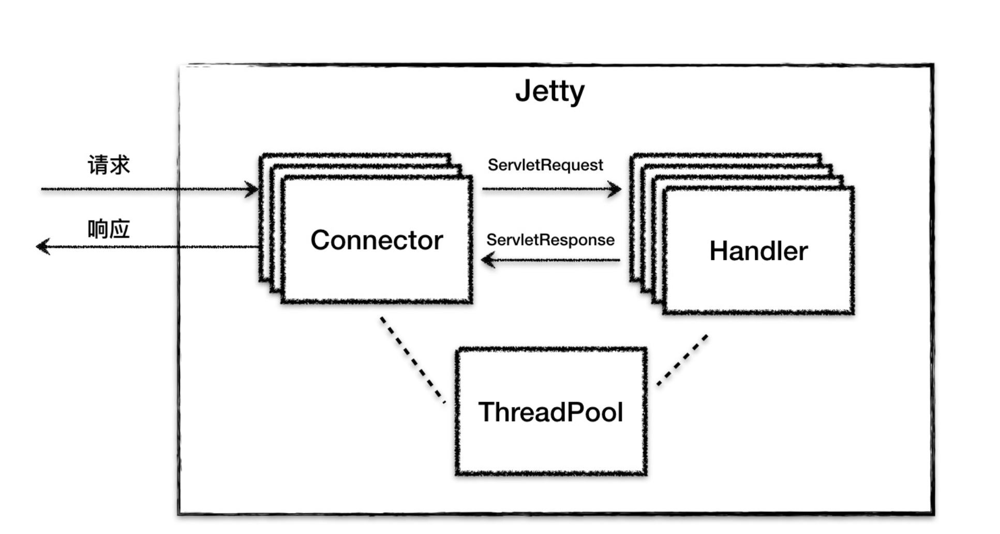

## Introduction

Jetty 是 Eclipse 基金会下的轻量级 HTTP 服务器与 Servlet 容器，最常见的两种身份是**嵌入式服务器**（作为库跑在应用进程里）和**独立服务器发行版**（`jetty-home` + `start.jar`）。它与 Tomcat 的根本分歧不在性能，而在**架构次序**：Tomcat 是「Servlet 容器 + 一个可换的连接器」，Jetty 12 是「一个与 Servlet 无关的 HTTP 服务器 + 若干可选的 Jakarta EE 层」。

版本基线：**Jetty 12.1.14**（2026-10 从 Maven Central 实测）。三条必须记住的坐标事实：

| 事实 | 结论 |
| :-- | :-- |
| 版本线 | 12.1.x 为特性线，12.0.x 为安全维护线；`jetty-server` 的 11.0.x 仍在发版但属旧代 |
| 字节码基线 | Java 17（`jetty-server-12.1.14.jar` 的 `Server.class` major 61） |
| EE 层 | `org.eclipse.jetty.ee10`（Servlet 6.0）与 `org.eclipse.jetty.ee11`（Servlet 6.1）**两套模块并行**，同为 12.1.14 |
| HTTP/2 坐标 | 12.1 起 artifact 名是 **`jetty-http2-server`**；旧名 `http2-server` 的最新版本停在 **11.0.26**，按旧坐标引依赖会静默掉回 Jetty 11 |

本库其余 Jetty 笔记都按这一基线写。**旧材料里大量 Jetty 9/10/11 的类名在 12 已经不成立**，具体清单见文末「旧 API 的现在时」。

## Architecture

Fig.1. Jetty architecture

图里的 `ServletRequest` / `ServletResponse` 是**旧代 Jetty 的视角**：12 里核心层的契约是 `Request` / `Response` / `Callback` 三元组（`Request.java:144` `public interface Request extends Attributes, Content.Source`，`Response.java:57` `public interface Response extends Content.Sink`），Servlet 类型只出现在 `ee10`/`ee11` 模块里。这个改动不是重构洁癖，而是编译期约束：`jetty-server-12.1.14/module-info.java:16-18` 只 `requires transitive org.eclipse.jetty.http` 与 `org.slf4j`——**核心不许依赖 `jakarta.servlet`**。于是同一份核心可以服务 EE 10 与 EE 11 应用，也可以完全不装 Servlet。嫁接机制见 [EeLayer](/docs/CS/Framework/Jetty/EeLayer.md)。

组件关系仍然是「多个 Connector 在不同端口收请求 + 一棵 Handler 树处理请求 + 全局线程池」，需要 Servlet 就挂 `eeNN` 的 `ServletContextHandler`，需要 Session 就挂 `SessionHandler`，不挂就没有该功能。`Server` 自己**就是 Handler 链的头**（`Server.java:77` `public class Server extends Handler.Wrapper implements Attributes`），不是仅仅「创建并协调组件」的容器。

## How a request is driven

一条连接的旅程，按对象讲而不是按线程讲：

1. `Acceptor` 任务收连接，交给 `ManagedSelector`；后者把 channel 注册到 Selector，并让 `ConnectionFactory` 链决定协议（TLS 工厂在前、明文在后，链式查找在 `AbstractConnectionFactory.findNextProtocol`）。
2. 工厂产出 `HttpConnection`，它同时是 `Runnable`：`run()` 只做一件事——调 `onFillable()`。
3. `HttpConnection` 持 `HttpParser`、`HttpGenerator`、一个 `HttpChannel` 和一个 `AtomicReference<HttpStream>`。
4. parser 的 `headerComplete()` 返回一个 `Runnable` 存进 `_onRequest`；`onFillable()` 跑它，并在结束后用 `_handling` 的 CAS 判断链是否还在处理中。
5. `HttpChannel`（实现 `HttpChannelState`）把协议层事件翻译成上层动作，最终 `return _handlerInvoker`——**注意它返回的是 Runnable，跑在哪由调用方决定**。
6. `HandlerInvoker` 走完 Customizer、URI 合规校验，然后 `server.handle(request, response, callback)`，返回 false 才写 404。

第 4 步那个 CAS 是理解 Jetty 非阻塞语义的钥匙：**同一线程可以同步跑完整条链并继续吃 HTTP pipeline 的下一个请求；一旦链变异步，CAS 失败就 break 让出线程**。逐行拆解与端到端时序见 [RequestFlow](/docs/CS/Framework/Jetty/RequestFlow.md)，字节层（`Content.Source` 的 `read`/`demand`、`HttpParser` 的 `State`、`HttpGenerator` 的 `Result`）见 [ContentModel](/docs/CS/Framework/Jetty/ContentModel.md)。

## Threading and scheduling

Jetty 的线程模型重点不在池大小，而在**一个 IO 事件要跑多长代码**：

- acceptor **默认恒为 1 个**，且是提交给 Executor 的任务而非自起线程（`AbstractConnector.java:199-204`、`:321-330`）。旧代「按 CPU/8 推导」的说法在 12 不成立，CPU 只用于越界告警。
- selector 数量是唯一由 CPU 推导的公式：`max(1, min(cpus/2, threads/16))`（`SelectorManager.java:70-79`）。
- 每个 `ManagedSelector` 持一个 `AdaptiveExecutionStrategy`——**这就是原来的 `EatWhatYouKill`**，12 里改了名（类注释 `:88` 自己写了这条历史），并按任务是否可阻塞在 4 个子策略间自适应切换。
- 虚拟线程走 `VirtualThreads` 反射探测 + 可替换的 `VirtualThreadPool`（它其实不是池，是 thread-per-task + 信号量）。**Jetty 没有 `VirtualThreadExecutor` 这个类**，那是 Tomcat 的实现名。

细节与调参坑见 [Threading](/docs/CS/Framework/Jetty/Threading.md)，连接器侧见 [Connector](/docs/CS/Framework/Jetty/Connector.md)。

## Configuration and lifecycle

`ContainerLifeCycle` 在 12 仍是基类（`component/ContainerLifeCycle.java:81`），带 managed / unmanaged / **AUTO** 三种 bean 归属的启发式规则；`AbstractLifeCycle` 里唯一废弃项是其内部 `AbstractListener`。`XmlConfiguration` 的 DTD 谱系最新仍是 `configure_10_0.dtd`——12 没有再升版本号。

一个容易踩的边界：**`Module` / `.ini` / `start.d` 不属于这些库模块**，它们是发行版启动器 `jetty-start` / `jetty-home` 的机制（`java -jar start.jar` 的 module graph）。源码里能看到的只有 `HomeBaseWarning.java:25-45`（`jetty.home` 与 `jetty.base` 同目录时告警）。把「Jetty 的配置系统」等同于 `start.d` 会误判嵌入式场景能用到什么。

## Buffer pool

`ByteBufferPool` 用不同桶（Bucket）管理不同长度的 ByteBuffer，桶内是 `ConcurrentLinkedDeque`；分配与释放是在桶里出队入队，而不是直接向堆申请。默认实现 `ArrayByteBufferPool` 在 `Server` 构造时装配（`Server.java:155`），与 `RetainableByteBuffer` 的引用计数配合。读写两侧的池化如何贯穿到 `Content.Chunk`，见 [ContentModel](/docs/CS/Framework/Jetty/ContentModel.md)。

## Differences from Tomcat

组件化、生命周期一键启停、责任链、模板方法——这些三家都有，比较它们没有信息量。有源码依据的分岔是这几条：

- **请求推进的所有权不同**。Tomcat 用 processor 状态机（协程式 `action` 循环）驱动；Jetty 让每个事件方法返回 `Runnable`，把「在哪跑」的决定权交给调用方。
- **Selector 与处理是否同线程**。Jetty 的 selector 事件与请求处理默认在同一线程（`AdaptiveExecutionStrategy` 允许当前线程直接消费），这与 Netty 的思路一致；Tomcat 用独立 Poller 线程做选择、再把 socket 交给工作线程（见 [Tomcat Connector](/docs/CS/Framework/Tomcat/Connector.md)）。
- **请求体都是延迟解析**：只解析请求头就进业务代码，直到应用调用读体或取参数才真正读。省掉一次对无用 body 的 IO 往返。
- **线程池归属**。Tomcat 可以给不同 Connector 配不同 `<Executor>`；Jetty 的连接与处理共用 `Server` 的 Executor（各 Connector 通过 `ThreadPoolBudget` 向它「租」线程，而不是各持一个池）。
- **规范代次的处理方式**。Tomcat 用版本线切换（10.1 = EE 10，11 = EE 11，不可混用）；Jetty 用 eeNN 模块在同一版本内并存。

至于「谁吞吐更高、谁更省内存」这类结论，随版本与负载形态翻转，本库不作为事实收录。三容器完整的维度对照见 [compare](/docs/CS/Framework/Tomcat/compare.md)。

## Old API in present tense

写 Jetty 相关笔记或读旧资料时，这几处名字已经换了或没了（全部在 12.1.14 源码上复核）：

| 旧资料里的写法 | 12.1.14 的现实 |
| :-- | :-- |
| `EatWhatYouKill` | `AdaptiveExecutionStrategy`（`thread/strategy/`） |
| `ParseResult` / `ParseState` | **已删除**，改为 `HttpParser.State` 枚举 + `boolean parseNext(ByteBuffer)` |
| `selectKeepAlive` | 不存在，keep-alive 判定内联进 `HttpGenerator` 与 `HttpConnection` |
| `HandlerContainer` 是容器基类 | 退化为空标记接口（整个文件只有一行声明） |
| `WebSocketServerFactory` / `WebSocketServer` | 换成 `Handshaker` + `WebSocketUpgradeHandler` + `ServerWebSocketContainer` 三层 |
| `AbstractConnector._acceptors` 是线程数组即代表起了 N 个线程 | 仍是 `Thread[]`，但线程由 Executor 任务在运行时回填 |
| `Server` 上有请求统计字段 | 已无，统计搬到 `StatisticsHandler` 与 `ConnectionStatistics` |
| `http2-server` artifact | 12.1 改名 `jetty-http2-server` |

## Links

- [Connector](/docs/CS/Framework/Jetty/Connector.md)
- [Threading](/docs/CS/Framework/Jetty/Threading.md)
- [RequestFlow](/docs/CS/Framework/Jetty/RequestFlow.md)
- [EeLayer](/docs/CS/Framework/Jetty/EeLayer.md)
- [Tomcat](/docs/CS/Framework/Tomcat/Tomcat.md)
- [三容器横向对照](/docs/CS/Framework/Tomcat/compare.md)

## References

- [Eclipse Jetty 12 编程指南](https://jetty.org/docs/jetty/12/programming-guide/)
- [Jetty 12 客户端与服务端架构说明](https://jetty.org/docs/jetty/12/architecture.html)
- [Jakarta EE 10 规范](https://jakarta.ee/specifications/platform/10/)
- [Jakarta EE 11 规范](https://jakarta.ee/release/11/)
