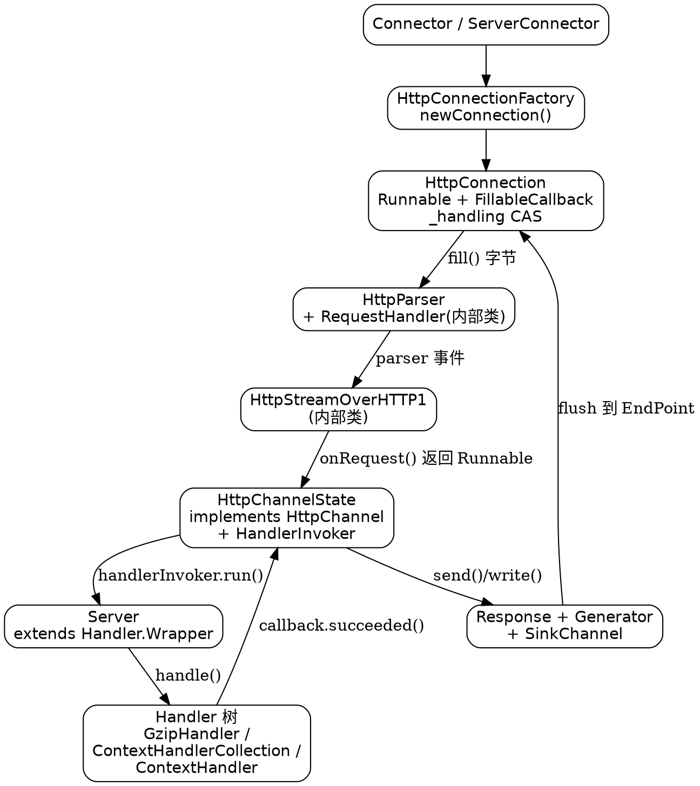

# Jetty RequestFlow

## Introduction

一次 HTTP 请求进入 Jetty 12，要穿过六类对象：`Connection`（字节与连接的持有者）、`HttpParser`/`HttpGenerator`（编解码）、`HttpStream`（单请求的协议 IO 抽象）、`HttpChannel`（一次 request/response 周期的状态机）、`Server` 与 `Handler` 树（业务处理）、`Content.Source`/`Content.Sink`（非阻塞字节流）。每一类都是接口，且几乎都能通过 protected 工厂方法或 `Factory` 接口替换掉。

这篇讲**推进链路**：谁触发谁、控制权在哪一步交出线程、又在哪一步收回来。Jetty 12 的写法与 Tomcat 的协程式状态机不同，它把「状态」和「驱动」分得很干净——事件方法只返回 `Runnable`，**在哪个线程上跑由调用方决定**。理解这一点，后面所有非阻塞语义、异步 servlet、HTTP/2 多路复用都是同一条链的变体。线程与调度部分见 [Threading](/docs/CS/Framework/Jetty/Threading.md)，字节流契约见 [ContentModel](/docs/CS/Framework/Jetty/ContentModel.md)。

## Object map



这张图的关键在于**箭头方向不等于线程方向**。`Stream -> Channel` 只是一次方法调用拿到一个 `Runnable`，真正 `run()` 的位置在 `HttpConnection` 的驱动循环里，与调用者同线程。

## Connection setup and replacement points

`HttpConnectionFactory.java:31` 声明 `public class HttpConnectionFactory extends AbstractConnectionFactory implements HttpConfiguration.ConnectionFactory`，`newConnection` 在 `:112-118`，负责把已 accept 的 `EndPoint` 包成 `HttpConnection`。父类 `AbstractConnectionFactory.java:95-103` 的 `configure(...)` 把 `HttpConfiguration` 上的 `idleTimeout`、`inputBufferSize`、`EventListener` 注入连接——**协议工厂的职责只有两件：造对象、灌配置**。

`HttpConnection.java:84` 的类声明信息量很大：

```java
public class HttpConnection extends AbstractMetaDataConnection
        implements Runnable, Connection.UpgradeFrom, Connection.UpgradeTo, Connection.Tunnel, ConnectionMetaData
```

一个对象同时是**任务**（`Runnable`）、**可升级连接的双方**（`UpgradeFrom`/`UpgradeTo`）、**隧道端点**、以及**元数据来源**（`ConnectionMetaData`）。字段集中在 `:91-113`：`_fillableCallback`、`_httpChannel`(`:95`)、`_requestHandler`(`:96`)、`_parser`(`:97`)、`_generator`(`:98`)、`_stream` 是 `AtomicReference<HttpStreamOverHTTP1>`(`:100`)、`_handling` 是 `AtomicBoolean`(`:104`)、`_onRequest` 是 `Runnable`(`:109`)。

构造函数 `:135-149` 里留出 5 个 protected 工厂：

| 方法 | 行号 | 替换后能改变什么 |
| :--- | :--- | :--- |
| `newHttpGenerator()` | `:151` | 响应生成策略（如自定义出队/合并） |
| `newHttpParser()` | `:156` | 报文解析规则、合规严格度 |
| `newHttpChannel()` | `:164` | 换掉整个请求状态机（返回 `new HttpChannelState(this)`） |
| `newHttpStream()` | `:169` | 包装单请求 IO（做指标、限流、内容改写） |
| `newRequestHandler()` | `:174` | 接管 parser 事件到 stream 的翻译 |

这五个方法是 Jetty 官方推荐的扩展位，比继承 `HttpConnection` 本身安全得多：内部状态字段全私有，只有工厂方法是契约。

## Driving model onOpen run onFillable FillableCallback

连接的入口只有三个方法，关系非常紧：

- `onOpen()` `:668-674`：连接建立时若已有数据（TLS 握手残留、pipeline 粘包），`getExecutor().execute(this)` 丢到线程池；否则 `fillInterested(_fillableCallback)` 注册可读兴趣。
- `run()` `:679-682`：**方法体只有 `onFillable()` 一行**。
- `FillableCallback` `:1782-1790`：IO 线程回调时**同样只调 `onFillable()`**。

也就是说「被线程池调度」与「被 IO 事件唤醒」两条路径最终汇入同一个函数，Jetty 不为这两种触发写两套逻辑。`onFillable()` 内部是一个 `while` 循环：`fill` 字节 → `parseRequestBuffer()` → 若 parser 完成一个请求则准备处理 → 处理完再看是否继续。核心那段 CAS 如下（`HttpConnection.java:416-452`，原样摘录）：

```java
// Handle the request by running the task.
_handling.set(true);
Runnable onRequest = _onRequest;
_onRequest = null;
onRequest.run();

// If the CaS succeeds, then some thread is still handling the request.
// If the CaS fails, then stream is completed, we are no longer handling,
// so the caller can continue to fill and parse more connections.
if (_handling.compareAndSet(true, false))
{
    if (LOG.isDebugEnabled())
        LOG.debug("request !complete {} {} {}", request, _requestBuffer, this);
    // Cannot release the request buffer here, because the
    // application may read concurrently from another thread.
    // The request buffer will be released by the application
    // reading the request content, or by the implementation
    // trying to consume the request content.
    break;
}
```

循环稍后还有：

```java
// If we have already released the request buffer, then use fill interest before allocating another
if (_requestBuffer == null)
{
    fillInterested(_fillableCallback);
    break;
}
```

**这段是理解 Jetty 非阻塞语义的钥匙**。把它翻译成一句话：同一线程能同步跑完整条处理链并继续吃 HTTP pipeline 的下一个请求；一旦链变异步（CAS 失败，说明 handler 侧尚未归还 `_handling`）就 `break` 让出线程。`_handling` 只有两个写入方——本循环的 `set(true)` 与 handler 完成路径的 `compareAndSet(true, false)`——因此它同时表达「有请求在飞」和「请求缓冲不能被释放」两件事，注释里那句 *Cannot release the request buffer here* 正是这个双重含义的直接后果。

紧接着的两个 `break` 分支同样值得记住：`getEndPoint().getConnection() != this` 表示发生了协议升级（WebSocket、HTTP/2 `h2c` 直连），当前连接释放缓冲并退出循环，线程不再属于这个 socket。

## From parser events to stream and request

`RequestHandler` 是 `HttpConnection` 的内部类，`HttpConnection.java:1088` 声明 `implements HttpParser.RequestHandler`。它把 parser 的语法事件翻译成本地对象：

- `messageBegin()` `:1095` 调 `_httpChannel.initialize()`，把上一请求的 channel 状态清空复用。
- `startRequest()` `:1099-1108`：`newHttpStream(...)` 造 stream，然后 `_stream.compareAndSet(null, stream)`；失败抛 `IllegalStateException("Stream pending")`，随后 `_httpChannel.setHttpStream(...)`。**这个 CAS 是「一条 HTTP/1 连接上同时只有一个 stream」的强制点**。
- `headerComplete()` `:1117-1121`：`_onRequest = _stream.get().headerComplete(); return true;`——注意它只是**赋值**，不执行。执行权交给上面那段驱动循环。
- `content()` `:1124-1136`：`_requestBuffer.retain(); stream._chunk = Content.Chunk.asChunk(buffer, false, _requestBuffer);`。请求体不会拷贝，直接把 `ByteBuffer` 包成 `Content.Chunk` 并 `retain` 引用计数，交给 stream 排队；释放由读取方或 `consumeAvailable()` 负责。
- 坏报文路径 `:1193-1217`：解析失败时生成 400 响应并关闭连接。

## Why HttpStream exists

`HttpStream.java:26-31` 的 javadoc 说得很直白（原样引用）：

```java
/**
 * A HttpStream is an abstraction that together with {@link MetaData.Request}, represents the
 * flow of data from and to a single request and response cycle.  It is roughly analogous to the
 * Stream within an HTTP/2 connection, in that a connection can have many streams, each used once
 * and each representing a single request and response exchange.
 */
public interface HttpStream extends Callback
```

动机是把「一个请求-响应的字节进出」抽成统一抽象，让 HTTP/1 与 HTTP/2 复用同一套上层（`HttpChannel` 与 `Handler` 树）。HTTP/1 的连接退化为「只允许一个 stream 的 stream 容器」，这正是 `startRequest()` 那个 CAS 的设计理由。

方法清单：`getId()`:47、`read()`:55、`demand()`:65、`prepareResponse(HttpFields.Mutable)`:72、`send(...)`:83、`cancelSend()`:95、`push()`:104（默认抛 `UnsupportedOperationException`）、`consumeAvailable()`:125 及静态实现 `:127-153`、`getInvocationType()` 默认 `NON_BLOCKING` `:156-159`。

`consumeAvailable()` 的静态实现里有个容易被忽略的自我保护：它受 `HttpConfiguration.getMaxUnconsumedRequestContentReads()` 限制（默认 16），超限即以 `CONTENT_NOT_CONSUMED` 失败结束 stream。这是「应用不读请求体但连接要保持」场景的兜底，不是可选优化。

三个实现：HTTP/1 是内部类 `HttpConnection.HttpStreamOverHTTP1`（`HttpConnection.java:1246`），HTTP/2 是 `internal/HttpStreamOverHTTP2.java:58`，另有 `internal/CompletionStreamWrapper.java:29` 做回调包装。`headerComplete()` 的 HTTP/1 实现（`:1346+`）演示了这一层做了什么协议补齐：`:1352-1353` 用 `getEndPoint().getSslSessionData() != null` 补 scheme，`:1356-1363` 补 authority（优先 `Host` 头，回退 `Request.getHttpURI()`），`:1366-1367` 补 path，`:1369` 才 `new MetaData.Request(...)`，然后 `:1378` **`Runnable handle = _httpChannel.onRequest(_request);`**，最后 `:1382-1411` 依据 HTTP 版本与 `Connection` 头算出 persistent。协议细节（`:authority` 与伪头）见 [HTTP/2](/docs/CS/Framework/Jetty/Http2.md)。

## HttpChannel contract returns Runnable

`HttpChannel.java:33` 是 `interface HttpChannel extends Invocable`，类注释 `:26-31` 一句话定位：把下层 `HttpStream` 与上层 `Handler` 连起来（*links the lower layer HttpStream with the upper layer Handler*）。

它的签名风格在 Jetty 里很特别——**所有事件方法返回 `Runnable`（可能为 null），由调用方决定在哪个线程跑**：

| 事件 | 行号 | 返回 |
| :--- | :--- | :--- |
| `onRequest(MetaData.Request)` | `:54` | `Runnable` |
| `onContentAvailable()` | `:72` | `Runnable` |
| `onIdleTimeout(TimeoutException)` | `:84` | `record IdleTimeoutTask(Runnable action, boolean handlingRequest)` `:186` |
| `onFailure(Throwable)` | `:95` | `Runnable` |
| `onRemoteFailure(Throwable)` | `:107` | `Runnable` |
| `onClose()` | `:115` | `default null` |
| `recycle()` / `initialize()` | `:125` / `:131` | — |
| `from(Request)` | `:145-150` | 静态：从 servlet `Request` 反查 `HttpChannel` |
| `Factory` / `DefaultFactory` | `:157-176` | channel 构造工厂 |

这个约定的后果是**状态机不持有线程**：channel 只回答「接下来该做什么」，不回答「谁去做」。`onIdleTimeout` 甚至额外带一个 `handlingRequest` 布尔，告诉调用方超时发生时请求是否仍在业务线程手上——因为直接 `break` 掉正在处理的线程是不安全的。配合上一节的 `_handling` CAS，Jetty 用两处原子状态表达完整生命周期，代价是 `HttpConnection` 与 `HttpChannelState` 之间存在双向回调，读单个文件难以看清全貌。

## onRequest and HandlerInvoker

实现类 `internal/HttpChannelState.java:86` `implements HttpChannel, Components`。字段 `:110-136`：`_handlerInvoker`、`_lastWriteCallback`、`_readInvoker`/`_writeInvoker`(`:115-116`)、`_handling`（类型是 `Thread`，与 `HttpConnection._handling` 的 `AtomicBoolean` 不是同一回事）、`_handled`、`_streamSendState`、`_cache`。

`onRequest` `:321-354` 在 `AutoLock` 内做：无 stream 抛 `IllegalStateException("No HttpStream")`；`_request != null` 抛 `IllegalStateException("duplicate request")`；然后 `initialize()`、`new ChannelRequest(this, request)`、`new ChannelResponse(_request)`、判定 `is100ContinueExpected()`。接着预置响应头（`:339-344`）：`Server` 版本、`X-Powered-By`、`Date`（`Date` 头取自 `Server.getDateField()`，是缓存好的固定字节，避免每请求格式化）。`:346-349` 把 `HttpConfiguration` 的 `idleTimeout` 下发到 stream 并记住旧值。最后一行 `:352` 是 `return _handlerInvoker;`，上面 `:351` 的注释值得原样记住：*This is deliberately not serialized to allow a handler to block.*

`HandlerInvoker` `:744-844` 实现了 `Task`，`run()` 的完整步骤：

1. `:758` 锁内 `_handling = Thread.currentThread()`，取出 `request`/`response`。
2. `:774-778` 依次跑 `HttpConfiguration.Customizer` 链，每个 `customize(customized, responseHeaders)` 可以返回新 `Request` 替换（返回 null 则保持）；若被替换过且开了 `RequestLog`，`request.setLoggedRequest(customized)`。
3. `:783-789` 校验 `pathInContext` 必须以 `/` 开头，`PRI`/`CONNECT`/`OPTIONS` 三种方法豁免，否则 `HttpException.RuntimeException(400, "Bad URI path")`。
4. `:791-802` `UriCompliance` 与 `HttpCompliance` 逐项 `ComplianceUtils.verify(...)`，违规走 400。
5. **`:804-805`** 才真正进业务：

```java
if (!server.handle(customized, response, request._callback))
    Response.writeError(customized, response, request._callback, HttpStatus.NOT_FOUND_404);
```

`handle` 返回 `false` 意味着没有任何 handler 认领这个请求，**404 的兜底就在这一行**，而不是某个专门的 `DefaultHandler`（虽然 `DefaultHandler` 也存在）。任何抛出的 `Throwable` 被 `:808-811` 捕获后转成 `request._callback.failed(t)`。

6. `:818-830` 重新加锁：清 `_handling`、`_handled = true`，并算出 `completeStream = callbackCompleted && lastStreamSendComplete`——**回调完成与实际字节写完是两个条件**，必须都成立才能收尾。
7. `:836` 满足则 `completeStream(stream, completeStreamFailure)`。真正的响应最后写出与 stream 完成在 `LastWriteCallback` `:846-883`。
8. `getInvocationType()` `:841-843` 委托给 `Server.getInvocationType()`——invoker 自己不声明阻塞性，跟随链头。

## Handler tree and InvocationType propagation

`Handler.java:119`：`public interface Handler extends LifeCycle, Destroyable, Request.Handler`。它的类注释 `:35-118` 是全篇最好的教学素材，其中一棵树原样摘录：

```text
Server
`- GzipHandler
   `- ContextHandlerCollection
      +- ContextHandler (contextPath="/user")
      |  `- YourUserHandler
      |- ContextHandler (contextPath="/admin")
      |  `- YourAdminHandler
      `- DefaultHandler
```

注释同时给出三个示例，说明 handler 的三种基本形态：`Handler.Abstract.NonBlocking` 里直接 `callback.succeeded();` 后 `return true;`（隐式 200 空响应）；按 `request.getHttpURI().getPath()` 决定返回 `true`（认领）或 `false`（不认领，交给下一个）；`Handler.Wrapper` 里 `return super.handle(...)` 把请求转给子 handler，不匹配时 `return false`。**`boolean` 返回值就是「我是否负责这个请求」**，这条契约贯穿全树。

类型体系（均在 `Handler.java` 内）：`Handler.Container`:161、`Handler.Collection`:252、`Handler.Singleton`:344（`insertHandler`:382-390、`getTail`:396-402、`:413+` 做环检测与 `InvocationType` 兼容性检查）、`Handler.Abstract extends ContainerLifeCycle`:489（默认 `BLOCKING`）、`Handler.Abstract.NonBlocking`:567、`Handler.AbstractContainer`:587、`Handler.Wrapper`:729（`handle`:791-795、`setHandler`:783-788 —— 非 dynamic 且已启动时改子 handler 抛 `IllegalStateException`）、`Handler.Sequence`:813（`handle`:855-863 顺序尝试直到某个 handler 返回 `true`）。

`Server.java:77` `extends Handler.Wrapper implements Attributes`——**Server 自己就是链头**，`Server.handle`（`:192-198`）取 `getHandler()`，为空则用 `_defaultHandler`。这就是 `HandlerInvoker` 里 `server.handle(...)` 的落点。

`InvocationType`（`BLOCKING` / `NON_BLOCKING`）沿 `Handler` 声明，`Handler.Singleton` 在插入时检查兼容性。它的作用是告诉 `ThreadPool`/`QueuedThreadPool` 这类任务能否长占线程，从而决定是否值得走虚拟线程或工作线程池；配合 `HttpStream.getInvocationType()` 的 `NON_BLOCKING` 默认值，构成 Jetty 12 的调度依据。详见 [Threading](/docs/CS/Framework/Jetty/Threading.md)。

## ContextHandler scoping

`handler/ContextHandler.java:79` `extends Handler.Wrapper`。`handle` `:1211-1266` 的顺序：`checkVirtualHost` → 计算 `pathInContext` → `wrapRequest(...)`（**可以返回 null 表示本 context 不接管**）→ `handleByContextHandler`（`:1268-1277`：无 target 即返回 false 或直接 404）→ `enterScope`（切换 `ServletContext` 属性与线程上下文类加载器 TCCL）→ `handler.handle(contextRequest, contextResponse, callback)` → `catch` 转 `Response.writeError` → `finally` `exitScope`。

`:1262-1263` 的注释回答了一个高频疑问：异步处理时线程会在 scope 外结束，为什么 `finally` 里就 `exitScope`？因为传给下层的 `callback` 已被包装，回调重入时会再次 `enterScope`。TCCL 的正确性完全依赖这个包装，自定义异步 callback 而不重入 scope 是 Jetty 上 classpath 诡异问题的典型来源。

`ContextHandlerCollection.java:50` `extends Handler.Sequence`，但 `handle` `:134-159` 用 `Mapping`/`Index` 前缀树直接定位候选 context，跳过 `Sequence` 的线性扫描——context 多时这是唯一的性能差异点。webapp 层（`ServletContextHandler`、JSP、Servlet 映射）如何接到这条链上，见 [EeLayer](/docs/CS/Framework/Jetty/EeLayer.md)。

## HTTP pipeline and keep-alive

同连接多请求的能力完全靠前述驱动循环：`onRequest.run()` 同步返回且 CAS 成功（即链已彻底结束）时**不 break**，继续 `while` 判断 `_requestBuffer` 里是否还粘着下一个请求的字节。keep-alive 的判定位置在 `HttpStreamOverHTTP1.headerComplete()` 的 `:1382-1411`，依据 HTTP 版本（1.0 默认关、1.1 默认开）与 `Connection`/`Keep-Alive` 头计算 persistent；`onClose()` 与 `Content.Chunk.isFailure()` 则可能中途把它改成关闭。`HttpConfiguration` 上的 `maxRequests` 与 `idleTimeout` 是两个最终闸门。连接器与这些超时的继承关系见 [Connector](/docs/CS/Framework/Jetty/Connector.md)。

## End-to-end sequence

把前面所有片段串起来，一次同步 GET 在**同一个线程**上的完整轨迹：

| 序号 | 位置 | 动作 |
| :--- | :--- | :--- |
| 1 | `AbstractConnectionFactory` | accept 后 `configure()` 灌 idleTimeout/bufferSize/EventListener |
| 2 | `HttpConnectionFactory:112-118` | `newConnection()` 造 `HttpConnection` |
| 3 | `HttpConnection:668-674` | `onOpen()`：有数据则 `execute(this)`，否则 `fillInterested` |
| 4 | `HttpConnection:679-682` | `run()` → `onFillable()` 进入驱动循环 |
| 5 | `onFillable()` | `fill` 字节进 `_requestBuffer`，`parseRequestBuffer()` |
| 6 | `RequestHandler:1095` | `messageBegin()` → `_httpChannel.initialize()` |
| 7 | `RequestHandler:1099-1108` | `startRequest()` → `newHttpStream()` + `_stream` CAS |
| 8 | header 事件 | `HttpParser` 累积 `MetaData.Request` 头部 |
| 9 | `RequestHandler:1117-1121` | `headerComplete()` → `_onRequest = stream.headerComplete()` |
| 10 | `HttpStreamOverHTTP1:1346-1378` | 补 scheme/authority/path，`new MetaData.Request`，`_httpChannel.onRequest()` |
| 11 | `HttpChannelState:321-354` | 建 `ChannelRequest`/`ChannelResponse`，预置头，下发超时，`return _handlerInvoker` |
| 12 | `HttpConnection:416-419` | `_handling.set(true)`；`onRequest.run()` |
| 13 | `HandlerInvoker:774-802` | Customizer 链 → pathInContext → URI/HTTP 合规 |
| 14 | `HandlerInvoker:804` | `server.handle(...)` 进 Handler 树 |
| 15 | `ContextHandler:1211-1266` | `enterScope` → 业务 handler → `callback` → `exitScope` |
| 16 | `HttpChannelState:846-883` | `LastWriteCallback` 让响应字节经 `HttpGenerator` 产出并 flush 到 `EndPoint` |
| 17 | `HandlerInvoker:818-836` | 清 `_handling`，`completeStream` 判定并收尾 |
| 18 | `HttpConnection:425` | CAS 成功 → 不 break → 回步骤 5 吃下一个 pipeline 请求 |

第 12 与第 18 步之间若任何一环把处理交给别的线程（异步 servlet、`CompletableCallback` 未完成），第 18 步的 CAS 就会失败，`onFillable()` 直接 `break`，socket 的后续字节要等 `onContentAvailable()` / `LastWriteCallback` 重新触发。

## Removed or degraded legacy API

- `HttpConnection.selectKeepAlive(...)` 在 12 里已不存在，keep-alive 判定下沉到 `HttpStreamOverHTTP1.headerComplete()`。照旧资料去 `HttpConnection` 找这个方法会一无所获。
- ⚠️ **`HandlerContainer` 在 12 里退化成一个空标记接口**：`HandlerContainer.java:23` 整个文件只有 `public interface HandlerContainer extends Handler.Container`。同理 `handler/AbstractHandler.java:23`、`handler/AbstractHandlerContainer.java:24` 都只是兼容壳。任何「Jetty 12 的 `HandlerContainer` 是容器基类」的说法都是 9/10 时代的印象，容器语义现在只在 `Handler.Container`/`Handler.Collection`/`Handler.AbstractContainer` 里。

## Comparison with Tomcat

同一份职责（在 IO 线程与业务线程之间推进一个请求、支持异步、支持 pipeline），Tomcat 与 Jetty 给出了不同答案：

| 维度 | Tomcat | Jetty 12 |
| :--- | :--- | :--- |
| 状态载体 | `AbstractProcessor` 协程式状态机循环，按 `action` 分派 | `HttpChannelState`（状态） + `HttpStream`（协议 IO） |
| 推进方式 | 循环内 `switch` 切状态，等待靠 `AsyncState` | 事件方法返回 `Runnable` + `_handling` CAS 决定让出/继续 |
| 编解码 | 与 processor 耦合在 `Http11Processor` | 独立 `HttpParser`/`HttpGenerator`，通过 `RequestHandler` 事件解耦 |
| 非阻塞读 | `NonBlockingState` + 完成事件 | `Content.Source`/`Content.Chunk` + `fillInterested` |
| 责任链 | `Engine→Host→Context→Wrapper` 固定四层 + `Valve` 管道 | 任意 `Handler` 树，`Server` 是链头，`boolean` 认领 |
| context 选择 | `Mapper` 在 `Engine` 前完成 | `ContextHandlerCollection` 的 `Mapping`/`Index` 在链内完成 |

Jetty 的收益是每层可独立替换且 HTTP/1 与 HTTP/2 共享 `HttpChannel` 以上全部代码；代价是推进逻辑分散在两个类的原子字段之间，单文件不可读。Tomcat 侧的细节见 [Tomcat Connector](/docs/CS/Framework/Tomcat/Connector.md)。

## Pitfalls

1. **把 `_handling` 当成一把锁**。它是协议层「有请求在飞」的标记，`HttpChannelState._handling` 则是业务线程引用，两者不能混为一谈，排查阻塞问题时要分开看。
2. **以为 `handle` 返回 `true` 就代表响应完成**。`true` 只表示「已认领」，响应是否写完取决于 `callback` 与 `LastWriteCallback`；忘调 `callback.succeeded()`/`failed()` 会挂到 idleTimeout。
3. **`Content.Chunk` 不 release**。`content()` 里 `_requestBuffer.retain()` 了，读过的 chunk 必须 `release()`，否则缓冲池耗尽且 `consumeAvailable()` 超 16 次会以 `CONTENT_NOT_CONSUMED` 断连。
4. **依赖 TCCL 却绕过 `ContextHandler`**。自定义 handler 挂在 `ContextHandler` 之外时不会 `enterScope`，异步线程里拿错 classloader。
5. **凭 9/10 的印象找 `HandlerContainer` 与 `selectKeepAlive`**，见上节。
6. **改标题或子类覆写 `run()`**。`run()` 只是 `onFillable()` 的转发，覆写它会静默丢掉驱动循环。

## Links

- [Jetty](/docs/CS/Framework/Jetty/Jetty.md)
- [Servlet](/docs/CS/Java/JDK/Servlet.md)
- [Netty](/docs/CS/Framework/Netty/Netty.md)

## References

- [Jetty 12 Programming Guide - HTTP Server](https://jetty.org/docs/jetty/12/programming-guide/server/http.html)
- [Jetty 12 Programming Guide - Handlers](https://jetty.org/docs/jetty/12/programming-guide/server/handlers.html)
- [Jetty 12 Programming Guide - Threading](https://jetty.org/docs/jetty/12/programming-guide/server/threading.html)
- [Jetty source tree mirror (Eclipse Git)](https://github.com/jetty/jetty.project)
