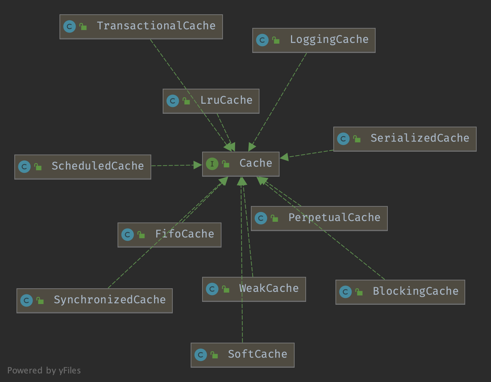

## Introduction


### Cache 层次结构

`package org.apache.ibatis.cache`




每个 namespace 会创建一个 Cache 实例。

Cache 实现必须有一个接收 String 类型 cache id 作为参数的构造函数。

MyBatis 会将 namespace 作为 id 传递给构造函数。

```java
// Cache 提供者的 SPI 接口。
public interface Cache {

  // 此缓存的标识符
  String getId();

  void putObject(Object key, Object value);

  Object getObject(Object key);

  /**
   * 从 3.3.0 版本开始，此方法仅在回滚期间调用，
   * 用于恢复之前缓存中缺失的值。
   * 这允许阻塞缓存释放之前可能加在 key 上的锁。
   * 阻塞缓存在值为 null 时加锁，当值再次可用时释放锁。
   * 这样其他线程将等待值可用，而不是直接访问数据库。
   */
  Object removeObject(Object key);

  /**
   * 清空此缓存实例
   */  
  void clear();

  // 可选。核心不调用此方法。
  int getSize();
  
  /** 
   * 可选。从 3.2.6 开始，核心不再调用此方法。
   * 缓存所需的任何锁定必须由缓存提供者内部提供。
   */
  ReadWriteLock getReadWriteLock();

}
```


Example:

```java
public MyCache(final String id) {
 if (id == null) {
   throw new IllegalArgumentException("Cache instances require an ID");
 }
 this.id = id;
 initialize();
}
```


## BlockingCache

简单的阻塞装饰器，是 EhCache 的 BlockingCache 装饰器的简单低效版本。
当在缓存中找不到元素时，它会在缓存 key 上设置锁。
这样其他线程将等待该元素填充完成，而不是直接访问数据库。


```java
public class BlockingCache implements Cache {

  private long timeout;
  private final Cache delegate;
  private final ConcurrentHashMap<Object, ReentrantLock> locks;
  
   @Override
  public void putObject(Object key, Object value) {
    try {
      delegate.putObject(key, value);
    } finally {
      releaseLock(key);
    }
  }

  @Override
  public Object getObject(Object key) {
    acquireLock(key);
    Object value = delegate.getObject(key);
    if (value != null) {
      releaseLock(key);
    }        
    return value;
  }
}  
   
```


首次获取缓存时创建新的 [ReentrantLock](/docs/CS/Java/JDK/Concurrency/ReentrantLock.md)

```java
private ReentrantLock getLockForKey(Object key) {
  ReentrantLock lock = new ReentrantLock();
  ReentrantLock previous = locks.putIfAbsent(key, lock);
  return previous == null ? lock : previous;
}

private void acquireLock(Object key) {
  Lock lock = getLockForKey(key);
  if (timeout > 0) {
    try {
      boolean acquired = lock.tryLock(timeout, TimeUnit.MILLISECONDS);
      if (!acquired) {
        throw new CacheException("Couldn't get a lock in " + timeout + " for the key " +  key + " at the cache " + delegate.getId());  
      }
    } catch (InterruptedException e) {
      throw new CacheException("Got interrupted while trying to acquire lock for key " + key, e);
    }
  } else {
    lock.lock();
  }
}

private void releaseLock(Object key) {
  ReentrantLock lock = locks.get(key);
  if (lock.isHeldByCurrentThread()) {
    lock.unlock();
  }
}
```


## FifoCache

FIFO（先进先出）缓存装饰器

使用 LinkedList 实现 Deque

```java
@Override
public void putObject(Object key, Object value) {
  cycleKeyList(key);
  delegate.putObject(key, value);
}

private void cycleKeyList(Object key) {
  keyList.addLast(key);
  if (keyList.size() > size) {
    Object oldestKey = keyList.removeFirst();
    delegate.removeObject(oldestKey);
  }
}
```


## LruCache

使用 LinkedHashMap，大小为 1024

```java
public class LruCache implements Cache {

  private final Cache delegate;
  private Map<Object, Object> keyMap;
  private Object eldestKey;

  public LruCache(Cache delegate) {
    this.delegate = delegate;
    setSize(1024);
  }

  @Override
  public String getId() {
    return delegate.getId();
  }

  @Override
  public int getSize() {
    return delegate.getSize();
  }

  public void setSize(final int size) {
    keyMap = new LinkedHashMap<Object, Object>(size, .75F, true) {
      private static final long serialVersionUID = 4267176411845948333L;

      @Override
      protected boolean removeEldestEntry(Map.Entry<Object, Object> eldest) {
        boolean tooBig = size() > size;
        if (tooBig) {
          eldestKey = eldest.getKey();
        }
        return tooBig;
      }
    };
  }

  private void cycleKeyList(Object key) {
    keyMap.put(key, key);
    if (eldestKey != null) {
      delegate.removeObject(eldestKey);
      eldestKey = null;
    }
  }
}
```


## SynchronizedCache

使用 synchronized 装饰 Cache 的 put 和 get 方法


## 二级缓存

@CacheNamespace

在 [CachingExecutor](/docs/CS/Framework/MyBatis/Executor.md) 中启用二级缓存

### TransactionalCacheManager

```java
public class TransactionalCacheManager {

  private final Map<Cache, TransactionalCache> transactionalCaches = new HashMap<>();

  public void clear(Cache cache) {
    getTransactionalCache(cache).clear();
  }

  public Object getObject(Cache cache, CacheKey key) {
    return getTransactionalCache(cache).getObject(key);
  }

  public void putObject(Cache cache, CacheKey key, Object value) {
    getTransactionalCache(cache).putObject(key, value);
  }

  public void commit() {
    for (TransactionalCache txCache : transactionalCaches.values()) {
      txCache.commit();
    }
  }

  public void rollback() {
    for (TransactionalCache txCache : transactionalCaches.values()) {
      txCache.rollback();
    }
  }

  private TransactionalCache getTransactionalCache(Cache cache) {
    return transactionalCaches.computeIfAbsent(cache, TransactionalCache::new);
  }

}
```


### TransactionalCache
二级缓存的事务缓冲区。
此类持有所有要在 Session 期间添加到二级缓存的条目。
当调用 commit 时，条目被发送到缓存；如果 Session 回滚，则丢弃条目。
已添加阻塞缓存支持。因此任何返回缓存未命中的 get() 之后都会执行 put()，以便释放与 key 关联的任何锁。


```java
public class TransactionalCache implements Cache {

  private static final Log log = LogFactory.getLog(TransactionalCache.class);

  private final Cache delegate;
  private boolean clearOnCommit;
  private final Map<Object, Object> entriesToAddOnCommit;
  private final Set<Object> entriesMissedInCache;

  public TransactionalCache(Cache delegate) {
    this.delegate = delegate;
    this.clearOnCommit = false;
    this.entriesToAddOnCommit = new HashMap<>();
    this.entriesMissedInCache = new HashSet<>();
  }

  @Override
  public String getId() {
    return delegate.getId();
  }

  @Override
  public int getSize() {
    return delegate.getSize();
  }

  @Override
  public Object getObject(Object key) {
    // issue #116
    Object object = delegate.getObject(key);
    if (object == null) {
      entriesMissedInCache.add(key);
    }
    // issue #146
    if (clearOnCommit) {
      return null;
    } else {
      return object;
    }
  }

  @Override
  public void putObject(Object key, Object object) {
    entriesToAddOnCommit.put(key, object);
  }

  @Override
  public Object removeObject(Object key) {
    return null;
  }

  @Override
  public void clear() {
    clearOnCommit = true;
    entriesToAddOnCommit.clear();
  }

  public void commit() {
    if (clearOnCommit) {
      delegate.clear();
    }
    flushPendingEntries();
    reset();
  }

  public void rollback() {
    unlockMissedEntries();
    reset();
  }

  private void reset() {
    clearOnCommit = false;
    entriesToAddOnCommit.clear();
    entriesMissedInCache.clear();
  }

  private void flushPendingEntries() {
    for (Map.Entry<Object, Object> entry : entriesToAddOnCommit.entrySet()) {
      delegate.putObject(entry.getKey(), entry.getValue());
    }
    for (Object entry : entriesMissedInCache) {
      if (!entriesToAddOnCommit.containsKey(entry)) {
        delegate.putObject(entry, null);
      }
    }
  }

  private void unlockMissedEntries() {
    for (Object entry : entriesMissedInCache) {
      try {
        delegate.removeObject(entry);
      } catch (Exception e) {
    }
  }

}
```


## Links

- [MyBatis](/docs/CS/Framework/MyBatis/MyBatis.md)

## References

1. [Cache - MyBatis](https://mybatis.org/mybatis-3/zh/sqlmap-xml.html#cache)
