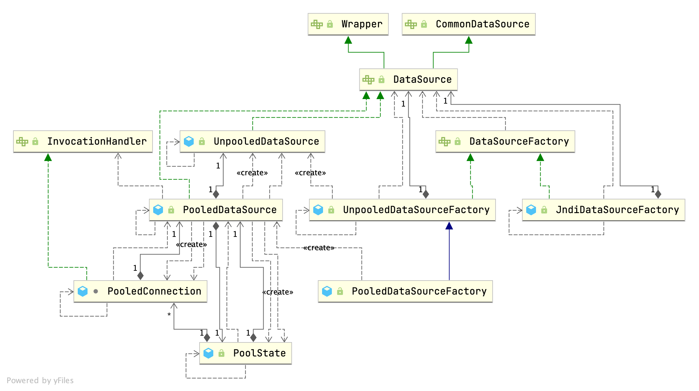

## Introduction

## DataSource

### DataSourceFactory



`DataSourceFactory` 提供 setProperties 和获取 javax.sql.DataSource 的方法

```java
public interface DataSourceFactory {

  void setProperties(Properties props);

  DataSource getDataSource();

}

public class JndiDataSourceFactory implements DataSourceFactory {

  public static final String INITIAL_CONTEXT = "initial_context";
  public static final String DATA_SOURCE = "data_source";
  public static final String ENV_PREFIX = "env.";

  private DataSource dataSource;

  @Override
  public void setProperties(Properties properties) {
    try {
      InitialContext initCtx;
      Properties env = getEnvProperties(properties);
      if (env == null) {
        initCtx = new InitialContext();
      } else {
        initCtx = new InitialContext(env);
      }

      if (properties.containsKey(INITIAL_CONTEXT) && properties.containsKey(DATA_SOURCE)) {
        Context ctx = (Context) initCtx.lookup(properties.getProperty(INITIAL_CONTEXT));
        dataSource = (DataSource) ctx.lookup(properties.getProperty(DATA_SOURCE));
      } else if (properties.containsKey(DATA_SOURCE)) {
        dataSource = (DataSource) initCtx.lookup(properties.getProperty(DATA_SOURCE));
      }

    } catch (NamingException e) {
      throw new DataSourceException("There was an error configuring JndiDataSourceTransactionPool. Cause: " + e, e);
    }
  }
}

public class UnpooledDataSourceFactory implements DataSourceFactory {

  private static final String DRIVER_PROPERTY_PREFIX = "driver.";
  private static final int DRIVER_PROPERTY_PREFIX_LENGTH = DRIVER_PROPERTY_PREFIX.length();

  protected DataSource dataSource;

  public UnpooledDataSourceFactory() {
    this.dataSource = new UnpooledDataSource();
  }

  @Override
  public void setProperties(Properties properties) {
    Properties driverProperties = new Properties();
    MetaObject metaDataSource = SystemMetaObject.forObject(dataSource);
    for (Object key : properties.keySet()) {
      String propertyName = (String) key;
      if (propertyName.startsWith(DRIVER_PROPERTY_PREFIX)) {
        String value = properties.getProperty(propertyName);
        driverProperties.setProperty(propertyName.substring(DRIVER_PROPERTY_PREFIX_LENGTH), value);
      } else if (metaDataSource.hasSetter(propertyName)) {
        String value = (String) properties.get(propertyName);
        Object convertedValue = convertValue(metaDataSource, propertyName, value);
        metaDataSource.setValue(propertyName, convertedValue);
      } else {
        throw new DataSourceException("Unknown DataSource property: " + propertyName);
      }
    }
    if (driverProperties.size() > 0) {
      metaDataSource.setValue("driverProperties", driverProperties);
    }
  }
}

public class PooledDataSourceFactory extends UnpooledDataSourceFactory {

  public PooledDataSourceFactory() {
    this.dataSource = new PooledDataSource();
  }

}
```

### UnpooledDataSource

```java
public class UnpooledDataSource implements DataSource {

  private ClassLoader driverClassLoader;
  private Properties driverProperties;
  private static Map<String, Driver> registeredDrivers = new ConcurrentHashMap<>();

  private String driver;
  private String url;
  private String username;
  private String password;

  private Boolean autoCommit;
  private Integer defaultTransactionIsolationLevel;
  private Integer defaultNetworkTimeout;
  
   static {
    Enumeration<Driver> drivers = DriverManager.getDrivers();
    while (drivers.hasMoreElements()) {
      Driver driver = drivers.nextElement();
      registeredDrivers.put(driver.getClass().getName(), driver);
    }
  }
  
  
  private Connection doGetConnection(Properties properties) throws SQLException {
    initializeDriver();
    Connection connection = DriverManager.getConnection(url, properties);
    configureConnection(connection);
    return connection;
  }

  private synchronized void initializeDriver() throws SQLException {
    if (!registeredDrivers.containsKey(driver)) {
      Class<?> driverType;
      try {
        if (driverClassLoader != null) {
          driverType = Class.forName(driver, true, driverClassLoader);
        } else {
          driverType = Resources.classForName(driver);
        }
        // DriverManager requires the driver to be loaded via the system ClassLoader.
        // http://www.kfu.com/~nsayer/Java/dyn-jdbc.html
        Driver driverInstance = (Driver) driverType.getDeclaredConstructor().newInstance();
        DriverManager.registerDriver(new DriverProxy(driverInstance));
        registeredDrivers.put(driver, driverInstance);
      } catch (Exception e) {
        throw new SQLException("Error setting driver on UnpooledDataSource. Cause: " + e);
      }
    }
  }

  private void configureConnection(Connection conn) throws SQLException {
    if (defaultNetworkTimeout != null) {
      conn.setNetworkTimeout(Executors.newSingleThreadExecutor(), defaultNetworkTimeout);
    }
    if (autoCommit != null && autoCommit != conn.getAutoCommit()) {
      conn.setAutoCommit(autoCommit);
    }
    if (defaultTransactionIsolationLevel != null) {
      conn.setTransactionIsolation(defaultTransactionIsolationLevel);
    }
  }
}
```

### PooledDataSource

```java
/**
 * 一个简单、同步、线程安全的数据库连接池。
 */
public class PooledDataSource implements DataSource {

  private static final Log log = LogFactory.getLog(PooledDataSource.class);

  private final PoolState state = new PoolState(this);

  private final UnpooledDataSource dataSource;

  // OPTIONAL CONFIGURATION FIELDS
  protected int poolMaximumActiveConnections = 10;
  protected int poolMaximumIdleConnections = 5;
  protected int poolMaximumCheckoutTime = 20000;
  protected int poolTimeToWait = 20000;
  protected int poolMaximumLocalBadConnectionTolerance = 3;
  protected String poolPingQuery = "NO PING QUERY SET";
  protected boolean poolPingEnabled;
  protected int poolPingConnectionsNotUsedFor;

  private int expectedConnectionTypeCode;

  public PooledDataSource() {
    dataSource = new UnpooledDataSource();
  }
```

### PoolState

```java
public class PoolState {

  protected PooledDataSource dataSource;

  protected final List<PooledConnection> idleConnections = new ArrayList<>();
  protected final List<PooledConnection> activeConnections = new ArrayList<>();
  protected long requestCount = 0;
  protected long accumulatedRequestTime = 0;
  protected long accumulatedCheckoutTime = 0;
  protected long claimedOverdueConnectionCount = 0;
  protected long accumulatedCheckoutTimeOfOverdueConnections = 0;
  protected long accumulatedWaitTime = 0;
  protected long hadToWaitCount = 0;
  protected long badConnectionCount = 0;
}
```

### PooledConnection

```java
class PooledConnection implements InvocationHandler {

  private static final String CLOSE = "close";
  private static final Class<?>[] IFACES = new Class<?>[] { Connection.class };

  private final int hashCode;
  private final PooledDataSource dataSource;
  private final Connection realConnection;
  private final Connection proxyConnection;
  private long checkoutTimestamp;
  private long createdTimestamp;
  private long lastUsedTimestamp;
  private int connectionTypeCode;
  private boolean valid;

  /**
   * 使用传入的 Connection 和 PooledDataSource 构造 PooledConnection。
   *
   * @param connection
   *          - 作为池化连接呈现的连接
   * @param dataSource
   *          - 连接所属的数据源
   */
  public PooledConnection(Connection connection, PooledDataSource dataSource) {
    this.hashCode = connection.hashCode();
    this.realConnection = connection;
    this.dataSource = dataSource;
    this.createdTimestamp = System.currentTimeMillis();
    this.lastUsedTimestamp = System.currentTimeMillis();
    this.valid = true;
    this.proxyConnection = (Connection) Proxy.newProxyInstance(Connection.class.getClassLoader(), IFACES, this);
  }

  /**
   * 检查连接是否可用。
   *
   * @return 如果连接可用则返回 true
   */
  public boolean isValid() {
    return valid && realConnection != null && dataSource.pingConnection(this);
  }

  /**
   * InvocationHandler 接口所需实现。
   *
   * @param proxy  - 未使用
   * @param method - 要执行的方法
   * @param args - 传递给方法的参数
   */
  @Override
  public Object invoke(Object proxy, Method method, Object[] args) throws Throwable {
    String methodName = method.getName();
    if (CLOSE.equals(methodName)) {
      dataSource.pushConnection(this);
      return null;
    }
    try {
      if (!Object.class.equals(method.getDeclaringClass())) {
        // issue #579 toString() should never fail
        // throw an SQLException instead of a Runtime
        checkConnection();
      }
      return method.invoke(realConnection, args);
    } catch (Throwable t) {
      throw ExceptionUtil.unwrapThrowable(t);
    }

  }

  private void checkConnection() throws SQLException {
    if (!valid) {
      throw new SQLException("Error accessing PooledConnection. Connection is invalid.");
    }
  }

}
```

#### pushConnection

```java
protected void pushConnection(PooledConnection conn) throws SQLException {

  synchronized (state) {
    state.activeConnections.remove(conn);
    if (conn.isValid()) {
      if (state.idleConnections.size() < poolMaximumIdleConnections && conn.getConnectionTypeCode() == expectedConnectionTypeCode) {
        state.accumulatedCheckoutTime += conn.getCheckoutTime();
        if (!conn.getRealConnection().getAutoCommit()) {
          conn.getRealConnection().rollback();
        }
        PooledConnection newConn = new PooledConnection(conn.getRealConnection(), this);
        state.idleConnections.add(newConn);
        newConn.setCreatedTimestamp(conn.getCreatedTimestamp());
        newConn.setLastUsedTimestamp(conn.getLastUsedTimestamp());
        conn.invalidate();
        state.notifyAll();
      } else {
        state.accumulatedCheckoutTime += conn.getCheckoutTime();
        if (!conn.getRealConnection().getAutoCommit()) {
          conn.getRealConnection().rollback();
        }
        conn.getRealConnection().close();
        conn.invalidate();
      }
    } else {
      state.badConnectionCount++;
    }
  }
}
```

#### popConnection

```java
private PooledConnection popConnection(String username, String password) throws SQLException {
  boolean countedWait = false;
  PooledConnection conn = null;
  long t = System.currentTimeMillis();
  int localBadConnectionCount = 0;

  while (conn == null) {
    synchronized (state) {
      if (!state.idleConnections.isEmpty()) {
        // 池中有可用连接
        conn = state.idleConnections.remove(0);
      } else {
        // 池中没有可用连接
        if (state.activeConnections.size() < poolMaximumActiveConnections) {
          // 可以创建新连接
          conn = new PooledConnection(dataSource.getConnection(), this);
        } else {
          // 无法创建新连接
          PooledConnection oldestActiveConnection = state.activeConnections.get(0);
          long longestCheckoutTime = oldestActiveConnection.getCheckoutTime();
          if (longestCheckoutTime > poolMaximumCheckoutTime) {
            // 可以回收超时连接
            state.claimedOverdueConnectionCount++;
            state.accumulatedCheckoutTimeOfOverdueConnections += longestCheckoutTime;
            state.accumulatedCheckoutTime += longestCheckoutTime;
            state.activeConnections.remove(oldestActiveConnection);
            if (!oldestActiveConnection.getRealConnection().getAutoCommit()) {
              try {
                oldestActiveConnection.getRealConnection().rollback();
              } catch (SQLException e) {
                /*
                   仅记录调试消息，然后继续执行后续语句，就像什么都没发生一样。
                   将坏连接包装到新的 PooledConnection 中，这有助于不中断当前执行线程，
                   并给当前线程一个机会参与下一次竞争以获取有效的数据库连接。
                   在此循环结束时，坏的 {@link @conn} 将被设置为 null。
                 */
                log.debug("Bad connection. Could not roll back");
              }
            }
            conn = new PooledConnection(oldestActiveConnection.getRealConnection(), this);
            conn.setCreatedTimestamp(oldestActiveConnection.getCreatedTimestamp());
            conn.setLastUsedTimestamp(oldestActiveConnection.getLastUsedTimestamp());
            oldestActiveConnection.invalidate();
          } else {
            // 必须等待
            try {
              if (!countedWait) {
                state.hadToWaitCount++;
                countedWait = true;
              }
              long wt = System.currentTimeMillis();
              state.wait(poolTimeToWait);
              state.accumulatedWaitTime += System.currentTimeMillis() - wt;
            } catch (InterruptedException e) {
              break;
            }
          }
        }
      }
      if (conn != null) {
        // ping 服务器检查连接是否有效
        if (conn.isValid()) {
          if (!conn.getRealConnection().getAutoCommit()) {
            conn.getRealConnection().rollback();
          }
          conn.setConnectionTypeCode(assembleConnectionTypeCode(dataSource.getUrl(), username, password));
          conn.setCheckoutTimestamp(System.currentTimeMillis());
          conn.setLastUsedTimestamp(System.currentTimeMillis());
          state.activeConnections.add(conn);
          state.requestCount++;
          state.accumulatedRequestTime += System.currentTimeMillis() - t;
        } else {
          state.badConnectionCount++;
          localBadConnectionCount++;
          conn = null;
          if (localBadConnectionCount > (poolMaximumIdleConnections + poolMaximumLocalBadConnectionTolerance)) {
            throw new SQLException("PooledDataSource: Could not get a good connection to the database.");
          }
        }
      }
    }

  }

  if (conn == null) {
    throw new SQLException("PooledDataSource: Unknown severe error condition.  The connection pool returned a null connection.");
  }

  return conn;
}
```

#### pingConnection

```java
/**
 * 检查连接是否仍然可用。
 *
 * @param conn
 *          - 要检查的连接
 * @return 如果连接仍然可用则返回 true
 */
protected boolean pingConnection(PooledConnection conn) {
  boolean result = true;

  try {
    result = !conn.getRealConnection().isClosed();
  } catch (SQLException e) {
    result = false;
  }

  if (result && poolPingEnabled && poolPingConnectionsNotUsedFor >= 0
      && conn.getTimeElapsedSinceLastUse() > poolPingConnectionsNotUsedFor) {
    try {
      Connection realConn = conn.getRealConnection();
      try (Statement statement = realConn.createStatement()) {
        statement.executeQuery(poolPingQuery).close();
      }
      if (!realConn.getAutoCommit()) {
        realConn.rollback();
      }
      result = true;
    } catch (Exception e) {
      log.warn("Execution of ping query '" + poolPingQuery + "' failed: " + e.getMessage());
      try {
        conn.getRealConnection().close();
      } catch (Exception e2) {
        // ignore
      }
      result = false;
    }
  }
  return result;
}

/**
 * 解包池化连接以获取"真实"连接。
 *
 * @param conn
 *          - 要解包的池化连接
 * @return "真实"连接
 */
public static Connection unwrapConnection(Connection conn) {
  if (Proxy.isProxyClass(conn.getClass())) {
    InvocationHandler handler = Proxy.getInvocationHandler(conn);
    if (handler instanceof PooledConnection) {
      return ((PooledConnection) handler).getRealConnection();
    }
  }
  return conn;
}
```

#### forceCloseAll

关闭池中所有活动和空闲连接。该方法在 finalize 中调用

```java
public void forceCloseAll() {
  synchronized (state) {
    expectedConnectionTypeCode = assembleConnectionTypeCode(dataSource.getUrl(), dataSource.getUsername(), dataSource.getPassword());
    for (int i = state.activeConnections.size(); i > 0; i--) {
      try {
        PooledConnection conn = state.activeConnections.remove(i - 1);
        conn.invalidate();

        Connection realConn = conn.getRealConnection();
        if (!realConn.getAutoCommit()) {
          realConn.rollback();
        }
        realConn.close();
      } catch (Exception e) {
        // ignore
      }
    }
    for (int i = state.idleConnections.size(); i > 0; i--) {
      try {
        PooledConnection conn = state.idleConnections.remove(i - 1);
        conn.invalidate();

        Connection realConn = conn.getRealConnection();
        if (!realConn.getAutoCommit()) {
          realConn.rollback();
        }
        realConn.close();
      } catch (Exception e) {
        // ignore
      }
    }
  }
}
```

#### pingConnection

检查连接是否仍然可用，如果可用则返回 true

```java
protected boolean pingConnection(PooledConnection conn) {
  boolean result = true;

  try {
    result = !conn.getRealConnection().isClosed();
  } catch (SQLException e) {
    result = false;
  }

  if (result && poolPingEnabled && poolPingConnectionsNotUsedFor >= 0
      && conn.getTimeElapsedSinceLastUse() > poolPingConnectionsNotUsedFor) {
    try {
      Connection realConn = conn.getRealConnection();
      try (Statement statement = realConn.createStatement()) {
        statement.executeQuery(poolPingQuery).close();
      }
      if (!realConn.getAutoCommit()) {
        realConn.rollback();
      }
      result = true;
    } catch (Exception e) {
      log.warn("Execution of ping query '" + poolPingQuery + "' failed: " + e.getMessage());
      try {
        conn.getRealConnection().close();
      } catch (Exception e2) {
        // ignore
      }
      result = false;
    }
  }
  return result;
}
```

## Transaction

```java
/**
 * 包装数据库连接。
 * 处理连接的生命周期：创建、准备、提交/回滚和关闭。
 */
public interface Transaction {

  /**
   * 获取内部数据库连接。
   */
  Connection getConnection() throws SQLException;

  /**
   * 提交内部数据库连接。
   */
  void commit() throws SQLException;

  /**
   * 回滚内部数据库连接。
   */
  void rollback() throws SQLException;

  /**
   * 关闭内部数据库连接。
   */
  void close() throws SQLException;

  /**
   * 获取事务超时时间（如果已设置）。
   */
  Integer getTimeout() throws SQLException;

}
```

### TransactionFactory

```java
/**
 * 创建 {@link Transaction} 实例。
 */
public interface TransactionFactory {

  /**
   * 设置事务工厂的自定义属性。
   * @param props
   *          新属性
   */
  default void setProperties(Properties props) {
    // NOP
  }

  /**
   * 从现有连接创建 {@link Transaction}。
   * @param conn 现有数据库连接
   * @return Transaction
   * @since 3.1.0
   */
  Transaction newTransaction(Connection conn);

  /**
   * 从数据源创建 {@link Transaction}。
   * @param dataSource 获取连接的 DataSource
   * @param level 期望的隔离级别
   * @param autoCommit 期望的自动提交模式
   * @return Transaction
   * @since 3.1.0
   */
  Transaction newTransaction(DataSource dataSource, TransactionIsolationLevel level, boolean autoCommit);

}


/**
 * 创建 {@code SpringManagedTransaction}。
 *
 * @author Hunter Presnall
 */
public class SpringManagedTransactionFactory implements TransactionFactory {

  /**
   * {@inheritDoc}
   */
  @Override
  public Transaction newTransaction(DataSource dataSource, TransactionIsolationLevel level, boolean autoCommit) {
    return new SpringManagedTransaction(dataSource);
  }

  /**
   * {@inheritDoc}
   */
  @Override
  public Transaction newTransaction(Connection conn) {
    throw new UnsupportedOperationException("New Spring transactions require a DataSource");
  }

  /**
   * {@inheritDoc}
   */
  @Override
  public void setProperties(Properties props) {
    // not needed in this version
  }
```

### JdbcTransaction

```java
/**
 * 直接使用 JDBC 的提交和回滚功能的 {@link Transaction}。
 * 它依赖于从 dataSource 获取的连接来管理事务范围。
 * 延迟连接获取直到调用 getConnection()。
 * 当 autocommit 开启时忽略提交或回滚请求。
 *
 * @author Clinton Begin
 *
 * @see JdbcTransactionFactory
 */
public class JdbcTransaction implements Transaction {

  private static final Log log = LogFactory.getLog(JdbcTransaction.class);

  protected Connection connection;
  protected DataSource dataSource;
  protected TransactionIsolationLevel level;
  protected boolean autoCommit;

  public JdbcTransaction(DataSource ds, TransactionIsolationLevel desiredLevel, boolean desiredAutoCommit) {
    dataSource = ds;
    level = desiredLevel;
    autoCommit = desiredAutoCommit;
  }

  public JdbcTransaction(Connection connection) {
    this.connection = connection;
  }

  @Override
  public Connection getConnection() throws SQLException {
    if (connection == null) {
      openConnection();
    }
    return connection;
  }

  @Override
  public void commit() throws SQLException {
    if (connection != null && !connection.getAutoCommit()) {
      connection.commit();
    }
  }

  @Override
  public void rollback() throws SQLException {
    if (connection != null && !connection.getAutoCommit()) {
      connection.rollback();
    }
  }

  @Override
  public void close() throws SQLException {
    if (connection != null) {
      resetAutoCommit();
      connection.close();
    }
  }

  protected void setDesiredAutoCommit(boolean desiredAutoCommit) {
    try {
      if (connection.getAutoCommit() != desiredAutoCommit) {
        connection.setAutoCommit(desiredAutoCommit);
      }
    } catch (SQLException e) {
      // 只有实现极差的驱动才会在这里失败，对此我们无能为力。
      throw new TransactionException("Error configuring AutoCommit.  "
          + "Your driver may not support getAutoCommit() or setAutoCommit(). "
          + "Requested setting: " + desiredAutoCommit + ".  Cause: " + e, e);
    }
  }

  protected void resetAutoCommit() {
    try {
      if (!connection.getAutoCommit()) {
        // MyBatis 在仅执行 select 时不会对连接调用 commit/rollback。
        // 某些数据库以 select 语句开始事务，
        // 并要求在关闭连接前执行 commit/rollback。
        // 解决方法是在关闭连接前将 autocommit 设置为 true。
        // Sybase 会在这里抛出异常。
        connection.setAutoCommit(true);
      }
    } catch (SQLException e) {
    }
  }

  protected void openConnection() throws SQLException {
    connection = dataSource.getConnection();
    if (level != null) {
      connection.setTransactionIsolation(level.getLevel());
    }
    setDesiredAutoCommit(autoCommit);
  }

  @Override
  public Integer getTimeout() throws SQLException {
    return null;
  }

}


/**
 * 创建 {@link JdbcTransaction} 实例。
 */
public class JdbcTransactionFactory implements TransactionFactory {

  @Override
  public Transaction newTransaction(Connection conn) {
    return new JdbcTransaction(conn);
  }

  @Override
  public Transaction newTransaction(DataSource ds, TransactionIsolationLevel level, boolean autoCommit) {
    return new JdbcTransaction(ds, level, autoCommit);
  }
}
```

### ManagedTransaction

```java
/**
 * 让容器管理事务完整生命周期的 {@link Transaction}。
 * 延迟连接获取直到调用 getConnection()。
 * 忽略所有提交或回滚请求。
 * 默认情况下关闭连接，但可以配置为不关闭。
 */
public class ManagedTransaction implements Transaction {

  private static final Log log = LogFactory.getLog(ManagedTransaction.class);

  private DataSource dataSource;
  private TransactionIsolationLevel level;
  private Connection connection;
  private final boolean closeConnection;

  public ManagedTransaction(Connection connection, boolean closeConnection) {
    this.connection = connection;
    this.closeConnection = closeConnection;
  }

  public ManagedTransaction(DataSource ds, TransactionIsolationLevel level, boolean closeConnection) {
    this.dataSource = ds;
    this.level = level;
    this.closeConnection = closeConnection;
  }

  @Override
  public Connection getConnection() throws SQLException {
    if (this.connection == null) {
      openConnection();
    }
    return this.connection;
  }

  @Override
  public void commit() throws SQLException {
    // 什么也不做
  }

  @Override
  public void rollback() throws SQLException {
    // 什么也不做
  }

  @Override
  public void close() throws SQLException {
    if (this.closeConnection && this.connection != null) {
      this.connection.close();
    }
  }

  protected void openConnection() throws SQLException {
    this.connection = this.dataSource.getConnection();
    if (this.level != null) {
      this.connection.setTransactionIsolation(this.level.getLevel());
    }
  }

  @Override
  public Integer getTimeout() throws SQLException {
    return null;
  }

}
```

### ManagedTransactionFactory

```java
/**
 * 创建 {@link ManagedTransaction} 实例。
 */
public class ManagedTransactionFactory implements TransactionFactory {

  private boolean closeConnection = true;

  @Override
  public void setProperties(Properties props) {
    if (props != null) {
      String closeConnectionProperty = props.getProperty("closeConnection");
      if (closeConnectionProperty != null) {
        closeConnection = Boolean.parseBoolean(closeConnectionProperty);
      }
    }
  }

  @Override
  public Transaction newTransaction(Connection conn) {
    return new ManagedTransaction(conn, closeConnection);
  }

  @Override
  public Transaction newTransaction(DataSource ds, TransactionIsolationLevel level, boolean autoCommit) {
    // 静默忽略 autocommit 和 isolation level，因为托管事务完全由外部管理器控制。
    // 静默忽略以便代码在托管和非托管配置之间保持可移植性。
    return new ManagedTransaction(ds, level, closeConnection);
  }
}
```

### SpringManagedTransaction

```java
public class SpringManagedTransaction implements Transaction {
    private static final Log LOGGER = LogFactory.getLog(SpringManagedTransaction.class);
    private final DataSource dataSource;
    private Connection connection;
    private boolean isConnectionTransactional;
    private boolean autoCommit;

    public SpringManagedTransaction(DataSource dataSource) {
        Assert.notNull(dataSource, "No DataSource specified");
        this.dataSource = dataSource;
    }

    public Connection getConnection() throws SQLException {
        if (this.connection == null) {
            this.openConnection();
        }

        return this.connection;
    }

    private void openConnection() throws SQLException {
        this.connection = DataSourceUtils.getConnection(this.dataSource);
        this.autoCommit = this.connection.getAutoCommit();
        this.isConnectionTransactional = DataSourceUtils.isConnectionTransactional(this.connection, this.dataSource);
        if (LOGGER.isDebugEnabled()) {
            LOGGER.debug("JDBC Connection [" + this.connection + "] will" + (this.isConnectionTransactional ? " " : " not ") + "be managed by Spring");
        }

    }

    public void commit() throws SQLException {
        if (this.connection != null && !this.isConnectionTransactional && !this.autoCommit) {
            if (LOGGER.isDebugEnabled()) {
                LOGGER.debug("Committing JDBC Connection [" + this.connection + "]");
            }

            this.connection.commit();
        }

    }

    public void rollback() throws SQLException {
        if (this.connection != null && !this.isConnectionTransactional && !this.autoCommit) {
            if (LOGGER.isDebugEnabled()) {
                LOGGER.debug("Rolling back JDBC Connection [" + this.connection + "]");
            }

            this.connection.rollback();
        }

    }

    public void close() throws SQLException {
        DataSourceUtils.releaseConnection(this.connection, this.dataSource);
    }

    public Integer getTimeout() throws SQLException {
        ConnectionHolder holder = (ConnectionHolder)TransactionSynchronizationManager.getResource(this.dataSource);
        return holder != null && holder.hasTimeout() ? holder.getTimeToLiveInSeconds() : null;
    }
}
```

## Links

- [MyBatis](/docs/CS/Framework/MyBatis/MyBatis.md)
