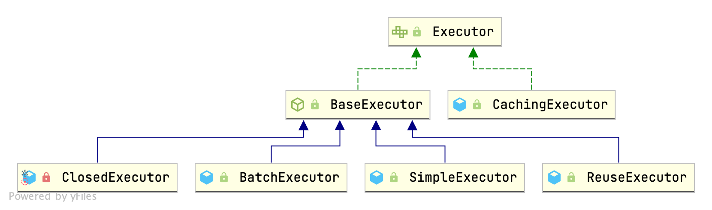

## Introduction

### Executor Hierarchy



> [!TIP]
> 
> All SQLs are executed by Executor

```java
public interface Executor {

  ResultHandler NO_RESULT_HANDLER = null;

  int update(MappedStatement ms, Object parameter) throws SQLException;

  <E> List<E> query(MappedStatement ms, Object parameter, RowBounds rowBounds, ResultHandler resultHandler, CacheKey cacheKey, BoundSql boundSql) throws SQLException;

  <E> List<E> query(MappedStatement ms, Object parameter, RowBounds rowBounds, ResultHandler resultHandler) throws SQLException;

  <E> Cursor<E> queryCursor(MappedStatement ms, Object parameter, RowBounds rowBounds) throws SQLException;

  List<BatchResult> flushStatements() throws SQLException;

  void commit(boolean required) throws SQLException;

  void rollback(boolean required) throws SQLException;

  CacheKey createCacheKey(MappedStatement ms, Object parameterObject, RowBounds rowBounds, BoundSql boundSql);

  boolean isCached(MappedStatement ms, CacheKey key);

  void clearLocalCache();

  void deferLoad(MappedStatement ms, MetaObject resultObject, String property, CacheKey key, Class<?> targetType);

  Transaction getTransaction();

  void close(boolean forceRollback);

  boolean isClosed();

  void setExecutorWrapper(Executor executor);

}
```

default use `SimpleExecutor`, if 2nd Cache enable, wrap to `CachingExecutor`
```java
// Configuration 
public Executor newExecutor(Transaction transaction, ExecutorType executorType) {
    executorType = executorType == null ? defaultExecutorType : executorType;
    executorType = executorType == null ? ExecutorType.SIMPLE : executorType;
    Executor executor;
    if (ExecutorType.BATCH == executorType) {
      executor = new BatchExecutor(this, transaction);
    } else if (ExecutorType.REUSE == executorType) {
      executor = new ReuseExecutor(this, transaction);
    } else {
      executor = new SimpleExecutor(this, transaction);
    }
    if (cacheEnabled) {
      executor = new CachingExecutor(executor);
    }
    executor = (Executor) interceptorChain.pluginAll(executor);
    return executor;
  }
```


## BaseExecutor

`BaseExecutor provider cache management and transaction management`

```java
public abstract class BaseExecutor implements Executor {

  private static final Log log = LogFactory.getLog(BaseExecutor.class);

  protected Transaction transaction;
  protected Executor wrapper;

  protected ConcurrentLinkedQueue<DeferredLoad> deferredLoads;
  protected PerpetualCache localCache;
  protected PerpetualCache localOutputParameterCache;
  protected Configuration configuration;

  protected int queryStack;
  private boolean closed;

  protected BaseExecutor(Configuration configuration, Transaction transaction) {
    this.transaction = transaction;
    this.deferredLoads = new ConcurrentLinkedQueue<DeferredLoad>();
    this.localCache = new PerpetualCache("LocalCache");
    this.localOutputParameterCache = new PerpetualCache("LocalOutputParameterCache");
    this.closed = false;
    this.configuration = configuration;
    this.wrapper = this;
  }
}
```


### Local Cache

clearLocalCache localCache and  localOutputParameterCache will clear when:
- update or close : SESSION
- query
    - queryStack == 0 && ms.isFlushCacheRequired()
    - configuration.getLocalCacheScope() == LocalCacheScope.STATEMENT


```java
public void clearLocalCache() {
  if (!closed) {
    localCache.clear();
    localOutputParameterCache.clear();
  }
}
```


#### query

```java
@SuppressWarnings("unchecked")
  @Override
  public <E> List<E> query(MappedStatement ms, Object parameter, RowBounds rowBounds, ResultHandler resultHandler, CacheKey key, BoundSql boundSql) throws SQLException {
    ErrorContext.instance().resource(ms.getResource()).activity("executing a query").object(ms.getId());
    if (closed) {
      throw new ExecutorException("Executor was closed.");
    }
    if (queryStack == 0 && ms.isFlushCacheRequired()) {
      clearLocalCache();
    }
    List<E> list;
    try {
      queryStack++;
      list = resultHandler == null ? (List<E>) localCache.getObject(key) : null;
      if (list != null) {
        handleLocallyCachedOutputParameters(ms, key, parameter, boundSql);
      } else {
        list = queryFromDatabase(ms, parameter, rowBounds, resultHandler, key, boundSql);
      }
    } finally {
      queryStack--;
    }
    if (queryStack == 0) {
      for (DeferredLoad deferredLoad : deferredLoads) {
        deferredLoad.load();
      }
      // issue #601
      deferredLoads.clear();
      if (configuration.getLocalCacheScope() == LocalCacheScope.STATEMENT) {
        // issue #482
        clearLocalCache();
      }
    }
    return list;
  }
```


#### CacheKey

```java
@Override
  public CacheKey createCacheKey(MappedStatement ms, Object parameterObject, RowBounds rowBounds, BoundSql boundSql) {
    if (closed) {
      throw new ExecutorException("Executor was closed.");
    }
    CacheKey cacheKey = new CacheKey();
    cacheKey.update(ms.getId());
    cacheKey.update(rowBounds.getOffset());
    cacheKey.update(rowBounds.getLimit());
    cacheKey.update(boundSql.getSql());
    List<ParameterMapping> parameterMappings = boundSql.getParameterMappings();
    TypeHandlerRegistry typeHandlerRegistry = ms.getConfiguration().getTypeHandlerRegistry();
    // mimic DefaultParameterHandler logic
    for (ParameterMapping parameterMapping : parameterMappings) {
      if (parameterMapping.getMode() != ParameterMode.OUT) {
        Object value;
        String propertyName = parameterMapping.getProperty();
        if (boundSql.hasAdditionalParameter(propertyName)) {
          value = boundSql.getAdditionalParameter(propertyName);
        } else if (parameterObject == null) {
          value = null;
        } else if (typeHandlerRegistry.hasTypeHandler(parameterObject.getClass())) {
          value = parameterObject;
        } else {
          MetaObject metaObject = configuration.newMetaObject(parameterObject);
          value = metaObject.getValue(propertyName);
        }
        cacheKey.update(value);
      }
    }
    if (configuration.getEnvironment() != null) {
      // issue #176
      cacheKey.update(configuration.getEnvironment().getId());
    }
    return cacheKey;
  }
```


### Transaction Management


```java
public void commit(boolean required) throws SQLException {
  if (closed) throw new ExecutorException("Cannot commit, transaction is already closed");
  clearLocalCache();
  flushStatements();
  if (required) {
    transaction.commit();
  }
}

public void rollback(boolean required) throws SQLException {
  if (!closed) {
    try {
      clearLocalCache();
      flushStatements(true);
    } finally {
      if (required) {
        transaction.rollback();
      }
    }
  }
}
```

### doFlushStatements

Call by SqlSession

flushStatement call doFlushStatements

```java
// BatchExecutor
public List<BatchResult> doFlushStatements(boolean isRollback) throws SQLException {
  try {
    List<BatchResult> results = new ArrayList<BatchResult>();
    if (isRollback) {
      return Collections.emptyList();
    } else {
      for (int i = 0, n = statementList.size(); i < n; i++) {
        Statement stmt = statementList.get(i);
        BatchResult batchResult = batchResultList.get(i);
        try {
          batchResult.setUpdateCounts(stmt.executeBatch());
          MappedStatement ms = batchResult.getMappedStatement();
          List<Object> parameterObjects = batchResult.getParameterObjects();
          KeyGenerator keyGenerator = ms.getKeyGenerator();
          if (keyGenerator instanceof Jdbc3KeyGenerator) {
            Jdbc3KeyGenerator jdbc3KeyGenerator = (Jdbc3KeyGenerator) keyGenerator;
            jdbc3KeyGenerator.processBatch(ms, stmt, parameterObjects);
          } else {
            for (Object parameter : parameterObjects) {
              keyGenerator.processAfter(this, ms, stmt, parameter);
            }
          }
        } catch (BatchUpdateException e) {
          throw new BatchExecutorException("");
        }
        results.add(batchResult);
      }
      return results;
    }
  } finally {
    for (Statement stmt : statementList) {
      closeStatement(stmt);
    }
    currentSql = null;
    statementList.clear();
    batchResultList.clear();
  }
}
```


## SimpleExecutor

1. newStatementHandler
2. get Connection from transaction
3. get Statement
4. [StatementHandler update](/docs/CS/Framework/MyBatis/StatementHandler.md?id=update)
   1. execute
   2. resultSetHandler.handleResultSets(Query) or [keyGenerator::processAfter()](/docs/CS/Framework/MyBatis/KeyGenerator.md?id=processAfter)

```java
public class SimpleExecutor extends BaseExecutor {

  public SimpleExecutor(Configuration configuration, Transaction transaction) {
    super(configuration, transaction);
  }

  @Override
  public int doUpdate(MappedStatement ms, Object parameter) throws SQLException {
    Statement stmt = null;
    try {
      Configuration configuration = ms.getConfiguration();
      StatementHandler handler = configuration.newStatementHandler(this, ms, parameter, RowBounds.DEFAULT, null, null);
      stmt = prepareStatement(handler, ms.getStatementLog());
      return handler.update(stmt);
    } finally {
      closeStatement(stmt);
    }
  }

  @Override
  public <E> List<E> doQuery(MappedStatement ms, Object parameter, RowBounds rowBounds, ResultHandler resultHandler, BoundSql boundSql) throws SQLException {
    Statement stmt = null;
    try {
      Configuration configuration = ms.getConfiguration();
      StatementHandler handler = configuration.newStatementHandler(wrapper, ms, parameter, rowBounds, resultHandler, boundSql);
      stmt = prepareStatement(handler, ms.getStatementLog());
      return handler.<E>query(stmt, resultHandler);
    } finally {
      closeStatement(stmt);
    }
  }
  
  // getConnection from transaction
  protected Connection getConnection(Log statementLog) throws SQLException {
    Connection connection = transaction.getConnection();
    if (statementLog.isDebugEnabled()) { // create JDK Proxy instance
      return ConnectionLogger.newInstance(connection, statementLog, queryStack);
    } else {
      return connection;
    }
  }
  
   private Statement prepareStatement(StatementHandler handler, Log statementLog) throws SQLException {
    Statement stmt;
    Connection connection = getConnection(statementLog);
    stmt = handler.prepare(connection, transaction.getTimeout());
    handler.parameterize(stmt);
    return stmt;
  }
}
```


## ReuseExecutor

use HashMap to reuse Statements.

close Statements and clear map in *doFlushStatements*.

```java
public class ReuseExecutor extends BaseExecutor {

  private final Map<String, Statement> statementMap = new HashMap<String, Statement>();

  public List<BatchResult> doFlushStatements(boolean isRollback) throws SQLException {
    for (Statement stmt : statementMap.values()) {
      closeStatement(stmt);
    }
    statementMap.clear();
    return Collections.emptyList();
  }
  
  private Statement prepareStatement(StatementHandler handler, Log statementLog) throws SQLException {
    Statement stmt;
    BoundSql boundSql = handler.getBoundSql();
    String sql = boundSql.getSql();
    if (hasStatementFor(sql)) {
      stmt = getStatement(sql);
    } else {
      Connection connection = getConnection(statementLog);
      stmt = handler.prepare(connection);
      putStatement(sql, stmt);
    }
    handler.parameterize(stmt);
    return stmt;
  }

  private boolean hasStatementFor(String sql) {
    try {
      return statementMap.keySet().contains(sql) && !statementMap.get(sql).getConnection().isClosed();
    } catch (SQLException e) {
      return false;
    }
  }
}
```


## BatchExecutor

`add continuous SQL statements with the same statement structure to same stmt`

```java
public class BatchExecutor extends BaseExecutor {

  public static final int BATCH_UPDATE_RETURN_VALUE = Integer.MIN_VALUE + 1002;

  private final List<Statement> statementList = new ArrayList<Statement>();
  private final List<BatchResult> batchResultList = new ArrayList<BatchResult>();
  private String currentSql;
  private MappedStatement currentStatement;

  public BatchExecutor(Configuration configuration, Transaction transaction) {
    super(configuration, transaction);
  }

  public int doUpdate(MappedStatement ms, Object parameterObject) throws SQLException {
    final Configuration configuration = ms.getConfiguration();
    final StatementHandler handler = configuration.newStatementHandler(this, ms, parameterObject, RowBounds.DEFAULT, null, null);
    final BoundSql boundSql = handler.getBoundSql();
    final String sql = boundSql.getSql();
    final Statement stmt;
    if (sql.equals(currentSql) && ms.equals(currentStatement)) {
      int last = statementList.size() - 1;
      stmt = statementList.get(last);
      BatchResult batchResult = batchResultList.get(last);
      batchResult.addParameterObject(parameterObject);
    } else {
      Connection connection = getConnection(ms.getStatementLog());
      stmt = handler.prepare(connection);
      currentSql = sql;
      currentStatement = ms;
      statementList.add(stmt);
      batchResultList.add(new BatchResult(ms, sql, parameterObject));
    }
    handler.parameterize(stmt);
    handler.batch(stmt);
    // Integer.MIN_VALUE + 1002
    return BATCH_UPDATE_RETURN_VALUE;
  }
}
```

## CachingExecutor

[2nd Level Cache](/docs/CS/Framework/MyBatis/Cache.md)


```java
public class CachingExecutor implements Executor {

  private final Executor delegate;
  private final TransactionalCacheManager tcm = new TransactionalCacheManager();

  
    @Override
    public <E> List<E> query(MappedStatement ms, Object parameterObject, RowBounds rowBounds, ResultHandler resultHandler) throws SQLException {
        BoundSql boundSql = ms.getBoundSql(parameterObject);
        CacheKey key = createCacheKey(ms, parameterObject, rowBounds, boundSql);
        return query(ms, parameterObject, rowBounds, resultHandler, key, boundSql);
    }

    @Override
    public <E> List<E> query(MappedStatement ms, Object parameterObject, RowBounds rowBounds, ResultHandler resultHandler, CacheKey key, BoundSql boundSql)
            throws SQLException {
        Cache cache = ms.getCache();
        if (cache != null) {
            flushCacheIfRequired(ms);
            if (ms.isUseCache() && resultHandler == null) {
                ensureNoOutParams(ms, boundSql);
                @SuppressWarnings("unchecked")
                List<E> list = (List<E>) tcm.getObject(cache, key);
                if (list == null) {
                    list = delegate.query(ms, parameterObject, rowBounds, resultHandler, key, boundSql);
                    tcm.putObject(cache, key, list); // issue #578 and #116
                }
                return list;
            }
        }
        return delegate.query(ms, parameterObject, rowBounds, resultHandler, key, boundSql);
    }
    
    private void flushCacheIfRequired(MappedStatement ms) {
        Cache cache = ms.getCache();
        if (cache != null && ms.isFlushCacheRequired()) {
            tcm.clear(cache);
        }
    }
}
```


## Links

- [MyBatis](/docs/CS/Framework/MyBatis/MyBatis.md)