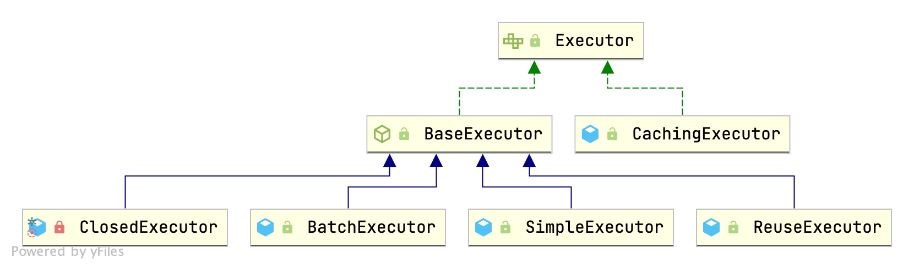

## Introduction

### Executor 层次结构



> [!TIP]
> 
> All SQLs are executed by Executor

```java
public interface Executor {

  ResultHandler NO_RESULT_HANDLER = null;

  int update(MappedStatement ms, Object parameter) throws SQLException;

  <E> List<E> query(MappedStatement ms, Object parameter, RowBounds rowBounds, ResultHandler resultHandler, CacheKey cacheKey, BoundSql boundSql) throws SQLException;

  <E> List<E> query(MappedStatement ms, Object parameter, RowBounds rowBounds, ResultHandler resultHandler) throws SQLException;

  <E> Cursor<E> queryCursor(MappedStatement ms, Object parameter, RowBounds rowBounds) throws SQLException;

  List<BatchResult> flushStatements() throws SQLException;

  void commit(boolean required) throws SQLException;

  void rollback(boolean required) throws SQLException;

  CacheKey createCacheKey(MappedStatement ms, Object parameterObject, RowBounds rowBounds, BoundSql boundSql);

  boolean isCached(MappedStatement ms, CacheKey key);

  void clearLocalCache();

  void deferLoad(MappedStatement ms, MetaObject resultObject, String property, CacheKey key, Class<?> targetType);

  Transaction getTransaction();

  void close(boolean forceRollback);

  boolean isClosed();

  void setExecutorWrapper(Executor executor);

}
```

默认使用 `SimpleExecutor`，如果启用了二级缓存，则包装为 `CachingExecutor`
```java
// Configuration 
public Executor newExecutor(Transaction transaction, ExecutorType executorType) {
    executorType = executorType == null ? defaultExecutorType : executorType;
    executorType = executorType == null ? ExecutorType.SIMPLE : executorType;
    Executor executor;
    if (ExecutorType.BATCH == executorType) {
      executor = new BatchExecutor(this, transaction);
    } else if (ExecutorType.REUSE == executorType) {
      executor = new ReuseExecutor(this, transaction);
    } else {
      executor = new SimpleExecutor(this, transaction);
    }
    if (cacheEnabled) {
      executor = new CachingExecutor(executor);
    }
    executor = (Executor) interceptorChain.pluginAll(executor);
    return executor;
  }
```


## BaseExecutor

`BaseExecutor` 提供缓存管理和事务管理

```java
public abstract class BaseExecutor implements Executor {

  private static final Log log = LogFactory.getLog(BaseExecutor.class);

  protected Transaction transaction;
  protected Executor wrapper;

  protected ConcurrentLinkedQueue<DeferredLoad> deferredLoads;
  protected PerpetualCache localCache;
  protected PerpetualCache localOutputParameterCache;
  protected Configuration configuration;

  protected int queryStack;
  private boolean closed;

  protected BaseExecutor(Configuration configuration, Transaction transaction) {
    this.transaction = transaction;
    this.deferredLoads = new ConcurrentLinkedQueue<DeferredLoad>();
    this.localCache = new PerpetualCache("LocalCache");
    this.localOutputParameterCache = new PerpetualCache("LocalOutputParameterCache");
    this.closed = false;
    this.configuration = configuration;
    this.wrapper = this;
  }
}
```


### 本地缓存

以下情况会清除 localCache 和 localOutputParameterCache：
- update 或 close 时：SESSION 级别清除
- query 时：
    - queryStack == 0 && ms.isFlushCacheRequired()
    - configuration.getLocalCacheScope() == LocalCacheScope.STATEMENT


```java
public void clearLocalCache() {
  if (!closed) {
    localCache.clear();
    localOutputParameterCache.clear();
  }
}
```


#### query

```java
@SuppressWarnings("unchecked")
  @Override
  public <E> List<E> query(MappedStatement ms, Object parameter, RowBounds rowBounds, ResultHandler resultHandler, CacheKey key, BoundSql boundSql) throws SQLException {
    ErrorContext.instance().resource(ms.getResource()).activity("executing a query").object(ms.getId());
    if (closed) {
      throw new ExecutorException("Executor was closed.");
    }
    if (queryStack == 0 && ms.isFlushCacheRequired()) {
      clearLocalCache();
    }
    List<E> list;
    try {
      queryStack++;
      list = resultHandler == null ? (List<E>) localCache.getObject(key) : null;
      if (list != null) {
        handleLocallyCachedOutputParameters(ms, key, parameter, boundSql);
      } else {
        list = queryFromDatabase(ms, parameter, rowBounds, resultHandler, key, boundSql);
      }
    } finally {
      queryStack--;
    }
    if (queryStack == 0) {
      for (DeferredLoad deferredLoad : deferredLoads) {
        deferredLoad.load();
      }
      // issue #601
      deferredLoads.clear();
      if (configuration.getLocalCacheScope() == LocalCacheScope.STATEMENT) {
        // issue #482
        clearLocalCache();
      }
    }
    return list;
  }
```


#### CacheKey

```java
@Override
  public CacheKey createCacheKey(MappedStatement ms, Object parameterObject, RowBounds rowBounds, BoundSql boundSql) {
    if (closed) {
      throw new ExecutorException("Executor was closed.");
    }
    CacheKey cacheKey = new CacheKey();
    cacheKey.update(ms.getId());
    cacheKey.update(rowBounds.getOffset());
    cacheKey.update(rowBounds.getLimit());
    cacheKey.update(boundSql.getSql());
    List<ParameterMapping> parameterMappings = boundSql.getParameterMappings();
    TypeHandlerRegistry typeHandlerRegistry = ms.getConfiguration().getTypeHandlerRegistry();
    // mimic DefaultParameterHandler logic
    for (ParameterMapping parameterMapping : parameterMappings) {
      if (parameterMapping.getMode() != ParameterMode.OUT) {
        Object value;
        String propertyName = parameterMapping.getProperty();
        if (boundSql.hasAdditionalParameter(propertyName)) {
          value = boundSql.getAdditionalParameter(propertyName);
        } else if (parameterObject == null) {
          value = null;
        } else if (typeHandlerRegistry.hasTypeHandler(parameterObject.getClass())) {
          value = parameterObject;
        } else {
          MetaObject metaObject = configuration.newMetaObject(parameterObject);
          value = metaObject.getValue(propertyName);
        }
        cacheKey.update(value);
      }
    }
    if (configuration.getEnvironment() != null) {
      // issue #176
      cacheKey.update(configuration.getEnvironment().getId());
    }
    return cacheKey;
  }
```


### 事务管理


```java
public void commit(boolean required) throws SQLException {
  if (closed) throw new ExecutorException("Cannot commit, transaction is already closed");
  clearLocalCache();
  flushStatements();
  if (required) {
    transaction.commit();
  }
}

public void rollback(boolean required) throws SQLException {
  if (!closed) {
    try {
      clearLocalCache();
      flushStatements(true);
    } finally {
      if (required) {
        transaction.rollback();
      }
    }
  }
}
```

### doFlushStatements

由 SqlSession 调用

flushStatement 调用 doFlushStatements

```java
// BatchExecutor
public List<BatchResult> doFlushStatements(boolean isRollback) throws SQLException {
  try {
    List<BatchResult> results = new ArrayList<BatchResult>();
    if (isRollback) {
      return Collections.emptyList();
    } else {
      for (int i = 0, n = statementList.size(); i < n; i++) {
        Statement stmt = statementList.get(i);
        BatchResult batchResult = batchResultList.get(i);
        try {
          batchResult.setUpdateCounts(stmt.executeBatch());
          MappedStatement ms = batchResult.getMappedStatement();
          List<Object> parameterObjects = batchResult.getParameterObjects();
          KeyGenerator keyGenerator = ms.getKeyGenerator();
          if (keyGenerator instanceof Jdbc3KeyGenerator) {
            Jdbc3KeyGenerator jdbc3KeyGenerator = (Jdbc3KeyGenerator) keyGenerator;
            jdbc3KeyGenerator.processBatch(ms, stmt, parameterObjects);
          } else {
            for (Object parameter : parameterObjects) {
              keyGenerator.processAfter(this, ms, stmt, parameter);
            }
          }
        } catch (BatchUpdateException e) {
          throw new BatchExecutorException("");
        }
        results.add(batchResult);
      }
      return results;
    }
  } finally {
    for (Statement stmt : statementList) {
      closeStatement(stmt);
    }
    currentSql = null;
    statementList.clear();
    batchResultList.clear();
  }
}
```


## SimpleExecutor

1. 创建 StatementHandler
2. 从 transaction 获取 Connection
3. 获取 Statement
4. [StatementHandler update](/docs/CS/Framework/MyBatis/StatementHandler.md?id=update)
   1. 执行 execute
   2. resultSetHandler.handleResultSets（查询）或 [keyGenerator::processAfter()](/docs/CS/Framework/MyBatis/KeyGenerator.md?id=processAfter)

```java
public class SimpleExecutor extends BaseExecutor {

  public SimpleExecutor(Configuration configuration, Transaction transaction) {
    super(configuration, transaction);
  }

  @Override
  public int doUpdate(MappedStatement ms, Object parameter) throws SQLException {
    Statement stmt = null;
    try {
      Configuration configuration = ms.getConfiguration();
      StatementHandler handler = configuration.newStatementHandler(this, ms, parameter, RowBounds.DEFAULT, null, null);
      stmt = prepareStatement(handler, ms.getStatementLog());
      return handler.update(stmt);
    } finally {
      closeStatement(stmt);
    }
  }

  @Override
  public <E> List<E> doQuery(MappedStatement ms, Object parameter, RowBounds rowBounds, ResultHandler resultHandler, BoundSql boundSql) throws SQLException {
    Statement stmt = null;
    try {
      Configuration configuration = ms.getConfiguration();
      StatementHandler handler = configuration.newStatementHandler(wrapper, ms, parameter, rowBounds, resultHandler, boundSql);
      stmt = prepareStatement(handler, ms.getStatementLog());
      return handler.<E>query(stmt, resultHandler);
    } finally {
      closeStatement(stmt);
    }
  }
  
  // 从 transaction 获取 Connection
  protected Connection getConnection(Log statementLog) throws SQLException {
    Connection connection = transaction.getConnection();
    if (statementLog.isDebugEnabled()) { // 创建 JDK Proxy 实例
      return ConnectionLogger.newInstance(connection, statementLog, queryStack);
    } else {
      return connection;
    }
  }
  
   private Statement prepareStatement(StatementHandler handler, Log statementLog) throws SQLException {
    Statement stmt;
    Connection connection = getConnection(statementLog);
    stmt = handler.prepare(connection, transaction.getTimeout());
    handler.parameterize(stmt);
    return stmt;
  }
}
```


## ReuseExecutor

使用 HashMap 重用 Statement。

在 `doFlushStatements` 中关闭 Statement 并清空 map。

```java
public class ReuseExecutor extends BaseExecutor {

  private final Map<String, Statement> statementMap = new HashMap<String, Statement>();

  public List<BatchResult> doFlushStatements(boolean isRollback) throws SQLException {
    for (Statement stmt : statementMap.values()) {
      closeStatement(stmt);
    }
    statementMap.clear();
    return Collections.emptyList();
  }
  
  private Statement prepareStatement(StatementHandler handler, Log statementLog) throws SQLException {
    Statement stmt;
    BoundSql boundSql = handler.getBoundSql();
    String sql = boundSql.getSql();
    if (hasStatementFor(sql)) {
      stmt = getStatement(sql);
    } else {
      Connection connection = getConnection(statementLog);
      stmt = handler.prepare(connection);
      putStatement(sql, stmt);
    }
    handler.parameterize(stmt);
    return stmt;
  }

  private boolean hasStatementFor(String sql) {
    try {
      return statementMap.keySet().contains(sql) && !statementMap.get(sql).getConnection().isClosed();
    } catch (SQLException e) {
      return false;
    }
  }
}
```


## BatchExecutor

`BatchExecutor` 是 MyBatis 专为**批量 INSERT/UPDATE/DELETE** 设计的执行器。它通过**延迟执行 + JDBC Batch API + SQL 分组复用**机制，将多次单条操作合并为一次网络交互，大幅提升吞吐量

不立即执行，而是将相同结构的 SQL 分组到同一个 PreparedStatement 中，调用 JDBC addBatch() 暂存参数，最终在 commit() 时统一 executeBatch()

```java
public class BatchExecutor extends BaseExecutor {

  public static final int BATCH_UPDATE_RETURN_VALUE = Integer.MIN_VALUE + 1002;

  private final List<Statement> statementList = new ArrayList<Statement>();
  private final List<BatchResult> batchResultList = new ArrayList<BatchResult>();
  private String currentSql;
  private MappedStatement currentStatement;

  public BatchExecutor(Configuration configuration, Transaction transaction) {
    super(configuration, transaction);
  }

  public int doUpdate(MappedStatement ms, Object parameterObject) throws SQLException {
    final Configuration configuration = ms.getConfiguration();
    final StatementHandler handler = configuration.newStatementHandler(this, ms, parameterObject, RowBounds.DEFAULT, null, null);
    final BoundSql boundSql = handler.getBoundSql();
    final String sql = boundSql.getSql();
    final Statement stmt;
    if (sql.equals(currentSql) && ms.equals(currentStatement)) {
      int last = statementList.size() - 1;
      stmt = statementList.get(last);
      BatchResult batchResult = batchResultList.get(last);
      batchResult.addParameterObject(parameterObject);
    } else {
      Connection connection = getConnection(ms.getStatementLog());
      stmt = handler.prepare(connection);
      currentSql = sql;
      currentStatement = ms;
      statementList.add(stmt);
      batchResultList.add(new BatchResult(ms, sql, parameterObject));
    }
    handler.parameterize(stmt);
    handler.batch(stmt);
    // Integer.MIN_VALUE + 1002
    return BATCH_UPDATE_RETURN_VALUE;
  }
}
```

在 MyBatis 中，**Executor 的选择是由 MyBatis 框架自动处理的** 默认配置来自于 `mybatis-config.xml` 会使用 `SimpleExecutor`

需要显式指定 Executor 类型，可以通过 `SqlSessionFactory.openSession()` 方法设置 ExecutorType.BATCH


**现象**：使用 `BatchExecutor` 但性能无提升，甚至比单条更慢。
**原因**：MySQL JDBC 驱动默认**不真正批量**，会将 `addBatch()` 拆解为 N 条独立 SQL 发送。
**解决**：连接 URL 必须添加参数：

jdbc:mysql://host:3306/db?rewriteBatchedStatements=true&useServerPrepStmts=false

批次过大导致 OOM

**现象**：一次性 insert 100 万条抛出 `OutOfMemoryError`。
**原因**：`statementList` 和 JDBC 驱动内部队列会持有所有参数对象的引用。
**解决**：分批提交（推荐 1000~5000 条/批）：

```
for (int i = 0; i < 100000; i++) {
  mapper.insert(user);
  if (i > 0 && i % 1000 == 0) {
    session.commit(); // 触发 flushStatements，释放内存
    session.clearCache(); // 清理一级缓存，防 OOM
  }
}
session.commit();
```

主键回填失败

**现象**：`useGeneratedKeys=true` 但批量插入后拿不到 ID。
**原因**：JDBC `executeBatch()` 默认不支持主键回填。
**解决**：

- MySQL 驱动 5.1.37+/8.0+ 已支持批量主键回填（需开启 `rewriteBatchedStatements`）
- 或使用 `MyBatis-Plus` 等框架的批量主键生成策略


混合 SQL 导致批次频繁断裂

```
mapper.insertA(); // 批次 1
mapper.updateB(); // SQL 不同 → 批次断裂，新建批次 2
mapper.insertA(); // SQL 再次不同 → 批次 3
```

**优化**：按 SQL 类型分组调用，或确保相同操作连续执行，最大化复用 `PreparedStatement`。


## CachingExecutor

[二级缓存](/docs/CS/Framework/MyBatis/Cache.md)


```java
public class CachingExecutor implements Executor {

  private final Executor delegate;
  private final TransactionalCacheManager tcm = new TransactionalCacheManager();

  
    @Override
    public <E> List<E> query(MappedStatement ms, Object parameterObject, RowBounds rowBounds, ResultHandler resultHandler) throws SQLException {
        BoundSql boundSql = ms.getBoundSql(parameterObject);
        CacheKey key = createCacheKey(ms, parameterObject, rowBounds, boundSql);
        return query(ms, parameterObject, rowBounds, resultHandler, key, boundSql);
    }

    @Override
    public <E> List<E> query(MappedStatement ms, Object parameterObject, RowBounds rowBounds, ResultHandler resultHandler, CacheKey key, BoundSql boundSql)
            throws SQLException {
        Cache cache = ms.getCache();
        if (cache != null) {
            flushCacheIfRequired(ms);
            if (ms.isUseCache() && resultHandler == null) {
                ensureNoOutParams(ms, boundSql);
                @SuppressWarnings("unchecked")
                List<E> list = (List<E>) tcm.getObject(cache, key);
                if (list == null) {
                    list = delegate.query(ms, parameterObject, rowBounds, resultHandler, key, boundSql);
                    tcm.putObject(cache, key, list); // issue #578 and #116
                }
                return list;
            }
        }
        return delegate.query(ms, parameterObject, rowBounds, resultHandler, key, boundSql);
    }
    
    private void flushCacheIfRequired(MappedStatement ms) {
        Cache cache = ms.getCache();
        if (cache != null && ms.isFlushCacheRequired()) {
            tcm.clear(cache);
        }
    }
}
```


## 延迟加载

MyBatis 延迟加载的底层通过**动态代理**实现，MyBatis 默认使用 **Javassist** 生成代理类（MyBatis 3.3 之前），3.3 之后支持切换为 **CGLIB**


延迟加载必须使用 `resultMap` + `select` 子查询的方式


延迟加载虽然可以减少不必要的查询，但在某些场景下会导致 **N+1 查询问题**

```java
// 查询 100 个用户
List<User> users = userMapper.selectAll();  // 1 条 SQL

// 遍历访问每个用户的部门
for (User user : users) {
    System.out.println(user.getDept().getName());  // 每次循环触发 1 条 SQL！
}
// 总共执行了 1 + 100 = 101 条 SQL

```

**解决方案**：

| 方案           | 说明                                                      |
| -------------- | --------------------------------------------------------- |
| 改用 JOIN 查询 | 如果关联数据大概率会用到，直接用 JOIN 一次查完            |
| 批量加载       | MyBatis 3.5.9+ 支持 `lazyLoadTriggerMethods` 配置批量触发 |
| 控制访问粒度   | 在业务代码中避免在循环中访问延迟加载属性                  |


> [!TIP]
>
> 延迟加载和 MyBatis 二级缓存能一起用吗？
>
> - 可以，但需要注意：延迟加载触发的子查询也会走缓存。如果主对象在二级缓存中，关联对象的延迟加载可能读到过期的缓存数据。复杂场景下建议关闭二级缓存


Spring 整合 MyBatis 后，延迟加载会不会失效？

- 可能会。如果 Controller 层直接访问延迟属性，但 `SqlSession` 已经关闭了，就会报错。解决方案：使用 `OpenSessionInViewFilter`（Spring MVC）或 `OpenSessionInViewInterceptor`（Spring Boot），让 `SqlSession` 在整个请求期间保持打开


## Links

- [MyBatis](/docs/CS/Framework/MyBatis/MyBatis.md)
