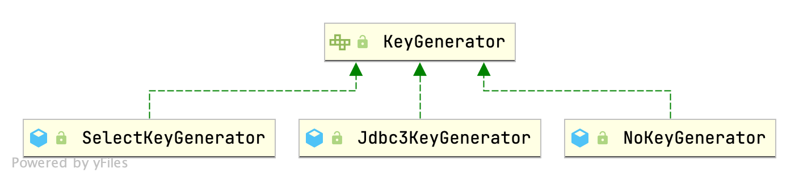

## Introduction


### KeyGenerator Hierarchy




## process

### KeyGenerator

```java
public interface KeyGenerator {

  void processBefore(Executor executor, MappedStatement ms, Statement stmt, Object parameter);

  void processAfter(Executor executor, MappedStatement ms, Statement stmt, Object parameter);

}
```

#### processBefore

call `processBefore` in constructor of BaseStatementHandler

```java
// BaseStatementHandler
protected BaseStatementHandler(Executor executor, MappedStatement mappedStatement, Object parameterObject, RowBounds rowBounds, ResultHandler resultHandler, BoundSql boundSql) {
  ...
    generateKeys(parameterObject);
 ...
}

protected void generateKeys(Object parameter) {
  KeyGenerator keyGenerator = mappedStatement.getKeyGenerator();
  ErrorContext.instance().store();
  keyGenerator.processBefore(executor, mappedStatement, null, parameter);
  ErrorContext.instance().recall();
}
```

#### processAfter

call `processAfter` in *update* method of StatementHandler

```java
// StatementHandler
int update(Statement statement) throws SQLException;


// PreparedStatementHandler
@Override
public int update(Statement statement) throws SQLException {
  PreparedStatement ps = (PreparedStatement) statement;
  ps.execute();
  int rows = ps.getUpdateCount();
  Object parameterObject = boundSql.getParameterObject();
  KeyGenerator keyGenerator = mappedStatement.getKeyGenerator();
  keyGenerator.processAfter(executor, mappedStatement, ps, parameterObject);
  return rows;
}

// SimpleStatementHandler
@Override
public int update(Statement statement) throws SQLException {
  String sql = boundSql.getSql();
  Object parameterObject = boundSql.getParameterObject();
  KeyGenerator keyGenerator = mappedStatement.getKeyGenerator();
  int rows;
  if (keyGenerator instanceof Jdbc3KeyGenerator) {
    statement.execute(sql, Statement.RETURN_GENERATED_KEYS);
    rows = statement.getUpdateCount();
    keyGenerator.processAfter(executor, mappedStatement, statement, parameterObject);
  } else if (keyGenerator instanceof SelectKeyGenerator) {
    statement.execute(sql);
    rows = statement.getUpdateCount();
    keyGenerator.processAfter(executor, mappedStatement, statement, parameterObject);
  } else {
    statement.execute(sql);
    rows = statement.getUpdateCount();
  }
  return rows;
}
```


### Jdbc3KeyGenerator


```java
// Jdbc3KeyGenerator
@Override
public void processBefore(Executor executor, MappedStatement ms, Statement stmt, Object parameter) {
  // do nothing
}

@Override
public void processAfter(Executor executor, MappedStatement ms, Statement stmt, Object parameter) {
  processBatch(ms, stmt, parameter);
}

public void processBatch(MappedStatement ms, Statement stmt, Object parameter) {
  final String[] keyProperties = ms.getKeyProperties();
  if (keyProperties == null || keyProperties.length == 0) {
    return;
  }
  try (ResultSet rs = stmt.getGeneratedKeys()) {
    final ResultSetMetaData rsmd = rs.getMetaData();
    final Configuration configuration = ms.getConfiguration();
    if (rsmd.getColumnCount() < keyProperties.length) {
      // Error?
    } else {
      assignKeys(configuration, rs, rsmd, keyProperties, parameter); //assignKeys
    }
  } catch (Exception e) {
    throw new ExecutorException("Error getting generated key or setting result to parameter object. Cause: " + e, e);
  }
}

private void assignKeys(Configuration configuration, ResultSet rs, ResultSetMetaData rsmd, String[] keyProperties, Object parameter) throws SQLException {
  if (parameter instanceof ParamMap || parameter instanceof StrictMap) {
    // Multi-param or single param with @Param
    assignKeysToParamMap(configuration, rs, rsmd, keyProperties, (Map<String, ?>) parameter);
  } else if (parameter instanceof ArrayList && !((ArrayList<?>) parameter).isEmpty()
             && ((ArrayList<?>) parameter).get(0) instanceof ParamMap) {
    // Multi-param or single param with @Param in batch operation
    assignKeysToParamMapList(configuration, rs, rsmd, keyProperties, (ArrayList<ParamMap<?>>) parameter);
  } else {
    // Single param without @Param
    assignKeysToParam(configuration, rs, rsmd, keyProperties, parameter);
  }
}
```


### SelectKeyGenerator

new keyExecutor and query, the transaction will be closed by parent executor.


```java
// SelectKeyGenerator
@Override
public void processBefore(Executor executor, MappedStatement ms, Statement stmt, Object parameter) {
  if (executeBefore) {
    processGeneratedKeys(executor, ms, parameter);
  }
}

@Override
public void processAfter(Executor executor, MappedStatement ms, Statement stmt, Object parameter) {
  if (!executeBefore) {
    processGeneratedKeys(executor, ms, parameter);
  }
}

private void processGeneratedKeys(Executor executor, MappedStatement ms, Object parameter) {
  try {
    if (parameter != null && keyStatement != null && keyStatement.getKeyProperties() != null) {
      String[] keyProperties = keyStatement.getKeyProperties();
      final Configuration configuration = ms.getConfiguration();
      final MetaObject metaParam = configuration.newMetaObject(parameter);
      // Do not close keyExecutor.
      // The transaction will be closed by parent executor.
      Executor keyExecutor = configuration.newExecutor(executor.getTransaction(), ExecutorType.SIMPLE);
      List<Object> values = keyExecutor.query(keyStatement, parameter, RowBounds.DEFAULT, Executor.NO_RESULT_HANDLER);
      if (values.size() == 0) {
        throw new ExecutorException("SelectKey returned no data.");
      } else if (values.size() > 1) {
        throw new ExecutorException("SelectKey returned more than one value.");
      } else {
        MetaObject metaResult = configuration.newMetaObject(values.get(0));
        if (keyProperties.length == 1) {
          if (metaResult.hasGetter(keyProperties[0])) {
            setValue(metaParam, keyProperties[0], metaResult.getValue(keyProperties[0]));
          } else {
            // no getter for the property - maybe just a single value object
            // so try that
            setValue(metaParam, keyProperties[0], values.get(0));
          }
        } else {
          handleMultipleProperties(keyProperties, metaParam, metaResult);
        }
      }
    }
  } catch (ExecutorException e) {
    throw e;
  } catch (Exception e) {
    throw new ExecutorException("Error selecting key or setting result to parameter object. Cause: " + e, e);
  }
}

private void handleMultipleProperties(String[] keyProperties,
    MetaObject metaParam, MetaObject metaResult) {
  String[] keyColumns = keyStatement.getKeyColumns();

  if (keyColumns == null || keyColumns.length == 0) {
    // no key columns specified, just use the property names
    for (String keyProperty : keyProperties) {
      setValue(metaParam, keyProperty, metaResult.getValue(keyProperty));
    }
  } else {
    if (keyColumns.length != keyProperties.length) {
      throw new ExecutorException("If SelectKey has key columns, the number must match the number of key properties.");
    }
    for (int i = 0; i < keyProperties.length; i++) {
      setValue(metaParam, keyProperties[i], metaResult.getValue(keyColumns[i]));
    }
  }
}

private void setValue(MetaObject metaParam, String property, Object value) {
  if (metaParam.hasSetter(property)) {
    metaParam.setValue(property, value);
  } else {
    throw new ExecutorException("No setter found for the keyProperty '" + property + "' in " + metaParam.getOriginalObject().getClass().getName() + ".");
  }
}
```


## Summary

|               | SelectKeyGenerator                                    | Jdbc3KeyGenerator         |
| ------------- | ----------------------------------------------------- | ------------------------- |
| DB            | Oracle, DB2                                           | MySQL, PostgreSQL         |
| processBefore | call processGeneratedKeys only once(default)          | do nothing                |
| processAfter  | call processGeneratedKeys only once(when order first) | assignKeys from ResultSet |
| Executor      | two executors                                         | One executor              |

All of them set value using [Reflection](/docs/CS/Java/JDK/Basic/Reflection.md)


## Links

- [MyBatis](/docs/CS/Java/MyBatis/MyBatis.md)