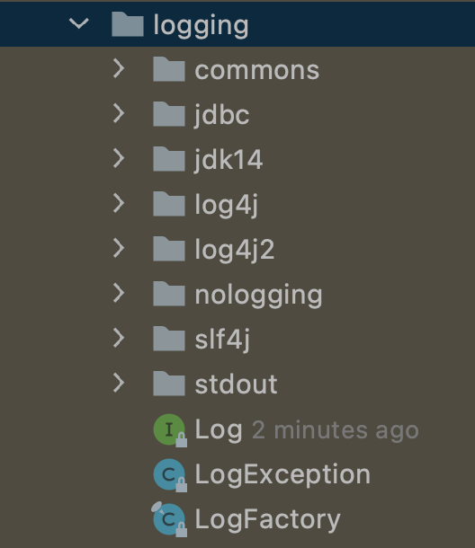
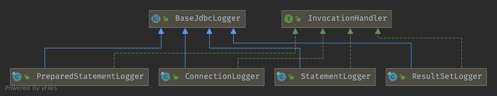

## Introduction

MyBatis 通过内部日志工厂提供日志信息。
内部日志工厂将日志信息委托给以下日志实现之一：

- SLF4J
- Apache Commons Logging
- Log4j 2
- Log4j
- JDK logging

MyBatis 根据运行时自省选择日志实现。
MyBatis 日志工厂会使用它找到的第一个日志实现（按上述顺序搜索）。
如果 MyBatis 未找到任何上述实现，则禁用日志。

### [如何选择不同的日志实现](https://mybatis.org/mybatis-3/logging.html)


## Package




### Log

```java
public interface Log {
    boolean isDebugEnabled();

    boolean isTraceEnabled();

    void error(String var1, Throwable var2);

    void error(String var1);

    void debug(String var1);

    void trace(String var1);

    void warn(String var1);
}
```


### LogFactory

通过 `Constructor::newInstance()` 获取 Log

```java
public final class LogFactory {

  /**
   * 供支持标记的日志实现使用的标记
   */
  public static final String MARKER = "MYBATIS";

  private static Constructor<? extends Log> logConstructor;

  static {
    tryImplementation(new Runnable() {
      @Override
      public void run() {
        useSlf4jLogging();
      }
    });
    tryImplementation(() -> { useCommonsLogging(); });
    tryImplementation(() -> { useLog4J2Logging(); });
    tryImplementation(() -> { seLog4JLogging(); });
    tryImplementation(() -> { useJdkLogging(); });
    tryImplementation(() -> { useNoLogging(); });
  }
  
  
  public static Log getLog(String logger) {
    try {
      return logConstructor.newInstance(logger);
    } catch (Throwable t) {
      throw new LogException("Error creating logger for logger " + logger + ".  Cause: " + t, t);
    }
  }
```


因此日志的顺序在 static 块中确定：

**useSlf4jLogging** 优先

```java
private static void tryImplementation(Runnable runnable) {
    if (logConstructor == null) {
      try {
        runnable.run();
      } catch (Throwable t) {
        // ignore
      }
    }
  }

public static synchronized void useCustomLogging(Class<? extends Log> clazz) {
  setImplementation(clazz);
}

private static void setImplementation(Class<? extends Log> implClass) {
  try {
    Constructor<? extends Log> candidate = implClass.getConstructor(String.class);
    Log log = candidate.newInstance(LogFactory.class.getName());
    logConstructor = candidate;
  } catch (Throwable t) {
    throw new LogException("Error setting Log implementation.  Cause: " + t, t);
  }
}
```


### Logger




### ConnectionLogger

```java
@Override
public Object invoke(Object proxy, Method method, Object[] params)
    throws Throwable {
  try {
    if (Object.class.equals(method.getDeclaringClass())) {
      return method.invoke(this, params);
    }    
    if ("prepareStatement".equals(method.getName())) {
      if (isDebugEnabled()) {
        debug(" Preparing: " + removeBreakingWhitespace((String) params[0]), true);
      }        
      PreparedStatement stmt = (PreparedStatement) method.invoke(connection, params);
      stmt = PreparedStatementLogger.newInstance(stmt, statementLog, queryStack);
      return stmt;
    } else if ("prepareCall".equals(method.getName())) {
      if (isDebugEnabled()) {
        debug(" Preparing: " + removeBreakingWhitespace((String) params[0]), true);
      }        
      PreparedStatement stmt = (PreparedStatement) method.invoke(connection, params);
      stmt = PreparedStatementLogger.newInstance(stmt, statementLog, queryStack);
      return stmt;
    } else if ("createStatement".equals(method.getName())) {
      Statement stmt = (Statement) method.invoke(connection, params);
      stmt = StatementLogger.newInstance(stmt, statementLog, queryStack);
      return stmt;
    } else {
      return method.invoke(connection, params);
    }
  } catch (Throwable t) {
    throw ExceptionUtil.unwrapThrowable(t);
  }
}
```


## Links

- [MyBatis](/docs/CS/Framework/MyBatis/MyBatis.md)
