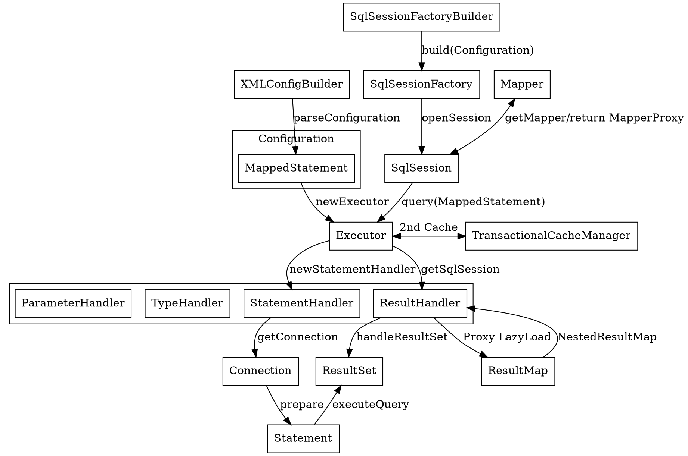

## Introduction

[MyBatis](https://mybatis.org/mybatis-3/) 是一流的持久化框架，支持自定义 SQL、存储过程和高级映射。
MyBatis 消除了几乎所有的 JDBC 代码以及手动设置参数和获取结果的工作。
MyBatis 可以使用简单的 XML 或注解来配置和映射基本类型、Map 接口和 Java POJO（Plain Old Java Objects）到数据库记录。

**与 Hibernate 对比**

|             | MyBatis               | Hibernate       |
| :---------- | --------------------- | --------------- |
| DB          | 依赖数据库             | 数据库无关       |
| SQL         | 手写 SQL              | 少写 SQL         |
|             | 关系导向               | 对象导向         |
| Scalability | 低                    | 高               |
|             |                       |                  |

## Architecture

MyBatis 的核心实现围绕 **"配置驱动 + 动态代理 + 流水线执行 + 插件扩展"** 展开

[Init](/docs/CS/Framework/MyBatis/Init.md)

### Infrastructure

Fig.1. MyBatis 基础设施

- [Binding](/docs/CS/Framework/MyBatis/binding.md)
- [Log](/docs/CS/Framework/MyBatis/Logging.md) 提供 log4j、log4j2、slf4j、jdklog 等日志实现
- [Cache](/docs/CS/Framework/MyBatis/Cache.md)
- [DataSource](/docs/CS/Framework/MyBatis/DataSource.md)
- [Reflector](/docs/CS/Framework/MyBatis/Reflector.md) 表示一组缓存的类定义信息，支持属性名与 getter/setter 方法之间的轻松映射

### Core

- [SQL 执行流程](/docs/CS/Framework/MyBatis/Execute.md)
- [Executor](/docs/CS/Framework/MyBatis/Executor.md)
- [StatementHandler](/docs/CS/Framework/MyBatis/StatementHandler.md)
- [ResultSetHandler](/docs/CS/Framework/MyBatis/ResultSetHandler.md)
- [Interceptor](/docs/CS/Framework/MyBatis/Interceptor.md)
- [KeyGenerator](/docs/CS/Framework/MyBatis/KeyGenerator.md)
- [SqlSession](/docs/CS/Framework/MyBatis/SqlSession.md)

## Extension

[MyBatis-Spring](/docs/CS/Framework/MyBatis/MyBatis-Spring.md): 加载 Mybatis-config.xml，创建 Configuration 和 SqlsessionFactory

### 设计模式

## 设计模式总结

| 模式                        | 在 MyBatis 中的体现                                        | 作用                       |
| --------------------------- | ---------------------------------------------------------- | -------------------------- |
| **Builder**                 | `SqlSessionFactoryBuilder`, `MappedStatement.Builder`      | 复杂对象分步构建           |
| **Factory**                 | `SqlSessionFactory`, `MapperProxyFactory`, `ObjectFactory` | 对象创建解耦               |
| **Proxy**                   | `MapperProxy`, `Plugin`                                    | 无侵入拦截与零实现接口     |
| **Template Method**         | `BaseExecutor.doQuery()`, `StatementHandler`               | 定义执行骨架，子类实现差异 |
| **Decorator**               | `CachingExecutor`, `Log` 实现                              | 动态增强功能（缓存/日志）  |
| **Strategy**                | `Executor`, `StatementHandler`, `TypeHandler`              | 运行时替换算法/策略        |
| **Chain of Responsibility** | 插件拦截链                                                 | 责任链传递请求             |

## Links

- [Spring Framework](/docs/CS/Framework/Spring/Spring.md)
