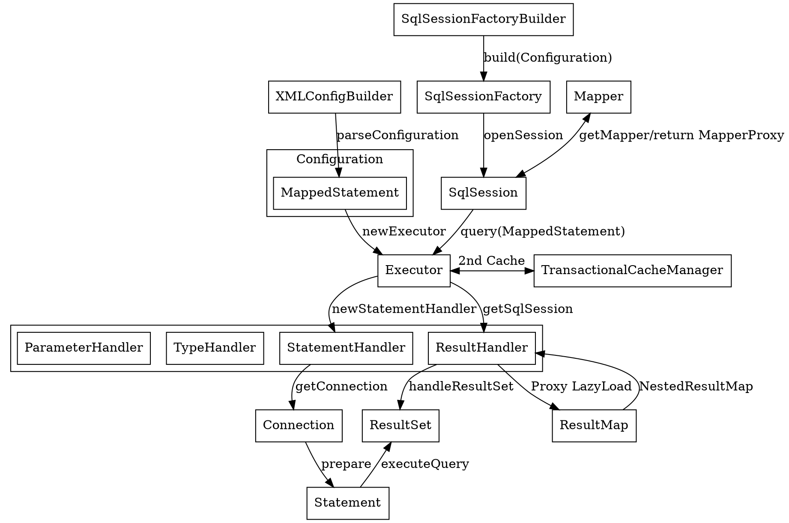

## Introduction

[MyBatis](https://mybatis.org/mybatis-3/) is a first class persistence framework with support for custom SQL, stored procedures and advanced mappings.
MyBatis eliminates almost all of the JDBC code and manual setting of parameters and retrieval of results.
MyBatis can use simple XML or Annotations for configuration and map primitives, Map interfaces and Java POJOs (Plain Old Java Objects) to database records.

**Compare with Hibernate**

|             | MyBatis               | Hibernate       |
| :---------- | --------------------- | --------------- |
| DB          | Depend on DB          | Independent DB  |
| SQL         | write SQL manually    | Less SQL        |
|             | Relationship oriented | Object oriented |
| Scalability | Low                   | High            |
|             |                       |                 |

## Architecture

MyBatis 的核心实现围绕 **“配置驱动 + 动态代理 + 流水线执行 + 插件扩展”** 展开

[Init](/docs/CS/Framework/MyBatis/Init.md)

### Infrastructure

```dot
strict digraph {

    xml [shape="polygon" label="XMLConfigBuilder"]
    subgraph cluster_config {
    label="Configuration"
        ms [shape="polygon" label="MappedStatement"]
    }
    xml -> ms [label="parseConfiguration"]
  
    builder [shape="polygon" label="SqlSessionFactoryBuilder"]
    factory [shape="polygon" label="SqlSessionFactory"]
    session [shape="polygon" label="SqlSession"]
    builder -> factory [label="build(Configuration)"]
    factory -> session [label="openSession"]
    executor [shape="polygon" label="Executor"]
  
    ms -> executor [label="newExecutor" ltail=executor lhead=cluster_config]
  
  
    mapper [shape="polygon" label="Mapper"]
    mapper -> session [label="getMapper/return MapperProxy" dir = both]
  
    cache [shape="polygon" label="TransactionalCacheManager"]
    {rank="same"; executor;cache;}
    executor -> cache [label="2nd Cache" dir = both]
  
    subgraph cluster_handler {
        sh [shape="polygon" label="StatementHandler"]
        rh [shape="polygon" label="ResultHandler"]
        th [shape="polygon" label="TypeHandler"]
        ph [shape="polygon" label="ParameterHandler"]
        {rank="same"; sh;th;ph;rh;}
  
    }
  
    session -> executor [label="query(MappedStatement)"]
    executor -> sh [label="newStatementHandler" ]
    executor -> rh [label="getSqlSession"]
  
    conn [shape="polygon" label="Connection"]
    sh -> conn [label="getConnection"]
    conn -> st [label="prepare"]
  
    st [shape="polygon" label="Statement"]

    re [shape="polygon" label="ResultSet"]
    map [shape="polygon" label="ResultMap"]
    {rank="same"; conn;re;}
  
    st -> re [label="executeQuery"]
    rh -> re [label="handleResultSet"]
    map -> rh [label="NestedResultMap"]
    rh -> map [label="Proxy LazyLoad"]
  
}
```

Fig.1. MyBatis Infrastructure

- [Binding](/docs/CS/Framework/MyBatis/binding.md)
- [Log](/docs/CS/Framework/MyBatis/Logging.md) provide log4j log4j2 slf4j jdklog and so on
- [Cache](/docs/CS/Framework/MyBatis/Cache.md)
- [DataSource](/docs/CS/Framework/MyBatis/DataSource.md)
- [Reflector](/docs/CS/Framework/MyBatis/Reflector.md) class represents a cached set of class definition information that allows for easy mapping between property names and getter/setter methods.`

### Core

- [How SQL works](/docs/CS/Framework/MyBatis/Execute.md)
- [Executor](/docs/CS/Framework/MyBatis/Executor.md)
- [StatementHandler](/docs/CS/Framework/MyBatis/StatementHandler.md)
- [ResultSetHandler](/docs/CS/Framework/MyBatis/ResultSetHandler.md)
- [Interceptor](/docs/CS/Framework/MyBatis/Interceptor.md)
- [KeyGenerator](/docs/CS/Framework/MyBatis/KeyGenerator.md)
- [SqlSession](/docs/CS/Framework/MyBatis/SqlSession.md)

## Extension

[MyBatis-Spring](/docs/CS/Framework/MyBatis/MyBatis-Spring.md) : Load Mybatis-config.xml, create Configuration and SqlsessionFactory

### Design Patterns

## Design Pattern Summary

| 模式                        | 在 MyBatis 中的体现                                        | 作用                       |
| --------------------------- | ---------------------------------------------------------- | -------------------------- |
| **Builder**                 | `SqlSessionFactoryBuilder`, `MappedStatement.Builder`      | 复杂对象分步构建           |
| **Factory**                 | `SqlSessionFactory`, `MapperProxyFactory`, `ObjectFactory` | 对象创建解耦               |
| **Proxy**                   | `MapperProxy`, `Plugin`                                    | 无侵入拦截与零实现接口     |
| **Template Method**         | `BaseExecutor.doQuery()`, `StatementHandler`               | 定义执行骨架，子类实现差异 |
| **Decorator**               | `CachingExecutor`, `Log` 实现                              | 动态增强功能（缓存/日志）  |
| **Strategy**                | `Executor`, `StatementHandler`, `TypeHandler`              | 运行时替换算法/策略        |
| **Chain of Responsibility** | 插件拦截链                                                 | 责任链传递请求             |

## Links

- [MyBatis 目录索引（按层导航）](/docs/CS/Framework/MyBatis/README.md)
- [Spring Framework](/docs/CS/Framework/Spring/Spring.md)
- [Hibernate](/docs/CS/Framework/Hibernate/Hibernate.md)
