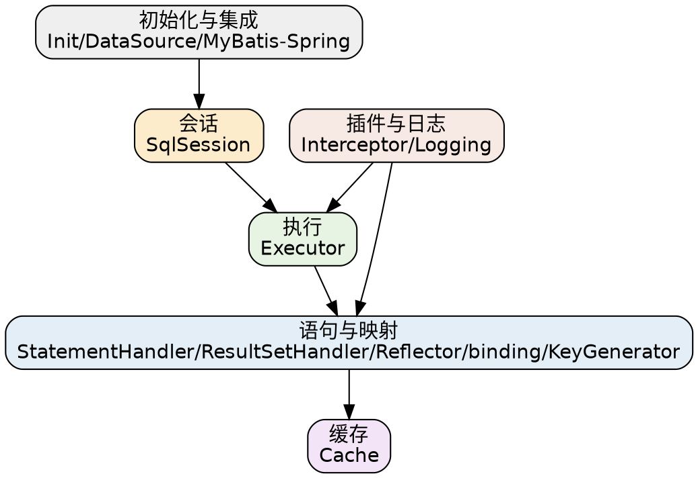

## Introduction

本目录是 **MyBatis** 的专题索引。MyBatis 的主线是一条「一次查询的执行链路」：`SqlSession` 委托 `Executor` → 经 `StatementHandler` 执行 JDBC → `ResultSetHandler` 映射结果，整条链上可挂 `Interceptor` 插件、`Cache` 二级缓存。本目录按这条链路 + 初始化 + 集成分组收录。

## 会话与执行

- [SqlSession](/docs/CS/Framework/MyBatis/SqlSession.md)：会话对象、生命周期、Mapper 代理。
- [Executor](/docs/CS/Framework/MyBatis/Executor.md)：执行器（Simple / Reuse / Batch）与一级缓存。
- [Execute](/docs/CS/Framework/MyBatis/Execute.md)：一条 SQL 的完整执行流程串讲。

## 语句与结果映射

- [StatementHandler](/docs/CS/Framework/MyBatis/StatementHandler.md)：`Statement` 封装、`#{}` 与 `${}` 差异、预编译。
- [ResultSetHandler](/docs/CS/Framework/MyBatis/ResultSetHandler.md)：结果集处理、`TypeHandler`。
- [Reflector](/docs/CS/Framework/MyBatis/Reflector.md)：反射与属性映射、getter 探测。
- [binding](/docs/CS/Framework/MyBatis/binding.md)：参数绑定规则、#{ } 占位符解析。
- [KeyGenerator](/docs/CS/Framework/MyBatis/KeyGenerator.md)：主键生成（自增 / selectKey）。

## 缓存

- [Cache](/docs/CS/Framework/MyBatis/Cache.md)：一级 / 二级缓存、失效策略、Redis 扩展。

## 插件与日志

- [Interceptor](/docs/CS/Framework/MyBatis/Interceptor.md)：MyBatis 插件机制（拦截 `Executor` / `StatementHandler` / `ResultSetHandler`）、分页等常见插件。
- [Logging](/docs/CS/Framework/MyBatis/Logging.md)：日志体系与 MyBatis 内部日志接入。

## 初始化与集成

- [Init](/docs/CS/Framework/MyBatis/Init.md)：启动与配置解析、`Configuration`、Mapper 解析。
- [DataSource](/docs/CS/Framework/MyBatis/DataSource.md)：数据源与事务。
- [MyBatis-Spring](/docs/CS/Framework/MyBatis/MyBatis-Spring.md)：与 Spring 集成（`SqlSessionFactoryBean`、Mapper 扫描、事务同步）。

## Links

- [MyBatis（架构与入口）](/docs/CS/Framework/MyBatis/MyBatis.md)
- [Hibernate（JPA 另一条持久层路线）](/docs/CS/Framework/Hibernate/Hibernate.md)
- [Spring Data（Spring 侧持久层）](/docs/CS/Framework/Spring/Data.md)
- [Framework 总索引](/docs/CS/Framework/README.md)

## References

1. [MyBatis 3 Documentation](https://mybatis.org/mybatis-3/)
2. [MyBatis Source (GitHub)](https://github.com/mybatis/mybatis-3)
