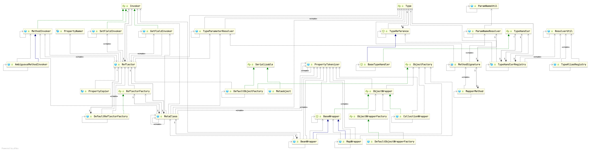

## Introduction


MetaObject

MetaClass

DefaultObjectFactory


### Reflector Hierarchy



## Factory

```java
/**
 * This class represents a cached set of class definition information that
 * allows for easy mapping between property names and getter/setter methods.
 */
public class Reflector {

  private final Class<?> type;
  private final String[] readablePropertyNames;
  private final String[] writablePropertyNames;
  private final Map<String, Invoker> setMethods = new HashMap<>();
  private final Map<String, Invoker> getMethods = new HashMap<>();
  private final Map<String, Class<?>> setTypes = new HashMap<>();
  private final Map<String, Class<?>> getTypes = new HashMap<>();
  private Constructor<?> defaultConstructor;

  private Map<String, String> caseInsensitivePropertyMap = new HashMap<>();

  public Reflector(Class<?> clazz) {
    type = clazz;
    addDefaultConstructor(clazz);
    addGetMethods(clazz);
    addSetMethods(clazz);
    addFields(clazz);
    readablePropertyNames = getMethods.keySet().toArray(new String[0]);
    writablePropertyNames = setMethods.keySet().toArray(new String[0]);
    for (String propName : readablePropertyNames) {
      caseInsensitivePropertyMap.put(propName.toUpperCase(Locale.ENGLISH), propName);
    }
    for (String propName : writablePropertyNames) {
      caseInsensitivePropertyMap.put(propName.toUpperCase(Locale.ENGLISH), propName);
    }
  }
  
  
  private void addDefaultConstructor(Class<?> clazz) {
    Constructor<?>[] constructors = clazz.getDeclaredConstructors();
    Arrays.stream(constructors).filter(constructor -> constructor.getParameterTypes().length == 0)
      .findAny().ifPresent(constructor -> this.defaultConstructor = constructor);
  }

  private void addGetMethods(Class<?> clazz) {
    Map<String, List<Method>> conflictingGetters = new HashMap<>();
    Method[] methods = getClassMethods(clazz);
    Arrays.stream(methods).filter(m -> m.getParameterTypes().length == 0 && PropertyNamer.isGetter(m.getName()))
      .forEach(m -> addMethodConflict(conflictingGetters, PropertyNamer.methodToProperty(m.getName()), m));
    resolveGetterConflicts(conflictingGetters);
  }

  private void resolveGetterConflicts(Map<String, List<Method>> conflictingGetters) {
    for (Entry<String, List<Method>> entry : conflictingGetters.entrySet()) {
      Method winner = null;
      String propName = entry.getKey();
      boolean isAmbiguous = false;
      for (Method candidate : entry.getValue()) {
        if (winner == null) {
          winner = candidate;
          continue;
        }
        Class<?> winnerType = winner.getReturnType();
        Class<?> candidateType = candidate.getReturnType();
        if (candidateType.equals(winnerType)) {
          if (!boolean.class.equals(candidateType)) {
            isAmbiguous = true;
            break;
          } else if (candidate.getName().startsWith("is")) {
            winner = candidate;
          }
        } else if (candidateType.isAssignableFrom(winnerType)) {
          // OK getter type is descendant
        } else if (winnerType.isAssignableFrom(candidateType)) {
          winner = candidate;
        } else {
          isAmbiguous = true;
          break;
        }
      }
      addGetMethod(propName, winner, isAmbiguous);
    }
  }

  private void addGetMethod(String name, Method method, boolean isAmbiguous) {
    MethodInvoker invoker = isAmbiguous
        ? new AmbiguousMethodInvoker(method, MessageFormat.format(
            "Illegal overloaded getter method with ambiguous type for property ''{0}'' in class ''{1}''. This breaks the JavaBeans specification and can cause unpredictable results.",
            name, method.getDeclaringClass().getName()))
        : new MethodInvoker(method);
    getMethods.put(name, invoker);
    Type returnType = TypeParameterResolver.resolveReturnType(method, type);
    getTypes.put(name, typeToClass(returnType));
  }

  private void addSetMethods(Class<?> clazz) {
    Map<String, List<Method>> conflictingSetters = new HashMap<>();
    Method[] methods = getClassMethods(clazz);
    Arrays.stream(methods).filter(m -> m.getParameterTypes().length == 1 && PropertyNamer.isSetter(m.getName()))
      .forEach(m -> addMethodConflict(conflictingSetters, PropertyNamer.methodToProperty(m.getName()), m));
    resolveSetterConflicts(conflictingSetters);
  }

  private void addMethodConflict(Map<String, List<Method>> conflictingMethods, String name, Method method) {
    if (isValidPropertyName(name)) {
      List<Method> list = conflictingMethods.computeIfAbsent(name, k -> new ArrayList<>());
      list.add(method);
    }
  }

  private void resolveSetterConflicts(Map<String, List<Method>> conflictingSetters) {
    for (Entry<String, List<Method>> entry : conflictingSetters.entrySet()) {
      String propName = entry.getKey();
      List<Method> setters = entry.getValue();
      Class<?> getterType = getTypes.get(propName);
      boolean isGetterAmbiguous = getMethods.get(propName) instanceof AmbiguousMethodInvoker;
      boolean isSetterAmbiguous = false;
      Method match = null;
      for (Method setter : setters) {
        if (!isGetterAmbiguous && setter.getParameterTypes()[0].equals(getterType)) {
          // should be the best match
          match = setter;
          break;
        }
        if (!isSetterAmbiguous) {
          match = pickBetterSetter(match, setter, propName);
          isSetterAmbiguous = match == null;
        }
      }
      if (match != null) {
        addSetMethod(propName, match);
      }
    }
  }

  private Method pickBetterSetter(Method setter1, Method setter2, String property) {
    if (setter1 == null) {
      return setter2;
    }
    Class<?> paramType1 = setter1.getParameterTypes()[0];
    Class<?> paramType2 = setter2.getParameterTypes()[0];
    if (paramType1.isAssignableFrom(paramType2)) {
      return setter2;
    } else if (paramType2.isAssignableFrom(paramType1)) {
      return setter1;
    }
    MethodInvoker invoker = new AmbiguousMethodInvoker(setter1,
        MessageFormat.format(
            "Ambiguous setters defined for property ''{0}'' in class ''{1}'' with types ''{2}'' and ''{3}''.",
            property, setter2.getDeclaringClass().getName(), paramType1.getName(), paramType2.getName()));
    setMethods.put(property, invoker);
    Type[] paramTypes = TypeParameterResolver.resolveParamTypes(setter1, type);
    setTypes.put(property, typeToClass(paramTypes[0]));
    return null;
  }

  private void addSetMethod(String name, Method method) {
    MethodInvoker invoker = new MethodInvoker(method);
    setMethods.put(name, invoker);
    Type[] paramTypes = TypeParameterResolver.resolveParamTypes(method, type);
    setTypes.put(name, typeToClass(paramTypes[0]));
  }

  private Class<?> typeToClass(Type src) {
    Class<?> result = null;
    if (src instanceof Class) {
      result = (Class<?>) src;
    } else if (src instanceof ParameterizedType) {
      result = (Class<?>) ((ParameterizedType) src).getRawType();
    } else if (src instanceof GenericArrayType) {
      Type componentType = ((GenericArrayType) src).getGenericComponentType();
      if (componentType instanceof Class) {
        result = Array.newInstance((Class<?>) componentType, 0).getClass();
      } else {
        Class<?> componentClass = typeToClass(componentType);
        result = Array.newInstance(componentClass, 0).getClass();
      }
    }
    if (result == null) {
      result = Object.class;
    }
    return result;
  }

  private void addFields(Class<?> clazz) {
    Field[] fields = clazz.getDeclaredFields();
    for (Field field : fields) {
      if (!setMethods.containsKey(field.getName())) {
        // issue #379 - removed the check for final because JDK 1.5 allows
        // modification of final fields through reflection (JSR-133). (JGB)
        // pr #16 - final static can only be set by the classloader
        int modifiers = field.getModifiers();
        if (!(Modifier.isFinal(modifiers) && Modifier.isStatic(modifiers))) {
          addSetField(field);
        }
      }
      if (!getMethods.containsKey(field.getName())) {
        addGetField(field);
      }
    }
    if (clazz.getSuperclass() != null) {
      addFields(clazz.getSuperclass());
    }
  }

  private void addSetField(Field field) {
    if (isValidPropertyName(field.getName())) {
      setMethods.put(field.getName(), new SetFieldInvoker(field));
      Type fieldType = TypeParameterResolver.resolveFieldType(field, type);
      setTypes.put(field.getName(), typeToClass(fieldType));
    }
  }

  private void addGetField(Field field) {
    if (isValidPropertyName(field.getName())) {
      getMethods.put(field.getName(), new GetFieldInvoker(field));
      Type fieldType = TypeParameterResolver.resolveFieldType(field, type);
      getTypes.put(field.getName(), typeToClass(fieldType));
    }
  }

  private boolean isValidPropertyName(String name) {
    return !(name.startsWith("$") || "serialVersionUID".equals(name) || "class".equals(name));
  }

  /**
   * This method returns an array containing all methods
   * declared in this class and any superclass.
   * We use this method, instead of the simpler <code>Class.getMethods()</code>,
   * because we want to look for private methods as well.
   *
   * @param clazz The class
   * @return An array containing all methods in this class
   */
  private Method[] getClassMethods(Class<?> clazz) {
    Map<String, Method> uniqueMethods = new HashMap<>();
    Class<?> currentClass = clazz;
    while (currentClass != null && currentClass != Object.class) {
      addUniqueMethods(uniqueMethods, currentClass.getDeclaredMethods());

      // we also need to look for interface methods -
      // because the class may be abstract
      Class<?>[] interfaces = currentClass.getInterfaces();
      for (Class<?> anInterface : interfaces) {
        addUniqueMethods(uniqueMethods, anInterface.getMethods());
      }

      currentClass = currentClass.getSuperclass();
    }

    Collection<Method> methods = uniqueMethods.values();

    return methods.toArray(new Method[0]);
  }

  private void addUniqueMethods(Map<String, Method> uniqueMethods, Method[] methods) {
    for (Method currentMethod : methods) {
      if (!currentMethod.isBridge()) {
        String signature = getSignature(currentMethod);
        // check to see if the method is already known
        // if it is known, then an extended class must have
        // overridden a method
        if (!uniqueMethods.containsKey(signature)) {
          uniqueMethods.put(signature, currentMethod);
        }
      }
    }
  }

  private String getSignature(Method method) {
    StringBuilder sb = new StringBuilder();
    Class<?> returnType = method.getReturnType();
    if (returnType != null) {
      sb.append(returnType.getName()).append('#');
    }
    sb.append(method.getName());
    Class<?>[] parameters = method.getParameterTypes();
    for (int i = 0; i < parameters.length; i++) {
      sb.append(i == 0 ? ':' : ',').append(parameters[i].getName());
    }
    return sb.toString();
  }

  /**
   * Checks whether can control member accessible.
   *
   * @return If can control member accessible, it return {@literal true}
   * @since 3.5.0
   */
  public static boolean canControlMemberAccessible() {
    try {
      SecurityManager securityManager = System.getSecurityManager();
      if (null != securityManager) {
        securityManager.checkPermission(new ReflectPermission("suppressAccessChecks"));
      }
    } catch (SecurityException e) {
      return false;
    }
    return true;
  }

  /**
   * Gets the name of the class the instance provides information for.
   *
   * @return The class name
   */
  public Class<?> getType() {
    return type;
  }

  public Constructor<?> getDefaultConstructor() {
    if (defaultConstructor != null) {
      return defaultConstructor;
    } else {
      throw new ReflectionException("There is no default constructor for " + type);
    }
  }

  public boolean hasDefaultConstructor() {
    return defaultConstructor != null;
  }

  public Invoker getSetInvoker(String propertyName) {
    Invoker method = setMethods.get(propertyName);
    if (method == null) {
      throw new ReflectionException("There is no setter for property named '" + propertyName + "' in '" + type + "'");
    }
    return method;
  }

  public Invoker getGetInvoker(String propertyName) {
    Invoker method = getMethods.get(propertyName);
    if (method == null) {
      throw new ReflectionException("There is no getter for property named '" + propertyName + "' in '" + type + "'");
    }
    return method;
  }

  /**
   * Gets the type for a property setter.
   *
   * @param propertyName - the name of the property
   * @return The Class of the property setter
   */
  public Class<?> getSetterType(String propertyName) {
    Class<?> clazz = setTypes.get(propertyName);
    if (clazz == null) {
      throw new ReflectionException("There is no setter for property named '" + propertyName + "' in '" + type + "'");
    }
    return clazz;
  }

  /**
   * Gets the type for a property getter.
   *
   * @param propertyName - the name of the property
   * @return The Class of the property getter
   */
  public Class<?> getGetterType(String propertyName) {
    Class<?> clazz = getTypes.get(propertyName);
    if (clazz == null) {
      throw new ReflectionException("There is no getter for property named '" + propertyName + "' in '" + type + "'");
    }
    return clazz;
  }

  /**
   * Gets an array of the readable properties for an object.
   *
   * @return The array
   */
  public String[] getGetablePropertyNames() {
    return readablePropertyNames;
  }

  /**
   * Gets an array of the writable properties for an object.
   *
   * @return The array
   */
  public String[] getSetablePropertyNames() {
    return writablePropertyNames;
  }

  /**
   * Check to see if a class has a writable property by name.
   *
   * @param propertyName - the name of the property to check
   * @return True if the object has a writable property by the name
   */
  public boolean hasSetter(String propertyName) {
    return setMethods.containsKey(propertyName);
  }

  /**
   * Check to see if a class has a readable property by name.
   *
   * @param propertyName - the name of the property to check
   * @return True if the object has a readable property by the name
   */
  public boolean hasGetter(String propertyName) {
    return getMethods.containsKey(propertyName);
  }

  public String findPropertyName(String name) {
    return caseInsensitivePropertyMap.get(name.toUpperCase(Locale.ENGLISH));
  }
}
```

### ReflectorFactory

use [ConcurrentMap](/docs/CS/Java/JDK/Collection/Map?id=ConcurrentMap) cache all Reflectors

```java
public interface ReflectorFactory {

  boolean isClassCacheEnabled();

  void setClassCacheEnabled(boolean classCacheEnabled);

  Reflector findForClass(Class<?> type);
}


public class DefaultReflectorFactory implements ReflectorFactory {
  private boolean classCacheEnabled = true;
  private final ConcurrentMap<Class<?>, Reflector> reflectorMap = new ConcurrentHashMap<>();

  public DefaultReflectorFactory() {
  }

  @Override
  public boolean isClassCacheEnabled() {
    return classCacheEnabled;
  }

  @Override
  public void setClassCacheEnabled(boolean classCacheEnabled) {
    this.classCacheEnabled = classCacheEnabled;
  }

  @Override
  public Reflector findForClass(Class<?> type) {
    if (classCacheEnabled) {
      // synchronized (type) removed see issue #461
      return reflectorMap.computeIfAbsent(type, Reflector::new);
    } else {
      return new Reflector(type);
    }
  }

}
```

### ObjectFactory

```java


/**
 * MyBatis uses an ObjectFactory to create all needed new Objects.
 */
public interface ObjectFactory {

  /**
   * Sets configuration properties.
   */
  default void setProperties(Properties properties) {
    // NOP
  }

  /**
   * Creates a new object with default constructor.
   */
  <T> T create(Class<T> type);

  /**
   * Creates a new object with the specified constructor and params.
   */
  <T> T create(Class<T> type, List<Class<?>> constructorArgTypes, List<Object> constructorArgs);

  /**
   * Returns true if this object can have a set of other objects.
   * It's main purpose is to support non-java.util.Collection objects like Scala collections.
   */
  <T> boolean isCollection(Class<T> type);

}

public class DefaultObjectFactory implements ObjectFactory, Serializable {

  private static final long serialVersionUID = -8855120656740914948L;

  @Override
  public <T> T create(Class<T> type) {
    return create(type, null, null);
  }
  
  @Override
  public <T> T create(Class<T> type, List<Class<?>> constructorArgTypes, List<Object> constructorArgs) {
    Class<?> classToCreate = resolveInterface(type);
    // we know types are assignable
    return (T) instantiateClass(classToCreate, constructorArgTypes, constructorArgs);
  }

  private  <T> T instantiateClass(Class<T> type, List<Class<?>> constructorArgTypes, List<Object> constructorArgs) {
    try {
      Constructor<T> constructor;
      if (constructorArgTypes == null || constructorArgs == null) {
        constructor = type.getDeclaredConstructor();
        try {
          return constructor.newInstance();
        } catch (IllegalAccessException e) {
          if (Reflector.canControlMemberAccessible()) {
            constructor.setAccessible(true);
            return constructor.newInstance();
          } else {
            throw e;
          }
        }
      }
      constructor = type.getDeclaredConstructor(constructorArgTypes.toArray(new Class[0]));
      try {
        return constructor.newInstance(constructorArgs.toArray(new Object[0]));
      } catch (IllegalAccessException e) {
        if (Reflector.canControlMemberAccessible()) {
          constructor.setAccessible(true);
          return constructor.newInstance(constructorArgs.toArray(new Object[0]));
        } else {
          throw e;
        }
      }
    } catch (Exception e) {
      String argTypes = Optional.ofNullable(constructorArgTypes).orElseGet(Collections::emptyList)
          .stream().map(Class::getSimpleName).collect(Collectors.joining(","));
      String argValues = Optional.ofNullable(constructorArgs).orElseGet(Collections::emptyList)
          .stream().map(String::valueOf).collect(Collectors.joining(","));
      throw new ReflectionException("Error instantiating " + type + " with invalid types (" + argTypes + ") or values (" + argValues + "). Cause: " + e, e);
    }
  }

  protected Class<?> resolveInterface(Class<?> type) {
    Class<?> classToCreate;
    if (type == List.class || type == Collection.class || type == Iterable.class) {
      classToCreate = ArrayList.class;
    } else if (type == Map.class) {
      classToCreate = HashMap.class;
    } else if (type == SortedSet.class) { // issue #510 Collections Support
      classToCreate = TreeSet.class;
    } else if (type == Set.class) {
      classToCreate = HashSet.class;
    } else {
      classToCreate = type;
    }
    return classToCreate;
  }

  @Override
  public <T> boolean isCollection(Class<T> type) {
    return Collection.class.isAssignableFrom(type);
  }

}
```

## TypeHandler

```java
public interface TypeHandler<T> {

  void setParameter(PreparedStatement ps, int i, T parameter, JdbcType jdbcType) throws SQLException;

  /**
   * Gets the result.
   *
   * @param rs
   *          the rs
   * @param columnName
   *          Colunm name, when configuration <code>useColumnLabel</code> is <code>false</code>
   * @return the result
   * @throws SQLException
   *           the SQL exception
   */
  T getResult(ResultSet rs, String columnName) throws SQLException;

  T getResult(ResultSet rs, int columnIndex) throws SQLException;

  T getResult(CallableStatement cs, int columnIndex) throws SQLException;

}


/**
 * The base {@link TypeHandler} for references a generic type.
 * <p>
 * Important: Since 3.5.0, This class never call the {@link ResultSet#wasNull()} and
 * {@link CallableStatement#wasNull()} method for handling the SQL {@code NULL} value.
 * In other words, {@code null} value handling should be performed on subclass.
 * </p>
 *
 * @author Clinton Begin
 * @author Simone Tripodi
 * @author Kzuki Shimizu
 */
public abstract class BaseTypeHandler<T> extends TypeReference<T> implements TypeHandler<T> {

  /**
   * @deprecated Since 3.5.0
   */
  @Deprecated
  protected Configuration configuration;

  /**
   * Sets the configuration.
   */
  @Deprecated
  public void setConfiguration(Configuration c) {
    this.configuration = c;
  }

  @Override
  public void setParameter(PreparedStatement ps, int i, T parameter, JdbcType jdbcType) throws SQLException {
    if (parameter == null) {
      if (jdbcType == null) {
        throw new TypeException("JDBC requires that the JdbcType must be specified for all nullable parameters.");
      }
      try {
        ps.setNull(i, jdbcType.TYPE_CODE);
      } catch (SQLException e) {
        throw new TypeException("Error setting null for parameter #" + i + " with JdbcType " + jdbcType + " . "
              + "Try setting a different JdbcType for this parameter or a different jdbcTypeForNull configuration property. "
              + "Cause: " + e, e);
      }
    } else {
      try {
        setNonNullParameter(ps, i, parameter, jdbcType);
      } catch (Exception e) {
        throw new TypeException("Error setting non null for parameter #" + i + " with JdbcType " + jdbcType + " . "
              + "Try setting a different JdbcType for this parameter or a different configuration property. "
              + "Cause: " + e, e);
      }
    }
  }

  @Override
  public T getResult(ResultSet rs, String columnName) throws SQLException {
    try {
      return getNullableResult(rs, columnName);
    } catch (Exception e) {
      throw new ResultMapException("Error attempting to get column '" + columnName + "' from result set.  Cause: " + e, e);
    }
  }

  @Override
  public T getResult(ResultSet rs, int columnIndex) throws SQLException {
    try {
      return getNullableResult(rs, columnIndex);
    } catch (Exception e) {
      throw new ResultMapException("Error attempting to get column #" + columnIndex + " from result set.  Cause: " + e, e);
    }
  }

  @Override
  public T getResult(CallableStatement cs, int columnIndex) throws SQLException {
    try {
      return getNullableResult(cs, columnIndex);
    } catch (Exception e) {
      throw new ResultMapException("Error attempting to get column #" + columnIndex + " from callable statement.  Cause: " + e, e);
    }
  }

  public abstract void setNonNullParameter(PreparedStatement ps, int i, T parameter, JdbcType jdbcType) throws SQLException;

  /**
   * Gets the nullable result.
   */
  public abstract T getNullableResult(ResultSet rs, String columnName) throws SQLException;

  public abstract T getNullableResult(ResultSet rs, int columnIndex) throws SQLException;

  public abstract T getNullableResult(CallableStatement cs, int columnIndex) throws SQLException;

}
```

```java
public final class TypeHandlerRegistry {

  private final Map<JdbcType, TypeHandler<?>>  jdbcTypeHandlerMap = new EnumMap<>(JdbcType.class);
  private final Map<Type, Map<JdbcType, TypeHandler<?>>> typeHandlerMap = new ConcurrentHashMap<>();
  private final TypeHandler<Object> unknownTypeHandler;
  private final Map<Class<?>, TypeHandler<?>> allTypeHandlersMap = new HashMap<>();

  private static final Map<JdbcType, TypeHandler<?>> NULL_TYPE_HANDLER_MAP = Collections.emptyMap();

  private Class<? extends TypeHandler> defaultEnumTypeHandler = EnumTypeHandler.class;

  /**
   * The default constructor.
   */
  public TypeHandlerRegistry() {
    this(new Configuration());
  }
}
```

### constructor

```java
/**
   * The constructor that pass the MyBatis configuration.
      *
   * @param configuration a MyBatis configuration
   * @since 3.5.4
      */

    public TypeHandlerRegistry(Configuration configuration) {
  
    this.unknownTypeHandler = new UnknownTypeHandler(configuration);
  
    register(Boolean.class, new BooleanTypeHandler());
    register(boolean.class, new BooleanTypeHandler());
    register(JdbcType.BOOLEAN, new BooleanTypeHandler());
    register(JdbcType.BIT, new BooleanTypeHandler());
  
    register(Byte.class, new ByteTypeHandler());
    register(byte.class, new ByteTypeHandler());
    register(JdbcType.TINYINT, new ByteTypeHandler());
  
    register(Short.class, new ShortTypeHandler());
    register(short.class, new ShortTypeHandler());
    register(JdbcType.SMALLINT, new ShortTypeHandler());
  
    register(Integer.class, new IntegerTypeHandler());
    register(int.class, new IntegerTypeHandler());
    register(JdbcType.INTEGER, new IntegerTypeHandler());
  
    register(Long.class, new LongTypeHandler());
    register(long.class, new LongTypeHandler());
  
    register(Float.class, new FloatTypeHandler());
    register(float.class, new FloatTypeHandler());
    register(JdbcType.FLOAT, new FloatTypeHandler());
  
    register(Double.class, new DoubleTypeHandler());
    register(double.class, new DoubleTypeHandler());
    register(JdbcType.DOUBLE, new DoubleTypeHandler());
  
    register(Reader.class, new ClobReaderTypeHandler());
    register(String.class, new StringTypeHandler());
    register(String.class, JdbcType.CHAR, new StringTypeHandler());
    register(String.class, JdbcType.CLOB, new ClobTypeHandler());
    register(String.class, JdbcType.VARCHAR, new StringTypeHandler());
    register(String.class, JdbcType.LONGVARCHAR, new StringTypeHandler());
    register(String.class, JdbcType.NVARCHAR, new NStringTypeHandler());
    register(String.class, JdbcType.NCHAR, new NStringTypeHandler());
    register(String.class, JdbcType.NCLOB, new NClobTypeHandler());
    register(JdbcType.CHAR, new StringTypeHandler());
    register(JdbcType.VARCHAR, new StringTypeHandler());
    register(JdbcType.CLOB, new ClobTypeHandler());
    register(JdbcType.LONGVARCHAR, new StringTypeHandler());
    register(JdbcType.NVARCHAR, new NStringTypeHandler());
    register(JdbcType.NCHAR, new NStringTypeHandler());
    register(JdbcType.NCLOB, new NClobTypeHandler());
  
    register(Object.class, JdbcType.ARRAY, new ArrayTypeHandler());
    register(JdbcType.ARRAY, new ArrayTypeHandler());
  
    register(BigInteger.class, new BigIntegerTypeHandler());
    register(JdbcType.BIGINT, new LongTypeHandler());
  
    register(BigDecimal.class, new BigDecimalTypeHandler());
    register(JdbcType.REAL, new BigDecimalTypeHandler());
    register(JdbcType.DECIMAL, new BigDecimalTypeHandler());
    register(JdbcType.NUMERIC, new BigDecimalTypeHandler());
  
    register(InputStream.class, new BlobInputStreamTypeHandler());
    register(Byte[].class, new ByteObjectArrayTypeHandler());
    register(Byte[].class, JdbcType.BLOB, new BlobByteObjectArrayTypeHandler());
    register(Byte[].class, JdbcType.LONGVARBINARY, new BlobByteObjectArrayTypeHandler());
    register(byte[].class, new ByteArrayTypeHandler());
    register(byte[].class, JdbcType.BLOB, new BlobTypeHandler());
    register(byte[].class, JdbcType.LONGVARBINARY, new BlobTypeHandler());
    register(JdbcType.LONGVARBINARY, new BlobTypeHandler());
    register(JdbcType.BLOB, new BlobTypeHandler());
  
    register(Object.class, unknownTypeHandler);
    register(Object.class, JdbcType.OTHER, unknownTypeHandler);
    register(JdbcType.OTHER, unknownTypeHandler);
  
    register(Date.class, new DateTypeHandler());
    register(Date.class, JdbcType.DATE, new DateOnlyTypeHandler());
    register(Date.class, JdbcType.TIME, new TimeOnlyTypeHandler());
    register(JdbcType.TIMESTAMP, new DateTypeHandler());
    register(JdbcType.DATE, new DateOnlyTypeHandler());
    register(JdbcType.TIME, new TimeOnlyTypeHandler());
  
    register(java.sql.Date.class, new SqlDateTypeHandler());
    register(java.sql.Time.class, new SqlTimeTypeHandler());
    register(java.sql.Timestamp.class, new SqlTimestampTypeHandler());
  
    register(String.class, JdbcType.SQLXML, new SqlxmlTypeHandler());
  
    register(Instant.class, new InstantTypeHandler());
    register(LocalDateTime.class, new LocalDateTimeTypeHandler());
    register(LocalDate.class, new LocalDateTypeHandler());
    register(LocalTime.class, new LocalTimeTypeHandler());
    register(OffsetDateTime.class, new OffsetDateTimeTypeHandler());
    register(OffsetTime.class, new OffsetTimeTypeHandler());
    register(ZonedDateTime.class, new ZonedDateTimeTypeHandler());
    register(Month.class, new MonthTypeHandler());
    register(Year.class, new YearTypeHandler());
    register(YearMonth.class, new YearMonthTypeHandler());
    register(JapaneseDate.class, new JapaneseDateTypeHandler());
  
    // issue #273
    register(Character.class, new CharacterTypeHandler());
    register(char.class, new CharacterTypeHandler());
  }
```

### register

```java
  public void register(JdbcType jdbcType, TypeHandler<?> handler) {
    jdbcTypeHandlerMap.put(jdbcType, handler);
  }

  //
  // REGISTER INSTANCE
  //

  // Only handler

  @SuppressWarnings("unchecked")
  public <T> void register(TypeHandler<T> typeHandler) {
    boolean mappedTypeFound = false;
    MappedTypes mappedTypes = typeHandler.getClass().getAnnotation(MappedTypes.class);
    if (mappedTypes != null) {
      for (Class<?> handledType : mappedTypes.value()) {
        register(handledType, typeHandler);
        mappedTypeFound = true;
      }
    }
    // @since 3.1.0 - try to auto-discover the mapped type
    if (!mappedTypeFound && typeHandler instanceof TypeReference) {
      try {
        TypeReference<T> typeReference = (TypeReference<T>) typeHandler;
        register(typeReference.getRawType(), typeHandler);
        mappedTypeFound = true;
      } catch (Throwable t) {
        // maybe users define the TypeReference with a different type and are not assignable, so just ignore it
      }
    }
    if (!mappedTypeFound) {
      register((Class<T>) null, typeHandler);
    }
  }

  // java type + handler

  public <T> void register(Class<T> javaType, TypeHandler<? extends T> typeHandler) {
    register((Type) javaType, typeHandler);
  }

  private <T> void register(Type javaType, TypeHandler<? extends T> typeHandler) {
    MappedJdbcTypes mappedJdbcTypes = typeHandler.getClass().getAnnotation(MappedJdbcTypes.class);
    if (mappedJdbcTypes != null) {
      for (JdbcType handledJdbcType : mappedJdbcTypes.value()) {
        register(javaType, handledJdbcType, typeHandler);
      }
      if (mappedJdbcTypes.includeNullJdbcType()) {
        register(javaType, null, typeHandler);
      }
    } else {
      register(javaType, null, typeHandler);
    }
  }

  public <T> void register(TypeReference<T> javaTypeReference, TypeHandler<? extends T> handler) {
    register(javaTypeReference.getRawType(), handler);
  }

  // java type + jdbc type + handler

  // Cast is required here
  @SuppressWarnings("cast")
  public <T> void register(Class<T> type, JdbcType jdbcType, TypeHandler<? extends T> handler) {
    register((Type) type, jdbcType, handler);
  }

  private void register(Type javaType, JdbcType jdbcType, TypeHandler<?> handler) {
    if (javaType != null) {
      Map<JdbcType, TypeHandler<?>> map = typeHandlerMap.get(javaType);
      if (map == null || map == NULL_TYPE_HANDLER_MAP) {
        map = new HashMap<>();
      }
      map.put(jdbcType, handler);
      typeHandlerMap.put(javaType, map);
    }
    allTypeHandlersMap.put(handler.getClass(), handler);
  }

  //
  // REGISTER CLASS
  //

  // Only handler type

  public void register(Class<?> typeHandlerClass) {
    boolean mappedTypeFound = false;
    MappedTypes mappedTypes = typeHandlerClass.getAnnotation(MappedTypes.class);
    if (mappedTypes != null) {
      for (Class<?> javaTypeClass : mappedTypes.value()) {
        register(javaTypeClass, typeHandlerClass);
        mappedTypeFound = true;
      }
    }
    if (!mappedTypeFound) {
      register(getInstance(null, typeHandlerClass));
    }
  }

  // java type + handler type

  public void register(String javaTypeClassName, String typeHandlerClassName) throws ClassNotFoundException {
    register(Resources.classForName(javaTypeClassName), Resources.classForName(typeHandlerClassName));
  }

  public void register(Class<?> javaTypeClass, Class<?> typeHandlerClass) {
    register(javaTypeClass, getInstance(javaTypeClass, typeHandlerClass));
  }

  // java type + jdbc type + handler type

  public void register(Class<?> javaTypeClass, JdbcType jdbcType, Class<?> typeHandlerClass) {
    register(javaTypeClass, jdbcType, getInstance(javaTypeClass, typeHandlerClass));
  }

// scan

  public void register(String packageName) {
    ResolverUtil<Class<?>> resolverUtil = new ResolverUtil<>();
    resolverUtil.find(new ResolverUtil.IsA(TypeHandler.class), packageName);
    Set<Class<? extends Class<?>>> handlerSet = resolverUtil.getClasses();
    for (Class<?> type : handlerSet) {
      //Ignore inner classes and interfaces (including package-info.java) and abstract classes
      if (!type.isAnonymousClass() && !type.isInterface() && !Modifier.isAbstract(type.getModifiers())) {
        register(type);
      }
    }
  }
```

### getTypeHandler

```java

 /**
   * Set a default {@link TypeHandler} class for {@link Enum}.
   * A default {@link TypeHandler} is {@link org.apache.ibatis.type.EnumTypeHandler}.
   * @param typeHandler a type handler class for {@link Enum}
   * @since 3.4.5
      */
  public void setDefaultEnumTypeHandler(Class<? extends TypeHandler> typeHandler) {
    this.defaultEnumTypeHandler = typeHandler;
  }

  public boolean hasTypeHandler(Class<?> javaType) {
    return hasTypeHandler(javaType, null);
  }

  public boolean hasTypeHandler(TypeReference<?> javaTypeReference) {
    return hasTypeHandler(javaTypeReference, null);
  }

  public boolean hasTypeHandler(Class<?> javaType, JdbcType jdbcType) {
    return javaType != null && getTypeHandler((Type) javaType, jdbcType) != null;
  }

  public boolean hasTypeHandler(TypeReference<?> javaTypeReference, JdbcType jdbcType) {
    return javaTypeReference != null && getTypeHandler(javaTypeReference, jdbcType) != null;
  }

  public TypeHandler<?> getMappingTypeHandler(Class<? extends TypeHandler<?>> handlerType) {
    return allTypeHandlersMap.get(handlerType);
  }

  public <T> TypeHandler<T> getTypeHandler(Class<T> type) {
    return getTypeHandler((Type) type, null);
  }

  public <T> TypeHandler<T> getTypeHandler(TypeReference<T> javaTypeReference) {
    return getTypeHandler(javaTypeReference, null);
  }

  public TypeHandler<?> getTypeHandler(JdbcType jdbcType) {
    return jdbcTypeHandlerMap.get(jdbcType);
  }

  public <T> TypeHandler<T> getTypeHandler(Class<T> type, JdbcType jdbcType) {
    return getTypeHandler((Type) type, jdbcType);
  }

  public <T> TypeHandler<T> getTypeHandler(TypeReference<T> javaTypeReference, JdbcType jdbcType) {
    return getTypeHandler(javaTypeReference.getRawType(), jdbcType);
  }

  @SuppressWarnings("unchecked")
  private <T> TypeHandler<T> getTypeHandler(Type type, JdbcType jdbcType) {
    if (ParamMap.class.equals(type)) {
      return null;
    }
    Map<JdbcType, TypeHandler<?>> jdbcHandlerMap = getJdbcHandlerMap(type);
    TypeHandler<?> handler = null;
    if (jdbcHandlerMap != null) {
      handler = jdbcHandlerMap.get(jdbcType);
      if (handler == null) {
        handler = jdbcHandlerMap.get(null);
      }
      if (handler == null) {
        // #591
        handler = pickSoleHandler(jdbcHandlerMap);
      }
    }
    // type drives generics here
    return (TypeHandler<T>) handler;
  }

  private Map<JdbcType, TypeHandler<?>> getJdbcHandlerMap(Type type) {
    Map<JdbcType, TypeHandler<?>> jdbcHandlerMap = typeHandlerMap.get(type);
    if (NULL_TYPE_HANDLER_MAP.equals(jdbcHandlerMap)) {
      return null;
    }
    if (jdbcHandlerMap == null && type instanceof Class) {
      Class<?> clazz = (Class<?>) type;
      if (Enum.class.isAssignableFrom(clazz)) {
        Class<?> enumClass = clazz.isAnonymousClass() ? clazz.getSuperclass() : clazz;
        jdbcHandlerMap = getJdbcHandlerMapForEnumInterfaces(enumClass, enumClass);
        if (jdbcHandlerMap == null) {
          register(enumClass, getInstance(enumClass, defaultEnumTypeHandler));
          return typeHandlerMap.get(enumClass);
        }
      } else {
        jdbcHandlerMap = getJdbcHandlerMapForSuperclass(clazz);
      }
    }
    typeHandlerMap.put(type, jdbcHandlerMap == null ? NULL_TYPE_HANDLER_MAP : jdbcHandlerMap);
    return jdbcHandlerMap;
  }

  private Map<JdbcType, TypeHandler<?>> getJdbcHandlerMapForEnumInterfaces(Class<?> clazz, Class<?> enumClazz) {
    for (Class<?> iface : clazz.getInterfaces()) {
      Map<JdbcType, TypeHandler<?>> jdbcHandlerMap = typeHandlerMap.get(iface);
      if (jdbcHandlerMap == null) {
        jdbcHandlerMap = getJdbcHandlerMapForEnumInterfaces(iface, enumClazz);
      }
      if (jdbcHandlerMap != null) {
        // Found a type handler regsiterd to a super interface
        HashMap<JdbcType, TypeHandler<?>> newMap = new HashMap<>();
        for (Entry<JdbcType, TypeHandler<?>> entry : jdbcHandlerMap.entrySet()) {
          // Create a type handler instance with enum type as a constructor arg
          newMap.put(entry.getKey(), getInstance(enumClazz, entry.getValue().getClass()));
        }
        return newMap;
      }
    }
    return null;
  }

  private Map<JdbcType, TypeHandler<?>> getJdbcHandlerMapForSuperclass(Class<?> clazz) {
    Class<?> superclass =  clazz.getSuperclass();
    if (superclass == null || Object.class.equals(superclass)) {
      return null;
    }
    Map<JdbcType, TypeHandler<?>> jdbcHandlerMap = typeHandlerMap.get(superclass);
    if (jdbcHandlerMap != null) {
      return jdbcHandlerMap;
    } else {
      return getJdbcHandlerMapForSuperclass(superclass);
    }
  }

  private TypeHandler<?> pickSoleHandler(Map<JdbcType, TypeHandler<?>> jdbcHandlerMap) {
    TypeHandler<?> soleHandler = null;
    for (TypeHandler<?> handler : jdbcHandlerMap.values()) {
      if (soleHandler == null) {
        soleHandler = handler;
      } else if (!handler.getClass().equals(soleHandler.getClass())) {
        // More than one type handlers registered.
        return null;
      }
    }
    return soleHandler;
  }

  public TypeHandler<Object> getUnknownTypeHandler() {
    return unknownTypeHandler;
  }

  // Construct a handler (used also from Builders)
  @SuppressWarnings("unchecked")
  public <T> TypeHandler<T> getInstance(Class<?> javaTypeClass, Class<?> typeHandlerClass) {
    if (javaTypeClass != null) {
      try {
        Constructor<?> c = typeHandlerClass.getConstructor(Class.class);
        return (TypeHandler<T>) c.newInstance(javaTypeClass);
      } catch (NoSuchMethodException ignored) {
        // ignored
      } catch (Exception e) {
        throw new TypeException("Failed invoking constructor for handler " + typeHandlerClass, e);
      }
    }
    try {
      Constructor<?> c = typeHandlerClass.getConstructor();
      return (TypeHandler<T>) c.newInstance();
    } catch (Exception e) {
      throw new TypeException("Unable to find a usable constructor for " + typeHandlerClass, e);
    }
  }

  // get information

  /**
   * Gets the type handlers.
      *
   * @return the type handlers
   * @since 3.2.2
      */
    public Collection<TypeHandler<?>> getTypeHandlers() {

    return Collections.unmodifiableCollection(allTypeHandlersMap.values());

  }
```

### TypeParameterResolver

```java
// TypeParameterResolver
private static Type resolveType(Type type, Type srcType, Class<?> declaringClass) {
  if (type instanceof TypeVariable) {
    return resolveTypeVar((TypeVariable<?>) type, srcType, declaringClass);
  } else if (type instanceof ParameterizedType) {
    return resolveParameterizedType((ParameterizedType) type, srcType, declaringClass);
  } else if (type instanceof GenericArrayType) {
    return resolveGenericArrayType((GenericArrayType) type, srcType, declaringClass);
  } else {
    return type;
  }
}
```

## ObjectWrapper


## Links

- [MyBatis](/docs/CS/Framework/MyBatis/MyBatis.md)