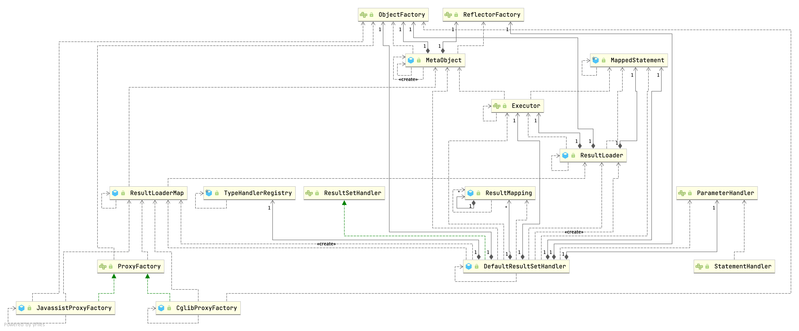

## Introduction




```java
public interface ResultSetHandler {

  <E> List<E> handleResultSets(Statement stmt) throws SQLException;

  <E> Cursor<E> handleCursorResultSets(Statement stmt) throws SQLException;

  void handleOutputParameters(CallableStatement cs) throws SQLException;

}
```

## DefaultResultSetHandler


## Nested Query


## Proxy

Most MetaObjects don't  implements interface, use JavassistProxyFactory rather than JDK Dynamic Proxy

1. CglibProxyFactory
2. JavassistProxyFactory default

```java
public interface ProxyFactory {

  default void setProperties(Properties properties) {
    // NOP
  }

  Object createProxy(Object target, ResultLoaderMap lazyLoader, Configuration configuration, ObjectFactory objectFactory, List<Class<?>> constructorArgTypes, List<Object> constructorArgs);

}
```


### lazyLoader


```java
// JavassistProxyFactory
private final ResultLoaderMap lazyLoader;

@Override
  public Object invoke(Object enhanced, Method method, Method methodProxy, Object[] args) throws Throwable {
    final String methodName = method.getName();
    try {
      synchronized (lazyLoader) {
        if (WRITE_REPLACE_METHOD.equals(methodName)) {
          Object original;
          if (constructorArgTypes.isEmpty()) {
            original = objectFactory.create(type);
          } else {
            original = objectFactory.create(type, constructorArgTypes, constructorArgs);
          }
          PropertyCopier.copyBeanProperties(type, enhanced, original);
          if (lazyLoader.size() > 0) {
            return new JavassistSerialStateHolder(original, lazyLoader.getProperties(), objectFactory, constructorArgTypes, constructorArgs);
          } else {
            return original;
          }
        } else {
          if (lazyLoader.size() > 0 && !FINALIZE_METHOD.equals(methodName)) {
            if (aggressive || lazyLoadTriggerMethods.contains(methodName)) {
              lazyLoader.loadAll();
            } else if (PropertyNamer.isSetter(methodName)) {
              final String property = PropertyNamer.methodToProperty(methodName);
              lazyLoader.remove(property);
            } else if (PropertyNamer.isGetter(methodName)) {
              final String property = PropertyNamer.methodToProperty(methodName);
              if (lazyLoader.hasLoader(property)) {
                lazyLoader.load(property);
              }
            }
          }
        }
      }
      return methodProxy.invoke(enhanced, args);
    } catch (Throwable t) {
      throw ExceptionUtil.unwrapThrowable(t);
    }
  }
}
```


```java
// ResultLoaderMap
public boolean load(String property) throws SQLException {
  LoadPair pair = loaderMap.remove(property.toUpperCase(Locale.ENGLISH));
  if (pair != null) {
    pair.load();
    return true;
  }
  return false;
}


public void load(final Object userObject) throws SQLException {
  ...

    this.metaResultObject = config.newMetaObject(userObject);
    this.resultLoader = new ResultLoader(config, new ClosedExecutor(), ms, this.mappedParameter,
                                         metaResultObject.getSetterType(this.property), null, null);
  }

  /* We are using a new executor because we may be (and likely are) on a new thread
       * and executors aren't thread safe. (Is this sufficient?)
       *
       * A better approach would be making executors thread safe. */
  if (this.serializationCheck == null) {
    final ResultLoader old = this.resultLoader;
    this.resultLoader = new ResultLoader(old.configuration, new ClosedExecutor(), old.mappedStatement,
                                         old.parameterObject, old.targetType, old.cacheKey, old.boundSql);
  }
	// use executor to selectList and set value
  this.metaResultObject.setValue(property, this.resultLoader.loadResult());
}

// ResultLoader
public Object loadResult() throws SQLException {
    List<Object> list = selectList();
    resultObject = resultExtractor.extractObjectFromList(list, targetType);
    return resultObject;
  }

private <E> List<E> selectList() throws SQLException {
  Executor localExecutor = executor;
  if (Thread.currentThread().getId() != this.creatorThreadId || localExecutor.isClosed()) {
    localExecutor = newExecutor();
  }
  try {
    return localExecutor.query(mappedStatement, parameterObject, RowBounds.DEFAULT, Executor.NO_RESULT_HANDLER, cacheKey, boundSql);
  } finally {
    if (localExecutor != executor) {
      localExecutor.close(false);
    }
  }
}
```


## Cache


## Links

- [MyBatis](/docs/CS/Framework/MyBatis/MyBatis.md)