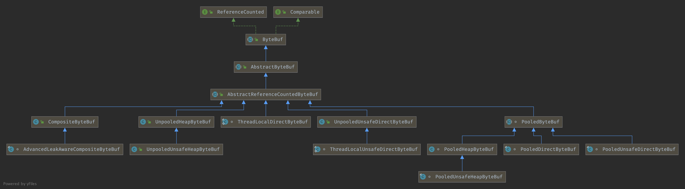

## Introduction

Netty 使用自己的 Buffer API 而不是 NIO 的 [ByteBuffer](/docs/CS/Java/JDK/IO/NIO.md?id=Buffer) 来表示字节序列。
相比使用 ByteBuffer，这种方法具有显著优势。
Netty 新的缓冲区类型 ChannelBuffer 从头设计，旨在解决 ByteBuffer 的问题并满足网络应用开发者的日常需求。
以下是一些出色的特性：

- 如有需要，你可以定义自己的缓冲区类型。
- 通过内置的复合缓冲区类型实现透明零拷贝。
- 开箱即用的动态缓冲区类型，其容量可按需扩展，就像 StringBuffer 一样。
- 无需再调用 flip() 方法。
- 通常比 ByteBuffer 更快。


ByteBuf 是 Netty 中的数据容器，Netty 在接收网络数据和发送网络数据时，都会首先将这些网络数据事先缓存在 ByteBuf 中，然后在将它们丢给 pipeline 处理或者发送给 Socket ，
这样做的目的是防止在接收网络数据的过程中网络数据一直积压在 Socket 的接收缓冲区中使得接收缓冲区的数据越来越多，导致对端 TCP 协议中的窗口关闭（滑动窗口），影响到了整个 TCP 通信的速度


###  ByteBuf Hierarchy




ByteBuf
1. readIndex and  writeIndex
2. auto expand
3. reference count
4. Pool area
5. Zero copy


## AbstractByteBuf

```java
int readerIndex;
int writerIndex;
private int markedReaderIndex;
private int markedWriterIndex;
private int maxCapacity;
```


### capacity( )

auto expand

```java
@Override
public ByteBuf writeBytes(byte[] src, int srcIndex, int length) {
    ensureWritable(length);
    setBytes(writerIndex, src, srcIndex, length);
    writerIndex += length;
    return this;
}

final void ensureWritable0(int minWritableBytes) {
    ensureAccessible();
    if (minWritableBytes <= writableBytes()) {
        return;
    }
    final int writerIndex = writerIndex();
    if (checkBounds) {
        if (minWritableBytes > maxCapacity - writerIndex) {
            throw new IndexOutOfBoundsException(String.format(
                    "writerIndex(%d) + minWritableBytes(%d) exceeds maxCapacity(%d): %s",
                    writerIndex, minWritableBytes, maxCapacity, this));
        }
    }

    // Normalize the current capacity to the power of 2.
    int minNewCapacity = writerIndex + minWritableBytes;
    int newCapacity = alloc().calculateNewCapacity(minNewCapacity, maxCapacity);

    int fastCapacity = writerIndex + maxFastWritableBytes();
    // Grow by a smaller amount if it will avoid reallocation
    if (newCapacity > fastCapacity && minNewCapacity <= fastCapacity) {
        newCapacity = fastCapacity;
    }

    // Adjust to the new capacity.
    capacity(newCapacity);
}

/**
 * Adjusts the capacity of this buffer.  If the {@code newCapacity} is less than the current
 * capacity, the content of this buffer is truncated.  If the {@code newCapacity} is greater
 * than the current capacity, the buffer is appended with unspecified data whose length is
 * {@code (newCapacity - currentCapacity)}.
 *
 * @throws IllegalArgumentException if the {@code newCapacity} is greater than {@link #maxCapacity()}
 */
@Override
public ByteBuf capacity(int newCapacity) {
    checkNewCapacity(newCapacity);

    int oldCapacity = array.length;
    byte[] oldArray = array;
    if (newCapacity > oldCapacity) {
        byte[] newArray = allocateArray(newCapacity);
        System.arraycopy(oldArray, 0, newArray, 0, oldArray.length);
        setArray(newArray);
        freeArray(oldArray);
    } else if (newCapacity < oldCapacity) {
        byte[] newArray = allocateArray(newCapacity);
        int readerIndex = readerIndex();
        if (readerIndex < newCapacity) {
            int writerIndex = writerIndex();
            if (writerIndex > newCapacity) {
                writerIndex(writerIndex = newCapacity);
            }
            System.arraycopy(oldArray, readerIndex, newArray, readerIndex, writerIndex - readerIndex);
        } else {
            setIndex(newCapacity, newCapacity);
        }
        setArray(newArray);
        freeArray(oldArray);
    }
    return this;
}
```


## ReferenceCounting


一般的经验法则是，最后一个访问引用计数对象的组件也负责销毁该引用计数对象。具体来说：

- 如果发送组件需要将引用计数对象传递给另一个接收组件，发送组件通常不需要销毁它，而是将这一决定推迟给接收组件。
- 如果某个组件消费了一个引用计数对象，并且知道没有其他组件会再访问它（即，没有将引用传递给其他组件），则该组件应销毁它。


`ByteBuf.duplicate()`、`ByteBuf.slice()` 和 `ByteBuf.order(ByteOrder)` 创建**派生**缓冲区，与父缓冲区共享内存区域。
派生缓冲区没有自己的引用计数，而是共享父缓冲区的引用计数。


相比之下，`ByteBuf.copy()` 和 `ByteBuf.readBytes(int)` 不是派生缓冲区。返回的 `ByteBuf` 是新分配的，需要手动释放。


有时，`ByteBuf` 被包含在缓冲区持有者中，例如 `DatagramPacket`、`HttpContent` 和 `WebSocketframe`。
这些类型扩展了一个名为 `ByteBufHolder` 的通用接口。
缓冲区持有者与其包含的缓冲区共享引用计数，就像派生缓冲区一样。


> [!NOTE]
> 
> Note that a parent buffer and its derived buffers share the same reference count, and the reference count does not increase when a derived buffer is created. 
> 
> Therefore, if you are going to pass a derived buffer to an other component of your application, you will have to call `retain()` on it first.


如果你有疑问或想简化消息释放，可以使用 `ReferenceCountUtil.release()`。
或者，可以考虑继承 `SimpleChannelHandler`，它会对接收到的所有消息调用 `ReferenceCountUtil.release(msg)`。


### RefCnt

refCnt 使用 AtomicIntegerFieldUpdater 而非 AtomicInteger 以减少内存

```java
public abstract class AbstractReferenceCountedByteBuf extends AbstractByteBuf {
    private static final long REFCNT_FIELD_OFFSET =
            ReferenceCountUpdater.getUnsafeOffset(AbstractReferenceCountedByteBuf.class, "refCnt");
    private static final AtomicIntegerFieldUpdater<AbstractReferenceCountedByteBuf> AIF_UPDATER =
            AtomicIntegerFieldUpdater.newUpdater(AbstractReferenceCountedByteBuf.class, "refCnt");

    private static final ReferenceCountUpdater<AbstractReferenceCountedByteBuf> updater =
            new ReferenceCountUpdater<AbstractReferenceCountedByteBuf>() {
                @Override
                protected AtomicIntegerFieldUpdater<AbstractReferenceCountedByteBuf> updater() {
                    return AIF_UPDATER;
                }

                @Override
                protected long unsafeOffset() {
                    return REFCNT_FIELD_OFFSET;
                }
            };

    // Value might not equal "real" reference count, all access should be via the updater
    private volatile int refCnt = updater.initialValue();

    public final int initialValue() {
        return 2;
    }
}
```

### retain0

1. getAndAdd refCnt
2. oldRef is odd number, throw Exception
3. if newRef overflow, rollback refCnt and throw Exception 


```java
// rawIncrement == increment << 1
private T retain0(T instance, final int increment, final int rawIncrement) {
    int oldRef = updater().getAndAdd(instance, rawIncrement);
    if (oldRef != 2 && oldRef != 4 && (oldRef & 1) != 0) {
        throw new IllegalReferenceCountException(0, increment);
    }
    // don't pass 0!
    if ((oldRef <= 0 && oldRef + rawIncrement >= 0)
            || (oldRef >= 0 && oldRef + rawIncrement < oldRef)) {
        // overflow case
        updater().getAndAdd(instance, -rawIncrement);
        throw new IllegalReferenceCountException(realRefCnt(oldRef), increment);
    }
    return instance;
}
```


### release

```java
public final boolean release(T instance, int decrement) {
    int rawCnt = nonVolatileRawCnt(instance);
    int realCnt = toLiveRealRefCnt(rawCnt, checkPositive(decrement, "decrement"));
    return decrement == realCnt ? tryFinalRelease0(instance, rawCnt) || retryRelease0(instance, decrement)
            : nonFinalRelease0(instance, decrement, rawCnt, realCnt);
}

private boolean tryFinalRelease0(T instance, int expectRawCnt) {
    return updater().compareAndSet(instance, expectRawCnt, 1); // any odd number will work
}

private boolean nonFinalRelease0(T instance, int decrement, int rawCnt, int realCnt) {
    if (decrement < realCnt
            // all changes to the raw count are 2x the "real" change - overflow is OK
            && updater().compareAndSet(instance, rawCnt, rawCnt - (decrement << 1))) {
        return false;
    }
    return retryRelease0(instance, decrement);
}

private boolean retryRelease0(T instance, int decrement) {
    for (;;) {
        int rawCnt = updater().get(instance), realCnt = toLiveRealRefCnt(rawCnt, decrement);
        if (decrement == realCnt) {
            if (tryFinalRelease0(instance, rawCnt)) {
                return true;
            }
        } else if (decrement < realCnt) {
            // all changes to the raw count are 2x the "real" change
            if (updater().compareAndSet(instance, rawCnt, rawCnt - (decrement << 1))) {
                return false;
            }
        } else {
            throw new IllegalReferenceCountException(realCnt, -decrement);
        }
        Thread.yield(); // this benefits throughput under high contention
    }
}
```


## CompositeByteBuf

```java
/**
 * Cumulate {@link ByteBuf}s by add them to a {@link CompositeByteBuf} and so do no memory copy whenever possible.
 * Be aware that {@link CompositeByteBuf} use a more complex indexing implementation so depending on your use-case
 * and the decoder implementation this may be slower then just use the {@link #MERGE_CUMULATOR}.
 */
public static final Cumulator COMPOSITE_CUMULATOR = new Cumulator() {
    @Override
    public ByteBuf cumulate(ByteBufAllocator alloc, ByteBuf cumulation, ByteBuf in) {
        ByteBuf buffer;
        try {
            if (cumulation.refCnt() > 1) {
                // Expand cumulation (by replace it) when the refCnt is greater then 1 which may happen when the
                // user use slice().retain() or duplicate().retain().
                //
                // See:
                // - https://github.com/netty/netty/issues/2327
                // - https://github.com/netty/netty/issues/1764
                buffer = expandCumulation(alloc, cumulation, in.readableBytes());
                buffer.writeBytes(in);
            } else {
                CompositeByteBuf composite;
                if (cumulation instanceof CompositeByteBuf) {
                    composite = (CompositeByteBuf) cumulation;
                } else {
                    composite = alloc.compositeBuffer(Integer.MAX_VALUE);
                    composite.addComponent(true, cumulation);
                }
                composite.addComponent(true, in);
                in = null;
                buffer = composite;
            }
            return buffer;
        } finally {
            if (in != null) {
                // We must release if the ownership was not transferred as otherwise it may produce a leak if
                // writeBytes(...) throw for whatever release (for example because of OutOfMemoryError).
                in.release();
            }
        }
    }
};
```


### Component

```java
Component(ByteBuf buf, int srcOffset, int offset, int len, ByteBuf slice) {
    this.buf = buf;
    this.offset = offset;
    this.endOffset = offset + len;
    this.adjustment = srcOffset - offset;
    this.slice = slice;
}

/**
 * Precondition is that {@code buffer != null}.
 */
private int addComponent0(boolean increaseWriterIndex, int cIndex, ByteBuf buffer) {
    assert buffer != null;
    boolean wasAdded = false;
    try {
        checkComponentIndex(cIndex);

        // No need to consolidate - just add a component to the list.
        Component c = newComponent(buffer, 0);
        int readableBytes = c.length();

        addComp(cIndex, c);
        wasAdded = true;
        if (readableBytes > 0 && cIndex < componentCount - 1) {
            updateComponentOffsets(cIndex);
        } else if (cIndex > 0) {
            c.reposition(components[cIndex - 1].endOffset);
        }
        if (increaseWriterIndex) {
            writerIndex += readableBytes;
        }
        return cIndex;
    } finally {
        if (!wasAdded) {
            buffer.release();
        }
    }
}
```


### discardReadComponents

```java
/**
 * Discard all {@link ByteBuf}s which are read.
 */
public CompositeByteBuf discardReadComponents() {
    ensureAccessible();
    final int readerIndex = readerIndex();
    if (readerIndex == 0) {
        return this;
    }

    // Discard everything if (readerIndex = writerIndex = capacity).
    int writerIndex = writerIndex();
    if (readerIndex == writerIndex && writerIndex == capacity()) {
        for (int i = 0, size = componentCount; i < size; i++) {
            components[i].free();
        }
        lastAccessed = null;
        clearComps();
        setIndex(0, 0);
        adjustMarkers(readerIndex);
        return this;
    }

    // Remove read components.
    int firstComponentId = 0;
    Component c = null;
    for (int size = componentCount; firstComponentId < size; firstComponentId++) {
        c = components[firstComponentId];
        if (c.endOffset > readerIndex) {
            break;
        }
        c.free();
    }
    if (firstComponentId == 0) {
        return this; // Nothing to discard
    }
    Component la = lastAccessed;
    if (la != null && la.endOffset <= readerIndex) {
        lastAccessed = null;
    }
    removeCompRange(0, firstComponentId);

    // Update indexes and markers.
    int offset = c.offset;
    updateComponentOffsets(0);
    setIndex(readerIndex - offset, writerIndex - offset);
    adjustMarkers(offset);
    return this;
}
```


## Pooled


### newInstance

```java
static PooledDirectByteBuf newInstance(int maxCapacity) {
    PooledDirectByteBuf buf = RECYCLER.get();
    buf.reuse(maxCapacity);
    return buf;
}
```


### allocate

```java
private void allocate(PoolThreadCache cache, PooledByteBuf<T> buf, final int reqCapacity) {
    final int normCapacity = normalizeCapacity(reqCapacity);
    if (isTinyOrSmall(normCapacity)) { // capacity < pageSize
        int tableIdx;
        PoolSubpage<T>[] table;
        boolean tiny = isTiny(normCapacity);
        if (tiny) { // < 512
            if (cache.allocateTiny(this, buf, reqCapacity, normCapacity)) {
                // was able to allocate out of the cache so move on
                return;
            }
            tableIdx = tinyIdx(normCapacity);
            table = tinySubpagePools;
        } else {
            if (cache.allocateSmall(this, buf, reqCapacity, normCapacity)) {
                // was able to allocate out of the cache so move on
                return;
            }
            tableIdx = smallIdx(normCapacity);
            table = smallSubpagePools;
        }

        final PoolSubpage<T> head = table[tableIdx];

        /**
         * Synchronize on the head. This is needed as {@link PoolChunk#allocateSubpage(int)} and
         * {@link PoolChunk#free(long)} may modify the doubly linked list as well.
         */
        synchronized (head) {
            final PoolSubpage<T> s = head.next;
            if (s != head) {
                assert s.doNotDestroy && s.elemSize == normCapacity;
                long handle = s.allocate();
                assert handle >= 0;
                s.chunk.initBufWithSubpage(buf, null, handle, reqCapacity);
                incTinySmallAllocation(tiny);
                return;
            }
        }
        synchronized (this) {
            allocateNormal(buf, reqCapacity, normCapacity);
        }

        incTinySmallAllocation(tiny);
        return;
    }
    if (normCapacity <= chunkSize) {
        if (cache.allocateNormal(this, buf, reqCapacity, normCapacity)) {
            // was able to allocate out of the cache so move on
            return;
        }
        synchronized (this) {
            allocateNormal(buf, reqCapacity, normCapacity);
            ++allocationsNormal;
        }
    } else {
        // Huge allocations are never served via the cache so just call allocateHuge
        allocateHuge(buf, reqCapacity);
    }
}
```


## OutBuf

> Assuming a 64-bit JVM:
>  - 16 bytes object header
>  - 6 reference fields
>  - 2 long fields
>  - 2 int fields
>  - 1 boolean field
>  - padding

```java
public final class ChannelOutboundBuffer {
    private volatile long totalPendingSize;
}
```

addMessage

ChannelOutboundBuffer 中的 addMessage 方法应在调用 incrementPendingOutboundBytes 之前将消息添加到"未 flush"缓冲区，因为
incrementPendingOutboundBytes 可能会调用 fireChannelWritabilityChanged，从而触发用户 handler 写入第二条消息，
这可能导致消息在"未 flush"缓冲区中顺序错乱。

```java
public final class ChannelOutboundBuffer {
    public void addMessage(Object msg, int size, ChannelPromise promise) {
        Entry entry = Entry.newInstance(msg, size, total(msg), promise);
        if (tailEntry == null) {
            flushedEntry = null;
        } else {
            Entry tail = tailEntry;
            tail.next = entry;
        }
        tailEntry = entry;
        if (unflushedEntry == null) {
            unflushedEntry = entry;
        }

        // increment pending bytes after adding message to the unflushed arrays.
        incrementPendingOutboundBytes(entry.pendingSize, false);
    }
}
```

Check HighWaterMark

每次添加数据时都会累加数据的字节数，然后判断缓存大小是否超过所设置的高水位线 64KB，如果超过了高水位，那么 Channel 会被设置为不可写状态
直到缓存的数据大小低于低水位线 32KB 以后，Channel 才恢复成可写状态

```java
private void incrementPendingOutboundBytes(long size, boolean invokeLater) {
        if (size == 0) {
            return;
        }

        long newWriteBufferSize = TOTAL_PENDING_SIZE_UPDATER.addAndGet(this, size);
        if (newWriteBufferSize > channel.config().getWriteBufferHighWaterMark()) {
            setUnwritable(invokeLater);
        }
    }
```

remove
```java
public boolean remove() {
        Entry e = flushedEntry;
        if (e == null) {
            clearNioBuffers();
            return false;
        }
        Object msg = e.msg;

        ChannelPromise promise = e.promise;
        int size = e.pendingSize;

        removeEntry(e);

        if (!e.cancelled) {
            // only release message, notify and decrement if it was not canceled before.
            ReferenceCountUtil.safeRelease(msg);
            safeSuccess(promise);
            decrementPendingOutboundBytes(size, false, true);
        }

        // recycle the entry
        e.recycle();

        return true;
    }
// Check LowWaterMark
private void decrementPendingOutboundBytes(long size, boolean invokeLater, boolean notifyWritability) {
        if (size == 0) {
            return;
        }

        long newWriteBufferSize = TOTAL_PENDING_SIZE_UPDATER.addAndGet(this, -size);
        if (notifyWritability && newWriteBufferSize < channel.config().getWriteBufferLowWaterMark()) {
            setWritable(invokeLater);
        }
    }
```


## Memory Leak

> See [Java WeakReference](/docs/CS/Java/JDK/Basic/Ref.md?id=weakreference).


```java
DefaultResourceLeak(
        Object referent,
        ReferenceQueue<Object> refQueue,
        Set<DefaultResourceLeak<?>> allLeaks) {
    super(referent, refQueue);

    assert referent != null;

    // Store the hash of the tracked object to later assert it in the close(...) method.
    // It's important that we not store a reference to the referent as this would disallow it from
    // be collected via the WeakReference.
    trackedHash = System.identityHashCode(referent);
    allLeaks.add(this);
    // Create a new Record so we always have the creation stacktrace included.
    headUpdater.set(this, new Record(Record.BOTTOM));
    this.allLeaks = allLeaks;
}
```


AbstractByteBufAllocator

#### Report Level
表示资源泄漏检测的级别。

- DISABLED
- SIMPLE    SimpleLeakAwareByteBuf
- ADVANCED  AdvancedLeakAwareByteBuf
- PARANOID  AdvancedLeakAwareByteBuf

#### wrap Buf

```java
protected static ByteBuf toLeakAwareBuffer(ByteBuf buf) {
    ResourceLeakTracker<ByteBuf> leak;
    switch (ResourceLeakDetector.getLevel()) {
        case SIMPLE:
            leak = AbstractByteBuf.leakDetector.track(buf);
            if (leak != null) {
                buf = new SimpleLeakAwareByteBuf(buf, leak);
            }
            break;
        case ADVANCED:
        case PARANOID:
            leak = AbstractByteBuf.leakDetector.track(buf);
            if (leak != null) {
                buf = new AdvancedLeakAwareByteBuf(buf, leak);
            }
            break;
        default:
            break;
    }
    return buf;
}
```


### 泄漏检测级别

目前有 4 个泄漏检测级别：

- `DISABLED` - 完全禁用泄漏检测。不推荐。
- `SIMPLE` - 检测 1% 的缓冲区是否存在泄漏。默认值。
- `ADVANCED` - 检测 1% 的缓冲区并显示泄漏缓冲区的访问位置。
- `PARANOID` - 与 `ADVANCED` 相同，但针对每一个缓冲区。适用于自动化测试阶段。如果构建输出包含 '`LEAK: `'，可以使构建失败。

可以通过 JVM 选项 `-Dio.netty.leakDetection.level` 指定泄漏检测级别

```shell
java -Dio.netty.leakDetection.level=advanced ...
```

> [!NOTE]
> 
> This property used to be called `io.netty.leakDetectionLevel`.


### DefaultResourceLeak

创建时添加到 allLeaks，引用计数为 0 时移除

```java
  private static final class DefaultResourceLeak<T>
            extends WeakReference<Object> implements ResourceLeakTracker<T>, ResourceLeak {

    @SuppressWarnings("unchecked") // generics and updaters do not mix.
    private static final AtomicReferenceFieldUpdater<DefaultResourceLeak<?>, TraceRecord> headUpdater =
            (AtomicReferenceFieldUpdater)
                    AtomicReferenceFieldUpdater.newUpdater(DefaultResourceLeak.class, TraceRecord.class, "head");

    @SuppressWarnings("unchecked") // generics and updaters do not mix.
    private static final AtomicIntegerFieldUpdater<DefaultResourceLeak<?>> droppedRecordsUpdater =
            (AtomicIntegerFieldUpdater)
                    AtomicIntegerFieldUpdater.newUpdater(DefaultResourceLeak.class, "droppedRecords");

    private volatile TraceRecord head;
    private volatile int droppedRecords;

    private final Set<DefaultResourceLeak<?>> allLeaks;
    private final int trackedHash;

    DefaultResourceLeak(
            Object referent,
            ReferenceQueue<Object> refQueue,
            Set<DefaultResourceLeak<?>> allLeaks) {
        super(referent, refQueue);

        assert referent != null;

        // Store the hash of the tracked object to later assert it in the close(...) method.
        // It's important that we not store a reference to the referent as this would disallow it from
        // be collected via the WeakReference.
        trackedHash = System.identityHashCode(referent);
        allLeaks.add(this);
        // Create a new Record so we always have the creation stacktrace included.
        headUpdater.set(this, new TraceRecord(TraceRecord.BOTTOM));
        this.allLeaks = allLeaks;
    }
}
```


Creates a new ResourceLeakTracker which is expected to be closed via ResourceLeakTracker.close(Object) when the related resource is deallocated.

```java
public class ResourceLeakDetector<T> {
    public final ResourceLeakTracker<T> track(T obj) {
        return track0(obj);
    }

    private DefaultResourceLeak track0(T obj) {
        Level level = ResourceLeakDetector.level;
        if (level == Level.DISABLED) {
            return null;
        }

        if (level.ordinal() < Level.PARANOID.ordinal()) {
            if ((PlatformDependent.threadLocalRandom().nextInt(samplingInterval)) == 0) {
                reportLeak();
                return new DefaultResourceLeak(obj, refQueue, allLeaks);
            }
            return null;
        }
        reportLeak();
        return new DefaultResourceLeak(obj, refQueue, allLeaks);
    }


    private void reportLeak() {
        if (!needReport()) {
            clearRefQueue();
            return;
        }

        // Detect and report previous leaks.
        for (;;) {
            DefaultResourceLeak ref = (DefaultResourceLeak) refQueue.poll();
            if (ref == null) {
                break;
            }

            if (!ref.dispose()) {
                continue;
            }

            String records = ref.toString();
            if (reportedLeaks.add(records)) {
                if (records.isEmpty()) {
                    reportUntracedLeak(resourceType);
                } else {
                    reportTracedLeak(resourceType, records);
                }
            }
        }
    }
    
    
    public abstract class Reference<T> {
        boolean dispose() {
            clear();
            return allLeaks.remove(this);
        }
    }
}
```


```java

class SimpleLeakAwareByteBuf extends WrappedByteBuf {
    @Override
    public boolean release(int decrement) {
        if (super.release(decrement)) {
            closeLeak();
            return true;
        }
        return false;
    }

    private void closeLeak() {
        // Close the ResourceLeakTracker with the tracked ByteBuf as argument. This must be the same that was used when
        // calling DefaultResourceLeak.track(...).
        boolean closed = leak.close(trackedByteBuf);
        assert closed;
    }
}

private static final class DefaultResourceLeak<T>
        extends WeakReference<Object> implements ResourceLeakTracker<T>, ResourceLeak {
    @Override
    public boolean close() {
        if (allLeaks.remove(this)) {
            // Call clear so the reference is not even enqueued.
            clear();
            headUpdater.set(this, null);
            return true;
        }
        return false;
    }
}
```


### track

在 newBuffer() 时进行追踪

如果 level < PARANOID，随机 1/128 概率报告，否则报告并创建新的 DefaultResourceLeak

```java
private DefaultResourceLeak track0(T obj) {
    Level level = ResourceLeakDetector.level;
    if (level == Level.DISABLED) {
        return null;
    }

    if (level.ordinal() < Level.PARANOID.ordinal()) {
        if ((PlatformDependent.threadLocalRandom().nextInt(samplingInterval)) == 0) {
            reportLeak();
            return new DefaultResourceLeak(obj, refQueue, allLeaks);
        }
        return null;
    }
    reportLeak();
    return new DefaultResourceLeak(obj, refQueue, allLeaks);
}
```

#### reportLeak

```java
private void reportLeak() {
    if (!logger.isErrorEnabled()) {
        clearRefQueue();
        return;
    }

    // Detect and report previous leaks.
    for (;;) {
        @SuppressWarnings("unchecked")
        DefaultResourceLeak ref = (DefaultResourceLeak) refQueue.poll();
        if (ref == null) {
            break;
        }

        if (!ref.dispose()) {
            continue;
        }

        String records = ref.toString();
        if (reportedLeaks.putIfAbsent(records, Boolean.TRUE) == null) {
            if (records.isEmpty()) {
                reportUntracedLeak(resourceType);
            } else {
                reportTracedLeak(resourceType, records);
            }
        }
    }
}
```

如果在 clear ByteBuf 后引用仍在 allLeaks 中，则 dispose
```java
boolean dispose() {
    // Clears this reference object. 
    clear();
    return allLeaks.remove(this);
}
```


#### record

此方法通过指数退避来工作，随着栈中记录增多而降低记录频率。
每条记录有 1 / 2^n 的概率丢弃栈顶记录并替换为自身。这具有许多便捷特性：

- 当前记录总会被记录。这是因为 compare and swap 丢弃的是栈顶记录，而不是待推入的记录。
- 最后一次访问总会被记录。这是特性 1 的推论。
- 根据概率分布，可以保留比目标更多的记录。
- 很容易精确记录栈中元素的数量，因为每个元素需要知道栈的深度。

在这个特定实现中，还有一些其他优势。使用线程本地随机数来决定是否应该记录某次访问。
这意味着如果存在确定性的访问模式，现在可以看到其他访问的发生情况，而不是总是丢弃它们。
其次，在达到 TARGET_RECORDS 次访问后，开始退避。这与典型的访问模式相匹配——要么大量访问（如缓存缓冲区），要么少量访问（如临时缓冲区），很少有中间情况。
使用原子操作避免了在大多数记录将被丢弃时序列化大量访问。
高竞争只发生在已有记录非常少的情况下，而这只有在对象不被共享时才会发生！如果这是一个问题，可以中止循环并丢弃记录，因为另一个线程赢得了竞争。

```java
private void record0(Object hint) {
    // Check TARGET_RECORDS > 0 here to avoid similar check before remove from and add to lastRecords
    if (TARGET_RECORDS > 0) {
        Record oldHead;
        Record prevHead;
        Record newHead;
        boolean dropped;
        do {
            if ((prevHead = oldHead = headUpdater.get(this)) == null) {
                // already closed.
                return;
            }
            final int numElements = oldHead.pos + 1;
            if (numElements >= TARGET_RECORDS) {
                final int backOffFactor = Math.min(numElements - TARGET_RECORDS, 30);
                if (dropped = PlatformDependent.threadLocalRandom().nextInt(1 << backOffFactor) != 0) {
                    prevHead = oldHead.next;
                }
            } else {
                dropped = false;
            }
            newHead = hint != null ? new Record(prevHead, hint) : new Record(prevHead);
        } while (!headUpdater.compareAndSet(this, oldHead, newHead));
        if (dropped) {
            droppedRecordsUpdater.incrementAndGet(this);
        }
    }
}
```


### 最佳实践

- 在 `PARANOID` 和 `SIMPLE` 泄漏检测级别下运行单元测试和集成测试。
- 在部署到整个集群之前，先在 `SIMPLE` 级别下灰度运行你的应用一段合理的时间，检查是否存在泄漏。
- 如果存在泄漏，在 `ADVANCED` 级别下再次灰度，获取泄漏来源的线索。
- 不要将有泄漏的应用部署到整个集群。


> [!TIP]
> 
> Instead of wrapping your unit tests with `try-finally` blocks to release all buffers, you can use `ReferenceCountUtil.releaseLater()` utility method.


## Allocator


Default pooled if not Android.

```java
public final class ByteBufUtil {
   static {
      String allocType = SystemPropertyUtil.get(
              "io.netty.allocator.type", PlatformDependent.isAndroid() ? "unpooled" : "pooled");

      ByteBufAllocator alloc;
      if ("unpooled".equals(allocType)) {
         alloc = UnpooledByteBufAllocator.DEFAULT;
         logger.debug("-Dio.netty.allocator.type: {}", allocType);
      } else if ("pooled".equals(allocType)) {
         alloc = PooledByteBufAllocator.DEFAULT;
         logger.debug("-Dio.netty.allocator.type: {}", allocType);
      } else if ("adaptive".equals(allocType)) {
         alloc = new AdaptiveByteBufAllocator();
         logger.debug("-Dio.netty.allocator.type: {}", allocType);
      } else {
         alloc = PooledByteBufAllocator.DEFAULT;
         logger.debug("-Dio.netty.allocator.type: pooled (unknown: {})", allocType);
      }

      DEFAULT_ALLOCATOR = alloc;

      THREAD_LOCAL_BUFFER_SIZE = SystemPropertyUtil.getInt("io.netty.threadLocalDirectBufferSize", 0);
      logger.debug("-Dio.netty.threadLocalDirectBufferSize: {}", THREAD_LOCAL_BUFFER_SIZE);

      MAX_CHAR_BUFFER_SIZE = SystemPropertyUtil.getInt("io.netty.maxThreadLocalCharBufferSize", 16 * 1024);
      logger.debug("-Dio.netty.maxThreadLocalCharBufferSize: {}", MAX_CHAR_BUFFER_SIZE);
   }
}
```


```java
public static final PooledByteBufAllocator DEFAULT =
        new PooledByteBufAllocator(PlatformDependent.directBufferPreferred());
```


```java
/**
 * Returns {@code true} if the platform has reliable low-level direct buffer access API and a user has not specified
 * {@code -Dio.netty.noPreferDirect} option.
 */
public static boolean directBufferPreferred() {
    return DIRECT_BUFFER_PREFERRED;
}
```


pageSize 8192

```java
public PooledByteBufAllocator(boolean preferDirect, int nHeapArena, int nDirectArena, int pageSize, int maxOrder,
                              int smallCacheSize, int normalCacheSize,
                              boolean useCacheForAllThreads, int directMemoryCacheAlignment) {
    super(preferDirect);
    threadCache = new PoolThreadLocalCache(useCacheForAllThreads);
    this.smallCacheSize = smallCacheSize;
    this.normalCacheSize = normalCacheSize;
    chunkSize = validateAndCalculateChunkSize(pageSize, maxOrder);

    checkPositiveOrZero(nHeapArena, "nHeapArena");
    checkPositiveOrZero(nDirectArena, "nDirectArena");

    checkPositiveOrZero(directMemoryCacheAlignment, "directMemoryCacheAlignment");
    if (directMemoryCacheAlignment > 0 && !isDirectMemoryCacheAlignmentSupported()) {
        throw new IllegalArgumentException("directMemoryCacheAlignment is not supported");
    }

    if ((directMemoryCacheAlignment & -directMemoryCacheAlignment) != directMemoryCacheAlignment) {
        throw new IllegalArgumentException("directMemoryCacheAlignment: "
                + directMemoryCacheAlignment + " (expected: power of two)");
    }

    int pageShifts = validateAndCalculatePageShifts(pageSize);

    if (nHeapArena > 0) {
        heapArenas = newArenaArray(nHeapArena);
        List<PoolArenaMetric> metrics = new ArrayList<PoolArenaMetric>(heapArenas.length);
        for (int i = 0; i < heapArenas.length; i ++) {
            PoolArena.HeapArena arena = new PoolArena.HeapArena(this,
                    pageSize, pageShifts, chunkSize,
                    directMemoryCacheAlignment);
            heapArenas[i] = arena;
            metrics.add(arena);
        }
        heapArenaMetrics = Collections.unmodifiableList(metrics);
    } else {
        heapArenas = null;
        heapArenaMetrics = Collections.emptyList();
    }

    if (nDirectArena > 0) {
        directArenas = newArenaArray(nDirectArena);
        List<PoolArenaMetric> metrics = new ArrayList<PoolArenaMetric>(directArenas.length);
        for (int i = 0; i < directArenas.length; i ++) {
            PoolArena.DirectArena arena = new PoolArena.DirectArena(
                    this, pageSize, pageShifts, chunkSize, directMemoryCacheAlignment);
            directArenas[i] = arena;
            metrics.add(arena);
        }
        directArenaMetrics = Collections.unmodifiableList(metrics);
    } else {
        directArenas = null;
        directArenaMetrics = Collections.emptyList();
    }
    metric = new PooledByteBufAllocatorMetric(this);
}
```


```java
/**
 * Metrics for a chunk.
 */
public interface PoolChunkMetric {

    /**
     * Return the percentage of the current usage of the chunk.
     */
    int usage();

    /**
     * Return the size of the chunk in bytes, this is the maximum of bytes that can be served out of the chunk.
     */
    int chunkSize();

    /**
     * Return the number of free bytes in the chunk.
     */
    int freeBytes();
}
```


```java
abstract class PoolArena<T> extends SizeClasses implements PoolArenaMetric {
```


### allocate


```java
// PoolArena
PooledByteBuf<T> allocate(PoolThreadCache cache, int reqCapacity, int maxCapacity) {
    PooledByteBuf<T> buf = newByteBuf(maxCapacity);
    allocate(cache, buf, reqCapacity);
    return buf;
}

private void allocate(PoolThreadCache cache, PooledByteBuf<T> buf, final int reqCapacity) {
    final int sizeIdx = size2SizeIdx(reqCapacity);

    if (sizeIdx <= smallMaxSizeIdx) {
        tcacheAllocateSmall(cache, buf, reqCapacity, sizeIdx);
    } else if (sizeIdx < nSizes) {
        tcacheAllocateNormal(cache, buf, reqCapacity, sizeIdx);
    } else {
        int normCapacity = directMemoryCacheAlignment > 0
                ? normalizeSize(reqCapacity) : reqCapacity;
        // Huge allocations are never served via the cache so just call allocateHuge
        allocateHuge(buf, normCapacity);
    }
}
```

#### tcacheAllocateSmall

1. cahe allocateSmall
2. synchronized head 
3. synchronized PoolArena, allocateNormal

```java
// PoolArena
private void tcacheAllocateSmall(PoolThreadCache cache, PooledByteBuf<T> buf, final int reqCapacity,
                                 final int sizeIdx) {

    if (cache.allocateSmall(this, buf, reqCapacity, sizeIdx)) {
        // was able to allocate out of the cache so move on
        return;
    }

    /**
     * Synchronize on the head. This is needed as {@link PoolChunk#allocateSubpage(int)} and
     * {@link PoolChunk#free(long)} may modify the doubly linked list as well.
     */
    final PoolSubpage<T> head = smallSubpagePools[sizeIdx];
    final boolean needsNormalAllocation;
    synchronized (head) {
        final PoolSubpage<T> s = head.next;
        needsNormalAllocation = s == head;
        if (!needsNormalAllocation) {
            assert s.doNotDestroy && s.elemSize == sizeIdx2size(sizeIdx);
            long handle = s.allocate();
            assert handle >= 0;
            s.chunk.initBufWithSubpage(buf, null, handle, reqCapacity, cache);
        }
    }

    if (needsNormalAllocation) {
        synchronized (this) {
            allocateNormal(buf, reqCapacity, sizeIdx, cache);
        }
    }

    incSmallAllocation();
}
```


```java
// PoolThreadcache
private boolean allocate(MemoryRegionCache<?> cache, PooledByteBuf buf, int reqCapacity) {
    if (cache == null) {
        // no cache found so just return false here
        return false;
    }
    boolean allocated = cache.allocate(buf, reqCapacity, this);
  	//  freeSweepAllocationThreshold default 8192
    if (++ allocations >= freeSweepAllocationThreshold) {
        allocations = 0;
        trim();
    }
    return allocated;
}


// Allocate something out of the cache if possible and remove the entry from the cache.
public final boolean allocate(PooledByteBuf<T> buf, int reqCapacity, PoolThreadCache threadCache) {
  Entry<T> entry = queue.poll();
  if (entry == null) {
    return false;
  }
  initBuf(entry.chunk, entry.nioBuffer, entry.handle, buf, reqCapacity, threadCache);
  entry.recycle();

  // allocations is not thread-safe which is fine as this is only called from the same thread all time.
  ++ allocations;
  return true;
}
```


```java

// Free up cached {@link PoolChunk}s if not allocated frequently enough.
public final void trim() {
  int free = size - allocations;
  allocations = 0;

  // We not even allocated all the number that are
  if (free > 0) {
    free(free, false);
  }
}

private int free(int max, boolean finalizer) {
    int numFreed = 0;
    for (; numFreed < max; numFreed++) {
        Entry<T> entry = queue.poll();
        if (entry != null) {
            freeEntry(entry, finalizer);
        } else {
            // all cleared
            return numFreed;
        }
    }
    return numFreed;
}

private  void freeEntry(Entry entry, boolean finalizer) {
  PoolChunk chunk = entry.chunk;
  long handle = entry.handle;
  ByteBuffer nioBuffer = entry.nioBuffer;

  if (!finalizer) {
    // recycle now so PoolChunk can be GC'ed. This will only be done if this is not freed because of
    // a finalizer.
    entry.recycle();
  }

  chunk.arena.freeChunk(chunk, handle, entry.normCapacity, sizeClass, nioBuffer, finalizer);
}
```


##### PoolSubpage::allocate

```java
/** PoolSubpage
 * Returns the bitmap index of the subpage allocation.
 */
long allocate() {
    if (numAvail == 0 || !doNotDestroy) {
        return -1;
    }

    final int bitmapIdx = getNextAvail();
    int q = bitmapIdx >>> 6;
    int r = bitmapIdx & 63;
    assert (bitmap[q] >>> r & 1) == 0;
    bitmap[q] |= 1L << r;

    if (-- numAvail == 0) {
        removeFromPool();
    }

    return toHandle(bitmapIdx);
}
```


```java
// PoolArena
void freeChunk(PoolChunk<T> chunk, long handle, int normCapacity, SizeClass sizeClass, ByteBuffer nioBuffer,
               boolean finalizer) {
    final boolean destroyChunk;
    synchronized (this) {
        // We only call this if freeChunk is not called because of the PoolThreadCache finalizer as otherwise this
        // may fail due lazy class-loading in for example tomcat.
        if (!finalizer) {
            switch (sizeClass) {
                case Normal:
                    ++deallocationsNormal;
                    break;
                case Small:
                    ++deallocationsSmall;
                    break;
                default:
                    throw new Error();
            }
        }
        destroyChunk = !chunk.parent.free(chunk, handle, normCapacity, nioBuffer);
    }
    if (destroyChunk) {
        // destroyChunk not need to be called while holding the synchronized lock.
        destroyChunk(chunk);
    }
}
```


#### allocateNormal

```java
// PoolArena
// Method must be called inside synchronized(this) { ... } block
private void allocateNormal(PooledByteBuf<T> buf, int reqCapacity, int sizeIdx, PoolThreadCache threadCache) {
    if (q050.allocate(buf, reqCapacity, sizeIdx, threadCache) ||
        q025.allocate(buf, reqCapacity, sizeIdx, threadCache) ||
        q000.allocate(buf, reqCapacity, sizeIdx, threadCache) ||
        qInit.allocate(buf, reqCapacity, sizeIdx, threadCache) ||
        q075.allocate(buf, reqCapacity, sizeIdx, threadCache)) {
        return;
    }

    // Add a new chunk.
    PoolChunk<T> c = newChunk(pageSize, nPSizes, pageShifts, chunkSize);
    boolean success = c.allocate(buf, reqCapacity, sizeIdx, threadCache);
    assert success;
    qInit.add(c);
}
```


```java
// PoolChunk
boolean allocate(PooledByteBuf<T> buf, int reqCapacity, int sizeIdx, PoolThreadCache cache) {
    final long handle;
    if (sizeIdx <= arena.smallMaxSizeIdx) {
        // small
        handle = allocateSubpage(sizeIdx);
        if (handle < 0) {
            return false;
        }
        assert isSubpage(handle);
    } else {
        // normal
        // runSize must be multiple of pageSize
        int runSize = arena.sizeIdx2size(sizeIdx);
        handle = allocateRun(runSize);
        if (handle < 0) {
            return false;
        }
    }

    ByteBuffer nioBuffer = cachedNioBuffers != null? cachedNioBuffers.pollLast() : null;
    initBuf(buf, nioBuffer, handle, reqCapacity, cache);
    return true;
}
```

##### allocateSubpage

```java
/**
 * Create / initialize a new PoolSubpage of normCapacity. Any PoolSubpage created / initialized here is added to
 * subpage pool in the PoolArena that owns this PoolChunk
 *
 * @param sizeIdx sizeIdx of normalized size
 *
 * @return index in memoryMap
 */
private long allocateSubpage(int sizeIdx) {
    // Obtain the head of the PoolSubPage pool that is owned by the PoolArena and synchronize on it.
    // This is need as we may add it back and so alter the linked-list structure.
    PoolSubpage<T> head = arena.findSubpagePoolHead(sizeIdx);
    synchronized (head) {
        //allocate a new run
        int runSize = calculateRunSize(sizeIdx);
        //runSize must be multiples of pageSize
        long runHandle = allocateRun(runSize);
        if (runHandle < 0) {
            return -1;
        }

        int runOffset = runOffset(runHandle);
        int elemSize = arena.sizeIdx2size(sizeIdx);

        PoolSubpage<T> subpage = new PoolSubpage<T>(head, this, pageShifts, runOffset,
                           runSize(pageShifts, runHandle), elemSize);

        subpages[runOffset] = subpage;
        return subpage.allocate();
    }
}
```


##### allocateRun

```java
private long allocateRun(int runSize) {
    int pages = runSize >> pageShifts;
    int pageIdx = arena.pages2pageIdx(pages);

    synchronized (runsAvail) {
        //find first queue which has at least one big enough run
        int queueIdx = runFirstBestFit(pageIdx);
        if (queueIdx == -1) {
            return -1;
        }

        //get run with min offset in this queue
        PriorityQueue<Long> queue = runsAvail[queueIdx];
        long handle = queue.poll();

        assert !isUsed(handle);

        removeAvailRun(queue, handle);

        if (handle != -1) {
            handle = splitLargeRun(handle, pages);
        }

        freeBytes -= runSize(pageShifts, handle);
        return handle;
    }
}
```


## Links

- [Netty](/docs/CS/Framework/Netty/Netty.md)
- [Memory Pool](/docs/CS/Framework/Netty/memory.md)


## References

1. [Reference counted objects](https://netty.io/wiki/reference-counted-objects.html)