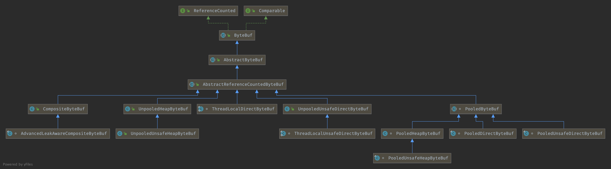

## Introduction

Netty uses its own buffer API instead of NIO [ByteBuffer](/docs/CS/Java/JDK/IO/NIO.md?id=buffers) to represent a sequence of bytes.
This approach has significant advantages over using ByteBuffer. 
Netty's new buffer type, ChannelBuffer has been designed from the ground up to address the problems of ByteBuffer and to meet the daily needs of network application developers. 
To list a few cool features:

- You can define your own buffer type if necessary.
- Transparent zero copy is achieved by a built-in composite buffer type.
- A dynamic buffer type is provided out-of-the-box, whose capacity is expanded on demand, just like StringBuffer.
- There's no need to call flip() anymore.
- It is often faster than ByteBuffer.


ByteBuf 是 Netty 中的数据容器，Netty 在接收网络数据和发送网络数据时，都会首先将这些网络数据事先缓存在 ByteBuf 中，然后在将它们丢给 pipeline 处理或者发送给 Socket ，
这样做的目的是防止在接收网络数据的过程中网络数据一直积压在 Socket 的接收缓冲区中使得接收缓冲区的数据越来越多，导致对端 TCP 协议中的窗口关闭（滑动窗口），影响到了整个 TCP 通信的速度


### ByteBuf Hierarchy




ByteBuf
1. readIndex and  writeIndex
2. auto expand
3. reference count
4. Pool area
5. Zero copy


## AbstractByteBuf

```java
int readerIndex;
int writerIndex;
private int markedReaderIndex;
private int markedWriterIndex;
private int maxCapacity;
```


### capacity( )

auto expand

```java
@Override
public ByteBuf writeBytes(byte[] src, int srcIndex, int length) {
    ensureWritable(length);
    setBytes(writerIndex, src, srcIndex, length);
    writerIndex += length;
    return this;
}

final void ensureWritable0(int minWritableBytes) {
    ensureAccessible();
    if (minWritableBytes <= writableBytes()) {
        return;
    }
    final int writerIndex = writerIndex();
    if (checkBounds) {
        if (minWritableBytes > maxCapacity - writerIndex) {
            throw new IndexOutOfBoundsException(String.format(
                    "writerIndex(%d) + minWritableBytes(%d) exceeds maxCapacity(%d): %s",
                    writerIndex, minWritableBytes, maxCapacity, this));
        }
    }

    // Normalize the current capacity to the power of 2.
    int minNewCapacity = writerIndex + minWritableBytes;
    int newCapacity = alloc().calculateNewCapacity(minNewCapacity, maxCapacity);

    int fastCapacity = writerIndex + maxFastWritableBytes();
    // Grow by a smaller amount if it will avoid reallocation
    if (newCapacity > fastCapacity && minNewCapacity <= fastCapacity) {
        newCapacity = fastCapacity;
    }

    // Adjust to the new capacity.
    capacity(newCapacity);
}

/**
 * Adjusts the capacity of this buffer.  If the {@code newCapacity} is less than the current
 * capacity, the content of this buffer is truncated.  If the {@code newCapacity} is greater
 * than the current capacity, the buffer is appended with unspecified data whose length is
 * {@code (newCapacity - currentCapacity)}.
 *
 * @throws IllegalArgumentException if the {@code newCapacity} is greater than {@link #maxCapacity()}
 */
@Override
public ByteBuf capacity(int newCapacity) {
    checkNewCapacity(newCapacity);

    int oldCapacity = array.length;
    byte[] oldArray = array;
    if (newCapacity > oldCapacity) {
        byte[] newArray = allocateArray(newCapacity);
        System.arraycopy(oldArray, 0, newArray, 0, oldArray.length);
        setArray(newArray);
        freeArray(oldArray);
    } else if (newCapacity < oldCapacity) {
        byte[] newArray = allocateArray(newCapacity);
        int readerIndex = readerIndex();
        if (readerIndex < newCapacity) {
            int writerIndex = writerIndex();
            if (writerIndex > newCapacity) {
                writerIndex(writerIndex = newCapacity);
            }
            System.arraycopy(oldArray, readerIndex, newArray, readerIndex, writerIndex - readerIndex);
        } else {
            setIndex(newCapacity, newCapacity);
        }
        setArray(newArray);
        freeArray(oldArray);
    }
    return this;
}
```


## ReferenceCounting


The general rule of thumb is that the party that accesses a reference-counted object last is also responsible for the destruction of that reference-counted object. Specifically:

- If a sending component is supposed to pass a reference-counted object to another receiving component, the sending component usually does not need to destroy it but defers that decision to the receiving component.
- If a component consumes a reference-counted object and knows nothing else will access it anymore (i.e., does not pass along a reference to yet another component), the component should destroy it.


`ByteBuf.duplicate()`, `ByteBuf.slice()` and `ByteBuf.order(ByteOrder)` create a *derived* buffer which shares the memory region of the parent buffer. 
A derived buffer does not have its own reference count, but shares the reference count of the parent buffer.


In contrast, `ByteBuf.copy()` and `ByteBuf.readBytes(int)` are *not derived* buffers. The returned `ByteBuf` is allocated and will need to be released.


Sometimes, a `ByteBuf` is contained by a buffer holder, such as `DatagramPacket`, `HttpContent`, and `WebSocketframe`.
Those types extend a common interface called `ByteBufHolder`.
A buffer holder shares the reference count of the buffer it contains, just like a derived buffer.


> [!NOTE]
> 
> Note that a parent buffer and its derived buffers share the same reference count, and the reference count does not increase when a derived buffer is created. 
> 
> Therefore, if you are going to pass a derived buffer to an other component of your application, you will have to call `retain()` on it first.


If you are in doubt or you want to simplify releasing the messages, you can use `ReferenceCountUtil.release()`.
Alternatively, you could consider extending `SimpleChannelHandler` which calls `ReferenceCountUtil.release(msg)` for all messages you receive.


### RefCnt

refCnt use AtomicIntegerFieldUpdater rather than AtomicInteger to reduce memory

```java
public abstract class AbstractReferenceCountedByteBuf extends AbstractByteBuf {
    private static final long REFCNT_FIELD_OFFSET =
            ReferenceCountUpdater.getUnsafeOffset(AbstractReferenceCountedByteBuf.class, "refCnt");
    private static final AtomicIntegerFieldUpdater<AbstractReferenceCountedByteBuf> AIF_UPDATER =
            AtomicIntegerFieldUpdater.newUpdater(AbstractReferenceCountedByteBuf.class, "refCnt");

    private static final ReferenceCountUpdater<AbstractReferenceCountedByteBuf> updater =
            new ReferenceCountUpdater<AbstractReferenceCountedByteBuf>() {
                @Override
                protected AtomicIntegerFieldUpdater<AbstractReferenceCountedByteBuf> updater() {
                    return AIF_UPDATER;
                }

                @Override
                protected long unsafeOffset() {
                    return REFCNT_FIELD_OFFSET;
                }
            };

    // Value might not equal "real" reference count, all access should be via the updater
    private volatile int refCnt = updater.initialValue();

    public final int initialValue() {
        return 2;
    }
}
```

### retain0

1. getAndAdd refCnt
2. oldRef is odd number, throw Exception
3. if newRef overflow, rollback refCnt and throw Exception 


```java
// rawIncrement == increment << 1
private T retain0(T instance, final int increment, final int rawIncrement) {
    int oldRef = updater().getAndAdd(instance, rawIncrement);
    if (oldRef != 2 && oldRef != 4 && (oldRef & 1) != 0) {
        throw new IllegalReferenceCountException(0, increment);
    }
    // don't pass 0!
    if ((oldRef <= 0 && oldRef + rawIncrement >= 0)
            || (oldRef >= 0 && oldRef + rawIncrement < oldRef)) {
        // overflow case
        updater().getAndAdd(instance, -rawIncrement);
        throw new IllegalReferenceCountException(realRefCnt(oldRef), increment);
    }
    return instance;
}
```


### release

```java
public final boolean release(T instance, int decrement) {
    int rawCnt = nonVolatileRawCnt(instance);
    int realCnt = toLiveRealRefCnt(rawCnt, checkPositive(decrement, "decrement"));
    return decrement == realCnt ? tryFinalRelease0(instance, rawCnt) || retryRelease0(instance, decrement)
            : nonFinalRelease0(instance, decrement, rawCnt, realCnt);
}

private boolean tryFinalRelease0(T instance, int expectRawCnt) {
    return updater().compareAndSet(instance, expectRawCnt, 1); // any odd number will work
}

private boolean nonFinalRelease0(T instance, int decrement, int rawCnt, int realCnt) {
    if (decrement < realCnt
            // all changes to the raw count are 2x the "real" change - overflow is OK
            && updater().compareAndSet(instance, rawCnt, rawCnt - (decrement << 1))) {
        return false;
    }
    return retryRelease0(instance, decrement);
}

private boolean retryRelease0(T instance, int decrement) {
    for (;;) {
        int rawCnt = updater().get(instance), realCnt = toLiveRealRefCnt(rawCnt, decrement);
        if (decrement == realCnt) {
            if (tryFinalRelease0(instance, rawCnt)) {
                return true;
            }
        } else if (decrement < realCnt) {
            // all changes to the raw count are 2x the "real" change
            if (updater().compareAndSet(instance, rawCnt, rawCnt - (decrement << 1))) {
                return false;
            }
        } else {
            throw new IllegalReferenceCountException(realCnt, -decrement);
        }
        Thread.yield(); // this benefits throughput under high contention
    }
}
```


## CompositeByteBuf

```java
/**
 * Cumulate {@link ByteBuf}s by add them to a {@link CompositeByteBuf} and so do no memory copy whenever possible.
 * Be aware that {@link CompositeByteBuf} use a more complex indexing implementation so depending on your use-case
 * and the decoder implementation this may be slower then just use the {@link #MERGE_CUMULATOR}.
 */
public static final Cumulator COMPOSITE_CUMULATOR = new Cumulator() {
    @Override
    public ByteBuf cumulate(ByteBufAllocator alloc, ByteBuf cumulation, ByteBuf in) {
        ByteBuf buffer;
        try {
            if (cumulation.refCnt() > 1) {
                // Expand cumulation (by replace it) when the refCnt is greater then 1 which may happen when the
                // user use slice().retain() or duplicate().retain().
                //
                // See:
                // - https://github.com/netty/netty/issues/2327
                // - https://github.com/netty/netty/issues/1764
                buffer = expandCumulation(alloc, cumulation, in.readableBytes());
                buffer.writeBytes(in);
            } else {
                CompositeByteBuf composite;
                if (cumulation instanceof CompositeByteBuf) {
                    composite = (CompositeByteBuf) cumulation;
                } else {
                    composite = alloc.compositeBuffer(Integer.MAX_VALUE);
                    composite.addComponent(true, cumulation);
                }
                composite.addComponent(true, in);
                in = null;
                buffer = composite;
            }
            return buffer;
        } finally {
            if (in != null) {
                // We must release if the ownership was not transferred as otherwise it may produce a leak if
                // writeBytes(...) throw for whatever release (for example because of OutOfMemoryError).
                in.release();
            }
        }
    }
};
```


### Component

```java
Component(ByteBuf buf, int srcOffset, int offset, int len, ByteBuf slice) {
    this.buf = buf;
    this.offset = offset;
    this.endOffset = offset + len;
    this.adjustment = srcOffset - offset;
    this.slice = slice;
}

/**
 * Precondition is that {@code buffer != null}.
 */
private int addComponent0(boolean increaseWriterIndex, int cIndex, ByteBuf buffer) {
    assert buffer != null;
    boolean wasAdded = false;
    try {
        checkComponentIndex(cIndex);

        // No need to consolidate - just add a component to the list.
        Component c = newComponent(buffer, 0);
        int readableBytes = c.length();

        addComp(cIndex, c);
        wasAdded = true;
        if (readableBytes > 0 && cIndex < componentCount - 1) {
            updateComponentOffsets(cIndex);
        } else if (cIndex > 0) {
            c.reposition(components[cIndex - 1].endOffset);
        }
        if (increaseWriterIndex) {
            writerIndex += readableBytes;
        }
        return cIndex;
    } finally {
        if (!wasAdded) {
            buffer.release();
        }
    }
}
```


### discardReadComponents

```java
/**
 * Discard all {@link ByteBuf}s which are read.
 */
public CompositeByteBuf discardReadComponents() {
    ensureAccessible();
    final int readerIndex = readerIndex();
    if (readerIndex == 0) {
        return this;
    }

    // Discard everything if (readerIndex = writerIndex = capacity).
    int writerIndex = writerIndex();
    if (readerIndex == writerIndex && writerIndex == capacity()) {
        for (int i = 0, size = componentCount; i < size; i++) {
            components[i].free();
        }
        lastAccessed = null;
        clearComps();
        setIndex(0, 0);
        adjustMarkers(readerIndex);
        return this;
    }

    // Remove read components.
    int firstComponentId = 0;
    Component c = null;
    for (int size = componentCount; firstComponentId < size; firstComponentId++) {
        c = components[firstComponentId];
        if (c.endOffset > readerIndex) {
            break;
        }
        c.free();
    }
    if (firstComponentId == 0) {
        return this; // Nothing to discard
    }
    Component la = lastAccessed;
    if (la != null && la.endOffset <= readerIndex) {
        lastAccessed = null;
    }
    removeCompRange(0, firstComponentId);

    // Update indexes and markers.
    int offset = c.offset;
    updateComponentOffsets(0);
    setIndex(readerIndex - offset, writerIndex - offset);
    adjustMarkers(offset);
    return this;
}
```


## Pooling

上面 `retain` / `release` 只回答「谁来释放」，「内存从哪里来、怎么复用」属于内存池主题，统一记在 [Memory Pool](/docs/CS/Framework/Netty/memory.md)，本篇不重复分配代码：

- 分配层次（`PooledByteBufAllocator` → `PoolArena` → `PoolChunk` → `PoolSubpage`，外加 `PoolThreadCache` 线程本地缓存）见 [Allocator](/docs/CS/Framework/Netty/memory.md?id=allocator)、[PoolChunk](/docs/CS/Framework/Netty/memory.md?id=poolchunk) 与 [PoolSubpage](/docs/CS/Framework/Netty/memory.md?id=poolsubpage)。
- `PooledByteBuf` 对象自身的复用（`newInstance` / `reuse` / `deallocate` 走 Recycler）见 [Recycler](/docs/CS/Framework/Netty/memory.md?id=recycler)。
- 池的构造参数与运行期指标见 [Constructor](/docs/CS/Framework/Netty/memory.md?id=constructor) 与 [metrics](/docs/CS/Framework/Netty/memory.md?id=metrics)。

读源码时的常见困惑是同一个 `PoolArena.allocate` 存在两套写法：4.1.52 之前用 `synchronized (head)` / `synchronized (this)`，容量走 `normalizeCapacity()`；之后把 size class 收进 `SizeClasses`，锁换成 `head.lock()` / `head.unlock()`，缓存回收改用 `entry.unguardedRecycle()`。本库统一按重构后的版本记录，旧写法只保留这里这一句说明。

## OutBuf

> Assuming a 64-bit JVM:
>  - 16 bytes object header
>  - 6 reference fields
>  - 2 long fields
>  - 2 int fields
>  - 1 boolean field
>  - padding

```java
public final class ChannelOutboundBuffer {
    private volatile long totalPendingSize;
}
```

addMessage

The addMessage method in ChannelOutboundBuffer should add the message to the "unflushed" buffer before calling incrementPendingOutboundBytes since 
incrementPendingOutboundBytes may call fireChannelWritabilityChanged which could trigger a user handler to write a second message 
and could thus save the messages in the "unflushed" buffer in the wrong order.

```java
public final class ChannelOutboundBuffer {
    public void addMessage(Object msg, int size, ChannelPromise promise) {
        Entry entry = Entry.newInstance(msg, size, total(msg), promise);
        if (tailEntry == null) {
            flushedEntry = null;
        } else {
            Entry tail = tailEntry;
            tail.next = entry;
        }
        tailEntry = entry;
        if (unflushedEntry == null) {
            unflushedEntry = entry;
        }

        // increment pending bytes after adding message to the unflushed arrays.
        incrementPendingOutboundBytes(entry.pendingSize, false);
    }
}
```

Check HighWaterMark

每次添加数据时都会累加数据的字节数，然后判断缓存大小是否超过所设置的高水位线 64KB，如果超过了高水位，那么 Channel 会被设置为不可写状态
直到缓存的数据大小低于低水位线 32KB 以后，Channel 才恢复成可写状态

```java
private void incrementPendingOutboundBytes(long size, boolean invokeLater) {
        if (size == 0) {
            return;
        }

        long newWriteBufferSize = TOTAL_PENDING_SIZE_UPDATER.addAndGet(this, size);
        if (newWriteBufferSize > channel.config().getWriteBufferHighWaterMark()) {
            setUnwritable(invokeLater);
        }
    }
```

remove
```java
public boolean remove() {
        Entry e = flushedEntry;
        if (e == null) {
            clearNioBuffers();
            return false;
        }
        Object msg = e.msg;

        ChannelPromise promise = e.promise;
        int size = e.pendingSize;

        removeEntry(e);

        if (!e.cancelled) {
            // only release message, notify and decrement if it was not canceled before.
            ReferenceCountUtil.safeRelease(msg);
            safeSuccess(promise);
            decrementPendingOutboundBytes(size, false, true);
        }

        // recycle the entry
        e.recycle();

        return true;
    }
// Check LowWaterMark
private void decrementPendingOutboundBytes(long size, boolean invokeLater, boolean notifyWritability) {
        if (size == 0) {
            return;
        }

        long newWriteBufferSize = TOTAL_PENDING_SIZE_UPDATER.addAndGet(this, -size);
        if (notifyWritability && newWriteBufferSize < channel.config().getWriteBufferLowWaterMark()) {
            setWritable(invokeLater);
        }
    }
```


## Memory Leak

> See [Java WeakReference](/docs/CS/Java/JDK/Basic/Ref.md?id=weakreference).


```java
DefaultResourceLeak(
        Object referent,
        ReferenceQueue<Object> refQueue,
        Set<DefaultResourceLeak<?>> allLeaks) {
    super(referent, refQueue);

    assert referent != null;

    // Store the hash of the tracked object to later assert it in the close(...) method.
    // It's important that we not store a reference to the referent as this would disallow it from
    // be collected via the WeakReference.
    trackedHash = System.identityHashCode(referent);
    allLeaks.add(this);
    // Create a new Record so we always have the creation stacktrace included.
    headUpdater.set(this, new Record(Record.BOTTOM));
    this.allLeaks = allLeaks;
}
```


AbstractByteBufAllocator

#### Report Level
Represents the level of resource leak detection.

- DISABLED
- SIMPLE    SimpleLeakAwareByteBuf
- ADVANCED  AdvancedLeakAwareByteBuf
- PARANOID  AdvancedLeakAwareByteBuf

#### wrap Buf

```java
protected static ByteBuf toLeakAwareBuffer(ByteBuf buf) {
    ResourceLeakTracker<ByteBuf> leak;
    switch (ResourceLeakDetector.getLevel()) {
        case SIMPLE:
            leak = AbstractByteBuf.leakDetector.track(buf);
            if (leak != null) {
                buf = new SimpleLeakAwareByteBuf(buf, leak);
            }
            break;
        case ADVANCED:
        case PARANOID:
            leak = AbstractByteBuf.leakDetector.track(buf);
            if (leak != null) {
                buf = new AdvancedLeakAwareByteBuf(buf, leak);
            }
            break;
        default:
            break;
    }
    return buf;
}
```


### Leak detection levels

There are currently 4 levels of leak detection:

- `DISABLED` - disables leak detection completely. Not recommended.
- `SIMPLE` - tells if there is a leak or not for 1% of buffers. Default.
- `ADVANCED` - tells where the leaked buffer was accessed for 1% of buffers.
- `PARANOID` - Same with `ADVANCED` except that it's for every single buffer. Useful for automated testing phase. You could fail the build if the build output contains '`LEAK: `'.

You can specify the leak detection level as a JVM option `-Dio.netty.leakDetection.level`

```shell
java -Dio.netty.leakDetection.level=advanced ...
```

> [!NOTE]
> 
> This property used to be called `io.netty.leakDetectionLevel`.


### DefaultResourceLeak

add into allLeaks when created and remove when reference count == 0

```java
  private static final class DefaultResourceLeak<T>
            extends WeakReference<Object> implements ResourceLeakTracker<T>, ResourceLeak {

    @SuppressWarnings("unchecked") // generics and updaters do not mix.
    private static final AtomicReferenceFieldUpdater<DefaultResourceLeak<?>, TraceRecord> headUpdater =
            (AtomicReferenceFieldUpdater)
                    AtomicReferenceFieldUpdater.newUpdater(DefaultResourceLeak.class, TraceRecord.class, "head");

    @SuppressWarnings("unchecked") // generics and updaters do not mix.
    private static final AtomicIntegerFieldUpdater<DefaultResourceLeak<?>> droppedRecordsUpdater =
            (AtomicIntegerFieldUpdater)
                    AtomicIntegerFieldUpdater.newUpdater(DefaultResourceLeak.class, "droppedRecords");

    private volatile TraceRecord head;
    private volatile int droppedRecords;

    private final Set<DefaultResourceLeak<?>> allLeaks;
    private final int trackedHash;

    DefaultResourceLeak(
            Object referent,
            ReferenceQueue<Object> refQueue,
            Set<DefaultResourceLeak<?>> allLeaks) {
        super(referent, refQueue);

        assert referent != null;

        // Store the hash of the tracked object to later assert it in the close(...) method.
        // It's important that we not store a reference to the referent as this would disallow it from
        // be collected via the WeakReference.
        trackedHash = System.identityHashCode(referent);
        allLeaks.add(this);
        // Create a new Record so we always have the creation stacktrace included.
        headUpdater.set(this, new TraceRecord(TraceRecord.BOTTOM));
        this.allLeaks = allLeaks;
    }
}
```


Creates a new ResourceLeakTracker which is expected to be closed via ResourceLeakTracker.close(Object) when the related resource is deallocated.

```java
public class ResourceLeakDetector<T> {
    public final ResourceLeakTracker<T> track(T obj) {
        return track0(obj);
    }

    private DefaultResourceLeak track0(T obj) {
        Level level = ResourceLeakDetector.level;
        if (level == Level.DISABLED) {
            return null;
        }

        if (level.ordinal() < Level.PARANOID.ordinal()) {
            if ((PlatformDependent.threadLocalRandom().nextInt(samplingInterval)) == 0) {
                reportLeak();
                return new DefaultResourceLeak(obj, refQueue, allLeaks);
            }
            return null;
        }
        reportLeak();
        return new DefaultResourceLeak(obj, refQueue, allLeaks);
    }


    private void reportLeak() {
        if (!needReport()) {
            clearRefQueue();
            return;
        }

        // Detect and report previous leaks.
        for (;;) {
            DefaultResourceLeak ref = (DefaultResourceLeak) refQueue.poll();
            if (ref == null) {
                break;
            }

            if (!ref.dispose()) {
                continue;
            }

            String records = ref.toString();
            if (reportedLeaks.add(records)) {
                if (records.isEmpty()) {
                    reportUntracedLeak(resourceType);
                } else {
                    reportTracedLeak(resourceType, records);
                }
            }
        }
    }
    
    
    public abstract class Reference<T> {
        boolean dispose() {
            clear();
            return allLeaks.remove(this);
        }
    }
}
```


```java

class SimpleLeakAwareByteBuf extends WrappedByteBuf {
    @Override
    public boolean release(int decrement) {
        if (super.release(decrement)) {
            closeLeak();
            return true;
        }
        return false;
    }

    private void closeLeak() {
        // Close the ResourceLeakTracker with the tracked ByteBuf as argument. This must be the same that was used when
        // calling DefaultResourceLeak.track(...).
        boolean closed = leak.close(trackedByteBuf);
        assert closed;
    }
}

private static final class DefaultResourceLeak<T>
        extends WeakReference<Object> implements ResourceLeakTracker<T>, ResourceLeak {
    @Override
    public boolean close() {
        if (allLeaks.remove(this)) {
            // Call clear so the reference is not even enqueued.
            clear();
            headUpdater.set(this, null);
            return true;
        }
        return false;
    }
}
```


### track

track when newBuffer()

random 1/128 report if level < PARANOID, report and new DefaultResourceLeak

```java
private DefaultResourceLeak track0(T obj) {
    Level level = ResourceLeakDetector.level;
    if (level == Level.DISABLED) {
        return null;
    }

    if (level.ordinal() < Level.PARANOID.ordinal()) {
        if ((PlatformDependent.threadLocalRandom().nextInt(samplingInterval)) == 0) {
            reportLeak();
            return new DefaultResourceLeak(obj, refQueue, allLeaks);
        }
        return null;
    }
    reportLeak();
    return new DefaultResourceLeak(obj, refQueue, allLeaks);
}
```

#### reportLeak

```java
private void reportLeak() {
    if (!logger.isErrorEnabled()) {
        clearRefQueue();
        return;
    }

    // Detect and report previous leaks.
    for (;;) {
        @SuppressWarnings("unchecked")
        DefaultResourceLeak ref = (DefaultResourceLeak) refQueue.poll();
        if (ref == null) {
            break;
        }

        if (!ref.dispose()) {
            continue;
        }

        String records = ref.toString();
        if (reportedLeaks.putIfAbsent(records, Boolean.TRUE) == null) {
            if (records.isEmpty()) {
                reportUntracedLeak(resourceType);
            } else {
                reportTracedLeak(resourceType, records);
            }
        }
    }
}
```

dispose if reference still in allLeaks after clear ByteBuf
```java
boolean dispose() {
    // Clears this reference object. 
    clear();
    return allLeaks.remove(this);
}
```


#### record

This method works by exponentially backing off as more records are present in the stack. 
Each record has a 1 / 2^n chance of dropping the top most record and replacing it with itself. This has a number of convenient properties:

- The current record is always recorded. This is due to the compare and swap dropping the top most record, rather than the to-be-pushed record.
- The very last access will always be recorded. This comes as a property of 1.
- It is possible to retain more records than the target, based upon the probability distribution.
- It is easy to keep a precise record of the number of elements in the stack, since each element has to know how tall the stack is.

In this particular implementation, there are also some advantages. A thread local random is used to decide if something should be recorded. 
This means that if there is a deterministic access pattern, it is now possible to see what other accesses occur, rather than always dropping them. 
Second, after TARGET_RECORDS accesses, backoff occurs. This matches typical access patterns, where there are either a high number of accesses (i.e. a cached buffer), or low (an ephemeral buffer), but not many in between. 
The use of atomics avoids serializing a high number of accesses, when most of the records will be thrown away. 
High contention only happens when there are very few existing records, which is only likely when the object isn't shared! If this is a problem, the loop can be aborted and the record dropped, because another thread won the race.

```java
private void record0(Object hint) {
    // Check TARGET_RECORDS > 0 here to avoid similar check before remove from and add to lastRecords
    if (TARGET_RECORDS > 0) {
        Record oldHead;
        Record prevHead;
        Record newHead;
        boolean dropped;
        do {
            if ((prevHead = oldHead = headUpdater.get(this)) == null) {
                // already closed.
                return;
            }
            final int numElements = oldHead.pos + 1;
            if (numElements >= TARGET_RECORDS) {
                final int backOffFactor = Math.min(numElements - TARGET_RECORDS, 30);
                if (dropped = PlatformDependent.threadLocalRandom().nextInt(1 << backOffFactor) != 0) {
                    prevHead = oldHead.next;
                }
            } else {
                dropped = false;
            }
            newHead = hint != null ? new Record(prevHead, hint) : new Record(prevHead);
        } while (!headUpdater.compareAndSet(this, oldHead, newHead));
        if (dropped) {
            droppedRecordsUpdater.incrementAndGet(this);
        }
    }
}
```


### Best Practices

- Run your unit tests and integration tests at `PARANOID` leak detection level, as well as at `SIMPLE` level.
- Canary your application before rolling out to the entire cluster at `SIMPLE` level for a reasonably long time to see if there's a leak.
- If there is a leak, canary again at `ADVANCED` level to get some hints about where the leak is coming from.
- Do not deploy an application with a leak to the entire cluster.


> [!TIP]
> 
> Instead of wrapping your unit tests with `try-finally` blocks to release all buffers, you can use `ReferenceCountUtil.releaseLater()` utility method.


## Links

- [Netty](/docs/CS/Framework/Netty/Netty.md)
- [Memory Pool](/docs/CS/Framework/Netty/memory.md)
- [ChannelHandler](/docs/CS/Framework/Netty/ChannelHandler.md)
- [Channel](/docs/CS/Framework/Netty/Channel.md)

## References

1. [Reference counted objects](https://netty.io/wiki/reference-counted-objects.html)
