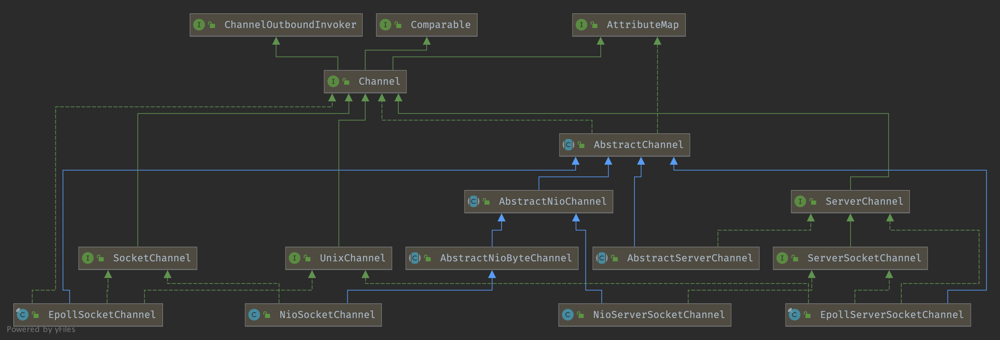

## Introduction


### Channel Hierarchy




## Channel

```java
public interface Channel extends AttributeMap, ChannelOutboundInvoker, Comparable<Channel> {

    // Returns the globally unique identifier of this {@link Channel}.
    ChannelId id();

    // Return the {@link EventLoop} this {@link Channel} was registered to.
    EventLoop eventLoop();

    // Returns the parent of this channel.
    Channel parent();

    // Returns the configuration of this channel.
    ChannelConfig config();

    // Returns {@code true} if the {@link Channel} is open and may get active later
    boolean isOpen();

    // Returns {@code true} if the {@link Channel} is registered with an {@link EventLoop}.
    boolean isRegistered();

    // Return {@code true} if the {@link Channel} is active and so connected.
    boolean isActive();

    // Return the {@link ChannelMetadata} of the {@link Channel} which describe the nature of the {@link Channel}.
    ChannelMetadata metadata();

    /**
     * Returns the local address where this channel is bound to.  The returned
     * {@link SocketAddress} is supposed to be down-cast into more concrete
     * type such as {@link InetSocketAddress} to retrieve the detailed
     * information.
     */
    SocketAddress localAddress();

    /**
     * Returns the remote address where this channel is connected to.  The
     * returned {@link SocketAddress} is supposed to be down-cast into more
     * concrete type such as {@link InetSocketAddress} to retrieve the detailed
     * information.
     */
    SocketAddress remoteAddress();

    /**
     * Returns the {@link ChannelFuture} which will be notified when this
     * channel is closed.  This method always returns the same future instance.
     */
    ChannelFuture closeFuture();

    /**
     * Returns {@code true} if and only if the I/O thread will perform the
     * requested write operation immediately.  Any write requests made when
     * this method returns {@code false} are queued until the I/O thread is
     * ready to process the queued write requests.
     */
    boolean isWritable();

    /**
     * Get how many bytes can be written until {@link #isWritable()} returns {@code false}.
     * This quantity will always be non-negative. If {@link #isWritable()} is {@code false} then 0.
     */
    long bytesBeforeUnwritable();

    /**
     * Get how many bytes must be drained from underlying buffers until {@link #isWritable()} returns {@code true}.
     * This quantity will always be non-negative. If {@link #isWritable()} is {@code true} then 0.
     */
    long bytesBeforeWritable();

    // Returns an <em>internal-use-only</em> object that provides unsafe operations.
    Unsafe unsafe();

    // Return the assigned {@link ChannelPipeline}.
    ChannelPipeline pipeline();

    // Return the assigned {@link ByteBufAllocator} which will be used to allocate {@link ByteBuf}s.
    ByteBufAllocator alloc();

    @Override
    Channel read();

    @Override
    Channel flush();

    
}
```


register in AbstractChannel


```java
//AbstractNioChannel#doRegister()
protected void doRegister() throws Exception {
    boolean selected = false;
    for (;;) {
        try {
            selectionKey = javaChannel().register(eventLoop().unwrappedSelector(), 0, this);
            return;
        } catch (CancelledKeyException e) {
            if (!selected) {
                // Force the Selector to select now as the "canceled" SelectionKey may still be
                // cached and not removed because no Select.select(..) operation was called yet.
                eventLoop().selectNow();
                selected = true;
            } else {
                // We forced a select operation on the selector before but the SelectionKey is still cached
                // for whatever reason. JDK bug ?
                throw e;
            }
        }
    }
}
```

### SocketChannel

read


```java
    protected int doReadBytes(ByteBuf byteBuf) throws Exception {
        final RecvByteBufAllocator.Handle allocHandle = unsafe().recvBufAllocHandle();
        allocHandle.attemptedBytesRead(byteBuf.writableBytes());
        return byteBuf.writeBytes(javaChannel(), allocHandle.attemptedBytesRead());
    }
```
write

```java

    protected int doWriteBytes(ByteBuf buf) throws Exception {
        final int expectedWrittenBytes = buf.readableBytes();
        return buf.readBytes(javaChannel(), expectedWrittenBytes);
    }

    protected long doWriteFileRegion(FileRegion region) throws Exception {
        final long position = region.transferred();
        return region.transferTo(javaChannel(), position);
    }
```

### ServerChannel

accept Socket and return new SocketChannel

Unsupported Write
```java
    @Override
    protected int doReadMessages(List<Object> buf) throws Exception {
        SocketChannel ch = SocketUtils.accept(javaChannel());

        try {
            if (ch != null) {
                buf.add(new NioSocketChannel(this, ch));
                return 1;
            }
        } catch (Throwable t) {
            logger.warn("Failed to create a new channel from an accepted socket.", t);

            try {
                ch.close();
            } catch (Throwable t2) {
                logger.warn("Failed to close a socket.", t2);
            }
        }

        return 0;
    }

```


#### isWritable

See `WriteBufferWaterMark`

```java
@Override
public boolean isWritable() {
    ChannelOutboundBuffer buf = unsafe.outboundBuffer();
    return buf != null && buf.isWritable();
}
```


## Unsafe

Unsafe operations that should never be called from user-code. These methods are only provided to implement the actual transport, and must be invoked from an I/O thread except for the following methods:

- localAddress()
- remoteAddress()
- closeForcibly()
- register(EventLoop, ChannelPromise)
- deregister(ChannelPromise)
- voidPromise()

```java
interface Unsafe {

    /**
     * Return the assigned {@link RecvByteBufAllocator.Handle} which will be used to allocate {@link ByteBuf}'s when
     * receiving data.
     */
    RecvByteBufAllocator.Handle recvBufAllocHandle();

    // Return the {@link SocketAddress} to which is bound local or null if none.
    SocketAddress localAddress();

    // Return the {@link SocketAddress} to which is bound remote or null if none is bound yet.
    SocketAddress remoteAddress();

    /**
     * Register the {@link Channel} of the {@link ChannelPromise} and notify
     * the {@link ChannelFuture} once the registration was complete.
     */
    void register(EventLoop eventLoop, ChannelPromise promise);

    // Bind the SocketAddress to the {@link Channel} of the ChannelPromise and notify it once its done.
    void bind(SocketAddress localAddress, ChannelPromise promise);

    /**
     * Connect the {@link Channel} of the given {@link ChannelFuture} with the given remote {@link SocketAddress}.
     * If a specific local {@link SocketAddress} should be used it need to be given as argument. Otherwise just
     * pass {@code null} to it.
     *
     * The {@link ChannelPromise} will get notified once the connect operation was complete.
     */
    void connect(SocketAddress remoteAddress, SocketAddress localAddress, ChannelPromise promise);

    /**
     * Disconnect the {@link Channel} of the {@link ChannelFuture} and notify the {@link ChannelPromise} once the
     * operation was complete.
     */
    void disconnect(ChannelPromise promise);

    /**
     * Close the {@link Channel} of the {@link ChannelPromise} and notify the {@link ChannelPromise} once the
     * operation was complete.
     */
    void close(ChannelPromise promise);

    /**
     * Closes the {@link Channel} immediately without firing any events.  Probably only useful
     * when registration attempt failed.
     */
    void closeForcibly();

    /**
     * Deregister the {@link Channel} of the {@link ChannelPromise} from {@link EventLoop} and notify the
     * {@link ChannelPromise} once the operation was complete.
     */
    void deregister(ChannelPromise promise);

    /**
     * Schedules a read operation that fills the inbound buffer of the first {@link ChannelInboundHandler} in the
     * {@link ChannelPipeline}.  If there's already a pending read operation, this method does nothing.
     */
    void beginRead();

    // Schedules a write operation.
    void write(Object msg, ChannelPromise promise);

    /**
     * Flush out all write operations scheduled via {@link #write(Object, ChannelPromise)}.
     */
    void flush();

    /**
     * Return a special ChannelPromise which can be reused and passed to the operations in {@link Unsafe}.
     * It will never be notified of a success or error and so is only a placeholder for operations
     * that take a {@link ChannelPromise} as argument but for which you not want to get notified.
     */
    ChannelPromise voidPromise();

    /**
     * Returns the {@link ChannelOutboundBuffer} of the {@link Channel} where the pending write requests are stored.
     */
    ChannelOutboundBuffer outboundBuffer();
}
```

### register

submit a Runnable of `register0` to [EventLoop](/docs/CS/Framework/Netty/Eventloop.md?id=execute).

```java
//AbstractChannel$AbstracrUnsafe#register()
@Override
public final void register(EventLoop eventLoop, final ChannelPromise promise) {
    //ignore assertion

    AbstractChannel.this.eventLoop = eventLoop;
    if (eventLoop.inEventLoop()) {
        register0(promise);
    } else {
        try {
            eventLoop.execute(new Runnable() {
                @Override
                public void run() {
                    register0(promise);
                }
            });
        } catch (Throwable t) {
            closeForcibly();
            closeFuture.setClosed();
            safeSetFailure(promise, t);
        }
    }
}
```

**AbstractChannel$AbstracrUnsafe#register0** execute below methods:

1. `doRegister()` by [java.nio.channels.SelectableChannel]() to EventLoop
2. `ChannelPipeline#invokeHandlerAddedIfNeeded()` ensure we call `handlerAdded()` before we actually notify the promise
3. [ChannelPipeline#fireChannelRegistered()](/docs/CS/Framework/Netty/ChannelHandler.md?id=firechannelactive)
4. [AbstractChannel#beginRead()](/docs/CS/Framework/Netty/ChannelHandler.md?id=beginread) or fireChannelActive if active

```java
// AbstractChannel$AbstracrUnsafe
private void register0(ChannelPromise promise) {
    try {
        // check if the channel is still open as it could be closed in the mean time when the register
        // call was outside of the eventLoop
        if (!promise.setUncancellable() || !ensureOpen(promise)) {
            return;
        }
        boolean firstRegistration = neverRegistered;
        doRegister();
        neverRegistered = false;
        registered = true;

        // Ensure we call handlerAdded(...) before we actually notify the promise. This is needed as the
        // user may already fire events through the pipeline in the ChannelFutureListener.
        pipeline.invokeHandlerAddedIfNeeded();

        safeSetSuccess(promise);
        pipeline.fireChannelRegistered();
        // Only fire a channelActive if the channel has never been registered. This prevents firing
        // multiple channel actives if the channel is deregistered and re-registered.
        if (isActive()) {
            if (firstRegistration) {
                pipeline.fireChannelActive();
            } else if (config().isAutoRead()) {
                // This channel was registered before and autoRead() is set. This means we need to begin read
                // again so that we process inbound data.
                //
                // See https://github.com/netty/netty/issues/4805
                beginRead();
            }
        }
    } catch (Throwable t) {
        // Close the channel directly to avoid FD leak.
        closeForcibly();
        closeFuture.setClosed();
        safeSetFailure(promise, t);
    }
}
```


### close

```java
@Override
public final void close(final ChannelPromise promise) {
    assertEventLoop();

    ClosedChannelException closedChannelException = new ClosedChannelException();
    close(promise, closedChannelException, closedChannelException, false);
}

private void close(final ChannelPromise promise, final Throwable cause,
                   final ClosedChannelException closeCause, final boolean notify) {
    if (!promise.setUncancellable()) {
        return;
    }

    if (closeInitiated) {
        if (closeFuture.isDone()) {
            // Closed already.
            safeSetSuccess(promise);
        } else if (!(promise instanceof VoidChannelPromise)) { // Only needed if no VoidChannelPromise.
            // This means close() was called before so we just register a listener and return
            closeFuture.addListener(new ChannelFutureListener() {
                @Override
                public void operationComplete(ChannelFuture future) throws Exception {
                    promise.setSuccess();
                }
            });
        }
        return;
    }

    closeInitiated = true;

    final boolean wasActive = isActive();
    final ChannelOutboundBuffer outboundBuffer = this.outboundBuffer;
    this.outboundBuffer = null; // Disallow adding any messages and flushes to outboundBuffer.
    Executor closeExecutor = prepareToClose();
    if (closeExecutor != null) {
        closeExecutor.execute(new Runnable() {
            @Override
            public void run() {
                try {
                    // Execute the close.
                    doClose0(promise);
                } finally {
                    // Call invokeLater so closeAndDeregister is executed in the EventLoop again!
                    invokeLater(new Runnable() {
                        @Override
                        public void run() {
                            if (outboundBuffer != null) {
                                // Fail all the queued messages
                                outboundBuffer.failFlushed(cause, notify);
                                outboundBuffer.close(closeCause);
                            }
                            fireChannelInactiveAndDeregister(wasActive);
                        }
                    });
                }
            }
        });
    } else {
        try {
            // Close the channel and fail the queued messages in all cases.
            doClose0(promise);
        } finally {
            if (outboundBuffer != null) {
                // Fail all the queued messages.
                outboundBuffer.failFlushed(cause, notify);
                outboundBuffer.close(closeCause);
            }
        }
        if (inFlush0) {
            invokeLater(new Runnable() {
                @Override
                public void run() {
                    fireChannelInactiveAndDeregister(wasActive);
                }
            });
        } else {
            fireChannelInactiveAndDeregister(wasActive);
        }
    }
}

private void doClose0(ChannelPromise promise) {
    try {
        doClose();
        closeFuture.setClosed();
        safeSetSuccess(promise);
    } catch (Throwable t) {
        closeFuture.setClosed();
        safeSetFailure(promise, t);
    }
}

/**
 * Close the {@link Channel}
 */
@Override
protected void doClose() throws Exception {
    javaChannel().close();
}
```


### beginRead

call `SelectionKey.interestOps()`

```java
@Override
public final void beginRead() {
    assertEventLoop();

    if (!isActive()) {
        return;
    }

    try {
        doBeginRead();
    } catch (final Exception e) {
        invokeLater(new Runnable() {
            @Override
            public void run() {
                pipeline.fireExceptionCaught(e);
            }
        });
        close(voidPromise());
    }
}

@Override
protected void doBeginRead() throws Exception {
    // Channel.read() or ChannelHandlerContext.read() was called
    final SelectionKey selectionKey = this.selectionKey;
    if (!selectionKey.isValid()) {
        return;
    }

    readPending = true;

    final int interestOps = selectionKey.interestOps();
    if ((interestOps & readInterestOp) == 0) {
        selectionKey.interestOps(interestOps | readInterestOp);
    }
}
```


### finishConnect 

call ChannelInboundHandler#channelActive() in `fulfillConnectPromise`

```java
// AbstractNioChannel$AbstractNioUnsafe
@Override
public final void finishConnect() {
    // Note this method is invoked by the event loop only if the connection attempt was
    // neither cancelled nor timed out.

    assert eventLoop().inEventLoop();

    try {
        boolean wasActive = isActive();
        doFinishConnect();
        fulfillConnectPromise(connectPromise, wasActive);
    } catch (Throwable t) {
        fulfillConnectPromise(connectPromise, annotateConnectException(t, requestedRemoteAddress));
    } finally {
        // Check for null as the connectTimeoutFuture is only created if a connectTimeoutMillis > 0 is used
        // See https://github.com/netty/netty/issues/1770
        if (connectTimeoutFuture != null) {
            connectTimeoutFuture.cancel(false);
        }
        connectPromise = null;
    }
}

// call ChannelInboundHandler#channelActive()
private void fulfillConnectPromise(ChannelPromise promise, boolean wasActive) {
  if (promise == null) {
    // Closed via cancellation and the promise has been notified already.
    return;
  }

  // Get the state as trySuccess() may trigger an ChannelFutureListener that will close the Channel.
  // We still need to ensure we call fireChannelActive() in this case.
  boolean active = isActive();

  // trySuccess() will return false if a user cancelled the connection attempt.
  boolean promiseSet = promise.trySuccess();

  // Regardless if the connection attempt was cancelled, channelActive() event should be triggered,
  // because what happened is what happened.
  if (!wasActive && active) {
    pipeline().fireChannelActive();
  }

  // If a user cancelled the connection attempt, close the channel, which is followed by channelInactive().
  if (!promiseSet) {
    close(voidPromise());
  }
}
```


## ChannelConfig

- A set of configuration properties of a `Channel`.

  Please down-cast to more specific configuration type such as `SocketChannelConfig` or use `setOptions(Map)` to set the transport-specific properties:

```java
   Channel ch = ...;
   SocketChannelConfig cfg = (SocketChannelConfig) ch.getConfig();
   cfg.setTcpNoDelay(false);
   
```

  ### Option map

  An option map property is a dynamic write-only property which allows the configuration of a `Channel` without down-casting its associated `ChannelConfig`. 
  To update an option map, please call `setOptions(Map)`.

  All [`ChannelConfig` has the following options:

  | Name                                                                                                                           | Associated setter method                                   |
--------------------------------------------------------------------------------------------------------------------------------| ---------------------------------------------------------- |
  | `ChannelOption.CONNECT_TIMEOUT_MILLIS`                                                                                         | `setConnectTimeoutMillis(int)` |
  | `ChannelOption.WRITE_SPIN_COUNT`               | `setWriteSpinCount(int)` |
  | `ChannelOption.WRITE_BUFFER_WATER_MARK` | `setWriteBufferWaterMark(WriteBufferWaterMark)` |
  | `ChannelOption.ALLOCATOR`                             | `setAllocator(ByteBufAllocator)` |
  | `ChannelOption.AUTO_READ`                                                                                                      | `setAutoRead(boolean)` |

  More options are available in the sub-types of `ChannelConfig`. For example, you can configure the parameters which are specific to a TCP/IP socket as explained in `SocketChannelConfig`.


> [!TIP]
> 
> Suggest use childOption(NioChannelOption) rather than  childOption(ChannelOption).

**Deprecated.** Use `MaxMessagesRecvByteBufAllocator` and `MaxMessagesRecvByteBufAllocator.maxMessagesPerRead()`.

Returns the maximum number of messages to read per read loop. a `channelRead()` event. 
If this value is greater than 1, an event loop might attempt to read multiple times to procure multiple messages.

```java
@Deprecated
int getMaxMessagesPerRead();

@Deprecated
ChannelConfig setMaxMessagesPerRead(int maxMessagesPerRead);
```


Returns the maximum loop count for a write operation until `WritableByteChannel.write(ByteBuffer)` returns a non-zero value. 
It is similar to what a spin lock is used for in concurrency programming.
It improves memory utilization and write throughput depending on the platform that JVM runs on. The default value is **`16`**.

```java
int getWriteSpinCount();
```


### WriteBufferWaterMark

WriteBufferWaterMark is used to set low water mark and high water mark for the write buffer.

1. If the number of bytes queued in the write buffer exceeds the high water mark, Channel.isWritable() will start to return false.
2. If the number of bytes queued in the write buffer **exceeds the high water mark and then dropped down below the low water mark**, Channel.isWritable() will start to return true again.

```java
public final class WriteBufferWaterMark {

    private static final int DEFAULT_LOW_WATER_MARK = 32 * 1024;
    private static final int DEFAULT_HIGH_WATER_MARK = 64 * 1024;

    public static final WriteBufferWaterMark DEFAULT =
            new WriteBufferWaterMark(DEFAULT_LOW_WATER_MARK, DEFAULT_HIGH_WATER_MARK, false);
}
```


## ChannelOption

A `ChannelOption` allows to configure a `ChannelConfig` in a type-safe way. 
Which `ChannelOption` is supported depends on the actual implementation of `ChannelConfig` and may depend on the nature of the transport it belongs to.


option是Netty为我们提供的配置选项，它包含但不限于；ChannelOption.SO_BACKLOG、ChannelOption.SO_TIMEOUT、ChannelOption.TCP_NODELAY等，option并不是非的配置，如果不配置也是可以正常启动的。

ChannelOption.SO_BACKLOG

 ChannelOption.SO_BACKLOG对应的是tcp/ip协议listen函数中的backlog参数，函数listen(int socketfd,int backlog)用来初始化服务端可连接队列，服务端处理客户端连接请求是顺序处理的，所以同一时间只能处理一个客户端连接，多个客户端来的时候，服务端将不能处理的客户端连接请求放在队列中等待处理，backlog参数指定了队列的大小

ChannelOption.SO_REUSEADDR 

ChanneOption.SO_REUSEADDR对应于套接字选项中的SO_REUSEADDR，这个参数表示允许重复使用本地地址和端口， 比如，某个服务器进程占用了TCP的80端口进行监听，此时再次监听该端口就会返回错误，使用该参数就可以解决问题，该参数允许共用该端口，这个在服务器程序中比较常使用， 比如某个进程非正常退出，该程序占用的端口可能要被占用一段时间才能允许其他进程使用，而且程序死掉以后，内核一需要一定的时间才能够释放此端口，不设置SO_REUSEADDR就无法正常使用该端口。

ChannelOption.SO_KEEPALIVE 

Channeloption.SO_KEEPALIVE参数对应于套接字选项中的SO_KEEPALIVE，该参数用于设置TCP连接，当设置该选项以后，连接会测试链接的状态，这个选项用于可能长时间没有数据交流的连接。当设置该选项以后，如果在两小时内没有数据的通信时，TCP会自动发送一个活动探测数据报文。

ChannelOption.SO_SNDBUF和ChannelOption.SO_RCVBUF ChannelOption.SO_SNDBUF参数对应于套接字选项中的SO_SNDBUF，ChannelOption.SO_RCVBUF参数对应于套接字选项中的SO_RCVBUF这两个参数用于操作接收缓冲区和发送缓冲区的大小，接收缓冲区用于保存网络协议站内收到的数据，直到应用程序读取成功，发送缓冲区用于保存发送数据，直到发送成功。

ChannelOption.SO_LINGER

 ChannelOption.SO_LINGER参数对应于套接字选项中的SO_LINGER,Linux内核默认的处理方式是当用户调用close（）方法的时候，函数返回，在可能的情况下，尽量发送数据，不一定保证会发生剩余的数据，造成了数据的不确定性，使用SO_LINGER可以阻塞close()的调用时间，直到数据完全发送

ChannelOption.TCP_NODELAY

 ChannelOption.TCP_NODELAY参数对应于套接字选项中的TCP_NODELAY,该参数的使用与Nagle算法有关,Nagle算法是将小的数据包组装为更大的帧然后进行发送，而不是输入一次发送一次,因此在数据包不足的时候会等待其他数据的到了，组装成大的数据包进行发送，虽然该方式有效提高网络的有效负载，但是却造成了延时，而该参数的作用就是禁止使用Nagle算法，使用于小数据即时传输，于TCP_NODELAY相对应的是TCP_CORK，该选项是需要等到发送的数据量最大的时候，一次性发送数据，适用于文件传输。

IP_TOS IP参数，设置IP头部的Type-of-Service字段，用于描述IP包的优先级和QoS选项。

ALLOW_HALF_CLOSURE Netty参数，一个连接的远端关闭时本地端是否关闭，默认值为False。值为False时，连接自动关闭；为True时，触发ChannelInboundHandler的userEventTriggered()方法，事件为ChannelInputShutdownEvent。


Write only support ByteBuf or FileRegion

## Links

- [Netty](/docs/CS/Framework/Netty/Netty.md)