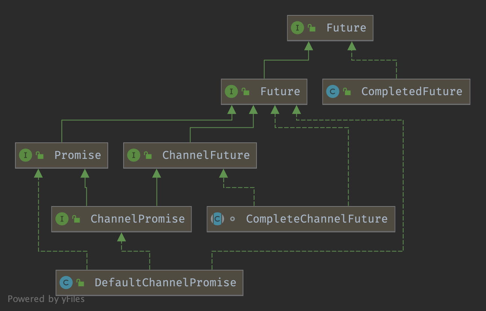

## 

### Future 层级结构



### Future

```java
/**
 * 异步操作的结果。
 */
@SuppressWarnings("ClassNameSameAsAncestorName")
public interface Future<V> extends java.util.concurrent.Future<V> {

    //当且仅当 I/O 操作成功完成时返回 {@code true}。
    boolean isSuccess();

    //当且仅当操作可以通过 {@link #cancel(boolean)} 取消时返回 {@code true}。
    boolean isCancellable();

    //如果 I/O 操作失败，返回失败的原因。
    Throwable cause();

    /**
     * 将指定监听器添加到此 Future 中。
     * 当此 Future {@linkplain #isDone() 完成}时，将通知指定监听器。
     * 如果此 Future 已经完成，则立即通知指定监听器。
     */
    Future<V> addListener(GenericFutureListener<? extends Future<? super V>> listener);

    /**
     * 将指定监听器列表添加到此 Future 中。
     * 当此 Future {@linkplain #isDone() 完成}时，将通知指定监听器。
     * 如果此 Future 已经完成，则立即通知指定监听器。
     */
    Future<V> addListeners(GenericFutureListener<? extends Future<? super V>>... listeners);

    /**
     * 从此 Future 中移除第一个出现的指定监听器。
     * 当此 Future {@linkplain #isDone() 完成}时，不再通知指定监听器。
     * 如果指定监听器未与此 Future 关联，此方法不做任何操作并静默返回。
     */
    Future<V> removeListener(GenericFutureListener<? extends Future<? super V>> listener);

    /**
     * 从此 Future 中移除每个监听器的第一个出现。
     * 当此 Future {@linkplain #isDone() 完成}时，不再通知指定监听器。
     * 如果指定监听器未与此 Future 关联，此方法不做任何操作并静默返回。
     */
    Future<V> removeListeners(GenericFutureListener<? extends Future<? super V>>... listeners);

    /**
     * 等待此 Future 直到完成，如果此 Future 失败则重新抛出失败原因。
     */
    Future<V> sync() throws InterruptedException;

    //等待此 Future 直到完成，如果此 Future 失败则重新抛出失败原因。
    Future<V> syncUninterruptibly();

    //等待此 Future 完成。
    Future<V> await() throws InterruptedException;

    /**
     * 等待此 Future 完成，不可中断。
     * 此方法捕获 {@link InterruptedException} 并静默丢弃。
     */
    Future<V> awaitUninterruptibly();

    //等待此 Future 在指定时间限制内完成。
    boolean await(long timeout, TimeUnit unit) throws InterruptedException;

    //等待此 Future 在指定时间限制内完成。
    boolean await(long timeoutMillis) throws InterruptedException;

    /**
     * 等待此 Future 在指定时间限制内完成，不可中断。
     * 此方法捕获 {@link InterruptedException} 并静默丢弃。
     *
     * @return 当且仅当 Future 在指定时间限制内完成时返回 {@code true}
     */
    boolean awaitUninterruptibly(long timeout, TimeUnit unit);

    /**
     * 等待此 Future 在指定时间限制内完成，不可中断。
     * 此方法捕获 {@link InterruptedException} 并静默丢弃。
     *
     * @return 当且仅当 Future 在指定时间限制内完成时返回 {@code true}
     */
    boolean awaitUninterruptibly(long timeoutMillis);

    /**
     * 不阻塞地返回结果。如果 Future 尚未完成则返回 {@code null}。
     *
     * 由于 {@code null} 值可能用于标记 Future 成功完成，你还需要通过 {@link #isDone()} 检查 Future 是否真正完成，
     * 不要仅依赖返回的 {@code null} 值。
     */
    V getNow();

    /**
     * {@inheritDoc}
     *
     * 如果取消成功，将使用 {@link CancellationException} 使 Future 失败。
     */
    @Override
    boolean cancel(boolean mayInterruptIfRunning);
}
```


### ChannelFuture

```java
/**
*                                      +---------------------------+
*                                      | Completed successfully    |
*                                      +---------------------------+
*                                 +---->      isDone() = true      |
* +--------------------------+    |    |   isSuccess() = true      |
* |        Uncompleted       |    |    +===========================+
* +--------------------------+    |    | Completed with failure    |
* |      isDone() = false    |    |    +---------------------------+
* |   isSuccess() = false    |----+---->      isDone() = true      |
* | isCancelled() = false    |    |    |       cause() = non-null  |
* |       cause() = null     |    |    +===========================+
* +--------------------------+    |    | Completed by cancellation |
*                                 |    +---------------------------+
*                                 +---->      isDone() = true      |
*                                      | isCancelled() = true      |
*                                      +---------------------------+
*/
```


### Promise

**可写入的特殊 Future。**

```java
public interface Promise<V> extends Future<V> {

    //将 Future 标记为成功并通知所有监听器。
    Promise<V> setSuccess(V result);

    //将 Future 标记为成功并通知所有监听器。
    boolean trySuccess(V result);

    //将 Future 标记为失败并通知所有监听器。
    Promise<V> setFailure(Throwable cause);

    //将 Future 标记为失败并通知所有监听器。
    boolean tryFailure(Throwable cause);

    //使此 Future 不可取消。
    boolean setUncancellable();

    @Override
    Promise<V> addListener(GenericFutureListener<? extends Future<? super V>> listener);

    @Override
    Promise<V> addListeners(GenericFutureListener<? extends Future<? super V>>... listeners);

    @Override
    Promise<V> removeListener(GenericFutureListener<? extends Future<? super V>> listener);

    @Override
    Promise<V> removeListeners(GenericFutureListener<? extends Future<? super V>>... listeners);

    @Override
    Promise<V> await() throws InterruptedException;

    @Override
    Promise<V> awaitUninterruptibly();

    @Override
    Promise<V> sync() throws InterruptedException;

    @Override
    Promise<V> syncUninterruptibly();
}
```


### ChannelPromise

**可写入的特殊 ChannelFuture。**

在 [Bootstrap-bind-register](/docs/CS/Framework/Netty/Bootstrap.md?id=register) 中使用

```java
public interface ChannelPromise extends ChannelFuture, Promise<Void> {
    ChannelPromise setSuccess();

    boolean trySuccess();

    //如果 isVoid() 返回 true 则返回一个新的 ChannelPromise，否则返回自身。
    ChannelPromise unvoid();
  
  	...
}
```


### AbstractFuture

AbstractFuture 提供了两个 get 方法

```java
public abstract class AbstractFuture<V> implements Future<V> {

    @Override
    public V get() throws InterruptedException, ExecutionException {
        await();

        Throwable cause = cause();
        if (cause == null) {
            return getNow();
        }
        if (cause instanceof CancellationException) {
            throw (CancellationException) cause;
        }
        throw new ExecutionException(cause);
    }

    @Override
    public V get(long timeout, TimeUnit unit) throws InterruptedException, ExecutionException, TimeoutException {
        if (await(timeout, unit)) {
            Throwable cause = cause();
            if (cause == null) {
                return getNow();
            }
            if (cause instanceof CancellationException) {
                throw (CancellationException) cause;
            }
            throw new ExecutionException(cause);
        }
        throw new TimeoutException();
    }
}
```

### DefaultPromise

DefaultPromise#await()

```java
@Override
public Promise<V> await() throws InterruptedException {
    if (isDone()) {
        return this;
    }

    if (Thread.interrupted()) {
        throw new InterruptedException(toString());
    }

    checkDeadLock();

    synchronized (this) {
        while (!isDone()) {
            incWaiters();
            try {
                wait();
            } finally {
                decWaiters();
            }
        }
    }
    return this;
}
```


```java
protected void checkDeadLock() {
    EventExecutor e = executor();
    if (e != null && e.inEventLoop()) {
        throw new BlockingOperationException(toString());
    }
}
```


DefaultPromise#addListener

```java
@Override
public Promise<V> addListener(GenericFutureListener<? extends Future<? super V>> listener) {
    checkNotNull(listener, "listener");

    synchronized (this) {
        addListener0(listener);
    }

    if (isDone()) {
        notifyListeners();
    }

    return this;
}

private void addListener0(GenericFutureListener<? extends Future<? super V>> listener) {
    if (listeners == null) {
        listeners = listener;
    } else if (listeners instanceof DefaultFutureListeners) {
        ((DefaultFutureListeners) listeners).add(listener);
    } else {
        listeners = new DefaultFutureListeners((GenericFutureListener<?>) listeners, listener);
    }
}

private void notifyListeners() {
    EventExecutor executor = executor();
    if (executor.inEventLoop()) {
        final InternalThreadLocalMap threadLocals = InternalThreadLocalMap.get();
        final int stackDepth = threadLocals.futureListenerStackDepth();
        if (stackDepth < MAX_LISTENER_STACK_DEPTH) {
            threadLocals.setFutureListenerStackDepth(stackDepth + 1);
            try {
                notifyListenersNow();
            } finally {
                threadLocals.setFutureListenerStackDepth(stackDepth);
            }
            return;
        }
    }

    safeExecute(executor, new Runnable() {
        @Override
        public void run() {
            notifyListenersNow();
        }
    });
}
```


### DefaultChannelPromise

默认的 ChannelPromise 实现。建议使用 `Channel.newPromise()` 创建新的 ChannelPromise，而不是直接调用构造函数。

```java
public class DefaultChannelPromise extends DefaultPromise<Void> implements ChannelPromise, FlushCheckpoint {

    private final Channel channel;
    private long checkpoint;
 ... 
}
```


## Links

- [Netty](/docs/CS/Framework/Netty/Netty.md)


## References
1. [method io.netty.util.concurrent.DefaultPromise#cancel/isDone violates contract?](https://github.com/netty/netty/issues/7712)
